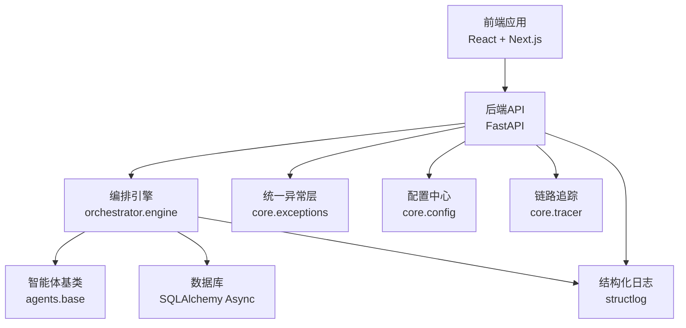
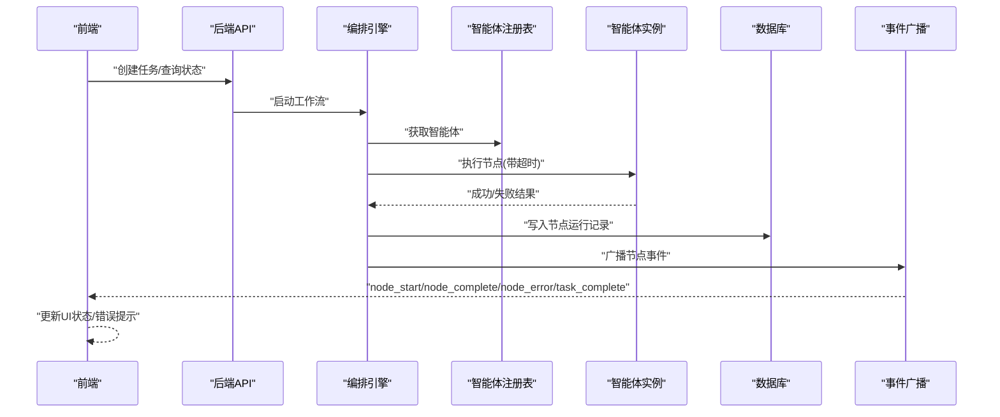
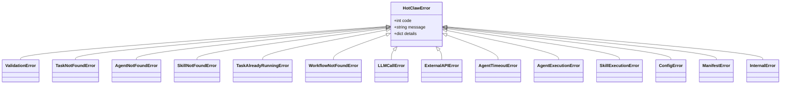
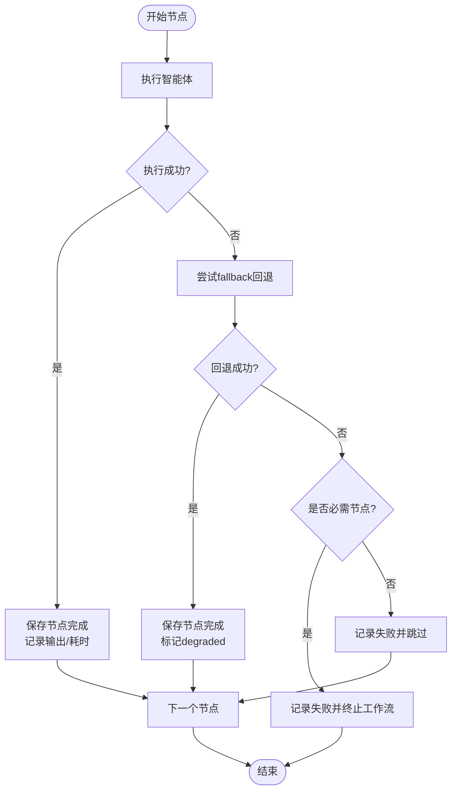
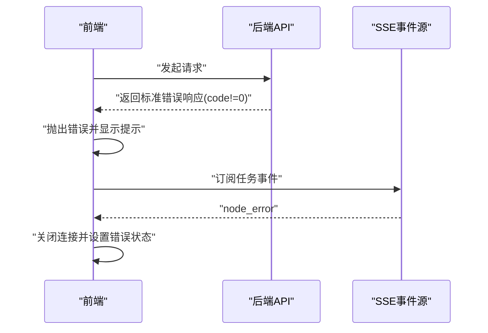
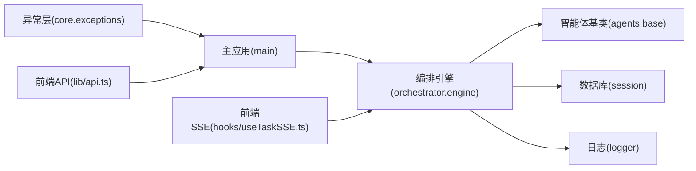

# 错误处理与故障排查

<cite>
**本文引用的文件**
- [backend/app/core/exceptions.py](file://backend/app/core/exceptions.py)
- [backend/app/main.py](file://backend/app/main.py)
- [backend/app/core/logger.py](file://backend/app/core/logger.py)
- [backend/app/core/tracer.py](file://backend/app/core/tracer.py)
- [backend/app/core/config.py](file://backend/app/core/config.py)
- [backend/app/schemas/common.py](file://backend/app/schemas/common.py)
- [backend/app/db/session.py](file://backend/app/db/session.py)
- [backend/app/models/tables.py](file://backend/app/models/tables.py)
- [backend/app/orchestrator/engine.py](file://backend/app/orchestrator/engine.py)
- [backend/app/agents/base.py](file://backend/app/agents/base.py)
- [backend/app/agents/audit_agent.py](file://backend/app/agents/audit_agent.py)
- [backend/app/api/agent_routes.py](file://backend/app/api/agent_routes.py)
- [frontend/lib/api.ts](file://frontend/lib/api.ts)
- [frontend/hooks/useTaskSSE.ts](file://frontend/hooks/useTaskSSE.ts)
</cite>

## 目录
1. [简介](#简介)
2. [项目结构](#项目结构)
3. [核心组件](#核心组件)
4. [架构总览](#架构总览)
5. [详细组件分析](#详细组件分析)
6. [依赖分析](#依赖分析)
7. [性能考虑](#性能考虑)
8. [故障排查指南](#故障排查指南)
9. [结论](#结论)
10. [附录](#附录)

## 简介
本文件面向HotClaw项目的开发者，系统化梳理错误处理与故障排查体系，覆盖异常分类与处理策略、降级策略实现、错误恢复机制（重试、超时、资源清理）、以及端到端的故障排查流程与常见问题处置方案。文档以代码为依据，结合架构图与流程图，帮助快速定位问题、理解错误传播路径，并给出可操作的优化建议。

## 项目结构
HotClaw采用前后端分离架构：
- 后端基于FastAPI，统一异常处理、结构化日志与链路追踪；工作流编排引擎按节点顺序调度智能体，支持超时控制与降级回退。
- 前端通过REST API与SSE事件流消费任务执行状态，提供实时可视化反馈。

图表来源
- [backend/app/main.py:1-142](file://backend/app/main.py#L1-L142)
- [backend/app/orchestrator/engine.py:1-285](file://backend/app/orchestrator/engine.py#L1-L285)
- [backend/app/agents/base.py:1-99](file://backend/app/agents/base.py#L1-L99)
- [backend/app/db/session.py:1-33](file://backend/app/db/session.py#L1-L33)
- [backend/app/core/logger.py:1-36](file://backend/app/core/logger.py#L1-L36)
- [backend/app/core/exceptions.py:1-125](file://backend/app/core/exceptions.py#L1-L125)
- [backend/app/core/config.py:1-51](file://backend/app/core/config.py#L1-L51)
- [backend/app/core/tracer.py:1-34](file://backend/app/core/tracer.py#L1-L34)

章节来源
- [backend/app/main.py:1-142](file://backend/app/main.py#L1-L142)
- [backend/app/core/logger.py:1-36](file://backend/app/core/logger.py#L1-L36)
- [backend/app/core/tracer.py:1-34](file://backend/app/core/tracer.py#L1-L34)
- [backend/app/core/config.py:1-51](file://backend/app/core/config.py#L1-L51)
- [backend/app/db/session.py:1-33](file://backend/app/db/session.py#L1-L33)
- [backend/app/orchestrator/engine.py:1-285](file://backend/app/orchestrator/engine.py#L1-L285)
- [backend/app/agents/base.py:1-99](file://backend/app/agents/base.py#L1-L99)

## 核心组件
- 统一异常层：定义业务分层的异常类型，便于HTTP状态映射与前端识别。
- 全局异常处理器：将业务异常映射为标准JSON响应，未捕获异常统一返回内部错误。
- 结构化日志：统一日志格式与字段，支持trace_id关联全链路。
- 链路追踪：生成并注入trace_id，贯穿请求与节点执行。
- 编排引擎：按节点顺序执行智能体，内置超时控制与失败降级回退。
- 数据库会话：自动提交/回滚与关闭，保证事务一致性。
- 前端API客户端与SSE钩子：统一错误抛出与实时事件监听。

章节来源
- [backend/app/core/exceptions.py:1-125](file://backend/app/core/exceptions.py#L1-L125)
- [backend/app/main.py:87-129](file://backend/app/main.py#L87-L129)
- [backend/app/core/logger.py:1-36](file://backend/app/core/logger.py#L1-L36)
- [backend/app/core/tracer.py:1-34](file://backend/app/core/tracer.py#L1-L34)
- [backend/app/orchestrator/engine.py:236-243](file://backend/app/orchestrator/engine.py#L236-L243)
- [backend/app/db/session.py:22-33](file://backend/app/db/session.py#L22-L33)
- [frontend/lib/api.ts:14-24](file://frontend/lib/api.ts#L14-L24)
- [frontend/hooks/useTaskSSE.ts:58-120](file://frontend/hooks/useTaskSSE.ts#L58-L120)

## 架构总览
下图展示从请求进入后端，到编排引擎调度智能体、记录节点运行、广播SSE事件，再到前端接收事件的全链路。

图表来源
- [backend/app/main.py:132-136](file://backend/app/main.py#L132-L136)
- [backend/app/orchestrator/engine.py:92-234](file://backend/app/orchestrator/engine.py#L92-L234)
- [backend/app/agents/base.py:64-75](file://backend/app/agents/base.py#L64-L75)
- [backend/app/db/session.py:22-33](file://backend/app/db/session.py#L22-L33)
- [frontend/hooks/useTaskSSE.ts:58-120](file://frontend/hooks/useTaskSSE.ts#L58-L120)

## 详细组件分析

### 异常分类与处理策略
- 分类原则：按业务领域划分（输入校验、冲突、外部/执行、配置、系统），便于统一映射HTTP状态码。
- 处理策略：
  - 已知业务异常：由全局处理器转换为标准错误响应，携带code/message/details。
  - 未捕获异常：记录日志并返回内部错误，开发模式下附加错误详情。
  - 特殊映射：部分业务码映射特定HTTP状态（如未找到、超时）。

图表来源
- [backend/app/core/exceptions.py:4-125](file://backend/app/core/exceptions.py#L4-L125)

章节来源
- [backend/app/core/exceptions.py:14-125](file://backend/app/core/exceptions.py#L14-L125)
- [backend/app/main.py:87-129](file://backend/app/main.py#L87-L129)
- [backend/app/schemas/common.py:14-20](file://backend/app/schemas/common.py#L14-L20)

### 智能体执行异常与降级策略
- 执行异常：节点失败时记录错误信息，必要时触发智能体fallback回退。
- 降级策略：
  - 审核智能体在异常时返回“建议人工复核”的降级结果，标记degraded。
  - fallback默认不处理，可在具体智能体中实现。
- 节点失败影响：若节点为必需，则终止工作流并上报错误；非必需则记录失败但继续后续节点。

图表来源
- [backend/app/orchestrator/engine.py:137-196](file://backend/app/orchestrator/engine.py#L137-L196)
- [backend/app/agents/base.py:77-82](file://backend/app/agents/base.py#L77-L82)
- [backend/app/agents/audit_agent.py:59-66](file://backend/app/agents/audit_agent.py#L59-L66)

章节来源
- [backend/app/orchestrator/engine.py:137-196](file://backend/app/orchestrator/engine.py#L137-L196)
- [backend/app/agents/base.py:77-82](file://backend/app/agents/base.py#L77-L82)
- [backend/app/agents/audit_agent.py:59-66](file://backend/app/agents/audit_agent.py#L59-L66)

### API调用异常与前端处理
- 后端统一返回标准错误响应，前端根据code判断并展示友好提示。
- 前端SSE钩子监听节点事件，遇到错误事件时关闭连接并设置任务错误状态。

图表来源
- [frontend/lib/api.ts:14-24](file://frontend/lib/api.ts#L14-L24)
- [frontend/hooks/useTaskSSE.ts:107-111](file://frontend/hooks/useTaskSSE.ts#L107-L111)
- [backend/app/schemas/common.py:7-12](file://backend/app/schemas/common.py#L7-L12)

章节来源
- [frontend/lib/api.ts:14-24](file://frontend/lib/api.ts#L14-L24)
- [frontend/hooks/useTaskSSE.ts:107-111](file://frontend/hooks/useTaskSSE.ts#L107-L111)
- [backend/app/schemas/common.py:7-12](file://backend/app/schemas/common.py#L7-L12)

### 网络通信异常与SSE事件
- SSE事件用于实时反馈节点状态，前端在onerror时主动关闭连接，避免悬挂。
- 任务完成后广播task_complete并关闭事件源；发生任务级错误时广播task_error。

章节来源
- [frontend/hooks/useTaskSSE.ts:113-119](file://frontend/hooks/useTaskSSE.ts#L113-L119)
- [frontend/hooks/useTaskSSE.ts:102-111](file://frontend/hooks/useTaskSSE.ts#L102-L111)
- [backend/app/orchestrator/engine.py:228-232](file://backend/app/orchestrator/engine.py#L228-L232)

### 超时处理与资源清理
- 超时控制：编排引擎对单个智能体执行设置超时阈值，超过则视为超时失败。
- 资源清理：数据库会话在finally阶段关闭，异常时回滚；SSE连接在错误时关闭。

章节来源
- [backend/app/orchestrator/engine.py:236-243](file://backend/app/orchestrator/engine.py#L236-L243)
- [backend/app/db/session.py:22-33](file://backend/app/db/session.py#L22-L33)
- [frontend/hooks/useTaskSSE.ts:113-119](file://frontend/hooks/useTaskSSE.ts#L113-L119)

### 日志与追踪
- 结构化日志：统一JSON格式，包含时间戳、级别、模块、消息与上下文。
- 追踪ID：中间件生成并注入响应头，编排引擎与智能体使用上下文变量传递trace_id，便于跨模块关联。

章节来源
- [backend/app/core/logger.py:8-31](file://backend/app/core/logger.py#L8-L31)
- [backend/app/main.py:77-84](file://backend/app/main.py#L77-L84)
- [backend/app/core/tracer.py:10-34](file://backend/app/core/tracer.py#L10-L34)
- [backend/app/orchestrator/engine.py:97-98](file://backend/app/orchestrator/engine.py#L97-L98)

## 依赖分析
- 统一异常层被全局异常处理器直接依赖，确保所有业务异常得到一致处理。
- 编排引擎依赖智能体基类与注册表，同时读取数据库配置决定系统提示词与重试/降级配置。
- 前端API客户端与SSE钩子分别依赖后端路由与事件广播。

图表来源
- [backend/app/core/exceptions.py:1-125](file://backend/app/core/exceptions.py#L1-L125)
- [backend/app/main.py:87-129](file://backend/app/main.py#L87-L129)
- [backend/app/orchestrator/engine.py:18-26](file://backend/app/orchestrator/engine.py#L18-L26)
- [backend/app/agents/base.py:11-15](file://backend/app/agents/base.py#L11-L15)
- [backend/app/db/session.py:3-19](file://backend/app/db/session.py#L3-L19)
- [frontend/lib/api.ts:14-24](file://frontend/lib/api.ts#L14-L24)
- [frontend/hooks/useTaskSSE.ts:58-120](file://frontend/hooks/useTaskSSE.ts#L58-L120)

章节来源
- [backend/app/core/exceptions.py:1-125](file://backend/app/core/exceptions.py#L1-L125)
- [backend/app/main.py:87-129](file://backend/app/main.py#L87-L129)
- [backend/app/orchestrator/engine.py:18-26](file://backend/app/orchestrator/engine.py#L18-L26)
- [frontend/lib/api.ts:14-24](file://frontend/lib/api.ts#L14-L24)
- [frontend/hooks/useTaskSSE.ts:58-120](file://frontend/hooks/useTaskSSE.ts#L58-L120)

## 性能考虑
- 超时阈值：通过配置项控制智能体、技能与LLM调用超时，避免长时间阻塞。
- 连接池预热与健康检查：异步引擎在非SQLite环境下启用连接池预热，提升稳定性。
- 日志开销：生产环境建议提高日志级别，减少高频率结构化日志写入。

章节来源
- [backend/app/core/config.py:42-45](file://backend/app/core/config.py#L42-L45)
- [backend/app/db/session.py:8-13](file://backend/app/db/session.py#L8-L13)
- [backend/app/core/logger.py:10-30](file://backend/app/core/logger.py#L10-L30)

## 故障排查指南

### 问题定位方法
- 使用trace_id串联请求与节点执行日志，定位具体失败环节。
- 查看节点运行记录表，确认失败节点、错误信息与耗时。
- 检查智能体配置表中的retry_config与fallback_config，确认是否具备降级能力。

章节来源
- [backend/app/core/tracer.py:20-26](file://backend/app/core/tracer.py#L20-L26)
- [backend/app/models/tables.py:48-74](file://backend/app/models/tables.py#L48-L74)
- [backend/app/models/tables.py:160-181](file://backend/app/models/tables.py#L160-L181)

### 日志分析技巧
- 关注结构化日志中的level、module、message与context字段，结合trace_id过滤。
- 在编排引擎节点开始/结束与错误事件处，查看广播消息与持久化记录的一致性。

章节来源
- [backend/app/core/logger.py:12-30](file://backend/app/core/logger.py#L12-L30)
- [backend/app/orchestrator/engine.py:124-132](file://backend/app/orchestrator/engine.py#L124-L132)
- [backend/app/orchestrator/engine.py:168-171](file://backend/app/orchestrator/engine.py#L168-L171)
- [backend/app/orchestrator/engine.py:200-209](file://backend/app/orchestrator/engine.py#L200-L209)

### 常见错误场景与解决方案
- 数据库连接失败
  - 现象：会话yield阶段抛出异常并回滚。
  - 排查：检查数据库URL、连接池参数与目标数据库可用性。
  - 处置：修复连接配置或等待数据库恢复。
  
  章节来源
  - [backend/app/db/session.py:22-33](file://backend/app/db/session.py#L22-L33)

- LLM API调用超时
  - 现象：编排引擎在超时阈值内未收到结果，标记为超时失败。
  - 排查：检查LLM超时配置、网络连通性与第三方服务状态。
  - 处置：延长超时阈值、切换模型或启用重试策略。
  
  章节来源
  - [backend/app/core/config.py:42-45](file://backend/app/core/config.py#L42-L45)
  - [backend/app/orchestrator/engine.py:236-243](file://backend/app/orchestrator/engine.py#L236-L243)

- 实时通信中断（SSE）
  - 现象：前端onerror触发，连接被关闭。
  - 排查：检查后端事件广播是否正常、网络延迟与浏览器限制。
  - 处置：重试订阅、检查代理与防火墙策略。
  
  章节来源
  - [frontend/hooks/useTaskSSE.ts:113-119](file://frontend/hooks/useTaskSSE.ts#L113-L119)

- 智能体执行失败
  - 现象：节点失败，必要节点导致工作流终止。
  - 排查：查看节点运行记录的错误消息，确认是否触发fallback。
  - 处置：完善fallback逻辑或修正输入/上下文。
  
  章节来源
  - [backend/app/orchestrator/engine.py:153-171](file://backend/app/orchestrator/engine.py#L153-L171)
  - [backend/app/agents/audit_agent.py:59-66](file://backend/app/agents/audit_agent.py#L59-L66)

- API调用失败（前端）
  - 现象：后端返回code非0，前端抛出错误。
  - 排查：检查后端全局异常处理器映射与前端错误分支。
  - 处置：根据code提示用户或引导重试。
  
  章节来源
  - [frontend/lib/api.ts:14-24](file://frontend/lib/api.ts#L14-L24)
  - [backend/app/main.py:87-129](file://backend/app/main.py#L87-L129)

### 用户体验保障措施
- 降级提示：审核智能体在异常时返回“建议人工复核”，降低对用户的影响。
- 实时反馈：SSE事件驱动UI即时更新，失败时明确错误信息。
- 统一错误响应：前端按code进行分支处理，避免未知错误导致崩溃。

章节来源
- [backend/app/agents/audit_agent.py:59-66](file://backend/app/agents/audit_agent.py#L59-L66)
- [frontend/hooks/useTaskSSE.ts:91-111](file://frontend/hooks/useTaskSSE.ts#L91-L111)
- [frontend/lib/api.ts:14-24](file://frontend/lib/api.ts#L14-L24)

## 结论
HotClaw通过统一异常层、结构化日志与链路追踪，实现了清晰的错误传播与可观测性；编排引擎内置超时与降级回退，保障了关键路径的韧性；前端通过SSE与统一错误响应，提供了良好的用户体验。建议在生产环境中进一步完善重试策略、监控告警与容量规划，持续优化超时阈值与降级预案。

## 附录

### HTTP状态映射规则
- 1xxx（输入校验/未找到）→ 400/404
- 2xxx（冲突）→ 409
- 3xxx（外部/执行）→ 502
- 4xxx（配置）→ 400
- 5xxx（系统）→ 500
- 特例：AgentTimeoutError → 504

章节来源
- [backend/app/main.py:87-114](file://backend/app/main.py#L87-L114)