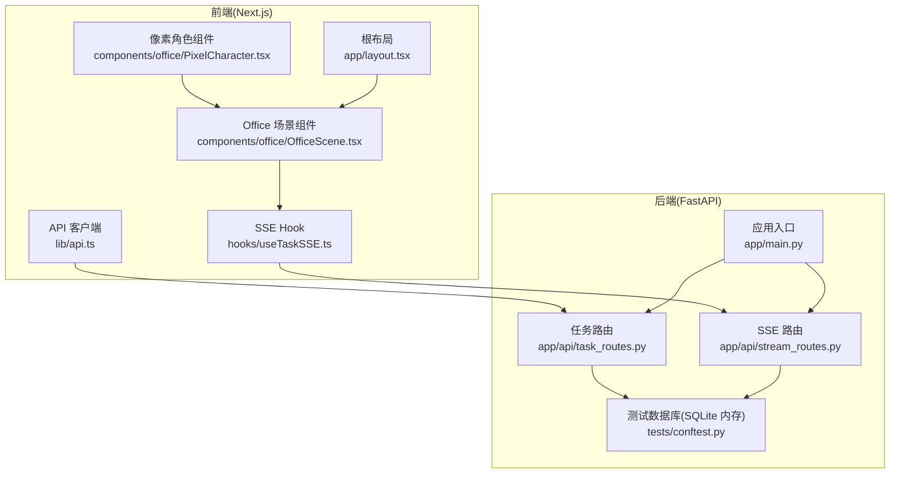
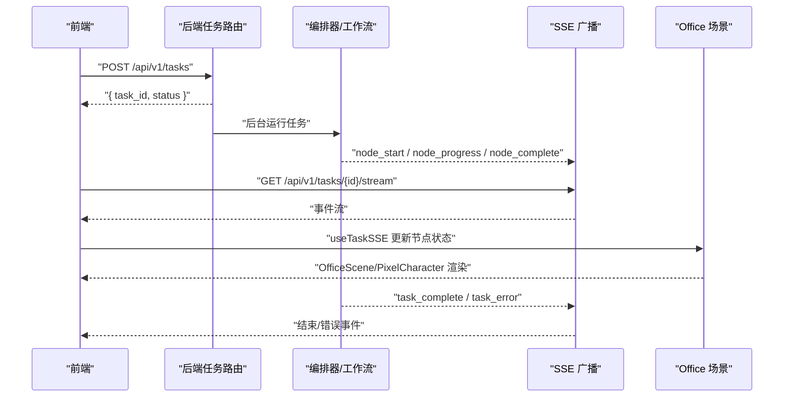
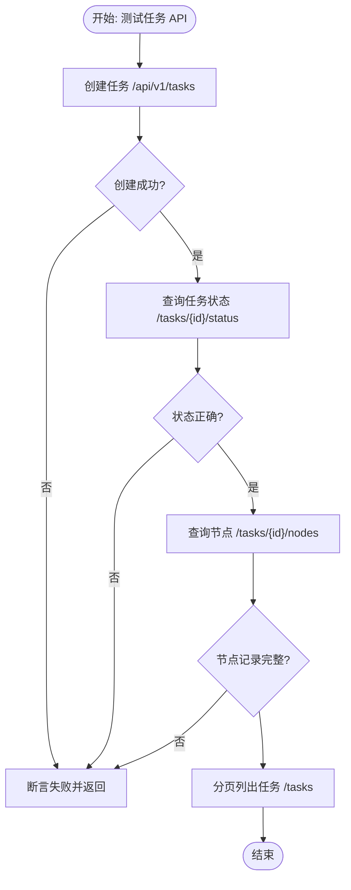
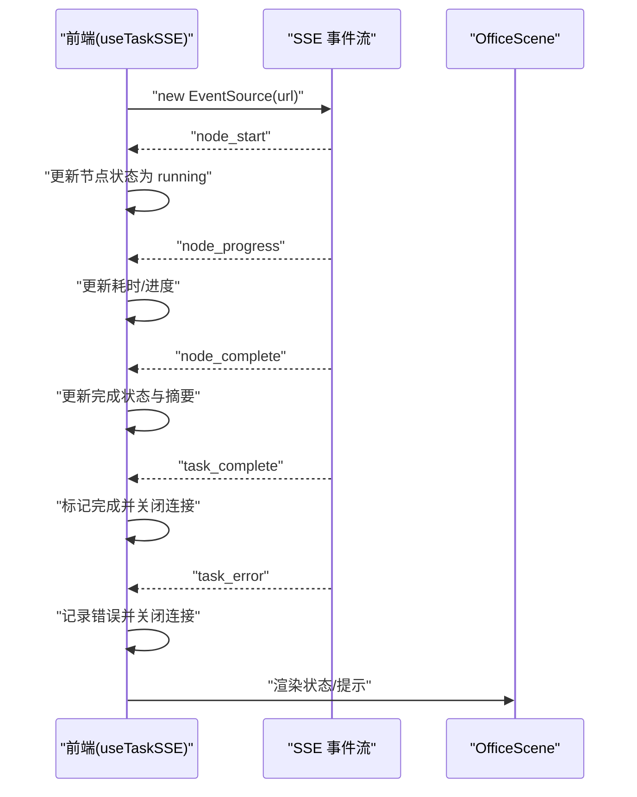
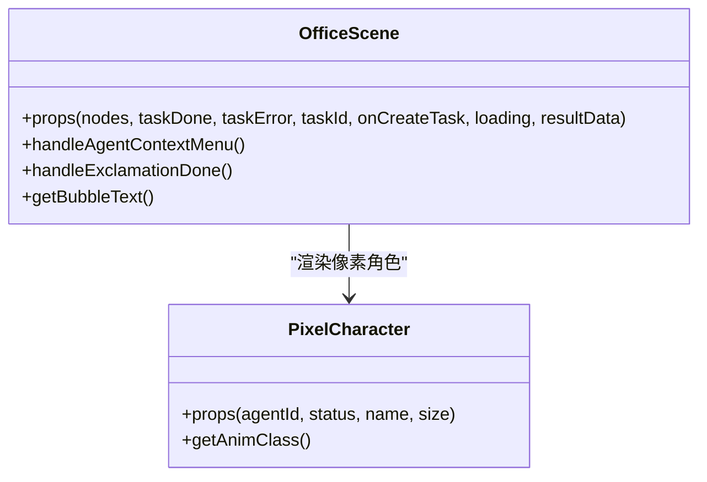
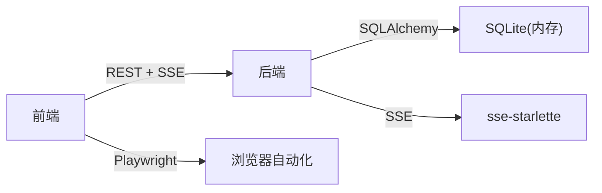

# 集成测试

<cite>
**本文引用的文件**
- [ARCHITECTURE.md](file://ARCHITECTURE.md)
- [frontend/package.json](file://frontend/package.json)
- [backend/pyproject.toml](file://backend/pyproject.toml)
- [backend/app/main.py](file://backend/app/main.py)
- [backend/app/api/task_routes.py](file://backend/app/api/task_routes.py)
- [backend/app/api/stream_routes.py](file://backend/app/api/stream_routes.py)
- [backend/tests/conftest.py](file://backend/tests/conftest.py)
- [backend/tests/test_agent_api.py](file://backend/tests/test_agent_api.py)
- [frontend/lib/api.ts](file://frontend/lib/api.ts)
- [frontend/hooks/useTaskSSE.ts](file://frontend/hooks/useTaskSSE.ts)
- [frontend/components/office/OfficeScene.tsx](file://frontend/components/office/OfficeScene.tsx)
- [frontend/components/office/PixelCharacter.tsx](file://frontend/components/office/PixelCharacter.tsx)
- [frontend/app/layout.tsx](file://frontend/app/layout.tsx)
- [browser_automation.py](file://browser_automation.py)
</cite>

## 目录
1. [简介](#简介)
2. [项目结构](#项目结构)
3. [核心组件](#核心组件)
4. [架构总览](#架构总览)
5. [详细组件分析](#详细组件分析)
6. [依赖分析](#依赖分析)
7. [性能考量](#性能考量)
8. [故障排查指南](#故障排查指南)
9. [结论](#结论)
10. [附录](#附录)

## 简介
本文件为 HotClaw 项目的集成测试实施指南，覆盖前后端端到端测试、实时通信与状态同步验证、前端组件集成测试（Office 场景、像素角色交互、实时状态展示）、测试环境搭建、测试数据准备与场景设计、测试自动化与 CI/CD 集成、以及测试结果分析与最佳实践。目标是帮助开发者建立稳定、可重复、可维护的集成测试体系。

## 项目结构
HotClaw 采用前后端分离架构：前端为 Next.js 应用，后端为 FastAPI 应用，二者通过 REST API 与 Server-Sent Events（SSE）进行交互。系统核心能力包括任务创建、工作流执行、节点状态广播、结果回放与可视化。

图表来源
- [frontend/lib/api.ts:1-110](file://frontend/lib/api.ts#L1-L110)
- [frontend/hooks/useTaskSSE.ts:1-124](file://frontend/hooks/useTaskSSE.ts#L1-L124)
- [frontend/components/office/OfficeScene.tsx:1-428](file://frontend/components/office/OfficeScene.tsx#L1-L428)
- [frontend/components/office/PixelCharacter.tsx:1-83](file://frontend/components/office/PixelCharacter.tsx#L1-L83)
- [frontend/app/layout.tsx:1-16](file://frontend/app/layout.tsx#L1-L16)
- [backend/app/main.py:1-142](file://backend/app/main.py#L1-L142)
- [backend/app/api/task_routes.py:1-163](file://backend/app/api/task_routes.py#L1-L163)
- [backend/app/api/stream_routes.py:1-43](file://backend/app/api/stream_routes.py#L1-L43)
- [backend/tests/conftest.py:1-48](file://backend/tests/conftest.py#L1-L48)

章节来源
- [ARCHITECTURE.md:191-240](file://ARCHITECTURE.md#L191-L240)
- [frontend/package.json:1-23](file://frontend/package.json#L1-L23)
- [backend/pyproject.toml:1-41](file://backend/pyproject.toml#L1-L41)

## 核心组件
- 后端应用与路由
  - 应用入口与中间件：CORS、Trace ID、全局异常处理、路由注册
  - 任务相关路由：创建任务、查询状态、查询节点、分页列出任务
  - SSE 路由：按任务订阅事件流
- 前端 API 客户端与 SSE Hook
  - API 客户端封装统一响应格式与错误抛出
  - SSE Hook 管理 EventSource 生命周期与事件分发
- 前端 Office 场景与像素角色
  - OfficeScene 渲染房间、状态面板、访客面板与结果面板
  - PixelCharacter 根据节点状态渲染不同动画与图标
- 测试基础设施
  - 后端使用 SQLite 内存数据库与依赖注入覆盖，确保测试隔离
  - 前端通过 Playwright 进行浏览器自动化（如飞书配置）

章节来源
- [backend/app/main.py:1-142](file://backend/app/main.py#L1-L142)
- [backend/app/api/task_routes.py:1-163](file://backend/app/api/task_routes.py#L1-L163)
- [backend/app/api/stream_routes.py:1-43](file://backend/app/api/stream_routes.py#L1-L43)
- [frontend/lib/api.ts:1-110](file://frontend/lib/api.ts#L1-L110)
- [frontend/hooks/useTaskSSE.ts:1-124](file://frontend/hooks/useTaskSSE.ts#L1-L124)
- [frontend/components/office/OfficeScene.tsx:1-428](file://frontend/components/office/OfficeScene.tsx#L1-L428)
- [frontend/components/office/PixelCharacter.tsx:1-83](file://frontend/components/office/PixelCharacter.tsx#L1-L83)
- [backend/tests/conftest.py:1-48](file://backend/tests/conftest.py#L1-L48)
- [browser_automation.py:1-29](file://browser_automation.py#L1-L29)

## 架构总览
HotClaw 的集成测试应覆盖以下关键路径：
- 端到端：前端创建任务 → 后端接收并异步执行 → SSE 推送节点状态 → 前端渲染 Office 场景与像素角色
- 实时通信：SSE 事件类型与前端事件监听、错误处理与连接断开
- 状态同步：节点状态、耗时、输出摘要、降级标志与任务完成/错误事件
- 前端组件：Office 场景渲染、像素角色动画、右键菜单、设置抽屉、结果面板

图表来源
- [backend/app/api/task_routes.py:19-52](file://backend/app/api/task_routes.py#L19-L52)
- [backend/app/api/stream_routes.py:14-42](file://backend/app/api/stream_routes.py#L14-L42)
- [frontend/hooks/useTaskSSE.ts:28-123](file://frontend/hooks/useTaskSSE.ts#L28-L123)
- [frontend/components/office/OfficeScene.tsx:62-427](file://frontend/components/office/OfficeScene.tsx#L62-L427)

## 详细组件分析

### API 端到端测试策略
- 测试目标
  - 创建任务成功并返回 task_id
  - 查询任务状态与节点执行记录
  - 分页列出任务
  - Agent/Skill 列表与详情
- 关键断言
  - HTTP 状态码与统一响应 code 字段
  - 任务状态与当前节点索引
  - 节点运行记录字段完整性
- 测试数据
  - 使用内存数据库与依赖注入覆盖，避免真实数据库耦合
  - 通过 fixture 初始化表结构与客户端

图表来源
- [backend/tests/test_agent_api.py:1-28](file://backend/tests/test_agent_api.py#L1-L28)
- [backend/tests/conftest.py:1-48](file://backend/tests/conftest.py#L1-L48)
- [backend/app/api/task_routes.py:54-163](file://backend/app/api/task_routes.py#L54-L163)

章节来源
- [backend/tests/test_agent_api.py:1-28](file://backend/tests/test_agent_api.py#L1-L28)
- [backend/tests/conftest.py:1-48](file://backend/tests/conftest.py#L1-L48)
- [backend/app/api/task_routes.py:1-163](file://backend/app/api/task_routes.py#L1-L163)

### 实时通信与状态同步测试
- 事件类型
  - node_start、node_progress、node_complete、node_error
  - task_complete、task_error
- 前端处理
  - useTaskSSE 订阅 /tasks/{id}/stream
  - 监听事件并更新节点状态、耗时、错误与降级标志
  - 任务完成后关闭连接
- 测试要点
  - 连接建立与断开
  - 事件到达顺序与去重
  - 错误事件触发与 UI 提示
  - 保活心跳与超时处理

图表来源
- [frontend/hooks/useTaskSSE.ts:58-123](file://frontend/hooks/useTaskSSE.ts#L58-L123)
- [frontend/components/office/OfficeScene.tsx:191-221](file://frontend/components/office/OfficeScene.tsx#L191-L221)
- [backend/app/api/stream_routes.py:14-42](file://backend/app/api/stream_routes.py#L14-L42)

章节来源
- [frontend/hooks/useTaskSSE.ts:1-124](file://frontend/hooks/useTaskSSE.ts#L1-L124)
- [frontend/components/office/OfficeScene.tsx:1-428](file://frontend/components/office/OfficeScene.tsx#L1-L428)
- [backend/app/api/stream_routes.py:1-43](file://backend/app/api/stream_routes.py#L1-L43)

### 前端组件集成测试（Office 场景）
- OfficeScene
  - 渲染编辑部背景与 6 个智能体位置
  - 根据节点状态显示气泡、状态图标与动画
  - 右键菜单与设置抽屉、访客面板、结果面板
- PixelCharacter
  - 根据状态渲染不同动画与图标
- 测试场景
  - 节点状态渲染：pending/running/completed/failed
  - 任务完成/错误状态提示
  - 右键菜单触发与设置抽屉打开
  - 结果面板展示与关闭

图表来源
- [frontend/components/office/OfficeScene.tsx:39-427](file://frontend/components/office/OfficeScene.tsx#L39-L427)
- [frontend/components/office/PixelCharacter.tsx:13-82](file://frontend/components/office/PixelCharacter.tsx#L13-L82)

章节来源
- [frontend/components/office/OfficeScene.tsx:1-428](file://frontend/components/office/OfficeScene.tsx#L1-L428)
- [frontend/components/office/PixelCharacter.tsx:1-83](file://frontend/components/office/PixelCharacter.tsx#L1-L83)

### 像素角色交互测试
- 交互行为
  - 右键菜单：打开智能体设置/查看 Prompt
  - 点击状态图标：进入设置抽屉
  - 任务运行中：角色动画与“工作中”提示
  - 任务完成/失败：角色状态变化与提示
- 测试要点
  - 事件冒泡与防抖
  - 状态图标与气泡文本一致性
  - 设置抽屉打开/关闭与数据回显

章节来源
- [frontend/components/office/OfficeScene.tsx:80-421](file://frontend/components/office/OfficeScene.tsx#L80-L421)
- [frontend/components/office/PixelCharacter.tsx:27-62](file://frontend/components/office/PixelCharacter.tsx#L27-L62)

### 实时状态展示测试
- 数据驱动
  - useTaskSSE 返回 nodes 数组与 taskDone/taskError
  - OfficeScene 基于 nodes 渲染面板与角色
- 断言建议
  - 节点状态顺序与去重
  - 耗时与摘要字段存在性
  - 任务完成/错误事件触发 UI 变化

章节来源
- [frontend/hooks/useTaskSSE.ts:28-123](file://frontend/hooks/useTaskSSE.ts#L28-L123)
- [frontend/components/office/OfficeScene.tsx:224-389](file://frontend/components/office/OfficeScene.tsx#L224-L389)

### 测试环境搭建与数据准备
- 后端
  - 使用 SQLite 内存数据库，测试前创建表，测试后销毁
  - 通过依赖覆盖将数据库会话指向测试引擎
- 前端
  - Next.js 开发服务器启动
  - 如需浏览器自动化，使用 Playwright（示例脚本）
- 环境变量
  - 前端：BASE URL 指向后端 /api/v1
  - 后端：CORS 允许前端 origin（开发环境）

章节来源
- [backend/tests/conftest.py:13-48](file://backend/tests/conftest.py#L13-L48)
- [backend/app/main.py:67-74](file://backend/app/main.py#L67-L74)
- [frontend/lib/api.ts:12-24](file://frontend/lib/api.ts#L12-L24)
- [browser_automation.py:1-29](file://browser_automation.py#L1-L29)

### 测试场景设计
- 场景一：正常端到端
  - 输入账号定位 → 创建任务 → SSE 推送节点状态 → Office 场景渲染 → 任务完成
- 场景二：节点失败降级
  - 某节点失败 → 触发 node_error → 降级输出 → 任务继续 → task_complete
- 场景三：任务级错误
  - 编排器抛出错误 → task_error → 前端错误提示
- 场景四：Office 交互
  - 右键菜单、设置抽屉、结果面板打开/关闭

章节来源
- [backend/app/api/stream_routes.py:18-42](file://backend/app/api/stream_routes.py#L18-L42)
- [frontend/hooks/useTaskSSE.ts:91-111](file://frontend/hooks/useTaskSSE.ts#L91-L111)
- [frontend/components/office/OfficeScene.tsx:403-424](file://frontend/components/office/OfficeScene.tsx#L403-L424)

## 依赖分析
- 前端依赖
  - Next.js、React、TypeScript、TailwindCSS
  - Axios 风格的 fetch 封装、SSE Hook
- 后端依赖
  - FastAPI、SQLAlchemy Async、Alembic、sse-starlette、litellm
  - Pydantic、PyYAML、structlog
- 测试依赖
  - pytest、pytest-asyncio、httpx、SQLAlchemy 异步引擎

图表来源
- [frontend/package.json:11-21](file://frontend/package.json#L11-L21)
- [backend/pyproject.toml:6-22](file://backend/pyproject.toml#L6-L22)
- [backend/tests/conftest.py:13-17](file://backend/tests/conftest.py#L13-L17)
- [browser_automation.py:3-13](file://browser_automation.py#L3-L13)

章节来源
- [frontend/package.json:1-23](file://frontend/package.json#L1-L23)
- [backend/pyproject.toml:1-41](file://backend/pyproject.toml#L1-L41)
- [backend/tests/conftest.py:1-48](file://backend/tests/conftest.py#L1-L48)

## 性能考量
- SSE 连接保持与保活
  - 后端发送注释行作为保活信号，前端应忽略
- 事件风暴与去重
  - 前端按 node_id 去重更新，避免重复渲染
- 数据体积
  - 输出摘要与节点记录字段需控制大小，避免 UI 卡顿
- 并发与资源释放
  - 任务完成后及时关闭 EventSource，释放内存

## 故障排查指南
- 常见问题
  - SSE 连接断开：检查后端广播队列与客户端断开回调
  - 事件缺失：确认编排器是否正确广播 node_start/complete/error
  - Office 场景不更新：检查 useTaskSSE 是否正确订阅与更新状态
  - 测试数据库未清理：确认 conftest 中表创建/销毁逻辑
- 日志与追踪
  - 后端中间件设置 X-Trace-Id，便于跨服务关联
  - 统一异常处理返回结构化错误响应

章节来源
- [backend/app/api/stream_routes.py:18-42](file://backend/app/api/stream_routes.py#L18-L42)
- [frontend/hooks/useTaskSSE.ts:113-123](file://frontend/hooks/useTaskSSE.ts#L113-L123)
- [backend/app/main.py:77-84](file://backend/app/main.py#L77-L84)
- [backend/tests/conftest.py:23-30](file://backend/tests/conftest.py#L23-L30)

## 结论
通过围绕任务创建、SSE 实时事件与 Office 场景渲染的集成测试，可以有效验证 HotClaw 的端到端流程与用户体验。建议在 CI 中引入内存数据库测试与浏览器自动化脚本，持续保障系统稳定性与可维护性。

## 附录
- 测试自动化与 CI/CD 建议
  - 后端：pytest + pytest-asyncio，使用内存数据库与依赖覆盖
  - 前端：Playwright 浏览器自动化（如飞书配置），结合 Next.js 开发服务器
  - CI：前后端分别执行测试，上传测试报告与覆盖率
- 测试数据清理
  - 使用内存数据库并在测试结束后销毁表结构
  - 前端测试结束后关闭 EventSource 与卸载组件
- 最佳实践
  - 测试隔离：每个测试用例独立数据库与会话
  - 依赖管理：通过依赖覆盖替换真实服务（如数据库、LLM）
  - 状态同步：前端以节点状态为单一事实源，避免本地状态漂移
  - 可观测性：统一响应格式、Trace ID、结构化日志