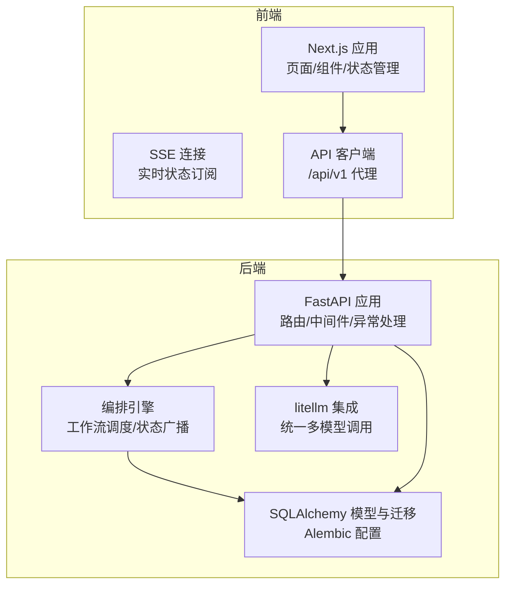
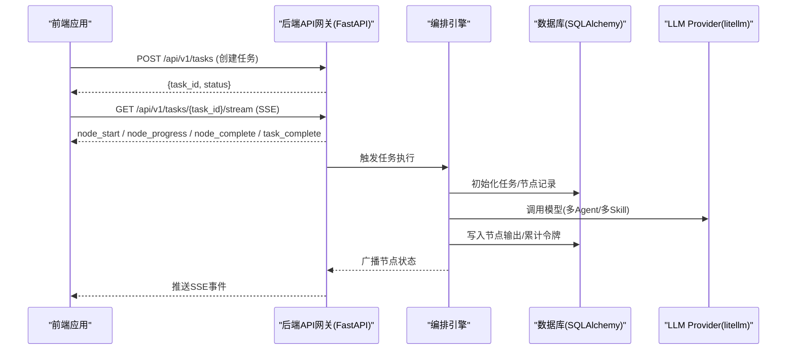
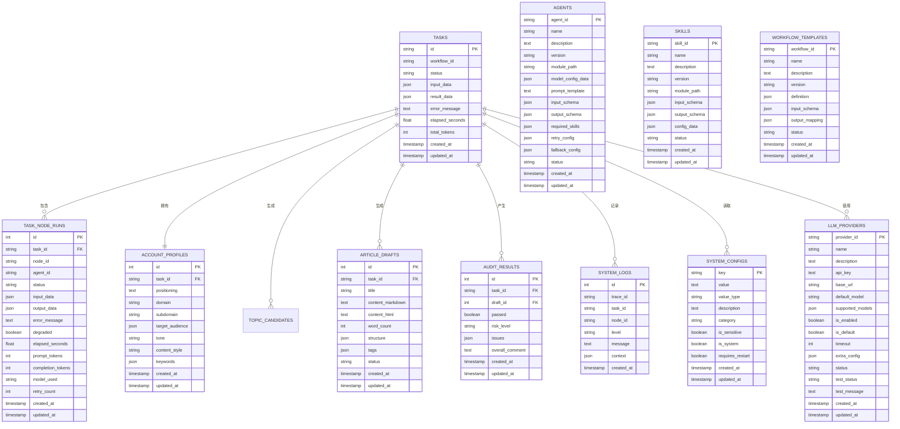
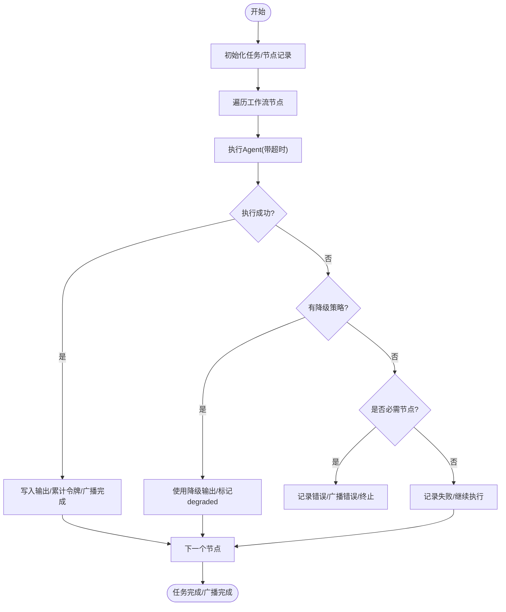
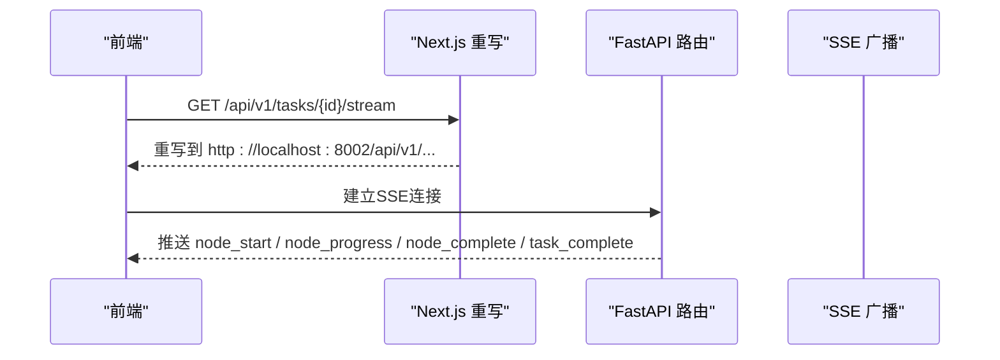
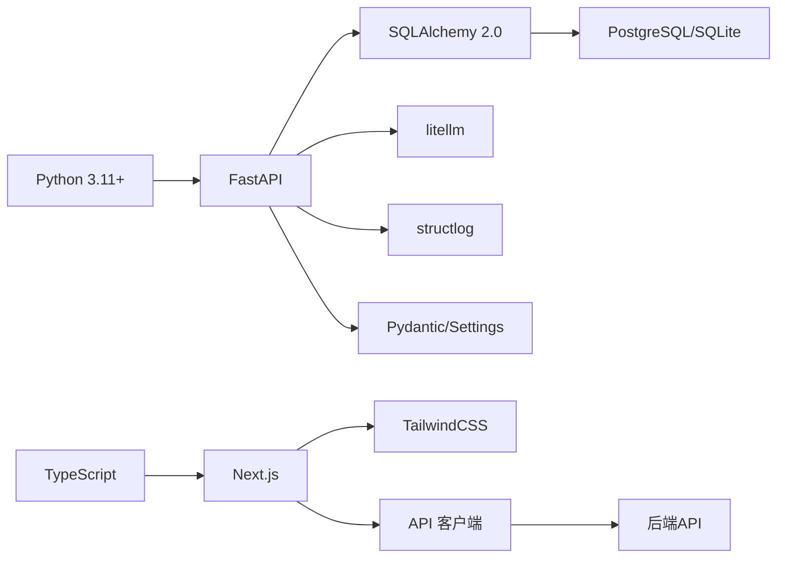

# 技术栈详解

<cite>
**本文引用的文件**   
- [backend/pyproject.toml](file://backend/pyproject.toml)
- [backend/app/main.py](file://backend/app/main.py)
- [backend/app/api/task_routes.py](file://backend/app/api/task_routes.py)
- [backend/app/orchestrator/engine.py](file://backend/app/orchestrator/engine.py)
- [backend/app/models/tables.py](file://backend/app/models/tables.py)
- [backend/alembic.ini](file://backend/alembic.ini)
- [frontend/package.json](file://frontend/package.json)
- [frontend/tsconfig.json](file://frontend/tsconfig.json)
- [frontend/next.config.ts](file://frontend/next.config.ts)
- [frontend/lib/api.ts](file://frontend/lib/api.ts)
- [OpenClaw-bot-review-main/package.json](file://OpenClaw-bot-review-main/package.json)
- [ARCHITECTURE.md](file://ARCHITECTURE.md)
</cite>

## 目录
1. [引言](#引言)
2. [项目结构](#项目结构)
3. [核心组件](#核心组件)
4. [架构总览](#架构总览)
5. [详细组件分析](#详细组件分析)
6. [依赖分析](#依赖分析)
7. [性能考量](#性能考量)
8. [故障排查指南](#故障排查指南)
9. [结论](#结论)
10. [附录](#附录)

## 引言
本文件面向HotClaw技术栈的使用者与维护者，系统阐述后端与前端技术栈的选型理由、版本要求、依赖关系、兼容性与权衡因素，并给出升级路径与替代方案建议。HotClaw是一个“多智能体内容生产平台”，后端采用Python 3.11+、FastAPI、SQLAlchemy与litellm等技术，前端采用React 18、TypeScript、Next.js与TailwindCSS等技术，二者通过HTTP与SSE进行解耦协作。

## 项目结构
- 后端（Python + FastAPI + SQLAlchemy + litellm）位于 backend 目录，提供API网关、工作流编排、智能体与技能执行、数据库模型与迁移等能力。
- 前端（React 18 + TypeScript + Next.js + TailwindCSS）位于 frontend 目录，提供任务创建、运行监控、结果预览、配置管理与历史回放等页面。
- 另有 OpenClaw-bot-review-main 作为OpenClaw生态的仪表盘示例，展示了Next.js+TypeScript+Tailwind的组合与部署方式。

图表来源
- [backend/app/main.py:69-153](file://backend/app/main.py#L69-L153)
- [backend/app/api/task_routes.py:1-179](file://backend/app/api/task_routes.py#L1-L179)
- [backend/app/orchestrator/engine.py:89-285](file://backend/app/orchestrator/engine.py#L89-L285)
- [backend/app/models/tables.py:23-319](file://backend/app/models/tables.py#L23-L319)
- [backend/alembic.ini:1-39](file://backend/alembic.ini#L1-L39)
- [frontend/next.config.ts:1-15](file://frontend/next.config.ts#L1-L15)
- [frontend/lib/api.ts:1-289](file://frontend/lib/api.ts#L1-L289)

章节来源
- [ARCHITECTURE.md:37-78](file://ARCHITECTURE.md#L37-L78)
- [backend/app/main.py:69-153](file://backend/app/main.py#L69-L153)
- [frontend/next.config.ts:1-15](file://frontend/next.config.ts#L1-L15)

## 核心组件
- 后端应用入口与生命周期管理：负责日志初始化、智能体注册、数据库表初始化、CORS与追踪中间件、全局异常处理以及路由注册。
- API路由层：提供任务创建、状态查询、节点明细、任务列表、SSE流等REST接口。
- 编排引擎：按线性工作流顺序调度Agent，管理Workspace上下文，广播节点状态，记录节点执行日志与令牌消耗。
- 数据模型与迁移：定义任务、节点运行、账号画像、候选选题、文章草稿、审核结果、Agent/Skill/工作流模板、系统日志与配置、LLM Provider等表结构，并通过Alembic进行迁移管理。
- LLM Provider与litellm：统一多模型提供商（OpenAI、DashScope、DeepSeek、智谱、Ollama、vLLM等）的访问与测试。
- 前端Next.js应用：通过API客户端与后端交互，使用SSE接收实时状态，页面覆盖任务创建、运行监控、结果预览、配置管理与历史回放。

章节来源
- [backend/app/main.py:34-67](file://backend/app/main.py#L34-L67)
- [backend/app/api/task_routes.py:39-179](file://backend/app/api/task_routes.py#L39-L179)
- [backend/app/orchestrator/engine.py:92-234](file://backend/app/orchestrator/engine.py#L92-L234)
- [backend/app/models/tables.py:23-319](file://backend/app/models/tables.py#L23-L319)
- [backend/alembic.ini:1-39](file://backend/alembic.ini#L1-L39)
- [frontend/lib/api.ts:26-55](file://frontend/lib/api.ts#L26-L55)

## 架构总览
HotClaw采用“前后端分离 + 事件驱动”的架构：前端通过HTTP与SSE与后端交互，后端通过编排引擎驱动多智能体工作流，数据持久化至数据库，日志与追踪贯穿全链路。

图表来源
- [backend/app/api/task_routes.py:39-67](file://backend/app/api/task_routes.py#L39-L67)
- [backend/app/orchestrator/engine.py:124-232](file://backend/app/orchestrator/engine.py#L124-L232)
- [frontend/lib/api.ts:48-55](file://frontend/lib/api.ts#L48-L55)

章节来源
- [ARCHITECTURE.md:325-360](file://ARCHITECTURE.md#L325-L360)

## 详细组件分析

### 后端技术栈与选型
- Python 3.11+：AI生态最成熟，LLM SDK与工具链完备，便于与litellm等库协同。
- FastAPI：异步支持好、自动OpenAPI文档、SSE支持、强类型Schema校验，适合作为API网关与事件广播入口。
- SQLAlchemy 2.0 + alembic：成熟的ORM与异步支持，配合Alembic进行数据库迁移管理。
- litellm：统一多模型提供商接口，支持OpenAI、DashScope、DeepSeek、智谱、Ollama、vLLM等，便于切换与测试。
- Redis/SQLite/PostgreSQL：Redis用于缓存与会话状态，SQLite用于开发与轻量场景，PostgreSQL用于生产数据持久化与迁移。
- structlog/Pydantic/Pydantic-settings：结构化日志与配置校验，保证可观测性与配置一致性。
- sse-starlette：SSE事件推送，满足前端实时状态消费。

章节来源
- [backend/pyproject.toml:1-41](file://backend/pyproject.toml#L1-L41)
- [backend/alembic.ini:1-39](file://backend/alembic.ini#L1-L39)
- [ARCHITECTURE.md:403-413](file://ARCHITECTURE.md#L403-L413)

### 前端技术栈与选型
- React 18 + TypeScript：组件化良好、类型安全、生态成熟，适合构建复杂的可视化与交互界面。
- Next.js：SSR/CSR混合、路由与API路由一体化、静态优化，适配多页面与实时数据场景。
- TailwindCSS：实用优先的CSS框架，快速搭建UI风格与主题切换。
- API代理与SSE：通过Next.js重写将/api/*代理到后端，SSE直连后端避免响应缓冲问题。

章节来源
- [frontend/package.json:1-23](file://frontend/package.json#L1-L23)
- [frontend/tsconfig.json:1-42](file://frontend/tsconfig.json#L1-L42)
- [frontend/next.config.ts:1-15](file://frontend/next.config.ts#L1-L15)
- [frontend/lib/api.ts:48-55](file://frontend/lib/api.ts#L48-L55)

### 数据模型与持久化
- 核心表包括：任务、节点运行、账号画像、候选选题、文章草稿、审核结果、Agent/Skill/工作流模板、系统日志与配置、LLM Provider等。
- 表结构支持任务全链路追踪、节点状态与令牌统计、配置持久化与运行时覆盖、系统日志结构化存储。

图表来源
- [backend/app/models/tables.py:23-319](file://backend/app/models/tables.py#L23-L319)

章节来源
- [backend/app/models/tables.py:23-319](file://backend/app/models/tables.py#L23-L319)

### 编排引擎与工作流
- 线性工作流：MVP阶段采用线性链路（账号解析 → 热点分析 → 选题策划 → 标题生成 → 正文生成 → 审核），后续可扩展为DAG。
- 超时与降级：每个节点带超时控制，失败时尝试降级策略，必要节点失败可中断并广播错误。
- 事件广播：通过SSE向前端推送节点开始、进度、完成、错误与任务完成事件。

图表来源
- [backend/app/orchestrator/engine.py:92-234](file://backend/app/orchestrator/engine.py#L92-L234)

章节来源
- [backend/app/orchestrator/engine.py:92-234](file://backend/app/orchestrator/engine.py#L92-L234)

### API与SSE交互流程
- 前端通过Next.js重写将/api/*代理到后端，SSE直连后端地址避免响应缓冲。
- 后端提供任务创建、状态查询、节点明细、任务列表与SSE流等接口。

图表来源
- [frontend/next.config.ts:4-11](file://frontend/next.config.ts#L4-L11)
- [frontend/lib/api.ts:48-55](file://frontend/lib/api.ts#L48-L55)
- [backend/app/api/task_routes.py:39-67](file://backend/app/api/task_routes.py#L39-L67)

章节来源
- [frontend/next.config.ts:1-15](file://frontend/next.config.ts#L1-L15)
- [frontend/lib/api.ts:1-289](file://frontend/lib/api.ts#L1-L289)
- [backend/app/api/task_routes.py:1-179](file://backend/app/api/task_routes.py#L1-L179)

## 依赖分析
- 后端依赖关系：FastAPI作为入口，依赖SQLAlchemy/alembic进行数据访问与迁移，依赖litellm进行多模型调用，依赖structlog进行结构化日志，依赖Pydantic/Pydantic-settings进行配置与Schema校验。
- 前端依赖关系：Next.js提供页面与路由，TypeScript提供类型安全，TailwindCSS提供样式，API客户端封装后端接口与SSE连接。

图表来源
- [backend/pyproject.toml:6-22](file://backend/pyproject.toml#L6-L22)
- [frontend/package.json:11-21](file://frontend/package.json#L11-L21)

章节来源
- [backend/pyproject.toml:1-41](file://backend/pyproject.toml#L1-L41)
- [frontend/package.json:1-23](file://frontend/package.json#L1-L23)

## 性能考量
- 异步与并发：后端使用FastAPI与SQLAlchemy异步，编排引擎使用asyncio并发调度节点，减少I/O等待。
- SSE实时性：前端SSE直连后端，避免Next.js代理层的响应缓冲，降低延迟。
- 数据库与索引：对trace_id、task_id、node_id建立索引，提升日志与审计查询性能。
- LLM调用：通过litellm统一管理模型与超时，结合降级策略与缓存，提升稳定性与吞吐。
- 前端渲染：Next.js静态优化与组件拆分，减少首屏与交互延迟。

## 故障排查指南
- 健康检查：后端提供健康检查端点，确认服务可用性与版本。
- 全局异常处理：统一捕获HotClawError与未处理异常，返回结构化错误响应。
- 日志与追踪：结构化日志记录trace_id与上下文，便于问题定位。
- 数据库初始化：应用启动时自动创建表并初始化默认系统配置。
- SSE连接：若SSE无事件，检查前端SSE直连地址与后端广播逻辑。

章节来源
- [backend/app/main.py:150-153](file://backend/app/main.py#L150-L153)
- [backend/app/main.py:96-138](file://backend/app/main.py#L96-L138)
- [backend/app/main.py:50-62](file://backend/app/main.py#L50-L62)

## 结论
HotClaw技术栈在后端与前端层面均选择了成熟、高效且生态丰富的技术组合：后端以FastAPI为核心，结合SQLAlchemy与litellm，具备良好的异步能力、可观测性与多模型统一接入；前端以Next.js+TypeScript+Tailwind为基础，配合SSE实现实时状态消费。整体架构清晰、职责分离、易于扩展与维护。

## 附录

### 版本要求与兼容性
- Python：>= 3.11（后端）
- FastAPI：>= 0.115.0
- SQLAlchemy：>= 2.0.0（含asyncio支持）
- alembic：>= 1.14.0
- litellm：>= 1.40.0
- Next.js：^16.2.1
- React：^19.2.4
- TypeScript：^5.9.3
- TailwindCSS：^4.2.2
- Postgres/SQLite：根据环境选择

章节来源
- [backend/pyproject.toml:5-22](file://backend/pyproject.toml#L5-L22)
- [frontend/package.json:11-21](file://frontend/package.json#L11-L21)

### 升级路径与替代方案建议
- 后端升级路径
  - Python：从3.11逐步升级至3.12/3.13，注意第三方库兼容性与CI测试。
  - FastAPI：遵循语义化版本，关注SSE与中间件变更。
  - SQLAlchemy：从2.x升级至3.x时，关注异步API与弃用特性。
  - litellm：关注新模型支持与配置变化，保持统一接口。
  - 数据库：从SQLite迁移到PostgreSQL时，确保迁移脚本与连接字符串一致。
- 前端升级路径
  - Next.js：从16.x升级至17.x/18.x，关注实验性特性的移除与新特性。
  - React：从19.x升级至20.x，关注JSX transform与并发特性。
  - TypeScript：从5.x升级至6.x，关注严格模式与新语法支持。
  - TailwindCSS：从4.x升级至5.x，关注配置迁移与新指令。
- 替代方案
  - Web框架：可考虑Starlette+FastAPI或Tornado（需自行补齐SSE与ORM）。
  - ORM：可考虑Tortoise ORM或Django ORM（需调整异步与迁移策略）。
  - 前端：可考虑Vite+React或Remix（需重新组织路由与API代理）。
  - SSE：可考虑WebSocket（需处理双向通信与连接管理）。

### 使用指南与最佳实践
- 开发环境
  - 后端：使用uvicorn启动，设置DEBUG与CORS策略，确保数据库连接正确。
  - 前端：通过Next.js dev启动，配置/api/*代理到后端，SSE直连后端地址。
- 配置管理
  - 使用Pydantic-settings加载配置，结合SystemConfigs表实现运行时配置覆盖。
  - LLM Provider通过LLMProviders表管理，支持测试与默认Provider切换。
- 可观测性
  - 使用structlog记录结构化日志，包含trace_id、task_id、node_id等上下文。
  - 通过SystemLogs表沉淀审计与回放所需的数据。
- 安全与权限
  - CORS在开发环境允许所有来源，在生产环境限制来源。
  - 对敏感配置（如API Key）进行脱敏与加密存储。

章节来源
- [backend/app/main.py:76-83](file://backend/app/main.py#L76-L83)
- [backend/app/main.py:96-138](file://backend/app/main.py#L96-L138)
- [frontend/next.config.ts:4-11](file://frontend/next.config.ts#L4-L11)
- [frontend/lib/api.ts:48-55](file://frontend/lib/api.ts#L48-L55)
- [backend/app/models/tables.py:220-233](file://backend/app/models/tables.py#L220-L233)