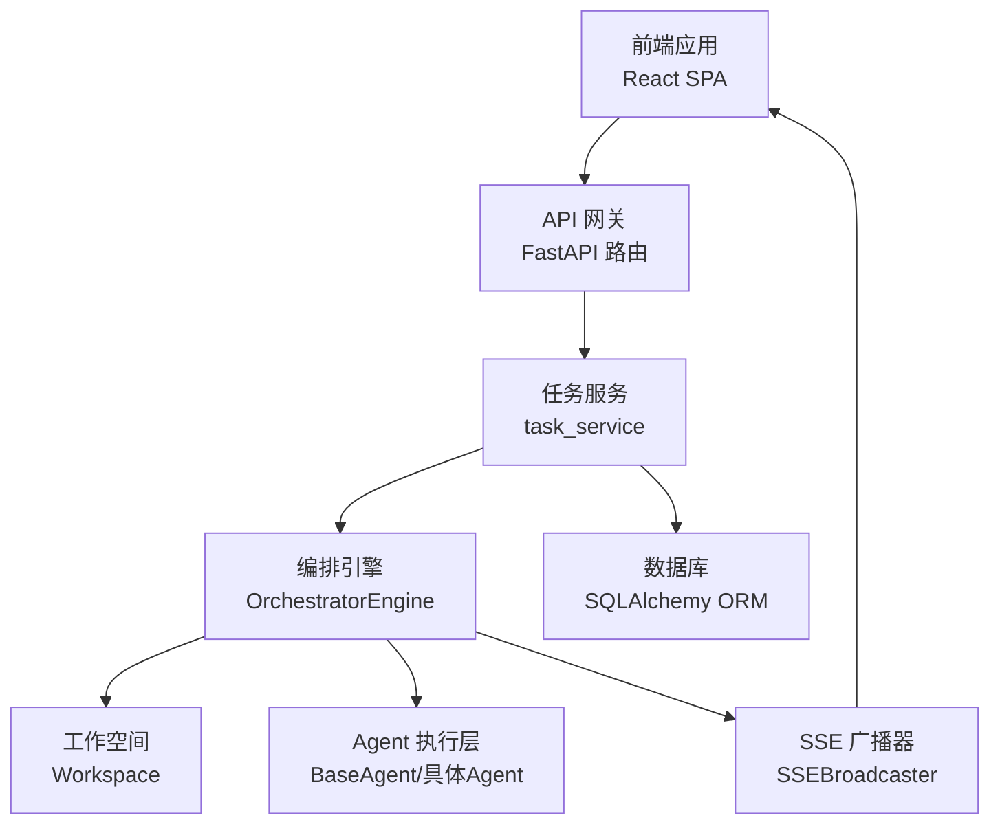
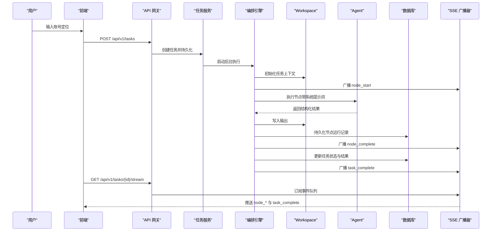
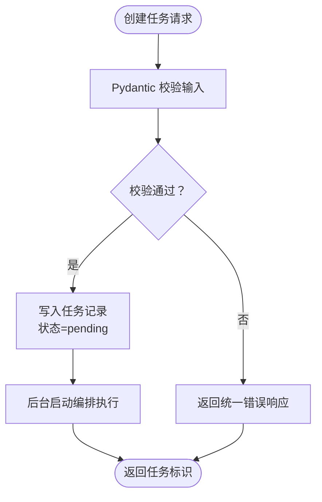
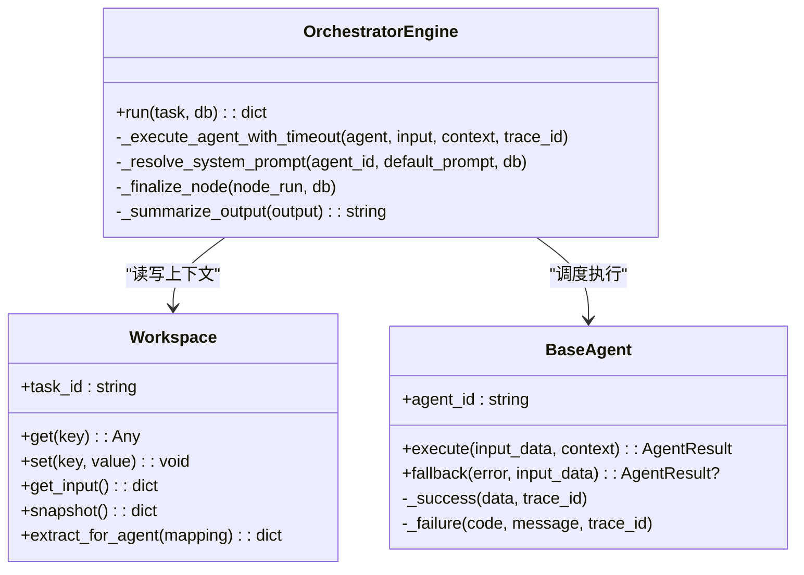
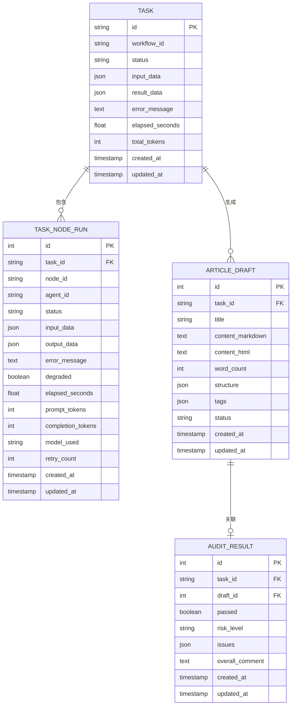
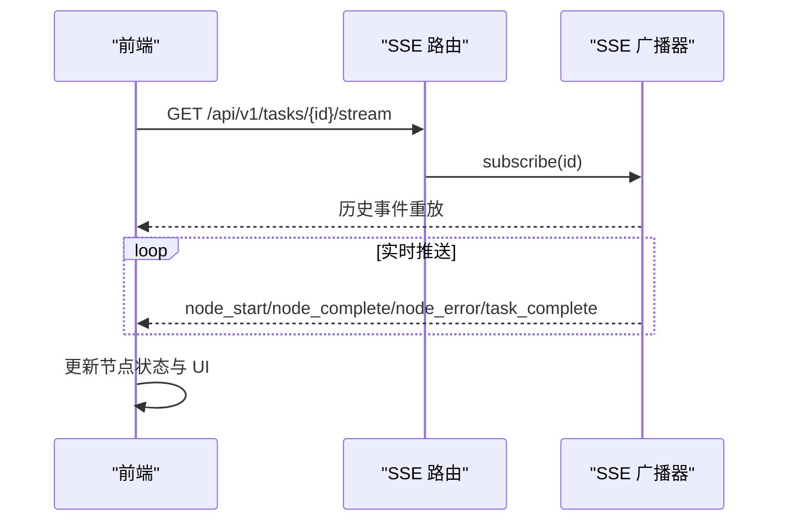
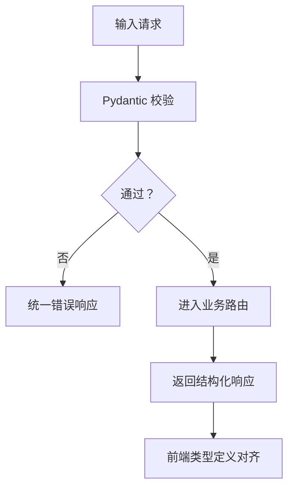
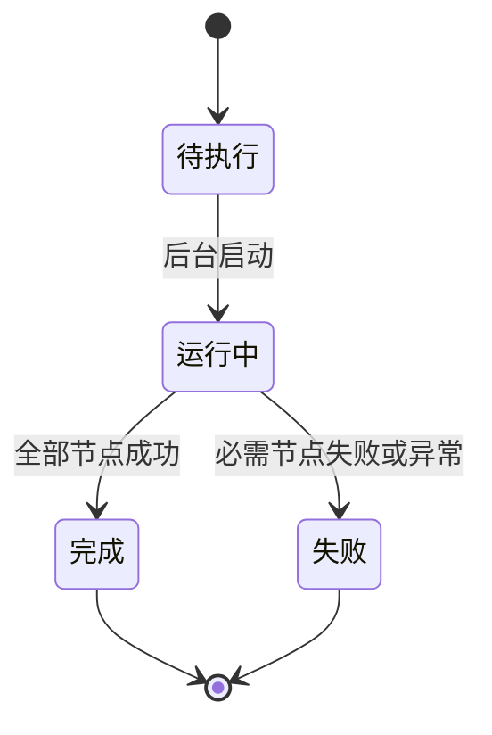
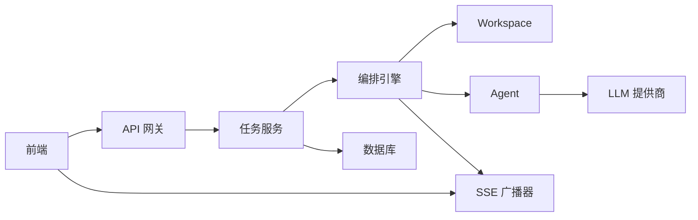

# 数据流设计

<cite>
**本文引用的文件**
- [backend/app/main.py](file://backend/app/main.py)
- [backend/app/api/task_routes.py](file://backend/app/api/task_routes.py)
- [backend/app/api/stream_routes.py](file://backend/app/api/stream_routes.py)
- [backend/app/services/task_service.py](file://backend/app/services/task_service.py)
- [backend/app/orchestrator/engine.py](file://backend/app/orchestrator/engine.py)
- [backend/app/orchestrator/workspace.py](file://backend/app/orchestrator/workspace.py)
- [backend/app/orchestrator/broadcaster.py](file://backend/app/orchestrator/broadcaster.py)
- [backend/app/agents/base.py](file://backend/app/agents/base.py)
- [backend/app/agents/profile_agent.py](file://backend/app/agents/profile_agent.py)
- [backend/app/schemas/task.py](file://backend/app/schemas/task.py)
- [backend/app/schemas/common.py](file://backend/app/schemas/common.py)
- [backend/app/models/tables.py](file://backend/app/models/tables.py)
- [frontend/lib/api.ts](file://frontend/lib/api.ts)
- [frontend/hooks/useTaskSSE.ts](file://frontend/hooks/useTaskSSE.ts)
- [frontend/types/index.ts](file://frontend/types/index.ts)
- [ARCHITECTURE.md](file://ARCHITECTURE.md)
</cite>

## 目录
1. [简介](#简介)
2. [项目结构](#项目结构)
3. [核心组件](#核心组件)
4. [架构总览](#架构总览)
5. [详细组件分析](#详细组件分析)
6. [依赖分析](#依赖分析)
7. [性能考量](#性能考量)
8. [故障排查指南](#故障排查指南)
9. [结论](#结论)
10. [附录](#附录)

## 简介
本文件面向架构师与开发者，系统化阐述 HotClaw 的数据流设计与实现细节。重点覆盖：
- 用户输入处理与结构化校验
- Agent 执行过程与 Workspace 上下文管理
- 数据存储与状态同步（数据库与事件广播）
- 实时数据流（SSE 事件流）与前端消费机制
- JSON Schema 在输入输出验证与转换中的作用
- 数据流图与状态转换图，辅助理解与优化

## 项目结构
HotClaw 采用前后端分离架构，后端基于 FastAPI，前端基于 React。数据流贯穿“网关层 → 业务服务层 → 工作流编排器 → Agent 执行层 → 数据持久化 → SSE 广播 → 前端消费”。

图表来源
- [backend/app/main.py:69-147](file://backend/app/main.py#L69-L147)
- [backend/app/api/task_routes.py:16-179](file://backend/app/api/task_routes.py#L16-L179)
- [backend/app/services/task_service.py:20-126](file://backend/app/services/task_service.py#L20-L126)
- [backend/app/orchestrator/engine.py:89-285](file://backend/app/orchestrator/engine.py#L89-L285)
- [backend/app/orchestrator/workspace.py:12-53](file://backend/app/orchestrator/workspace.py#L12-L53)
- [backend/app/orchestrator/broadcaster.py:11-99](file://backend/app/orchestrator/broadcaster.py#L11-L99)
- [backend/app/models/tables.py:23-319](file://backend/app/models/tables.py#L23-L319)

章节来源
- [backend/app/main.py:1-153](file://backend/app/main.py#L1-L153)
- [ARCHITECTURE.md:37-78](file://ARCHITECTURE.md#L37-L78)

## 核心组件
- API 网关层：统一入口、参数校验、SSE 端点、全局异常处理
- 任务服务层：任务生命周期管理、后台执行触发
- 工作流编排器：线性工作流调度、节点执行、事件广播、降级与容错
- Workspace：任务级上下文容器，跨 Agent 数据共享
- Agent 执行层：标准化输入输出、结构化 JSON、可选降级策略
- 数据持久化：任务、节点运行、草稿、审计、系统配置等模型
- SSE 广播器：事件缓冲与订阅管理，支持延迟加入
- 前端：SSE 订阅、节点状态渲染、任务详情与历史回放

章节来源
- [backend/app/api/task_routes.py:1-179](file://backend/app/api/task_routes.py#L1-L179)
- [backend/app/services/task_service.py:1-126](file://backend/app/services/task_service.py#L1-L126)
- [backend/app/orchestrator/engine.py:1-285](file://backend/app/orchestrator/engine.py#L1-L285)
- [backend/app/orchestrator/workspace.py:1-53](file://backend/app/orchestrator/workspace.py#L1-L53)
- [backend/app/orchestrator/broadcaster.py:1-99](file://backend/app/orchestrator/broadcaster.py#L1-L99)
- [backend/app/agents/base.py:1-99](file://backend/app/agents/base.py#L1-L99)
- [backend/app/models/tables.py:1-319](file://backend/app/models/tables.py#L1-L319)
- [frontend/hooks/useTaskSSE.ts:1-144](file://frontend/hooks/useTaskSSE.ts#L1-L144)

## 架构总览
下图展示从用户输入到实时状态反馈的完整数据流。

图表来源
- [backend/app/api/task_routes.py:39-67](file://backend/app/api/task_routes.py#L39-L67)
- [backend/app/services/task_service.py:39-64](file://backend/app/services/task_service.py#L39-L64)
- [backend/app/orchestrator/engine.py:92-234](file://backend/app/orchestrator/engine.py#L92-L234)
- [backend/app/orchestrator/broadcaster.py:57-84](file://backend/app/orchestrator/broadcaster.py#L57-L84)
- [backend/app/api/stream_routes.py:14-42](file://backend/app/api/stream_routes.py#L14-L42)
- [frontend/hooks/useTaskSSE.ts:60-140](file://frontend/hooks/useTaskSSE.ts#L60-L140)

## 详细组件分析

### 用户输入处理与结构化校验
- 输入模型：TaskCreateRequest 使用 Pydantic 校验，限定最小/最大长度与必填字段
- 网关层：路由接收请求，自动进行参数校验与错误包装
- 统一响应：ApiResponse 包裹 code/message/data，便于前端一致处理
- 任务创建：服务层生成任务 ID、写入初始 input_data，标记 pending 状态

图表来源
- [backend/app/schemas/task.py:10-22](file://backend/app/schemas/task.py#L10-L22)
- [backend/app/schemas/common.py:7-20](file://backend/app/schemas/common.py#L7-L20)
- [backend/app/api/task_routes.py:39-67](file://backend/app/api/task_routes.py#L39-L67)
- [backend/app/services/task_service.py:22-37](file://backend/app/services/task_service.py#L22-L37)

章节来源
- [backend/app/schemas/task.py:1-83](file://backend/app/schemas/task.py#L1-L83)
- [backend/app/schemas/common.py:1-27](file://backend/app/schemas/common.py#L1-L27)
- [backend/app/api/task_routes.py:1-179](file://backend/app/api/task_routes.py#L1-L179)
- [backend/app/services/task_service.py:1-126](file://backend/app/services/task_service.py#L1-L126)

### Agent 执行过程与 Workspace 上下文管理
- 工作流定义：DEFAULT_WORKFLOW_NODES 描述线性节点顺序、输入映射与输出键
- 上下文提取：Workspace.extract_for_agent 将顶层键映射到 Agent 输入
- 执行与降级：编排器调用 Agent.execute，失败时尝试 fallback；必要节点失败会中断并广播错误
- 系统提示词：支持从 DB 覆盖默认提示词，实现配置驱动
- 事件广播：节点开始/完成/错误、任务完成均通过 SSE 广播

图表来源
- [backend/app/orchestrator/workspace.py:12-53](file://backend/app/orchestrator/workspace.py#L12-L53)
- [backend/app/orchestrator/engine.py:89-285](file://backend/app/orchestrator/engine.py#L89-L285)
- [backend/app/agents/base.py:49-99](file://backend/app/agents/base.py#L49-L99)

章节来源
- [backend/app/orchestrator/engine.py:1-285](file://backend/app/orchestrator/engine.py#L1-L285)
- [backend/app/orchestrator/workspace.py:1-53](file://backend/app/orchestrator/workspace.py#L1-L53)
- [backend/app/agents/base.py:1-99](file://backend/app/agents/base.py#L1-L99)

### 数据存储与状态同步
- 任务与节点运行：TaskModel、TaskNodeRunModel 记录状态、耗时、Token 消耗、错误信息
- 草稿与审计：ArticleDraftModel、AuditResultModel 存储最终产物与审核结果
- 系统日志：SystemLogModel 记录结构化日志，支持 trace_id 关联
- 状态同步：编排器在节点开始/完成/失败、任务完成时持久化并广播事件

图表来源
- [backend/app/models/tables.py:23-158](file://backend/app/models/tables.py#L23-L158)

章节来源
- [backend/app/models/tables.py:1-319](file://backend/app/models/tables.py#L1-L319)
- [backend/app/orchestrator/engine.py:102-234](file://backend/app/orchestrator/engine.py#L102-L234)

### 实时数据流与前端消费（SSE）
- SSE 广播器：按 task_id 维护订阅队列与历史缓冲，支持延迟加入
- 事件类型：node_start、node_complete、node_error、task_complete
- 前端 Hook：useTaskSSE 建立 EventSource 连接，监听节点状态变化，自动重连

图表来源
- [backend/app/api/stream_routes.py:14-42](file://backend/app/api/stream_routes.py#L14-L42)
- [backend/app/orchestrator/broadcaster.py:30-84](file://backend/app/orchestrator/broadcaster.py#L30-L84)
- [frontend/hooks/useTaskSSE.ts:60-140](file://frontend/hooks/useTaskSSE.ts#L60-L140)

章节来源
- [backend/app/api/stream_routes.py:1-43](file://backend/app/api/stream_routes.py#L1-L43)
- [backend/app/orchestrator/broadcaster.py:1-99](file://backend/app/orchestrator/broadcaster.py#L1-L99)
- [frontend/hooks/useTaskSSE.ts:1-144](file://frontend/hooks/useTaskSSE.ts#L1-L144)
- [frontend/lib/api.ts:48-55](file://frontend/lib/api.ts#L48-L55)

### JSON Schema 在数据验证与转换中的作用
- 请求/响应模型：TaskCreateRequest、ApiResponse 等使用 Pydantic，确保输入输出结构化
- 统一错误包装：ApiErrorResponse 保证错误响应的一致性
- 前端类型定义：frontend/types/index.ts 提供与后端模型一致的 TS 类型，减少耦合

图表来源
- [backend/app/schemas/task.py:10-83](file://backend/app/schemas/task.py#L10-L83)
- [backend/app/schemas/common.py:7-20](file://backend/app/schemas/common.py#L7-L20)
- [frontend/types/index.ts:19-119](file://frontend/types/index.ts#L19-L119)

章节来源
- [backend/app/schemas/task.py:1-83](file://backend/app/schemas/task.py#L1-L83)
- [backend/app/schemas/common.py:1-27](file://backend/app/schemas/common.py#L1-L27)
- [frontend/types/index.ts:1-119](file://frontend/types/index.ts#L1-L119)

### 状态转换图（任务生命周期）

图表来源
- [backend/app/orchestrator/engine.py:102-234](file://backend/app/orchestrator/engine.py#L102-L234)
- [backend/app/services/task_service.py:39-64](file://backend/app/services/task_service.py#L39-L64)

章节来源
- [backend/app/orchestrator/engine.py:1-285](file://backend/app/orchestrator/engine.py#L1-L285)
- [backend/app/services/task_service.py:1-126](file://backend/app/services/task_service.py#L1-L126)

## 依赖分析
- 组件内聚与解耦
  - 网关层仅负责路由与校验，业务逻辑集中在服务层
  - 编排器与 Agent 解耦，通过 Workspace 与标准输入输出协议交互
  - SSE 广播器与编排器弱耦合，通过事件名与数据结构约定通信
- 外部依赖
  - LLM 调用：ProfileAgent 使用 litellm 完成结构化 JSON 解析与降级
  - 数据库：SQLAlchemy ORM 提供异步会话与关系映射
  - 前端：React + EventSource 实现实时状态消费

图表来源
- [backend/app/main.py:14-29](file://backend/app/main.py#L14-L29)
- [backend/app/api/task_routes.py:1-179](file://backend/app/api/task_routes.py#L1-L179)
- [backend/app/services/task_service.py:1-126](file://backend/app/services/task_service.py#L1-L126)
- [backend/app/orchestrator/engine.py:1-285](file://backend/app/orchestrator/engine.py#L1-L285)
- [backend/app/orchestrator/broadcaster.py:1-99](file://backend/app/orchestrator/broadcaster.py#L1-L99)
- [backend/app/models/tables.py:1-319](file://backend/app/models/tables.py#L1-L319)
- [frontend/lib/api.ts:1-289](file://frontend/lib/api.ts#L1-L289)

章节来源
- [backend/app/main.py:1-153](file://backend/app/main.py#L1-L153)
- [ARCHITECTURE.md:401-448](file://ARCHITECTURE.md#L401-L448)

## 性能考量
- 异步执行：编排器与服务层均采用异步，避免阻塞
- 事件缓冲：SSE 广播器对历史事件进行缓冲，降低延迟加入导致的数据丢失风险
- 超时控制：编排器对 Agent 执行设置超时，防止长时间阻塞
- Token 统计：节点运行记录中累计 prompt/completion tokens，便于成本与性能分析
- 建议
  - 为长耗时 Agent 引入可中断/可恢复机制
  - 对热点抓取等外部依赖增加连接池与重试退避
  - 在前端对 SSE 连接进行心跳与断线重连策略优化

## 故障排查指南
- 统一异常处理
  - HotClawError：按错误码映射 HTTP 状态，返回统一错误响应
  - 未捕获异常：记录日志并返回 500
- 任务失败定位
  - 查看 TaskModel.error_message 与 TaskNodeRunModel.error_message
  - 通过 SystemLogModel 的 trace_id 关联定位
- SSE 连接问题
  - 检查 /api/v1/tasks/{id}/stream 是否正确订阅
  - 前端 EventSource 自动重连，若仍失败检查网络与代理配置

章节来源
- [backend/app/main.py:96-138](file://backend/app/main.py#L96-L138)
- [backend/app/models/tables.py:220-233](file://backend/app/models/tables.py#L220-L233)
- [frontend/hooks/useTaskSSE.ts:129-133](file://frontend/hooks/useTaskSSE.ts#L129-L133)

## 结论
HotClaw 的数据流设计以“结构化输入输出”“Workspace 上下文”“SSE 实时广播”为核心，结合 Pydantic Schema 与 SQLAlchemy ORM，实现了从用户输入到任务完成的全链路可观测与可回放。线性工作流与降级策略保障了稳定性，SSE 使前端能够实时感知节点状态。建议在后续版本中引入 DAG 工作流、可中断执行与更细粒度的成本统计，持续提升系统弹性与可观测性。

## 附录
- Agent 示例：ProfileAgent 展示了结构化输入输出与降级策略的实践
- 前端类型：frontend/types/index.ts 与后端模型保持一致，便于类型安全

章节来源
- [backend/app/agents/profile_agent.py:1-102](file://backend/app/agents/profile_agent.py#L1-L102)
- [frontend/types/index.ts:1-119](file://frontend/types/index.ts#L1-L119)