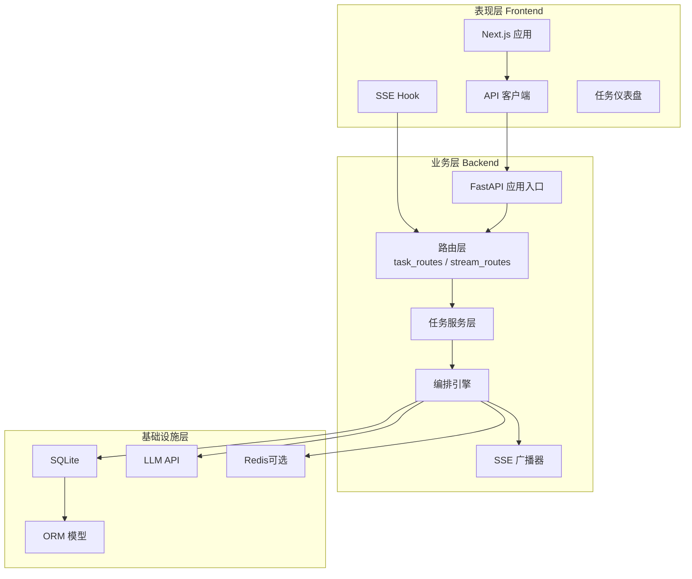
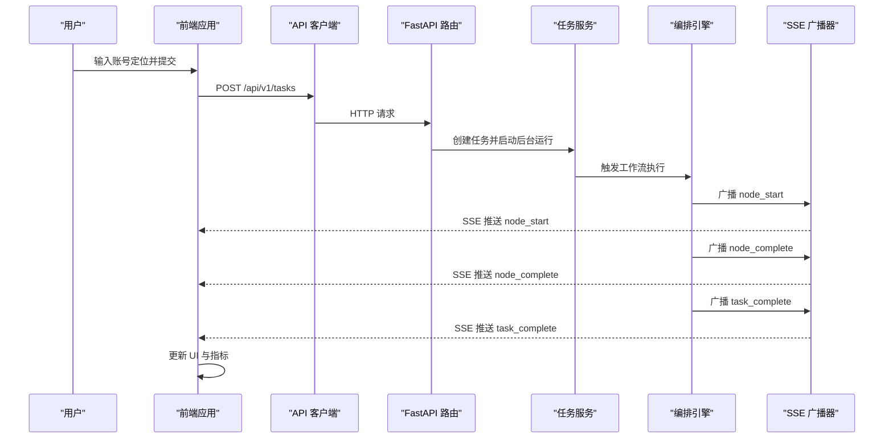
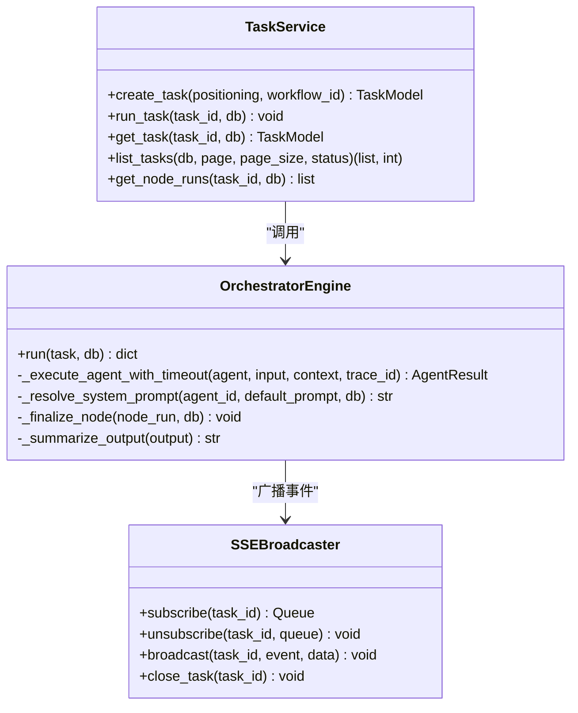
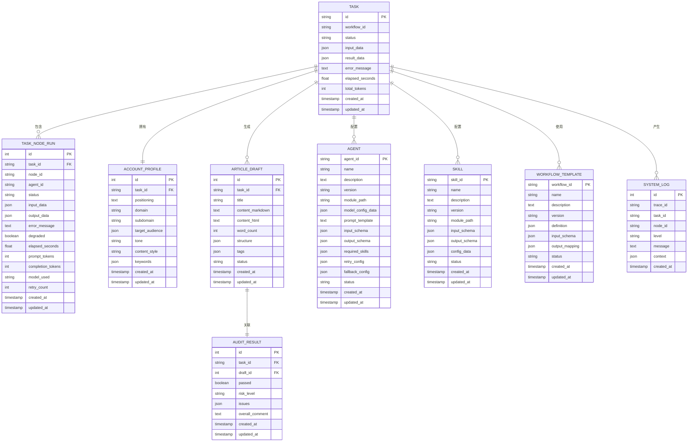
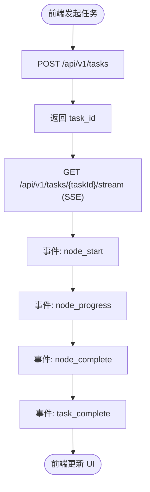
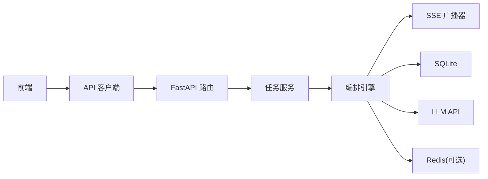

# 整体架构设计

<cite>
**本文引用的文件**
- [ARCHITECTURE.md](file://ARCHITECTURE.md)
- [backend/app/main.py](file://backend/app/main.py)
- [backend/pyproject.toml](file://backend/pyproject.toml)
- [backend/app/api/task_routes.py](file://backend/app/api/task_routes.py)
- [backend/app/api/stream_routes.py](file://backend/app/api/stream_routes.py)
- [backend/app/services/task_service.py](file://backend/app/services/task_service.py)
- [backend/app/orchestrator/engine.py](file://backend/app/orchestrator/engine.py)
- [backend/app/orchestrator/broadcaster.py](file://backend/app/orchestrator/broadcaster.py)
- [backend/app/models/tables.py](file://backend/app/models/tables.py)
- [frontend/package.json](file://frontend/package.json)
- [frontend/app/layout.tsx](file://frontend/app/layout.tsx)
- [frontend/lib/api.ts](file://frontend/lib/api.ts)
- [frontend/hooks/useTaskSSE.ts](file://frontend/hooks/useTaskSSE.ts)
- [frontend/components/dashboard/TaskDashboard.tsx](file://frontend/components/dashboard/TaskDashboard.tsx)
- [frontend/types/index.ts](file://frontend/types/index.ts)
</cite>

## 目录
1. [引言](#引言)
2. [项目结构](#项目结构)
3. [核心组件](#核心组件)
4. [架构总览](#架构总览)
5. [详细组件分析](#详细组件分析)
6. [依赖关系分析](#依赖关系分析)
7. [性能考量](#性能考量)
8. [故障排查指南](#故障排查指南)
9. [结论](#结论)
10. [附录](#附录)

## 引言
HotClaw 是一个“基于多智能体协作的公众号内容生产平台”。用户仅需输入“账号定位”，系统即可自动完成从热点抓取、选题策划、标题生成、正文撰写到审核风控的全链路内容生产，并输出可编辑的文章草稿。系统采用三层架构：表现层（Frontend）、业务层（Backend API Gateway）、基础设施层（Database/Cache/LLM），并通过前后端分离与 HTTP + SSE 实时通信模式实现任务状态的可视化与可观测性。

## 项目结构
项目采用前后端分离的多模块组织方式：
- 前端（Next.js 16 + React 19 + TypeScript）：负责页面与可视化、状态管理、SSE 订阅。
- 后端（FastAPI + Python 3.11+）：负责 API 网关、任务编排、数据库与事件广播。
- 基础设施：SQLite（持久化）、Redis（可选）、LLM API（模型层）、日志与追踪（结构化日志）。

**图表来源**
- [backend/app/main.py:60-142](file://backend/app/main.py#L60-L142)
- [backend/app/api/task_routes.py:19-163](file://backend/app/api/task_routes.py#L19-L163)
- [backend/app/api/stream_routes.py:14-43](file://backend/app/api/stream_routes.py#L14-L43)
- [backend/app/services/task_service.py:20-126](file://backend/app/services/task_service.py#L20-L126)
- [backend/app/orchestrator/engine.py:89-285](file://backend/app/orchestrator/engine.py#L89-L285)
- [backend/app/orchestrator/broadcaster.py:11-94](file://backend/app/orchestrator/broadcaster.py#L11-L94)
- [backend/app/models/tables.py:23-233](file://backend/app/models/tables.py#L23-L233)

**章节来源**
- [frontend/package.json:1-23](file://frontend/package.json#L1-L23)
- [frontend/app/layout.tsx:1-16](file://frontend/app/layout.tsx#L1-L16)
- [backend/pyproject.toml:1-41](file://backend/pyproject.toml#L1-L41)

## 核心组件
- 表现层（Frontend）
  - Next.js 应用与全局样式
  - API 客户端封装统一的 /api/v1 前缀与错误处理
  - SSE Hook 用于订阅任务事件流
  - 任务仪表盘组件用于实时展示任务状态与指标
- 业务层（Backend）
  - FastAPI 应用入口与中间件（CORS、Trace ID、异常处理）
  - 路由层：任务创建、状态查询、节点详情、SSE 事件流
  - 服务层：任务生命周期管理（创建、运行、分页查询）
  - 编排引擎：线性工作流执行、节点状态广播、降级与错误处理
  - SSE 广播器：事件队列、历史缓冲、连接管理
  - ORM 模型：任务、节点运行、账号画像、文章草稿、审核结果、Agent/Skill/工作流配置等
- 基础设施层
  - SQLite：任务与运行记录持久化
  - LLM API：多智能体与技能调用
  - Redis：可选缓存（根据 manifest 与技能配置）

**章节来源**
- [frontend/lib/api.ts:14-110](file://frontend/lib/api.ts#L14-L110)
- [frontend/hooks/useTaskSSE.ts:28-124](file://frontend/hooks/useTaskSSE.ts#L28-L124)
- [frontend/components/dashboard/TaskDashboard.tsx:21-176](file://frontend/components/dashboard/TaskDashboard.tsx#L21-L176)
- [backend/app/main.py:60-142](file://backend/app/main.py#L60-L142)
- [backend/app/api/task_routes.py:19-163](file://backend/app/api/task_routes.py#L19-L163)
- [backend/app/api/stream_routes.py:14-43](file://backend/app/api/stream_routes.py#L14-L43)
- [backend/app/services/task_service.py:20-126](file://backend/app/services/task_service.py#L20-L126)
- [backend/app/orchestrator/engine.py:89-285](file://backend/app/orchestrator/engine.py#L89-L285)
- [backend/app/orchestrator/broadcaster.py:11-94](file://backend/app/orchestrator/broadcaster.py#L11-L94)
- [backend/app/models/tables.py:23-233](file://backend/app/models/tables.py#L23-L233)

## 架构总览
HotClaw 采用“前后端分离 + API 网关 + 工作流编排”的三层架构：
- 表现层：React SPA，负责用户交互、可视化与实时事件消费
- 业务层：FastAPI 提供统一入口，路由层负责参数校验与错误格式化，服务层与编排层负责业务逻辑
- 基础设施层：SQLite 持久化、Redis 缓存、LLM API 与日志追踪

系统边界与 MVP 范围：
- 第一版做什么（MVP Scope）：账号定位解析、热点抓取与分析、选题策划、标题生成、正文生成、基础审核风控、草稿输出、任务全链路可视化、智能体/Skill 声明式注册与配置管理、历史任务查询与回放
- 第一版不做什么：不接公众号 API、不批量多账号、不登录/权限体系、不多媒体生成、不 A/B 回流、不支付、不 Agent 自主学习、不分布式部署

**章节来源**
- [ARCHITECTURE.md:13-36](file://ARCHITECTURE.md#L13-L36)
- [ARCHITECTURE.md:37-78](file://ARCHITECTURE.md#L37-L78)

## 详细组件分析

### 前端组件分析
- 页面与路由
  - 首页：输入账号定位，一键启动任务
  - 任务运行页：实时查看各节点运行状态与日志
  - 任务结果页：查看完整输出与文章预览
  - 设置页：智能体与 Skill 配置管理
  - 历史页：任务列表与回放
- 组件树
  - AppLayout + Sidebar + MainContent + 各页面组件
  - 任务仪表盘：展示进度环、运行时间、平均响应、Agent 状态网格与成功率
- 状态管理
  - 使用 Zustand 分层 Store：任务 Store、配置 Store、历史 Store
- 实时通信
  - SSE：EventSource 订阅 /api/v1/tasks/{taskId}/stream
  - 事件类型：node_start、node_progress、node_complete、node_error、task_complete、task_error

**图表来源**
- [frontend/lib/api.ts:26-31](file://frontend/lib/api.ts#L26-L31)
- [frontend/hooks/useTaskSSE.ts:62-111](file://frontend/hooks/useTaskSSE.ts#L62-L111)
- [backend/app/api/task_routes.py:19-51](file://backend/app/api/task_routes.py#L19-L51)
- [backend/app/api/stream_routes.py:14-43](file://backend/app/api/stream_routes.py#L14-L43)
- [backend/app/services/task_service.py:39-63](file://backend/app/services/task_service.py#L39-L63)
- [backend/app/orchestrator/engine.py:124-232](file://backend/app/orchestrator/engine.py#L124-L232)
- [backend/app/orchestrator/broadcaster.py:57-79](file://backend/app/orchestrator/broadcaster.py#L57-L79)

**章节来源**
- [frontend/app/layout.tsx:9-15](file://frontend/app/layout.tsx#L9-L15)
- [frontend/components/dashboard/TaskDashboard.tsx:21-176](file://frontend/components/dashboard/TaskDashboard.tsx#L21-L176)
- [frontend/hooks/useTaskSSE.ts:28-124](file://frontend/hooks/useTaskSSE.ts#L28-L124)
- [frontend/types/index.ts:5-94](file://frontend/types/index.ts#L5-L94)

### 后端组件分析
- 应用入口与中间件
  - CORS、Trace ID 中间件、全局异常处理器
  - 路由注册：任务、流、Agent、Skill
- 路由层
  - 任务创建：立即返回 task_id，后台异步运行
  - 任务状态与详情：进度、耗时、节点明细
  - SSE 事件流：按 task_id 订阅事件队列
- 服务层
  - 任务生命周期：创建、运行、分页查询、节点明细
  - 异常捕获与 task_error 广播
- 编排引擎
  - 线性工作流（MVP）：账号解析 → 热点分析 → 选题策划 → 标题生成 → 正文生成 → 审核
  - 节点执行：提取输入、广播 node_start、执行 Agent、写入 workspace、持久化、广播 node_complete
  - 降级策略：节点失败时尝试 fallback，必要节点失败抛出异常
- SSE 广播器
  - 订阅/取消订阅、事件缓冲、历史回放、流结束信号、内存清理

**图表来源**
- [backend/app/services/task_service.py:20-126](file://backend/app/services/task_service.py#L20-L126)
- [backend/app/orchestrator/engine.py:89-285](file://backend/app/orchestrator/engine.py#L89-L285)
- [backend/app/orchestrator/broadcaster.py:11-94](file://backend/app/orchestrator/broadcaster.py#L11-L94)

**章节来源**
- [backend/app/main.py:60-142](file://backend/app/main.py#L60-L142)
- [backend/app/api/task_routes.py:19-163](file://backend/app/api/task_routes.py#L19-L163)
- [backend/app/api/stream_routes.py:14-43](file://backend/app/api/stream_routes.py#L14-L43)
- [backend/app/services/task_service.py:20-126](file://backend/app/services/task_service.py#L20-L126)
- [backend/app/orchestrator/engine.py:89-285](file://backend/app/orchestrator/engine.py#L89-L285)
- [backend/app/orchestrator/broadcaster.py:11-94](file://backend/app/orchestrator/broadcaster.py#L11-L94)

### 数据模型与持久化
- 核心表
  - 任务表：任务生命周期、状态、耗时、Token 统计
  - 节点运行表：每个 Agent 的输入/输出、耗时、错误、降级标记
  - 账号画像表：解析后的账号领域、受众、风格等
  - 文章草稿表：标题、内容、结构、标签、状态
  - 审核结果表：风险等级、问题列表、总体评论
  - Agent/Skill/工作流配置表：持久化配置与 Schema
  - 系统日志表：结构化日志与追踪
- ORM 设计
  - 使用 SQLAlchemy 2.0 + asyncpg + aiosqlite
  - 关系映射与级联删除（如任务删除时级联清理节点运行）

**图表来源**
- [backend/app/models/tables.py:23-233](file://backend/app/models/tables.py#L23-L233)

**章节来源**
- [backend/app/models/tables.py:23-233](file://backend/app/models/tables.py#L23-L233)

### 前后端分离与 HTTP + SSE 通信
- 优势
  - 职责清晰：后端专注编排与业务，前端专注可视化与交互
  - 实时性强：SSE 单向推送，前端独立消费事件流，降低 WebSocket 复杂度
  - 可替换性：未来可接入桌面端、小程序、CLI 等多种前端形态
  - 开发效率：前后端可并行开发，仅需约定 API 协议
- 实现要点
  - 前端：API 客户端封装 /api/v1 前缀与错误处理；SSE Hook 订阅事件流；仪表盘组件渲染实时指标
  - 后端：路由层提供 /api/v1/tasks/{taskId}/stream；编排引擎在节点开始/完成/失败时广播事件；SSE 广播器维护订阅队列与历史缓冲

**图表来源**
- [frontend/lib/api.ts:26-31](file://frontend/lib/api.ts#L26-L31)
- [frontend/hooks/useTaskSSE.ts:62-111](file://frontend/hooks/useTaskSSE.ts#L62-L111)
- [backend/app/api/stream_routes.py:14-43](file://backend/app/api/stream_routes.py#L14-L43)
- [backend/app/orchestrator/engine.py:124-232](file://backend/app/orchestrator/engine.py#L124-L232)

**章节来源**
- [ARCHITECTURE.md:80-89](file://ARCHITECTURE.md#L80-L89)
- [frontend/lib/api.ts:14-110](file://frontend/lib/api.ts#L14-L110)
- [frontend/hooks/useTaskSSE.ts:28-124](file://frontend/hooks/useTaskSSE.ts#L28-L124)
- [backend/app/api/stream_routes.py:14-43](file://backend/app/api/stream_routes.py#L14-L43)

## 依赖关系分析
- 技术栈依赖
  - 前端：Next.js、React、TypeScript、TailwindCSS、Zustand、Axios、react-markdown/rehype
  - 后端：FastAPI、SQLAlchemy 2.0、alembic、sse-starlette、litellm、aiosqlite、structlog、pydantic-settings
- 模块耦合
  - 路由层仅负责请求/响应，业务逻辑集中在服务层与编排层
  - 编排引擎与广播器解耦，便于扩展为 DAG 工作流
  - ORM 模型集中定义，服务层与编排层通过模型进行数据交互
- 外部依赖
  - LLM API：统一多模型调用接口
  - Redis：可选缓存（根据技能配置）
  - SQLite：本地开发与演示友好

**图表来源**
- [frontend/package.json:11-21](file://frontend/package.json#L11-L21)
- [backend/pyproject.toml:6-22](file://backend/pyproject.toml#L6-L22)
- [backend/app/main.py:133-136](file://backend/app/main.py#L133-L136)

**章节来源**
- [frontend/package.json:1-23](file://frontend/package.json#L1-L23)
- [backend/pyproject.toml:1-41](file://backend/pyproject.toml#L1-L41)
- [backend/app/main.py:133-136](file://backend/app/main.py#L133-L136)

## 性能考量
- 异步与并发
  - 后端使用 asyncio 与异步 SQLAlchemy，避免阻塞 IO
  - SSE 广播器使用 asyncio.Queue，支持高并发订阅
- 事件流优化
  - 历史缓冲与回放，解决前端连接建立时机问题
  - keepalive 心跳维持长连接稳定
- 数据持久化
  - SQLite 适合 MVP 单机场景；如需扩展可迁移至 PostgreSQL
  - ORM 查询使用 selectinload 与分页，避免 N+1 查询
- LLM 调用
  - 统一 litellm 接口，支持多模型切换与速率限制
  - 节点耗时与 Token 统计便于成本与性能分析

## 故障排查指南
- 常见错误类型
  - 任务级错误：task_error 事件，记录在系统日志与任务表
  - 节点级错误：node_error 事件，包含错误信息与降级标记
- 排查步骤
  - 前端：确认 SSE 连接是否建立、事件是否持续接收
  - 后端：检查编排引擎日志、任务状态、节点运行记录
  - 数据库：核对任务表、节点运行表、系统日志表
- 降级策略
  - 节点失败时尝试 fallback，必要节点失败抛出异常并终止链路
  - 任务失败时广播 task_error，前端关闭连接并提示错误

**章节来源**
- [backend/app/orchestrator/engine.py:164-196](file://backend/app/orchestrator/engine.py#L164-L196)
- [backend/app/services/task_service.py:49-63](file://backend/app/services/task_service.py#L49-L63)
- [backend/app/orchestrator/broadcaster.py:57-79](file://backend/app/orchestrator/broadcaster.py#L57-L79)
- [backend/app/models/tables.py:220-233](file://backend/app/models/tables.py#L220-L233)

## 结论
HotClaw 通过前后端分离与 API 网关，结合 SSE 实时事件流，实现了从账号定位到文章草稿的全链路自动化内容生产。MVP 版本聚焦线性工作流与可视化可观测性，为后续扩展 DAG 工作流、多账号管理、插件化对接与分布式部署打下坚实基础。建议在后续版本中逐步引入插件系统、A/B 回流与计费模块，并完善监控与告警体系。

## 附录
- MVP 最小闭环
  - 用户输入 → 账号解析 → 热点分析 → 选题策划 → 标题生成 → 正文生成 → 审核 → 草稿输出
- 延后功能
  - 公众号 API 对接、多账号管理、用户体系、图片生成、DAG 编辑器、Agent 自主学习、分布式部署

**章节来源**
- [ARCHITECTURE.md:138-188](file://ARCHITECTURE.md#L138-L188)