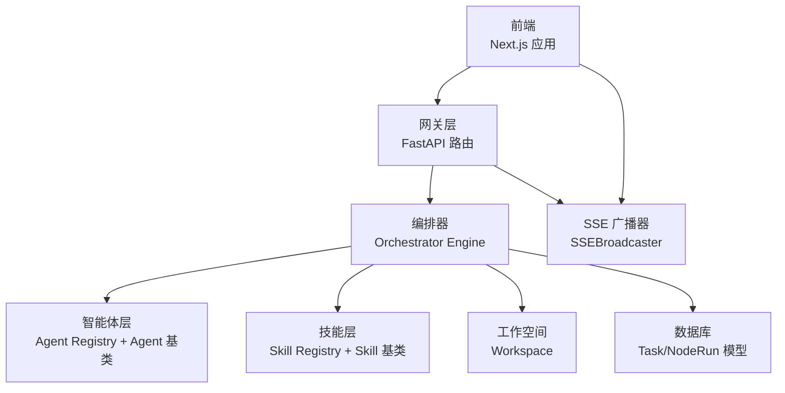
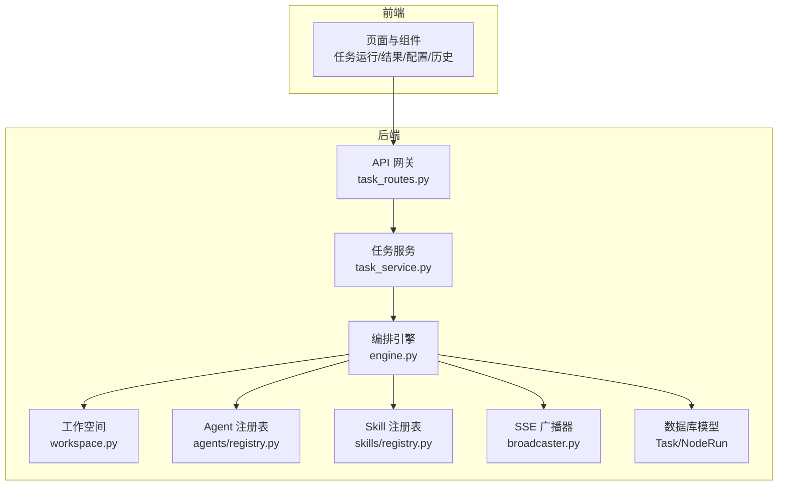
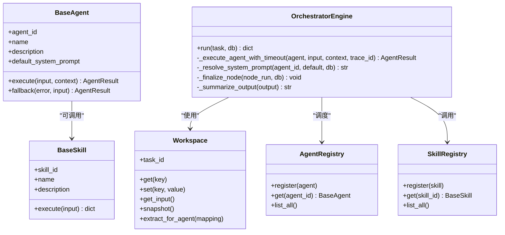
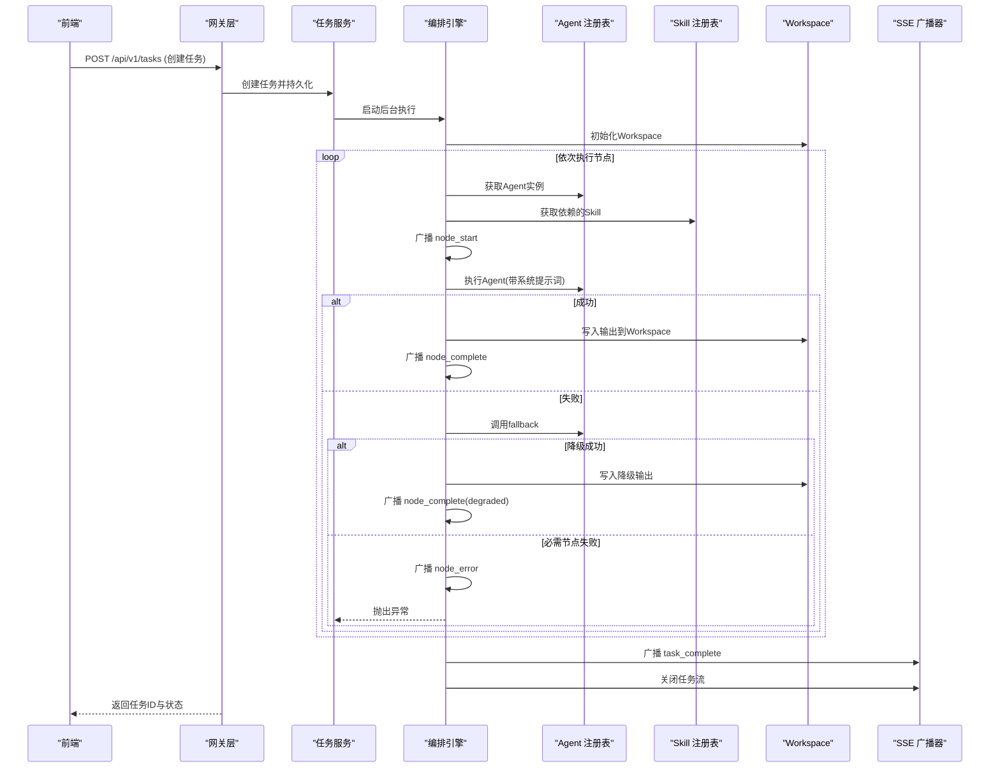
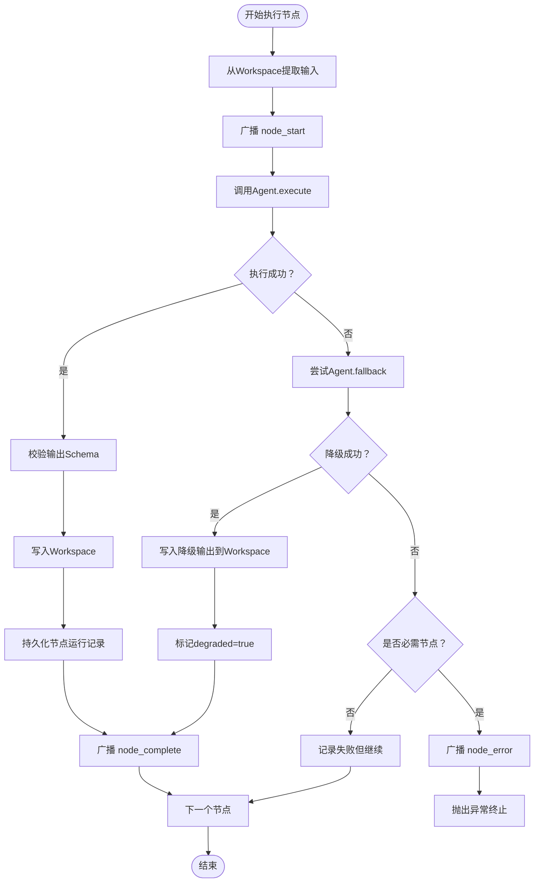
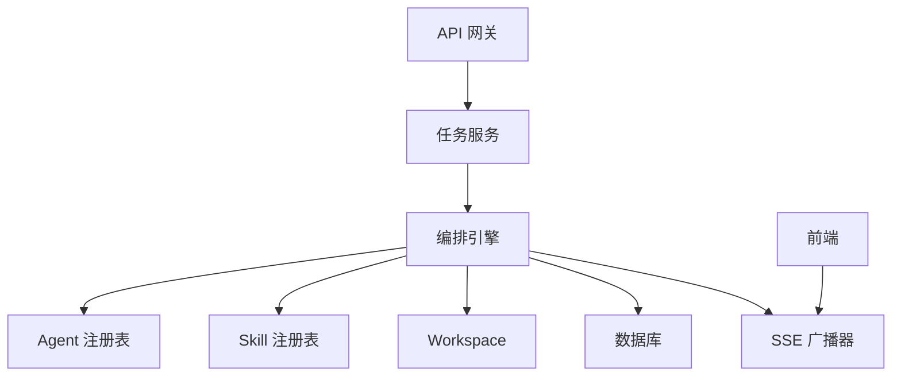

# 核心设计理念

<cite>
**本文引用的文件**
- [ARCHITECTURE.md](file://ARCHITECTURE.md)
- [main.py](file://backend/app/main.py)
- [workspace.py](file://backend/app/orchestrator/workspace.py)
- [engine.py](file://backend/app/orchestrator/engine.py)
- [base.py（Agent基类）](file://backend/app/agents/base.py)
- [base.py（Skill基类）](file://backend/app/skills/base.py)
- [task_routes.py](file://backend/app/api/task_routes.py)
- [task_service.py](file://backend/app/services/task_service.py)
- [profile_agent.py](file://backend/app/agents/profile_agent.py)
- [registry.py（Agent注册表）](file://backend/app/agents/registry.py)
- [registry.py（Skill注册表）](file://backend/app/skills/registry.py)
- [broadcaster.py](file://backend/app/orchestrator/broadcaster.py)
- [layout.tsx](file://frontend/app/layout.tsx)
</cite>

## 目录
1. [引言](#引言)
2. [项目结构](#项目结构)
3. [核心组件](#核心组件)
4. [架构总览](#架构总览)
5. [详细组件分析](#详细组件分析)
6. [依赖分析](#依赖分析)
7. [性能考量](#性能考量)
8. [故障排查指南](#故障排查指南)
9. [结论](#结论)
10. [附录](#附录)

## 引言
本文件围绕HotClaw的核心设计理念展开，系统阐释12条设计原则及其在系统中的落地方式，解析OpenClaw理念的吸收与改造，给出Agent、Skill、Workspace、Workflow等关键概念的准确定义与相互关系，并结合真实代码实现展示这些原则如何指导开发与架构决策。同时提供可操作的应用案例与最佳实践，帮助读者在实际项目中正确应用这些原则。

## 项目结构
HotClaw采用前后端分离架构：前端为Next.js应用，后端为FastAPI服务，中间通过HTTP + SSE进行实时通信。后端模块按职责划分为网关层、编排器、智能体层、技能层、服务层、模型与Schema层、核心工具层等，形成清晰的分层与解耦。

图表来源
- [main.py:69-148](file://backend/app/main.py#L69-L148)
- [engine.py:89-234](file://backend/app/orchestrator/engine.py#L89-L234)
- [workspace.py:12-53](file://backend/app/orchestrator/workspace.py#L12-L53)
- [broadcaster.py:11-99](file://backend/app/orchestrator/broadcaster.py#L11-L99)

章节来源
- [ARCHITECTURE.md:37-78](file://ARCHITECTURE.md#L37-L78)
- [main.py:14-31](file://backend/app/main.py#L14-L31)
- [layout.tsx:4-15](file://frontend/app/layout.tsx#L4-L15)

## 核心组件
- 设计原则（12条）：涵盖Workspace-First、Manifest-First、控制平面与执行平面分离、Gateway唯一入口、结构化输入输出、可审计可回放、渐进式自动化、Skills是原子能力、失败不阻塞、配置优先于代码、最小权限原则、可视化是一等公民。
- OpenClaw理念吸收与改造：保留并强化了控制平面/执行平面分离、Gateway唯一入口、Workspace上下文隔离、Manifest声明式注册、严格配置校验、可回放可审计等；对Tool/Plugin机制改造为Skill层，简化Canvas可视化，强调MVP阶段的线性流程与可回放能力。
- 核心概念定义：Agent（有角色、有上下文、有决策能力）、Skill（无状态原子能力）、Workflow（DAG工作流定义）、Workspace（任务级上下文容器）、Gateway（唯一入口）、Orchestrator（编排引擎）。

章节来源
- [ARCHITECTURE.md:94-135](file://ARCHITECTURE.md#L94-L135)
- [ARCHITECTURE.md:111-123](file://ARCHITECTURE.md#L111-L123)
- [ARCHITECTURE.md:124-135](file://ARCHITECTURE.md#L124-L135)

## 架构总览
HotClaw的系统边界与职责划分如下：
- 前端：负责可视化与交互，通过SSE订阅任务状态，渲染节点卡片与运行面板。
- 网关层：统一入口，参数校验、鉴权与限流，路由至各业务模块。
- 编排器：加载workflow定义，按顺序调度Agent，管理Workspace生命周期，广播状态。
- 智能体层：实现具体业务任务，调用LLM与/或Skills，遵循结构化输入输出。
- 技能层：封装原子能力（如新闻抓取、摘要、风险检测、标题评分），无状态、可复用。
- 数据层：持久化任务、节点运行记录、配置与审计数据。

图表来源
- [task_routes.py:39-67](file://backend/app/api/task_routes.py#L39-L67)
- [task_service.py:39-64](file://backend/app/services/task_service.py#L39-L64)
- [engine.py:92-234](file://backend/app/orchestrator/engine.py#L92-L234)
- [workspace.py:12-53](file://backend/app/orchestrator/workspace.py#L12-L53)
- [registry.py（Agent注册表）:10-39](file://backend/app/agents/registry.py#L10-L39)
- [registry.py（Skill注册表）:10-37](file://backend/app/skills/registry.py#L10-L37)
- [broadcaster.py:11-99](file://backend/app/orchestrator/broadcaster.py#L11-L99)

## 详细组件分析

### 设计原则详解与应用
- Workspace-First：每个任务创建独立Workspace，Agent之间通过Workspace共享上下文，确保隔离与协作。实现见Workspace类的数据容器与提取方法。
- Manifest-First：Agent/Skill/Workflow通过YAML/JSON声明式注册，系统启动时扫描加载，保证可配置与可替换。
- 控制平面与执行平面分离：Orchestrator仅负责调度（何时调谁），Agent仅负责执行（做什么事），二者通过标准协议通信。
- Gateway唯一入口：所有外部请求经API Gateway进入，统一鉴权、限流、参数校验；内部服务不暴露。
- 结构化输入输出：所有Agent的输入输出必须是JSON Schema定义的结构体，拒绝自由文本传递。
- 可审计可回放：每个节点的输入、输出、耗时、token消耗、错误信息全部持久化，支持任务级回放。
- 渐进式自动化：MVP阶段允许用户在关键节点介入（选择选题、修改标题），不追求全自动黑盒。
- Skills是原子能力：Skill是无状态的、可复用的原子工具；Agent是有上下文的决策者，Agent调用Skill。
- 失败不阻塞：单个Agent失败时提供降级策略（返回默认值/跳过/重试），不让整条链路崩溃。
- 配置优先于代码：能通过配置改变的行为，不写死在代码里；包括prompt模板、模型选择、重试策略等。
- 最小权限原则：每个Agent只能访问自己声明的Skills与Workspace中被显式授权的字段。
- 可视化是一等公民：运行链路可视化不是附加功能，而是核心能力；架构设计时即考虑状态广播。

章节来源
- [ARCHITECTURE.md:94-135](file://ARCHITECTURE.md#L94-L135)
- [workspace.py:12-53](file://backend/app/orchestrator/workspace.py#L12-L53)
- [engine.py:89-234](file://backend/app/orchestrator/engine.py#L89-L234)
- [base.py（Agent基类）:49-99](file://backend/app/agents/base.py#L49-L99)
- [base.py（Skill基类）:16-37](file://backend/app/skills/base.py#L16-L37)

### OpenClaw理念的吸收与改造
- 保留：控制平面/执行平面分离、Gateway唯一入口、Workspace上下文隔离、Manifest声明式注册、严格配置校验、可回放可审计。
- 改造：将OpenClaw的Tool抽象为HotClaw的Skill，强调Skill的配置、速率限制与缓存策略；简化Canvas可视化，MVP阶段采用线性流程节点卡片；Orchestrator与Gateway在MVP阶段以内置模块形式存在，避免过度拆分。

章节来源
- [ARCHITECTURE.md:111-123](file://ARCHITECTURE.md#L111-L123)

### 核心概念定义与关系
- Agent：有角色、有上下文、有决策能力的执行单元，内部调用LLM与/或Skills完成任务，遵循结构化输入输出。
- Skill：无状态的原子能力，封装具体技术操作（API调用、数据处理、规则匹配），对外提供标准化输入输出。
- Workflow：定义Agent的执行顺序与依赖关系的有向无环图（DAG），MVP阶段为线性链，数据结构预留DAG扩展。
- Workspace：一次任务执行的上下文容器，包含任务参数、各Agent输出、中间状态与元数据，任务创建时初始化，结束后归档。
- Gateway：系统对外唯一入口，负责路由、参数校验、错误格式化。
- Orchestrator：工作流执行引擎，读取Workflow定义，按顺序/依赖调度Agent，管理Workspace生命周期，广播执行状态。

图表来源
- [workspace.py:12-53](file://backend/app/orchestrator/workspace.py#L12-L53)
- [base.py（Agent基类）:49-99](file://backend/app/agents/base.py#L49-L99)
- [base.py（Skill基类）:16-37](file://backend/app/skills/base.py#L16-L37)
- [engine.py:89-284](file://backend/app/orchestrator/engine.py#L89-L284)
- [registry.py（Agent注册表）:10-39](file://backend/app/agents/registry.py#L10-L39)
- [registry.py（Skill注册表）:10-37](file://backend/app/skills/registry.py#L10-L37)

章节来源
- [ARCHITECTURE.md:124-135](file://ARCHITECTURE.md#L124-L135)

### 设计原则在实际开发中的应用案例与最佳实践
- Workspace-First：在任务创建时初始化Workspace，后续Agent通过extract_for_agent映射输入，避免跨任务污染与跨节点耦合。
- Manifest-First：通过YAML声明式注册Agent/Skill/Workflow，启动时校验并动态加载，便于快速替换与灰度发布。
- 控制平面与执行平面分离：Orchestrator集中管理调度与状态广播，Agent专注于自身业务逻辑，降低复杂度与提升可测试性。
- 结构化输入输出：Agent与Skill均提供明确的输入输出Schema，确保数据一致性与可审计性。
- 失败不阻塞：为每个Agent提供fallback策略，必要时降级返回默认值或跳过，保障整体链路可用性。
- 配置优先于代码：系统支持从数据库读取Agent的自定义prompt与配置，实现无需重启即可调整行为。
- 最小权限原则：Agent仅能访问其声明的Skills与Workspace中被授权的字段，减少安全风险。
- 可视化是一等公民：通过SSE广播节点状态，前端以卡片形式实时展示，便于用户理解与干预。

章节来源
- [engine.py:134-234](file://backend/app/orchestrator/engine.py#L134-L234)
- [base.py（Agent基类）:77-99](file://backend/app/agents/base.py#L77-L99)
- [task_routes.py:39-67](file://backend/app/api/task_routes.py#L39-L67)
- [broadcaster.py:57-99](file://backend/app/orchestrator/broadcaster.py#L57-L99)

### 核心流程：任务创建与执行

图表来源
- [task_routes.py:39-67](file://backend/app/api/task_routes.py#L39-L67)
- [task_service.py:39-64](file://backend/app/services/task_service.py#L39-L64)
- [engine.py:92-234](file://backend/app/orchestrator/engine.py#L92-L234)
- [broadcaster.py:57-99](file://backend/app/orchestrator/broadcaster.py#L57-L99)

章节来源
- [task_routes.py:39-179](file://backend/app/api/task_routes.py#L39-L179)
- [task_service.py:20-126](file://backend/app/services/task_service.py#L20-L126)
- [engine.py:89-285](file://backend/app/orchestrator/engine.py#L89-L285)

### 复杂逻辑：节点执行与降级策略

图表来源
- [engine.py:134-234](file://backend/app/orchestrator/engine.py#L134-L234)
- [base.py（Agent基类）:77-99](file://backend/app/agents/base.py#L77-L99)

章节来源
- [engine.py:134-234](file://backend/app/orchestrator/engine.py#L134-L234)
- [base.py（Agent基类）:77-99](file://backend/app/agents/base.py#L77-L99)

## 依赖分析
- 模块内聚与解耦：Agent/Skill通过注册表集中管理，Orchestrator通过Registry解耦调度与执行；Gateway仅负责路由与校验，业务逻辑下沉至服务层。
- 外部依赖：LLM调用（通过litellm或openai SDK）、数据库（SQLAlchemy + alembic）、SSE广播器、前端Next.js。
- 循环依赖：当前实现未发现循环导入；注册表与基类均为抽象定义，避免相互依赖。

图表来源
- [main.py:14-31](file://backend/app/main.py#L14-L31)
- [engine.py:18-26](file://backend/app/orchestrator/engine.py#L18-L26)
- [registry.py（Agent注册表）:10-39](file://backend/app/agents/registry.py#L10-L39)
- [registry.py（Skill注册表）:10-37](file://backend/app/skills/registry.py#L10-L37)
- [broadcaster.py:11-99](file://backend/app/orchestrator/broadcaster.py#L11-L99)

章节来源
- [main.py:14-31](file://backend/app/main.py#L14-L31)
- [engine.py:18-26](file://backend/app/orchestrator/engine.py#L18-L26)
- [registry.py（Agent注册表）:10-39](file://backend/app/agents/registry.py#L10-L39)
- [registry.py（Skill注册表）:10-37](file://backend/app/skills/registry.py#L10-L37)
- [broadcaster.py:11-99](file://backend/app/orchestrator/broadcaster.py#L11-L99)

## 性能考量
- 异步与并发：后端采用asyncio与异步数据库访问，编排器按序执行节点，避免不必要的并发开销；SSE广播器使用队列缓冲，减少连接压力。
- 超时与降级：为Agent执行设置超时阈值，失败时快速降级，防止阻塞与雪崩；必要时关闭任务流释放资源。
- 日志与追踪：全局中间件注入trace_id，贯穿请求链路，便于性能分析与问题定位。
- 可视化成本：前端采用轻量组件与SSE，避免频繁轮询；节点状态摘要输出减少传输体积。

## 故障排查指南
- 统一异常处理：后端定义HotClawError分类映射HTTP状态码，未捕获异常统一返回500；针对特定错误码进行特殊处理。
- 任务失败定位：通过任务状态查询接口查看当前节点、已执行节点数与耗时；通过节点运行记录接口获取输入/输出/错误详情。
- SSE连接问题：确认前端SSE连接建立早于任务开始，或利用广播器的历史缓冲进行重放；检查任务是否已关闭。
- Agent执行失败：检查Agent的fallback策略是否生效；核对系统提示词与模型配置；查看节点运行记录中的错误信息。

章节来源
- [main.py:96-138](file://backend/app/main.py#L96-L138)
- [task_routes.py:70-179](file://backend/app/api/task_routes.py#L70-L179)
- [broadcaster.py:30-99](file://backend/app/orchestrator/broadcaster.py#L30-L99)

## 结论
HotClaw以12条设计原则为核心，构建了“声明式注册、控制与执行分离、结构化数据、可审计可回放、可视化优先”的系统骨架。通过Workspace-First实现上下文隔离与协作，通过Manifest-First实现配置优先与可演进，通过控制平面与执行平面分离实现职责清晰与可维护。在MVP阶段，HotClaw对OpenClaw理念进行了务实改造，简化了工具与可视化抽象，聚焦线性工作流与可回放能力，为后续扩展DAG与插件体系打下坚实基础。

## 附录
- 前端页面与路由：首页/新建任务、任务运行页、任务结果页、智能体配置页、Skill管理页、历史任务页。
- 状态管理：Zustand Store拆分，分别管理当前任务、配置与历史任务状态。
- 实时通信：SSE事件类型包括node_start/node_progress/node_complete/node_error/task_complete/task_error。

章节来源
- [ARCHITECTURE.md:206-239](file://ARCHITECTURE.md#L206-L239)
- [ARCHITECTURE.md:291-323](file://ARCHITECTURE.md#L291-L323)
- [ARCHITECTURE.md:325-360](file://ARCHITECTURE.md#L325-L360)