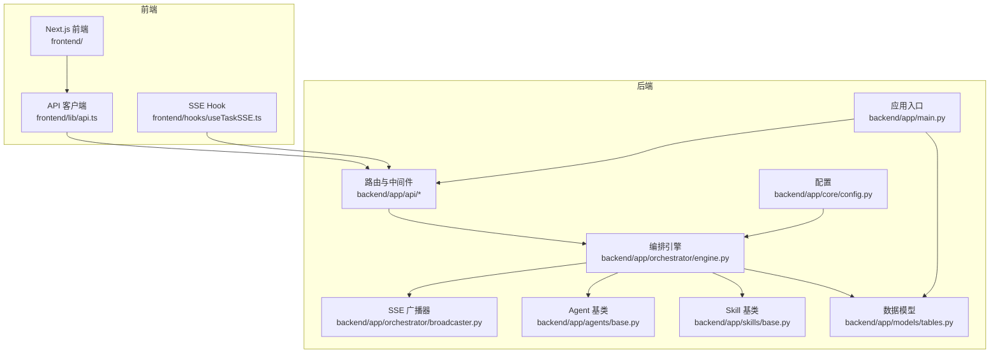
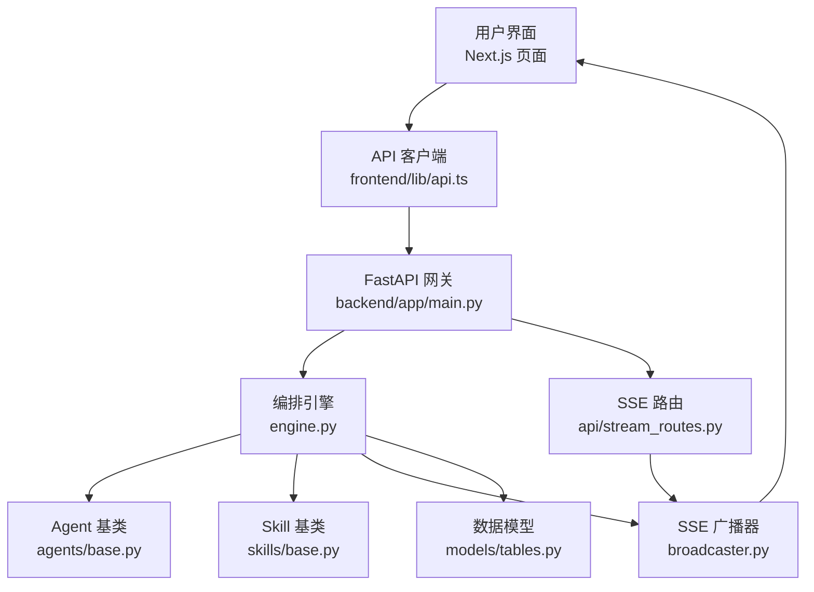
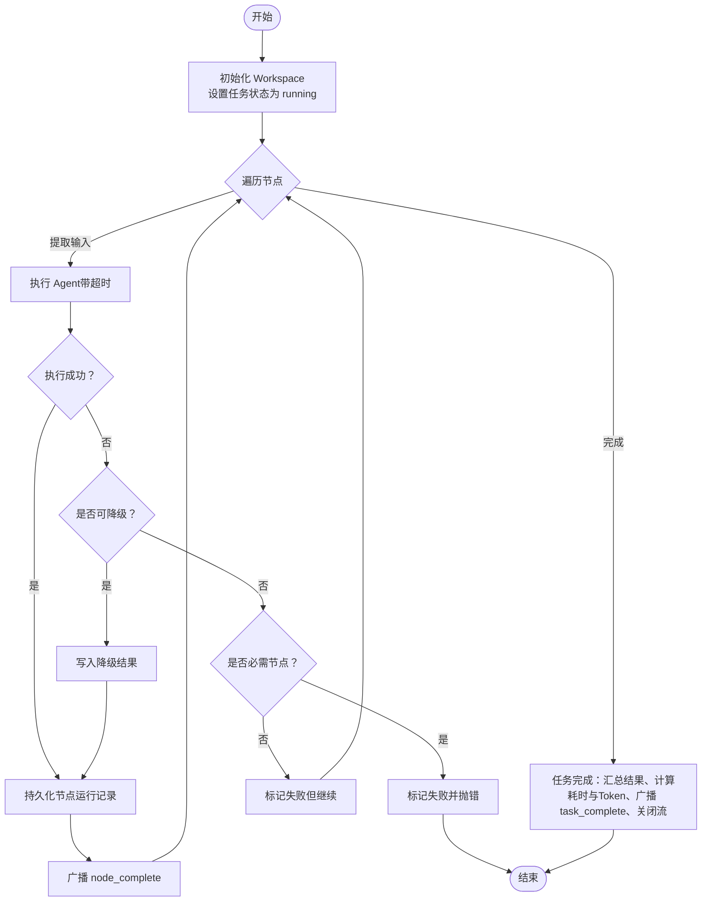
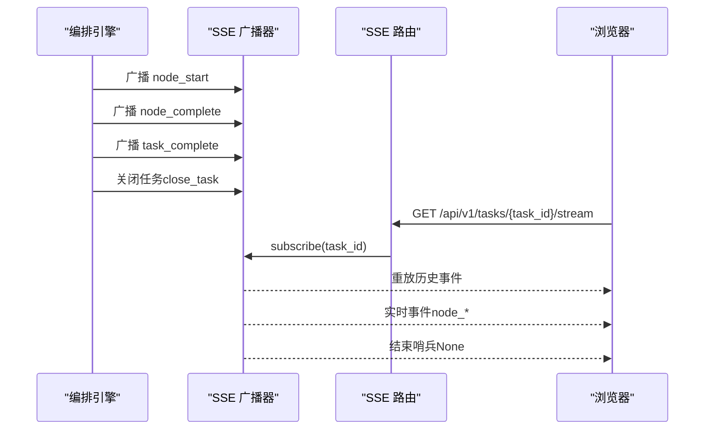
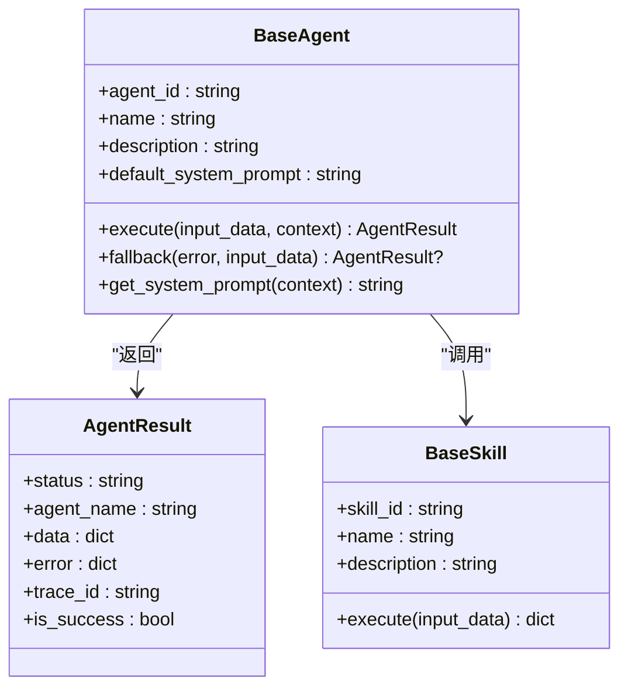
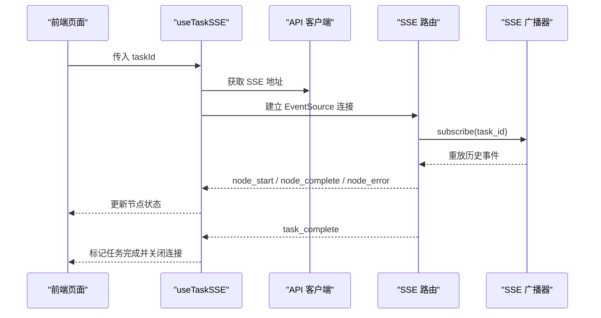
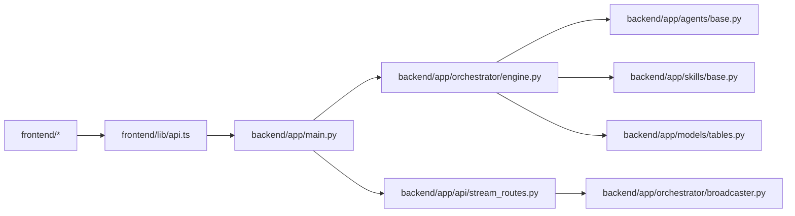

# 系统架构

<cite>
**本文引用的文件**
- [ARCHITECTURE.md](file://ARCHITECTURE.md)
- [backend/pyproject.toml](file://backend/pyproject.toml)
- [frontend/package.json](file://frontend/package.json)
- [OpenClaw-bot-review-main/package.json](file://OpenClaw-bot-review-main/package.json)
- [backend/app/main.py](file://backend/app/main.py)
- [backend/app/orchestrator/engine.py](file://backend/app/orchestrator/engine.py)
- [backend/app/orchestrator/broadcaster.py](file://backend/app/orchestrator/broadcaster.py)
- [backend/app/api/stream_routes.py](file://backend/app/api/stream_routes.py)
- [backend/app/agents/base.py](file://backend/app/agents/base.py)
- [backend/app/skills/base.py](file://backend/app/skills/base.py)
- [backend/app/models/tables.py](file://backend/app/models/tables.py)
- [backend/app/core/config.py](file://backend/app/core/config.py)
- [frontend/lib/api.ts](file://frontend/lib/api.ts)
- [frontend/hooks/useTaskSSE.ts](file://frontend/hooks/useTaskSSE.ts)
- [frontend/app/layout.tsx](file://frontend/app/layout.tsx)
</cite>

## 目录
1. [引言](#引言)
2. [项目结构](#项目结构)
3. [核心组件](#核心组件)
4. [架构总览](#架构总览)
5. [详细组件分析](#详细组件分析)
6. [依赖分析](#依赖分析)
7. [性能考量](#性能考量)
8. [故障排查指南](#故障排查指南)
9. [结论](#结论)
10. [附录](#附录)

## 引言
HotClaw 是一个“基于多智能体协作的公众号内容生产平台”。系统以“前后端分离 + 微服务风格的 Agent 系统 + 事件驱动的 SSE 通信”为核心架构，围绕“工作流编排 + 代理模式 + 观察者模式”的设计思想构建，实现从“账号定位”到“文章草稿”的全链路自动化内容生产。系统强调结构化输入输出、可审计可回放、失败不阻塞、可视化优先等设计原则，并通过声明式注册（Manifest）管理 Agent/Skill/Workflow。

## 项目结构
仓库采用多子项目并行组织：
- backend：FastAPI 后端，包含网关、编排器、Agent 层、Skill 层、服务层、模型与配置等
- frontend：Next.js 前端，提供任务创建、运行监控、结果预览、配置管理、历史回放等页面
- OpenClaw-bot-review-main：另一个 Next.js 前端示例工程，用于对比与参考
- manifests：声明式注册的 Agent/Skill/Workflow/Schema 清单
- data、scripts、hotclaw_*_assets_pack：数据与资源包
- ARCHITECTURE.md：系统架构设计文档

图表来源
- [backend/app/main.py:1-142](file://backend/app/main.py#L1-L142)
- [backend/app/orchestrator/engine.py:1-285](file://backend/app/orchestrator/engine.py#L1-L285)
- [backend/app/orchestrator/broadcaster.py:1-94](file://backend/app/orchestrator/broadcaster.py#L1-L94)
- [backend/app/api/stream_routes.py:1-43](file://backend/app/api/stream_routes.py#L1-L43)
- [backend/app/agents/base.py:1-99](file://backend/app/agents/base.py#L1-L99)
- [backend/app/skills/base.py:1-37](file://backend/app/skills/base.py#L1-L37)
- [backend/app/models/tables.py:1-233](file://backend/app/models/tables.py#L1-L233)
- [backend/app/core/config.py:1-51](file://backend/app/core/config.py#L1-L51)
- [frontend/lib/api.ts:1-110](file://frontend/lib/api.ts#L1-L110)
- [frontend/hooks/useTaskSSE.ts:1-124](file://frontend/hooks/useTaskSSE.ts#L1-L124)

章节来源
- [ARCHITECTURE.md:37-78](file://ARCHITECTURE.md#L37-L78)
- [backend/pyproject.toml:1-41](file://backend/pyproject.toml#L1-L41)
- [frontend/package.json:1-23](file://frontend/package.json#L1-L23)
- [OpenClaw-bot-review-main/package.json:1-23](file://OpenClaw-bot-review-main/package.json#L1-L23)

## 核心组件
- 网关层（FastAPI）
  - 统一入口、参数校验、SSE 端点、CORS、全局异常处理、生命周期管理
- 编排器（Orchestrator Engine）
  - 读取默认线性工作流，逐节点调度 Agent，管理 Workspace 上下文，广播事件，记录节点运行日志
- Agent 层
  - 有角色、有上下文、有决策能力；每个 Agent 有明确输入输出 Schema，内部可调用 LLM 与 Skills
- Skill 层
  - 无状态原子能力（如新闻抓取、摘要、风险检测、标题评分），被 Agent 调用
- 数据层（SQLAlchemy + Alembic）
  - 任务、节点运行、账号画像、候选选题、文章草稿、审核结果、系统日志等模型
- 前端（Next.js + React）
  - 页面路由、组件树、Zustand 状态管理、SSE 实时订阅、API 客户端

章节来源
- [backend/app/main.py:14-142](file://backend/app/main.py#L14-L142)
- [backend/app/orchestrator/engine.py:89-285](file://backend/app/orchestrator/engine.py#L89-L285)
- [backend/app/agents/base.py:49-99](file://backend/app/agents/base.py#L49-L99)
- [backend/app/skills/base.py:16-37](file://backend/app/skills/base.py#L16-L37)
- [backend/app/models/tables.py:23-233](file://backend/app/models/tables.py#L23-L233)
- [frontend/lib/api.ts:1-110](file://frontend/lib/api.ts#L1-L110)
- [frontend/hooks/useTaskSSE.ts:1-124](file://frontend/hooks/useTaskSSE.ts#L1-L124)

## 架构总览
系统采用“前后端分离 + 微服务风格的 Agent 系统 + 事件驱动的 SSE 通信”：
- 前端负责任务创建、运行监控、结果预览、配置管理、历史回放
- 后端负责统一网关、工作流编排、Agent/Skill 执行、状态广播、数据持久化
- SSE 实时推送节点状态，前端即时渲染流水线卡片与日志面板
- 配置通过 Manifest 声明式注册，支持运行时调整 Agent/Skill 配置

图表来源
- [backend/app/main.py:60-142](file://backend/app/main.py#L60-L142)
- [backend/app/orchestrator/engine.py:92-234](file://backend/app/orchestrator/engine.py#L92-L234)
- [backend/app/orchestrator/broadcaster.py:11-94](file://backend/app/orchestrator/broadcaster.py#L11-L94)
- [backend/app/api/stream_routes.py:14-43](file://backend/app/api/stream_routes.py#L14-L43)
- [backend/app/agents/base.py:49-99](file://backend/app/agents/base.py#L49-L99)
- [backend/app/skills/base.py:16-37](file://backend/app/skills/base.py#L16-L37)
- [backend/app/models/tables.py:23-233](file://backend/app/models/tables.py#L23-L233)
- [frontend/lib/api.ts:26-50](file://frontend/lib/api.ts#L26-L50)

## 详细组件分析

### 组件 A：编排引擎（Orchestrator Engine）
- 职责
  - 加载默认线性工作流（MVP 阶段为线性链）
  - 逐节点提取输入、调用 Agent、校验输出、写入 Workspace、持久化节点运行记录
  - 广播节点开始/进度/完成/失败事件，支持降级策略与超时处理
- 关键流程
  - 初始化 Workspace，设置任务状态为 running
  - 依次遍历节点：提取输入、解析有效系统 Prompt、执行 Agent（带超时）、回退策略、持久化节点、广播事件
  - 任务完成后汇总结果、计算耗时与 Token、广播 task_complete、关闭流

图表来源
- [backend/app/orchestrator/engine.py:92-234](file://backend/app/orchestrator/engine.py#L92-L234)

章节来源
- [backend/app/orchestrator/engine.py:89-285](file://backend/app/orchestrator/engine.py#L89-L285)

### 组件 B：SSE 广播器（SSEBroadcaster）
- 职责
  - 维护每个 task_id 的订阅队列，支持事件缓冲与重放，解决前端连接建立时机问题
  - 广播节点事件给所有订阅者，任务结束后发送结束哨兵并清理历史
- 关键点
  - 订阅时重放历史事件
  - 广播时缓冲历史，避免漏掉早期事件
  - 任务结束后清理内存占用

图表来源
- [backend/app/orchestrator/broadcaster.py:30-85](file://backend/app/orchestrator/broadcaster.py#L30-L85)
- [backend/app/api/stream_routes.py:14-43](file://backend/app/api/stream_routes.py#L14-L43)

章节来源
- [backend/app/orchestrator/broadcaster.py:11-94](file://backend/app/orchestrator/broadcaster.py#L11-L94)
- [backend/app/api/stream_routes.py:1-43](file://backend/app/api/stream_routes.py#L1-L43)

### 组件 C：Agent 与 Skill 基类
- Agent 基类
  - 统一输入输出 Schema、系统 Prompt 解析、执行结果封装、降级策略钩子
- Skill 基类
  - 统一输入输出 Schema、无状态执行接口

图表来源
- [backend/app/agents/base.py:49-99](file://backend/app/agents/base.py#L49-L99)
- [backend/app/skills/base.py:16-37](file://backend/app/skills/base.py#L16-L37)

章节来源
- [backend/app/agents/base.py:18-99](file://backend/app/agents/base.py#L18-L99)
- [backend/app/skills/base.py:16-37](file://backend/app/skills/base.py#L16-L37)

### 组件 D：前端实时订阅（SSE Hook）
- 职责
  - 建立与后端的 SSE 连接，监听节点事件并更新本地节点状态
  - 提供任务完成与错误状态，支持重置与清理
- 关键点
  - 事件类型：node_start、node_complete、node_error、task_complete、task_error
  - 与后端默认线性节点顺序保持一致

图表来源
- [frontend/hooks/useTaskSSE.ts:28-124](file://frontend/hooks/useTaskSSE.ts#L28-L124)
- [frontend/lib/api.ts:48-50](file://frontend/lib/api.ts#L48-L50)
- [backend/app/api/stream_routes.py:14-43](file://backend/app/api/stream_routes.py#L14-L43)
- [backend/app/orchestrator/broadcaster.py:30-45](file://backend/app/orchestrator/broadcaster.py#L30-L45)

章节来源
- [frontend/hooks/useTaskSSE.ts:1-124](file://frontend/hooks/useTaskSSE.ts#L1-L124)
- [frontend/lib/api.ts:1-110](file://frontend/lib/api.ts#L1-L110)

### 组件 E：数据模型与持久化
- 核心表
  - 任务表：任务生命周期、状态、耗时、Token 统计
  - 节点运行表：节点执行记录、输入输出、错误、降级标记
  - 账号画像表：解析后的账号领域、受众、关键词等
  - 候选选题表：选题候选及其排序与选择标记
  - 文章草稿表：标题、正文、结构、标签、状态
  - 审核结果表：风险等级、问题列表、总体评论
  - Agent/Skill/Workflow 模板表：配置持久化
  - 系统日志表：结构化日志与追踪
- 设计要点
  - 所有结构化数据均以 JSON 字段存储，便于灵活扩展
  - 通过外键关联任务与其子实体，支持完整回放

章节来源
- [backend/app/models/tables.py:23-233](file://backend/app/models/tables.py#L23-L233)

## 依赖分析
- 技术栈与依赖
  - 后端：FastAPI、SQLAlchemy 2.0、Alembic、Pydantic、Redis、litellm、sse-starlette、aiosqlite 等
  - 前端：Next.js、React、TypeScript、TailwindCSS、Zustand 等
- 模块耦合
  - 网关层对编排器与广播器无直接耦合，通过事件与路由解耦
  - Agent 与 Skill 通过基类抽象，遵循统一接口，便于替换与扩展
  - 前后端通过 SSE 与 REST API 解耦，前端可独立演进

图表来源
- [backend/pyproject.toml:6-22](file://backend/pyproject.toml#L6-L22)
- [frontend/package.json:11-21](file://frontend/package.json#L11-L21)
- [backend/app/main.py:14-137](file://backend/app/main.py#L14-L137)
- [backend/app/orchestrator/engine.py:18-26](file://backend/app/orchestrator/engine.py#L18-L26)
- [backend/app/api/stream_routes.py:5-9](file://backend/app/api/stream_routes.py#L5-L9)
- [backend/app/orchestrator/broadcaster.py:22-28](file://backend/app/orchestrator/broadcaster.py#L22-L28)

章节来源
- [backend/pyproject.toml:1-41](file://backend/pyproject.toml#L1-L41)
- [frontend/package.json:1-23](file://frontend/package.json#L1-L23)
- [OpenClaw-bot-review-main/package.json:1-23](file://OpenClaw-bot-review-main/package.json#L1-L23)

## 性能考量
- 并发与异步
  - 后端使用 asyncio 与异步 SQLAlchemy，避免阻塞 IO；SSE 广播器使用 asyncio.Queue 实现事件队列
- 超时与降级
  - Agent 执行超时保护，失败时尝试降级策略，必要时中断并回滚
- 缓存与配置
  - Redis 用于缓存热点与配置，减少重复请求
- 日志与追踪
  - 结构化日志与 trace_id 传播，便于性能分析与问题定位
- 前端渲染
  - 使用 React 组件与 Zustand 状态管理，SSE 事件驱动局部更新，降低重绘成本

## 故障排查指南
- 常见错误类型与处理
  - Agent 执行错误：编排器捕获并广播 node_error；必要时触发降级或中断
  - 超时错误：编排器捕获 asyncio.TimeoutError，标记失败并根据必需性决定是否中断
  - 未处理异常：全局异常处理器统一返回 JSON 响应，包含错误码与消息
- 日志与追踪
  - 系统日志表记录 trace_id、模块、级别、消息与上下文，支持回放与审计
- 前端诊断
  - 使用 useTaskSSE 监听事件，确认连接建立、事件到达与任务完成信号
  - 检查 API 客户端请求与响应，确保 basePath 与路由正确

章节来源
- [backend/app/orchestrator/engine.py:176-197](file://backend/app/orchestrator/engine.py#L176-L197)
- [backend/app/main.py:87-129](file://backend/app/main.py#L87-L129)
- [backend/app/models/tables.py:220-233](file://backend/app/models/tables.py#L220-L233)
- [frontend/hooks/useTaskSSE.ts:58-120](file://frontend/hooks/useTaskSSE.ts#L58-L120)
- [frontend/lib/api.ts:14-24](file://frontend/lib/api.ts#L14-L24)

## 结论
HotClaw 以“工作流编排 + 代理模式 + 观察者模式”为核心，结合前后端分离与事件驱动的 SSE 通信，实现了从账号定位到文章草稿的全链路自动化内容生产。系统通过声明式注册、结构化输入输出、可审计可回放、失败不阻塞等设计原则，兼顾了可维护性、可观测性与可扩展性。MVP 阶段采用线性工作流与内置编排器，满足快速落地与迭代需求；未来可平滑演进至 DAG 工作流与微服务拆分。

## 附录
- 技术选型说明
  - FastAPI：异步支持好、自动 OpenAPI 文档、SSE 支持，适合作为统一网关
  - React/Next.js：组件化与路由完善，适合构建复杂的可视化与交互页面
  - Canvas 2D：当前 MVP 不使用 Canvas，仅采用垂直流水线卡片布局，但架构预留 DAG 可视化扩展点
- 分层架构理念
  - 表现层：前端页面与组件，负责可视化与交互
  - 业务层：编排器与 Agent/Skill，负责工作流调度与原子能力执行
  - 数据层：ORM 模型与数据库，负责结构化数据持久化
- 架构演进与扩展性
  - 支持 DAG 工作流编辑器（延后功能）
  - 插件（Plugin）用于接入外部系统（公众号 API、数据分析平台）
  - 分布式/高可用（延后功能），当前单机单进程足以支撑 MVP

章节来源
- [ARCHITECTURE.md:191-205](file://ARCHITECTURE.md#L191-L205)
- [ARCHITECTURE.md:401-448](file://ARCHITECTURE.md#L401-L448)
- [ARCHITECTURE.md:761-782](file://ARCHITECTURE.md#L761-L782)
- [ARCHITECTURE.md:177-187](file://ARCHITECTURE.md#L177-L187)