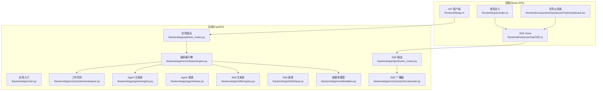
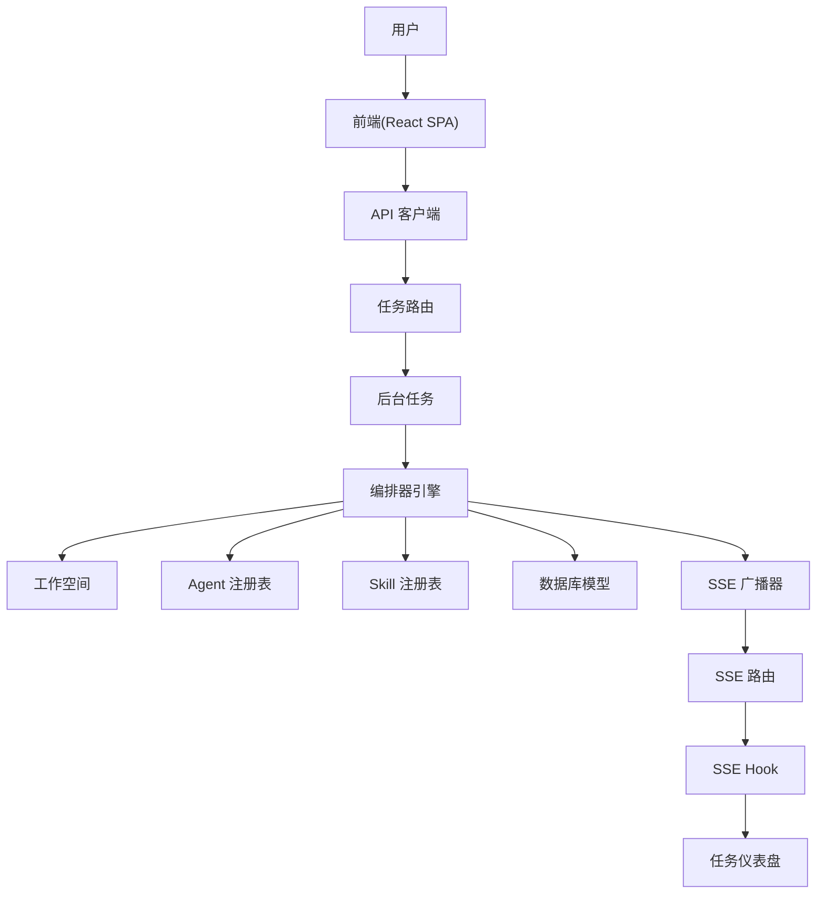
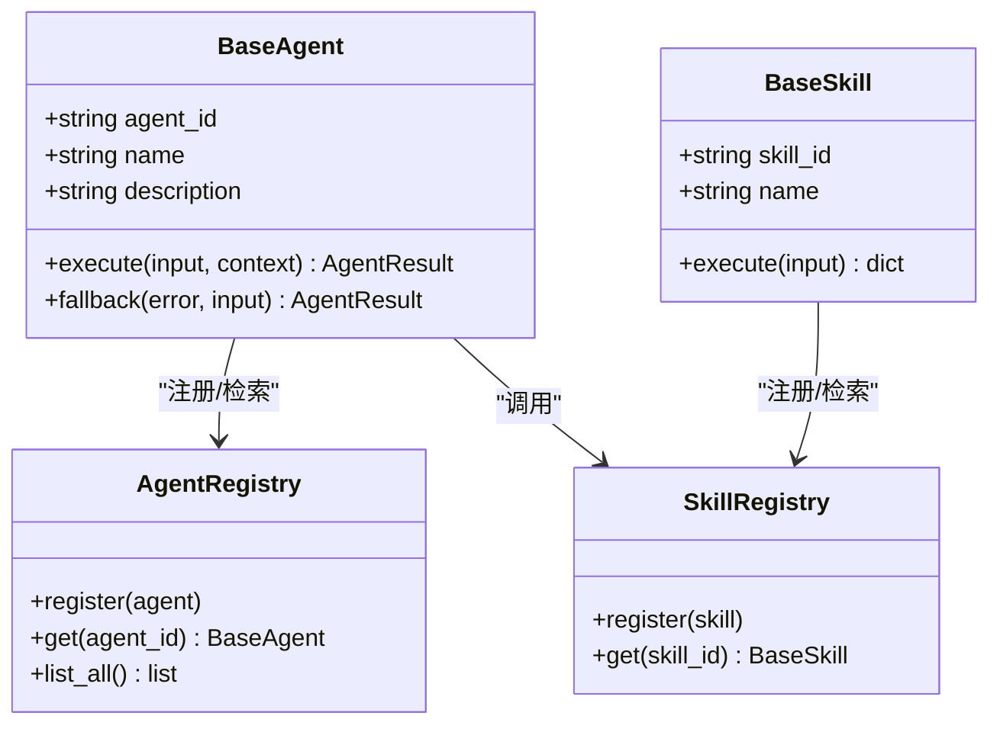
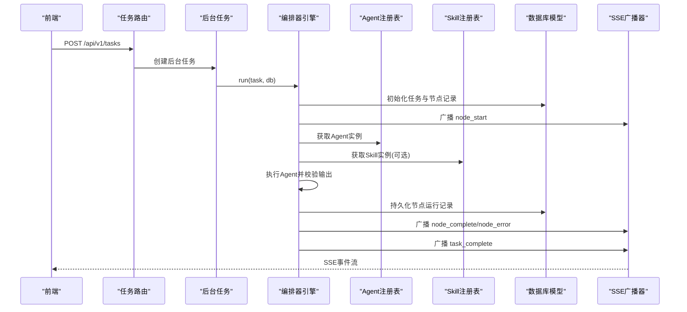
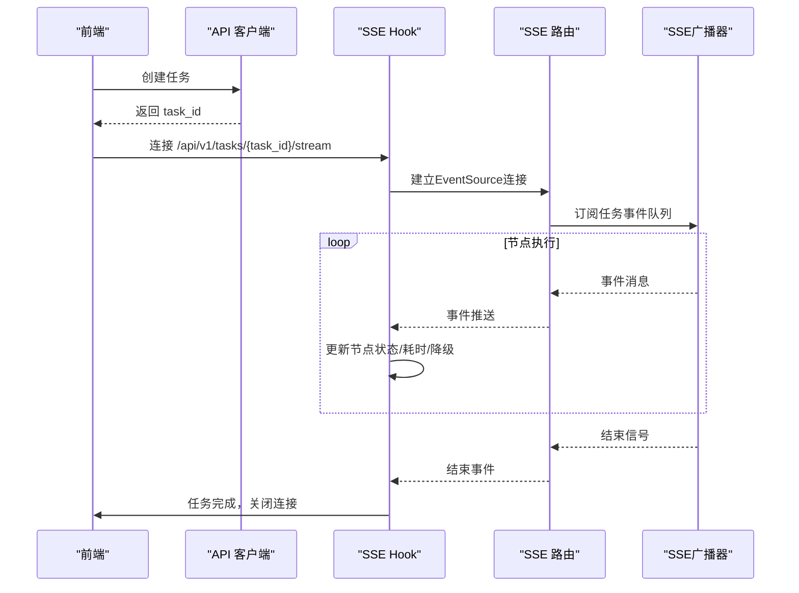
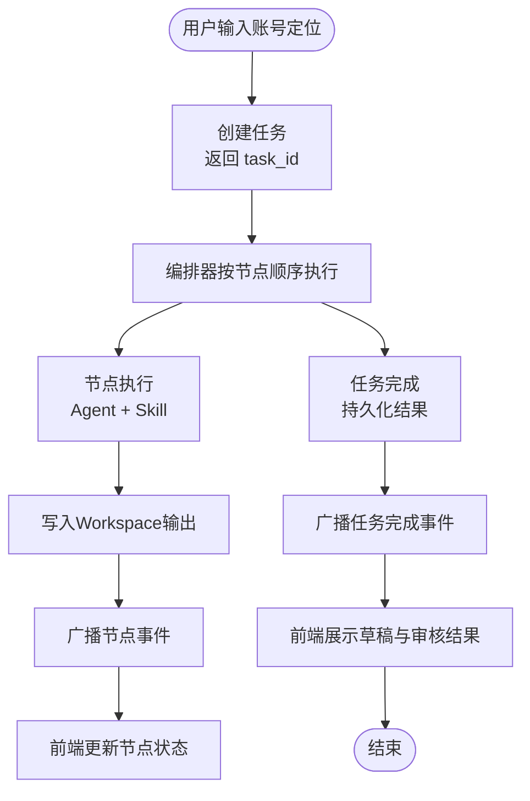
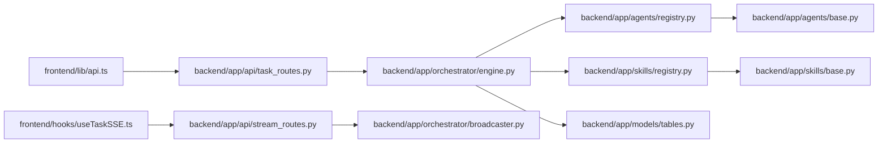

# 组件交互关系

<cite>
**本文引用的文件**   
- [ARCHITECTURE.md](file://ARCHITECTURE.md)
- [backend/app/main.py](file://backend/app/main.py)
- [backend/app/api/task_routes.py](file://backend/app/api/task_routes.py)
- [backend/app/api/stream_routes.py](file://backend/app/api/stream_routes.py)
- [backend/app/orchestrator/engine.py](file://backend/app/orchestrator/engine.py)
- [backend/app/orchestrator/broadcaster.py](file://backend/app/orchestrator/broadcaster.py)
- [backend/app/orchestrator/workspace.py](file://backend/app/orchestrator/workspace.py)
- [backend/app/agents/base.py](file://backend/app/agents/base.py)
- [backend/app/agents/registry.py](file://backend/app/agents/registry.py)
- [backend/app/skills/base.py](file://backend/app/skills/base.py)
- [backend/app/skills/registry.py](file://backend/app/skills/registry.py)
- [backend/app/models/tables.py](file://backend/app/models/tables.py)
- [frontend/lib/api.ts](file://frontend/lib/api.ts)
- [frontend/hooks/useTaskSSE.ts](file://frontend/hooks/useTaskSSE.ts)
- [frontend/types/index.ts](file://frontend/types/index.ts)
- [frontend/components/dashboard/TaskDashboard.tsx](file://frontend/components/dashboard/TaskDashboard.tsx)
</cite>

## 目录
1. [简介](#简介)
2. [项目结构](#项目结构)
3. [核心组件](#核心组件)
4. [架构总览](#架构总览)
5. [详细组件分析](#详细组件分析)
6. [依赖关系分析](#依赖关系分析)
7. [性能考量](#性能考量)
8. [故障排查指南](#故障排查指南)
9. [结论](#结论)
10. [附录](#附录)

## 简介
本技术文档聚焦HotClaw组件交互关系，系统性阐述Agent与Skill的协作、Orchestrator与Agent的调度机制，以及前端与后端的SSE通信模式。文档覆盖从用户输入到最终草稿输出的完整数据流，明确各组件职责边界与接口契约，并提供时序图与数据流图帮助开发者快速集成与调试。

## 项目结构
HotClaw采用前后端分离架构：前端为React SPA，后端为FastAPI应用，中间通过HTTP + SSE进行实时通信。后端模块按职责分层：API网关、编排器、Agent层、Skill层、服务层、模型层与核心工具层。

**图表来源**
- [backend/app/main.py:69-153](file://backend/app/main.py#L69-L153)
- [backend/app/api/task_routes.py:1-179](file://backend/app/api/task_routes.py#L1-L179)
- [backend/app/api/stream_routes.py:1-43](file://backend/app/api/stream_routes.py#L1-L43)
- [backend/app/orchestrator/engine.py:89-285](file://backend/app/orchestrator/engine.py#L89-L285)
- [backend/app/orchestrator/broadcaster.py:11-99](file://backend/app/orchestrator/broadcaster.py#L11-L99)
- [backend/app/orchestrator/workspace.py](file://backend/app/orchestrator/workspace.py)
- [backend/app/agents/base.py:18-99](file://backend/app/agents/base.py#L18-L99)
- [backend/app/agents/registry.py:10-40](file://backend/app/agents/registry.py#L10-L40)
- [backend/app/skills/base.py:16-37](file://backend/app/skills/base.py#L16-L37)
- [backend/app/skills/registry.py:10-37](file://backend/app/skills/registry.py#L10-L37)
- [backend/app/models/tables.py:23-319](file://backend/app/models/tables.py#L23-L319)
- [frontend/lib/api.ts:1-289](file://frontend/lib/api.ts#L1-L289)
- [frontend/hooks/useTaskSSE.ts:1-144](file://frontend/hooks/useTaskSSE.ts#L1-L144)
- [frontend/types/index.ts:1-119](file://frontend/types/index.ts#L1-L119)
- [frontend/components/dashboard/TaskDashboard.tsx:1-176](file://frontend/components/dashboard/TaskDashboard.tsx#L1-L176)

**章节来源**
- [ARCHITECTURE.md:37-90](file://ARCHITECTURE.md#L37-L90)
- [backend/app/main.py:69-153](file://backend/app/main.py#L69-L153)

## 核心组件
- 前端组件
  - API客户端：封装后端REST接口，统一错误处理与响应结构。
  - SSE Hook：建立EventSource连接，订阅任务事件流，驱动UI状态更新。
  - 类型定义：统一前后端数据契约，确保事件与节点状态结构一致。
  - 仪表盘：聚合节点状态、计算成功率与平均耗时，提供可视化监控。
- 后端组件
  - 应用入口：注册路由、中间件与生命周期钩子，初始化数据库与系统配置。
  - 任务路由：接收任务创建请求，异步后台执行编排器。
  - SSE路由：基于EventSourceResponse提供事件流，供前端订阅。
  - 编排器引擎：按线性DAG顺序调度Agent，管理Workspace上下文，广播节点状态。
  - 广播器：维护每任务的订阅队列与历史缓冲，支持延迟加入与重放。
  - Agent基类与注册表：定义Agent接口、结果封装与降级策略，集中注册与检索。
  - Skill基类与注册表：定义Skill接口与配置Schema，集中注册与检索。
  - 数据模型：持久化任务、节点运行、草稿、审核、系统日志与系统配置。

**章节来源**
- [frontend/lib/api.ts:1-289](file://frontend/lib/api.ts#L1-L289)
- [frontend/hooks/useTaskSSE.ts:1-144](file://frontend/hooks/useTaskSSE.ts#L1-L144)
- [frontend/types/index.ts:1-119](file://frontend/types/index.ts#L1-L119)
- [frontend/components/dashboard/TaskDashboard.tsx:1-176](file://frontend/components/dashboard/TaskDashboard.tsx#L1-L176)
- [backend/app/main.py:34-67](file://backend/app/main.py#L34-L67)
- [backend/app/api/task_routes.py:22-67](file://backend/app/api/task_routes.py#L22-L67)
- [backend/app/api/stream_routes.py:14-43](file://backend/app/api/stream_routes.py#L14-L43)
- [backend/app/orchestrator/engine.py:89-285](file://backend/app/orchestrator/engine.py#L89-L285)
- [backend/app/orchestrator/broadcaster.py:11-99](file://backend/app/orchestrator/broadcaster.py#L11-L99)
- [backend/app/agents/base.py:18-99](file://backend/app/agents/base.py#L18-L99)
- [backend/app/agents/registry.py:10-40](file://backend/app/agents/registry.py#L10-L40)
- [backend/app/skills/base.py:16-37](file://backend/app/skills/base.py#L16-L37)
- [backend/app/skills/registry.py:10-37](file://backend/app/skills/registry.py#L10-L37)
- [backend/app/models/tables.py:23-319](file://backend/app/models/tables.py#L23-L319)

## 架构总览
HotClaw采用“控制平面与执行平面分离”的设计理念：Orchestrator作为控制平面负责调度与状态广播，Agent作为执行平面负责具体业务任务。Skill作为无状态原子能力被Agent调用。前端通过SSE实时消费事件流，实现链路可视化与交互反馈。

**图表来源**
- [ARCHITECTURE.md:92-135](file://ARCHITECTURE.md#L92-L135)
- [backend/app/main.py:69-153](file://backend/app/main.py#L69-L153)
- [backend/app/api/task_routes.py:22-67](file://backend/app/api/task_routes.py#L22-L67)
- [backend/app/api/stream_routes.py:14-43](file://backend/app/api/stream_routes.py#L14-L43)
- [backend/app/orchestrator/engine.py:89-285](file://backend/app/orchestrator/engine.py#L89-L285)
- [backend/app/orchestrator/broadcaster.py:11-99](file://backend/app/orchestrator/broadcaster.py#L11-L99)
- [frontend/lib/api.ts:1-289](file://frontend/lib/api.ts#L1-L289)
- [frontend/hooks/useTaskSSE.ts:1-144](file://frontend/hooks/useTaskSSE.ts#L1-L144)
- [frontend/components/dashboard/TaskDashboard.tsx:1-176](file://frontend/components/dashboard/TaskDashboard.tsx#L1-L176)

## 详细组件分析

### Agent与Skill协作关系
- Agent职责
  - 有角色、有上下文、有决策能力；每个Agent定义明确的输入/输出Schema；内部可调用LLM与/或Skills完成任务。
  - 提供标准化执行结果封装与可选降级策略，失败时返回结构化错误。
- Skill职责
  - 无状态的原子能力单元，封装具体技术操作（如API调用、数据处理、规则匹配），对外提供标准化输入/输出接口。
- 协作方式
  - Agent通过注册表获取所需Skill实例，构造Skill输入并调用其execute方法；Skill执行完成后，Agent再结合LLM进行二次处理或直接使用Skill输出。

**图表来源**
- [backend/app/agents/base.py:18-99](file://backend/app/agents/base.py#L18-L99)
- [backend/app/agents/registry.py:10-40](file://backend/app/agents/registry.py#L10-L40)
- [backend/app/skills/base.py:16-37](file://backend/app/skills/base.py#L16-L37)
- [backend/app/skills/registry.py:10-37](file://backend/app/skills/registry.py#L10-L37)

**章节来源**
- [ARCHITECTURE.md:635-760](file://ARCHITECTURE.md#L635-L760)
- [backend/app/agents/base.py:18-99](file://backend/app/agents/base.py#L18-L99)
- [backend/app/skills/base.py:16-37](file://backend/app/skills/base.py#L16-L37)

### Orchestrator与Agent调度机制
- 工作流定义
  - MVP阶段为线性DAG，节点顺序固定；每个节点包含agent_id、输入映射、输出键与必填标志。
- 调度流程
  - 初始化Workspace，逐节点提取输入，广播node_start，执行Agent，校验输出Schema，写入Workspace，持久化节点运行记录，广播node_complete或node_error。
  - 支持超时与异常处理，必要时触发降级策略；任务完成后广播task_complete并关闭流。
- 上下文管理
  - Workspace作为任务级上下文容器，按节点映射抽取输入，汇总输出，支持系统提示注入与令牌统计。

**图表来源**
- [backend/app/api/task_routes.py:22-67](file://backend/app/api/task_routes.py#L22-L67)
- [backend/app/orchestrator/engine.py:89-285](file://backend/app/orchestrator/engine.py#L89-L285)
- [backend/app/orchestrator/broadcaster.py:11-99](file://backend/app/orchestrator/broadcaster.py#L11-L99)
- [backend/app/agents/registry.py:10-40](file://backend/app/agents/registry.py#L10-L40)
- [backend/app/skills/registry.py:10-37](file://backend/app/skills/registry.py#L10-L37)
- [backend/app/models/tables.py:23-319](file://backend/app/models/tables.py#L23-L319)

**章节来源**
- [ARCHITECTURE.md:496-538](file://ARCHITECTURE.md#L496-L538)
- [backend/app/orchestrator/engine.py:89-285](file://backend/app/orchestrator/engine.py#L89-L285)

### 前端与后端SSE通信模式
- 建立连接
  - 前端通过API客户端创建任务后，使用SSE Hook连接后端SSE端点，URL根据运行环境动态拼接。
- 事件类型
  - node_start：节点开始执行，携带节点索引与总数。
  - node_progress：节点执行中（当前未在后端实现，前端预留）。
  - node_complete：节点完成，携带耗时、降级标记与输出摘要。
  - node_error：节点失败，携带错误信息。
  - task_complete：任务完成，携带总耗时。
  - task_error：任务级错误（当前未在后端实现，前端预留）。
- 前端消费
  - SSE Hook监听事件，更新节点状态、耗时与降级标记；任务完成后关闭连接并标记完成。

**图表来源**
- [frontend/lib/api.ts:48-55](file://frontend/lib/api.ts#L48-L55)
- [frontend/hooks/useTaskSSE.ts:60-140](file://frontend/hooks/useTaskSSE.ts#L60-L140)
- [backend/app/api/stream_routes.py:14-43](file://backend/app/api/stream_routes.py#L14-L43)
- [backend/app/orchestrator/broadcaster.py:30-95](file://backend/app/orchestrator/broadcaster.py#L30-L95)

**章节来源**
- [ARCHITECTURE.md:325-360](file://ARCHITECTURE.md#L325-L360)
- [frontend/lib/api.ts:1-289](file://frontend/lib/api.ts#L1-L289)
- [frontend/hooks/useTaskSSE.ts:1-144](file://frontend/hooks/useTaskSSE.ts#L1-L144)
- [backend/app/api/stream_routes.py:14-43](file://backend/app/api/stream_routes.py#L14-L43)
- [backend/app/orchestrator/broadcaster.py:11-99](file://backend/app/orchestrator/broadcaster.py#L11-L99)

### 数据在系统中的流转过程
- 用户输入
  - 前端提交账号定位，后端创建任务并立即返回task_id。
- 编排执行
  - 后端异步运行编排器，按节点顺序执行Agent；每个节点将输出写入Workspace并广播事件。
- 结果产出
  - 任务完成后，后端持久化最终结果；前端通过SSE接收完成事件，进入结果页展示草稿与审核结果。

**图表来源**
- [backend/app/api/task_routes.py:39-67](file://backend/app/api/task_routes.py#L39-L67)
- [backend/app/orchestrator/engine.py:92-234](file://backend/app/orchestrator/engine.py#L92-L234)
- [backend/app/orchestrator/broadcaster.py:57-95](file://backend/app/orchestrator/broadcaster.py#L57-L95)
- [frontend/hooks/useTaskSSE.ts:74-119](file://frontend/hooks/useTaskSSE.ts#L74-L119)

**章节来源**
- [ARCHITECTURE.md:138-176](file://ARCHITECTURE.md#L138-L176)
- [backend/app/api/task_routes.py:39-179](file://backend/app/api/task_routes.py#L39-L179)
- [backend/app/orchestrator/engine.py:92-234](file://backend/app/orchestrator/engine.py#L92-L234)

## 依赖关系分析
- 组件耦合
  - 前端仅依赖后端REST与SSE接口，耦合度低，便于替换前端形态。
  - 后端通过注册表解耦Agent与Skill，便于新增与替换。
  - 编排器通过Workspace抽象屏蔽Agent间数据耦合，提升内聚性。
- 外部依赖
  - 数据库：SQLAlchemy ORM + Alembic迁移。
  - 日志与追踪：结构化日志与trace_id传播。
  - SSE：sset-starlette提供事件流支持。
- 循环依赖
  - 通过注册表与模块导入避免循环依赖；Agent与Skill均依赖注册表但不反向依赖具体实现。

**图表来源**
- [frontend/lib/api.ts:1-289](file://frontend/lib/api.ts#L1-L289)
- [frontend/hooks/useTaskSSE.ts:1-144](file://frontend/hooks/useTaskSSE.ts#L1-L144)
- [backend/app/api/task_routes.py:1-179](file://backend/app/api/task_routes.py#L1-L179)
- [backend/app/api/stream_routes.py:1-43](file://backend/app/api/stream_routes.py#L1-L43)
- [backend/app/orchestrator/engine.py:18-26](file://backend/app/orchestrator/engine.py#L18-L26)
- [backend/app/orchestrator/broadcaster.py:11-20](file://backend/app/orchestrator/broadcaster.py#L11-L20)
- [backend/app/agents/registry.py:10-40](file://backend/app/agents/registry.py#L10-L40)
- [backend/app/skills/registry.py:10-37](file://backend/app/skills/registry.py#L10-L37)
- [backend/app/agents/base.py:18-99](file://backend/app/agents/base.py#L18-L99)
- [backend/app/skills/base.py:16-37](file://backend/app/skills/base.py#L16-L37)
- [backend/app/models/tables.py:23-319](file://backend/app/models/tables.py#L23-L319)

**章节来源**
- [backend/app/main.py:14-21](file://backend/app/main.py#L14-L21)
- [backend/app/api/task_routes.py:14-21](file://backend/app/api/task_routes.py#L14-L21)
- [backend/app/api/stream_routes.py:9](file://backend/app/api/stream_routes.py#L9)

## 性能考量
- 事件流优化
  - 广播器使用队列与历史缓冲，支持延迟订阅与重放，避免前端竞态丢失事件。
  - SSE端点设置超时发送keepalive注释，维持长连接稳定性。
- 执行超时与降级
  - 编排器为Agent执行设置超时，失败时尝试降级策略，降低整条链路阻断风险。
- 数据持久化
  - 节点运行记录包含耗时、令牌消耗与模型使用，便于性能分析与成本控制。
- 前端渲染
  - 仪表盘聚合计算成功率与平均耗时，减少重复请求；节点状态变更驱动局部更新。

[本节为通用指导，无需特定文件来源]

## 故障排查指南
- 常见问题定位
  - 任务未开始：确认任务创建成功并已启动后台任务；检查编排器是否抛出异常。
  - 节点长时间pending：检查Agent注册是否正确、系统提示是否生效、依赖的Skill是否可用。
  - SSE连接失败：确认SSE端点可达、浏览器EventSource支持、跨域配置正确。
  - 任务完成后无结果：检查编排器是否持久化结果、前端是否收到task_complete事件。
- 日志与追踪
  - 后端通过结构化日志记录trace_id与节点执行上下文，便于问题回溯。
  - 前端SSE Hook打印事件日志，辅助定位事件缺失或解析错误。
- 降级策略
  - Agent可提供降级返回；若节点required且降级失败，编排器会终止任务并上报错误。

**章节来源**
- [backend/app/orchestrator/engine.py:176-197](file://backend/app/orchestrator/engine.py#L176-L197)
- [backend/app/orchestrator/broadcaster.py:57-95](file://backend/app/orchestrator/broadcaster.py#L57-L95)
- [frontend/hooks/useTaskSSE.ts:69-133](file://frontend/hooks/useTaskSSE.ts#L69-L133)

## 结论
HotClaw通过清晰的职责划分与标准化接口，实现了Agent与Skill的松耦合协作、编排器的线性调度与前端的实时可视化。SSE事件流确保了任务状态的即时反馈，Workspace上下文使多Agent协同具备可审计与可回放能力。该架构为后续扩展DAG工作流与插件系统奠定了坚实基础。

[本节为总结，无需特定文件来源]

## 附录
- 组件集成指南
  - 新增Agent：实现BaseAgent子类，定义输入/输出Schema与执行逻辑，注册到AgentRegistry。
  - 新增Skill：实现BaseSkill子类，定义输入/输出Schema与配置Schema，注册到SkillRegistry。
  - 新增前端页面：遵循类型定义与SSE事件契约，使用API客户端与SSE Hook完成集成。
- 调试方法
  - 后端：开启调试日志，观察编排器事件广播与节点状态持久化；使用任务状态接口查询节点详情。
  - 前端：启用SSE日志，检查事件类型与数据结构；在仪表盘观察成功率与平均耗时。

**章节来源**
- [ARCHITECTURE.md:92-135](file://ARCHITECTURE.md#L92-L135)
- [backend/app/agents/base.py:18-99](file://backend/app/agents/base.py#L18-L99)
- [backend/app/skills/base.py:16-37](file://backend/app/skills/base.py#L16-L37)
- [frontend/lib/api.ts:1-289](file://frontend/lib/api.ts#L1-L289)
- [frontend/hooks/useTaskSSE.ts:1-144](file://frontend/hooks/useTaskSSE.ts#L1-L144)