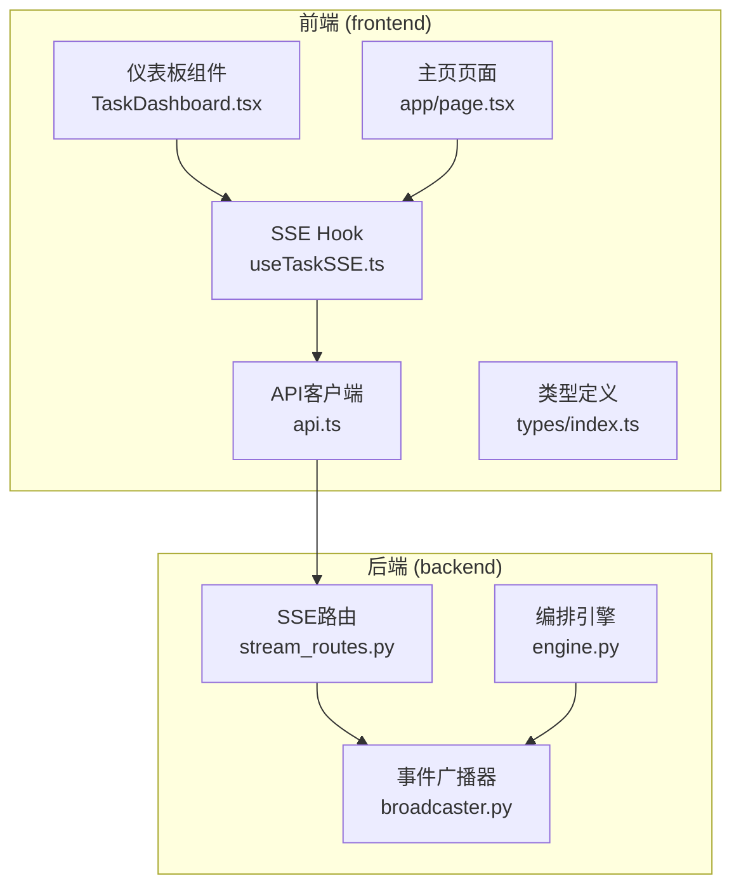
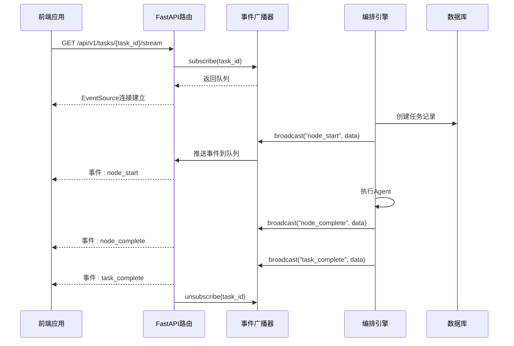
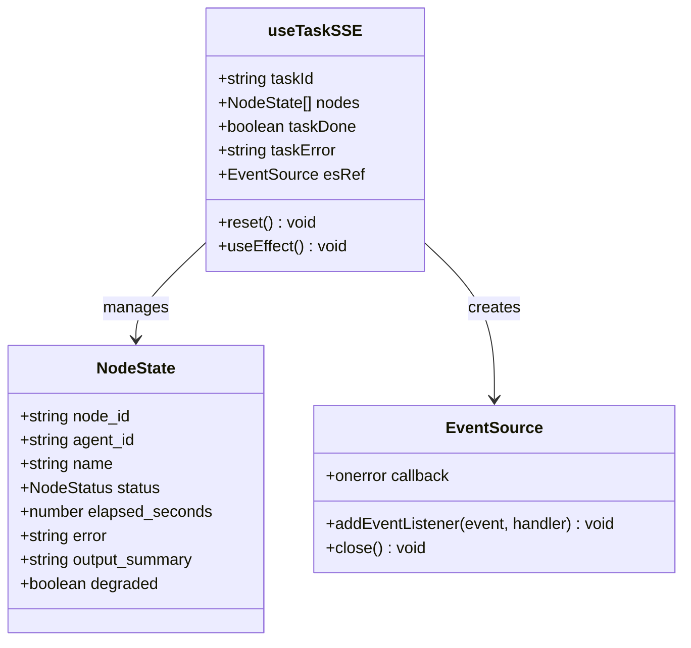
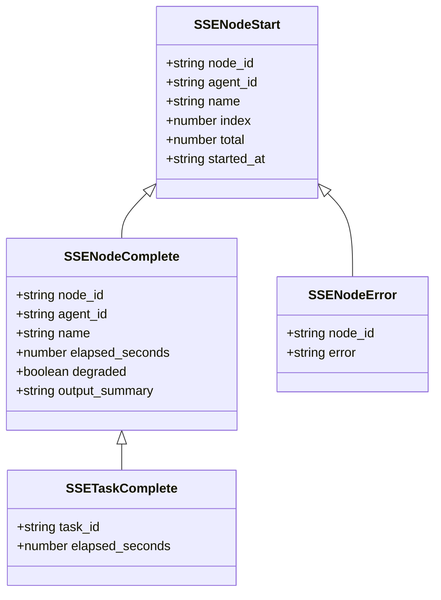
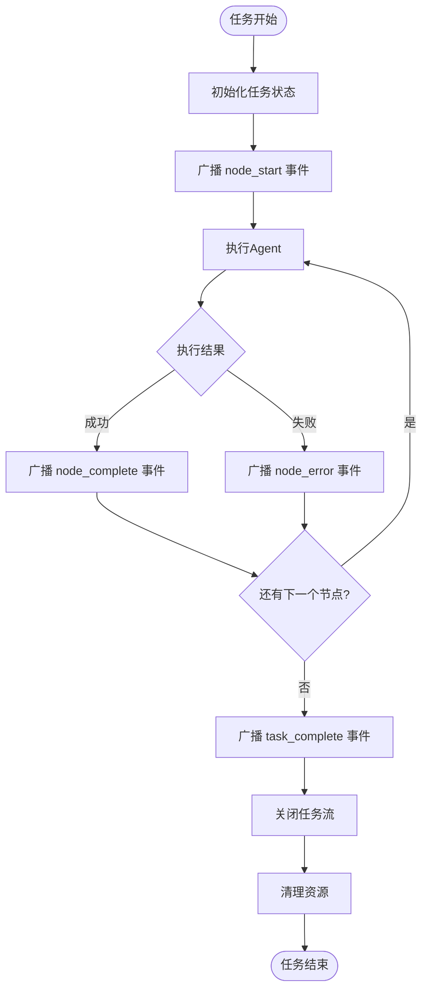
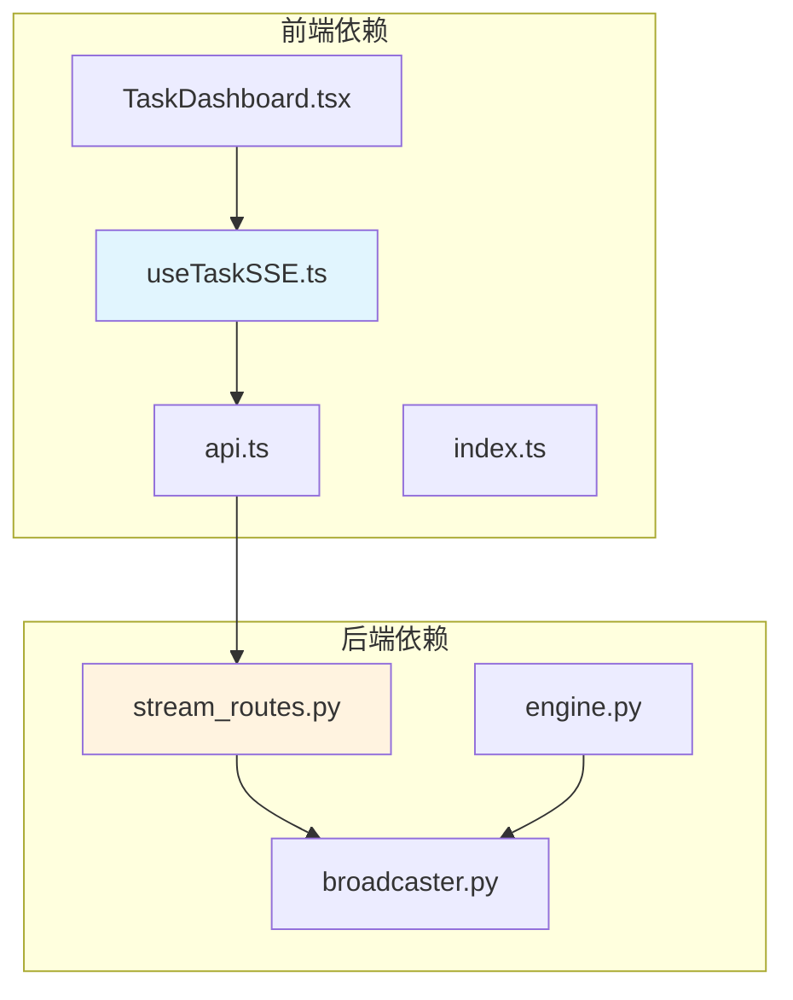

# 实时通信架构

<cite>
**本文档引用的文件**
- [stream_routes.py](file://backend/app/api/stream_routes.py)
- [broadcaster.py](file://backend/app/orchestrator/broadcaster.py)
- [engine.py](file://backend/app/orchestrator/engine.py)
- [useTaskSSE.ts](file://frontend/hooks/useTaskSSE.ts)
- [api.ts](file://frontend/lib/api.ts)
- [TaskDashboard.tsx](file://frontend/components/dashboard/TaskDashboard.tsx)
- [page.tsx](file://frontend/app/page.tsx)
- [index.ts](file://frontend/types/index.ts)
</cite>

## 目录
1. [简介](#简介)
2. [项目结构](#项目结构)
3. [核心组件](#核心组件)
4. [架构概览](#架构概览)
5. [详细组件分析](#详细组件分析)
6. [依赖关系分析](#依赖关系分析)
7. [性能考虑](#性能考虑)
8. [故障排除指南](#故障排除指南)
9. [结论](#结论)

## 简介

HotClaw系统采用Server-Sent Events (SSE)技术实现实时通信，为用户提供任务执行状态的实时更新。该架构通过后端事件广播器管理多个订阅者连接，前端使用EventSource API接收实时事件流，实现了高效的任务状态监控和可视化展示。

SSE架构具有以下优势：
- 单向实时数据推送，减少服务器压力
- 自动重连机制，提高可靠性
- 支持事件类型区分，便于前端处理
- 内存友好的事件缓冲，解决连接时序问题

## 项目结构

HotClaw系统的实时通信架构主要分布在以下目录结构中：



**图表来源**
- [stream_routes.py:1-43](file://backend/app/api/stream_routes.py#L1-L43)
- [broadcaster.py:1-94](file://backend/app/orchestrator/broadcaster.py#L1-L94)
- [engine.py:1-285](file://backend/app/orchestrator/engine.py#L1-L285)

**章节来源**
- [stream_routes.py:1-43](file://backend/app/api/stream_routes.py#L1-L43)
- [broadcaster.py:1-94](file://backend/app/orchestrator/broadcaster.py#L1-L94)
- [engine.py:1-285](file://backend/app/orchestrator/engine.py#L1-L285)

## 核心组件

### 后端SSE端点

后端通过FastAPI路由提供SSE服务，使用sse-starlette库实现标准的SSE协议。

**关键特性：**
- 异步事件生成器模式
- 连接超时检测和保活机制
- 自动清理订阅队列
- JSON数据序列化支持

**章节来源**
- [stream_routes.py:14-42](file://backend/app/api/stream_routes.py#L14-L42)

### 事件广播器

SSEBroadcaster类管理每个任务的事件队列，支持多订阅者模式和事件历史缓冲。

**核心功能：**
- 订阅者队列管理
- 事件历史缓冲（解决连接时序问题）
- 任务关闭信号处理
- 内存自动清理机制

**章节来源**
- [broadcaster.py:11-94](file://backend/app/orchestrator/broadcaster.py#L11-L94)

### 编排引擎

OrchestratorEngine负责任务执行流程，并在关键节点广播事件。

**事件类型：**
- `node_start`: 节点开始执行
- `node_complete`: 节点执行完成
- `node_error`: 节点执行错误
- `task_complete`: 任务完成
- `task_error`: 任务执行错误

**章节来源**
- [engine.py:89-285](file://backend/app/orchestrator/engine.py#L89-L285)

## 架构概览

HotClaw的实时通信架构采用分层设计，确保高可用性和可扩展性：



**图表来源**
- [stream_routes.py:14-42](file://backend/app/api/stream_routes.py#L14-L42)
- [broadcaster.py:30-45](file://backend/app/orchestrator/broadcaster.py#L30-L45)
- [engine.py:124-232](file://backend/app/orchestrator/engine.py#L124-L232)

## 详细组件分析

### 前端EventSource集成

前端使用自定义Hook管理SSE连接，提供完整的生命周期控制：



**图表来源**
- [useTaskSSE.ts:28-124](file://frontend/hooks/useTaskSSE.ts#L28-L124)

**章节来源**
- [useTaskSSE.ts:1-124](file://frontend/hooks/useTaskSSE.ts#L1-L124)

### 事件类型定义

系统定义了完整的事件类型体系，确保前后端一致性：



**图表来源**
- [index.ts:66-95](file://frontend/types/index.ts#L66-L95)

**章节来源**
- [index.ts:66-95](file://frontend/types/index.ts#L66-L95)

### 连接管理与状态广播

编排引擎在任务执行的关键节点发送事件，确保前端能够实时反映执行状态：



**图表来源**
- [engine.py:124-232](file://backend/app/orchestrator/engine.py#L124-L232)

**章节来源**
- [engine.py:124-232](file://backend/app/orchestrator/engine.py#L124-L232)

## 依赖关系分析

系统各组件之间的依赖关系清晰明确：



**图表来源**
- [useTaskSSE.ts:1-124](file://frontend/hooks/useTaskSSE.ts#L1-L124)
- [stream_routes.py:1-43](file://backend/app/api/stream_routes.py#L1-L43)

**章节来源**
- [useTaskSSE.ts:1-124](file://frontend/hooks/useTaskSSE.ts#L1-L124)
- [stream_routes.py:1-43](file://backend/app/api/stream_routes.py#L1-L43)

## 性能考虑

### 连接优化策略

1. **智能连接管理**
   - 使用异步队列避免阻塞
   - 自动清理空闲订阅者
   - 60秒延迟清理事件历史

2. **内存管理**
   - 事件历史缓冲限制
   - 任务完成后自动清理
   - 队列大小动态调整

3. **网络优化**
   - 30秒超时保活机制
   - 断线自动重连
   - 连接状态监控

### 最佳实践建议

1. **前端实现**
   ```typescript
   // 建议的重连策略
   const reconnectStrategy = {
     initialDelay: 1000,
     maxDelay: 30000,
     multiplier: 2,
     randomization: 0.5
   };
   ```

2. **后端配置**
   - 合理设置超时时间
   - 监控订阅者数量
   - 定期清理内存泄漏

3. **监控指标**
   - 连接建立成功率
   - 事件传输延迟
   - 内存使用情况
   - 错误率统计

## 故障排除指南

### 常见问题及解决方案

1. **连接断开问题**
   - 检查网络连接稳定性
   - 验证SSE端点可达性
   - 查看浏览器开发者工具网络面板

2. **事件丢失问题**
   - 确认事件历史缓冲是否启用
   - 检查订阅者队列状态
   - 验证任务ID正确性

3. **性能问题**
   - 监控服务器负载
   - 检查数据库连接池
   - 优化事件序列化

### 调试技巧

1. **前端调试**
   ```javascript
   // 添加事件监听器
   es.addEventListener('open', () => console.log('连接已建立'));
   es.addEventListener('error', (e) => console.log('连接错误:', e));
   ```

2. **后端日志**
   - 启用详细日志记录
   - 监控事件广播统计
   - 检查异常堆栈跟踪

**章节来源**
- [useTaskSSE.ts:113-115](file://frontend/hooks/useTaskSSE.ts#L113-L115)
- [stream_routes.py:22-28](file://backend/app/api/stream_routes.py#L22-L28)

## 结论

HotClaw系统的SSE实时通信架构通过精心设计的分层结构和完善的错误处理机制，为用户提供了稳定可靠的实时任务监控体验。该架构的主要优势包括：

1. **高可靠性**: 自动重连和事件缓冲机制确保数据完整性
2. **高性能**: 异步队列和内存优化减少资源消耗
3. **易维护**: 清晰的组件分离和标准化接口便于扩展
4. **用户体验**: 实时状态更新和优雅的错误处理提升用户满意度

未来可以考虑的改进方向：
- 增加事件压缩以减少带宽占用
- 实现更精细的连接池管理
- 添加事件去重机制防止重复处理
- 扩展到WebSocket以支持双向通信

该架构为HotClaw系统提供了坚实的技术基础，能够支持未来的业务增长和技术演进需求。