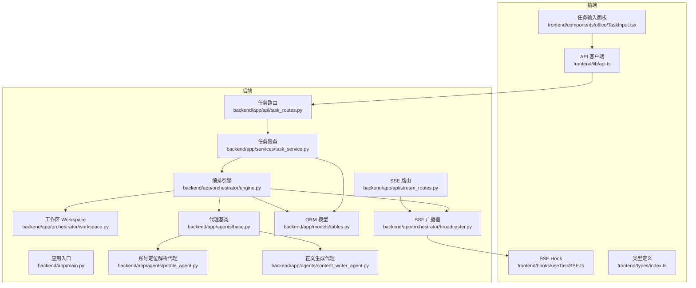
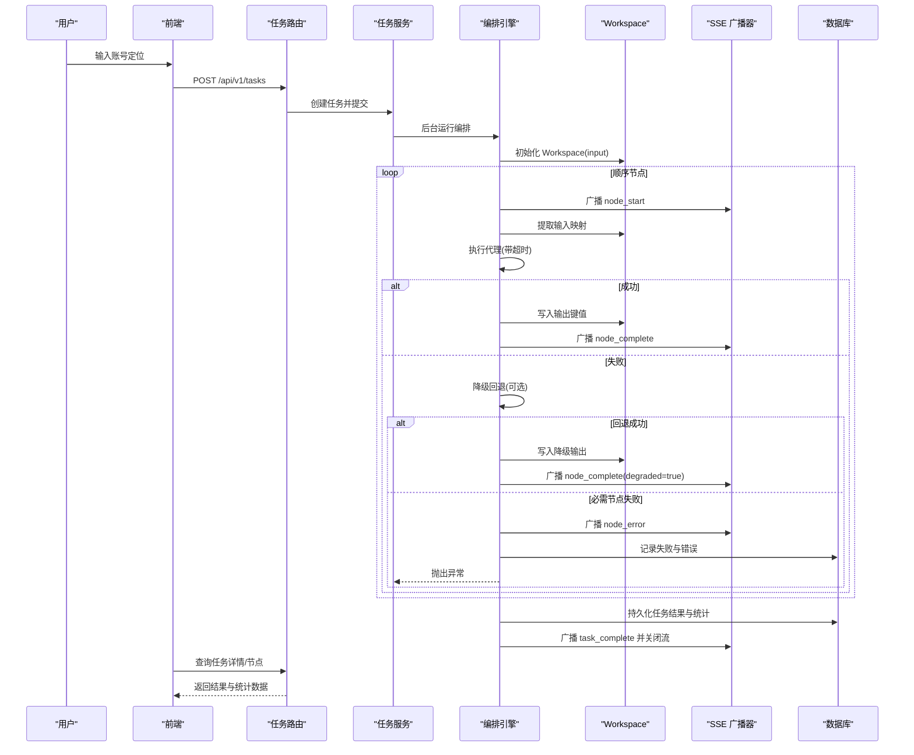
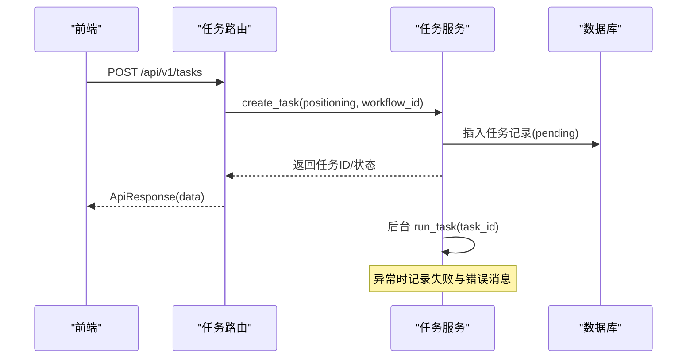
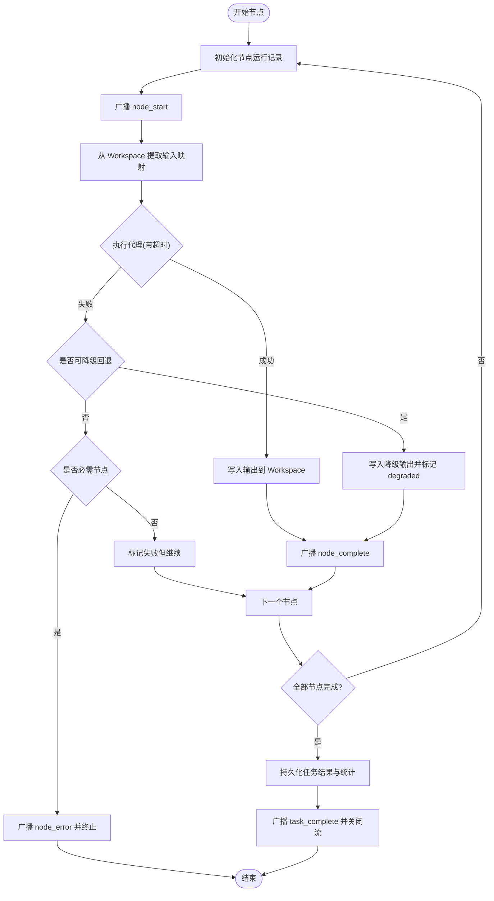
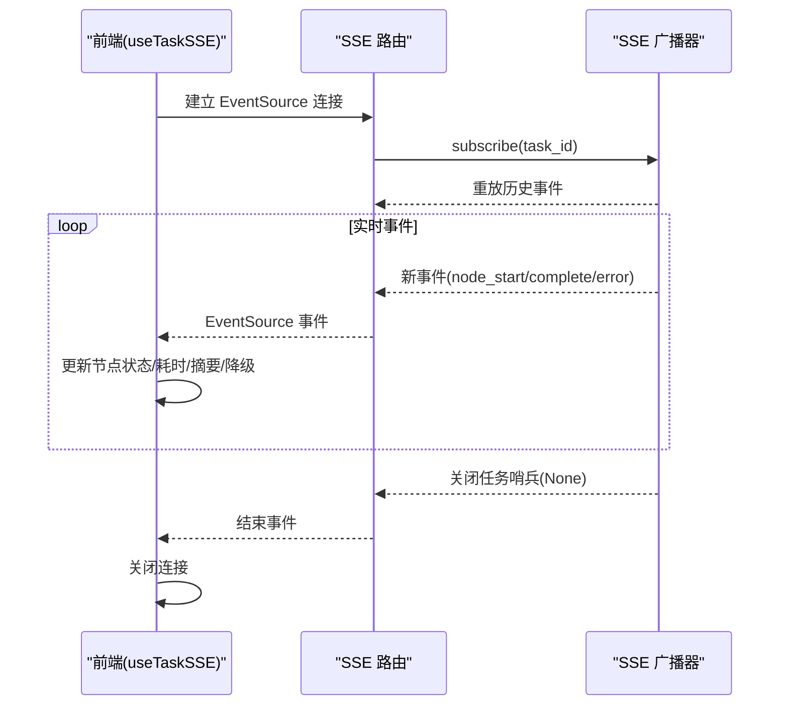
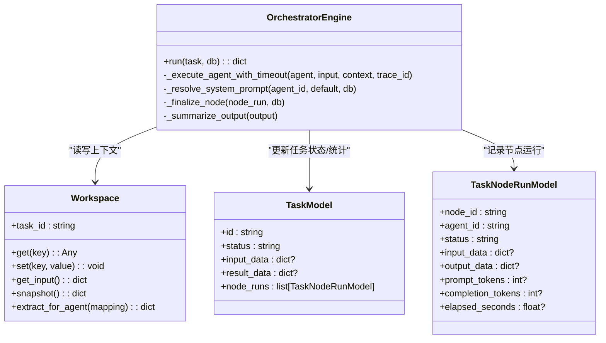
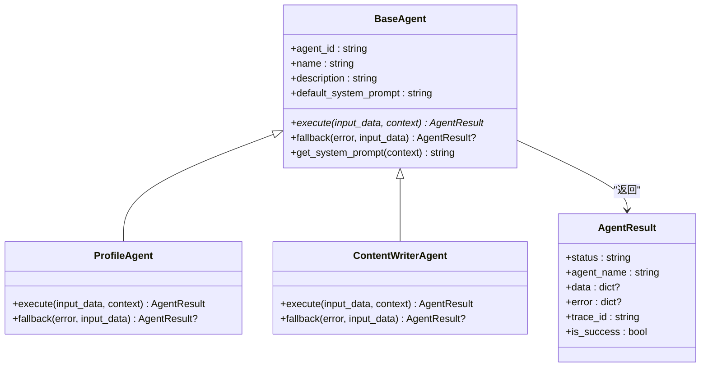
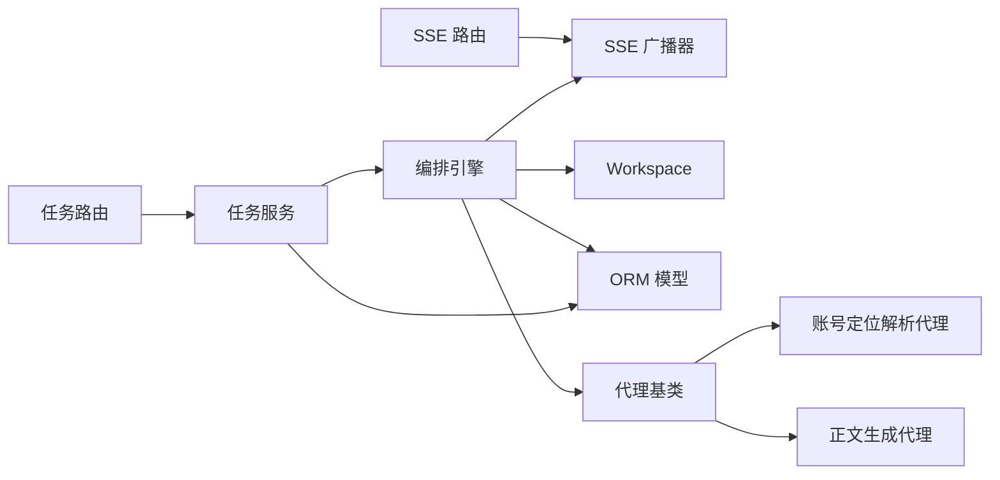

# 数据流设计

<cite>
**本文引用的文件**
- [backend/app/main.py](file://backend/app/main.py)
- [backend/app/api/task_routes.py](file://backend/app/api/task_routes.py)
- [backend/app/api/stream_routes.py](file://backend/app/api/stream_routes.py)
- [backend/app/services/task_service.py](file://backend/app/services/task_service.py)
- [backend/app/orchestrator/engine.py](file://backend/app/orchestrator/engine.py)
- [backend/app/orchestrator/workspace.py](file://backend/app/orchestrator/workspace.py)
- [backend/app/orchestrator/broadcaster.py](file://backend/app/orchestrator/broadcaster.py)
- [backend/app/schemas/task.py](file://backend/app/schemas/task.py)
- [backend/app/models/tables.py](file://backend/app/models/tables.py)
- [backend/app/agents/base.py](file://backend/app/agents/base.py)
- [backend/app/agents/profile_agent.py](file://backend/app/agents/profile_agent.py)
- [backend/app/agents/content_writer_agent.py](file://backend/app/agents/content_writer_agent.py)
- [frontend/lib/api.ts](file://frontend/lib/api.ts)
- [frontend/hooks/useTaskSSE.ts](file://frontend/hooks/useTaskSSE.ts)
- [frontend/types/index.ts](file://frontend/types/index.ts)
- [frontend/components/office/TaskInput.tsx](file://frontend/components/office/TaskInput.tsx)
</cite>

## 目录
1. [简介](#简介)
2. [项目结构](#项目结构)
3. [核心组件](#核心组件)
4. [架构总览](#架构总览)
5. [详细组件分析](#详细组件分析)
6. [依赖关系分析](#依赖关系分析)
7. [性能考量](#性能考量)
8. [故障排查指南](#故障排查指南)
9. [结论](#结论)
10. [附录](#附录)

## 简介
本设计文档围绕 HotClaw 系统的数据流展开，覆盖从用户输入到最终输出的完整路径：任务创建、工作流执行、状态广播、结果收集与持久化，并深入解释实时状态推送（Server-Sent Events，SSE）的实现机制与前端消费方式。同时，文档阐述 Workspace 上下文中数据的产生、传递、转换与持久化过程，给出数据格式定义、Schema 约束与数据验证机制，并通过多种图示直观展示数据流转与状态转换。

## 项目结构
HotClaw 采用前后端分离架构：
- 后端（FastAPI）负责业务逻辑、任务生命周期管理、工作流编排、SSE 广播与数据库持久化。
- 前端（Next.js）负责用户交互、实时事件订阅与可视化呈现。

图表来源
- [backend/app/main.py:1-142](file://backend/app/main.py#L1-L142)
- [backend/app/api/task_routes.py:1-163](file://backend/app/api/task_routes.py#L1-L163)
- [backend/app/api/stream_routes.py:1-43](file://backend/app/api/stream_routes.py#L1-L43)
- [backend/app/services/task_service.py:1-126](file://backend/app/services/task_service.py#L1-L126)
- [backend/app/orchestrator/engine.py:1-285](file://backend/app/orchestrator/engine.py#L1-L285)
- [backend/app/orchestrator/workspace.py:1-53](file://backend/app/orchestrator/workspace.py#L1-L53)
- [backend/app/orchestrator/broadcaster.py:1-94](file://backend/app/orchestrator/broadcaster.py#L1-L94)
- [backend/app/models/tables.py:1-233](file://backend/app/models/tables.py#L1-L233)
- [backend/app/agents/base.py:1-99](file://backend/app/agents/base.py#L1-L99)
- [backend/app/agents/profile_agent.py:1-73](file://backend/app/agents/profile_agent.py#L1-L73)
- [backend/app/agents/content_writer_agent.py:1-131](file://backend/app/agents/content_writer_agent.py#L1-L131)
- [frontend/lib/api.ts:1-110](file://frontend/lib/api.ts#L1-L110)
- [frontend/hooks/useTaskSSE.ts:1-124](file://frontend/hooks/useTaskSSE.ts#L1-L124)
- [frontend/types/index.ts:1-119](file://frontend/types/index.ts#L1-L119)
- [frontend/components/office/TaskInput.tsx:1-55](file://frontend/components/office/TaskInput.tsx#L1-L55)

章节来源
- [backend/app/main.py:1-142](file://backend/app/main.py#L1-L142)
- [backend/app/api/task_routes.py:1-163](file://backend/app/api/task_routes.py#L1-L163)
- [backend/app/api/stream_routes.py:1-43](file://backend/app/api/stream_routes.py#L1-L43)
- [backend/app/services/task_service.py:1-126](file://backend/app/services/task_service.py#L1-L126)
- [backend/app/orchestrator/engine.py:1-285](file://backend/app/orchestrator/engine.py#L1-L285)
- [backend/app/orchestrator/workspace.py:1-53](file://backend/app/orchestrator/workspace.py#L1-L53)
- [backend/app/orchestrator/broadcaster.py:1-94](file://backend/app/orchestrator/broadcaster.py#L1-L94)
- [backend/app/models/tables.py:1-233](file://backend/app/models/tables.py#L1-L233)
- [backend/app/agents/base.py:1-99](file://backend/app/agents/base.py#L1-L99)
- [backend/app/agents/profile_agent.py:1-73](file://backend/app/agents/profile_agent.py#L1-L73)
- [backend/app/agents/content_writer_agent.py:1-131](file://backend/app/agents/content_writer_agent.py#L1-L131)
- [frontend/lib/api.ts:1-110](file://frontend/lib/api.ts#L1-L110)
- [frontend/hooks/useTaskSSE.ts:1-124](file://frontend/hooks/useTaskSSE.ts#L1-L124)
- [frontend/types/index.ts:1-119](file://frontend/types/index.ts#L1-L119)
- [frontend/components/office/TaskInput.tsx:1-55](file://frontend/components/office/TaskInput.tsx#L1-L55)

## 核心组件
- 应用入口与中间件：注册路由、CORS、全局异常处理、追踪 ID 注入。
- 任务路由：创建任务、查询任务状态与详情、节点执行记录、任务列表。
- SSE 路由：基于 EventSource 的实时事件流。
- 任务服务：任务生命周期、后台运行编排引擎、错误处理与广播。
- 编排引擎：线性工作流顺序调度、节点执行、降级回退、统计与广播。
- Workspace：任务级上下文容器，支持数据提取与快照。
- SSE 广播器：按任务维护订阅队列、历史缓冲与关闭清理。
- ORM 模型：任务、节点运行、账号画像、话题候选、文章草稿、审计结果、代理与技能配置、工作流模板、系统日志。
- 代理基类与具体代理：统一结果结构、系统提示解析、执行与降级策略。
- 前端 API 客户端、SSE Hook、类型定义与输入面板：用户交互、实时事件消费与状态渲染。

章节来源
- [backend/app/main.py:1-142](file://backend/app/main.py#L1-L142)
- [backend/app/api/task_routes.py:1-163](file://backend/app/api/task_routes.py#L1-L163)
- [backend/app/api/stream_routes.py:1-43](file://backend/app/api/stream_routes.py#L1-L43)
- [backend/app/services/task_service.py:1-126](file://backend/app/services/task_service.py#L1-L126)
- [backend/app/orchestrator/engine.py:1-285](file://backend/app/orchestrator/engine.py#L1-L285)
- [backend/app/orchestrator/workspace.py:1-53](file://backend/app/orchestrator/workspace.py#L1-L53)
- [backend/app/orchestrator/broadcaster.py:1-94](file://backend/app/orchestrator/broadcaster.py#L1-L94)
- [backend/app/models/tables.py:1-233](file://backend/app/models/tables.py#L1-L233)
- [backend/app/agents/base.py:1-99](file://backend/app/agents/base.py#L1-L99)
- [frontend/lib/api.ts:1-110](file://frontend/lib/api.ts#L1-L110)
- [frontend/hooks/useTaskSSE.ts:1-124](file://frontend/hooks/useTaskSSE.ts#L1-L124)
- [frontend/types/index.ts:1-119](file://frontend/types/index.ts#L1-L119)

## 架构总览
HotClaw 的数据流遵循“请求-后台执行-事件推送-结果查询”的模式。用户通过前端输入定位描述，后端创建任务并立即返回；随后在后台异步执行编排引擎，逐节点调用代理，期间通过 SSE 广播节点状态；最终将结果与统计信息持久化至数据库。

图表来源
- [backend/app/api/task_routes.py:19-51](file://backend/app/api/task_routes.py#L19-L51)
- [backend/app/services/task_service.py:39-63](file://backend/app/services/task_service.py#L39-L63)
- [backend/app/orchestrator/engine.py:92-234](file://backend/app/orchestrator/engine.py#L92-L234)
- [backend/app/orchestrator/broadcaster.py:57-80](file://backend/app/orchestrator/broadcaster.py#L57-L80)
- [backend/app/models/tables.py:23-74](file://backend/app/models/tables.py#L23-L74)

## 详细组件分析

### 任务创建与状态查询
- 前端通过 API 客户端提交定位描述，后端创建任务并立即返回任务标识与初始状态。
- 后台以异步任务方式启动编排引擎，避免阻塞 HTTP 响应。
- 前端可通过轮询或 SSE 实时获知进度；也可直接查询任务详情与节点记录。

图表来源
- [frontend/lib/api.ts:26-31](file://frontend/lib/api.ts#L26-L31)
- [backend/app/api/task_routes.py:19-51](file://backend/app/api/task_routes.py#L19-L51)
- [backend/app/services/task_service.py:20-38](file://backend/app/services/task_service.py#L20-L38)

章节来源
- [frontend/lib/api.ts:26-31](file://frontend/lib/api.ts#L26-L31)
- [backend/app/api/task_routes.py:19-51](file://backend/app/api/task_routes.py#L19-L51)
- [backend/app/services/task_service.py:20-38](file://backend/app/services/task_service.py#L20-L38)

### 工作流执行与状态广播
- 编排引擎按固定节点顺序执行，每个节点：
  - 记录节点运行记录（开始时间、状态）。
  - 广播 node_start 事件，前端更新节点为 running。
  - 从 Workspace 中按映射提取输入，执行代理（带超时）。
  - 成功则写入输出键值，广播 node_complete；失败则尝试降级回退；必需节点失败则终止并广播 node_error。
- 任务完成后，持久化结果与统计，广播 task_complete 并关闭流。

图表来源
- [backend/app/orchestrator/engine.py:92-234](file://backend/app/orchestrator/engine.py#L92-L234)
- [backend/app/orchestrator/broadcaster.py:57-80](file://backend/app/orchestrator/broadcaster.py#L57-L80)
- [backend/app/models/tables.py:48-74](file://backend/app/models/tables.py#L48-L74)

章节来源
- [backend/app/orchestrator/engine.py:92-234](file://backend/app/orchestrator/engine.py#L92-L234)
- [backend/app/orchestrator/broadcaster.py:57-80](file://backend/app/orchestrator/broadcaster.py#L57-L80)
- [backend/app/models/tables.py:48-74](file://backend/app/models/tables.py#L48-L74)

### 实时状态推送（SSE）机制与前端消费
- 后端 SSE 路由基于事件源，订阅者连接后立即收到历史事件重放，确保“先启动后连接”场景不丢失事件。
- 广播器为每个任务维护订阅队列与历史缓冲，任务结束后发送哨兵信号并清理历史。
- 前端 Hook 订阅事件流，分别处理 node_start/node_complete/node_error/task_complete/task_error，更新节点状态、耗时、摘要与降级标记，并在任务完成后关闭连接。

图表来源
- [backend/app/api/stream_routes.py:14-42](file://backend/app/api/stream_routes.py#L14-L42)
- [backend/app/orchestrator/broadcaster.py:30-80](file://backend/app/orchestrator/broadcaster.py#L30-L80)
- [frontend/hooks/useTaskSSE.ts:58-120](file://frontend/hooks/useTaskSSE.ts#L58-L120)

章节来源
- [backend/app/api/stream_routes.py:14-42](file://backend/app/api/stream_routes.py#L14-L42)
- [backend/app/orchestrator/broadcaster.py:30-80](file://backend/app/orchestrator/broadcaster.py#L30-L80)
- [frontend/hooks/useTaskSSE.ts:58-120](file://frontend/hooks/useTaskSSE.ts#L58-L120)

### Workspace 上下文数据的产生、传递、转换与持久化
- 产生：任务创建时注入 input_data 到 Workspace。
- 传递：每个节点通过输入映射从 Workspace 读取所需字段；映射支持直接引用 input.* 或顶层键。
- 转换：代理执行后将结构化输出写回 Workspace 对应输出键。
- 持久化：任务完成后，Workspace 快照作为 result_data 写入任务记录；节点运行记录也持久化输入/输出、耗时、Token 统计等。

图表来源
- [backend/app/orchestrator/workspace.py:12-53](file://backend/app/orchestrator/workspace.py#L12-L53)
- [backend/app/orchestrator/engine.py:92-285](file://backend/app/orchestrator/engine.py#L92-L285)
- [backend/app/models/tables.py:23-74](file://backend/app/models/tables.py#L23-L74)

章节来源
- [backend/app/orchestrator/workspace.py:12-53](file://backend/app/orchestrator/workspace.py#L12-L53)
- [backend/app/orchestrator/engine.py:92-285](file://backend/app/orchestrator/engine.py#L92-L285)
- [backend/app/models/tables.py:23-74](file://backend/app/models/tables.py#L23-L74)

### 数据格式定义、Schema 约束与验证机制
- 请求体（Pydantic）：
  - 创建任务：positioning（必填，长度限制）、workflow_id（默认模板）。
- 响应体（Pydantic）：
  - 任务状态：包含当前节点、进度、起止时间与耗时。
  - 节点运行：包含输入/输出、耗时、Token 统计、模型与降级标记。
  - 任务详情：包含输入、结果、耗时与总 Token。
- 前端类型：
  - 任务/节点状态枚举与 SSE 事件接口定义，保证前后端事件契约一致。
- 数据库 Schema：
  - 任务表：状态、输入/结果 JSON、时间戳、Token 统计。
  - 节点运行表：节点/代理标识、输入/输出 JSON、错误信息、耗时与 Token 统计。
  - 其他扩展表：账号画像、话题候选、文章草稿、审计结果、代理/技能/工作流模板、系统日志。

章节来源
- [backend/app/schemas/task.py:10-83](file://backend/app/schemas/task.py#L10-L83)
- [frontend/types/index.ts:5-119](file://frontend/types/index.ts#L5-L119)
- [backend/app/models/tables.py:23-233](file://backend/app/models/tables.py#L23-L233)

### 代理执行与降级回退
- 代理基类提供统一结果封装与系统提示解析；具体代理实现 execute 与可选 fallback。
- 编排引擎在节点失败时尝试回退，若为必需节点且回退失败则终止流程并广播错误。

图表来源
- [backend/app/agents/base.py:18-99](file://backend/app/agents/base.py#L18-L99)
- [backend/app/agents/profile_agent.py:10-73](file://backend/app/agents/profile_agent.py#L10-L73)
- [backend/app/agents/content_writer_agent.py:7-131](file://backend/app/agents/content_writer_agent.py#L7-L131)

章节来源
- [backend/app/agents/base.py:18-99](file://backend/app/agents/base.py#L18-L99)
- [backend/app/agents/profile_agent.py:10-73](file://backend/app/agents/profile_agent.py#L10-L73)
- [backend/app/agents/content_writer_agent.py:7-131](file://backend/app/agents/content_writer_agent.py#L7-L131)

## 依赖关系分析
- 组件耦合：
  - 任务路由仅负责请求/响应，业务逻辑委托给任务服务。
  - 任务服务协调编排引擎与数据库，保持较低耦合。
  - 编排引擎依赖代理注册表、广播器与数据库，职责单一。
  - Workspace 与代理解耦，仅通过输入映射与输出键交互。
- 外部依赖：
  - FastAPI、SQLAlchemy、sse-starlette、Pydantic。
- 循环依赖：
  - 未发现循环导入；模块间单向依赖清晰。

图表来源
- [backend/app/api/task_routes.py:15-16](file://backend/app/api/task_routes.py#L15-L16)
- [backend/app/api/stream_routes.py:9-11](file://backend/app/api/stream_routes.py#L9-L11)
- [backend/app/services/task_service.py:14-15](file://backend/app/services/task_service.py#L14-L15)
- [backend/app/orchestrator/engine.py:18-26](file://backend/app/orchestrator/engine.py#L18-L26)
- [backend/app/orchestrator/workspace.py:12-13](file://backend/app/orchestrator/workspace.py#L12-L13)
- [backend/app/orchestrator/broadcaster.py:11-12](file://backend/app/orchestrator/broadcaster.py#L11-L12)
- [backend/app/models/tables.py:23-74](file://backend/app/models/tables.py#L23-L74)
- [backend/app/agents/base.py:49-75](file://backend/app/agents/base.py#L49-L75)
- [backend/app/agents/profile_agent.py:10-13](file://backend/app/agents/profile_agent.py#L10-L13)
- [backend/app/agents/content_writer_agent.py:7-10](file://backend/app/agents/content_writer_agent.py#L7-L10)

章节来源
- [backend/app/api/task_routes.py:15-16](file://backend/app/api/task_routes.py#L15-L16)
- [backend/app/api/stream_routes.py:9-11](file://backend/app/api/stream_routes.py#L9-L11)
- [backend/app/services/task_service.py:14-15](file://backend/app/services/task_service.py#L14-L15)
- [backend/app/orchestrator/engine.py:18-26](file://backend/app/orchestrator/engine.py#L18-L26)
- [backend/app/orchestrator/workspace.py:12-13](file://backend/app/orchestrator/workspace.py#L12-L13)
- [backend/app/orchestrator/broadcaster.py:11-12](file://backend/app/orchestrator/broadcaster.py#L11-L12)
- [backend/app/models/tables.py:23-74](file://backend/app/models/tables.py#L23-L74)
- [backend/app/agents/base.py:49-75](file://backend/app/agents/base.py#L49-L75)
- [backend/app/agents/profile_agent.py:10-13](file://backend/app/agents/profile_agent.py#L10-L13)
- [backend/app/agents/content_writer_agent.py:7-10](file://backend/app/agents/content_writer_agent.py#L7-L10)

## 性能考量
- 异步与并发：后台任务与编排引擎均采用异步模式，避免阻塞主线程。
- 超时控制：节点执行设置超时，防止长时间卡顿影响整体吞吐。
- 事件缓冲：SSE 广播器缓存历史事件，减少晚到订阅者的等待成本。
- 数据库批量写入：节点运行与任务更新使用 flush/commit 优化，降低锁竞争。
- 日志与追踪：统一追踪 ID 便于跨服务定位问题，减少排查成本。

## 故障排查指南
- 任务创建后立即失败：
  - 检查任务服务异常处理与广播，确认 task_error 是否被推送。
- 节点执行超时：
  - 编排引擎捕获超时并广播 node_error；检查代理执行耗时与外部依赖。
- 任务中途失败：
  - 必需节点失败会终止流程；查看节点运行记录的错误信息与耗时。
- SSE 无法接收事件：
  - 确认订阅队列是否存在、历史是否正确重放、任务是否已关闭。
- 前端状态不同步：
  - 检查事件监听与状态更新逻辑，确认事件名与数据结构一致。

章节来源
- [backend/app/services/task_service.py:49-63](file://backend/app/services/task_service.py#L49-L63)
- [backend/app/orchestrator/engine.py:176-196](file://backend/app/orchestrator/engine.py#L176-L196)
- [backend/app/orchestrator/broadcaster.py:30-80](file://backend/app/orchestrator/broadcaster.py#L30-L80)
- [frontend/hooks/useTaskSSE.ts:65-111](file://frontend/hooks/useTaskSSE.ts#L65-L111)

## 结论
HotClaw 的数据流设计以任务为中心，通过 Workspace 实现多代理间的上下文共享，借助编排引擎与 SSE 广播实现端到端的可观测性与实时反馈。数据库层提供结构化存储与可扩展 Schema，支撑未来功能演进。整体架构清晰、职责分离、易于维护与扩展。

## 附录
- 前端输入面板校验用户输入长度，避免无效任务创建。
- 前端 API 客户端统一封装请求与错误处理，保证一致性。

章节来源
- [frontend/components/office/TaskInput.tsx:16-21](file://frontend/components/office/TaskInput.tsx#L16-L21)
- [frontend/lib/api.ts:14-24](file://frontend/lib/api.ts#L14-L24)