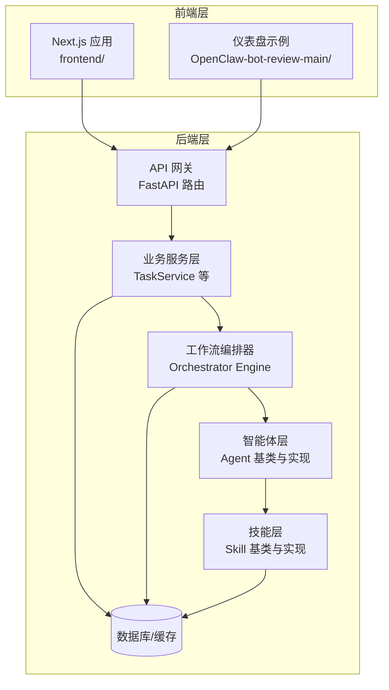
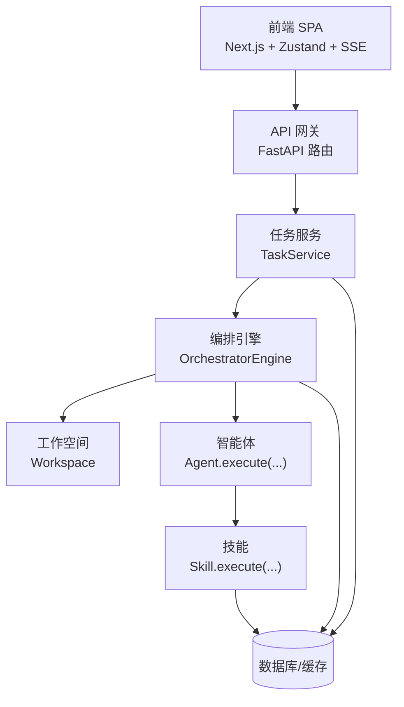
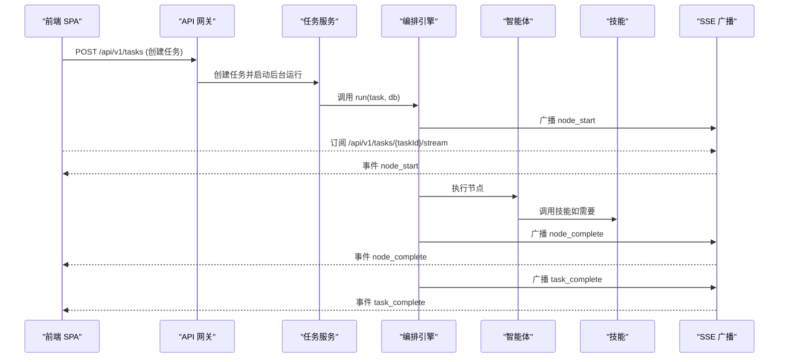
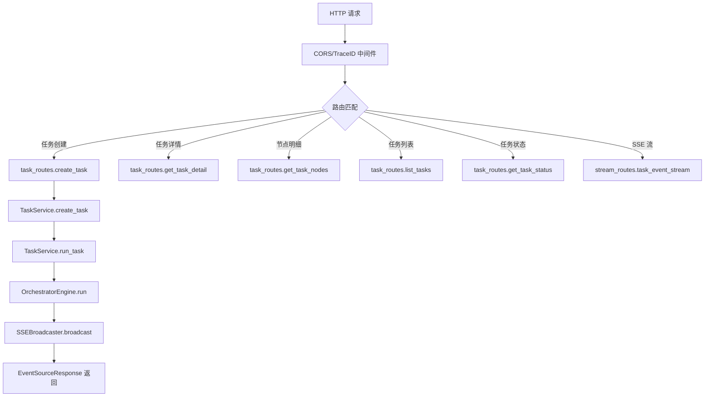
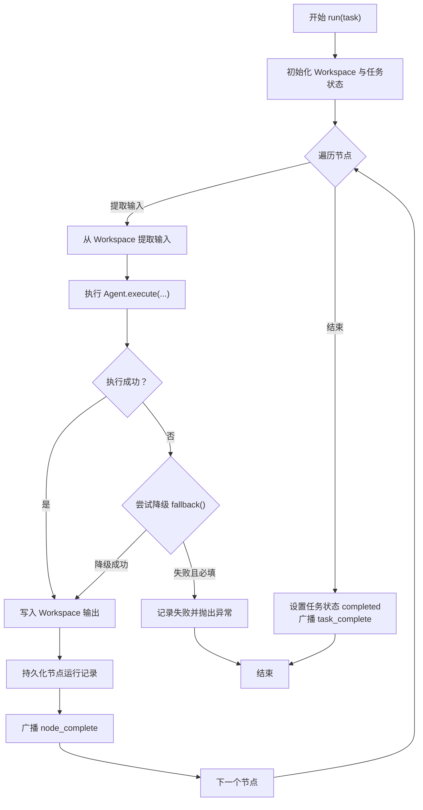
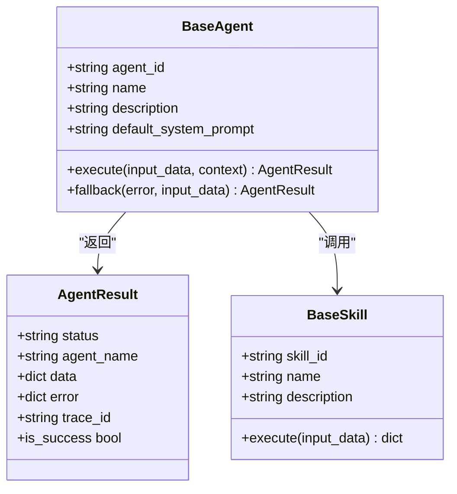
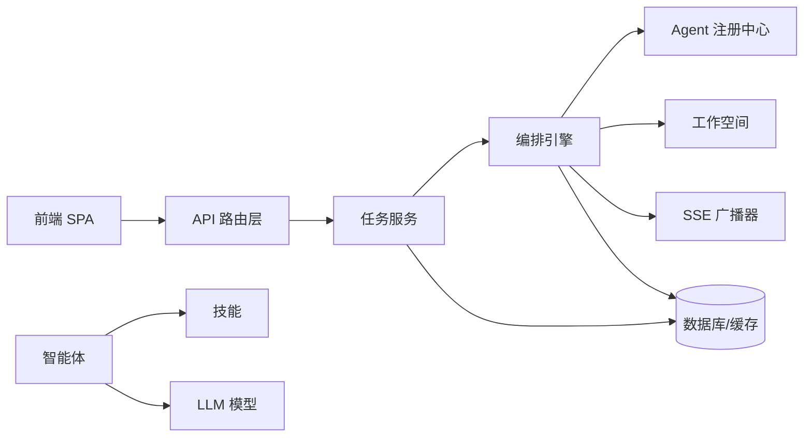

# 整体架构概览

<cite>
**本文引用的文件**
- [ARCHITECTURE.md](file://ARCHITECTURE.md)
- [backend/app/main.py](file://backend/app/main.py)
- [backend/pyproject.toml](file://backend/pyproject.toml)
- [backend/app/orchestrator/engine.py](file://backend/app/orchestrator/engine.py)
- [backend/app/orchestrator/broadcaster.py](file://backend/app/orchestrator/broadcaster.py)
- [backend/app/services/task_service.py](file://backend/app/services/task_service.py)
- [backend/app/api/task_routes.py](file://backend/app/api/task_routes.py)
- [backend/app/api/stream_routes.py](file://backend/app/api/stream_routes.py)
- [backend/app/agents/base.py](file://backend/app/agents/base.py)
- [backend/app/skills/base.py](file://backend/app/skills/base.py)
- [frontend/lib/api.ts](file://frontend/lib/api.ts)
- [frontend/hooks/useTaskSSE.ts](file://frontend/hooks/useTaskSSE.ts)
- [frontend/package.json](file://frontend/package.json)
- [frontend/app/layout.tsx](file://frontend/app/layout.tsx)
- [OpenClaw-bot-review-main/app/layout.tsx](file://OpenClaw-bot-review-main/app/layout.tsx)
</cite>

## 目录
1. [引言](#引言)
2. [项目结构](#项目结构)
3. [核心组件](#核心组件)
4. [架构总览](#架构总览)
5. [详细组件分析](#详细组件分析)
6. [依赖分析](#依赖分析)
7. [性能考量](#性能考量)
8. [故障排查指南](#故障排查指南)
9. [结论](#结论)
10. [附录](#附录)

## 引言
HotClaw 是一个“基于多智能体协作的公众号内容生产平台”。用户仅需输入“账号定位”，系统即可自动完成从热点抓取、选题策划、标题生成、正文撰写到审核风控的全链路内容生产，并输出可编辑的文章草稿。系统采用前后端分离架构，通过 API 网关统一入口、工作流编排层协调执行、智能体与技能层解耦协作，结合基础设施层支撑数据与模型服务，形成清晰的分层与职责边界。

## 项目结构
仓库包含前后端与基础设施相关目录：
- backend：后端服务，基于 FastAPI，包含网关、编排器、智能体、技能、服务层、模型与配置等模块
- frontend：前端应用，基于 Next.js，提供任务创建、运行监控、结果预览、配置管理与历史任务等功能
- OpenClaw-bot-review-main：另一个前端仪表盘示例，展示不同前端形态
- manifests：声明式注册的 Agent/Skill/Workflow 清单
- 其他脚本与资源目录：数据库迁移、资产包、文档等

图表来源
- [backend/app/main.py:60-142](file://backend/app/main.py#L60-L142)
- [backend/app/api/task_routes.py:19-51](file://backend/app/api/task_routes.py#L19-L51)
- [backend/app/services/task_service.py:39-64](file://backend/app/services/task_service.py#L39-L64)
- [backend/app/orchestrator/engine.py:92-234](file://backend/app/orchestrator/engine.py#L92-L234)
- [backend/app/agents/base.py:49-99](file://backend/app/agents/base.py#L49-L99)
- [backend/app/skills/base.py:16-37](file://backend/app/skills/base.py#L16-L37)

章节来源
- [ARCHITECTURE.md:37-78](file://ARCHITECTURE.md#L37-L78)
- [backend/app/main.py:14-58](file://backend/app/main.py#L14-L58)
- [frontend/package.json:1-23](file://frontend/package.json#L1-L23)

## 核心组件
- 前端 SPA 层（Next.js）
  - 负责页面路由、组件化渲染、状态管理（Zustand）、实时事件订阅（SSE）
  - 通过统一 API 前缀与后端交互
- API 网关层（FastAPI）
  - 路由定义、参数校验、统一错误响应、CORS、Trace ID 中间件
  - 提供任务创建、状态查询、节点明细、SSE 事件流等端点
- 工作流编排层（Orchestrator Engine）
  - 读取默认线性工作流，按序调度 Agent，管理 Workspace 上下文，广播节点事件，处理降级与异常
- 智能体执行层（Agent）
  - 有角色、有上下文、有决策能力的执行单元，内部调用 LLM 与/或 Skills
- 技能层（Skill）
  - 无状态的原子能力，封装具体技术操作（API 调用、数据处理、规则匹配等）
- 基础设施层（SQLite/Redis/LLM/日志/配置）
  - 数据持久化、缓存、模型服务、结构化日志与配置管理

章节来源
- [ARCHITECTURE.md:191-398](file://ARCHITECTURE.md#L191-L398)
- [backend/app/api/task_routes.py:19-163](file://backend/app/api/task_routes.py#L19-L163)
- [backend/app/api/stream_routes.py:14-43](file://backend/app/api/stream_routes.py#L14-L43)
- [backend/app/orchestrator/engine.py:89-285](file://backend/app/orchestrator/engine.py#L89-L285)
- [backend/app/agents/base.py:49-99](file://backend/app/agents/base.py#L49-L99)
- [backend/app/skills/base.py:16-37](file://backend/app/skills/base.py#L16-L37)

## 架构总览
系统采用“控制平面与执行平面分离”的设计理念：
- 控制平面（Orchestrator）：负责工作流编排、任务调度、状态广播与异常处理
- 执行平面（Agent）：负责具体业务任务执行，通过 Skills 完成原子能力调用
- 前后端分离：前端独立消费 SSE 事件，后端通过统一网关暴露 REST 与 SSE

图表来源
- [backend/app/main.py:14-58](file://backend/app/main.py#L14-L58)
- [backend/app/services/task_service.py:39-64](file://backend/app/services/task_service.py#L39-L64)
- [backend/app/orchestrator/engine.py:92-234](file://backend/app/orchestrator/engine.py#L92-L234)
- [backend/app/api/stream_routes.py:14-43](file://backend/app/api/stream_routes.py#L14-L43)

章节来源
- [ARCHITECTURE.md:92-135](file://ARCHITECTURE.md#L92-L135)

## 详细组件分析

### 前端 SPA 层
- 技术栈与路由
  - React 18 + TypeScript + Next.js + Ant Design 5 + Zustand + Axios + SSE
  - 页面覆盖任务创建、运行监控、结果预览、配置管理、历史任务等
- 实时状态更新
  - 通过 SSE 订阅后端 /api/v1/tasks/{taskId}/stream，接收 node_start/node_complete/node_error/task_complete 等事件
- 状态管理
  - 使用 Zustand Store 管理当前任务状态、节点状态、工作空间快照、配置数据与历史任务列表

图表来源
- [frontend/lib/api.ts:26-50](file://frontend/lib/api.ts#L26-L50)
- [frontend/hooks/useTaskSSE.ts:58-120](file://frontend/hooks/useTaskSSE.ts#L58-L120)
- [backend/app/api/task_routes.py:19-51](file://backend/app/api/task_routes.py#L19-L51)
- [backend/app/api/stream_routes.py:14-43](file://backend/app/api/stream_routes.py#L14-L43)
- [backend/app/services/task_service.py:39-64](file://backend/app/services/task_service.py#L39-L64)
- [backend/app/orchestrator/engine.py:124-234](file://backend/app/orchestrator/engine.py#L124-L234)

章节来源
- [ARCHITECTURE.md:191-398](file://ARCHITECTURE.md#L191-L398)
- [frontend/lib/api.ts:1-110](file://frontend/lib/api.ts#L1-L110)
- [frontend/hooks/useTaskSSE.ts:1-124](file://frontend/hooks/useTaskSSE.ts#L1-L124)

### API 网关层（FastAPI）
- 路由与中间件
  - 包含 CORS、Trace ID 中间件、全局异常处理器
  - 路由前缀统一为 /api/v1，分别挂载任务、流、智能体、技能相关路由
- 任务相关端点
  - POST /api/v1/tasks：创建任务并异步运行
  - GET /api/v1/tasks/{task_id}：查询任务详情
  - GET /api/v1/tasks/{task_id}/nodes：查询节点执行记录
  - GET /api/v1/tasks：分页列出任务
  - GET /api/v1/tasks/{task_id}/status：查询任务状态
  - GET /api/v1/tasks/{task_id}/stream：SSE 事件流

图表来源
- [backend/app/main.py:60-142](file://backend/app/main.py#L60-L142)
- [backend/app/api/task_routes.py:19-163](file://backend/app/api/task_routes.py#L19-L163)
- [backend/app/api/stream_routes.py:14-43](file://backend/app/api/stream_routes.py#L14-L43)
- [backend/app/services/task_service.py:20-64](file://backend/app/services/task_service.py#L20-L64)
- [backend/app/orchestrator/broadcaster.py:57-80](file://backend/app/orchestrator/broadcaster.py#L57-L80)

章节来源
- [backend/app/main.py:14-142](file://backend/app/main.py#L14-L142)
- [backend/app/api/task_routes.py:19-163](file://backend/app/api/task_routes.py#L19-L163)
- [backend/app/api/stream_routes.py:14-43](file://backend/app/api/stream_routes.py#L14-L43)

### 工作流编排层（Orchestrator Engine）
- 职责
  - 读取默认线性工作流节点，按序调度 Agent
  - 从 Workspace 提取输入，执行 Agent，校验输出，写入 Workspace
  - 广播节点事件（node_start/node_complete/node_error），处理降级与异常
  - 记录节点运行日志、累计 Token 消耗，最终广播 task_complete
- 关键流程
  - 初始化 Workspace 与任务状态
  - 循环执行每个节点：提取输入、执行 Agent、写入输出、持久化节点记录
  - 广播事件、异常处理（超时/失败/必填节点中断）

图表来源
- [backend/app/orchestrator/engine.py:92-234](file://backend/app/orchestrator/engine.py#L92-L234)
- [backend/app/orchestrator/engine.py:236-285](file://backend/app/orchestrator/engine.py#L236-L285)

章节来源
- [backend/app/orchestrator/engine.py:89-285](file://backend/app/orchestrator/engine.py#L89-L285)

### 智能体与技能层
- 智能体（Agent）
  - 统一基类定义输入/输出 Schema、系统 Prompt、执行方法与降级策略
  - 通过 Workspace 获取上下文，必要时调用 Skills
- 技能（Skill）
  - 统一基类定义输入/输出 Schema 与配置 Schema
  - 无状态、可复用的原子能力，被 Agent 调用

图表来源
- [backend/app/agents/base.py:49-99](file://backend/app/agents/base.py#L49-L99)
- [backend/app/skills/base.py:16-37](file://backend/app/skills/base.py#L16-L37)

章节来源
- [backend/app/agents/base.py:18-99](file://backend/app/agents/base.py#L18-L99)
- [backend/app/skills/base.py:16-37](file://backend/app/skills/base.py#L16-L37)

### 基础设施层
- 数据与缓存
  - 数据库：SQLAlchemy 2.0 + alembic（异步会话）
  - 缓存：Redis（用于配置与短期状态）
- 模型与日志
  - LLM 调用：litellm 或 openai SDK
  - 日志：structlog
- 配置与依赖
  - Python 依赖集中在 pyproject.toml，前端依赖在 package.json

章节来源
- [backend/pyproject.toml:1-41](file://backend/pyproject.toml#L1-L41)
- [frontend/package.json:1-23](file://frontend/package.json#L1-L23)

## 依赖分析
- 前端对后端的依赖
  - 通过 /api/v1 前缀的 REST 与 SSE 接口交互
  - 使用 Zustand 管理状态，EventSource 订阅任务事件
- 后端模块内聚与耦合
  - API 路由层仅负责请求/响应，业务逻辑下沉至服务层
  - 服务层依赖编排引擎与广播器，编排引擎依赖智能体注册中心与工作空间
  - 智能体与技能通过统一基类解耦，便于声明式注册与替换

图表来源
- [backend/app/main.py:14-58](file://backend/app/main.py#L14-L58)
- [backend/app/services/task_service.py:39-64](file://backend/app/services/task_service.py#L39-L64)
- [backend/app/orchestrator/engine.py:92-234](file://backend/app/orchestrator/engine.py#L92-L234)
- [backend/app/orchestrator/broadcaster.py:30-80](file://backend/app/orchestrator/broadcaster.py#L30-L80)

章节来源
- [backend/app/main.py:14-58](file://backend/app/main.py#L14-L58)
- [backend/app/services/task_service.py:20-64](file://backend/app/services/task_service.py#L20-L64)

## 性能考量
- 异步与并发
  - 后端使用 FastAPI + SQLAlchemy 异步会话，编排引擎使用 asyncio 控制节点执行
- 实时性
  - SSE 事件流保证前端低延迟接收节点状态变化
- 降级与容错
  - 节点失败时优先尝试降级策略，非必填节点失败不影响整体链路
- 资源与成本
  - LLM 调用按节点统计 Token，便于成本与性能优化

## 故障排查指南
- 常见问题定位
  - 任务长时间无响应：检查 SSE 是否建立、Orchestrator 是否正常广播事件
  - 节点失败：查看节点运行记录中的错误信息与降级标志
  - API 异常：根据全局异常处理器映射的 HTTP 状态码定位问题类别
- 前端事件订阅
  - 确认 EventSource 连接是否断开，SSE 广播器是否正确清理队列
- 后端日志与追踪
  - 通过 Trace ID 中间件与结构化日志定位请求链路

章节来源
- [backend/app/main.py:77-130](file://backend/app/main.py#L77-L130)
- [backend/app/orchestrator/broadcaster.py:47-80](file://backend/app/orchestrator/broadcaster.py#L47-L80)
- [backend/app/services/task_service.py:49-64](file://backend/app/services/task_service.py#L49-L64)

## 结论
HotClaw 采用前后端分离与“控制平面/执行平面分离”的架构设计，通过声明式注册与结构化输入输出，实现了可演进、可维护、可观测的内容生产流水线。前端专注于用户体验与可视化，后端专注于编排与执行，二者通过统一网关与 SSE 协议协同，满足 MVP 的快速交付与后续扩展需求。

## 附录
- 系统边界与范围
  - MVP 范围涵盖从账号定位到文章草稿的全链路，不涉及公众号 API 对接、多账号管理、用户体系等延后功能
- 设计原则与核心概念
  - 12 条设计原则与 Agent/Skill/Workflow/Workspace/Gateway/Orchestrator 等核心概念定义详见架构文档

章节来源
- [ARCHITECTURE.md:13-135](file://ARCHITECTURE.md#L13-L135)