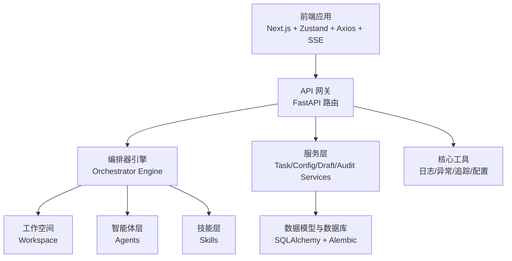
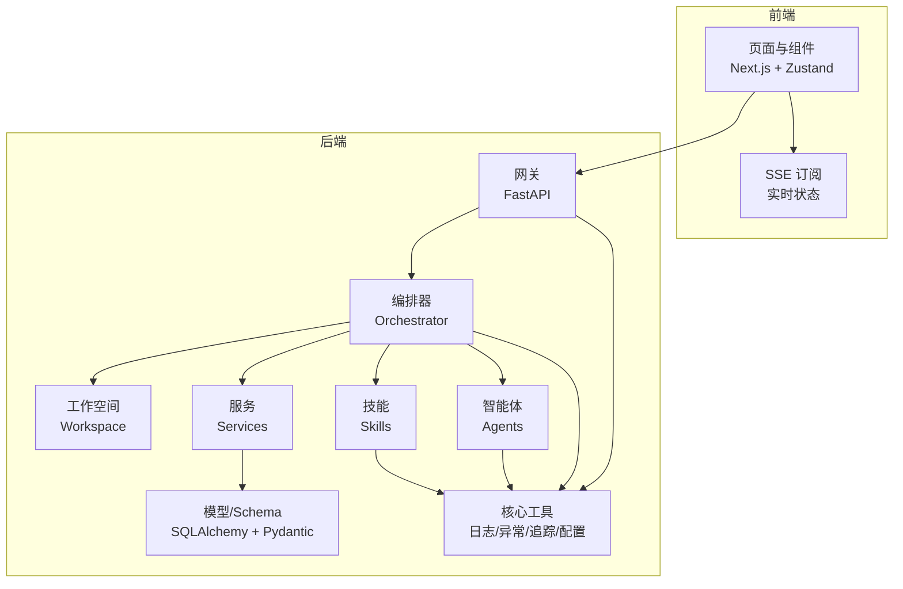
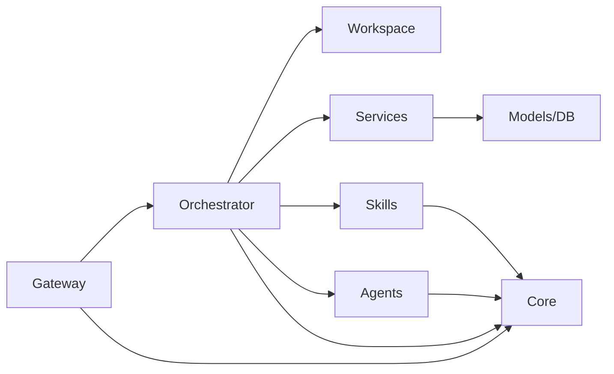

# 核心设计理念

<cite>
**本文引用的文件**
- [ARCHITECTURE.md](file://ARCHITECTURE.md)
- [Notice.md](file://Notice.md)
- [ai_readme.md](file://ai_readme.md)
- [backend/app/main.py](file://backend/app/main.py)
- [backend/app/orchestrator/engine.py](file://backend/app/orchestrator/engine.py)
- [backend/app/orchestrator/workspace.py](file://backend/app/orchestrator/workspace.py)
- [backend/app/agents/base.py](file://backend/app/agents/base.py)
- [backend/app/agents/profile_agent.py](file://backend/app/agents/profile_agent.py)
- [backend/app/skills/base.py](file://backend/app/skills/base.py)
- [backend/app/skills/registry.py](file://backend/app/skills/registry.py)
- [backend/app/api/task_routes.py](file://backend/app/api/task_routes.py)
- [frontend/lib/api.ts](file://frontend/lib/api.ts)
- [frontend/app/layout.tsx](file://frontend/app/layout.tsx)
- [backend/app/core/config.py](file://backend/app/core/config.py)
</cite>

## 目录
1. [引言](#引言)
2. [项目结构](#项目结构)
3. [核心组件](#核心组件)
4. [架构总览](#架构总览)
5. [详细组件分析](#详细组件分析)
6. [依赖分析](#依赖分析)
7. [性能考量](#性能考量)
8. [故障排查指南](#故障排查指南)
9. [结论](#结论)
10. [附录](#附录)

## 引言
本文件系统化阐述 HotClaw 的核心设计理念与实践方法，围绕 12 条设计原则展开，结合架构文档与代码实现，解释这些原则如何指导系统架构与开发实践，并对比 OpenClaw 的理念在 HotClaw 中的吸收与改造。同时提供可追溯的代码与配置示例路径，帮助读者在实际开发中落地这些原则。

## 项目结构
HotClaw 采用前后端分离架构，后端以 FastAPI 为核心，提供统一网关与编排引擎；前端以 Next.js 为基础，通过 SSE 实时接收任务状态；核心模块包括：网关层、编排器、Agent 执行层、Skill 技能层、服务层、模型与 Schema、核心工具（日志/异常/追踪）、配置与数据库会话。

图表来源
- [ARCHITECTURE.md: 414-447:414-447](file://ARCHITECTURE.md#L414-L447)
- [backend/app/main.py: 14-137:14-137](file://backend/app/main.py#L14-L137)

章节来源
- [ARCHITECTURE.md: 414-447:414-447](file://ARCHITECTURE.md#L414-L447)
- [backend/app/main.py: 14-137:14-137](file://backend/app/main.py#L14-L137)

## 核心组件
- 网关层（Gateway）：统一入口、参数校验、SSE 端点、错误格式化与中间件（CORS、Trace ID）。
- 编排器（Orchestrator）：加载工作流、创建/推进 Workspace、按序调度 Agent、广播状态、持久化节点运行记录。
- Workspace（工作空间）：任务级上下文容器，跨 Agent 共享数据，支持提取映射与快照。
- Agent（智能体）：有角色、有上下文、有决策能力的工作流节点，统一结构化输入输出与降级策略。
- Skill（技能）：无状态原子能力，被 Agent 调用，封装具体技术操作。
- 服务层（Services）：任务 CRUD、配置读写、草稿生成、审核管理等业务服务。
- 核心工具（Core）：日志、异常、追踪、配置加载。
- 前端（Frontend）：页面路由、组件树、状态管理（Zustand）、SSE 订阅与可视化。

章节来源
- [ARCHITECTURE.md: 414-447:414-447](file://ARCHITECTURE.md#L414-L447)
- [backend/app/orchestrator/workspace.py: 12-53:12-53](file://backend/app/orchestrator/workspace.py#L12-L53)
- [backend/app/agents/base.py: 49-99:49-99](file://backend/app/agents/base.py#L49-L99)
- [backend/app/skills/base.py: 16-37:16-37](file://backend/app/skills/base.py#L16-L37)
- [backend/app/api/task_routes.py: 19-163:19-163](file://backend/app/api/task_routes.py#L19-L163)

## 架构总览
HotClaw 的系统边界与职责划分清晰：前端负责可视化与交互，后端负责编排与业务逻辑；控制平面（Orchestrator）与执行平面（Agent）分离；Gateway 作为唯一入口；Workspace 作为任务级上下文容器；Skill 作为原子能力单元；Manifest-First 通过 YAML 声明式注册；结构化输入输出与可审计可回放贯穿全链路。

图表来源
- [ARCHITECTURE.md: 37-78:37-78](file://ARCHITECTURE.md#L37-L78)
- [ARCHITECTURE.md: 414-447:414-447](file://ARCHITECTURE.md#L414-L447)

章节来源
- [ARCHITECTURE.md: 37-78:37-78](file://ARCHITECTURE.md#L37-L78)
- [ARCHITECTURE.md: 414-447:414-447](file://ARCHITECTURE.md#L414-L447)

## 详细组件分析

### 设计原则 1：Workspace-First
- 含义：每个任务创建独立 Workspace，所有 Agent 在同一 Workspace 内共享上下文，Workspace 是隔离与协作的基本单位。
- 实践要点：
  - 任务创建时初始化 Workspace，保存输入与中间结果。
  - Agent 通过输入映射从 Workspace 提取所需数据，写入输出到指定键。
  - 支持快照持久化，便于审计与回放。
- 代码示例路径
  - [Workspace 初始化与提取:15-53](file://backend/app/orchestrator/workspace.py#L15-L53)
  - [编排器在节点间推进上下文:98-150](file://backend/app/orchestrator/engine.py#L98-L150)
  - [任务状态与结果持久化:217-234](file://backend/app/orchestrator/engine.py#L217-L234)

章节来源
- [ARCHITECTURE.md: 98](file://ARCHITECTURE.md#L98)
- [backend/app/orchestrator/workspace.py: 12-53:12-53](file://backend/app/orchestrator/workspace.py#L12-L53)
- [backend/app/orchestrator/engine.py: 92-234:92-234](file://backend/app/orchestrator/engine.py#L92-L234)

### 设计原则 2：Manifest-First
- 含义：新增 Agent/Skill/Workflow 通过 YAML/JSON Manifest 声明式注册，系统启动时扫描加载，拒绝硬编码。
- 实践要点：
  - 启动时导入 Agent 实例注册到注册表（MVP 阶段）。
  - Skill 通过注册表集中管理，便于统一配置与生命周期控制。
  - 预留 Manifest 目录结构，便于后续动态加载与校验。
- 代码示例路径
  - [应用启动时注册 Agent:32-40](file://backend/app/main.py#L32-L40)
  - [Skill 注册表:10-37](file://backend/app/skills/registry.py#L10-L37)
  - [工作流节点定义（MVP 固定线性链）:31-86](file://backend/app/orchestrator/engine.py#L31-L86)

章节来源
- [ARCHITECTURE.md: 99](file://ARCHITECTURE.md#L99)
- [backend/app/main.py: 32-40:32-40](file://backend/app/main.py#L32-L40)
- [backend/app/skills/registry.py: 10-37:10-37](file://backend/app/skills/registry.py#L10-L37)
- [backend/app/orchestrator/engine.py: 31-86:31-86](file://backend/app/orchestrator/engine.py#L31-L86)

### 设计原则 3：控制平面与执行平面分离
- 含义：Orchestrator 只负责调度（何时调谁），Agent 只负责执行（做什么事），两者通过标准协议通信。
- 实践要点：
  - Orchestrator 读取工作流定义，按顺序/依赖调度 Agent。
  - Agent 通过统一基类提供结构化输入输出与降级策略。
  - 广播事件（node_start/node_complete/node_error/task_complete）驱动前端可视化。
- 代码示例路径
  - [编排器调度与广播:107-234](file://backend/app/orchestrator/engine.py#L107-L234)
  - [Agent 基类与结果封装:49-99](file://backend/app/agents/base.py#L49-L99)
  - [SSE 事件类型与前端订阅:350-360](file://ARCHITECTURE.md#L350-L360)

章节来源
- [ARCHITECTURE.md: 100](file://ARCHITECTURE.md#L100)
- [backend/app/orchestrator/engine.py: 107-234:107-234](file://backend/app/orchestrator/engine.py#L107-L234)
- [backend/app/agents/base.py: 49-99:49-99](file://backend/app/agents/base.py#L49-L99)
- [ARCHITECTURE.md: 350-360:350-360](file://ARCHITECTURE.md#L350-L360)

### 设计原则 4：Gateway 唯一入口
- 含义：所有外部请求经 API Gateway 进入，统一鉴权、限流、参数校验；内部服务不暴露。
- 实践要点：
  - FastAPI 路由层集中处理请求与响应，中间件注入 Trace ID。
  - 统一错误响应结构，区分不同错误类别映射到 HTTP 状态码。
  - SSE 端点独立路由，便于前端订阅。
- 代码示例路径
  - [应用入口与中间件:60-84](file://backend/app/main.py#L60-L84)
  - [全局异常处理器:88-129](file://backend/app/main.py#L88-L129)
  - [任务相关路由:19-163](file://backend/app/api/task_routes.py#L19-L163)

章节来源
- [ARCHITECTURE.md: 101](file://ARCHITECTURE.md#L101)
- [backend/app/main.py: 60-129:60-129](file://backend/app/main.py#L60-L129)
- [backend/app/api/task_routes.py: 19-163:19-163](file://backend/app/api/task_routes.py#L19-L163)

### 设计原则 5：结构化输入输出
- 含义：所有 Agent 的输入输出必须是 JSON Schema 定义的结构体，拒绝自由文本传递。
- 实践要点：
  - Agent 基类返回统一结构化结果对象，包含状态、数据、错误与 trace_id。
  - 编排器对输出进行校验与持久化，前端展示摘要。
  - 配置与模型参数通过结构化配置管理。
- 代码示例路径
  - [AgentResult 统一结构:18-47](file://backend/app/agents/base.py#L18-L47)
  - [ProfileAgent 示例（结构化输出）:42-61](file://backend/app/agents/profile_agent.py#L42-L61)
  - [编排器输出摘要与持久化:200-234](file://backend/app/orchestrator/engine.py#L200-L234)

章节来源
- [ARCHITECTURE.md: 102](file://ARCHITECTURE.md#L102)
- [backend/app/agents/base.py: 18-47:18-47](file://backend/app/agents/base.py#L18-L47)
- [backend/app/agents/profile_agent.py: 42-61:42-61](file://backend/app/agents/profile_agent.py#L42-L61)
- [backend/app/orchestrator/engine.py: 200-234:200-234](file://backend/app/orchestrator/engine.py#L200-L234)

### 设计原则 6：可审计可回放
- 含义：每个节点的输入、输出、耗时、token 消耗、错误信息全部持久化，支持任务级回放。
- 实践要点：
  - 每个节点运行记录包含输入快照、输出快照、耗时、错误信息、是否降级。
  - 任务完成后汇总 token 用量与总耗时。
  - 历史任务页支持查看详情与回放。
- 代码示例路径
  - [节点运行记录持久化:113-198](file://backend/app/orchestrator/engine.py#L113-L198)
  - [任务完成汇总与广播:217-234](file://backend/app/orchestrator/engine.py#L217-L234)
  - [历史任务查询路由:136-163](file://backend/app/api/task_routes.py#L136-L163)

章节来源
- [ARCHITECTURE.md: 103](file://ARCHITECTURE.md#L103)
- [backend/app/orchestrator/engine.py: 113-234:113-234](file://backend/app/orchestrator/engine.py#L113-L234)
- [backend/app/api/task_routes.py: 136-163:136-163](file://backend/app/api/task_routes.py#L136-L163)

### 设计原则 7：渐进式自动化
- 含义：MVP 阶段允许用户在关键节点介入（选择选题、修改标题），不追求全自动黑盒。
- 实践要点：
  - 前端提供节点卡片与输出预览，用户可审阅候选选题与标题。
  - 审核 Agent 支持人工复核与二次编辑。
  - 逐步扩展自动化程度，不一次性追求全链路无人干预。
- 代码示例路径
  - [前端页面与组件树:240-289](file://ARCHITECTURE.md#L240-L289)
  - [ProfileAgent 降级策略（通用默认画像）:63-73](file://backend/app/agents/profile_agent.py#L63-L73)

章节来源
- [ARCHITECTURE.md: 104](file://ARCHITECTURE.md#L104)
- [ARCHITECTURE.md: 240-289:240-289](file://ARCHITECTURE.md#L240-L289)
- [backend/app/agents/profile_agent.py: 63-73:63-73](file://backend/app/agents/profile_agent.py#L63-L73)

### 设计原则 8：Skills 是原子能力
- 含义：Skill 是无状态的、可复用的原子工具（如：抓新闻、算评分）；Agent 是有上下文的决策者，Agent 调用 Skill。
- 实践要点：
  - Skill 基类提供统一执行接口，封装具体技术操作。
  - Skill 注册表集中管理，便于统一配置与生命周期控制。
  - Agent 通过输入映射从 Workspace 提取数据，调用 Skill 后整合结果。
- 代码示例路径
  - [Skill 基类:16-37](file://backend/app/skills/base.py#L16-37)
  - [Skill 注册表:10-37](file://backend/app/skills/registry.py#L10-37)
  - [Agent 调用 Skill 的示例（ProfileAgent）:42-61](file://backend/app/agents/profile_agent.py#L42-L61)

章节来源
- [ARCHITECTURE.md: 105](file://ARCHITECTURE.md#L105)
- [backend/app/skills/base.py: 16-37:16-37](file://backend/app/skills/base.py#L16-L37)
- [backend/app/skills/registry.py: 10-37:10-37](file://backend/app/skills/registry.py#L10-L37)
- [backend/app/agents/profile_agent.py: 42-61:42-61](file://backend/app/agents/profile_agent.py#L42-L61)

### 设计原则 9：失败不阻塞
- 含义：单个 Agent 失败时提供降级策略（返回默认值/跳过/重试），不让整条链路崩溃。
- 实践要点：
  - Agent 提供 fallback 方法，失败时返回结构化降级结果。
  - 编排器根据节点 required 字段决定是否中断任务。
  - 广播 node_error 事件，前端展示错误信息。
- 代码示例路径
  - [Agent fallback 接口:77-82](file://backend/app/agents/base.py#L77-L82)
  - [ProfileAgent fallback 示例:63-73](file://backend/app/agents/profile_agent.py#L63-L73)
  - [编排器降级与中断逻辑:154-175](file://backend/app/orchestrator/engine.py#L154-L175)

章节来源
- [ARCHITECTURE.md: 106](file://ARCHITECTURE.md#L106)
- [backend/app/agents/base.py: 77-82:77-82](file://backend/app/agents/base.py#L77-L82)
- [backend/app/agents/profile_agent.py: 63-73:63-73](file://backend/app/agents/profile_agent.py#L63-L73)
- [backend/app/orchestrator/engine.py: 154-175:154-175](file://backend/app/orchestrator/engine.py#L154-L175)

### 设计原则 10：配置优先于代码
- 含义：能通过配置改变的行为，不写死在代码里；包括 prompt 模板、模型选择、重试策略等。
- 实践要点：
  - 配置通过 Settings 从环境变量加载，支持数据库、Redis、LLM、超时等。
  - Agent 系统 prompt 支持从数据库自定义覆盖默认模板。
  - 前端提供 Agent/Skill 配置页面，支持在线调整。
- 代码示例路径
  - [配置加载与默认值:7-51](file://backend/app/core/config.py#L7-L51)
  - [编排器解析有效系统 prompt:245-263](file://backend/app/orchestrator/engine.py#L245-L263)
  - [前端 API 客户端（Agent/Skill 配置）:52-109](file://frontend/lib/api.ts#L52-L109)

章节来源
- [ARCHITECTURE.md: 107](file://ARCHITECTURE.md#L107)
- [backend/app/core/config.py: 7-51:7-51](file://backend/app/core/config.py#L7-L51)
- [backend/app/orchestrator/engine.py: 245-263:245-263](file://backend/app/orchestrator/engine.py#L245-L263)
- [frontend/lib/api.ts: 52-109:52-109](file://frontend/lib/api.ts#L52-L109)

### 设计原则 11：最小权限原则
- 含义：每个 Agent 只能访问自己声明的 Skills 与 Workspace 中被显式授权的字段。
- 实践要点：
  - 输入映射仅允许从 Workspace 读取声明的键，避免越权访问。
  - Skill 无状态，不持有上下文，降低耦合。
  - 编排器严格按映射提取输入，防止意外数据泄露。
- 代码示例路径
  - [Workspace.extract_for_agent 输入映射:36-52](file://backend/app/orchestrator/workspace.py#L36-L52)
  - [编排器按映射提取输入:134-135](file://backend/app/orchestrator/engine.py#L134-L135)

章节来源
- [ARCHITECTURE.md: 108](file://ARCHITECTURE.md#L108)
- [backend/app/orchestrator/workspace.py: 36-52:36-52](file://backend/app/orchestrator/workspace.py#L36-L52)
- [backend/app/orchestrator/engine.py: 134-135:134-135](file://backend/app/orchestrator/engine.py#L134-L135)

### 设计原则 12：可视化是一等公民
- 含义：运行链路可视化不是附加功能，而是核心能力；架构设计时即考虑状态广播。
- 实践要点：
  - SSE 事件类型覆盖节点开始/进度/完成/错误与任务完成。
  - 前端页面包含任务运行页与结果页，节点卡片展示状态、耗时与输出摘要。
  - 架构预留 DAG 可视化扩展点。
- 代码示例路径
  - [SSE 事件类型与前端订阅:350-360](file://ARCHITECTURE.md#L350-L360)
  - [前端布局与页面:9-15](file://frontend/app/layout.tsx#L9-L15)
  - [前端 API 客户端（SSE URL）:48-50](file://frontend/lib/api.ts#L48-L50)

章节来源
- [ARCHITECTURE.md: 109](file://ARCHITECTURE.md#L109)
- [ARCHITECTURE.md: 350-360:350-360](file://ARCHITECTURE.md#L350-L360)
- [frontend/app/layout.tsx: 9-15:9-15](file://frontend/app/layout.tsx#L9-L15)
- [frontend/lib/api.ts: 48-50:48-50](file://frontend/lib/api.ts#L48-L50)

### 对 OpenClaw 理念的吸收与改造
- 控制平面/执行平面分离：保留。HotClaw 的 Orchestrator 是内置模块而非独立服务（MVP 阶段不需要微服务）。
- Gateway 统一入口：保留。但 HotClaw 的 Gateway 就是 FastAPI 的路由层，不单独部署。
- Workspace 上下文隔离：保留并强化。HotClaw 的 workspace 绑定到具体“任务”，每个任务有独立的上下文字典。
- Tool/Plugin 注册机制：改造为 Skill 层。HotClaw 的 Skill 比 OpenClaw 的 Tool 更重——Skill 可以有自己的配置、rate limit、缓存策略。
- Manifest 声明式注册：保留。HotClaw 用 YAML manifest 注册 agent/skill/workflow，启动时校验并加载。
- Canvas 可视化：简化。MVP 不做拖拽式 Canvas，只做线性流程的节点状态卡片可视化；但架构预留 DAG 可视化扩展点。
- 严格配置校验：保留。使用 JSON Schema 校验所有 manifest 和运行时输入输出。
- 可回放可审计：保留。HotClaw 记录每个节点的完整输入输出快照，支持任务级回放。

章节来源
- [ARCHITECTURE.md: 111-123:111-123](file://ARCHITECTURE.md#L111-L123)

## 依赖分析
- 模块内聚与解耦：
  - Gateway 仅处理请求/响应，不包含核心业务逻辑。
  - Orchestrator 专注于调度与上下文推进，不直接调用外部服务。
  - Agent/Skill 通过统一基类与注册表解耦，便于替换与扩展。
- 外部依赖：
  - FastAPI（Web 框架）、SQLAlchemy（ORM）、Alembic（迁移）、Pydantic（Schema）、SSE（前端事件流）。
- 潜在循环依赖：
  - 通过注册表与延迟导入避免循环依赖；Agent 与 Skill 通过字符串标识解耦。

图表来源
- [ARCHITECTURE.md: 414-447:414-447](file://ARCHITECTURE.md#L414-L447)

章节来源
- [ARCHITECTURE.md: 414-447:414-447](file://ARCHITECTURE.md#L414-L447)

## 性能考量
- 超时控制：Agent/Skill/LLM 统一超时配置，避免阻塞；编排器在节点级别捕获超时并广播错误。
- 并发与异步：后端使用 asyncio 与异步数据库会话，减少阻塞；任务在后台运行，HTTP 响应立即返回。
- 资源复用：Skill 无状态，可被多个 Agent 复用；Workspace 复用上下文，减少重复计算。
- 可观测性：统一 trace_id 传播，节点级日志与指标（耗时、token）采集，便于性能分析与问题定位。

章节来源
- [backend/app/core/config.py: 42-46:42-46](file://backend/app/core/config.py#L42-L46)
- [backend/app/orchestrator/engine.py: 236-243:236-243](file://backend/app/orchestrator/engine.py#L236-L243)
- [backend/app/api/task_routes.py: 33-44:33-44](file://backend/app/api/task_routes.py#L33-L44)

## 故障排查指南
- 统一错误响应：后端通过全局异常处理器将业务错误映射到 HTTP 状态码，前端按 code/message/data 处理。
- 任务级追踪：每个任务与节点均携带 trace_id，日志字段稳定，便于定位具体失败节点。
- 节点失败处理：编排器记录错误信息并广播 node_error；必要时中断任务；否则尝试降级。
- 前端四态处理：loading/error/empty/success，确保用户界面稳定反馈。
- 配置校验：所有 manifest 与运行时输入输出均通过结构化校验，避免脏数据导致的异常。

章节来源
- [backend/app/main.py: 88-129:88-129](file://backend/app/main.py#L88-L129)
- [backend/app/orchestrator/engine.py: 164-196:164-196](file://backend/app/orchestrator/engine.py#L164-L196)
- [Notice.md: 316-340:316-340](file://Notice.md#L316-L340)
- [frontend/lib/api.ts: 14-24:14-24](file://frontend/lib/api.ts#L14-L24)

## 结论
HotClaw 的 12 条设计原则构成了系统稳健、可演进的基础：以 Workspace 为中心的数据流、以 Manifest 为先的可配置化、以 Gateway 为尊的统一入口、以 Agent/Skill 分层的可替换性、以可视化为一等公民的可观测性，以及以失败不阻塞为核心的韧性设计。这些原则在架构文档与代码实现中得到一致贯彻，并在 MVP 阶段通过最小闭环验证了可行性。对比 OpenClaw，HotClaw 在控制平面与执行平面分离、Gateway 统一入口、Workspace 强化、Skill 重化、Canvas 简化等方面进行了吸收与改造，既保持了理念一致性，又贴合当前项目规模与目标。

## 附录
- 设计原则对照与实践路径
  - Workspace-First：[Workspace 类:12-53](file://backend/app/orchestrator/workspace.py#L12-L53)、[编排器推进上下文:98-150](file://backend/app/orchestrator/engine.py#L98-L150)
  - Manifest-First：[应用启动注册 Agent:32-40](file://backend/app/main.py#L32-L40)、[Skill 注册表:10-37](file://backend/app/skills/registry.py#L10-37)
  - 控制平面与执行平面分离：[编排器调度:107-234](file://backend/app/orchestrator/engine.py#L107-L234)、[Agent 基类:49-99](file://backend/app/agents/base.py#L49-L99)
  - Gateway 唯一入口：[应用中间件与异常处理:60-129](file://backend/app/main.py#L60-L129)、[任务路由:19-163](file://backend/app/api/task_routes.py#L19-L163)
  - 结构化输入输出：[AgentResult:18-47](file://backend/app/agents/base.py#L18-L47)、[ProfileAgent 示例:42-61](file://backend/app/agents/profile_agent.py#L42-L61)
  - 可审计可回放：[节点运行记录:113-198](file://backend/app/orchestrator/engine.py#L113-L198)、[历史任务查询:136-163](file://backend/app/api/task_routes.py#L136-L163)
  - 渐进式自动化：[前端页面:9-15](file://frontend/app/layout.tsx#L9-L15)、[ProfileAgent 降级:63-73](file://backend/app/agents/profile_agent.py#L63-L73)
  - Skills 是原子能力：[Skill 基类:16-37](file://backend/app/skills/base.py#L16-37)、[Skill 注册表:10-37](file://backend/app/skills/registry.py#L10-37)
  - 失败不阻塞：[fallback 接口:77-82](file://backend/app/agents/base.py#L77-L82)、[编排器降级逻辑:154-175](file://backend/app/orchestrator/engine.py#L154-L175)
  - 配置优先于代码：[配置加载:7-51](file://backend/app/core/config.py#L7-L51)、[系统 prompt 解析:245-263](file://backend/app/orchestrator/engine.py#L245-L263)
  - 最小权限原则：[输入映射提取:36-52](file://backend/app/orchestrator/workspace.py#L36-L52)
  - 可视化是一等公民：[SSE 事件:350-360](file://ARCHITECTURE.md#L350-L360)、[前端订阅:48-50](file://frontend/lib/api.ts#L48-L50)