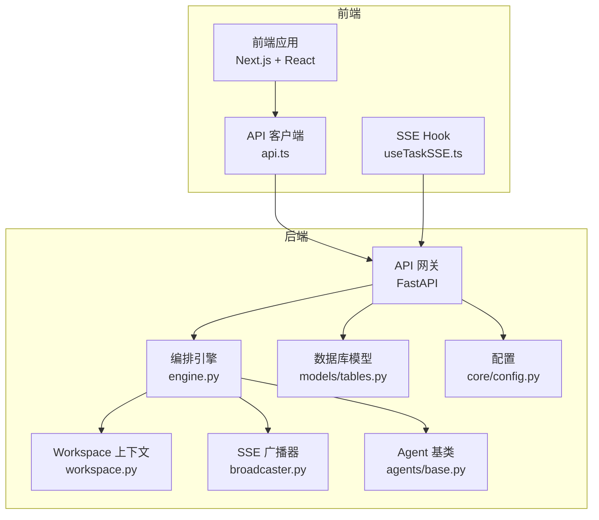
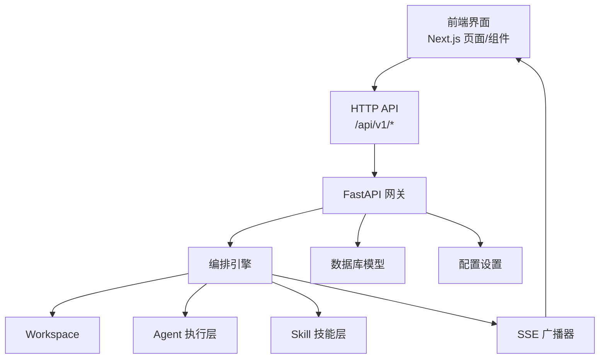
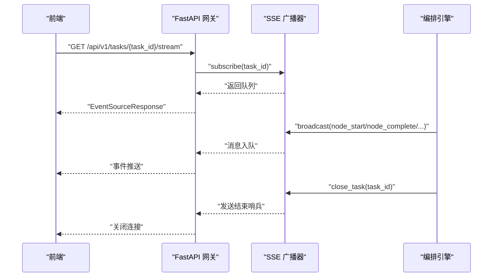
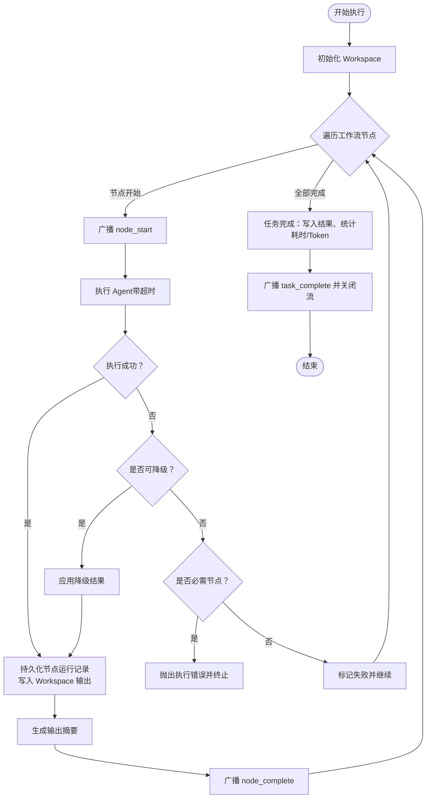
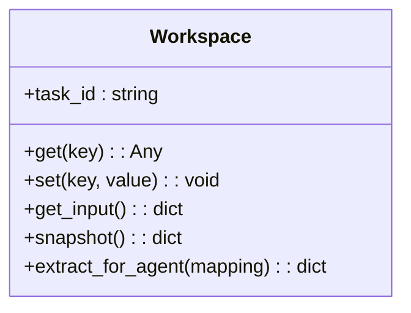
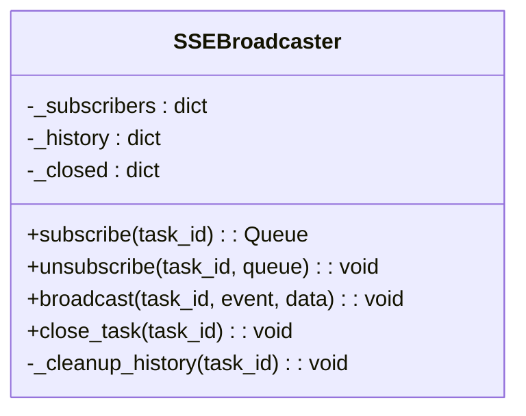
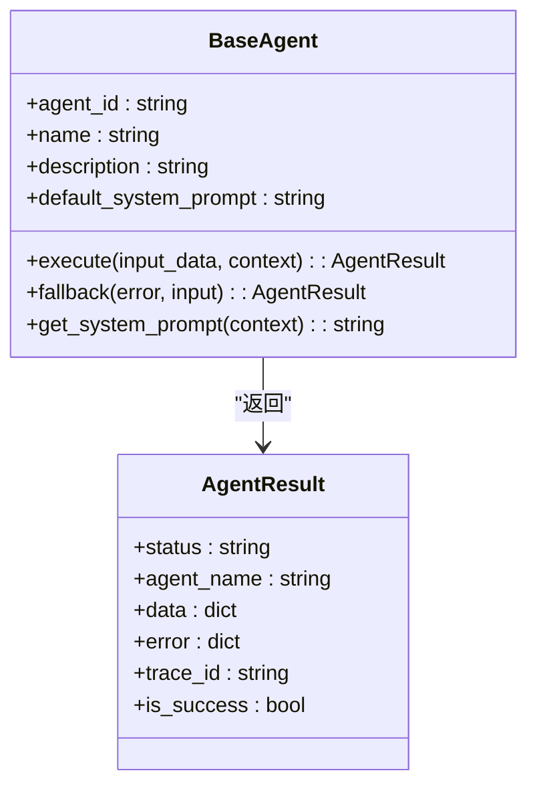
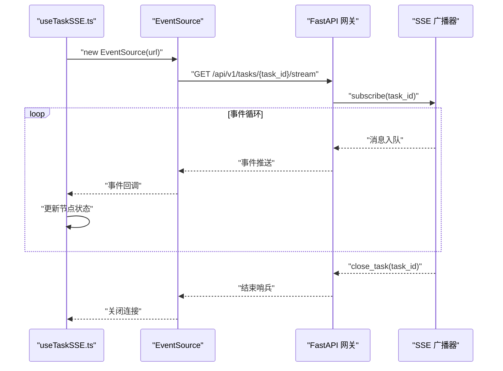
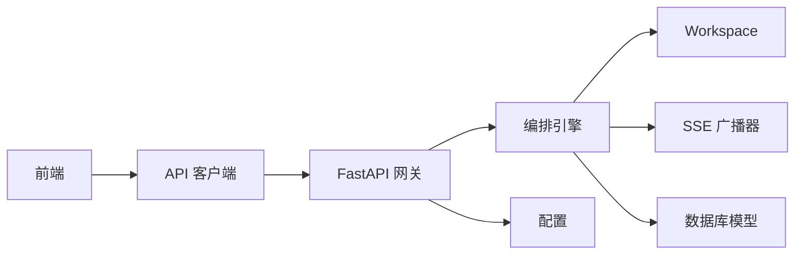

# 系统架构设计

<cite>
**本文引用的文件**
- [ARCHITECTURE.md](file://ARCHITECTURE.md)
- [backend/app/main.py](file://backend/app/main.py)
- [backend/app/orchestrator/engine.py](file://backend/app/orchestrator/engine.py)
- [backend/app/orchestrator/workspace.py](file://backend/app/orchestrator/workspace.py)
- [backend/app/orchestrator/broadcaster.py](file://backend/app/orchestrator/broadcaster.py)
- [backend/app/api/stream_routes.py](file://backend/app/api/stream_routes.py)
- [backend/app/agents/base.py](file://backend/app/agents/base.py)
- [backend/app/schemas/agent.py](file://backend/app/schemas/agent.py)
- [backend/app/models/tables.py](file://backend/app/models/tables.py)
- [backend/app/core/config.py](file://backend/app/core/config.py)
- [frontend/hooks/useTaskSSE.ts](file://frontend/hooks/useTaskSSE.ts)
- [frontend/lib/api.ts](file://frontend/lib/api.ts)
- [frontend/app/layout.tsx](file://frontend/app/layout.tsx)
</cite>

## 目录
1. [引言](#引言)
2. [项目结构](#项目结构)
3. [核心组件](#核心组件)
4. [架构总览](#架构总览)
5. [详细组件分析](#详细组件分析)
6. [依赖关系分析](#依赖关系分析)
7. [性能考量](#性能考量)
8. [故障排查指南](#故障排查指南)
9. [结论](#结论)
10. [附录](#附录)

## 引言
HotClaw 是一个“基于多智能体协作的公众号内容生产平台”。用户输入“账号定位”，系统自动完成从热点抓取、选题策划、标题生成、正文撰写到审核风控的全链路内容生产，并输出可编辑的文章草稿。系统采用前后端分离架构，控制平面与执行平面分离，通过 API 网关统一入口，工作流编排引擎驱动智能体执行层与技能层协同工作，借助 SSE 实现实时状态推送，配合声明式 Manifest 注册系统与 Workspace 上下文隔离机制，确保可审计、可回放、可配置。

## 项目结构
系统采用分层模块化组织：
- 前端（Next.js + React）：页面路由、组件树、状态管理、SSE 订阅与消费
- 后端（FastAPI + Python）：API 网关、编排引擎、智能体与技能、数据库模型、SSE 广播器
- 配置与基础设施：SQLite（开发）、Redis（可选）、LLM API（OpenAI 等）

图表来源
- [backend/app/main.py:60-142](file://backend/app/main.py#L60-L142)
- [backend/app/orchestrator/engine.py:89-285](file://backend/app/orchestrator/engine.py#L89-L285)
- [backend/app/orchestrator/workspace.py:12-53](file://backend/app/orchestrator/workspace.py#L12-L53)
- [backend/app/orchestrator/broadcaster.py:11-94](file://backend/app/orchestrator/broadcaster.py#L11-L94)
- [backend/app/api/stream_routes.py:14-43](file://backend/app/api/stream_routes.py#L14-L43)
- [backend/app/agents/base.py:49-99](file://backend/app/agents/base.py#L49-L99)
- [backend/app/models/tables.py:23-233](file://backend/app/models/tables.py#L23-L233)
- [backend/app/core/config.py:7-51](file://backend/app/core/config.py#L7-L51)
- [frontend/hooks/useTaskSSE.ts:28-124](file://frontend/hooks/useTaskSSE.ts#L28-L124)
- [frontend/lib/api.ts:48-50](file://frontend/lib/api.ts#L48-L50)

章节来源
- [ARCHITECTURE.md:37-78](file://ARCHITECTURE.md#L37-L78)
- [backend/app/main.py:14-142](file://backend/app/main.py#L14-L142)

## 核心组件
- API 网关层（FastAPI）
  - 路由注册、CORS、全局中间件、异常处理、健康检查
  - SSE 流端点：/api/v1/tasks/{task_id}/stream
- 工作流编排引擎（OrchestratorEngine）
  - 读取默认线性工作流，按序调度 Agent，管理 Workspace，广播节点事件，持久化节点运行记录
- Workspace 上下文隔离
  - 任务级上下文容器，支持提取与写入，保证 Agent 间数据共享与隔离
- SSE 广播器（SSEBroadcaster）
  - 任务级订阅队列、事件缓冲与重放、连接保活、流结束信号
- 智能体执行层（BaseAgent 及其实现）
  - 统一的结构化输入输出、降级策略、统一结果封装
- 技能层（Skill 机制）
  - 无状态原子能力封装，通过 Manifest 声明式注册
- 数据模型与配置
  - SQLAlchemy 模型覆盖任务、节点运行、账号画像、文章草稿、审核结果、Agent/Skill/工作流模板、系统日志
  - 配置项包括数据库、Redis、LLM、超时等

章节来源
- [backend/app/main.py:14-142](file://backend/app/main.py#L14-L142)
- [backend/app/orchestrator/engine.py:89-285](file://backend/app/orchestrator/engine.py#L89-L285)
- [backend/app/orchestrator/workspace.py:12-53](file://backend/app/orchestrator/workspace.py#L12-L53)
- [backend/app/orchestrator/broadcaster.py:11-94](file://backend/app/orchestrator/broadcaster.py#L11-L94)
- [backend/app/agents/base.py:49-99](file://backend/app/agents/base.py#L49-L99)
- [backend/app/models/tables.py:23-233](file://backend/app/models/tables.py#L23-L233)
- [backend/app/core/config.py:7-51](file://backend/app/core/config.py#L7-L51)

## 架构总览
系统采用“前后端分离 + 控制平面/执行平面分离”的设计：
- 前端负责可视化与交互，通过 HTTP + SSE 与后端通信
- 后端 API 网关统一入口，编排引擎负责调度与状态广播，智能体与技能执行具体任务
- Workspace 作为任务级上下文容器，贯穿整个工作流
- Manifest 声明式注册系统，结合数据库持久化配置，实现可配置、可审计、可回放

图表来源
- [ARCHITECTURE.md:37-78](file://ARCHITECTURE.md#L37-L78)
- [backend/app/main.py:60-142](file://backend/app/main.py#L60-L142)
- [backend/app/orchestrator/engine.py:89-285](file://backend/app/orchestrator/engine.py#L89-L285)
- [backend/app/orchestrator/broadcaster.py:11-94](file://backend/app/orchestrator/broadcaster.py#L11-L94)
- [backend/app/models/tables.py:23-233](file://backend/app/models/tables.py#L23-L233)
- [backend/app/core/config.py:7-51](file://backend/app/core/config.py#L7-L51)

## 详细组件分析

### API 网关层（FastAPI）
- 职责
  - 路由注册：任务、流、Agent、Skill
  - 中间件：CORS、Trace ID
  - 异常处理：HotClawError 映射到 HTTP 状态码
  - 健康检查
- SSE 端点
  - /api/v1/tasks/{task_id}/stream：基于 sse-starlette 的 EventSourceResponse，维护订阅队列，发送 keepalive，支持流结束信号

图表来源
- [backend/app/api/stream_routes.py:14-43](file://backend/app/api/stream_routes.py#L14-L43)
- [backend/app/orchestrator/broadcaster.py:30-85](file://backend/app/orchestrator/broadcaster.py#L30-L85)
- [backend/app/orchestrator/engine.py:124-232](file://backend/app/orchestrator/engine.py#L124-L232)

章节来源
- [backend/app/main.py:60-142](file://backend/app/main.py#L60-L142)
- [backend/app/api/stream_routes.py:14-43](file://backend/app/api/stream_routes.py#L14-L43)

### 工作流编排引擎（OrchestratorEngine）
- 职责
  - 初始化 Workspace，按默认线性工作流调度 Agent
  - 广播节点开始/进度/完成/错误事件
  - 节点运行记录持久化（TaskNodeRunModel）
  - 任务完成后广播 task_complete 并关闭流
- 降级与容错
  - Agent 执行失败触发 fallback，必要节点失败抛出异常终止
- 超时控制
  - 基于配置的 Agent 超时限制

图表来源
- [backend/app/orchestrator/engine.py:92-234](file://backend/app/orchestrator/engine.py#L92-L234)
- [backend/app/orchestrator/workspace.py:15-52](file://backend/app/orchestrator/workspace.py#L15-L52)
- [backend/app/models/tables.py:48-73](file://backend/app/models/tables.py#L48-L73)

章节来源
- [backend/app/orchestrator/engine.py:89-285](file://backend/app/orchestrator/engine.py#L89-L285)
- [backend/app/orchestrator/workspace.py:12-53](file://backend/app/orchestrator/workspace.py#L12-L53)
- [backend/app/models/tables.py:23-233](file://backend/app/models/tables.py#L23-L233)

### Workspace 上下文隔离机制
- 任务级隔离：每个任务创建独立 Workspace，包含原始输入与中间输出
- 数据提取：根据节点定义的 input_mapping 从 Workspace 提取 Agent 输入
- 写入与快照：Agent 执行结果写入 Workspace，供后续节点使用；任务结束时快照持久化

图表来源
- [backend/app/orchestrator/workspace.py:12-53](file://backend/app/orchestrator/workspace.py#L12-L53)

章节来源
- [backend/app/orchestrator/workspace.py:12-53](file://backend/app/orchestrator/workspace.py#L12-L53)

### SSE 广播器（SSEBroadcaster）
- 订阅管理：为每个 task_id 维护订阅队列，支持重放历史事件
- 事件缓冲：保存 past events，解决前端连接建立晚于任务开始的问题
- 连接保活：超时发送 keepalive 注释
- 流结束：发送哨兵（None）并清理历史

图表来源
- [backend/app/orchestrator/broadcaster.py:11-94](file://backend/app/orchestrator/broadcaster.py#L11-L94)

章节来源
- [backend/app/orchestrator/broadcaster.py:11-94](file://backend/app/orchestrator/broadcaster.py#L11-L94)

### 智能体执行层（BaseAgent）
- 统一接口：execute(input_data, context) 返回结构化 AgentResult
- 降级策略：fallback(error, input) 可返回降级结果
- 系统提示：支持从上下文获取有效系统提示

图表来源
- [backend/app/agents/base.py:18-99](file://backend/app/agents/base.py#L18-L99)

章节来源
- [backend/app/agents/base.py:49-99](file://backend/app/agents/base.py#L49-L99)

### 技能层（Skill 机制）
- 无状态原子能力：封装具体技术操作（API 调用、数据处理、规则匹配）
- 声明式注册：通过 Manifest 定义 skill_id、模块路径、输入输出 Schema、配置
- 调用协议：Agent 通过注册中心获取 Skill 实例并执行

章节来源
- [ARCHITECTURE.md:635-759](file://ARCHITECTURE.md#L635-L759)

### 数据模型与配置
- 数据模型
  - 任务（TaskModel）、节点运行（TaskNodeRunModel）、账号画像（AccountProfileModel）、文章草稿（ArticleDraftModel）、审核结果（AuditResultModel）、Agent/Skill/工作流模板、系统日志（SystemLogModel）
- 配置
  - 数据库、Redis、LLM、应用环境、日志级别、各类超时

章节来源
- [backend/app/models/tables.py:23-233](file://backend/app/models/tables.py#L23-L233)
- [backend/app/core/config.py:7-51](file://backend/app/core/config.py#L7-L51)

### 前端消费方式（SSE）
- 订阅与重放
  - 通过 api.ts 的 getTaskStreamUrl(taskId) 获取 SSE 地址，使用 EventSource 订阅
  - 前端 useTaskSSE.ts 维护节点状态数组，接收 node_start/node_complete/node_error 事件并更新 UI
- 事件类型
  - node_start：节点开始
  - node_progress：节点执行中（当前版本未使用）
  - node_complete：节点完成（含耗时、降级标记、输出摘要）
  - node_error：节点错误
  - task_complete：任务完成
  - task_error：任务级错误

图表来源
- [frontend/hooks/useTaskSSE.ts:28-124](file://frontend/hooks/useTaskSSE.ts#L28-L124)
- [frontend/lib/api.ts:48-50](file://frontend/lib/api.ts#L48-L50)
- [backend/app/api/stream_routes.py:14-43](file://backend/app/api/stream_routes.py#L14-L43)
- [backend/app/orchestrator/broadcaster.py:30-85](file://backend/app/orchestrator/broadcaster.py#L30-L85)

章节来源
- [frontend/hooks/useTaskSSE.ts:28-124](file://frontend/hooks/useTaskSSE.ts#L28-L124)
- [frontend/lib/api.ts:48-50](file://frontend/lib/api.ts#L48-L50)

## 依赖关系分析
- 模块耦合
  - 网关层对编排引擎与广播器存在直接依赖
  - 编排引擎依赖 Agent 注册中心、Workspace、广播器与数据库模型
  - 前端通过 API 客户端与网关交互，SSE 作为单向事件通道
- 外部依赖
  - 数据库（SQLite/PostgreSQL）、Redis、LLM API
- 循环依赖
  - 未发现直接循环依赖；SSE 广播器作为事件中转，避免了编排引擎与前端的直接耦合

图表来源
- [backend/app/main.py:14-142](file://backend/app/main.py#L14-L142)
- [backend/app/orchestrator/engine.py:89-285](file://backend/app/orchestrator/engine.py#L89-L285)
- [backend/app/orchestrator/broadcaster.py:11-94](file://backend/app/orchestrator/broadcaster.py#L11-L94)
- [backend/app/models/tables.py:23-233](file://backend/app/models/tables.py#L23-L233)
- [backend/app/core/config.py:7-51](file://backend/app/core/config.py#L7-L51)
- [frontend/lib/api.ts:12-24](file://frontend/lib/api.ts#L12-L24)

章节来源
- [backend/app/main.py:14-142](file://backend/app/main.py#L14-L142)
- [backend/app/models/tables.py:23-233](file://backend/app/models/tables.py#L23-L233)

## 性能考量
- SSE 连接保活：超时发送 keepalive 注释，避免代理中断
- 事件缓冲与重放：减少前端连接竞争导致的数据丢失
- 任务完成后清理历史：防止内存泄漏
- 超时控制：Agent/Skill/LLM 超时参数可配置，避免长时间阻塞
- 数据持久化：节点运行记录包含耗时、Token 消耗，便于性能分析与优化

## 故障排查指南
- 前端无法收到事件
  - 检查 /api/v1/tasks/{task_id}/stream 是否正常返回 EventSourceResponse
  - 确认 useTaskSSE.ts 中事件监听是否正确绑定
- 任务长时间无响应
  - 检查 Agent 超时配置与 LLM API 响应
  - 查看数据库中 TaskNodeRunModel 的状态与错误信息
- 事件丢失或乱序
  - SSE 广播器已实现事件缓冲与重放，确认前端连接建立时间
- 统一异常处理
  - HotClawError 会映射到相应 HTTP 状态码，便于前端识别错误类别

章节来源
- [backend/app/main.py:88-129](file://backend/app/main.py#L88-L129)
- [backend/app/orchestrator/broadcaster.py:30-85](file://backend/app/orchestrator/broadcaster.py#L30-L85)
- [backend/app/models/tables.py:48-73](file://backend/app/models/tables.py#L48-L73)

## 结论
HotClaw 通过前后端分离与控制/执行平面分离，实现了清晰的职责划分与良好的可扩展性。SSE 实时推送与 Workspace 上下文隔离确保了可观测性与可审计性；声明式 Manifest 注册系统与结构化输入输出提升了系统的可配置性与稳定性。该架构在 MVP 阶段满足快速迭代与功能验证的需求，同时为后续 DAG 工作流、插件系统与分布式部署预留了扩展点。

## 附录
- 系统边界
  - 对外：HTTP + SSE 接口
  - 内部：编排引擎、Agent、Skill、数据库、配置
- 关键决策与权衡
  - 前后端分离：提升开发效率与可替换性，前端独立消费事件流
  - SSE 优于 WebSocket：单向推送更简单，降低协议复杂度与实现成本
  - Workspace 首位：任务级上下文隔离，简化跨 Agent 数据共享
  - Manifest 声明式注册：配置优先于代码，便于运维与审计

章节来源
- [ARCHITECTURE.md:80-123](file://ARCHITECTURE.md#L80-L123)
- [ARCHITECTURE.md:401-494](file://ARCHITECTURE.md#L401-L494)