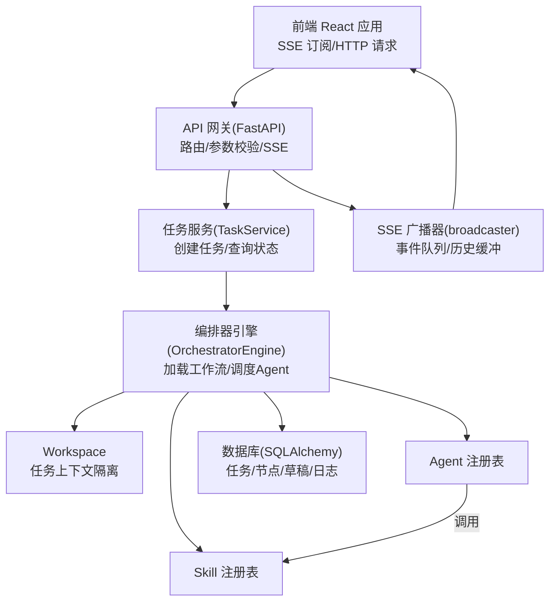
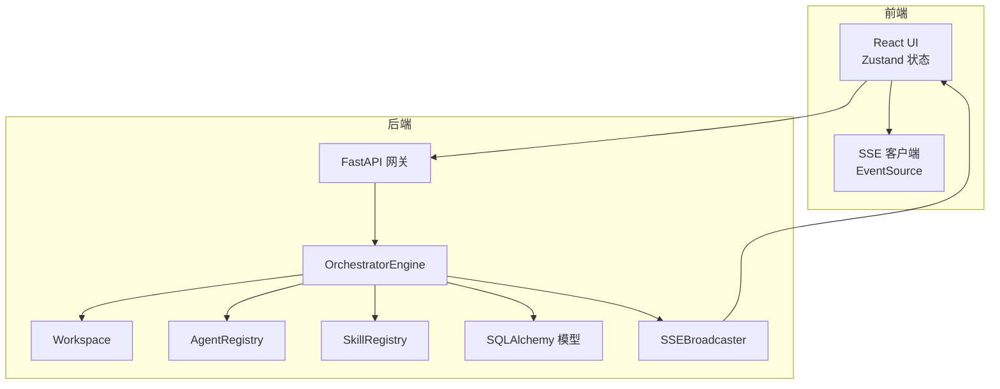
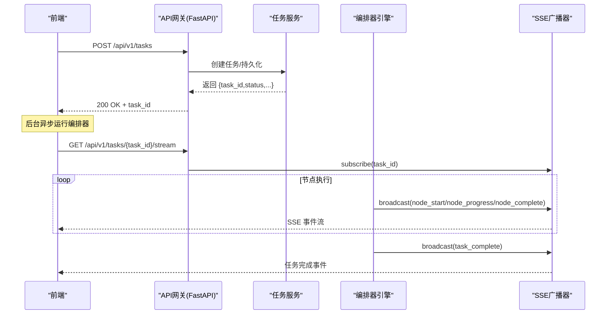
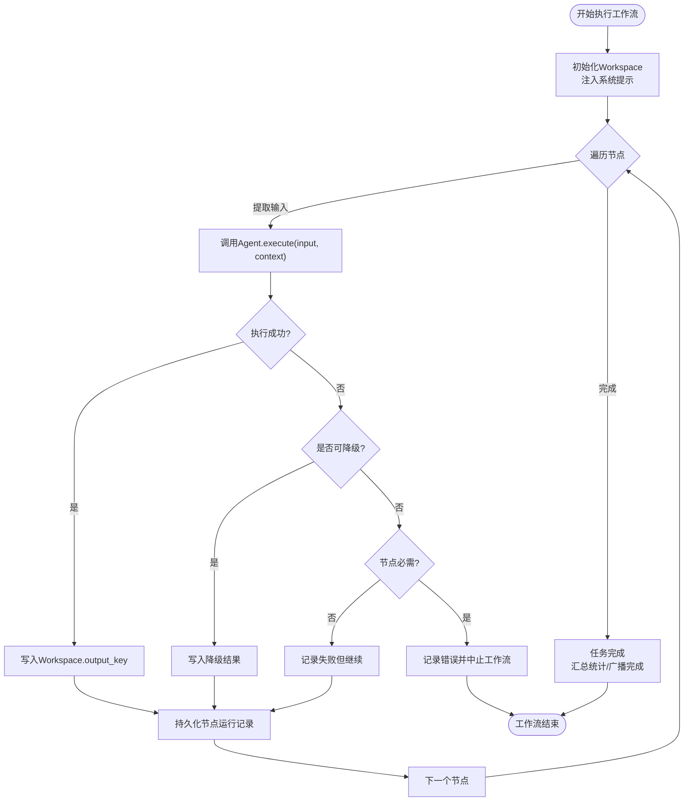
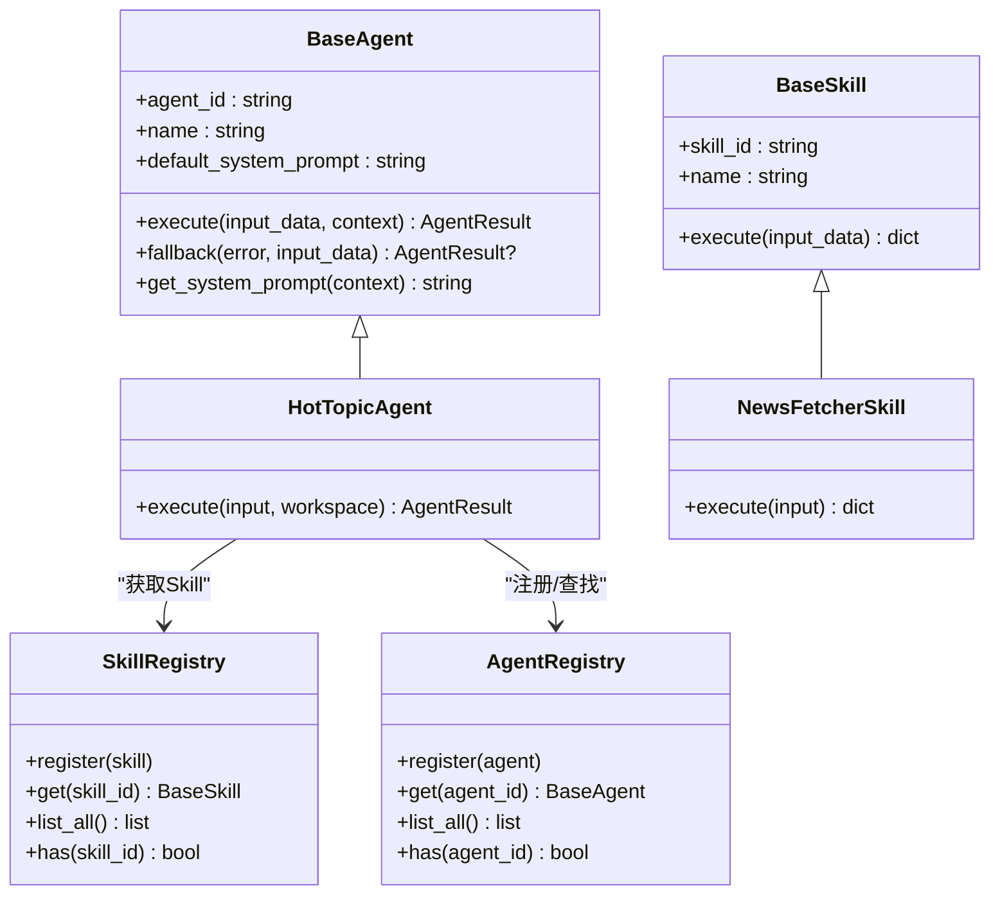
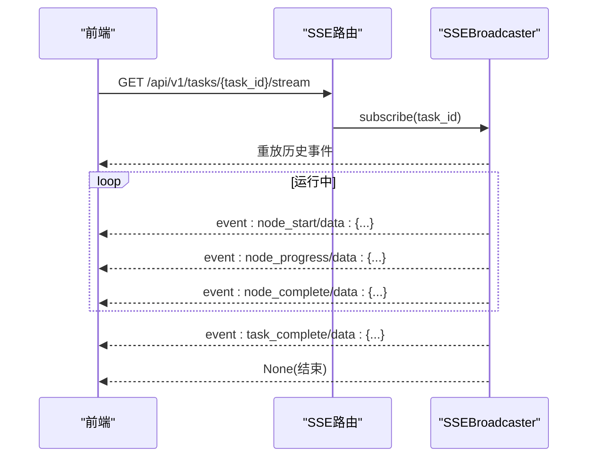
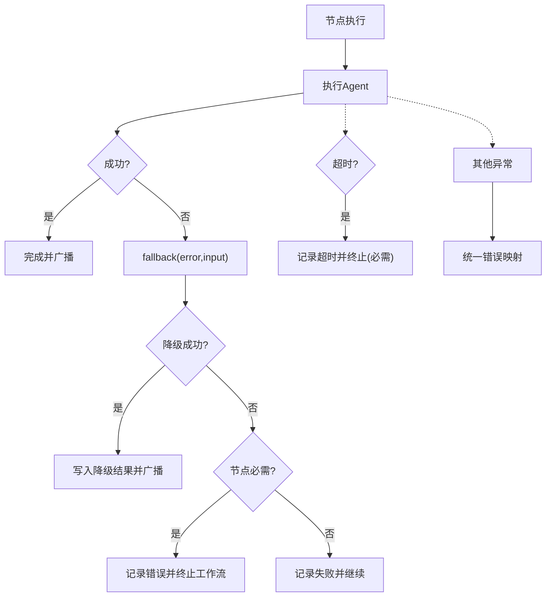
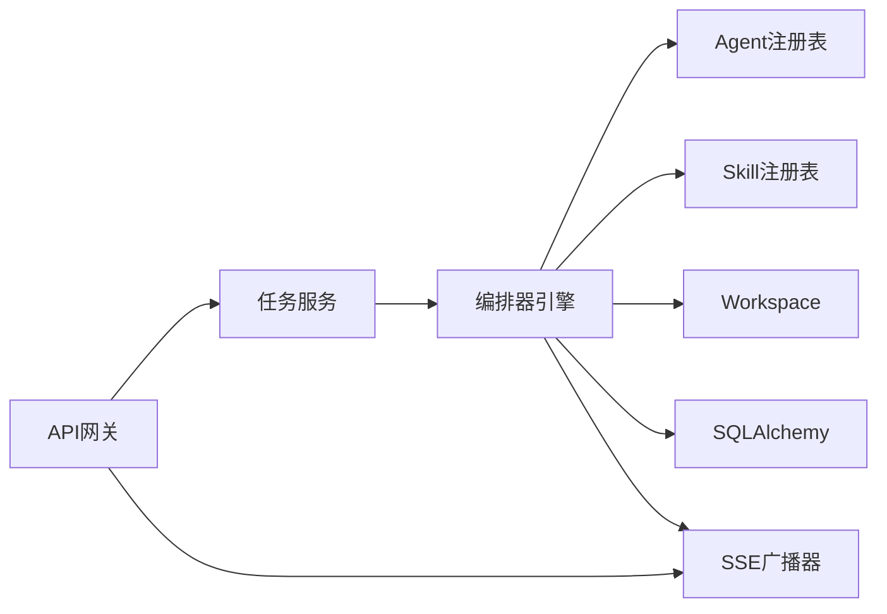

# 组件交互机制

<cite>
**本文引用的文件**
- [ARCHITECTURE.md](file://ARCHITECTURE.md)
- [backend/app/main.py](file://backend/app/main.py)
- [backend/app/orchestrator/engine.py](file://backend/app/orchestrator/engine.py)
- [backend/app/orchestrator/workspace.py](file://backend/app/orchestrator/workspace.py)
- [backend/app/orchestrator/broadcaster.py](file://backend/app/orchestrator/broadcaster.py)
- [backend/app/agents/base.py](file://backend/app/agents/base.py)
- [backend/app/agents/registry.py](file://backend/app/agents/registry.py)
- [backend/app/skills/base.py](file://backend/app/skills/base.py)
- [backend/app/skills/registry.py](file://backend/app/skills/registry.py)
- [backend/app/api/task_routes.py](file://backend/app/api/task_routes.py)
- [backend/app/api/stream_routes.py](file://backend/app/api/stream_routes.py)
- [backend/app/models/tables.py](file://backend/app/models/tables.py)
- [backend/app/schemas/agent.py](file://backend/app/schemas/agent.py)
- [backend/app/schemas/skill.py](file://backend/app/schemas/skill.py)
- [frontend/lib/api.ts](file://frontend/lib/api.ts)
</cite>

## 目录
1. [引言](#引言)
2. [项目结构](#项目结构)
3. [核心组件](#核心组件)
4. [架构总览](#架构总览)
5. [详细组件分析](#详细组件分析)
6. [依赖分析](#依赖分析)
7. [性能考量](#性能考量)
8. [故障排查指南](#故障排查指南)
9. [结论](#结论)
10. [附录](#附录)

## 引言
本文件面向HotClaw系统，聚焦“组件交互机制”，系统性阐述API网关、工作流编排器、智能体、技能等核心组件之间的交互关系与通信协议；解释Workspace上下文隔离如何实现组件间的数据共享与状态同步；阐明Manifest声明式注册与动态加载机制；并覆盖组件生命周期管理、事件驱动机制与错误传播机制。文档同时提供交互序列图与数据流转图，帮助读者快速建立对系统运行时行为的整体认知。

## 项目结构
HotClaw采用前后端分离架构：前端为React应用，通过HTTP与SSE与后端交互；后端以FastAPI为核心，提供API网关、工作流编排、智能体与技能执行、状态广播与持久化等能力。核心模块划分如下：
- 网关层（FastAPI路由）：统一入口、参数校验、SSE端点、异常处理
- 编排层（Orchestrator Engine）：加载工作流、调度Agent、管理Workspace、广播事件
- 执行层（Agent/Skill）：Agent负责业务决策与调用Skill，Skill提供原子能力
- 存储层（SQLAlchemy）：任务、节点运行、草稿、审核、系统日志等模型
- 前端（React + Zustand + SSE）：任务创建、运行监控、结果预览、配置管理

图表来源
- [backend/app/main.py:14-137](file://backend/app/main.py#L14-L137)
- [backend/app/api/task_routes.py:19-51](file://backend/app/api/task_routes.py#L19-L51)
- [backend/app/orchestrator/engine.py:92-234](file://backend/app/orchestrator/engine.py#L92-L234)
- [backend/app/orchestrator/workspace.py:12-53](file://backend/app/orchestrator/workspace.py#L12-L53)
- [backend/app/orchestrator/broadcaster.py:11-94](file://backend/app/orchestrator/broadcaster.py#L11-L94)
- [backend/app/models/tables.py:23-233](file://backend/app/models/tables.py#L23-L233)

章节来源
- [ARCHITECTURE.md:37-78](file://ARCHITECTURE.md#L37-L78)
- [ARCHITECTURE.md:414-447](file://ARCHITECTURE.md#L414-L447)

## 核心组件
- API网关（FastAPI）
  - 路由：任务创建、状态查询、节点明细、SSE流、Agent/Skill配置接口
  - 中间件：CORS、Trace ID注入
  - 异常：统一错误响应映射
- 工作流编排器（OrchestratorEngine）
  - 加载默认线性工作流节点
  - 逐节点调度Agent，提取输入、执行、落库、广播事件
  - 超时与失败降级策略
- Workspace（工作空间）
  - 任务级上下文容器，支持读写、快照、按映射提取输入
- SSE广播器（SSEBroadcaster）
  - 每任务事件队列、历史缓冲、订阅/取消订阅、结束信号
- Agent/Skill注册表
  - 统一注册与查找，缺失时抛出明确错误
- Agent/Skill基类
  - Agent：标准化执行结果、系统提示注入、降级策略
  - Skill：标准化输入输出、无状态原子能力
- 数据模型（SQLAlchemy）
  - 任务、节点运行、账号画像、候选选题、文章草稿、审核结果、系统日志

章节来源
- [backend/app/main.py:60-142](file://backend/app/main.py#L60-L142)
- [backend/app/api/task_routes.py:19-163](file://backend/app/api/task_routes.py#L19-L163)
- [backend/app/api/stream_routes.py:14-43](file://backend/app/api/stream_routes.py#L14-L43)
- [backend/app/orchestrator/engine.py:89-285](file://backend/app/orchestrator/engine.py#L89-L285)
- [backend/app/orchestrator/workspace.py:12-53](file://backend/app/orchestrator/workspace.py#L12-L53)
- [backend/app/orchestrator/broadcaster.py:11-94](file://backend/app/orchestrator/broadcaster.py#L11-L94)
- [backend/app/agents/base.py:18-99](file://backend/app/agents/base.py#L18-L99)
- [backend/app/agents/registry.py:10-40](file://backend/app/agents/registry.py#L10-L40)
- [backend/app/skills/base.py:16-37](file://backend/app/skills/base.py#L16-L37)
- [backend/app/skills/registry.py:10-37](file://backend/app/skills/registry.py#L10-L37)
- [backend/app/models/tables.py:23-233](file://backend/app/models/tables.py#L23-L233)

## 架构总览
HotClaw采用“控制平面与执行平面分离”的理念：编排器负责控制（何时调谁），Agent负责执行（做什么事）。API网关作为唯一入口，统一鉴权、限流与参数校验；前端通过SSE实时接收节点状态事件，实现链路可视化与运行监控。

图表来源
- [ARCHITECTURE.md:92-123](file://ARCHITECTURE.md#L92-L123)
- [backend/app/main.py:60-142](file://backend/app/main.py#L60-L142)
- [backend/app/orchestrator/engine.py:92-234](file://backend/app/orchestrator/engine.py#L92-L234)
- [backend/app/orchestrator/broadcaster.py:11-94](file://backend/app/orchestrator/broadcaster.py#L11-L94)

## 详细组件分析

### API网关与任务生命周期
- 任务创建：POST /api/v1/tasks 返回任务ID，后台异步运行编排器
- 状态查询：GET /api/v1/tasks/{task_id}/status 获取当前节点与进度
- 节点明细：GET /api/v1/tasks/{task_id}/nodes 获取节点执行记录
- 任务详情：GET /api/v1/tasks/{task_id} 获取完整结果
- SSE流：GET /api/v1/tasks/{task_id}/stream 实时推送节点事件
- Agent/Skill配置：/api/v1/agents 与 /api/v1/skills 提供查询与更新

图表来源
- [backend/app/api/task_routes.py:19-51](file://backend/app/api/task_routes.py#L19-L51)
- [backend/app/api/stream_routes.py:14-43](file://backend/app/api/stream_routes.py#L14-L43)
- [backend/app/orchestrator/engine.py:124-234](file://backend/app/orchestrator/engine.py#L124-L234)
- [backend/app/orchestrator/broadcaster.py:30-80](file://backend/app/orchestrator/broadcaster.py#L30-L80)

章节来源
- [backend/app/api/task_routes.py:19-163](file://backend/app/api/task_routes.py#L19-L163)
- [backend/app/api/stream_routes.py:14-43](file://backend/app/api/stream_routes.py#L14-L43)
- [frontend/lib/api.ts:26-50](file://frontend/lib/api.ts#L26-L50)

### 工作流编排器与Workspace上下文隔离
- 工作流节点：默认线性链，包含账号解析、热点分析、选题策划、标题生成、正文生成、审核评估
- 输入映射：根据节点定义将Workspace中的键映射到Agent输入
- 执行与降级：捕获Agent执行异常，尝试fallback；必要时终止工作流
- 事件广播：节点开始/进度/完成/错误，以及任务完成事件
- 状态持久化：节点运行记录、任务状态、耗时、Token统计

图表来源
- [backend/app/orchestrator/engine.py:92-234](file://backend/app/orchestrator/engine.py#L92-L234)
- [backend/app/orchestrator/workspace.py:12-53](file://backend/app/orchestrator/workspace.py#L12-L53)
- [backend/app/models/tables.py:48-74](file://backend/app/models/tables.py#L48-L74)

章节来源
- [backend/app/orchestrator/engine.py:92-285](file://backend/app/orchestrator/engine.py#L92-L285)
- [backend/app/orchestrator/workspace.py:12-53](file://backend/app/orchestrator/workspace.py#L12-L53)
- [backend/app/models/tables.py:23-74](file://backend/app/models/tables.py#L23-L74)

### 智能体与技能交互协议
- Agent基类：标准化执行结果、系统提示注入、可选降级策略
- Skill基类：标准化输入输出，无状态原子能力
- 注册表：集中注册与查找，缺失抛错
- 调用协议：Agent通过注册表获取Skill实例，构造输入并执行，返回结构化输出

图表来源
- [backend/app/agents/base.py:49-99](file://backend/app/agents/base.py#L49-L99)
- [backend/app/agents/registry.py:10-40](file://backend/app/agents/registry.py#L10-L40)
- [backend/app/skills/base.py:16-37](file://backend/app/skills/base.py#L16-L37)
- [backend/app/skills/registry.py:10-37](file://backend/app/skills/registry.py#L10-L37)

章节来源
- [backend/app/agents/base.py:18-99](file://backend/app/agents/base.py#L18-L99)
- [backend/app/skills/base.py:16-37](file://backend/app/skills/base.py#L16-L37)
- [backend/app/agents/registry.py:10-40](file://backend/app/agents/registry.py#L10-L40)
- [backend/app/skills/registry.py:10-37](file://backend/app/skills/registry.py#L10-L37)

### SSE事件驱动机制
- 订阅/取消：SSEBroadcaster为每个任务维护订阅队列，支持历史事件重放
- 广播：节点开始/进度/完成/错误，任务完成/错误事件
- 保活：连接空闲时发送keepalive注释
- 结束：任务完成后发送哨兵None并清理历史

图表来源
- [backend/app/api/stream_routes.py:14-43](file://backend/app/api/stream_routes.py#L14-L43)
- [backend/app/orchestrator/broadcaster.py:30-80](file://backend/app/orchestrator/broadcaster.py#L30-L80)

章节来源
- [backend/app/api/stream_routes.py:14-43](file://backend/app/api/stream_routes.py#L14-L43)
- [backend/app/orchestrator/broadcaster.py:11-94](file://backend/app/orchestrator/broadcaster.py#L11-L94)

### 错误传播与降级策略
- Agent执行异常：记录错误消息，尝试fallback；若节点必需则中止工作流
- 超时异常：按节点超时阈值处理，必要时中止
- 未处理异常：统一映射为500，返回结构化错误响应
- 前端：SSE事件携带错误信息，UI展示失败节点与降级状态

图表来源
- [backend/app/orchestrator/engine.py:137-197](file://backend/app/orchestrator/engine.py#L137-L197)
- [backend/app/main.py:87-129](file://backend/app/main.py#L87-L129)

章节来源
- [backend/app/orchestrator/engine.py:137-197](file://backend/app/orchestrator/engine.py#L137-L197)
- [backend/app/main.py:87-129](file://backend/app/main.py#L87-L129)

### Manifest声明式注册与动态加载机制
- Agent/Skill通过注册表集中注册，便于编排器按ID调度
- 配置Schema：AgentInfo/SkillInfo等Pydantic模型定义结构化配置
- 前端API：listAgents/listSkills/updateAgentConfig/updateSkillConfig

说明：仓库中未发现Manifest YAML/JSON动态加载的具体实现文件，当前Agent/Skill通过导入与注册的方式在启动时完成装配。若后续引入Manifest动态加载，建议遵循现有注册表与Schema契约，确保类型安全与运行时一致性。

章节来源
- [backend/app/agents/registry.py:10-40](file://backend/app/agents/registry.py#L10-L40)
- [backend/app/skills/registry.py:10-37](file://backend/app/skills/registry.py#L10-L37)
- [backend/app/schemas/agent.py:6-29](file://backend/app/schemas/agent.py#L6-L29)
- [backend/app/schemas/skill.py:6-22](file://backend/app/schemas/skill.py#L6-L22)
- [frontend/lib/api.ts:68-109](file://frontend/lib/api.ts#L68-L109)

## 依赖分析
- 组件耦合
  - 编排器强依赖注册表与Workspace；弱依赖数据库与SSE广播器
  - Agent与Skill通过注册表解耦，仅依赖结构化输入输出
  - 网关层仅依赖服务层与广播器，保持薄路由职责
- 外部依赖
  - FastAPI + sse-starlette（SSE）
  - SQLAlchemy（异步会话）
  - Pydantic（Schema校验）

图表来源
- [backend/app/main.py:14-137](file://backend/app/main.py#L14-L137)
- [backend/app/orchestrator/engine.py:18-26](file://backend/app/orchestrator/engine.py#L18-L26)
- [backend/app/orchestrator/broadcaster.py:11-20](file://backend/app/orchestrator/broadcaster.py#L11-L20)

章节来源
- [backend/app/main.py:14-137](file://backend/app/main.py#L14-L137)
- [backend/app/orchestrator/engine.py:18-26](file://backend/app/orchestrator/engine.py#L18-L26)

## 性能考量
- 异步执行：编排器与SSE均基于异步I/O，降低阻塞
- 事件缓冲：SSE广播器对历史事件进行缓冲，避免前端连接延迟导致丢失
- 超时控制：节点级超时保障长尾任务不会无限占用资源
- Token统计：节点运行记录中累积prompt/completion tokens，便于成本与性能分析
- 前端渲染：Zustand轻量状态管理，SSE事件驱动UI增量更新

## 故障排查指南
- 任务无法启动
  - 检查任务创建接口返回与后台异步任务调度
  - 关注编排器初始化与Agent注册是否成功
- SSE无事件
  - 确认SSE订阅URL正确且未被取消
  - 检查SSE广播器是否已关闭任务流
- 节点失败
  - 查看节点运行记录中的error_message与degraded标记
  - 若为必需节点，确认是否触发了工作流中止
- Agent/Skill配置问题
  - 通过Agent/Skill配置接口校验schema与字段
  - 检查注册表中是否存在对应ID

章节来源
- [backend/app/api/task_routes.py:54-107](file://backend/app/api/task_routes.py#L54-L107)
- [backend/app/orchestrator/broadcaster.py:70-84](file://backend/app/orchestrator/broadcaster.py#L70-L84)
- [backend/app/models/tables.py:48-74](file://backend/app/models/tables.py#L48-L74)

## 结论
HotClaw通过“控制平面与执行平面分离”实现了清晰的职责划分：编排器专注于工作流调度与上下文管理，Agent专注于业务决策与调用技能，Skill提供稳定的原子能力。API网关统一入口与SSE事件驱动使前端具备实时可观测性。Workspace作为任务级上下文容器，既保证了隔离，又提供了高效的数据共享。尽管当前未实现Manifest动态加载，但注册表与Schema契约已为后续扩展奠定基础。建议在后续版本中引入Manifest动态加载与DAG工作流编辑器，进一步增强系统的可配置性与可扩展性。

## 附录
- 前端API客户端：提供任务创建、详情、节点明细、SSE地址与Agent/Skill配置接口
- 数据模型概览：涵盖任务、节点运行、账号画像、候选选题、文章草稿、审核结果与系统日志

章节来源
- [frontend/lib/api.ts:14-110](file://frontend/lib/api.ts#L14-L110)
- [backend/app/models/tables.py:23-233](file://backend/app/models/tables.py#L23-L233)