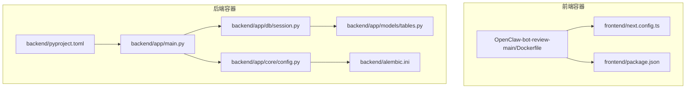
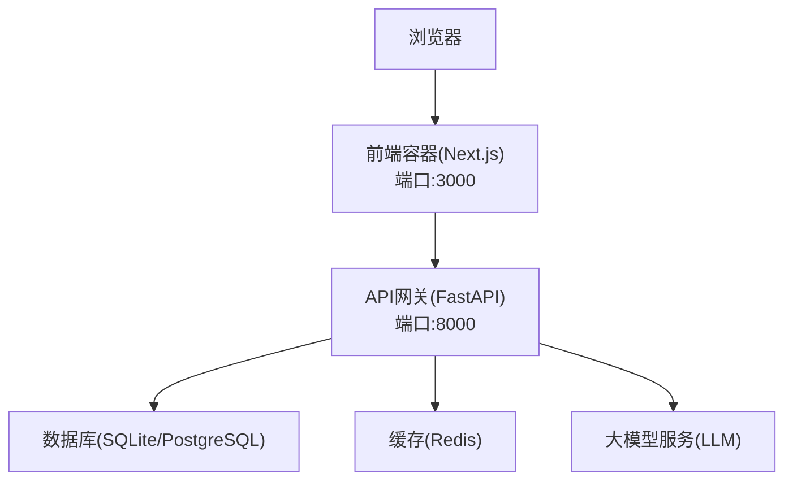
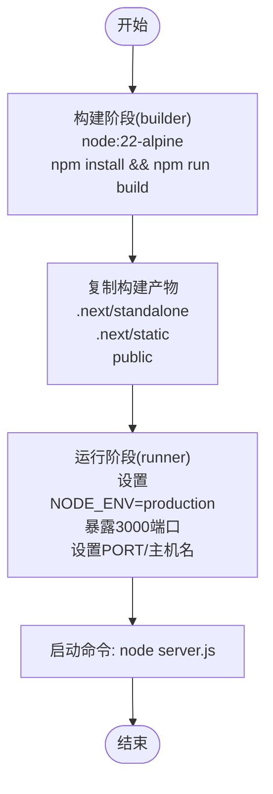
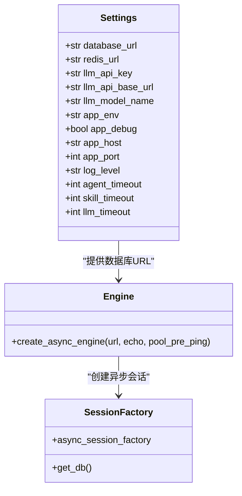
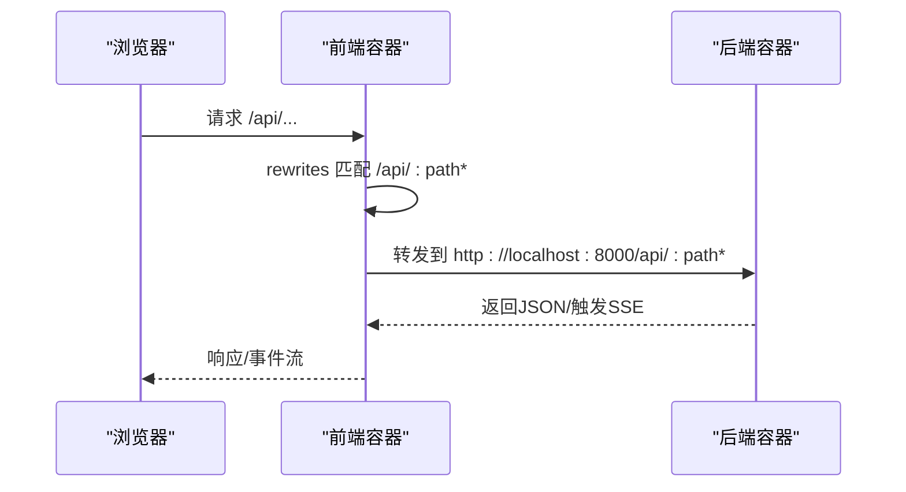
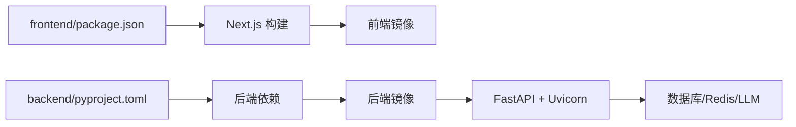

# Docker容器化部署

<cite>
**本文引用的文件**
- [Dockerfile](file://OpenClaw-bot-review-main/Dockerfile)
- [.dockerignore](file://OpenClaw-bot-review-main/.dockerignore)
- [package.json](file://frontend/package.json)
- [next.config.ts](file://frontend/next.config.ts)
- [pyproject.toml](file://backend/pyproject.toml)
- [config.py](file://backend/app/core/config.py)
- [main.py](file://backend/app/main.py)
- [alembic.ini](file://backend/alembic.ini)
- [session.py](file://backend/app/db/session.py)
- [tables.py](file://backend/app/models/tables.py)
- [ARCHITECTURE.md](file://ARCHITECTURE.md)
</cite>

## 目录
1. [简介](#简介)
2. [项目结构](#项目结构)
3. [核心组件](#核心组件)
4. [架构总览](#架构总览)
5. [详细组件分析](#详细组件分析)
6. [依赖关系分析](#依赖关系分析)
7. [性能考量](#性能考量)
8. [故障排查指南](#故障排查指南)
9. [结论](#结论)
10. [附录](#附录)

## 简介
本指南面向HotClaw项目的Docker容器化部署，围绕后端Python FastAPI服务与前端Next.js应用的独立容器化策略，系统阐述多阶段构建、镜像分层优化、依赖管理与安全加固、容器编排、健康检查、资源限制、重启策略、日志收集、卷挂载与环境变量传递等最佳实践，并提供完整的命令行示例与常见问题解决方案。

## 项目结构
HotClaw采用前后端分离架构：前端使用Next.js，后端使用FastAPI，二者通过API网关进行交互。容器化策略遵循“后端单容器、前端单容器”的独立部署思路，便于独立扩展与运维。

**图表来源**
- [Dockerfile:1-27](file://OpenClaw-bot-review-main/Dockerfile#L1-L27)
- [next.config.ts:1-15](file://frontend/next.config.ts#L1-L15)
- [package.json:1-23](file://frontend/package.json#L1-L23)
- [main.py:1-142](file://backend/app/main.py#L1-L142)
- [config.py:1-51](file://backend/app/core/config.py#L1-L51)
- [session.py:1-33](file://backend/app/db/session.py#L1-L33)
- [tables.py:1-233](file://backend/app/models/tables.py#L1-L233)
- [alembic.ini:1-39](file://backend/alembic.ini#L1-L39)
- [pyproject.toml:1-41](file://backend/pyproject.toml#L1-L41)

**章节来源**
- [ARCHITECTURE.md:39-78](file://ARCHITECTURE.md#L39-L78)
- [main.py:60-75](file://backend/app/main.py#L60-L75)
- [next.config.ts:1-15](file://frontend/next.config.ts#L1-L15)

## 核心组件
- 前端容器（Next.js）
  - 基于Node.js Alpine镜像的多阶段构建，生产阶段仅拷贝构建产物，减少镜像体积与攻击面。
  - 暴露3000端口，监听0.0.0.0，通过环境变量PORT与HOSTNAME控制。
- 后端容器（FastAPI）
  - 使用Python 3.11+环境，依赖通过pyproject.toml声明，生产使用Uvicorn标准变体。
  - 通过环境变量控制数据库连接、Redis连接、LLM配置、应用端口与调试级别。
  - 提供健康检查端点，便于容器编排使用。

**章节来源**
- [Dockerfile:1-27](file://OpenClaw-bot-review-main/Dockerfile#L1-L27)
- [config.py:7-51](file://backend/app/core/config.py#L7-L51)
- [pyproject.toml:1-41](file://backend/pyproject.toml#L1-L41)
- [main.py:139-142](file://backend/app/main.py#L139-L142)

## 架构总览
容器化部署采用双容器模型：前端容器提供静态页面与API代理，后端容器提供REST API与SSE事件流。前端通过Next.js的rewrites将/api前缀代理至后端服务。

**图表来源**
- [next.config.ts:4-11](file://frontend/next.config.ts#L4-L11)
- [config.py:8-31](file://backend/app/core/config.py#L8-L31)
- [main.py:60-75](file://backend/app/main.py#L60-L75)

## 详细组件分析

### 前端容器（Next.js）多阶段构建
- 构建阶段（builder）
  - 基于node:22-alpine，工作目录/app。
  - 复制项目文件，执行npm install与构建命令，生成standalone与static资源。
- 运行阶段（runner）
  - 基于node:22-alpine，设置NODE_ENV=production。
  - 仅拷贝构建产物（standalone、static、public），避免运行时依赖。
  - 暴露3000端口，设置PORT与HOSTNAME，CMD启动node server.js。

**图表来源**
- [Dockerfile:1-27](file://OpenClaw-bot-review-main/Dockerfile#L1-L27)

**章节来源**
- [Dockerfile:1-27](file://OpenClaw-bot-review-main/Dockerfile#L1-L27)
- [.dockerignore:1-11](file://OpenClaw-bot-review-main/.dockerignore#L1-L11)

### 后端容器（FastAPI）依赖与配置
- 依赖管理
  - Python 3.11+，核心依赖：FastAPI、Uvicorn[standard]、SQLAlchemy asyncio、asyncpg、alembic、pydantic、redis、httpx、structlog、pyyaml、sse-starlette、nanoid、litellm、aiosqlite。
- 配置加载
  - 通过pydantic-settings从.env文件加载配置，支持数据库URL、Redis URL、LLM API密钥与基础地址、模型名称、应用环境与端口、日志级别、各类超时等。
- 数据库会话
  - 异步引擎与会话工厂，SQLite开发模式禁用pool_pre_ping，生产模式启用。
- 模型定义
  - 定义任务、节点运行、账号画像、候选主题、文章草稿、审核结果、Agent/Skill/Workflow模板、系统日志等核心表。

**图表来源**
- [config.py:7-51](file://backend/app/core/config.py#L7-L51)
- [session.py:8-19](file://backend/app/db/session.py#L8-L19)
- [tables.py:23-233](file://backend/app/models/tables.py#L23-L233)

**章节来源**
- [pyproject.toml:6-22](file://backend/pyproject.toml#L6-L22)
- [config.py:7-51](file://backend/app/core/config.py#L7-L51)
- [session.py:1-33](file://backend/app/db/session.py#L1-L33)
- [tables.py:1-233](file://backend/app/models/tables.py#L1-L233)

### 健康检查与SSE支持
- 健康检查端点
  - 提供GET /api/v1/health，返回状态与版本信息，便于容器编排健康检查。
- SSE事件流
  - 后端通过sse-starlette支持Server-Sent Events，前端Next.js通过rewrites将/api前缀代理至后端，确保SSE连接正常建立。

**图表来源**
- [main.py:139-142](file://backend/app/main.py#L139-L142)
- [next.config.ts:4-11](file://frontend/next.config.ts#L4-L11)

**章节来源**
- [main.py:139-142](file://backend/app/main.py#L139-L142)
- [next.config.ts:1-15](file://frontend/next.config.ts#L1-L15)

## 依赖关系分析
- 前端依赖
  - Next.js、React、TypeScript、TailwindCSS等，构建脚本包含dev/build/start/lint。
- 后端依赖
  - FastAPI、Uvicorn、SQLAlchemy asyncio、asyncpg、alembic、pydantic、redis、httpx、structlog、pyyaml、sse-starlette、litellm、aiosqlite等。
- 数据库与迁移
  - alembic.ini配置SQLAlchemy URL，后端通过settings.database_url动态注入。

**图表来源**
- [package.json:5-10](file://frontend/package.json#L5-L10)
- [pyproject.toml:6-22](file://backend/pyproject.toml#L6-L22)
- [alembic.ini:3-5](file://backend/alembic.ini#L3-L5)

**章节来源**
- [package.json:1-23](file://frontend/package.json#L1-L23)
- [pyproject.toml:1-41](file://backend/pyproject.toml#L1-L41)
- [alembic.ini:1-39](file://backend/alembic.ini#L1-L39)

## 性能考量
- 镜像体积优化
  - 前端使用多阶段构建，仅复制构建产物，避免运行时依赖安装。
  - 后端使用Python 3.11+，依赖精简，生产使用Uvicorn标准变体。
- 启动与热身
  - 后端在lifespan中自动创建数据库表，开发模式下提升首次请求稳定性。
- 资源与并发
  - 建议在容器编排中为后端设置CPU/内存限制，前端根据流量弹性伸缩。

[本节为通用指导，无需特定文件引用]

## 故障排查指南
- 健康检查失败
  - 检查后端健康端点是否可达，确认应用端口与环境变量配置正确。
- 前后端联调失败
  - 确认Next.js rewrites已将/api前缀转发至后端服务，检查容器网络与端口映射。
- 数据库连接问题
  - 检查database_url配置，确认数据库服务可达；开发模式使用SQLite，生产模式使用PostgreSQL。
- 日志与追踪
  - 后端使用structlog与trace_id中间件，建议在容器编排中收集stdout/stderr日志并关联trace_id。

**章节来源**
- [main.py:139-142](file://backend/app/main.py#L139-L142)
- [next.config.ts:4-11](file://frontend/next.config.ts#L4-L11)
- [config.py:11-14](file://backend/app/core/config.py#L11-L14)
- [alembic.ini:5-5](file://backend/alembic.ini#L5-L5)

## 结论
通过前后端独立容器化与多阶段构建，HotClaw实现了轻量、可维护、可扩展的容器化部署方案。结合健康检查、SSE支持与合理的依赖管理，能够在生产环境中稳定运行并便于运维与扩展。

[本节为总结，无需特定文件引用]

## 附录

### 容器编排与网络通信
- 建议使用docker-compose定义两个服务：frontend与backend，并通过自定义网络互联。
- 前端服务暴露3000端口，后端服务暴露8000端口；通过Next.js rewrites将/api前缀转发至后端。
- 数据库与Redis建议作为独立服务或使用Compose中的外部服务，后端通过环境变量连接。

[本节为概念性说明，无需特定文件引用]

### 健康检查、资源限制与重启策略
- 健康检查
  - 后端提供/health端点，可在容器编排中配置健康检查探针。
- 资源限制
  - 建议为后端容器设置CPU/内存限制，前端根据实际流量弹性伸缩。
- 重启策略
  - 建议使用unless-stopped或on-failure策略，确保服务异常时自动恢复。

[本节为通用指导，无需特定文件引用]

### 日志收集、卷挂载与环境变量
- 日志收集
  - 建议将后端日志输出到stdout/stderr，配合容器编排的日志驱动集中收集。
- 卷挂载
  - 开发模式可挂载本地代码目录以支持热更新；生产模式建议使用只读根文件系统。
- 环境变量
  - 通过.env文件与容器编排的environment配置传递数据库、Redis、LLM等关键配置。

[本节为通用指导，无需特定文件引用]

### 完整命令行示例
- 构建镜像
  - docker build -t hotclaw-frontend -f OpenClaw-bot-review-main/Dockerfile .
  - docker build -t hotclaw-backend backend/
- 运行容器
  - docker run -d --name frontend -p 3000:3000 hotclaw-frontend
  - docker run -d --name backend -p 8000:8000 -e DATABASE_URL=... -e REDIS_URL=... hotclaw-backend
- 健康检查
  - curl http://localhost:8000/api/v1/health

[本节为通用指导，无需特定文件引用]