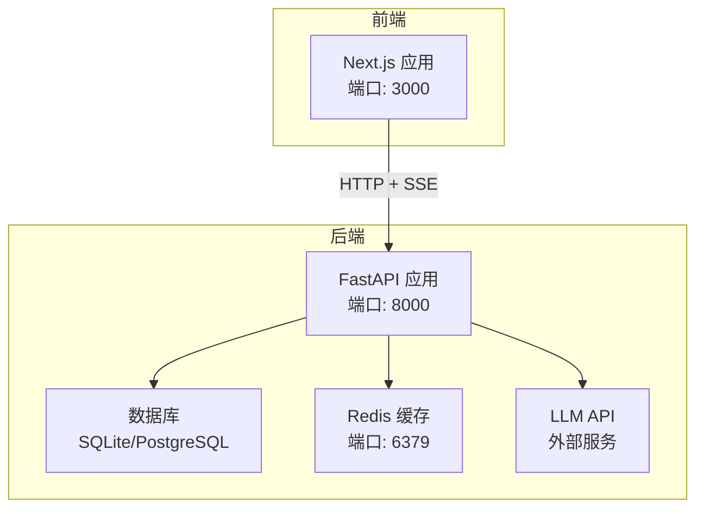
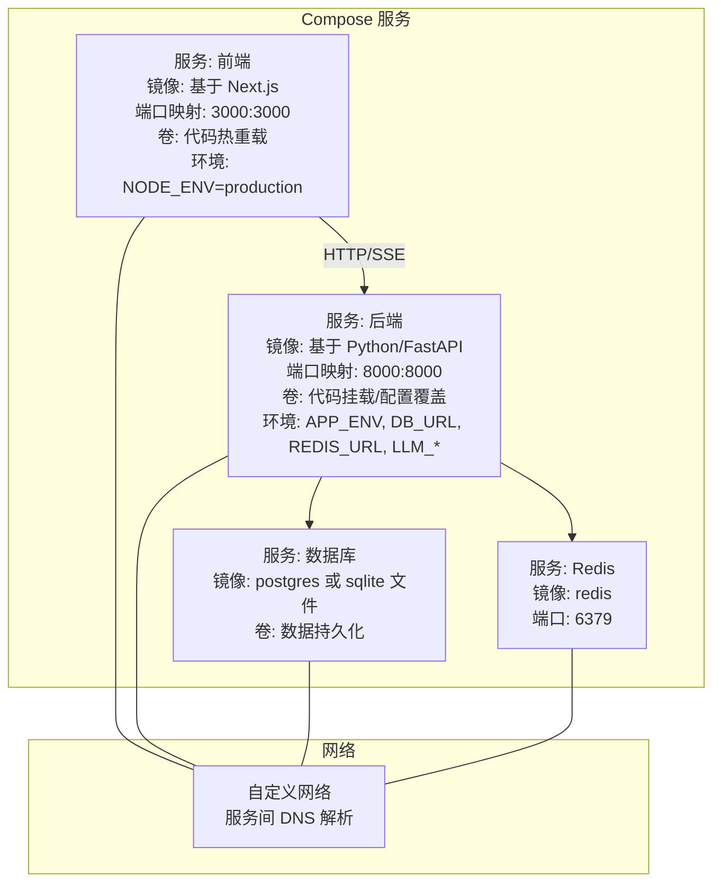
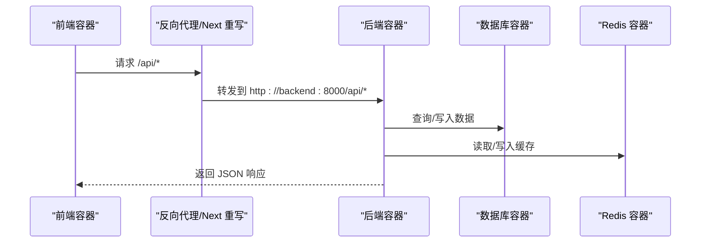
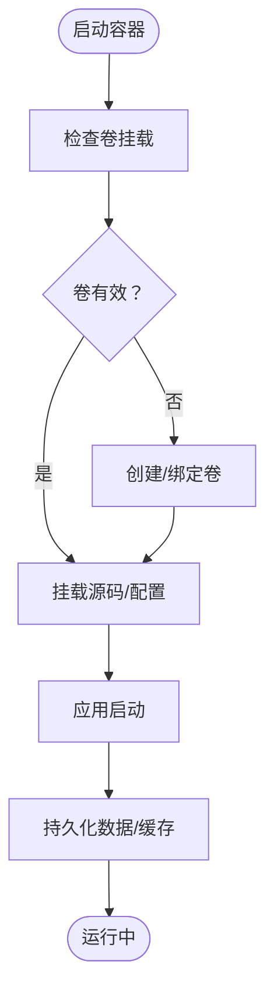
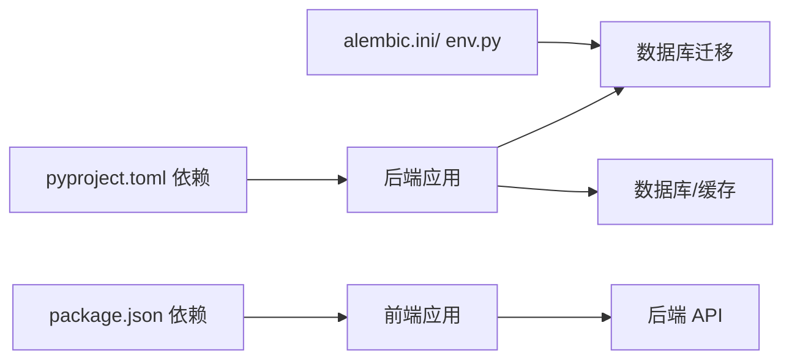

# Docker Compose编排

<cite>
**本文引用的文件**
- [ARCHITECTURE.md](file://ARCHITECTURE.md)
- [backend/pyproject.toml](file://backend/pyproject.toml)
- [backend/app/main.py](file://backend/app/main.py)
- [backend/app/core/config.py](file://backend/app/core/config.py)
- [backend/app/api/task_routes.py](file://backend/app/api/task_routes.py)
- [backend/alembic/env.py](file://backend/alembic/env.py)
- [backend/alembic.ini](file://backend/alembic.ini)
- [frontend/next.config.ts](file://frontend/next.config.ts)
- [frontend/package.json](file://frontend/package.json)
- [frontend/lib/api.ts](file://frontend/lib/api.ts)
- [OpenClaw-bot-review-main/Dockerfile](file://OpenClaw-bot-review-main/Dockerfile)
- [OpenClaw-bot-review-main/.dockerignore](file://OpenClaw-bot-review-main/.dockerignore)
</cite>

## 目录
1. [引言](#引言)
2. [项目结构](#项目结构)
3. [核心组件](#核心组件)
4. [架构总览](#架构总览)
5. [详细组件分析](#详细组件分析)
6. [依赖分析](#依赖分析)
7. [性能考量](#性能考量)
8. [故障排除指南](#故障排除指南)
9. [结论](#结论)
10. [附录](#附录)

## 引言
本指南围绕 HotClaw 多智能体内容生产平台的 Docker Compose 编排实践展开，目标是帮助读者快速理解如何通过 docker-compose.yml 定义服务、组织服务间依赖与启动顺序、配置网络与容器通信、挂载卷实现数据持久化与热重载、管理环境变量与配置覆盖、实现服务扩缩容与负载均衡、设置健康检查与自动重启策略，并提供常见问题的故障排除建议。本文结合仓库中的后端 FastAPI、前端 Next.js、数据库迁移脚本与 Dockerfile 等实际文件，给出可落地的编排思路与最佳实践。

## 项目结构
HotClaw 采用前后端分离架构：前端为 Next.js 应用，后端为 FastAPI 应用，二者通过统一的 API 网关层进行交互；底层基础设施包括 SQLite（开发）与 PostgreSQL（生产）、Redis 缓存、LLM API 等。整体系统边界与最小闭环见架构文档。

**图表来源**
- [ARCHITECTURE.md](file://ARCHITECTURE.md)
- [backend/app/main.py](file://backend/app/main.py)
- [backend/app/core/config.py](file://backend/app/core/config.py)
- [frontend/next.config.ts](file://frontend/next.config.ts)

**章节来源**
- [ARCHITECTURE.md](file://ARCHITECTURE.md)
- [frontend/next.config.ts](file://frontend/next.config.ts)
- [backend/app/main.py](file://backend/app/main.py)

## 核心组件
- 前端 Next.js 应用：提供任务创建、运行监控、结果预览、配置管理与历史任务等功能，开发时通过本地端口 3000 提供服务。
- 后端 FastAPI 应用：统一入口、参数校验、SSE 事件推送、任务生命周期管理与工作流编排，开发时监听 0.0.0.0:8000。
- 数据库：开发模式使用 SQLite，生产模式使用 PostgreSQL；迁移脚本通过 Alembic 驱动。
- 缓存：Redis 用于会话、状态与临时数据缓存。
- LLM：通过配置项指定 API Key、Base URL 与默认模型名，支持多模型统一调用。

**章节来源**
- [frontend/package.json](file://frontend/package.json)
- [backend/pyproject.toml](file://backend/pyproject.toml)
- [backend/app/core/config.py](file://backend/app/core/config.py)
- [backend/alembic/env.py](file://backend/alembic/env.py)
- [backend/alembic.ini](file://backend/alembic.ini)

## 架构总览
下图展示服务定义、网络与通信、卷挂载与环境变量的关键要素，以及健康检查与重启策略的配置要点。

**图表来源**
- [backend/app/core/config.py](file://backend/app/core/config.py)
- [backend/app/main.py](file://backend/app/main.py)
- [frontend/next.config.ts](file://frontend/next.config.ts)
- [OpenClaw-bot-review-main/Dockerfile](file://OpenClaw-bot-review-main/Dockerfile)

## 详细组件分析

### 服务定义与启动顺序
- 前端服务：基于 Node.js 镜像构建，生产阶段使用 .next/standalone 输出，暴露 3000 端口，通过环境变量控制主机与端口。
- 后端服务：基于 Python 镜像运行，监听 0.0.0.0:8000，依赖数据库与缓存服务；启动时自动创建数据库表（开发模式）。
- 数据库服务：使用 PostgreSQL 镜像，配合 Alembic 进行迁移；开发模式也可使用 SQLite 文件。
- 缓存服务：使用官方 Redis 镜像，提供键值缓存能力。

启动顺序建议：
1) 先启动数据库与缓存；
2) 再启动后端服务，等待数据库与缓存就绪；
3) 最后启动前端服务，确保其能访问后端 API。

**章节来源**
- [OpenClaw-bot-review-main/Dockerfile](file://OpenClaw-bot-review-main/Dockerfile)
- [backend/app/main.py](file://backend/app/main.py)
- [backend/alembic/env.py](file://backend/alembic/env.py)
- [backend/alembic.ini](file://backend/alembic.ini)

### 网络配置与容器通信
- 自定义网络：建议为所有服务创建统一的自定义网络，启用 DNS 解析，便于通过服务名互相访问。
- 前后端通信：前端通过 /api/* 代理转发至后端 8000 端口；后端通过配置项连接数据库与缓存。
- 服务发现：在自定义网络内，后端可通过服务名访问数据库与缓存，无需硬编码 IP。

**图表来源**
- [frontend/next.config.ts](file://frontend/next.config.ts)
- [backend/app/main.py](file://backend/app/main.py)
- [backend/app/core/config.py](file://backend/app/core/config.py)

**章节来源**
- [frontend/next.config.ts](file://frontend/next.config.ts)
- [backend/app/core/config.py](file://backend/app/core/config.py)

### 卷挂载与持久化
- 数据持久化：数据库使用卷挂载，确保容器重建后数据不丢失；开发模式可使用 SQLite 文件卷。
- 代码热重载：前端开发时挂载源码目录，实现本地修改即时生效；后端开发时同样可挂载源码目录以支持热重载。
- 配置文件挂载：通过挂载 .env 或配置文件，实现不同环境下的配置覆盖。

**图表来源**
- [backend/app/core/config.py](file://backend/app/core/config.py)
- [backend/alembic/env.py](file://backend/alembic/env.py)

**章节来源**
- [backend/app/core/config.py](file://backend/app/core/config.py)
- [backend/alembic/env.py](file://backend/alembic/env.py)

### 环境变量与配置覆盖
- 后端配置：通过 Settings 类从 .env 文件加载数据库、Redis、LLM、应用运行参数等；支持开发与生产环境切换。
- 前端配置：通过 Next.js 重写规则将 /api/* 转发到后端地址，开发时可指向本地后端。
- 配置覆盖：在 docker-compose.yml 中通过 environment 或 env_file 覆盖默认值，满足不同环境需求。

**章节来源**
- [backend/app/core/config.py](file://backend/app/core/config.py)
- [frontend/next.config.ts](file://frontend/next.config.ts)

### 服务扩缩容与负载均衡
- 扩缩容：对后端服务使用 replicas 实现水平扩展；前端服务通常单实例即可，必要时可启用副本。
- 负载均衡：在反向代理层（如 Nginx 或 Compose 的 external_links/网络）集中转发请求，避免直接暴露多个后端实例。
- 会话与缓存：使用 Redis 存储会话与状态，确保多副本后端的一致性。

**章节来源**
- [backend/app/main.py](file://backend/app/main.py)
- [backend/app/core/config.py](file://backend/app/core/config.py)

### 健康检查与自动重启
- 健康检查：对数据库与缓存添加健康检查，确保后端服务启动前依赖已就绪。
- 重启策略：对后端服务设置 unless-stopped 或 on-failure，避免因偶发错误导致长时间不可用。
- 前端健康：可增加简单的 HTTP 健康检查端点，便于编排层判断服务可用性。

**章节来源**
- [backend/app/main.py](file://backend/app/main.py)
- [backend/app/api/task_routes.py](file://backend/app/api/task_routes.py)

## 依赖分析
- 后端依赖：FastAPI、Uvicorn、SQLAlchemy、Alembic、Redis、HTTPX、Structlog、Pydantic、LiteLLM、Aiosqlite 等。
- 前端依赖：Next.js、React、TailwindCSS、TypeScript 等。
- 数据库迁移：Alembic 通过 env.py 读取配置，支持离线与在线迁移。

**图表来源**
- [backend/pyproject.toml](file://backend/pyproject.toml)
- [frontend/package.json](file://frontend/package.json)
- [backend/alembic/env.py](file://backend/alembic/env.py)
- [backend/alembic.ini](file://backend/alembic.ini)

**章节来源**
- [backend/pyproject.toml](file://backend/pyproject.toml)
- [frontend/package.json](file://frontend/package.json)
- [backend/alembic/env.py](file://backend/alembic/env.py)
- [backend/alembic.ini](file://backend/alembic.ini)

## 性能考量
- 数据库连接池与异步：后端使用 SQLAlchemy 异步与连接池，减少阻塞；合理设置超时与并发。
- 缓存命中率：利用 Redis 缓存热点数据与中间结果，降低数据库压力。
- SSE 推送：前端通过 SSE 实时接收节点状态，注意连接数与消息频率控制。
- 镜像与构建：前端使用多阶段构建，减小镜像体积；后端使用精简基础镜像，缩短启动时间。

## 故障排除指南
- 服务启动失败
  - 检查依赖服务是否就绪（数据库、缓存）；确认健康检查通过。
  - 查看后端日志，确认端口占用与权限问题。
- 网络连接问题
  - 确认服务在同一自定义网络；使用服务名而非 IP；检查 DNS 解析。
  - 核对端口映射与防火墙设置。
- 资源冲突
  - 端口冲突：调整映射端口或停止占用进程。
  - 卷权限：确保宿主机目录权限正确，避免容器内无法写入。
- 配置错误
  - 检查 .env 文件与环境变量覆盖是否正确；确认数据库 URL、Redis URL、LLM 凭据。
- 前后端联调
  - 确认前端重写规则将 /api/* 转发到后端；检查跨域设置与代理配置。

**章节来源**
- [backend/app/main.py](file://backend/app/main.py)
- [frontend/next.config.ts](file://frontend/next.config.ts)
- [backend/app/core/config.py](file://backend/app/core/config.py)

## 结论
通过合理的服务定义、网络与卷配置、环境变量覆盖、健康检查与重启策略，HotClaw 可在 Docker Compose 下实现稳定、可扩展且易于维护的编排方案。结合本文提供的架构图、流程图与最佳实践，读者可快速搭建开发与生产环境，并在出现问题时高效定位与解决。

## 附录
- 前端 Dockerfile 示例要点：多阶段构建、复制 .next/standalone、暴露 3000 端口、设置 NODE_ENV。
- 前端 .dockerignore：忽略 node_modules、.next、日志与文档等无关文件。
- 后端配置要点：数据库 URL、Redis URL、LLM API Key/Base URL、应用运行参数与超时设置。
- 数据库迁移：Alembic 通过 env.py 读取 settings.database_url，支持离线与在线迁移。

**章节来源**
- [OpenClaw-bot-review-main/Dockerfile](file://OpenClaw-bot-review-main/Dockerfile)
- [OpenClaw-bot-review-main/.dockerignore](file://OpenClaw-bot-review-main/.dockerignore)
- [backend/app/core/config.py](file://backend/app/core/config.py)
- [backend/alembic/env.py](file://backend/alembic/env.py)
- [backend/alembic.ini](file://backend/alembic.ini)