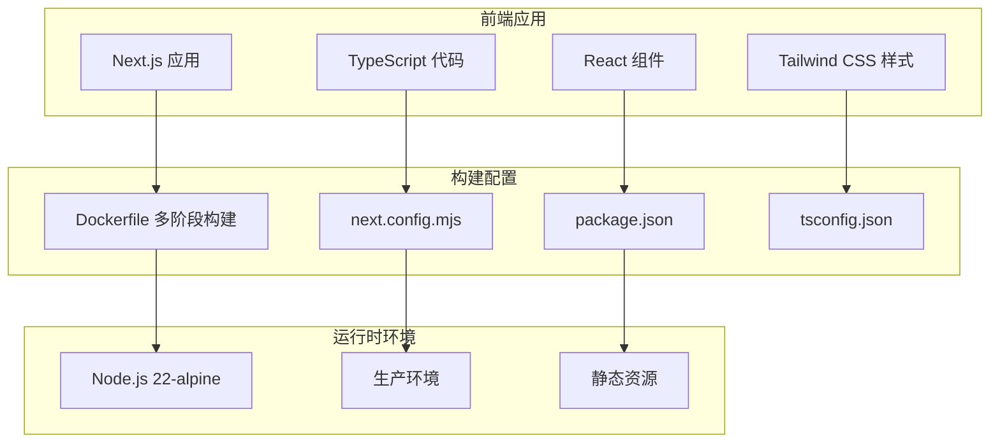
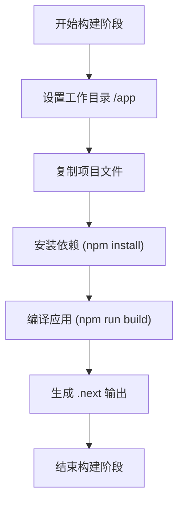
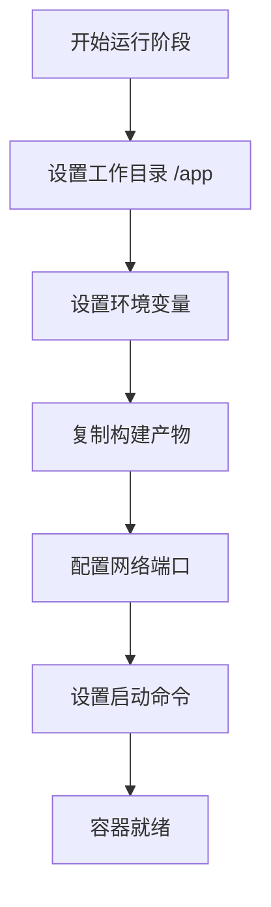
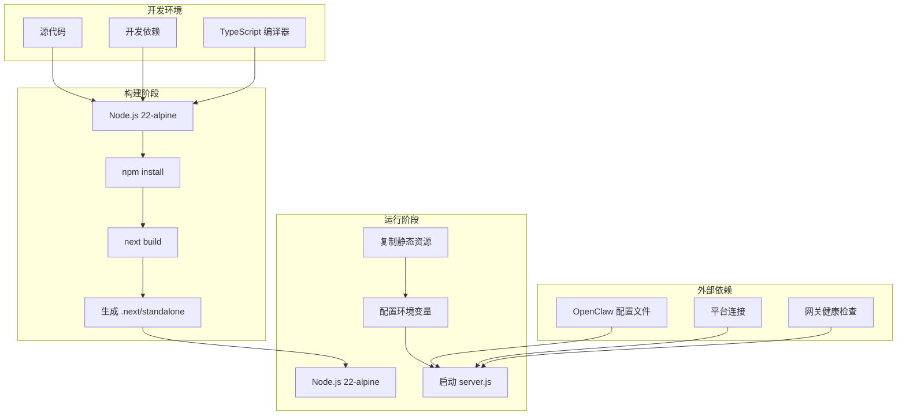
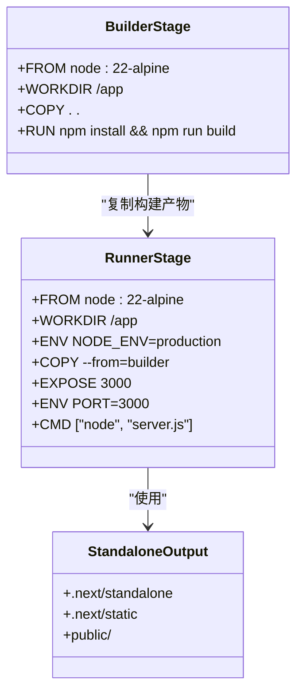
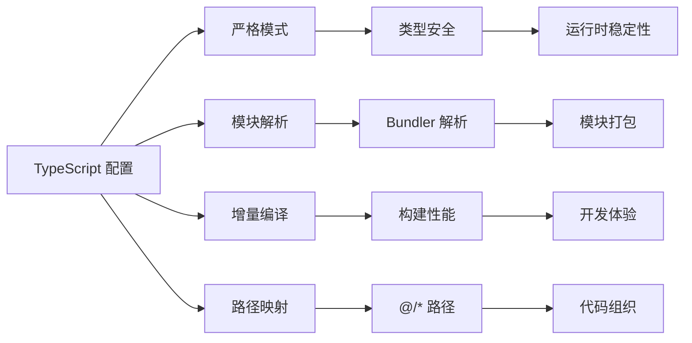
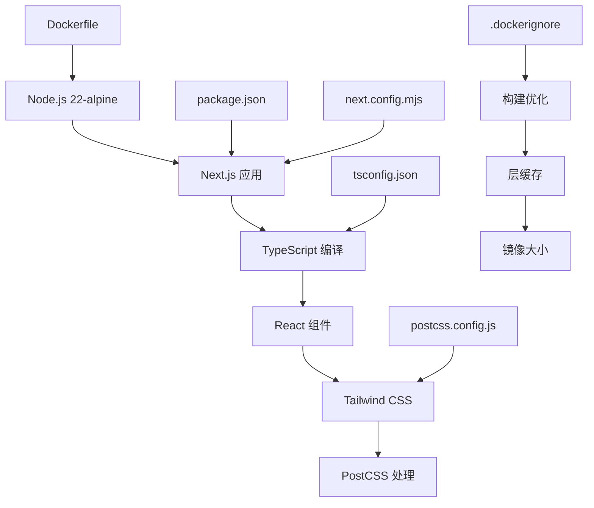
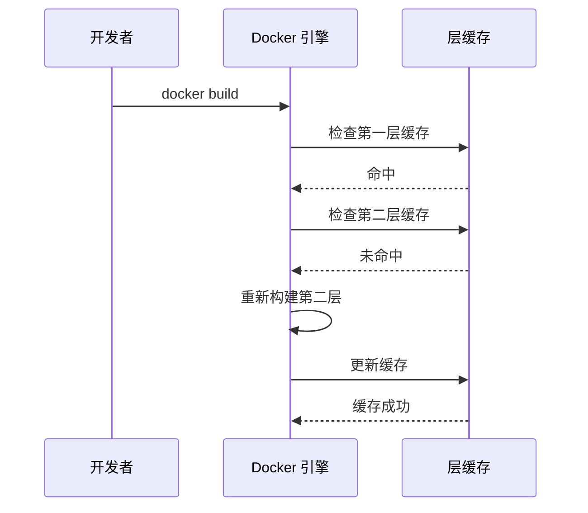

# Docker镜像构建

<cite>
**本文档引用的文件**
- [Dockerfile](file://OpenClaw-bot-review-main/Dockerfile)
- [.dockerignore](file://OpenClaw-bot-review-main/.dockerignore)
- [package.json](file://OpenClaw-bot-review-main/package.json)
- [next.config.mjs](file://OpenClaw-bot-review-main/next.config.mjs)
- [README.md](file://OpenClaw-bot-review-main/README.md)
- [quick_start.md](file://OpenClaw-bot-review-main/quick_start.md)
- [tsconfig.json](file://OpenClaw-bot-review-main/tsconfig.json)
- [postcss.config.js](file://OpenClaw-bot-review-main/postcss.config.js)
</cite>

## 目录
1. [简介](#简介)
2. [项目结构](#项目结构)
3. [核心组件](#核心组件)
4. [架构概览](#架构概览)
5. [详细组件分析](#详细组件分析)
6. [依赖关系分析](#依赖关系分析)
7. [性能考虑](#性能考虑)
8. [故障排除指南](#故障排除指南)
9. [结论](#结论)

## 简介

本文档提供了OpenClaw Bot Review仪表盘项目的Docker镜像构建完整指南。该项目是一个基于Next.js 16和TypeScript的轻量级Web仪表盘，用于监控和管理OpenClaw机器人代理的状态。文档详细解释了多阶段Docker构建策略、Node.js 22-alpine基础镜像的选择原因、构建过程中的依赖安装和代码编译流程，以及.standalone输出的生成机制和性能优化效果。

## 项目结构

OpenClaw Bot Review项目采用前后端分离的架构设计，主要包含以下关键组件：

**图表来源**
- [Dockerfile:1-27](file://OpenClaw-bot-review-main/Dockerfile#L1-L27)
- [next.config.mjs:1-6](file://OpenClaw-bot-review-main/next.config.mjs#L1-L6)
- [package.json:1-23](file://OpenClaw-bot-review-main/package.json#L1-L23)

**章节来源**
- [Dockerfile:1-27](file://OpenClaw-bot-review-main/Dockerfile#L1-L27)
- [README.md:1-176](file://OpenClaw-bot-review-main/README.md#L1-L176)

## 核心组件

### 多阶段构建策略

项目采用了标准的Docker多阶段构建策略，将构建过程分为两个独立的阶段：

1. **构建阶段 (builder)**：使用完整的Node.js环境进行依赖安装和代码编译
2. **运行阶段 (runner)**：使用精简的Node.js 22-alpine镜像作为最终运行环境

这种策略的主要优势包括：
- 减少最终镜像大小
- 提高安全性（移除开发工具和依赖）
- 改善构建性能

**章节来源**
- [Dockerfile:1-27](file://OpenClaw-bot-review-main/Dockerfile#L1-L27)

### Node.js 22-alpine基础镜像选择

选择Node.js 22-alpine作为基础镜像的原因和优势：

#### 选择原因
- **版本稳定性**：Node.js 22提供长期支持，确保应用的稳定性和安全性
- **体积优势**：Alpine Linux基于musl libc和最小化软件包，显著减少镜像大小
- **安全性**：定期更新的安全补丁和较小的攻击面

#### 优势分析
- **镜像大小**：相比官方Node镜像，Alpine版本通常减少50%以上的体积
- **启动速度**：更小的基础镜像意味着更快的容器启动时间
- **维护成本**：更少的系统包意味着更少的维护工作

**章节来源**
- [Dockerfile:2](file://OpenClaw-bot-review-main/Dockerfile#L2)
- [Dockerfile:10](file://OpenClaw-bot-review-main/Dockerfile#L10)

### 构建过程详解

#### 第一阶段：构建阶段

**图表来源**
- [Dockerfile:4-7](file://OpenClaw-bot-review-main/Dockerfile#L4-L7)

#### 第二阶段：运行阶段

**图表来源**
- [Dockerfile:12-26](file://OpenClaw-bot-review-main/Dockerfile#L12-L26)

**章节来源**
- [Dockerfile:1-27](file://OpenClaw-bot-review-main/Dockerfile#L1-L27)

## 架构概览

### 整体架构设计

**图表来源**
- [Dockerfile:1-27](file://OpenClaw-bot-review-main/Dockerfile#L1-L27)
- [next.config.mjs:3](file://OpenClaw-bot-review-main/next.config.mjs#L3)

### .standalone输出机制

项目使用Next.js的.standalone输出模式，这是现代Next.js应用部署的关键特性：

#### 生成机制
- **独立运行时**：生成包含完整运行时的独立构建
- **预编译代码**：将TypeScript和JSX代码预编译为JavaScript
- **静态资源优化**：分离静态资源以便高效缓存

#### 性能优化效果
- **启动时间**：减少冷启动时间，因为不需要运行时编译
- **内存占用**：优化的运行时内存使用
- **并发处理**：改进的并发请求处理能力

**章节来源**
- [next.config.mjs:1-6](file://OpenClaw-bot-review-main/next.config.mjs#L1-L6)
- [Dockerfile:17-18](file://OpenClaw-bot-review-main/Dockerfile#L17-L18)

## 详细组件分析

### Dockerfile详细解析

#### 构建阶段配置

**图表来源**
- [Dockerfile:1-27](file://OpenClaw-bot-review-main/Dockerfile#L1-L27)

#### 关键配置项分析

**工作目录配置**
- 使用 `/app` 作为工作目录，提供清晰的文件组织结构
- 便于容器内文件管理和权限控制

**环境变量设置**
- `NODE_ENV=production`：启用生产环境优化
- `PORT=3000`：设置应用监听端口
- `HOSTNAME="0.0.0.0"`：允许外部访问容器

**端口暴露**
- 暴露80端口用于HTTP访问
- 支持容器编排工具的健康检查

**章节来源**
- [Dockerfile:4](file://OpenClaw-bot-review-main/Dockerfile#L4)
- [Dockerfile:14](file://OpenClaw-bot-review-main/Dockerfile#L14)
- [Dockerfile:23-24](file://OpenClaw-bot-review-main/Dockerfile#L23-L24)

### 依赖管理策略

#### package.json配置分析
项目使用现代化的依赖管理策略：

**核心依赖**
- `next`: ^16.0.0 - 主框架
- `react`: ^19.0.0 - 用户界面库
- `react-dom`: ^19.0.0 - DOM渲染
- `typescript`: ^5.0.0 - 类型安全

**开发工具**
- `@types/node`: ^22.0.0 - Node.js类型定义
- `@types/react`: ^19.0.0 - React类型定义
- `tailwindcss`: ^4.0.0 - CSS框架
- `postcss`: ^8.0.0 - CSS处理器

**构建脚本**
- `dev`: 启动开发服务器
- `build`: 生成生产构建
- `start`: 启动生产服务器

**章节来源**
- [package.json:1-23](file://OpenClaw-bot-review-main/package.json#L1-L23)

### TypeScript配置优化

#### tsconfig.json特性

**图表来源**
- [tsconfig.json:1-42](file://OpenClaw-bot-review-main/tsconfig.json#L1-L42)

**章节来源**
- [tsconfig.json:1-42](file://OpenClaw-bot-review-main/tsconfig.json#L1-L42)

## 依赖关系分析

### 构建依赖链

**图表来源**
- [Dockerfile:1-27](file://OpenClaw-bot-review-main/Dockerfile#L1-L27)
- [package.json:1-23](file://OpenClaw-bot-review-main/package.json#L1-L23)
- [next.config.mjs:1-6](file://OpenClaw-bot-review-main/next.config.mjs#L1-L6)

### 运行时依赖关系

#### 生产环境依赖
- **必需依赖**：Next.js运行时、React运行时、Node.js核心模块
- **可选依赖**：开发工具和构建时依赖被排除
- **静态资源**：CSS、JavaScript、图片等静态文件

#### 依赖优化策略
- **分层缓存**：利用Docker层缓存机制
- **最小化原则**：仅包含运行所需的文件
- **版本锁定**：固定依赖版本确保一致性

**章节来源**
- [Dockerfile:17-19](file://OpenClaw-bot-review-main/Dockerfile#L17-L19)
- [.dockerignore:1-11](file://OpenClaw-bot-review-main/.dockerignore#L1-L11)

## 性能考虑

### 镜像优化技术

#### 层缓存利用

**图表来源**
- [Dockerfile:6](file://OpenClaw-bot-review-main/Dockerfile#L6)

#### 镜像大小控制
- **Alpine基础镜像**：减少约50%的镜像大小
- **按需复制**：只复制必要的构建产物
- **清理策略**：避免复制node_modules和临时文件

#### 安全扫描优化
- **最小权限**：使用非root用户运行
- **定期更新**：保持基础镜像最新
- **依赖审计**：定期检查依赖漏洞

### 构建性能优化

#### 并行构建
- **多阶段并行**：构建阶段和运行阶段可以并行处理
- **依赖缓存**：利用npm/yarn缓存机制
- **增量构建**：支持部分文件变更的增量编译

#### 内存使用优化
- **运行时优化**：.standalone模式减少内存占用
- **垃圾回收**：合理配置Node.js垃圾回收参数
- **并发限制**：根据容器资源限制并发请求

## 故障排除指南

### 常见构建错误及解决方案

#### 1. 依赖安装失败
**问题症状**：
- 构建过程中出现npm install错误
- 网络超时或包下载失败

**解决方案**：
- 检查网络连接和代理设置
- 清理npm缓存：`npm cache clean --force`
- 使用npm ci替代npm install进行确定性安装

**章节来源**
- [Dockerfile:7](file://OpenClaw-bot-review-main/Dockerfile#L7)

#### 2. TypeScript编译错误
**问题症状**：
- 构建时出现类型检查错误
- 编译失败但没有明确错误信息

**解决方案**：
- 检查tsconfig.json配置
- 确保所有依赖都有正确的类型定义
- 使用--noEmit选项进行类型检查

**章节来源**
- [tsconfig.json:10](file://OpenClaw-bot-review-main/tsconfig.json#L10)

#### 3. .standalone输出缺失
**问题症状**：
- 运行阶段找不到server.js
- 应用无法启动

**解决方案**：
- 确认next.config.mjs中output设置为'standalone'
- 检查构建输出目录结构
- 验证构建命令是否正确执行

**章节来源**
- [next.config.mjs:3](file://OpenClaw-bot-review-main/next.config.mjs#L3)
- [Dockerfile:17](file://OpenClaw-bot-review-main/Dockerfile#L17)

#### 4. 端口冲突
**问题症状**：
- 容器启动后立即退出
- 端口绑定失败

**解决方案**：
- 检查宿主机端口占用情况
- 修改容器端口映射
- 确认EXPOSE指令与ENV变量一致

**章节来源**
- [Dockerfile:21](file://OpenClaw-bot-review-main/Dockerfile#L21)
- [Dockerfile:23](file://OpenClaw-bot-review-main/Dockerfile#L23)

### 运行时问题诊断

#### 1. 内存不足
**诊断方法**：
- 监控容器内存使用情况
- 检查Node.js堆内存使用
- 分析静态资源大小

**解决方案**：
- 优化静态资源加载
- 调整Node.js内存限制
- 使用CDN托管静态资源

#### 2. 启动缓慢
**诊断方法**：
- 分析启动时间各个阶段
- 检查依赖加载顺序
- 监控网络请求

**解决方案**：
- 启用懒加载和代码分割
- 优化第三方库加载
- 使用服务端渲染优化首屏加载

#### 3. 环境变量配置
**问题症状**：
- 应用无法找到OpenClaw配置
- 平台连接失败

**解决方案**：
- 确认OPENCLAW_HOME环境变量设置
- 检查卷挂载路径
- 验证配置文件权限

**章节来源**
- [README.md:78-96](file://OpenClaw-bot-review-main/README.md#L78-L96)

## 结论

OpenClaw Bot Review项目的Docker镜像构建方案体现了现代容器化应用的最佳实践。通过采用多阶段构建策略、选择Node.js 22-alpine基础镜像、利用.standalone输出模式，项目实现了：

1. **高效的构建流程**：通过分层缓存和增量构建提升构建速度
2. **优化的运行时性能**：.standalone模式减少启动时间和内存占用
3. **精简的镜像大小**：Alpine基础镜像显著降低镜像体积
4. **增强的安全性**：最小化运行时环境减少攻击面

该构建方案为类似Next.js应用的容器化部署提供了优秀的参考模板，涵盖了从基础镜像选择到运行时优化的完整最佳实践。