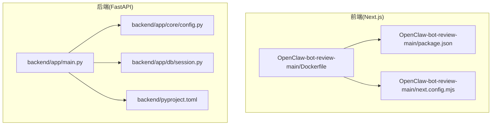
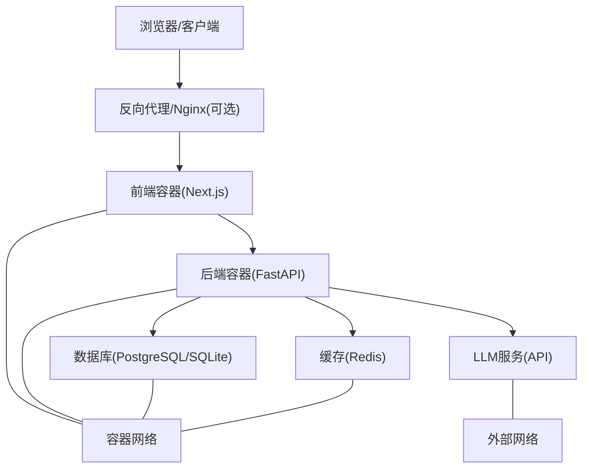
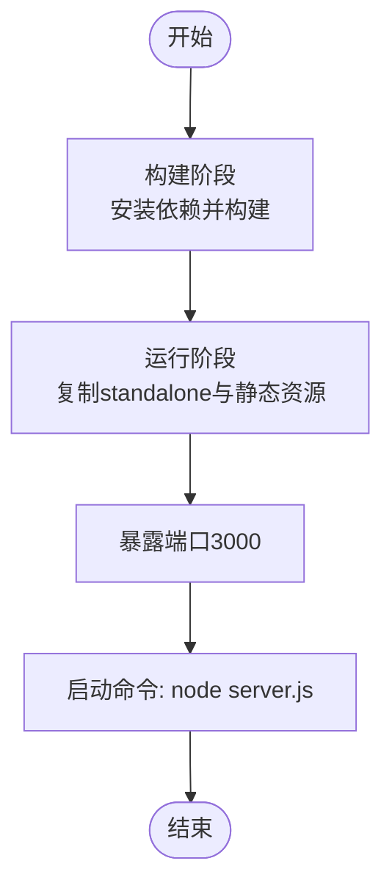
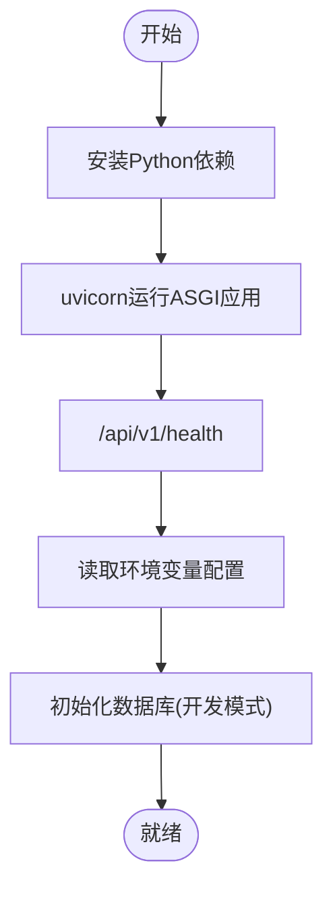
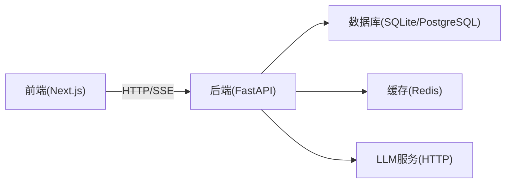

# 容器化部署

<cite>
**本文引用的文件**
- [Dockerfile](file://OpenClaw-bot-review-main/Dockerfile)
- [.dockerignore](file://OpenClaw-bot-review-main/.dockerignore)
- [next.config.mjs](file://OpenClaw-bot-review-main/next.config.mjs)
- [package.json](file://OpenClaw-bot-review-main/package.json)
- [ARCHITECTURE.md](file://ARCHITECTURE.md)
- [main.py](file://backend/app/main.py)
- [config.py](file://backend/app/core/config.py)
- [session.py](file://backend/app/db/session.py)
- [pyproject.toml](file://backend/pyproject.toml)
- [init_db.py](file://scripts/init_db.py)
</cite>

## 目录
1. [简介](#简介)
2. [项目结构](#项目结构)
3. [核心组件](#核心组件)
4. [架构总览](#架构总览)
5. [详细组件分析](#详细组件分析)
6. [依赖分析](#依赖分析)
7. [性能考量](#性能考量)
8. [故障排除指南](#故障排除指南)
9. [结论](#结论)
10. [附录](#附录)

## 简介
本指南面向HotClaw项目的容器化部署，覆盖以下关键主题：
- Docker镜像构建：基于多阶段构建的优化策略与最佳实践
- docker-compose编排：服务定义、网络与卷挂载
- 容器间通信：服务发现、网络隔离与端口映射
- 生命周期管理：启动顺序、健康检查与自动重启
- 监控与日志：资源限制与日志聚合
- 安全最佳实践：非root运行、只读文件系统与最小权限
- 故障排除：常见启动失败与网络问题的排查步骤

## 项目结构
HotClaw采用前后端分离架构，后端为Python/FastAPI应用，前端为Next.js应用。容器化部署建议将前后端分别打包为独立镜像，并通过docker-compose进行编排。

图表来源
- [Dockerfile:1-27](file://OpenClaw-bot-review-main/Dockerfile#L1-L27)
- [package.json:1-23](file://OpenClaw-bot-review-main/package.json#L1-L23)
- [next.config.mjs:1-6](file://OpenClaw-bot-review-main/next.config.mjs#L1-L6)
- [main.py:1-142](file://backend/app/main.py#L1-L142)
- [config.py:1-51](file://backend/app/core/config.py#L1-L51)
- [session.py:1-33](file://backend/app/db/session.py#L1-L33)
- [pyproject.toml:1-41](file://backend/pyproject.toml#L1-L41)

章节来源
- [ARCHITECTURE.md:1-200](file://ARCHITECTURE.md#L1-L200)
- [Dockerfile:1-27](file://OpenClaw-bot-review-main/Dockerfile#L1-L27)
- [package.json:1-23](file://OpenClaw-bot-review-main/package.json#L1-L23)
- [next.config.mjs:1-6](file://OpenClaw-bot-review-main/next.config.mjs#L1-L6)
- [main.py:1-142](file://backend/app/main.py#L1-L142)
- [config.py:1-51](file://backend/app/core/config.py#L1-L51)
- [session.py:1-33](file://backend/app/db/session.py#L1-L33)
- [pyproject.toml:1-41](file://backend/pyproject.toml#L1-L41)

## 核心组件
- 前端镜像（Next.js）
  - 基于多阶段构建，第一阶段安装依赖并构建静态产物，第二阶段仅运行时依赖，减少镜像体积与攻击面
  - 端口暴露与运行命令遵循Next.js“standalone”输出规范
- 后端镜像（FastAPI）
  - 基于Python 3.11+，使用uvicorn运行ASGI应用
  - 通过环境变量配置数据库、Redis、LLM等外部依赖
- 数据库与缓存
  - 开发环境默认SQLite，生产环境推荐PostgreSQL + Redis
- 工作流与SSE
  - 后端提供SSE端点用于前端实时状态订阅，需确保反向代理或负载均衡支持长连接

章节来源
- [Dockerfile:1-27](file://OpenClaw-bot-review-main/Dockerfile#L1-L27)
- [next.config.mjs:1-6](file://OpenClaw-bot-review-main/next.config.mjs#L1-L6)
- [main.py:139-142](file://backend/app/main.py#L139-L142)
- [config.py:7-47](file://backend/app/core/config.py#L7-L47)
- [session.py:1-33](file://backend/app/db/session.py#L1-L33)
- [pyproject.toml:1-41](file://backend/pyproject.toml#L1-L41)

## 架构总览
下图展示容器化部署下的系统交互：前端容器通过反向代理访问后端容器，后端容器访问数据库与缓存，LLM服务通过API密钥与基础URL配置访问。

图表来源
- [main.py:60-84](file://backend/app/main.py#L60-L84)
- [config.py:8-31](file://backend/app/core/config.py#L8-L31)
- [session.py:6-13](file://backend/app/db/session.py#L6-L13)
- [pyproject.toml:6-22](file://backend/pyproject.toml#L6-L22)

## 详细组件分析

### 前端镜像构建（Next.js）
- 多阶段构建策略
  - 构建阶段：安装依赖并执行构建，生成standalone输出
  - 运行阶段：仅包含运行时所需文件，避免开发依赖进入镜像
- 关键配置
  - 端口：容器内暴露3000
  - 运行命令：使用Node运行server.js
  - 构建输出：next.config.mjs启用standalone模式
- .dockerignore
  - 排除node_modules、.next、日志与文档等无关文件，减小构建上下文

图表来源
- [Dockerfile:1-27](file://OpenClaw-bot-review-main/Dockerfile#L1-L27)
- [next.config.mjs:1-6](file://OpenClaw-bot-review-main/next.config.mjs#L1-L6)
- [.dockerignore:1-11](file://OpenClaw-bot-review-main/.dockerignore#L1-L11)

章节来源
- [Dockerfile:1-27](file://OpenClaw-bot-review-main/Dockerfile#L1-L27)
- [next.config.mjs:1-6](file://OpenClaw-bot-review-main/next.config.mjs#L1-L6)
- [.dockerignore:1-11](file://OpenClaw-bot-review-main/.dockerignore#L1-L11)

### 后端镜像构建（FastAPI）
- 基础镜像与依赖
  - Python 3.11+，安装FastAPI、Uvicorn、SQLAlchemy、Redis、AI相关依赖
- 运行与健康检查
  - 使用uvicorn运行ASGI应用，监听0.0.0.0
  - 提供/health端点用于健康检查
- 配置管理
  - 通过环境变量配置数据库URL、Redis、LLM参数、应用主机与端口、日志级别与超时

图表来源
- [pyproject.toml:6-22](file://backend/pyproject.toml#L6-L22)
- [main.py:42-57](file://backend/app/main.py#L42-L57)
- [config.py:7-47](file://backend/app/core/config.py#L7-L47)

章节来源
- [pyproject.toml:1-41](file://backend/pyproject.toml#L1-L41)
- [main.py:1-142](file://backend/app/main.py#L1-L142)
- [config.py:1-51](file://backend/app/core/config.py#L1-L51)
- [session.py:1-33](file://backend/app/db/session.py#L1-L33)

### docker-compose编排（建议方案）
- 服务定义
  - 前端服务：映射宿主端口至容器3000，挂载静态资源目录（如需）
  - 后端服务：映射宿主端口至容器8000，挂载配置文件与日志目录
  - 数据库：PostgreSQL或SQLite（开发）
  - 缓存：Redis
- 网络配置
  - 自定义桥接网络，便于服务间DNS解析与隔离
- 卷挂载
  - 日志目录、配置文件、数据库文件（生产环境）
- 环境变量
  - DATABASE_URL、REDIS_URL、LLM_API_KEY、LLM_API_BASE_URL、LLM_MODEL_NAME、APP_HOST、APP_PORT、LOG_LEVEL、TIMEOUTS

章节来源
- [config.py:7-47](file://backend/app/core/config.py#L7-L47)
- [session.py:6-13](file://backend/app/db/session.py#L6-L13)
- [pyproject.toml:6-22](file://backend/pyproject.toml#L6-L22)

### 容器间通信机制
- 服务发现
  - 同一docker-compose网络内的服务可通过服务名访问（如后端容器名）
- 网络隔离
  - 使用自定义网络，限制不必要的端口暴露
- 端口映射
  - 前端：3000 → 3000
  - 后端：8000 → 8000
  - 数据库/缓存：仅容器内访问或受防火墙保护
- SSE与长连接
  - 反向代理需支持WebSocket/SSE长连接透传

章节来源
- [main.py:60-84](file://backend/app/main.py#L60-L84)
- [ARCHITECTURE.md:325-360](file://ARCHITECTURE.md#L325-L360)

### 生命周期管理
- 启动顺序
  - 数据库/缓存 → 后端 → 前端
- 健康检查
  - 后端：/api/v1/health
- 自动重启
  - restart: unless-stopped 或 on-failure
- 环境变量与配置
  - APP_HOST、APP_PORT、LOG_LEVEL、超时参数

章节来源
- [main.py:139-142](file://backend/app/main.py#L139-L142)
- [config.py:33-47](file://backend/app/core/config.py#L33-L47)

### 监控与日志
- 资源限制
  - CPU/内存限制，避免资源争用
- 日志聚合
  - 使用Docker日志驱动或集中式日志（如ELK/Fluentd）
- 健康检查与告警
  - 结合/health端点与容器监控指标

章节来源
- [config.py:39-47](file://backend/app/core/config.py#L39-L47)

### 安全最佳实践
- 非root运行
  - 使用非root用户运行容器
- 只读文件系统
  - 将容器根文件系统设为只读，仅对必要目录挂载读写卷
- 最小权限原则
  - 仅授予容器运行所需的环境变量与卷权限
- 网络与访问控制
  - 限制暴露端口，使用防火墙与反向代理

章节来源
- [config.py:33-47](file://backend/app/core/config.py#L33-L47)

## 依赖分析
- 前端依赖
  - Next.js、React、TailwindCSS、TypeScript
- 后端依赖
  - FastAPI、Uvicorn、SQLAlchemy、Redis、HTTPX、structlog、pydantic、litellm、aiosqlite等
- 数据库与缓存
  - 异步SQLAlchemy + aiosqlite（开发）或PostgreSQL + asyncpg（生产）
  - Redis用于缓存与会话

图表来源
- [pyproject.toml:6-22](file://backend/pyproject.toml#L6-L22)
- [config.py:8-31](file://backend/app/core/config.py#L8-L31)
- [session.py:6-13](file://backend/app/db/session.py#L6-L13)

章节来源
- [pyproject.toml:1-41](file://backend/pyproject.toml#L1-L41)
- [config.py:1-51](file://backend/app/core/config.py#L1-L51)
- [session.py:1-33](file://backend/app/db/session.py#L1-L33)

## 性能考量
- 镜像大小与启动速度
  - 多阶段构建减少运行时镜像体积
  - .dockerignore避免无关文件进入构建上下文
- 数据库与缓存
  - 生产环境使用PostgreSQL + Redis，合理设置连接池与超时
- LLM调用
  - 合理设置LLM超时与重试策略，避免阻塞请求
- SSE与并发
  - 反向代理需支持长连接，避免超时断开

章节来源
- [.dockerignore:1-11](file://OpenClaw-bot-review-main/.dockerignore#L1-L11)
- [config.py:42-47](file://backend/app/core/config.py#L42-L47)
- [ARCHITECTURE.md:325-360](file://ARCHITECTURE.md#L325-L360)

## 故障排除指南
- 常见启动失败
  - 数据库连接失败：检查DATABASE_URL与网络连通性
  - LLM密钥/基础URL错误：确认LLM_API_KEY与LLM_API_BASE_URL
  - 端口冲突：调整宿主端口映射
- 网络连接问题
  - 服务间无法解析：确认在同一自定义网络
  - 反向代理不支持SSE：检查代理配置
- 健康检查失败
  - /api/v1/health返回异常：查看后端日志与环境变量
- 数据库初始化
  - 开发模式自动建表：确认lifespan钩子执行与权限
  - 手动初始化：使用脚本创建表

章节来源
- [main.py:139-142](file://backend/app/main.py#L139-L142)
- [config.py:7-47](file://backend/app/core/config.py#L7-L47)
- [session.py:49-53](file://backend/app/db/session.py#L49-L53)
- [init_db.py:8-11](file://scripts/init_db.py#L8-L11)

## 结论
通过多阶段构建的前端镜像与Python后端镜像，结合docker-compose编排，HotClaw可在本地与生产环境中实现高效、安全、可观测的容器化部署。建议在生产中采用独立网络、严格的环境变量管理、资源限制与健康检查，并配合集中式日志与监控体系，确保系统的稳定性与可维护性。

## 附录
- 关键端点与配置
  - /api/v1/health：健康检查
  - 环境变量：DATABASE_URL、REDIS_URL、LLM_API_KEY、LLM_API_BASE_URL、LLM_MODEL_NAME、APP_HOST、APP_PORT、LOG_LEVEL、TIMEOUTS
- 初始化脚本
  - 数据库初始化脚本用于创建表结构

章节来源
- [main.py:139-142](file://backend/app/main.py#L139-L142)
- [config.py:7-47](file://backend/app/core/config.py#L7-L47)
- [init_db.py:1-16](file://scripts/init_db.py#L1-L16)