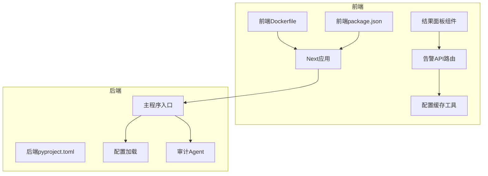
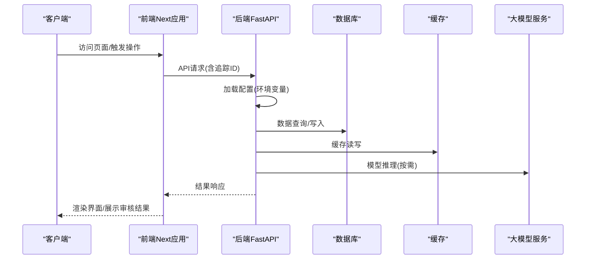
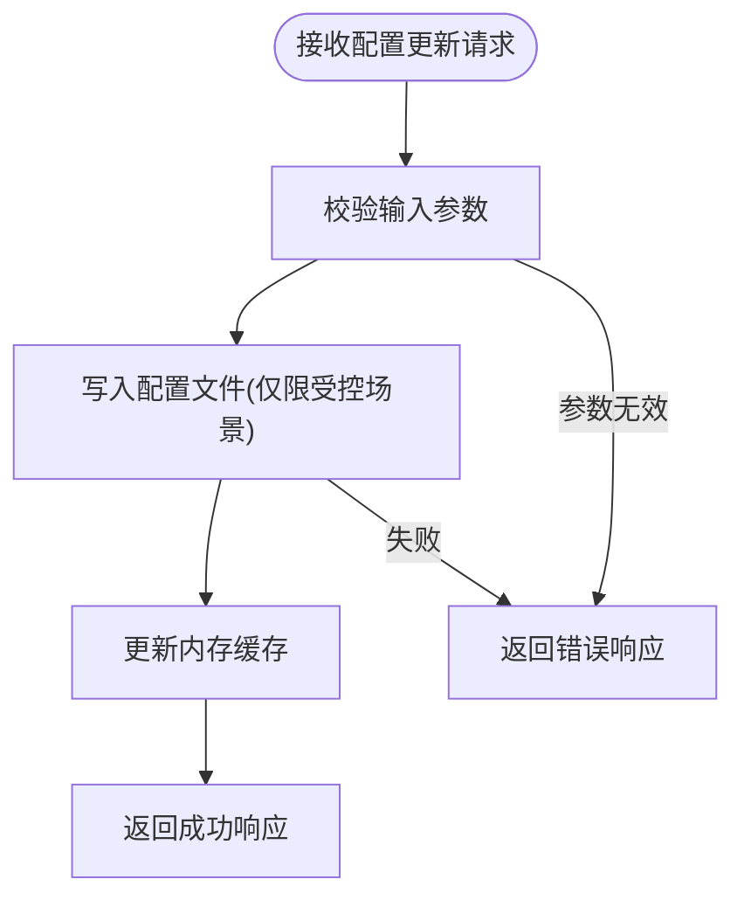
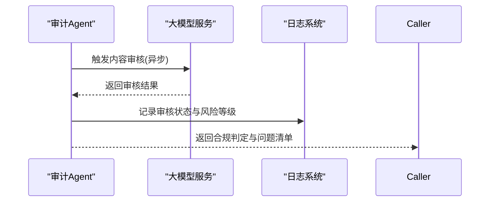
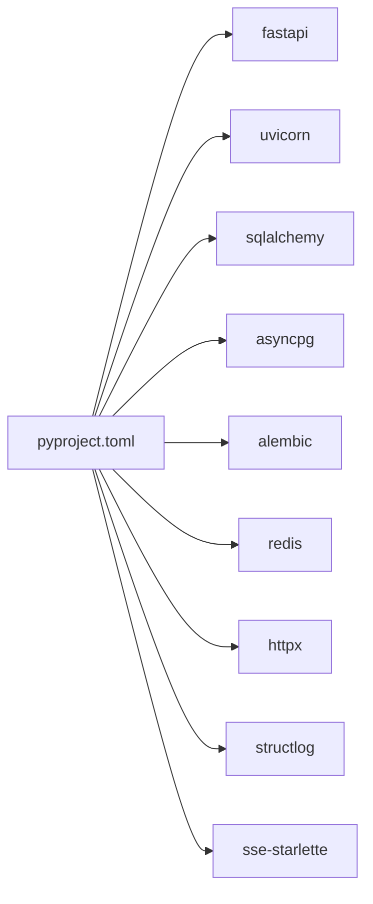

# 容器安全最佳实践

<cite>
**本文引用的文件**
- [Dockerfile](file://OpenClaw-bot-review-main/Dockerfile)
- [.dockerignore](file://OpenClaw-bot-review-main/.dockerignore)
- [pyproject.toml](file://backend/pyproject.toml)
- [package.json](file://frontend/package.json)
- [config.py](file://backend/app/core/config.py)
- [main.py](file://backend/app/main.py)
- [audit_agent.py](file://backend/app/agents/audit_agent.py)
- [route.ts](file://OpenClaw-bot-review-main/app/api/alerts/route.ts)
- [config-cache.ts](file://OpenClaw-bot-review-main/lib/config-cache.ts)
- [ResultPanel.tsx](file://frontend/components/office/ResultPanel.tsx)
</cite>

## 目录
1. [引言](#引言)
2. [项目结构](#项目结构)
3. [核心组件](#核心组件)
4. [架构总览](#架构总览)
5. [详细组件分析](#详细组件分析)
6. [依赖分析](#依赖分析)
7. [性能考虑](#性能考虑)
8. [故障排查指南](#故障排查指南)
9. [结论](#结论)
10. [附录](#附录)

## 引言
本指南面向在容器化环境中部署与运行该平台的工程团队，聚焦容器安全最佳实践，覆盖以下主题：
- 非root用户运行的安全优势与配置方法
- 只读文件系统与挂载策略
- 最小权限原则：用户、文件与网络
- 镜像安全扫描与漏洞检测
- 网络安全：防火墙、端口限制与网络隔离
- 敏感信息保护：环境变量、密钥与配置文件
- 运行时安全：SELinux/AppArmor/安全上下文
- 安全审计与合规检查

本指南以仓库中现有实现为依据，结合通用安全规范，提出可落地的改进建议与实施路径。

## 项目结构
该仓库包含前端、后端与评审辅助模块，其中与容器安全直接相关的关键文件如下：
- 前端Next应用与构建产物：用于容器镜像的构建与运行
- 后端FastAPI应用：提供API服务与业务逻辑
- 审计Agent：用于内容合规与风险评估
- 配置与环境变量：数据库、缓存、LLM等外部依赖的连接参数
- 前端告警配置API：涉及本地持久化与配置缓存

**图表来源**
- [Dockerfile:1-27](file://OpenClaw-bot-review-main/Dockerfile#L1-L27)
- [package.json:1-23](file://frontend/package.json#L1-L23)
- [pyproject.toml:1-41](file://backend/pyproject.toml#L1-L41)
- [main.py:1-142](file://backend/app/main.py#L1-L142)
- [config.py:1-51](file://backend/app/core/config.py#L1-L51)
- [audit_agent.py:1-66](file://backend/app/agents/audit_agent.py#L1-L66)
- [route.ts:46-91](file://OpenClaw-bot-review-main/app/api/alerts/route.ts#L46-L91)
- [config-cache.ts:1-18](file://OpenClaw-bot-review-main/lib/config-cache.ts#L1-L18)
- [ResultPanel.tsx:97-145](file://frontend/components/office/ResultPanel.tsx#L97-L145)

**章节来源**
- [Dockerfile:1-27](file://OpenClaw-bot-review-main/Dockerfile#L1-L27)
- [pyproject.toml:1-41](file://backend/pyproject.toml#L1-L41)
- [package.json:1-23](file://frontend/package.json#L1-L23)
- [main.py:1-142](file://backend/app/main.py#L1-L142)
- [config.py:1-51](file://backend/app/core/config.py#L1-L51)
- [audit_agent.py:1-66](file://backend/app/agents/audit_agent.py#L1-L66)
- [route.ts:46-91](file://OpenClaw-bot-review-main/app/api/alerts/route.ts#L46-L91)
- [config-cache.ts:1-18](file://OpenClaw-bot-review-main/lib/config-cache.ts#L1-L18)
- [ResultPanel.tsx:97-145](file://frontend/components/office/ResultPanel.tsx#L97-L145)

## 核心组件
- 前端Next应用：基于Node基础镜像构建，暴露固定端口，使用生产模式启动。
- 后端FastAPI应用：通过环境变量加载数据库、缓存、LLM等配置；提供健康检查与统一异常处理。
- 审计Agent：作为内容合规与风险评估的后端能力之一。
- 前端告警配置API：支持读取/更新告警配置，并写入本地文件；存在配置缓存机制。

**章节来源**
- [Dockerfile:1-27](file://OpenClaw-bot-review-main/Dockerfile#L1-L27)
- [main.py:1-142](file://backend/app/main.py#L1-L142)
- [config.py:1-51](file://backend/app/core/config.py#L1-L51)
- [audit_agent.py:1-66](file://backend/app/agents/audit_agent.py#L1-L66)
- [route.ts:46-91](file://OpenClaw-bot-review-main/app/api/alerts/route.ts#L46-L91)
- [config-cache.ts:1-18](file://OpenClaw-bot-review-main/lib/config-cache.ts#L1-L18)

## 架构总览
下图展示容器内运行时的组件交互与数据流，强调安全边界与最小权限原则的应用点。

**图表来源**
- [main.py:60-84](file://backend/app/main.py#L60-L84)
- [config.py:7-47](file://backend/app/core/config.py#L7-L47)
- [audit_agent.py:48-65](file://backend/app/agents/audit_agent.py#L48-L65)

## 详细组件分析

### 非root用户运行与最小权限原则
- 当前镜像采用官方Node基础镜像，通常以root身份运行，未显式切换到非root用户。
- 建议：
  - 在Dockerfile中新增非root用户与专用用户组，仅授予必要目录的读写权限。
  - 将工作目录与静态资源目录归属给该用户，避免容器内进程以root权限写入宿主机。
  - 限制容器capabilities，移除不必要的sys_admin、dac_override等权限。
  - 使用只读根文件系统，仅对必要目录进行读写挂载。

**章节来源**
- [Dockerfile:10-26](file://OpenClaw-bot-review-main/Dockerfile#L10-L26)

### 只读文件系统与挂载策略
- 建议：
  - 启用只读根文件系统，仅将日志目录、临时文件目录映射为可写卷。
  - 对静态资源目录使用只读绑定挂载，避免容器内篡改。
  - 将配置文件与密钥通过只读卷注入，避免在镜像中硬编码敏感信息。

**章节来源**
- [Dockerfile:16-19](file://OpenClaw-bot-review-main/Dockerfile#L16-L19)

### 最小权限原则：用户、文件与网络
- 用户权限：
  - 新建非root用户并设置UID/GID，仅授予应用运行所需的最小权限。
- 文件权限：
  - 仅授予应用需要的目录权限，例如日志目录、缓存目录。
- 网络访问控制：
  - 仅开放必要端口（如应用监听端口），关闭默认暴露的管理端口。
  - 使用网络策略限制Pod间通信，仅允许必要的出站流量（如数据库、缓存、LLM）。

**章节来源**
- [main.py:68-74](file://backend/app/main.py#L68-L74)
- [config.py:34-37](file://backend/app/core/config.py#L34-L37)

### 容器镜像安全扫描与漏洞检测
- 建议：
  - 在CI中集成镜像扫描（如Trivy、Clair、Snyk），在构建阶段阻断高危漏洞镜像上线。
  - 固定基础镜像版本，定期更新至最新稳定补丁版本。
  - 使用多阶段构建，仅复制运行所需文件，减少攻击面。

**章节来源**
- [Dockerfile:1-27](file://OpenClaw-bot-review-main/Dockerfile#L1-L27)

### 网络安全配置：防火墙、端口限制与网络隔离
- 端口暴露：
  - 仅暴露应用监听端口，避免暴露开发工具或调试端口。
- 防火墙与网络策略：
  - 在Kubernetes中使用NetworkPolicy限制入站/出站流量。
  - 将数据库、缓存、LLM等外部服务置于私有网络，仅通过受控出口访问。
- CORS与跨域：
  - 生产环境收紧CORS白名单，避免通配符暴露。

**章节来源**
- [Dockerfile:21-24](file://OpenClaw-bot-review-main/Dockerfile#L21-L24)
- [main.py:68-74](file://backend/app/main.py#L68-L74)

### 敏感信息保护：环境变量、密钥与配置文件
- 环境变量：
  - 将数据库URL、缓存地址、LLM密钥等放入环境变量，避免硬编码。
  - 使用只读卷注入密钥文件，不在镜像中携带明文密钥。
- 配置文件：
  - 前端存在将配置写入本地文件的逻辑，建议改为只读卷注入或通过受控接口拉取。
  - 配置缓存仅用于内存态，不落盘，避免磁盘泄露。

**图表来源**
- [route.ts:63-91](file://OpenClaw-bot-review-main/app/api/alerts/route.ts#L63-L91)
- [config-cache.ts:1-18](file://OpenClaw-bot-review-main/lib/config-cache.ts#L1-L18)

**章节来源**
- [config.py:11-31](file://backend/app/core/config.py#L11-L31)
- [route.ts:46-91](file://OpenClaw-bot-review-main/app/api/alerts/route.ts#L46-L91)
- [config-cache.ts:1-18](file://OpenClaw-bot-review-main/lib/config-cache.ts#L1-L18)

### 容器运行时安全：SELinux、AppArmor与安全上下文
- SELinux/AppArmor：
  - 在Linux内核上启用强制访问控制（MAC），限制容器进程的文件与网络行为。
  - 为容器配置最小权限的SELinux/AppArmor策略，避免过度宽泛的许可。
- 安全上下文：
  - 为Pod设置安全上下文，确保容器以非root用户运行，且具备只读根文件系统。
  - 为卷设置正确的SELinux标签，避免权限冲突。

**章节来源**
- [Dockerfile:10-26](file://OpenClaw-bot-review-main/Dockerfile#L10-L26)

### 安全审计与合规检查
- 审计Agent：
  - 利用现有审计Agent对生成内容进行合规性与风险评估，形成可追溯的审核记录。
- 日志与追踪：
  - 在后端统一记录请求追踪ID，便于问题定位与审计回溯。
- 健康检查与异常处理：
  - 提供健康检查端点，统一异常处理映射，避免敏感信息泄露。

**图表来源**
- [audit_agent.py:48-65](file://backend/app/agents/audit_agent.py#L48-L65)
- [main.py:87-129](file://backend/app/main.py#L87-L129)

**章节来源**
- [audit_agent.py:1-66](file://backend/app/agents/audit_agent.py#L1-L66)
- [main.py:87-129](file://backend/app/main.py#L87-L129)

## 依赖分析
后端依赖主要通过包管理器声明，建议在容器构建阶段锁定依赖版本，减少供应链风险。

**图表来源**
- [pyproject.toml:6-22](file://backend/pyproject.toml#L6-L22)

**章节来源**
- [pyproject.toml:1-41](file://backend/pyproject.toml#L1-L41)

## 性能考虑
- 构建优化：使用多阶段构建，减少最终镜像体积与层数量。
- 运行优化：启用只读根文件系统与最小权限，降低I/O与安全检查开销。
- 网络优化：限制出站访问，减少不必要的网络往返与超时重试。

## 故障排查指南
- 健康检查失败：
  - 检查应用监听地址与端口是否正确，确认容器内网络连通性。
- CORS跨域问题：
  - 生产环境收紧CORS白名单，避免通配符导致的安全隐患。
- 配置写入异常：
  - 若前端配置写入失败，检查挂载卷权限与磁盘空间；优先采用只读注入方式。
- 审计Agent异常：
  - 关注Agent降级返回，结合日志追踪ID定位具体环节。

**章节来源**
- [main.py:139-141](file://backend/app/main.py#L139-L141)
- [main.py:68-74](file://backend/app/main.py#L68-L74)
- [route.ts:54-61](file://OpenClaw-bot-review-main/app/api/alerts/route.ts#L54-L61)
- [audit_agent.py:59-65](file://backend/app/agents/audit_agent.py#L59-L65)

## 结论
通过在容器层面落实非root运行、只读文件系统、最小权限与网络隔离，在镜像构建与运行时引入安全扫描与合规审计，可显著提升平台的整体安全性与可运维性。建议将上述实践纳入CI/CD流程，形成持续的安全治理闭环。

## 附录
- 建议的Dockerfile改进要点：
  - 新增非root用户与用户组
  - 设置只读根文件系统
  - 仅复制运行所需产物
  - 使用固定基础镜像版本
- 建议的运行时安全策略：
  - 启用SELinux/AppArmor
  - 配置Pod安全上下文
  - 使用只读卷注入密钥与配置
  - 在Kubernetes中实施NetworkPolicy