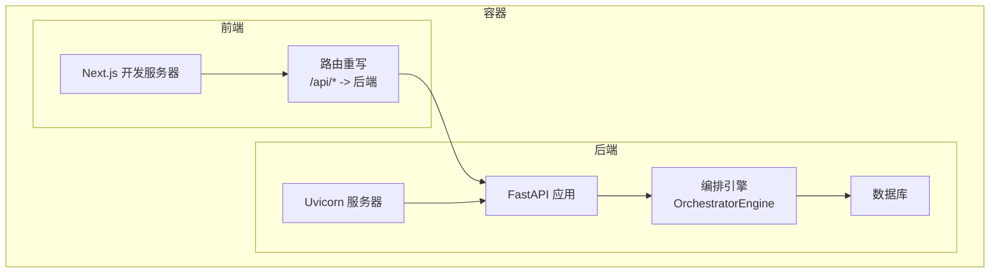
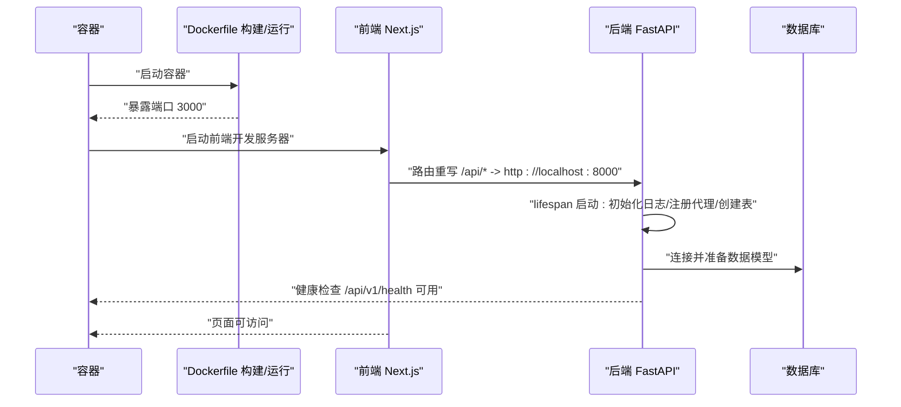
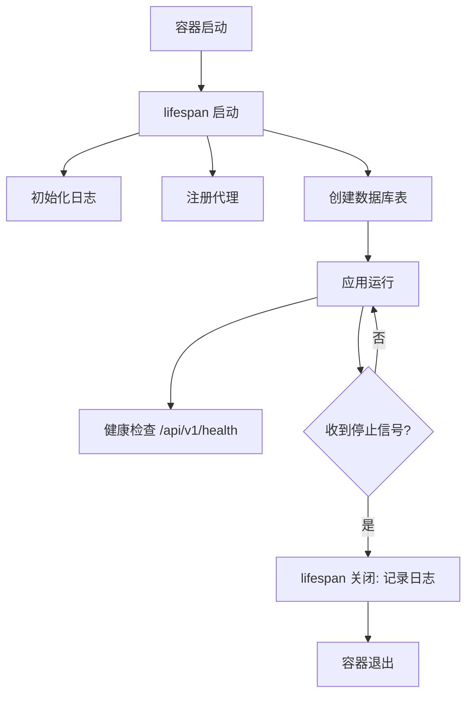
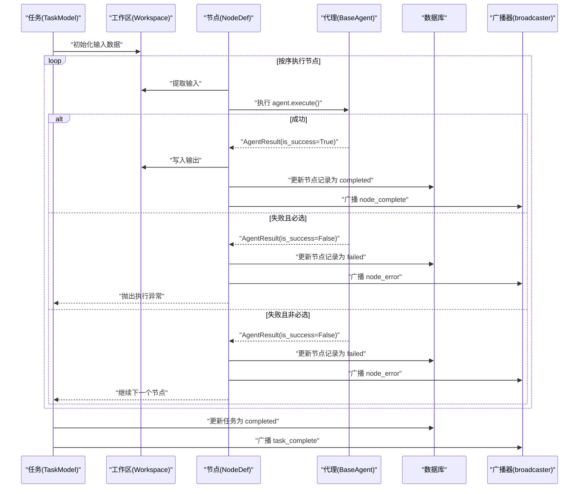
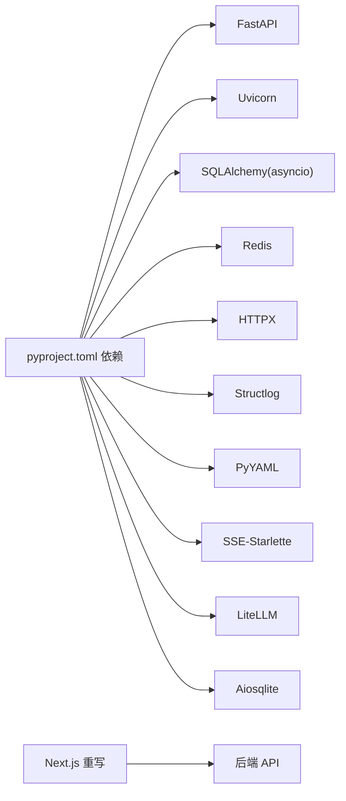

# 容器生命周期管理

<cite>
**本文引用的文件**
- [Dockerfile](file://OpenClaw-bot-review-main/Dockerfile)
- [backend/main.py](file://backend/app/main.py)
- [backend/config.py](file://backend/app/core/config.py)
- [backend/logger.py](file://backend/app/core/logger.py)
- [backend/engine.py](file://backend/app/orchestrator/engine.py)
- [backend/task_routes.py](file://backend/app/api/task_routes.py)
- [backend/exceptions.py](file://backend/app/core/exceptions.py)
- [backend/tracer.py](file://backend/app/core/tracer.py)
- [backend/tables.py](file://backend/app/models/tables.py)
- [frontend/next.config.ts](file://frontend/next.config.ts)
- [start.sh](file://start.sh)
- [backend/pyproject.toml](file://backend/pyproject.toml)
</cite>

## 目录
1. [简介](#简介)
2. [项目结构](#项目结构)
3. [核心组件](#核心组件)
4. [架构总览](#架构总览)
5. [详细组件分析](#详细组件分析)
6. [依赖分析](#依赖分析)
7. [性能考虑](#性能考虑)
8. [故障排查指南](#故障排查指南)
9. [结论](#结论)
10. [附录](#附录)

## 简介
本指南围绕容器生命周期管理进行系统化说明，覆盖容器启动、运行与停止的完整流程，重点阐述启动顺序与依赖关系处理；健康检查机制（HTTP/TCP/命令）；自动重启与故障恢复策略；资源限制配置（CPU/内存/存储）；日志管理（级别、轮转、远程采集）；监控与指标收集（性能与资源统计）；以及最佳实践（优雅关闭、信号处理、资源清理）。  
本项目由后端 FastAPI 应用与前端 Next.js 应用组成，提供容器化部署能力与本地开发脚本。

## 项目结构
- 后端采用 FastAPI + SQLAlchemy 异步 ORM，通过 lifespan 钩子实现应用启动与关闭阶段的统一管理。
- 前端为 Next.js 应用，通过重写规则将 API 请求转发至后端服务。
- 提供 Dockerfile 用于构建生产镜像，暴露端口并以 Node 运行时启动。
- 提供本地启动脚本，同时启动前后端服务，并在收到中断信号时优雅关闭。

图表来源
- [backend/main.py:42-58](file://backend/app/main.py#L42-L58)
- [frontend/next.config.ts:4-11](file://frontend/next.config.ts#L4-L11)
- [OpenClaw-bot-review-main/Dockerfile:21-26](file://OpenClaw-bot-review-main/Dockerfile#L21-L26)

章节来源
- [backend/main.py:42-58](file://backend/app/main.py#L42-L58)
- [frontend/next.config.ts:4-11](file://frontend/next.config.ts#L4-L11)
- [OpenClaw-bot-review-main/Dockerfile:1-27](file://OpenClaw-bot-review-main/Dockerfile#L1-L27)
- [start.sh:51-79](file://start.sh#L51-L79)

## 核心组件
- 应用生命周期管理：通过 lifespan 钩子在启动时初始化日志、注册代理、创建数据库表；在关闭时记录日志。
- 编排引擎：按固定顺序执行工作流节点，支持超时控制、降级回退、失败处理与事件广播。
- 健康检查：提供 /api/v1/health 接口，返回状态与版本信息。
- 日志系统：基于 structlog 的结构化日志，支持 JSON 输出与时间戳、堆栈等上下文。
- 配置中心：从环境变量加载数据库、Redis、LLM、应用主机端口、日志级别、超时等参数。
- 异常体系：统一错误码分类，映射到 HTTP 状态码，便于容器编排层识别重启与告警策略。
- 跟踪与任务 ID：全局 trace_id 与 task_id 上下文传播，便于跨服务追踪。

章节来源
- [backend/main.py:42-58](file://backend/app/main.py#L42-L58)
- [backend/engine.py:89-235](file://backend/app/orchestrator/engine.py#L89-L235)
- [backend/main.py:139-142](file://backend/app/main.py#L139-L142)
- [backend/logger.py:8-31](file://backend/app/core/logger.py#L8-L31)
- [backend/config.py:7-51](file://backend/app/core/config.py#L7-L51)
- [backend/exceptions.py:4-125](file://backend/app/core/exceptions.py#L4-L125)
- [backend/tracer.py:10-34](file://backend/app/core/tracer.py#L10-L34)

## 架构总览
容器启动顺序与依赖关系：
- 容器启动后，先执行构建阶段（复制静态产物），再进入运行阶段。
- 运行阶段默认监听 3000 端口，通过 /api/* 路由重写将请求转发至后端。
- 后端应用通过 lifespan 初始化数据库与代理注册，随后启动 HTTP 服务。
- 前端开发服务器启动后，等待用户访问；后端提供健康检查接口与业务 API。

图表来源
- [OpenClaw-bot-review-main/Dockerfile:10-26](file://OpenClaw-bot-review-main/Dockerfile#L10-L26)
- [frontend/next.config.ts:4-11](file://frontend/next.config.ts#L4-L11)
- [backend/main.py:42-58](file://backend/app/main.py#L42-L58)

章节来源
- [OpenClaw-bot-review-main/Dockerfile:1-27](file://OpenClaw-bot-review-main/Dockerfile#L1-L27)
- [frontend/next.config.ts:4-11](file://frontend/next.config.ts#L4-L11)
- [backend/main.py:42-58](file://backend/app/main.py#L42-L58)

## 详细组件分析

### 启动与关闭生命周期
- 启动阶段：设置日志、注册代理、创建数据库表；记录启动日志。
- 关闭阶段：记录关闭日志；未显式销毁连接池，建议在生产中补充资源清理。
- 健康检查：提供 /api/v1/health 返回状态与版本，便于容器编排层探测。

图表来源
- [backend/main.py:42-58](file://backend/app/main.py#L42-L58)
- [backend/main.py:139-142](file://backend/app/main.py#L139-L142)

章节来源
- [backend/main.py:42-58](file://backend/app/main.py#L42-L58)
- [backend/main.py:139-142](file://backend/app/main.py#L139-L142)

### 工作流编排与节点执行
- 固定线性工作流：按预定义节点顺序依次执行，每个节点对应一个代理。
- 超时控制：基于 settings.agent_timeout 对单个节点执行设置超时。
- 失败与降级：节点失败时尝试回退逻辑；必选节点失败会中断整个任务；非必选节点失败仅标记失败并继续。
- 事件广播：节点开始/完成/错误通过广播器通知订阅者。
- 结果汇总：累计 token 使用量，记录节点耗时与输出摘要。

图表来源
- [backend/engine.py:92-235](file://backend/app/orchestrator/engine.py#L92-L235)
- [backend/engine.py:236-243](file://backend/app/orchestrator/engine.py#L236-L243)

章节来源
- [backend/engine.py:89-235](file://backend/app/orchestrator/engine.py#L89-L235)
- [backend/engine.py:236-243](file://backend/app/orchestrator/engine.py#L236-L243)

### 健康检查机制
- HTTP 健康检查：/api/v1/health 返回状态与版本，适合容器编排层探活。
- TCP/命令检查：当前仓库未提供 TCP/命令探针示例，可在容器编排层补充相应探针配置。

章节来源
- [backend/main.py:139-142](file://backend/app/main.py#L139-L142)

### 自动重启策略与故障恢复
- 重启策略：建议在容器编排层根据健康检查结果与错误码类别设置重启策略（例如失败次数、退避间隔）。
- 故障恢复：编排引擎对必选节点失败直接中断任务；对非必选节点失败进行降级并继续；异常体系将业务错误映射为 HTTP 状态码，便于编排层识别与处理。
- 信号处理：本地启动脚本捕获 SIGINT/SIGTERM 并优雅关闭前后端进程；容器内应确保 SIGTERM 能被运行时正确接收并触发 lifespan 关闭钩子。

章节来源
- [backend/engine.py:147-196](file://backend/app/orchestrator/engine.py#L147-L196)
- [backend/exceptions.py:4-125](file://backend/app/core/exceptions.py#L4-L125)
- [start.sh:41-49](file://start.sh#L41-L49)

### 资源限制配置
- CPU/内存限制：在容器编排层设置 requests/limits；后端应用通过异步 I/O 与连接池管理资源占用。
- 存储限制：数据库文件路径与静态资源目录需挂载到持久卷；建议分离日志输出到标准输出以便外部采集。
- 端口暴露：容器暴露 3000 端口；后端服务默认监听 8000 端口，前端通过重写规则转发。

章节来源
- [OpenClaw-bot-review-main/Dockerfile:21-26](file://OpenClaw-bot-review-main/Dockerfile#L21-L26)
- [backend/config.py:34-37](file://backend/app/core/config.py#L34-L37)
- [frontend/next.config.ts:4-11](file://frontend/next.config.ts#L4-L11)

### 日志管理
- 日志级别：通过配置项 log_level 控制；支持 INFO/DEBUG/ERROR 等级别。
- 日志格式：JSON 渲染，包含时间戳、级别、模块名、异常堆栈等上下文。
- 远程采集：容器标准输出可被外部日志系统采集；建议在生产中配置集中式日志收集。

章节来源
- [backend/config.py:40](file://backend/app/core/config.py#L40)
- [backend/logger.py:8-31](file://backend/app/core/logger.py#L8-L31)

### 监控与指标收集
- 性能监控：建议在容器编排层启用 CPU/内存/网络指标采集；后端可扩展 Prometheus 指标导出。
- 资源统计：编排引擎记录节点耗时、token 使用量；可作为业务侧指标上报。
- 追踪链路：通过 trace_id 与 task_id 在请求头与日志中传播，便于跨服务追踪。

章节来源
- [backend/engine.py:211-216](file://backend/app/orchestrator/engine.py#L211-L216)
- [backend/tracer.py:10-34](file://backend/app/core/tracer.py#L10-L34)
- [backend/main.py:77-84](file://backend/app/main.py#L77-L84)

### 最佳实践
- 优雅关闭：确保 SIGTERM 被正确处理，lifespan 钩子在关闭时记录日志；避免强制终止导致资源泄漏。
- 信号处理：本地脚本已演示捕获中断信号并关闭子进程；容器运行时也应遵循相同模式。
- 资源清理：数据库连接池与外部服务连接应在关闭钩子中释放；当前代码未显式销毁连接池，建议补充。
- 健康检查：结合 HTTP 健康检查与容器编排层探针，确保快速发现不可用实例。
- 日志与监控：统一结构化日志输出，配合集中式日志与指标系统，提升可观测性。

章节来源
- [start.sh:41-49](file://start.sh#L41-L49)
- [backend/main.py:42-58](file://backend/app/main.py#L42-L58)

## 依赖分析
- 后端依赖：FastAPI、Uvicorn、SQLAlchemy 异步、Redis、HTTP 客户端、结构化日志、YAML、SSE、LLM SDK、SQLite 等。
- 前端依赖：Next.js、rewrites 规则将 /api/* 转发至后端。
- 容器镜像：基于 Node 22 Alpine，分阶段构建与运行，暴露 3000 端口。

图表来源
- [backend/pyproject.toml:6-22](file://backend/pyproject.toml#L6-L22)
- [frontend/next.config.ts:4-11](file://frontend/next.config.ts#L4-L11)

章节来源
- [backend/pyproject.toml:1-41](file://backend/pyproject.toml#L1-L41)
- [frontend/next.config.ts:4-11](file://frontend/next.config.ts#L4-L11)

## 性能考虑
- 异步 I/O：后端使用 SQLAlchemy 异步与 asyncio，减少阻塞，提升并发处理能力。
- 超时控制：为代理执行设置超时，避免单点阻塞影响整体吞吐。
- 数据库连接：建议在生产中配置连接池大小与超时，避免高负载下的连接争用。
- 前端重写：通过路由重写减少跨域与额外跳转，降低延迟。

章节来源
- [backend/engine.py:236-243](file://backend/app/orchestrator/engine.py#L236-L243)
- [backend/config.py:42-45](file://backend/app/core/config.py#L42-L45)

## 故障排查指南
- 健康检查失败：确认 /api/v1/health 是否可用；检查后端日志与数据库连接。
- 任务执行失败：查看节点运行记录与错误消息；区分必选/非必选节点的影响。
- 超时问题：调整 settings.agent_timeout；检查 LLM 与外部服务响应时间。
- 异常映射：根据错误码类别判断是否为客户端错误、冲突、外部调用失败或系统内部错误，指导重启与告警策略。

章节来源
- [backend/main.py:139-142](file://backend/app/main.py#L139-L142)
- [backend/engine.py:147-196](file://backend/app/orchestrator/engine.py#L147-L196)
- [backend/exceptions.py:4-125](file://backend/app/core/exceptions.py#L4-L125)

## 结论
本项目提供了完整的容器化后端服务与前端开发环境，具备结构化日志、健康检查、异步编排与统一异常处理能力。结合容器编排层的探针、重启与资源限制策略，可实现稳定可靠的容器生命周期管理。建议在生产中补充连接池清理、集中式日志与指标导出，并完善 TCP/命令健康检查探针。

## 附录
- 本地启动：脚本会安装依赖、启动后端与前端，并在中断时优雅关闭。
- 端口与路由：容器暴露 3000，前端开发服务器监听该端口；/api/* 路由重写至后端 8000。

章节来源
- [start.sh:23-79](file://start.sh#L23-L79)
- [OpenClaw-bot-review-main/Dockerfile:21-26](file://OpenClaw-bot-review-main/Dockerfile#L21-L26)
- [frontend/next.config.ts:4-11](file://frontend/next.config.ts#L4-L11)