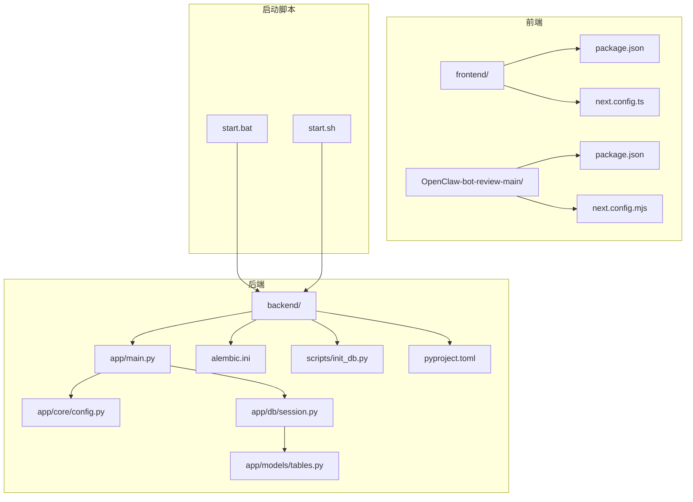
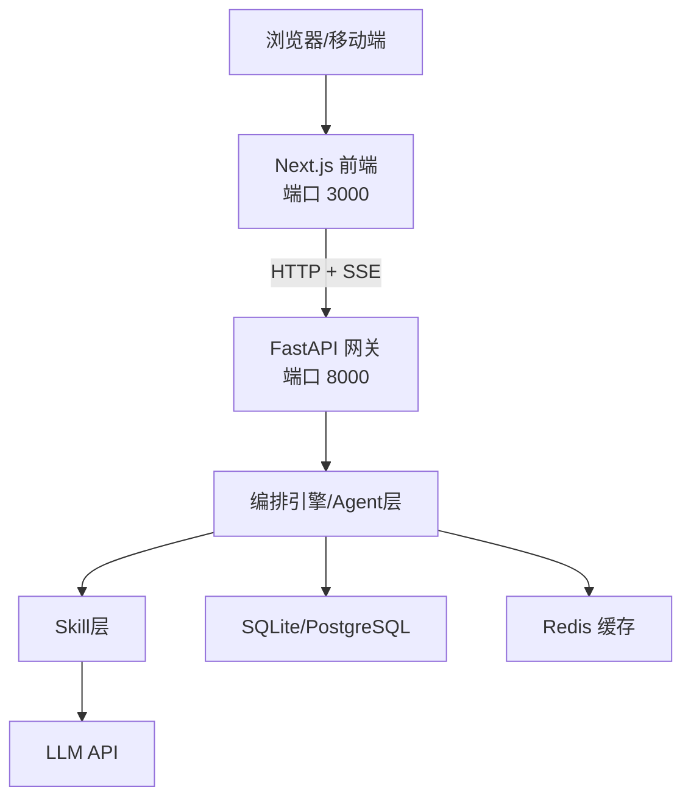
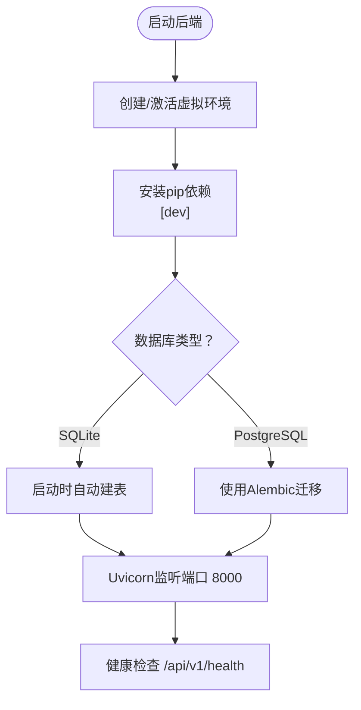
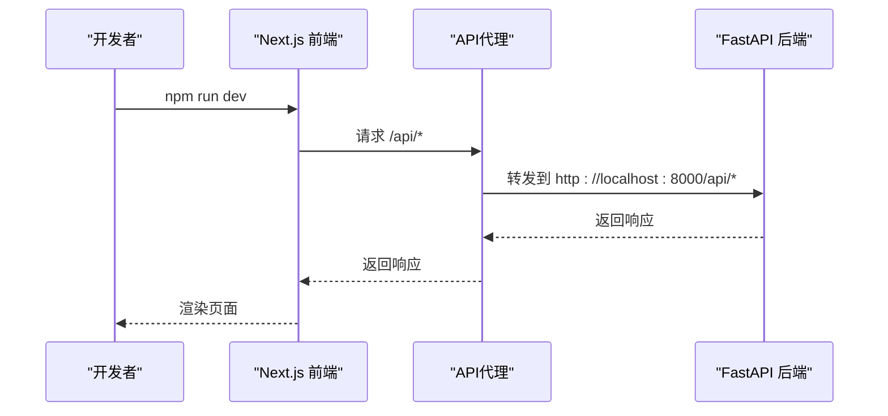
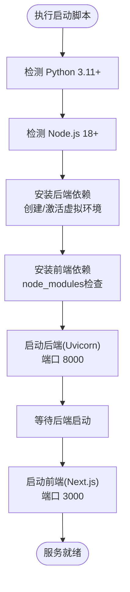
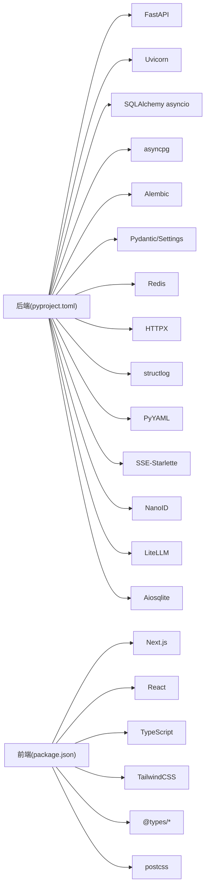

# 开发环境部署

<cite>
**本文引用的文件**
- [backend/pyproject.toml](file://backend/pyproject.toml)
- [backend/app/core/config.py](file://backend/app/core/config.py)
- [backend/app/main.py](file://backend/app/main.py)
- [backend/app/db/session.py](file://backend/app/db/session.py)
- [backend/app/models/tables.py](file://backend/app/models/tables.py)
- [backend/alembic.ini](file://backend/alembic.ini)
- [scripts/init_db.py](file://scripts/init_db.py)
- [frontend/package.json](file://frontend/package.json)
- [frontend/next.config.ts](file://frontend/next.config.ts)
- [OpenClaw-bot-review-main/package.json](file://OpenClaw-bot-review-main/package.json)
- [OpenClaw-bot-review-main/next.config.mjs](file://OpenClaw-bot-review-main/next.config.mjs)
- [start.bat](file://start.bat)
- [start.sh](file://start.sh)
- [ARCHITECTURE.md](file://ARCHITECTURE.md)
</cite>

## 目录
1. [简介](#简介)
2. [项目结构](#项目结构)
3. [核心组件](#核心组件)
4. [架构总览](#架构总览)
5. [详细组件分析](#详细组件分析)
6. [依赖分析](#依赖分析)
7. [性能考虑](#性能考虑)
8. [故障排查指南](#故障排查指南)
9. [结论](#结论)
10. [附录](#附录)

## 简介
本指南面向HotClaw项目的本地开发环境搭建，覆盖以下要点：
- Python 3.11+ 与 Node.js 环境准备
- 后端FastAPI项目依赖安装、虚拟环境创建、数据库初始化
- 前端Next.js项目依赖安装与开发服务器启动
- 环境变量配置（LLM API密钥、数据库连接、应用端口等）
- 跨平台启动脚本使用（Windows批处理与Linux/Mac Shell）
- 常见问题排查（端口冲突、依赖版本不兼容等）

## 项目结构
HotClaw采用前后端分离架构，后端使用FastAPI，前端使用Next.js。仓库包含两个前端子项目：主前端与OpenClaw评审前端。

图表来源
- [backend/app/main.py:1-142](file://backend/app/main.py#L1-L142)
- [backend/app/core/config.py:1-51](file://backend/app/core/config.py#L1-L51)
- [backend/app/db/session.py:1-33](file://backend/app/db/session.py#L1-L33)
- [backend/app/models/tables.py:1-233](file://backend/app/models/tables.py#L1-L233)
- [backend/alembic.ini:1-39](file://backend/alembic.ini#L1-L39)
- [scripts/init_db.py:1-16](file://scripts/init_db.py#L1-L16)
- [backend/pyproject.toml:1-41](file://backend/pyproject.toml#L1-L41)
- [frontend/package.json:1-23](file://frontend/package.json#L1-L23)
- [frontend/next.config.ts:1-15](file://frontend/next.config.ts#L1-L15)
- [OpenClaw-bot-review-main/package.json:1-23](file://OpenClaw-bot-review-main/package.json#L1-L23)
- [OpenClaw-bot-review-main/next.config.mjs:1-6](file://OpenClaw-bot-review-main/next.config.mjs#L1-L6)
- [start.bat:1-74](file://start.bat#L1-L74)
- [start.sh:1-79](file://start.sh#L1-L79)

章节来源
- [ARCHITECTURE.md:1-200](file://ARCHITECTURE.md#L1-L200)
- [backend/pyproject.toml:1-41](file://backend/pyproject.toml#L1-L41)
- [frontend/package.json:1-23](file://frontend/package.json#L1-L23)
- [OpenClaw-bot-review-main/package.json:1-23](file://OpenClaw-bot-review-main/package.json#L1-L23)

## 核心组件
- 后端应用入口与生命周期：FastAPI应用、CORS中间件、全局异常处理、路由注册、健康检查端点
- 配置系统：基于Pydantic Settings的环境变量加载，支持SQLite/PostgreSQL切换、Redis、LLM参数、应用端口与调试开关
- 数据库：SQLAlchemy异步引擎与会话工厂，开发模式自动建表
- 前端Next.js：开发服务器、API代理转发至后端、TypeScript与TailwindCSS配置
- 启动脚本：Windows批处理与Linux/Mac Shell脚本，自动安装依赖、创建虚拟环境、启动前后端服务

章节来源
- [backend/app/main.py:1-142](file://backend/app/main.py#L1-L142)
- [backend/app/core/config.py:1-51](file://backend/app/core/config.py#L1-L51)
- [backend/app/db/session.py:1-33](file://backend/app/db/session.py#L1-L33)
- [frontend/next.config.ts:1-15](file://frontend/next.config.ts#L1-L15)
- [start.bat:1-74](file://start.bat#L1-L74)
- [start.sh:1-79](file://start.sh#L1-L79)

## 架构总览
HotClaw采用“前端独立 + 后端API + 数据库/缓存”的分层架构。前端通过SSE接收后端推送的任务状态，后端通过异步ORM与LLM服务协同完成多智能体工作流。

图表来源
- [ARCHITECTURE.md:37-78](file://ARCHITECTURE.md#L37-L78)
- [backend/app/main.py:139-142](file://backend/app/main.py#L139-L142)
- [backend/app/core/config.py:8-47](file://backend/app/core/config.py#L8-L47)

## 详细组件分析

### 后端FastAPI项目
- 语言与框架：Python 3.11+，FastAPI + Uvicorn，异步SQLAlchemy + Alembic
- 依赖安装：使用pip安装项目自身与开发依赖
- 虚拟环境：脚本自动创建并激活Python虚拟环境
- 数据库：开发默认SQLite，生产建议PostgreSQL；启动时自动建表
- 环境变量：通过.env文件加载，包含数据库URL、Redis、LLM API参数、应用端口等

图表来源
- [start.bat:26-50](file://start.bat#L26-L50)
- [start.sh:23-56](file://start.sh#L23-L56)
- [backend/app/main.py:42-57](file://backend/app/main.py#L42-L57)
- [backend/alembic.ini:1-39](file://backend/alembic.ini#L1-L39)

章节来源
- [backend/pyproject.toml:1-41](file://backend/pyproject.toml#L1-L41)
- [backend/app/core/config.py:1-51](file://backend/app/core/config.py#L1-L51)
- [backend/app/db/session.py:1-33](file://backend/app/db/session.py#L1-L33)
- [backend/app/main.py:1-142](file://backend/app/main.py#L1-L142)
- [scripts/init_db.py:1-16](file://scripts/init_db.py#L1-L16)
- [start.bat:26-50](file://start.bat#L26-L50)
- [start.sh:23-56](file://start.sh#L23-L56)

### 前端Next.js项目
- 依赖安装：使用npm安装依赖，若已存在node_modules则跳过
- 开发服务器：启动Next.js开发服务器，端口3000
- API代理：将/api/*转发到后端8000端口，便于本地联调
- 子项目：OpenClaw-bot-review-main为独立前端子项目，配置略有差异

图表来源
- [frontend/next.config.ts:1-15](file://frontend/next.config.ts#L1-L15)
- [frontend/package.json:1-23](file://frontend/package.json#L1-L23)
- [OpenClaw-bot-review-main/next.config.mjs:1-6](file://OpenClaw-bot-review-main/next.config.mjs#L1-L6)
- [OpenClaw-bot-review-main/package.json:1-23](file://OpenClaw-bot-review-main/package.json#L1-L23)

章节来源
- [frontend/next.config.ts:1-15](file://frontend/next.config.ts#L1-L15)
- [frontend/package.json:1-23](file://frontend/package.json#L1-L23)
- [OpenClaw-bot-review-main/next.config.mjs:1-6](file://OpenClaw-bot-review-main/next.config.mjs#L1-L6)
- [OpenClaw-bot-review-main/package.json:1-23](file://OpenClaw-bot-review-main/package.json#L1-L23)

### 跨平台启动脚本
- Windows：start.bat自动检测Python与Node.js，创建后端虚拟环境，安装依赖，分别启动后端与前端
- Linux/Mac：start.sh同样检测环境，使用后台进程方式启动后端与前端，并提供优雅退出

图表来源
- [start.bat:10-74](file://start.bat#L10-L74)
- [start.sh:11-79](file://start.sh#L11-L79)

章节来源
- [start.bat:1-74](file://start.bat#L1-L74)
- [start.sh:1-79](file://start.sh#L1-L79)

## 依赖分析
- 后端依赖：FastAPI、Uvicorn、SQLAlchemy(asyncio)、asyncpg、Alembic、Pydantic/Settings、Redis、HTTPX、structlog、PyYAML、SSE-Starlette、NanoID、LiteLLM、Aiosqlite
- 前端依赖：Next.js、React、TypeScript、TailwindCSS、@types/*、postcss等

图表来源
- [backend/pyproject.toml:6-22](file://backend/pyproject.toml#L6-L22)
- [frontend/package.json:11-21](file://frontend/package.json#L11-L21)

章节来源
- [backend/pyproject.toml:1-41](file://backend/pyproject.toml#L1-L41)
- [frontend/package.json:1-23](file://frontend/package.json#L1-L23)

## 性能考虑
- 异步I/O：后端使用SQLAlchemy异步引擎与Aiosqlite，减少阻塞
- SSE推送：前端通过SSE实时接收节点状态，避免轮询开销
- 缓存：Redis用于会话与临时数据缓存，降低重复计算
- 日志：structlog结构化日志，便于性能分析与问题定位

## 故障排查指南
- 端口冲突
  - 现象：启动后端或前端时报端口占用
  - 解决：修改后端端口或前端代理配置，确保8000与3000未被占用
  - 参考：后端端口配置与前端代理配置
- 依赖版本不兼容
  - 现象：pip安装或npm安装报错
  - 解决：使用脚本自动创建虚拟环境并安装依赖；清理node_modules与.requrements缓存后重试
  - 参考：启动脚本中的依赖安装步骤
- 数据库初始化失败
  - 现象：首次启动后无法创建表
  - 解决：确认数据库URL正确；开发模式默认SQLite无需手动迁移；如使用PostgreSQL，请使用Alembic迁移
  - 参考：自动建表逻辑与Alembic配置
- LLM API访问失败
  - 现象：调用LLM接口报错或无响应
  - 解决：检查LLM API密钥、基础URL与模型名称；确认网络可达
  - 参考：LLM配置项与默认值

章节来源
- [backend/app/core/config.py:22-31](file://backend/app/core/config.py#L22-L31)
- [frontend/next.config.ts:4-11](file://frontend/next.config.ts#L4-L11)
- [start.bat:26-50](file://start.bat#L26-L50)
- [start.sh:23-56](file://start.sh#L23-L56)
- [backend/app/main.py:48-53](file://backend/app/main.py#L48-L53)
- [backend/alembic.ini:1-39](file://backend/alembic.ini#L1-L39)

## 结论
通过本指南，您可以在本地快速搭建HotClaw开发环境，理解前后端分离架构与关键配置项，并掌握跨平台启动脚本的使用方法。遇到问题时，可依据故障排查指南逐项定位与解决。

## 附录

### 环境变量配置清单
- 数据库连接
  - 开发：SQLite（默认）
  - 生产：PostgreSQL（需在环境变量中设置）
- Redis连接
  - Redis URL（默认本地）
- LLM配置
  - API密钥、基础URL、默认模型名
- 应用配置
  - 环境、调试开关、主机地址、端口、日志级别、各类超时

章节来源
- [backend/app/core/config.py:8-47](file://backend/app/core/config.py#L8-L47)