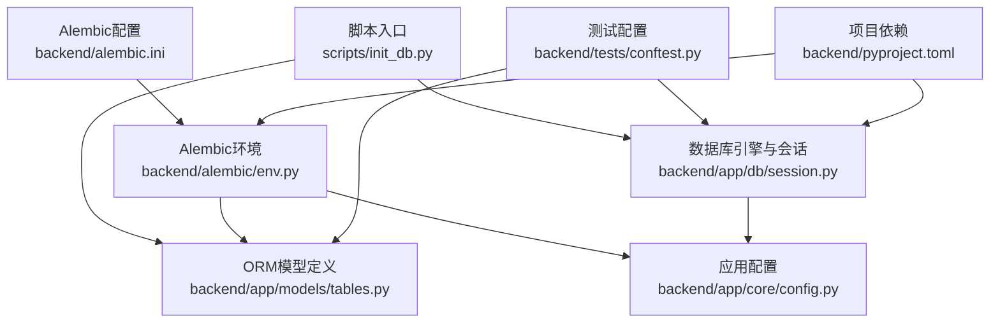
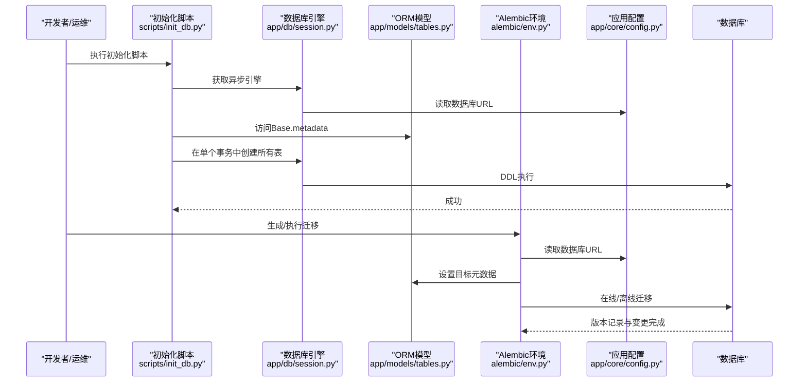
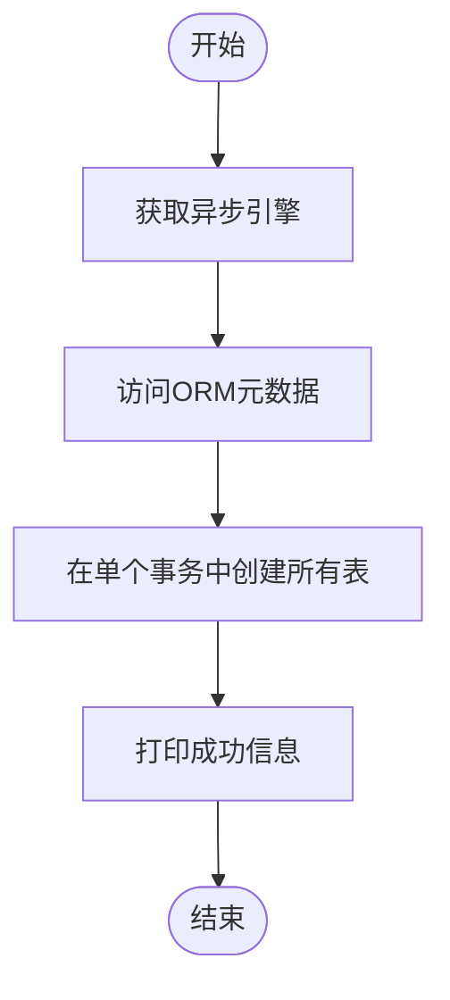
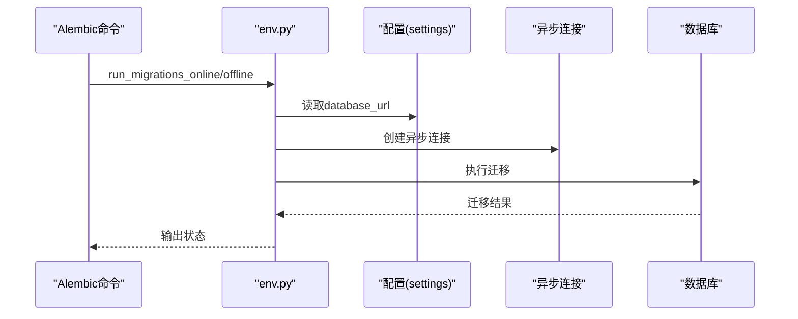
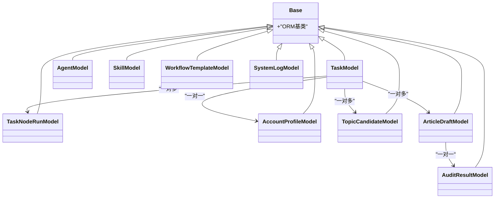
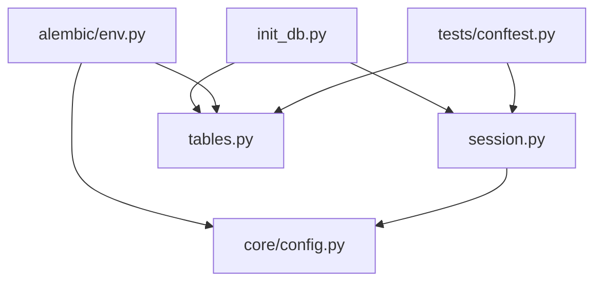

# 数据库初始化

<cite>
**本文引用的文件**
- [scripts/init_db.py](file://scripts/init_db.py)
- [backend/alembic/env.py](file://backend/alembic/env.py)
- [backend/alembic.ini](file://backend/alembic.ini)
- [backend/app/db/session.py](file://backend/app/db/session.py)
- [backend/app/models/tables.py](file://backend/app/models/tables.py)
- [backend/app/core/config.py](file://backend/app/core/config.py)
- [backend/tests/conftest.py](file://backend/tests/conftest.py)
- [backend/pyproject.toml](file://backend/pyproject.toml)
</cite>

## 目录
1. [简介](#简介)
2. [项目结构](#项目结构)
3. [核心组件](#核心组件)
4. [架构总览](#架构总览)
5. [详细组件分析](#详细组件分析)
6. [依赖分析](#依赖分析)
7. [性能考虑](#性能考虑)
8. [故障排除指南](#故障排除指南)
9. [结论](#结论)
10. [附录](#附录)

## 简介
本指南面向HotClaw项目的数据库初始化与迁移管理，覆盖以下内容：
- 初始化脚本的工作原理：表结构创建、初始数据插入（如需）、权限配置（如需）
- Alembic迁移环境配置：数据库连接字符串、版本表管理、迁移脚本生成与执行
- 不同环境（开发、测试、生产）的初始化流程与配置差异
- 数据库模式创建顺序与依赖关系，确保初始化的正确性与完整性
- 初始化失败的故障排除方法与常见问题解决方案

## 项目结构
HotClaw后端采用异步SQLAlchemy与Alembic进行数据库建模与迁移管理。数据库初始化相关的关键位置如下：
- 脚本入口：scripts/init_db.py 提供一次性创建所有表的脚本
- 迁移环境：backend/alembic/env.py 配置异步迁移上下文与目标元数据
- 迁移配置：backend/alembic.ini 定义脚本位置与默认连接字符串
- ORM模型：backend/app/models/tables.py 定义所有业务表结构
- 引擎与会话：backend/app/db/session.py 提供异步引擎与依赖注入
- 应用配置：backend/app/core/config.py 从环境变量加载数据库URL等配置
- 测试配置：backend/tests/conftest.py 展示测试环境的内存数据库初始化方式
- 依赖声明：backend/pyproject.toml 明确异步数据库与迁移相关依赖

图表来源
- [scripts/init_db.py:1-16](file://scripts/init_db.py#L1-L16)
- [backend/alembic/env.py:1-53](file://backend/alembic/env.py#L1-L53)
- [backend/alembic.ini:1-39](file://backend/alembic.ini#L1-L39)
- [backend/app/db/session.py:1-33](file://backend/app/db/session.py#L1-L33)
- [backend/app/models/tables.py:1-233](file://backend/app/models/tables.py#L1-L233)
- [backend/app/core/config.py:1-51](file://backend/app/core/config.py#L1-L51)
- [backend/tests/conftest.py:1-48](file://backend/tests/conftest.py#L1-L48)
- [backend/pyproject.toml:1-41](file://backend/pyproject.toml#L1-L41)

章节来源
- [scripts/init_db.py:1-16](file://scripts/init_db.py#L1-L16)
- [backend/alembic/env.py:1-53](file://backend/alembic/env.py#L1-L53)
- [backend/alembic.ini:1-39](file://backend/alembic.ini#L1-L39)
- [backend/app/db/session.py:1-33](file://backend/app/db/session.py#L1-L33)
- [backend/app/models/tables.py:1-233](file://backend/app/models/tables.py#L1-L233)
- [backend/app/core/config.py:1-51](file://backend/app/core/config.py#L1-L51)
- [backend/tests/conftest.py:1-48](file://backend/tests/conftest.py#L1-L48)
- [backend/pyproject.toml:1-41](file://backend/pyproject.toml#L1-L41)

## 核心组件
- 初始化脚本：通过异步引擎在单次事务中创建所有表，适合首次部署或快速初始化
- Alembic环境：支持离线与在线两种迁移模式，异步连接PostgreSQL，目标元数据来自ORM模型
- ORM模型：集中定义所有业务表及字段、索引、外键关系与级联策略
- 数据库引擎：根据配置选择SQLite或PostgreSQL，支持连接池预检与调试输出
- 应用配置：从环境变量读取数据库URL，区分开发（SQLite）与生产（PostgreSQL）场景
- 测试配置：使用内存SQLite进行单元测试，自动创建与销毁表，避免对真实数据库造成影响

章节来源
- [scripts/init_db.py:8-11](file://scripts/init_db.py#L8-L11)
- [backend/alembic/env.py:34-46](file://backend/alembic/env.py#L34-L46)
- [backend/app/models/tables.py:18-233](file://backend/app/models/tables.py#L18-L233)
- [backend/app/db/session.py:8-19](file://backend/app/db/session.py#L8-L19)
- [backend/app/core/config.py:11-14](file://backend/app/core/config.py#L11-L14)
- [backend/tests/conftest.py:23-30](file://backend/tests/conftest.py#L23-L30)

## 架构总览
下图展示了数据库初始化与迁移的整体流程，以及各组件之间的交互关系。

图表来源
- [scripts/init_db.py:8-11](file://scripts/init_db.py#L8-L11)
- [backend/app/db/session.py:8-19](file://backend/app/db/session.py#L8-L19)
- [backend/app/models/tables.py:18](file://backend/app/models/tables.py#L18)
- [backend/alembic/env.py:13](file://backend/alembic/env.py#L13)
- [backend/app/core/config.py:11-14](file://backend/app/core/config.py#L11-L14)

## 详细组件分析

### 初始化脚本（scripts/init_db.py）
- 功能概述：通过异步上下文创建所有表，适合首次部署或快速初始化
- 关键点：
  - 使用异步引擎的begin事务，确保原子性
  - 基于ORM模型的元数据进行DDL生成
  - 打印成功提示，便于CI/CD日志追踪
- 适用场景：开发环境快速建库、Docker容器首次启动、手动修复缺失表

图表来源
- [scripts/init_db.py:8-11](file://scripts/init_db.py#L8-L11)

章节来源
- [scripts/init_db.py:1-16](file://scripts/init_db.py#L1-L16)

### Alembic迁移环境（backend/alembic/env.py）
- 功能概述：为异步SQLAlchemy提供迁移上下文，支持离线与在线迁移
- 关键点：
  - 从应用配置读取数据库URL并写入Alembic主选项
  - 目标元数据指向ORM模型的Base.metadata
  - 在线迁移通过异步引擎连接，离线迁移直接使用URL配置
  - 支持同步/异步迁移流程切换
- 适用场景：版本化迁移、生产灰度发布、回滚与修复

图表来源
- [backend/alembic/env.py:13](file://backend/alembic/env.py#L13)
- [backend/alembic/env.py:34-46](file://backend/alembic/env.py#L34-L46)

章节来源
- [backend/alembic/env.py:1-53](file://backend/alembic/env.py#L1-L53)

### Alembic配置（backend/alembic.ini）
- 功能概述：定义脚本位置与默认连接字符串，控制日志级别
- 关键点：
  - 指定脚本目录与默认数据库URL（可被运行时覆盖）
  - 日志配置项用于控制SQLAlchemy与Alembic输出
- 适用场景：本地开发覆盖默认URL、CI/CD统一迁移入口

章节来源
- [backend/alembic.ini:1-39](file://backend/alembic.ini#L1-L39)

### 数据库引擎与会话（backend/app/db/session.py）
- 功能概述：提供异步引擎与依赖注入，支持SQLite与PostgreSQL
- 关键点：
  - 根据URL前缀判断是否为SQLite，决定连接池参数
  - 可选开启echo以输出SQL语句，便于调试
  - FastAPI依赖注入函数负责提交、回滚与关闭
- 适用场景：应用启动、测试夹具、服务端点

章节来源
- [backend/app/db/session.py:1-33](file://backend/app/db/session.py#L1-L33)

### ORM模型（backend/app/models/tables.py）
- 功能概述：集中定义所有业务表结构、字段类型、索引与关系
- 关键点：
  - 继承自Base的类即为表映射
  - 包含任务、节点执行、账号画像、话题候选、文章草稿、审核结果、代理、技能、工作流模板、系统日志等
  - 外键约束与级联删除策略在模型层定义
- 适用场景：初始化脚本与迁移共同作用的对象

图表来源
- [backend/app/models/tables.py:18-233](file://backend/app/models/tables.py#L18-L233)

章节来源
- [backend/app/models/tables.py:1-233](file://backend/app/models/tables.py#L1-L233)

### 应用配置（backend/app/core/config.py）
- 功能概述：从环境变量加载数据库URL、Redis、LLM、应用参数等
- 关键点：
  - 默认开发使用SQLite，生产使用PostgreSQL
  - 通过.env文件加载，支持不同环境变量覆盖
- 适用场景：初始化脚本、Alembic环境、应用启动

章节来源
- [backend/app/core/config.py:1-51](file://backend/app/core/config.py#L1-L51)

### 测试配置（backend/tests/conftest.py）
- 功能概述：使用内存SQLite进行测试，自动创建与销毁表
- 关键点：
  - 使用内存数据库避免持久化副作用
  - 在每个测试夹具中创建与清理表，保证隔离性
- 适用场景：单元测试、集成测试

章节来源
- [backend/tests/conftest.py:1-48](file://backend/tests/conftest.py#L1-L48)

### 依赖声明（backend/pyproject.toml）
- 功能概述：声明异步SQLAlchemy、Alembic、asyncpg、aiosqlite等依赖
- 关键点：
  - 异步数据库生态与迁移工具链齐备
- 适用场景：安装与升级依赖、CI/CD镜像构建

章节来源
- [backend/pyproject.toml:1-41](file://backend/pyproject.toml#L1-L41)

## 依赖分析
- 组件耦合：
  - 初始化脚本依赖引擎与模型元数据
  - Alembic环境依赖配置与模型元数据
  - 引擎依赖配置与运行时URL
  - 测试夹具依赖模型与引擎
- 外部依赖：
  - PostgreSQL驱动（asyncpg）与SQLite驱动（aiosqlite）
  - Alembic迁移工具
- 潜在循环依赖：
  - 当前结构清晰，无明显循环导入

图表来源
- [scripts/init_db.py:4-5](file://scripts/init_db.py#L4-L5)
- [backend/alembic/env.py:9-10](file://backend/alembic/env.py#L9-L10)
- [backend/app/db/session.py:3-4](file://backend/app/db/session.py#L3-L4)
- [backend/tests/conftest.py:9-11](file://backend/tests/conftest.py#L9-L11)

章节来源
- [scripts/init_db.py:1-16](file://scripts/init_db.py#L1-L16)
- [backend/alembic/env.py:1-53](file://backend/alembic/env.py#L1-L53)
- [backend/app/db/session.py:1-33](file://backend/app/db/session.py#L1-L33)
- [backend/tests/conftest.py:1-48](file://backend/tests/conftest.py#L1-L48)

## 性能考虑
- 连接池与预检：
  - 非SQLite环境下启用连接池预检，提升连接稳定性
- 异步I/O：
  - 全链路异步设计，减少阻塞，提高并发能力
- 初始化规模：
  - 单事务创建所有表，避免多次DDL导致的锁竞争
- 日志与调试：
  - 可按需开启引擎日志，便于定位性能瓶颈

## 故障排除指南
- 连接字符串错误
  - 症状：初始化或迁移报连接失败
  - 排查：确认数据库URL格式与凭据；开发使用SQLite，生产使用PostgreSQL
  - 参考
    - [backend/app/core/config.py:11-14](file://backend/app/core/config.py#L11-L14)
    - [backend/alembic.ini:5](file://backend/alembic.ini#L5)
- 权限不足
  - 症状：DDL执行失败或无法创建表
  - 排查：确认数据库用户具备创建表与序列的权限
  - 参考
    - [backend/alembic/env.py:13](file://backend/alembic/env.py#L13)
- 版本表冲突
  - 症状：迁移报版本不一致或重复
  - 排查：清理历史迁移记录或重置版本表
  - 参考
    - [backend/alembic/env.py:18](file://backend/alembic/env.py#L18)
- 表已存在
  - 症状：重复初始化报错
  - 排查：先删除旧表或使用迁移工具更新
  - 参考
    - [scripts/init_db.py:10](file://scripts/init_db.py#L10)
- 内存数据库问题（测试）
  - 症状：测试间数据污染或表未清理
  - 排查：确认内存数据库与生命周期管理
  - 参考
    - [backend/tests/conftest.py:23-30](file://backend/tests/conftest.py#L23-L30)

章节来源
- [backend/app/core/config.py:11-14](file://backend/app/core/config.py#L11-L14)
- [backend/alembic/env.py:13-18](file://backend/alembic/env.py#L13-L18)
- [scripts/init_db.py:10](file://scripts/init_db.py#L10)
- [backend/tests/conftest.py:23-30](file://backend/tests/conftest.py#L23-L30)

## 结论
HotClaw的数据库初始化与迁移体系以异步SQLAlchemy为核心，结合Alembic实现版本化演进。初始化脚本适用于快速建库，Alembic环境支持生产级迁移管理。通过明确的配置与模型定义，确保了初始化流程的正确性与可维护性。建议在不同环境中遵循对应的配置与流程，配合完善的故障排除机制，保障数据库初始化的稳定与可靠。

## 附录

### 不同环境的初始化流程与配置差异
- 开发环境
  - 使用SQLite（内存或文件），便于本地开发与调试
  - 参考
    - [backend/app/core/config.py:11-14](file://backend/app/core/config.py#L11-L14)
    - [backend/tests/conftest.py:14](file://backend/tests/conftest.py#L14)
- 测试环境
  - 使用内存SQLite，自动创建与销毁表，保证隔离
  - 参考
    - [backend/tests/conftest.py:23-30](file://backend/tests/conftest.py#L23-L30)
- 生产环境
  - 使用PostgreSQL，Alembic在线迁移，严格版本管理
  - 参考
    - [backend/alembic/env.py:34-46](file://backend/alembic/env.py#L34-L46)
    - [backend/alembic.ini:5](file://backend/alembic.ini#L5)

### 数据库模式创建顺序与依赖关系
- 依赖关系
  - 外键约束要求父表先于子表创建
  - Alembic基于模型元数据生成迁移，自动处理依赖顺序
- 建议
  - 优先创建无外键依赖的表，再创建带外键的表
  - 使用迁移工具而非直接创建，确保版本一致性

章节来源
- [backend/app/models/tables.py:48-73](file://backend/app/models/tables.py#L48-L73)
- [backend/app/models/tables.py:119-139](file://backend/app/models/tables.py#L119-L139)
- [backend/alembic/env.py:18](file://backend/alembic/env.py#L18)