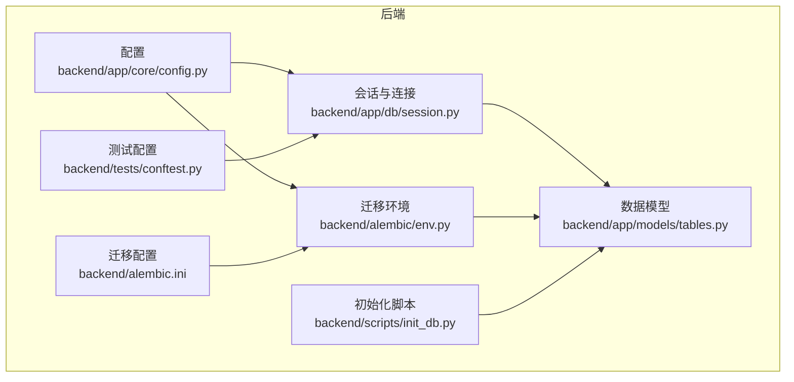
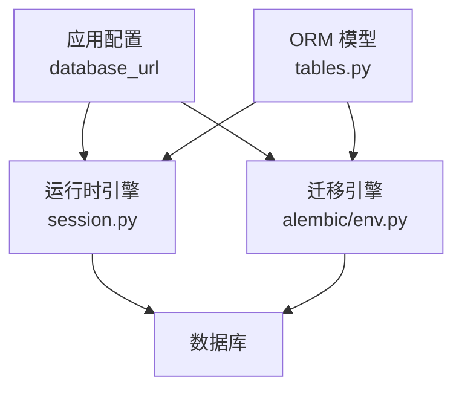
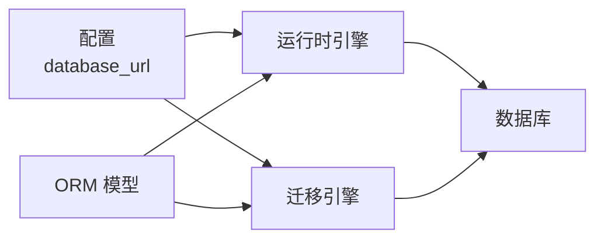

# 数据库备份与恢复

<cite>
**本文引用的文件**
- [backend/app/core/config.py](file://backend/app/core/config.py)
- [backend/app/db/session.py](file://backend/app/db/session.py)
- [backend/alembic/env.py](file://backend/alembic/env.py)
- [backend/alembic.ini](file://backend/alembic.ini)
- [backend/app/models/tables.py](file://backend/app/models/tables.py)
- [backend/scripts/init_db.py](file://backend/scripts/init_db.py)
- [backend/tests/conftest.py](file://backend/tests/conftest.py)
- [ARCHITECTURE.md](file://ARCHITECTURE.md)
- [Notice.md](file://Notice.md)
</cite>

## 目录
1. [简介](#简介)
2. [项目结构](#项目结构)
3. [核心组件](#核心组件)
4. [架构总览](#架构总览)
5. [详细组件分析](#详细组件分析)
6. [依赖分析](#依赖分析)
7. [性能考量](#性能考量)
8. [故障排查指南](#故障排查指南)
9. [结论](#结论)
10. [附录](#附录)

## 简介
本指南围绕 HotClaw 项目的数据库备份与恢复，结合项目实际的数据库配置与模型，提供可操作的策略与流程。项目当前开发环境使用 SQLite，生产环境推荐 PostgreSQL。本文涵盖：
- 备份策略：全量备份、增量备份、差异备份的实施思路与适用场景
- PostgreSQL 备份工具：pg_dump、pg_restore 的使用要点与最佳实践
- 存储位置、压缩与加密传输建议
- 恢复流程：完全恢复、时间点恢复（PITR）、部分恢复的操作步骤
- 备份验证与恢复测试方法
- 灾难恢复计划与演练流程

## 项目结构
HotClaw 后端采用 FastAPI + SQLAlchemy 异步 ORM，数据库连接与会话管理集中在 db 模块，配置由 core 模块提供，迁移使用 Alembic。核心数据模型位于 models 目录。

**图表来源**
- [backend/app/core/config.py:1-51](file://backend/app/core/config.py#L1-L51)
- [backend/app/db/session.py:1-33](file://backend/app/db/session.py#L1-L33)
- [backend/alembic/env.py:1-53](file://backend/alembic/env.py#L1-L53)
- [backend/alembic.ini:1-39](file://backend/alembic.ini#L1-L39)
- [backend/app/models/tables.py:1-233](file://backend/app/models/tables.py#L1-L233)
- [backend/scripts/init_db.py:1-16](file://backend/scripts/init_db.py#L1-L16)
- [backend/tests/conftest.py:1-48](file://backend/tests/conftest.py#L1-L48)

**章节来源**
- [backend/app/core/config.py:1-51](file://backend/app/core/config.py#L1-L51)
- [backend/app/db/session.py:1-33](file://backend/app/db/session.py#L1-L33)
- [backend/alembic/env.py:1-53](file://backend/alembic/env.py#L1-L53)
- [backend/alembic.ini:1-39](file://backend/alembic.ini#L1-L39)
- [backend/app/models/tables.py:1-233](file://backend/app/models/tables.py#L1-L233)
- [backend/scripts/init_db.py:1-16](file://backend/scripts/init_db.py#L1-L16)
- [backend/tests/conftest.py:1-48](file://backend/tests/conftest.py#L1-L48)

## 核心组件
- 数据库配置与连接
  - 配置项 database_url 决定使用 SQLite 或 PostgreSQL；开发默认 SQLite，生产推荐 PostgreSQL
  - 异步引擎与会话工厂在 session.py 中创建，支持 SQLite 与 PostgreSQL
- 迁移与版本控制
  - Alembic 环境读取配置中的数据库 URL，确保迁移与运行时数据库一致
  - alembic.ini 提供迁移脚本位置与 SQLAlchemy URL
- 数据模型
  - models/tables.py 定义了任务、节点运行、账号画像、选题候选、文章草稿、审核结果、Agent、Skill、工作流模板、系统日志等核心表
- 初始化与测试
  - init_db.py 通过异步引擎创建所有表
  - tests/conftest.py 使用内存 SQLite 进行测试，确保隔离与快速清理

**章节来源**
- [backend/app/core/config.py:7-14](file://backend/app/core/config.py#L7-L14)
- [backend/app/db/session.py:3-19](file://backend/app/db/session.py#L3-L19)
- [backend/alembic/env.py:9-18](file://backend/alembic/env.py#L9-L18)
- [backend/alembic.ini:3-6](file://backend/alembic.ini#L3-L6)
- [backend/app/models/tables.py:23-233](file://backend/app/models/tables.py#L23-L233)
- [backend/scripts/init_db.py:8-11](file://backend/scripts/init_db.py#L8-L11)
- [backend/tests/conftest.py:13-31](file://backend/tests/conftest.py#L13-L31)

## 架构总览
HotClaw 的数据库层由配置驱动，运行时与迁移时均通过 Alembic 读取配置中的数据库 URL。开发默认 SQLite，生产建议 PostgreSQL。迁移脚本与模型保持同步，确保备份与恢复的一致性。

**图表来源**
- [backend/app/core/config.py:11-14](file://backend/app/core/config.py#L11-L14)
- [backend/app/db/session.py:8-19](file://backend/app/db/session.py#L8-L19)
- [backend/alembic/env.py:12-18](file://backend/alembic/env.py#L12-L18)
- [backend/app/models/tables.py:18-20](file://backend/app/models/tables.py#L18-L20)

**章节来源**
- [backend/app/core/config.py:11-14](file://backend/app/core/config.py#L11-L14)
- [backend/app/db/session.py:8-19](file://backend/app/db/session.py#L8-L19)
- [backend/alembic/env.py:12-18](file://backend/alembic/env.py#L12-L18)
- [backend/app/models/tables.py:18-20](file://backend/app/models/tables.py#L18-L20)

## 详细组件分析

### 备份策略与实施
- 全量备份
  - 定义：对数据库进行一次性完整导出，包含结构与数据
  - 适用：首次建立基线、灾备恢复起点、定期基准
  - 建议：结合压缩与加密传输，存储于异地与本地多副本
- 增量备份
  - 定义：仅备份自上次备份以来发生变化的数据
  - 适用：高频更新、数据量大、恢复窗口短
  - 注意：需配合 WAL 归档（PostgreSQL）或数据库自身增量机制
- 差异备份
  - 定义：备份自上次全量备份以来发生差异的数据
  - 适用：平衡恢复速度与存储开销
  - 注意：恢复时需先恢复最近一次全量，再依序应用差异

### PostgreSQL 备份工具使用指南
- pg_dump（逻辑备份）
  - 全量备份：导出 SQL 或自定义格式，便于跨平台与细粒度恢复
  - 选择性导出：可按表或模式导出，支持并行与压缩
  - 传输安全：结合 SSH/TLS 或加密存储
- pg_restore（逻辑恢复）
  - 选择性恢复：可按表或模式恢复，支持并行与跳过冲突
  - 恢复前准备：确认目标数据库存在且版本兼容
- 物理备份（文件系统级）
  - 基于复制槽与 WAL 归档的 PITR
  - 适用于极短 RPO/RTO 的生产环境
  - 需要严格的备份一致性与恢复演练

### 存储位置、压缩与加密传输
- 存储位置
  - 本地：SSD/NAS，满足快速恢复
  - 远程：对象存储（带生命周期策略）、冷存储
  - 多副本：跨地域冗余，避免单点故障
- 压缩策略
  - 逻辑备份：启用压缩减少体积
  - 物理备份：结合文件系统压缩或磁带归档
- 加密传输
  - 传输中：TLS/SSH
  - 传输后：文件级加密（如 GPG/AES）

### 恢复流程
- 完全恢复
  - 步骤：停止应用 → 恢复全量备份 → 应用 WAL/增量 → 重建索引与统计信息 → 启动应用
  - 验证：查询关键表计数、运行回归测试
- 时间点恢复（PITR）
  - 步骤：恢复到最近一次全量 → 应用 WAL 至目标时间点 → 提交
  - 注意：确保 WAL 归档开启与存储容量充足
- 部分恢复
  - 步骤：基于 pg_restore 的选择性恢复，或逻辑备份的过滤导入
  - 注意：外键与依赖顺序，避免破坏完整性约束

### 备份验证与恢复测试
- 备份验证
  - 校验完整性：检查备份文件大小、哈希值
  - 逻辑校验：导入到测试库，执行关键查询与统计
- 恢复测试
  - 定期演练：在非生产环境执行恢复流程，记录耗时与问题
  - 回归测试：验证核心业务查询与写入
  - 多场景：全量恢复、增量恢复、PITR、部分恢复

### 灾难恢复计划与演练
- DRP 组织
  - 目标与范围：RPO/RTO、恢复优先级、责任分工
  - 触发条件：硬件故障、网络中断、数据损坏
- 演练流程
  - 准备：备份策略与工具清单、演练脚本、监控告警
  - 执行：模拟故障、切换到备用站点、恢复数据、验证业务
  - 评估：耗时统计、问题记录、改进措施
- 文档与培训
  - 更新 DRP 与 SOP
  - 对运维与开发团队进行培训与考核

**章节来源**
- [backend/app/core/config.py:9-14](file://backend/app/core/config.py#L9-L14)
- [backend/alembic/env.py:12-18](file://backend/alembic/env.py#L12-L18)
- [backend/alembic.ini:3-6](file://backend/alembic.ini#L3-L6)
- [backend/app/models/tables.py:23-233](file://backend/app/models/tables.py#L23-L233)
- [ARCHITECTURE.md:72-78](file://ARCHITECTURE.md#L72-L78)
- [Notice.md:252-286](file://Notice.md#L252-L286)

## 依赖分析
- 配置驱动
  - database_url 决定运行时与迁移时的数据库类型与连接
- 迁移一致性
  - Alembic 读取配置中的 URL，确保迁移与生产数据库一致
- 模型与迁移
  - 模型定义与迁移脚本同步，保障备份与恢复的数据结构一致性

**图表来源**
- [backend/app/core/config.py:11-14](file://backend/app/core/config.py#L11-L14)
- [backend/app/db/session.py:8-19](file://backend/app/db/session.py#L8-L19)
- [backend/alembic/env.py:12-18](file://backend/alembic/env.py#L12-L18)
- [backend/app/models/tables.py:18-20](file://backend/app/models/tables.py#L18-L20)

**章节来源**
- [backend/app/core/config.py:11-14](file://backend/app/core/config.py#L11-L14)
- [backend/app/db/session.py:8-19](file://backend/app/db/session.py#L8-L19)
- [backend/alembic/env.py:12-18](file://backend/alembic/env.py#L12-L18)
- [backend/app/models/tables.py:18-20](file://backend/app/models/tables.py#L18-L20)

## 性能考量
- 备份窗口与影响
  - 逻辑备份：对在线业务影响较小，但 IO 与 CPU 开销随数据量增长
  - 物理备份：需锁表或复制一致性，窗口更短但对业务冲击更大
- 并行与压缩
  - 启用并行导出/导入与压缩，缩短备份/恢复时间
- 存储与网络
  - 本地高速存储与远程加密传输，平衡速度与安全性
- 恢复性能
  - 预热索引、统计信息更新、批量导入优化

## 故障排查指南
- 连接与权限
  - 确认 database_url 正确，用户具备相应权限
- 迁移一致性
  - 检查 Alembic 配置与运行时 URL 是否一致
- 备份完整性
  - 校验备份文件完整性与可导入性
- 恢复验证
  - 关键表计数、代表性查询、事务一致性检查

**章节来源**
- [backend/app/core/config.py:11-14](file://backend/app/core/config.py#L11-L14)
- [backend/alembic/env.py:12-18](file://backend/alembic/env.py#L12-L18)
- [backend/alembic.ini:3-6](file://backend/alembic.ini#L3-L6)
- [backend/tests/conftest.py:13-31](file://backend/tests/conftest.py#L13-L31)

## 结论
HotClaw 的数据库备份与恢复应以“结构化、可验证、可演练”为核心原则。开发环境使用 SQLite，生产环境推荐 PostgreSQL，并结合 pg_dump/pg_restore 与物理备份（WAL 归档）实现全量、增量、差异与 PITR 的组合策略。通过严格的验证与定期演练，确保在灾难发生时快速、准确地恢复业务。

## 附录
- 关键文件与职责
  - 配置：database_url 决定数据库类型与连接
  - 会话：异步引擎与会话工厂
  - 迁移：Alembic 读取配置并执行迁移
  - 模型：核心业务表定义
  - 初始化：创建所有表
  - 测试：内存 SQLite，隔离与快速清理

**章节来源**
- [backend/app/core/config.py:11-14](file://backend/app/core/config.py#L11-L14)
- [backend/app/db/session.py:8-19](file://backend/app/db/session.py#L8-L19)
- [backend/alembic/env.py:12-18](file://backend/alembic/env.py#L12-L18)
- [backend/app/models/tables.py:23-233](file://backend/app/models/tables.py#L23-L233)
- [backend/scripts/init_db.py:8-11](file://backend/scripts/init_db.py#L8-L11)
- [backend/tests/conftest.py:13-31](file://backend/tests/conftest.py#L13-L31)