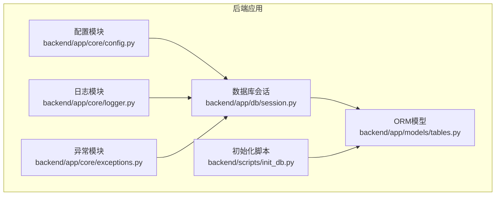
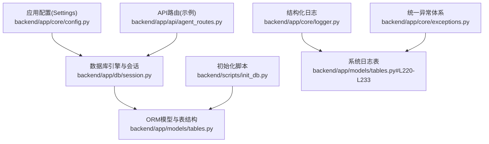
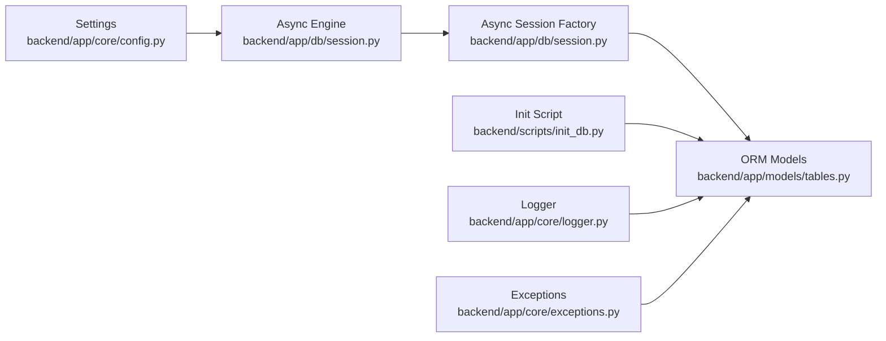

# 数据库安全配置

<cite>
**本文引用的文件**
- [backend/app/core/config.py](file://backend/app/core/config.py)
- [backend/app/db/session.py](file://backend/app/db/session.py)
- [backend/pyproject.toml](file://backend/pyproject.toml)
- [backend/scripts/init_db.py](file://backend/scripts/init_db.py)
- [backend/app/models/tables.py](file://backend/app/models/tables.py)
- [backend/app/api/agent_routes.py](file://backend/app/api/agent_routes.py)
- [backend/app/core/logger.py](file://backend/app/core/logger.py)
- [backend/app/core/exceptions.py](file://backend/app/core/exceptions.py)
- [ARCHITECTURE.md](file://ARCHITECTURE.md)
</cite>

## 目录
1. [引言](#引言)
2. [项目结构](#项目结构)
3. [核心组件](#核心组件)
4. [架构总览](#架构总览)
5. [详细组件分析](#详细组件分析)
6. [依赖分析](#依赖分析)
7. [性能考量](#性能考量)
8. [故障排查指南](#故障排查指南)
9. [结论](#结论)
10. [附录](#附录)

## 引言
本指南面向HotClaw项目的数据库安全配置，围绕访问控制、连接安全、敏感数据保护、数据库防火墙与入侵检测、备份安全以及安全事件响应等方面，结合现有代码实现与架构文档，给出可落地的实践建议与最佳实践。当前仓库中的数据库层采用异步SQLAlchemy与SQLite/PostgreSQL双栈配置，具备良好的扩展性与安全性基础。

## 项目结构
- 后端采用FastAPI + SQLAlchemy异步引擎，数据库连接通过配置模块集中管理，会话工厂提供依赖注入。
- 数据模型集中在ORM层，涵盖任务、节点执行、账号画像、文章草稿、审核结果、系统日志等核心实体。
- 初始化脚本负责创建数据库表结构，确保部署一致性。
- 日志与异常模块提供结构化日志与统一错误处理，便于审计与问题定位。

图表来源
- [backend/app/core/config.py:1-51](file://backend/app/core/config.py#L1-L51)
- [backend/app/db/session.py:1-33](file://backend/app/db/session.py#L1-L33)
- [backend/app/models/tables.py:1-233](file://backend/app/models/tables.py#L1-L233)
- [backend/scripts/init_db.py:1-16](file://backend/scripts/init_db.py#L1-L16)
- [backend/app/core/logger.py:1-36](file://backend/app/core/logger.py#L1-L36)
- [backend/app/core/exceptions.py:1-125](file://backend/app/core/exceptions.py#L1-L125)

章节来源
- [backend/app/core/config.py:1-51](file://backend/app/core/config.py#L1-L51)
- [backend/app/db/session.py:1-33](file://backend/app/db/session.py#L1-L33)
- [backend/app/models/tables.py:1-233](file://backend/app/models/tables.py#L1-L233)
- [backend/scripts/init_db.py:1-16](file://backend/scripts/init_db.py#L1-L16)
- [backend/app/core/logger.py:1-36](file://backend/app/core/logger.py#L1-L36)
- [backend/app/core/exceptions.py:1-125](file://backend/app/core/exceptions.py#L1-L125)

## 核心组件
- 配置与连接
  - 数据库URL通过环境变量注入，支持SQLite开发与PostgreSQL生产切换；异步引擎启用池预检（非SQLite）以提升连接稳定性。
- 会话管理
  - 异步会话工厂提供依赖注入，自动提交、回滚与关闭，简化事务管理。
- 数据模型
  - 包含任务、节点执行、账号画像、文章草稿、审核结果、系统日志等，覆盖全链路审计与回放需求。
- 初始化脚本
  - 通过元数据创建所有表，保证部署一致性。
- 日志与异常
  - 结构化日志与统一异常体系，便于审计与问题定位。

章节来源
- [backend/app/core/config.py:7-47](file://backend/app/core/config.py#L7-L47)
- [backend/app/db/session.py:8-33](file://backend/app/db/session.py#L8-L33)
- [backend/app/models/tables.py:23-233](file://backend/app/models/tables.py#L23-L233)
- [backend/scripts/init_db.py:8-16](file://backend/scripts/init_db.py#L8-L16)
- [backend/app/core/logger.py:8-36](file://backend/app/core/logger.py#L8-L36)
- [backend/app/core/exceptions.py:4-125](file://backend/app/core/exceptions.py#L4-L125)

## 架构总览
数据库安全贯穿于配置、连接、模型、日志与异常处理等环节，形成“配置驱动 + 会话治理 + 审计留痕”的整体安全架构。

图表来源
- [backend/app/core/config.py:7-47](file://backend/app/core/config.py#L7-L47)
- [backend/app/db/session.py:8-33](file://backend/app/db/session.py#L8-L33)
- [backend/app/models/tables.py:220-233](file://backend/app/models/tables.py#L220-L233)
- [backend/scripts/init_db.py:8-16](file://backend/scripts/init_db.py#L8-L16)
- [backend/app/core/logger.py:8-36](file://backend/app/core/logger.py#L8-L36)
- [backend/app/core/exceptions.py:4-125](file://backend/app/core/exceptions.py#L4-L125)
- [backend/app/api/agent_routes.py:17-115](file://backend/app/api/agent_routes.py#L17-L115)

## 详细组件分析

### 数据库访问控制与最小权限原则
- 当前实现现状
  - 数据库URL来自环境变量，未在代码中显式区分用户与角色；会话工厂统一管理事务与连接生命周期。
- 安全建议
  - 用户与角色
    - 在PostgreSQL中为不同组件（如API服务、审计服务、初始化脚本）创建专用数据库用户，授予最小必要权限。
    - 示例：API只读权限用于查询，初始化脚本使用DDL权限，审计与日志写入使用受限写权限。
  - 最小权限原则
    - 仅授予执行当前任务所需的权限，避免使用超级账户；定期审查权限变更。
  - 连接字符串
    - 在生产环境使用加密连接串（PostgreSQL SSL），并在应用侧启用TLS校验。
- 适用范围
  - 适用于生产环境的PostgreSQL部署；SQLite本地开发默认无需额外权限控制。

章节来源
- [backend/app/core/config.py:11-14](file://backend/app/core/config.py#L11-L14)
- [backend/app/db/session.py:8-19](file://backend/app/db/session.py#L8-L19)

### 数据库连接安全配置（SSL/TLS、认证、网络）
- 当前实现现状
  - 异步引擎在非SQLite场景启用池预检；未显式配置SSL参数。
- 安全建议
  - TLS/SSL
    - 在PostgreSQL连接串中启用客户端证书与服务器证书校验；设置sslmode为require或verify-full。
  - 认证方式
    - 使用强密码或证书认证；避免明文凭据；在容器/密钥管理服务中注入敏感信息。
  - 网络访问控制
    - 将数据库置于内网子网，限制来源IP；仅开放必要端口；使用防火墙策略。
- 适用范围
  - 生产环境PostgreSQL部署；开发环境可使用SQLite。

章节来源
- [backend/app/db/session.py:12](file://backend/app/db/session.py#L12)
- [backend/pyproject.toml:6-22](file://backend/pyproject.toml#L6-L22)

### 敏感数据保护（加密、脱敏、访问审计）
- 当前实现现状
  - 系统日志表包含结构化上下文与消息，支持审计与回放。
- 安全建议
  - 数据加密
    - 静态数据：启用数据库透明数据加密（TDE）；传输加密：强制TLS。
    - 敏感字段：对日志中的敏感上下文进行脱敏（如掩码、哈希）后再入库。
  - 访问审计
    - 通过系统日志表记录关键操作（如Agent配置更新、任务状态变更）；建立索引以便检索。
  - 脱敏处理
    - 在API层对敏感字段进行脱敏输出；仅在必要范围内展示原始数据。
- 适用范围
  - 所有涉及用户输入、任务上下文与系统配置的数据。

章节来源
- [backend/app/models/tables.py:220-233](file://backend/app/models/tables.py#L220-L233)
- [backend/app/api/agent_routes.py:74-115](file://backend/app/api/agent_routes.py#L74-L115)
- [backend/app/core/logger.py:8-36](file://backend/app/core/logger.py#L8-L36)

### 数据库防火墙与入侵检测（IP白名单、端口管理、异常监控）
- 当前实现现状
  - 未见数据库侧防火墙与入侵检测的具体实现。
- 安全建议
  - IP白名单
    - 限制数据库访问来源IP至应用服务器与运维网段；定期轮换与审计。
  - 端口管理
    - 仅开放数据库监听端口；使用非标准端口并配合网络ACL。
  - 异常监控
    - 基于系统日志表与数据库慢查询日志，建立告警规则（异常连接数、长时间锁等待、高频失败查询）。
- 适用范围
  - 生产数据库网络边界加固。

章节来源
- [backend/app/models/tables.py:220-233](file://backend/app/models/tables.py#L220-L233)
- [backend/app/core/logger.py:8-36](file://backend/app/core/logger.py#L8-L36)

### 备份数据的安全存储与传输（加密备份、安全归档）
- 当前实现现状
  - 未见专门的备份脚本与归档策略。
- 安全建议
  - 加密备份
    - 备份文件使用强加密算法；备份介质与传输通道均启用TLS。
  - 安全归档
    - 采用分层归档策略（热/温/冷）；对长期归档数据定期验证完整性。
  - 传输与恢复
    - 使用受信网络与隧道传输；恢复流程需验证完整性与权限控制。
- 适用范围
  - 生产数据库的例行备份与灾难恢复。

章节来源
- [backend/scripts/init_db.py:8-16](file://backend/scripts/init_db.py#L8-L16)

### 安全事件响应流程（违规检测、事件调查、恢复措施）
- 当前实现现状
  - 统一异常体系与结构化日志为事件响应提供基础。
- 安全建议
  - 违规检测
    - 基于系统日志表与数据库审计日志识别异常行为（越权访问、异常查询）。
  - 事件调查
    - 固化证据链：保留日志、会话ID、trace ID；交叉验证API与数据库操作。
  - 恢复措施
    - 快速隔离受影响实例；回滚到最近安全基线；修复漏洞后灰度上线。
- 适用范围
  - 全生命周期安全运营。

章节来源
- [backend/app/core/exceptions.py:4-125](file://backend/app/core/exceptions.py#L4-L125)
- [backend/app/core/logger.py:8-36](file://backend/app/core/logger.py#L8-L36)
- [backend/app/models/tables.py:220-233](file://backend/app/models/tables.py#L220-L233)

## 依赖分析
- 组件耦合
  - 配置模块驱动数据库引擎创建；会话工厂依赖配置；模型层与会话工厂双向关联；初始化脚本依赖模型元数据。
- 外部依赖
  - SQLAlchemy异步、asyncpg、aiosqlite等；Alembic用于迁移；结构化日志依赖structlog。
- 潜在风险
  - 开发与生产数据库类型差异导致的连接行为差异；日志中敏感信息未脱敏可能引发泄露。

图表来源
- [backend/app/core/config.py:7-47](file://backend/app/core/config.py#L7-L47)
- [backend/app/db/session.py:8-33](file://backend/app/db/session.py#L8-L33)
- [backend/app/models/tables.py:23-233](file://backend/app/models/tables.py#L23-L233)
- [backend/scripts/init_db.py:8-16](file://backend/scripts/init_db.py#L8-L16)
- [backend/app/core/logger.py:8-36](file://backend/app/core/logger.py#L8-L36)
- [backend/app/core/exceptions.py:4-125](file://backend/app/core/exceptions.py#L4-L125)

章节来源
- [backend/app/core/config.py:7-47](file://backend/app/core/config.py#L7-L47)
- [backend/app/db/session.py:8-33](file://backend/app/db/session.py#L8-L33)
- [backend/app/models/tables.py:23-233](file://backend/app/models/tables.py#L23-L233)
- [backend/scripts/init_db.py:8-16](file://backend/scripts/init_db.py#L8-L16)
- [backend/app/core/logger.py:8-36](file://backend/app/core/logger.py#L8-L36)
- [backend/app/core/exceptions.py:4-125](file://backend/app/core/exceptions.py#L4-L125)

## 性能考量
- 连接池与预检
  - 非SQLite启用池预检可减少无效连接；合理设置连接池大小与超时。
- 事务与回滚
  - 会话工厂自动提交/回滚，避免长事务占用资源；异常时及时回滚。
- 日志开销
  - 结构化日志JSON渲染与磁盘IO需评估；生产环境建议异步写入与滚动清理。

章节来源
- [backend/app/db/session.py:12](file://backend/app/db/session.py#L12)
- [backend/app/core/logger.py:12-30](file://backend/app/core/logger.py#L12-L30)

## 故障排查指南
- 连接失败
  - 检查数据库URL与凭据；确认SSL模式与证书配置；验证网络连通性与端口开放。
- 权限不足
  - 核对数据库用户权限；确认初始化脚本与API用户权限分离。
- 日志异常
  - 检查日志处理器配置；确认系统日志表存在且可写；排查JSON渲染异常。
- 事务回滚
  - 捕获异常后检查回滚逻辑；避免重复提交或悬挂事务。

章节来源
- [backend/app/core/config.py:11-14](file://backend/app/core/config.py#L11-L14)
- [backend/app/db/session.py:22-33](file://backend/app/db/session.py#L22-L33)
- [backend/app/core/logger.py:8-36](file://backend/app/core/logger.py#L8-L36)
- [backend/app/core/exceptions.py:4-125](file://backend/app/core/exceptions.py#L4-L125)

## 结论
HotClaw的数据库安全已具备良好基础：异步连接、统一配置、结构化日志与异常体系。建议在生产环境中补充SSL/TLS、最小权限、敏感数据脱敏、数据库防火墙与入侵检测、加密备份与归档、以及完善的安全事件响应流程，以满足更高等级的安全要求。

## 附录
- 架构设计要点
  - 设计原则强调“最小权限原则”“可审计可回放”，为数据库安全提供了理念支撑。
- 数据模型概览
  - 任务、节点执行、账号画像、文章草稿、审核结果、系统日志等模型覆盖全链路审计。

章节来源
- [ARCHITECTURE.md:94-125](file://ARCHITECTURE.md#L94-L125)
- [backend/app/models/tables.py:23-233](file://backend/app/models/tables.py#L23-L233)