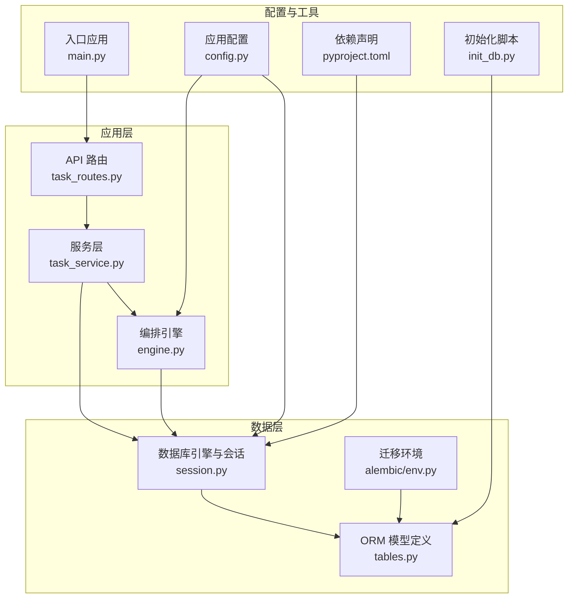
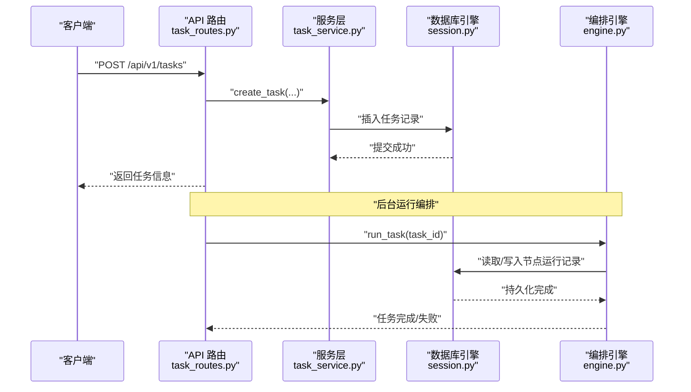
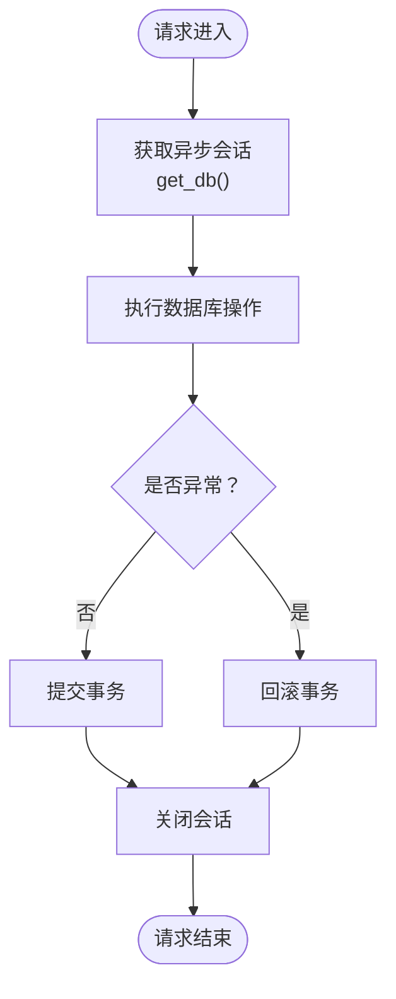
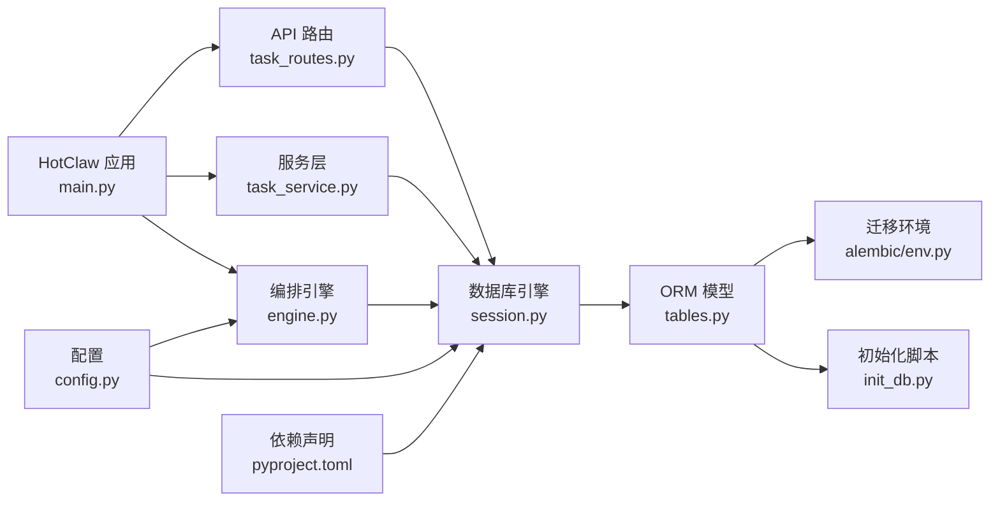

# 数据库性能优化

<cite>
**本文引用的文件**
- [backend/app/db/session.py](file://backend/app/db/session.py)
- [backend/app/core/config.py](file://backend/app/core/config.py)
- [backend/app/models/tables.py](file://backend/app/models/tables.py)
- [backend/app/api/task_routes.py](file://backend/app/api/task_routes.py)
- [backend/app/services/task_service.py](file://backend/app/services/task_service.py)
- [backend/app/orchestrator/engine.py](file://backend/app/orchestrator/engine.py)
- [backend/scripts/init_db.py](file://backend/scripts/init_db.py)
- [backend/alembic/env.py](file://backend/alembic/env.py)
- [backend/pyproject.toml](file://backend/pyproject.toml)
- [backend/app/main.py](file://backend/app/main.py)
</cite>

## 目录
1. [简介](#简介)
2. [项目结构](#项目结构)
3. [核心组件](#核心组件)
4. [架构总览](#架构总览)
5. [详细组件分析](#详细组件分析)
6. [依赖分析](#依赖分析)
7. [性能考量](#性能考量)
8. [故障排查指南](#故障排查指南)
9. [结论](#结论)
10. [附录](#附录)

## 简介
本指南面向HotClaw后端数据库性能优化，结合现有代码实现，系统阐述以下主题：性能监控指标（查询响应时间、连接数限制、内存使用）、索引优化策略（复合索引设计、覆盖索引、索引维护）、SQL查询优化技巧（执行计划分析、查询重写、参数化查询）、连接池配置与管理（最大连接数、超时设置、连接复用策略）、数据库参数调优（共享缓冲区、工作内存、后台进程）以及性能瓶颈识别与解决方案（慢查询分析、锁竞争处理）。文档以“可落地”为原则，所有建议均与实际代码实现相对应。

## 项目结构
后端采用FastAPI + SQLAlchemy异步ORM + Alembic迁移的典型架构。数据库层通过异步引擎与会话工厂提供连接池能力；业务API路由调用服务层，服务层通过ORM进行数据访问；任务编排引擎在运行期对数据库进行高频读写。

图表来源
- [backend/app/api/task_routes.py:1-163](file://backend/app/api/task_routes.py#L1-L163)
- [backend/app/services/task_service.py:1-126](file://backend/app/services/task_service.py#L1-L126)
- [backend/app/orchestrator/engine.py:1-285](file://backend/app/orchestrator/engine.py#L1-L285)
- [backend/app/db/session.py:1-33](file://backend/app/db/session.py#L1-L33)
- [backend/app/models/tables.py:1-233](file://backend/app/models/tables.py#L1-L233)
- [backend/alembic/env.py:1-53](file://backend/alembic/env.py#L1-L53)
- [backend/scripts/init_db.py:1-16](file://backend/scripts/init_db.py#L1-L16)
- [backend/app/main.py:1-142](file://backend/app/main.py#L1-L142)
- [backend/app/core/config.py:1-51](file://backend/app/core/config.py#L1-L51)
- [backend/pyproject.toml:1-41](file://backend/pyproject.toml#L1-L41)

章节来源
- [backend/app/main.py:42-58](file://backend/app/main.py#L42-L58)
- [backend/app/db/session.py:8-19](file://backend/app/db/session.py#L8-L19)
- [backend/app/models/tables.py:220-233](file://backend/app/models/tables.py#L220-L233)

## 核心组件
- 数据库引擎与会话
  - 使用异步引擎与异步会话工厂，默认开启回环检测（除SQLite外），支持调试输出。
  - 提供FastAPI依赖注入式会话获取，自动提交、回滚与关闭。
- 配置中心
  - 统一管理数据库URL、调试开关、超时等参数，影响连接池行为与运行时性能。
- ORM模型
  - 定义核心表及字段类型，部分字段建立索引（如系统日志表的trace_id、task_id）。
- 服务层
  - 提供分页、计数、关联加载等常用查询模式，是性能优化的关键落点。
- 编排引擎
  - 在任务生命周期内频繁读写数据库，是性能压力的主要来源之一。
- 迁移与初始化
  - Alembic异步迁移环境；开发模式下启动即建表。

章节来源
- [backend/app/db/session.py:8-33](file://backend/app/db/session.py#L8-L33)
- [backend/app/core/config.py:7-51](file://backend/app/core/config.py#L7-L51)
- [backend/app/models/tables.py:23-233](file://backend/app/models/tables.py#L23-L233)
- [backend/app/services/task_service.py:80-102](file://backend/app/services/task_service.py#L80-L102)
- [backend/app/orchestrator/engine.py:92-234](file://backend/app/orchestrator/engine.py#L92-L234)
- [backend/alembic/env.py:34-46](file://backend/alembic/env.py#L34-L46)
- [backend/scripts/init_db.py:8-11](file://backend/scripts/init_db.py#L8-L11)

## 架构总览
数据库访问路径贯穿API路由、服务层与编排引擎。请求进入API路由后，服务层执行查询或写入，编排引擎在任务执行过程中持续更新节点运行记录与任务状态。连接池默认启用回环检测（非SQLite），调试模式下可开启SQL回显，便于性能诊断。

图表来源
- [backend/app/api/task_routes.py:19-51](file://backend/app/api/task_routes.py#L19-L51)
- [backend/app/services/task_service.py:22-37](file://backend/app/services/task_service.py#L22-L37)
- [backend/app/orchestrator/engine.py:92-234](file://backend/app/orchestrator/engine.py#L92-L234)
- [backend/app/db/session.py:22-33](file://backend/app/db/session.py#L22-L33)

## 详细组件分析

### 数据库连接与会话管理
- 异步引擎创建：根据配置决定是否启用回环检测；调试模式下开启SQL回显。
- 会话工厂：禁用自动过期，减少事务边界带来的刷新成本。
- FastAPI依赖：按请求粒度提供会话，异常时自动回滚并关闭，确保资源回收。

图表来源
- [backend/app/db/session.py:22-33](file://backend/app/db/session.py#L22-L33)

章节来源
- [backend/app/db/session.py:8-19](file://backend/app/db/session.py#L8-L19)
- [backend/app/db/session.py:22-33](file://backend/app/db/session.py#L22-L33)

### ORM模型与索引现状
- 已有索引字段
  - 系统日志表：trace_id、task_id 建有索引，有利于按追踪ID与任务ID检索。
- 建议新增索引
  - 任务表：status、created_at（分页与筛选）
  - 任务节点运行表：task_id、status、created_at（节点查询与统计）
  - 文档与审计结果：多处涉及外键查询，建议在task_id、draft_id等字段建立索引
- 复合索引设计
  - 任务列表按创建时间倒序分页，可考虑(status, created_at)复合索引
  - 节点运行按任务维度查询，可考虑(task_id, created_at)复合索引
- 覆盖索引
  - 对于高频查询（如任务状态统计、节点运行概览），可建立仅包含查询所需列的索引，避免回表

章节来源
- [backend/app/models/tables.py:220-233](file://backend/app/models/tables.py#L220-L233)

### SQL查询优化实践
- 执行计划分析
  - 开启调试模式（app_debug）查看SQL回显，结合索引使用情况判断是否命中索引
  - 利用数据库自带EXPLAIN/ANALYZE能力（需在数据库侧执行）观察扫描方式与代价
- 查询重写
  - 分页查询：使用offset/limit时，优先按主键或索引列排序，避免大offset
  - 关联查询：尽量使用JOIN替代N+1查询；必要时使用selectinload减少往返
  - 计数优化：对复杂过滤条件使用子查询计数，避免重复扫描全表
- 参数化查询
  - 所有动态值使用参数绑定，防止SQL注入并提升缓存命中率

章节来源
- [backend/app/services/task_service.py:80-102](file://backend/app/services/task_service.py#L80-L102)
- [backend/app/api/task_routes.py:136-162](file://backend/app/api/task_routes.py#L136-L162)

### 连接池配置与管理
- 当前实现
  - 默认启用回环检测（非SQLite），有助于发现失效连接
  - 调试模式开启SQL回显，便于定位性能问题
- 生产建议
  - 最大连接数：依据并发请求数与数据库承载能力设定，避免过度占用
  - 超时设置：连接超时、查询超时与应用超时保持一致层级，避免资源泄漏
  - 连接复用策略：避免在同一请求中频繁创建/销毁会话，优先复用依赖注入提供的会话
  - 连接池监控：关注活跃连接数、等待队列长度、连接拒绝次数等指标

章节来源
- [backend/app/db/session.py:8-19](file://backend/app/db/session.py#L8-L19)
- [backend/app/core/config.py:42-46](file://backend/app/core/config.py#L42-L46)

### 数据库参数调优
- 共享缓冲区
  - 用于缓存表与索引数据，适当增大可降低磁盘I/O，但需平衡内存占用
- 工作内存
  - 排序、哈希等临时操作的内存预算，针对大查询或复杂JOIN适当上调
- 后台进程
  - 归档、清理、统计信息收集等后台任务数量与频率，避免与高峰期冲突
- 注意事项
  - 参数调整需结合实际负载与硬件资源，逐步验证效果

（本节为通用指导，不直接对应具体源码）

### 性能瓶颈识别与解决方案
- 慢查询分析
  - 通过调试SQL回显与数据库慢查询日志定位热点SQL
  - 结合索引策略与查询重写解决
- 锁竞争处理
  - 减少长事务，尽早提交或回滚
  - 将批量写入拆分为小批次，降低锁持有时间
  - 使用合适的隔离级别，避免不必要的行级锁升级

章节来源
- [backend/app/db/session.py:9-12](file://backend/app/db/session.py#L9-L12)
- [backend/app/services/task_service.py:46-58](file://backend/app/services/task_service.py#L46-L58)

## 依赖分析
- 应用依赖
  - FastAPI、SQLAlchemy异步、asyncpg、Alembic、structlog等
- 数据库驱动
  - 开发使用SQLite，生产使用PostgreSQL；驱动分别为aiosqlite与asyncpg
- 迁移与初始化
  - Alembic异步迁移；开发模式启动时自动建表

图表来源
- [backend/app/main.py:14-28](file://backend/app/main.py#L14-L28)
- [backend/app/api/task_routes.py:1-163](file://backend/app/api/task_routes.py#L1-L163)
- [backend/app/services/task_service.py:1-126](file://backend/app/services/task_service.py#L1-L126)
- [backend/app/orchestrator/engine.py:1-285](file://backend/app/orchestrator/engine.py#L1-L285)
- [backend/app/db/session.py:1-33](file://backend/app/db/session.py#L1-L33)
- [backend/app/models/tables.py:1-233](file://backend/app/models/tables.py#L1-L233)
- [backend/alembic/env.py:1-53](file://backend/alembic/env.py#L1-L53)
- [backend/scripts/init_db.py:1-16](file://backend/scripts/init_db.py#L1-L16)
- [backend/app/core/config.py:1-51](file://backend/app/core/config.py#L1-L51)
- [backend/pyproject.toml:1-41](file://backend/pyproject.toml#L1-L41)

章节来源
- [backend/pyproject.toml:6-22](file://backend/pyproject.toml#L6-L22)
- [backend/alembic/env.py:9-18](file://backend/alembic/env.py#L9-L18)
- [backend/scripts/init_db.py:8-11](file://backend/scripts/init_db.py#L8-L11)

## 性能考量
- 查询响应时间
  - 通过索引优化与查询重写降低扫描范围与排序成本
  - 使用参数化查询与连接复用减少编译与握手开销
- 连接数限制
  - 合理设置最大连接数，避免数据库连接耗尽
  - 控制事务时长，及时提交或回滚
- 内存使用情况
  - 调整共享缓冲区与工作内存参数，平衡I/O与CPU
  - 避免一次性加载过多数据，采用分页与流式处理

（本节为通用指导，不直接对应具体源码）

## 故障排查指南
- 连接池相关
  - 若出现连接拒绝或超时，检查最大连接数与超时配置，确认是否存在长时间未释放的事务
- 查询性能问题
  - 开启调试SQL回显，定位未命中索引的查询；补充复合索引或重写查询
- 事务与锁
  - 观察长事务与锁等待现象，拆分批量操作，缩短事务边界
- 日志与追踪
  - 利用结构化日志与追踪ID定位问题发生链路

章节来源
- [backend/app/db/session.py:9-12](file://backend/app/db/session.py#L9-L12)
- [backend/app/core/logger.py:8-36](file://backend/app/core/logger.py#L8-L36)

## 结论
HotClaw当前基于异步ORM与连接池实现了良好的并发基础。围绕索引优化、查询重写、连接池配置与参数调优，可进一步提升数据库整体性能与稳定性。建议在开发与测试环境中先行验证优化方案，再逐步推广至生产环境，并持续监控关键指标以保障服务质量。

## 附录
- 快速检查清单
  - 是否为高频查询字段建立合适索引（含复合索引）
  - 是否使用参数化查询与连接复用
  - 是否存在长事务与大批量写入
  - 是否开启调试SQL回显辅助定位问题
  - 是否根据负载合理设置连接池参数