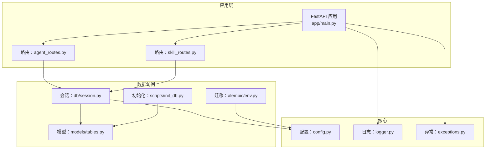
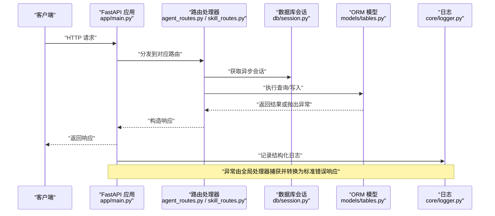
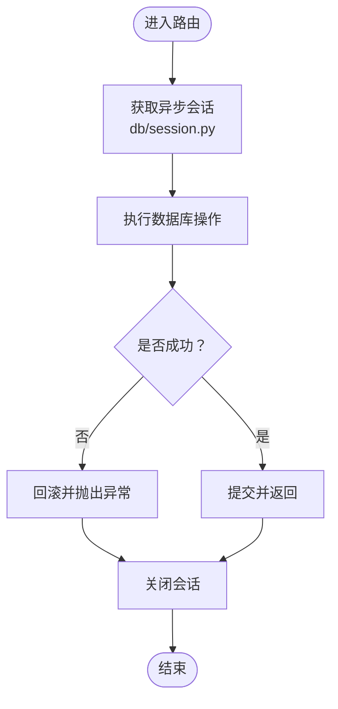
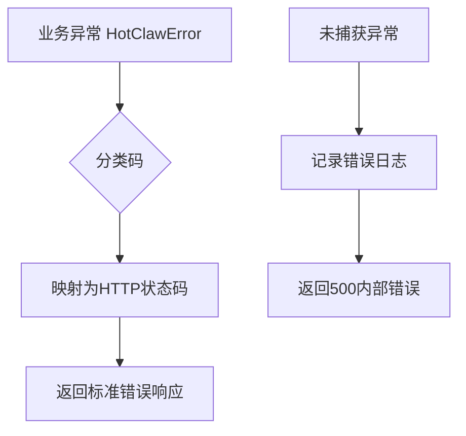
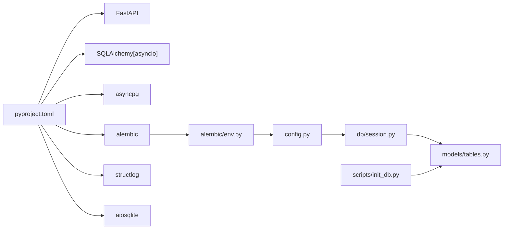

# 数据库故障排除

<cite>
**本文引用的文件**
- [backend/app/core/config.py](file://backend/app/core/config.py)
- [backend/app/db/session.py](file://backend/app/db/session.py)
- [backend/app/core/logger.py](file://backend/app/core/logger.py)
- [backend/app/main.py](file://backend/app/main.py)
- [backend/app/models/tables.py](file://backend/app/models/tables.py)
- [backend/alembic/env.py](file://backend/alembic/env.py)
- [scripts/init_db.py](file://scripts/init_db.py)
- [backend/pyproject.toml](file://backend/pyproject.toml)
- [backend/app/api/agent_routes.py](file://backend/app/api/agent_routes.py)
- [backend/app/api/skill_routes.py](file://backend/app/api/skill_routes.py)
- [backend/app/core/exceptions.py](file://backend/app/core/exceptions.py)
</cite>

## 目录
1. [引言](#引言)
2. [项目结构](#项目结构)
3. [核心组件](#核心组件)
4. [架构总览](#架构总览)
5. [详细组件分析](#详细组件分析)
6. [依赖分析](#依赖分析)
7. [性能考虑](#性能考虑)
8. [故障排除指南](#故障排除指南)
9. [结论](#结论)
10. [附录](#附录)

## 引言
本指南面向HotClaw后端数据库的运维与开发人员，聚焦于数据库连接、会话管理、异常与日志、迁移与初始化等关键环节，提供可操作的故障诊断步骤、日志分析方法、监控与告警建议以及紧急处置流程。文档严格基于仓库中实际实现，避免臆测，确保读者能快速定位并解决问题。

## 项目结构
后端采用FastAPI + SQLAlchemy异步引擎，数据库连接通过异步会话工厂管理；开发环境默认使用SQLite，生产环境推荐PostgreSQL；日志采用structlog结构化输出；迁移使用Alembic；数据库初始化脚本负责建表。



图表来源
- [backend/app/main.py:1-142](file://backend/app/main.py#L1-L142)
- [backend/app/db/session.py:1-33](file://backend/app/db/session.py#L1-L33)
- [backend/app/core/config.py:1-51](file://backend/app/core/config.py#L1-L51)
- [backend/app/models/tables.py:1-233](file://backend/app/models/tables.py#L1-L233)
- [backend/alembic/env.py:1-53](file://backend/alembic/env.py#L1-L53)
- [scripts/init_db.py:1-16](file://scripts/init_db.py#L1-L16)

章节来源
- [backend/app/main.py:1-142](file://backend/app/main.py#L1-L142)
- [backend/app/db/session.py:1-33](file://backend/app/db/session.py#L1-L33)
- [backend/app/core/config.py:1-51](file://backend/app/core/config.py#L1-L51)
- [backend/app/models/tables.py:1-233](file://backend/app/models/tables.py#L1-L233)
- [backend/alembic/env.py:1-53](file://backend/alembic/env.py#L1-L53)
- [scripts/init_db.py:1-16](file://scripts/init_db.py#L1-L16)

## 核心组件
- 配置中心：集中管理数据库URL、Redis、日志级别、超时等参数，支持从环境变量加载。
- 异步会话工厂：根据数据库类型动态启用或禁用连接预检（pool_pre_ping），在开发模式下开启SQL回显便于调试。
- 结构化日志：统一JSON格式输出，包含时间戳、级别、模块名、堆栈信息等，便于集中采集与检索。
- 统一异常体系：将业务错误映射为HTTP状态码，便于前端与监控系统识别。
- 模型定义：涵盖任务、节点执行、账号画像、话题候选、文章草稿、审计结果、代理与技能、工作流模板、系统日志等。
- 迁移与初始化：Alembic异步环境适配；脚本式建表初始化。

章节来源
- [backend/app/core/config.py:1-51](file://backend/app/core/config.py#L1-L51)
- [backend/app/db/session.py:1-33](file://backend/app/db/session.py#L1-L33)
- [backend/app/core/logger.py:1-36](file://backend/app/core/logger.py#L1-L36)
- [backend/app/core/exceptions.py:1-125](file://backend/app/core/exceptions.py#L1-L125)
- [backend/app/models/tables.py:1-233](file://backend/app/models/tables.py#L1-L233)
- [backend/alembic/env.py:1-53](file://backend/alembic/env.py#L1-L53)
- [scripts/init_db.py:1-16](file://scripts/init_db.py#L1-L16)

## 架构总览
下图展示请求在应用中的流转、数据库交互与异常处理路径，帮助理解故障发生的可能位置与排查方向。



图表来源
- [backend/app/main.py:1-142](file://backend/app/main.py#L1-L142)
- [backend/app/api/agent_routes.py:1-115](file://backend/app/api/agent_routes.py#L1-L115)
- [backend/app/api/skill_routes.py:1-61](file://backend/app/api/skill_routes.py#L1-L61)
- [backend/app/db/session.py:1-33](file://backend/app/db/session.py#L1-L33)
- [backend/app/models/tables.py:1-233](file://backend/app/models/tables.py#L1-L233)
- [backend/app/core/logger.py:1-36](file://backend/app/core/logger.py#L1-L36)

## 详细组件分析

### 数据库连接与会话管理
- 引擎创建：依据配置决定数据库URL，开发模式下开启SQL回显；非SQLite时启用连接预检以检测断连并自动重连。
- 会话工厂：使用异步会话类，关闭自动过期，提交/回滚/关闭在依赖yield后统一处理，保证异常时回滚与清理。
- 路由依赖：各路由通过FastAPI依赖注入获取会话，确保生命周期与请求绑定。



图表来源
- [backend/app/db/session.py:1-33](file://backend/app/db/session.py#L1-L33)
- [backend/app/api/agent_routes.py:1-115](file://backend/app/api/agent_routes.py#L1-L115)
- [backend/app/api/skill_routes.py:1-61](file://backend/app/api/skill_routes.py#L1-L61)

章节来源
- [backend/app/db/session.py:1-33](file://backend/app/db/session.py#L1-L33)
- [backend/app/api/agent_routes.py:1-115](file://backend/app/api/agent_routes.py#L1-L115)
- [backend/app/api/skill_routes.py:1-61](file://backend/app/api/skill_routes.py#L1-L61)

### 配置与环境
- 数据库URL：开发默认SQLite，生产建议PostgreSQL；可通过环境变量覆盖。
- 日志级别：通过配置项控制，影响结构化日志输出。
- 超时：提供代理、技能、LLM等超时配置，便于定位超时类问题。

章节来源
- [backend/app/core/config.py:1-51](file://backend/app/core/config.py#L1-L51)

### 结构化日志与异常处理
- 日志：结构化JSON输出，包含时间戳、级别、模块、上下文、堆栈等，便于集中采集与检索。
- 全局异常：将自定义错误映射为HTTP状态码；特殊业务码有特例处理；未捕获异常统一返回内部错误。



图表来源
- [backend/app/core/logger.py:1-36](file://backend/app/core/logger.py#L1-L36)
- [backend/app/core/exceptions.py:1-125](file://backend/app/core/exceptions.py#L1-L125)
- [backend/app/main.py:87-129](file://backend/app/main.py#L87-L129)

章节来源
- [backend/app/core/logger.py:1-36](file://backend/app/core/logger.py#L1-L36)
- [backend/app/core/exceptions.py:1-125](file://backend/app/core/exceptions.py#L1-L125)
- [backend/app/main.py:87-129](file://backend/app/main.py#L87-L129)

### 模型与迁移
- 模型：涵盖任务全生命周期、节点执行、账号画像、话题候选、文章草稿、审计结果、代理与技能、工作流模板、系统日志等。
- 迁移：Alembic异步环境适配，读取配置中的数据库URL，支持离线/在线迁移。
- 初始化：脚本式建表，直接对元数据执行创建。

```mermaid
erDiagram
TASKS {
string id PK
string workflow_id
string status
json input_data
json result_data
text error_message
float elapsed_seconds
int total_tokens
datetime created_at
datetime updated_at
}
TASK_NODE_RUNS {
int id PK
string task_id FK
string node_id
string agent_id
string status
json input_data
json output_data
text error_message
float elapsed_seconds
int prompt_tokens
int completion_tokens
string model_used
int retry_count
datetime created_at
datetime updated_at
}
ACCOUNT_PROFILES {
int id PK
string task_id FK UK
text positioning
string domain
string subdomain
json target_audience
string tone
string content_style
json keywords
datetime created_at
datetime updated_at
}
TOPIC_CANDIDATES {
int id PK
string task_id FK
string title
text angle
text hook
string target_emotion
float estimated_appeal
text reasoning
int rank
bool selected
datetime created_at
datetime updated_at
}
ARTICLE_DRAFTS {
int id PK
string task_id FK
string title
text content_markdown
text content_html
int word_count
json structure
json tags
string status
datetime created_at
datetime updated_at
}
AUDIT_RESULTS {
int id PK
string task_id FK
int draft_id FK
bool passed
string risk_level
json issues
text overall_comment
datetime created_at
datetime updated_at
}
AGENTS {
string agent_id PK
string name
text description
string version
string module_path
json model_config_data
text prompt_template
json input_schema
json output_schema
json required_skills
json retry_config
json fallback_config
string status
datetime created_at
datetime updated_at
}
SKILLS {
string skill_id PK
string name
text description
string version
string module_path
json input_schema
json output_schema
json config_data
string status
datetime created_at
datetime updated_at
}
WORKFLOW_TEMPLATES {
string workflow_id PK
string name
text description
string version
json definition
json input_schema
json output_mapping
string status
datetime created_at
datetime updated_at
}
SYSTEM_LOGS {
int id PK
string trace_id
string task_id
string node_id
string level
string module
text message
json context
datetime created_at
}
TASKS ||--o{ TASK_NODE_RUNS : "包含"
TASKS ||--|| ACCOUNT_PROFILES : "拥有"
TASKS ||--o{ TOPIC_CANDIDATES : "生成"
TASKS ||--o{ ARTICLE_DRAFTS : "驱动"
ARTICLE_DRAFTS ||--|| AUDIT_RESULTS : "被审计"
```

图表来源
- [backend/app/models/tables.py:1-233](file://backend/app/models/tables.py#L1-L233)

章节来源
- [backend/app/models/tables.py:1-233](file://backend/app/models/tables.py#L1-L233)
- [backend/alembic/env.py:1-53](file://backend/alembic/env.py#L1-L53)
- [scripts/init_db.py:1-16](file://scripts/init_db.py#L1-L16)

## 依赖分析
- 运行时依赖：FastAPI、SQLAlchemy异步、asyncpg、alembic、structlog、aiosqlite等。
- 关键耦合点：路由依赖会话工厂；会话工厂依赖配置；迁移与初始化依赖配置与模型元数据。
- 外部接口：数据库URL、Redis URL、LLM API等通过配置注入。



图表来源
- [backend/pyproject.toml:1-41](file://backend/pyproject.toml#L1-L41)
- [backend/app/core/config.py:1-51](file://backend/app/core/config.py#L1-L51)
- [backend/app/db/session.py:1-33](file://backend/app/db/session.py#L1-L33)
- [backend/app/models/tables.py:1-233](file://backend/app/models/tables.py#L1-L233)
- [backend/alembic/env.py:1-53](file://backend/alembic/env.py#L1-L53)
- [scripts/init_db.py:1-16](file://scripts/init_db.py#L1-L16)

章节来源
- [backend/pyproject.toml:1-41](file://backend/pyproject.toml#L1-L41)
- [backend/app/core/config.py:1-51](file://backend/app/core/config.py#L1-L51)
- [backend/app/db/session.py:1-33](file://backend/app/db/session.py#L1-L33)
- [backend/app/models/tables.py:1-233](file://backend/app/models/tables.py#L1-L233)
- [backend/alembic/env.py:1-53](file://backend/alembic/env.py#L1-L53)
- [scripts/init_db.py:1-16](file://scripts/init_db.py#L1-L16)

## 性能考虑
- 连接池与预检：非SQLite启用pool_pre_ping可提升稳定性；注意连接数上限与并发峰值。
- SQL回显：开发模式开启有助于定位慢查询，但生产应关闭以减少开销。
- 查询设计：路由中存在批量查询与条件过滤示例，建议结合索引与分页优化。
- 日志成本：结构化日志JSON序列化与IO开销需关注，建议按级别与采样策略控制。

[本节为通用指导，不涉及具体文件分析]

## 故障排除指南

### 一、连接超时
- 现象特征
  - 客户端侧出现超时错误。
  - 后端日志出现数据库连接失败或超时相关记录。
- 快速检查
  - 确认数据库URL正确且可达（开发：SQLite文件存在；生产：PostgreSQL服务可用）。
  - 检查网络连通性与防火墙策略。
  - 查看会话工厂是否启用连接预检（非SQLite）。
- 诊断步骤
  - 开启SQL回显（开发模式）观察语句执行。
  - 使用数据库自带的连接数与等待事件监控（如PostgreSQL的活动会话视图）。
  - 检查路由依赖的会话是否在异常时正确回滚与关闭。
- 解决建议
  - 增加连接池大小与超时阈值（谨慎评估资源占用）。
  - 将长事务拆分为短事务，减少锁竞争。
  - 在路由层增加重试与降级策略（例如对只读查询进行幂等重试）。

章节来源
- [backend/app/db/session.py:1-33](file://backend/app/db/session.py#L1-L33)
- [backend/app/core/config.py:1-51](file://backend/app/core/config.py#L1-L51)
- [backend/app/main.py:87-129](file://backend/app/main.py#L87-L129)

### 二、查询阻塞与锁等待
- 现象特征
  - 请求长时间无响应，数据库显示锁等待或进程阻塞。
  - 日志中出现长时间事务或重复重试。
- 快速检查
  - 检查是否存在长事务未提交或未关闭。
  - 确认热点数据更新是否集中在少数记录上。
- 诊断步骤
  - 在数据库侧查看当前活跃事务与锁等待列表（如PostgreSQL的锁视图）。
  - 回溯最近的日志，定位触发阻塞的请求与SQL。
  - 分析模型关系与外键约束，避免级联删除/更新引发的锁升级。
- 解决建议
  - 将大事务拆分为小事务，减少持有锁的时间。
  - 对热点字段建立合适索引，降低扫描范围。
  - 使用SELECT FOR UPDATE时指定LIMIT并尽快释放锁。

章节来源
- [backend/app/db/session.py:1-33](file://backend/app/db/session.py#L1-L33)
- [backend/app/models/tables.py:1-233](file://backend/app/models/tables.py#L1-L233)
- [backend/app/api/agent_routes.py:1-115](file://backend/app/api/agent_routes.py#L1-L115)
- [backend/app/api/skill_routes.py:1-61](file://backend/app/api/skill_routes.py#L1-L61)

### 三、资源耗尽（连接/内存/CPU）
- 现象特征
  - 连接池耗尽、数据库拒绝新连接。
  - 内存持续增长、GC频繁。
  - CPU占用高，响应延迟显著上升。
- 快速检查
  - 检查连接池配置与当前连接数。
  - 观察会话生命周期是否正确（提交/回滚/关闭）。
- 诊断步骤
  - 使用数据库监控查看连接数、缓存命中率、慢查询比例。
  - 结合结构化日志定位高频调用与异常路径。
- 解决建议
  - 调整连接池大小与回收策略，避免泄漏。
  - 优化查询与索引，减少不必要的JOIN与子查询。
  - 对大对象（JSON）进行分表或归档，降低单表膨胀。

章节来源
- [backend/app/db/session.py:1-33](file://backend/app/db/session.py#L1-L33)
- [backend/app/core/logger.py:1-36](file://backend/app/core/logger.py#L1-L36)
- [backend/app/core/config.py:1-51](file://backend/app/core/config.py#L1-L51)

### 四、日志分析技巧
- 错误日志解读
  - 使用结构化日志的level、module、trace_id定位问题来源。
  - 结合X-Trace-Id在请求链路中串联日志。
- 慢查询日志分析
  - 在开发环境开启SQL回显，配合数据库慢查询日志对比定位。
  - 关注路由层批量查询与复杂表达式。
- 性能分析器使用
  - 使用数据库性能分析视图（如EXPLAIN/ANALYZE）评估执行计划。
  - 结合应用日志统计关键路径耗时。

章节来源
- [backend/app/core/logger.py:1-36](file://backend/app/core/logger.py#L1-L36)
- [backend/app/main.py:77-84](file://backend/app/main.py#L77-L84)
- [backend/app/db/session.py:1-33](file://backend/app/db/session.py#L1-L33)

### 五、监控与告警
- 系统资源监控
  - CPU、内存、磁盘IO与网络带宽。
- 数据库性能指标
  - 连接数、每秒事务数、慢查询比例、锁等待时间、缓冲区命中率。
- 告警配置
  - 建议针对连接池耗尽、慢查询比例突增、错误率上升设置阈值告警。
  - 将关键错误码（如特定业务异常）纳入告警。

[本节为通用指导，不涉及具体文件分析]

### 六、死锁检测与解决
- 死锁识别
  - 数据库报告死锁错误；应用日志出现循环等待或重试失败。
- 死锁日志分析
  - 提取trace_id，回溯两条以上事务的SQL与锁顺序。
- 事务优化策略
  - 统一锁顺序，避免交叉依赖。
  - 缩短事务时间，减少持有锁的范围。
  - 对并发写入进行去重与合并，降低冲突概率。

[本节为通用指导，不涉及具体文件分析]

### 七、崩溃恢复流程
- 崩溃检测
  - 应用健康检查接口与数据库连接探测。
  - 监控系统异常中断与错误日志激增。
- 自动恢复
  - 重启应用后自动重建数据库表（开发模式）。
  - 检查会话工厂与连接池状态。
- 数据修复
  - 使用Alembic迁移修复结构差异。
  - 对异常状态的任务与节点执行记录进行人工核对与修正。

章节来源
- [backend/app/main.py:42-58](file://backend/app/main.py#L42-L58)
- [backend/alembic/env.py:1-53](file://backend/alembic/env.py#L1-L53)
- [scripts/init_db.py:1-16](file://scripts/init_db.py#L1-L16)

### 八、紧急处置与沟通
- 应急处理
  - 降级非关键功能，优先保障核心任务流程。
  - 临时扩容连接池与资源，限制并发。
- 沟通协调
  - 明确故障等级与影响范围，同步至值班群组。
  - 记录trace_id与关键日志片段，便于复盘。

[本节为通用指导，不涉及具体文件分析]

## 结论
本指南基于HotClaw后端的实际实现，围绕数据库连接、会话管理、异常与日志、迁移与初始化等关键点，提供了系统化的故障诊断与解决思路。建议在生产环境中关闭SQL回显，完善监控与告警，并定期演练崩溃恢复流程，以提升系统的稳定性与可维护性。

## 附录
- 常用命令参考
  - 初始化数据库：运行脚本式建表。
  - 执行迁移：使用Alembic异步迁移入口。
- 参考文件清单
  - 配置：[backend/app/core/config.py](file://backend/app/core/config.py)
  - 会话：[backend/app/db/session.py](file://backend/app/db/session.py)
  - 日志：[backend/app/core/logger.py](file://backend/app/core/logger.py)
  - 异常：[backend/app/core/exceptions.py](file://backend/app/core/exceptions.py)
  - 模型：[backend/app/models/tables.py](file://backend/app/models/tables.py)
  - 迁移：[backend/alembic/env.py](file://backend/alembic/env.py)
  - 初始化：[scripts/init_db.py](file://scripts/init_db.py)
  - 应用入口：[backend/app/main.py](file://backend/app/main.py)
  - 依赖：[backend/pyproject.toml](file://backend/pyproject.toml)