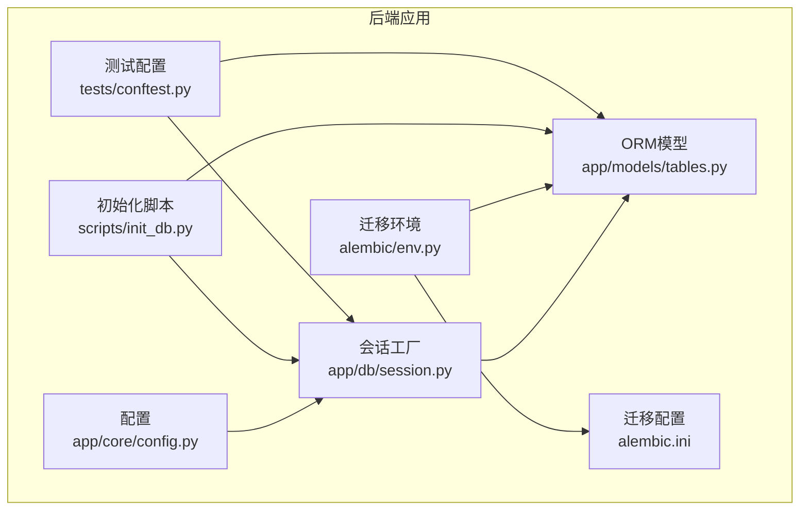
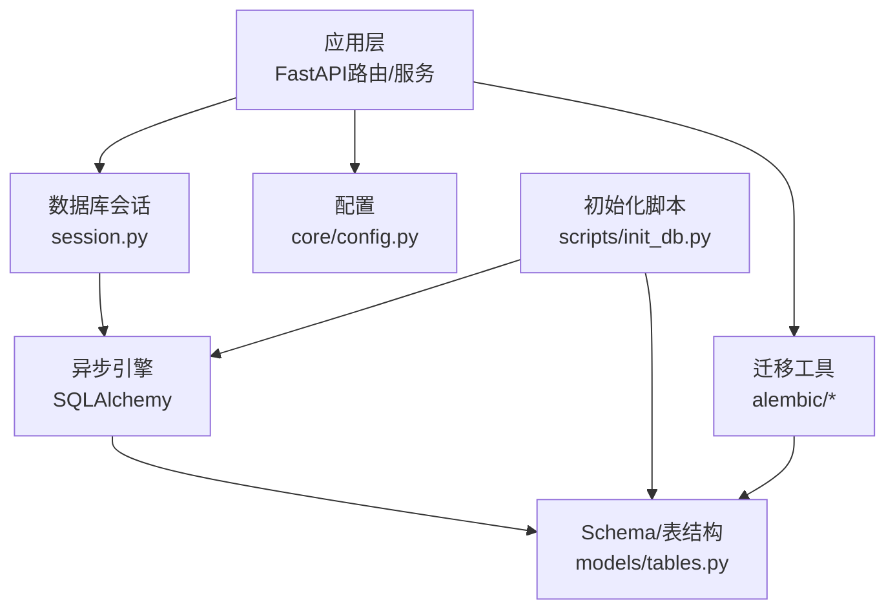
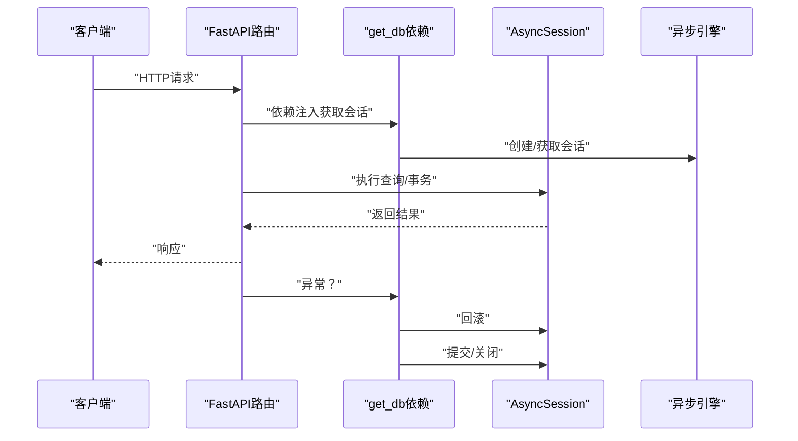
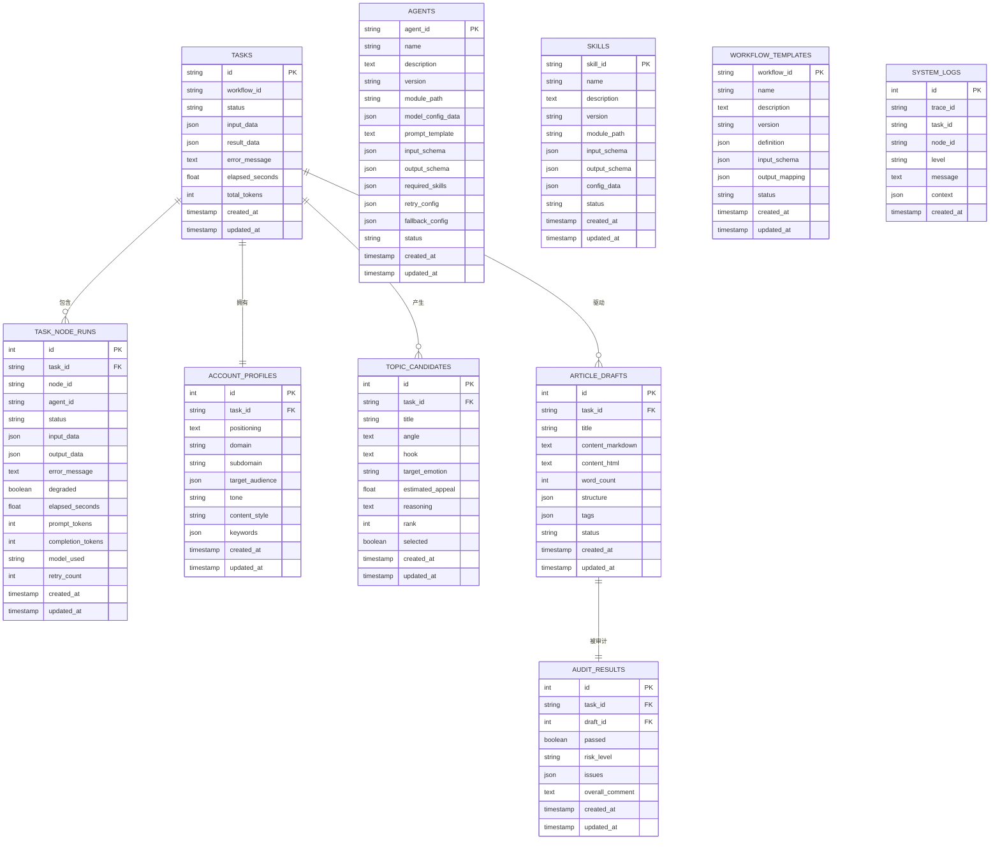
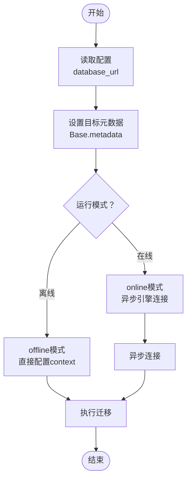
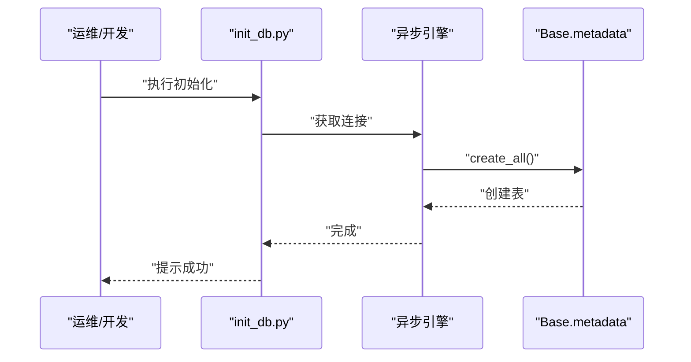
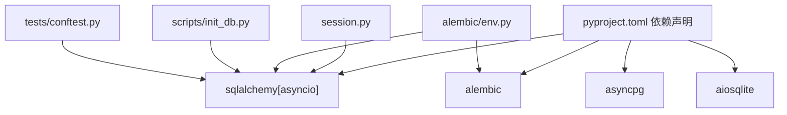

# 数据库管理

<cite>
**本文引用的文件**
- [backend/app/db/session.py](file://backend/app/db/session.py)
- [backend/app/models/tables.py](file://backend/app/models/tables.py)
- [backend/app/core/config.py](file://backend/app/core/config.py)
- [backend/alembic/env.py](file://backend/alembic/env.py)
- [backend/alembic.ini](file://backend/alembic.ini)
- [scripts/init_db.py](file://scripts/init_db.py)
- [backend/tests/conftest.py](file://backend/tests/conftest.py)
- [backend/pyproject.toml](file://backend/pyproject.toml)
- [ARCHITECTURE.md](file://ARCHITECTURE.md)
</cite>

## 目录
1. [简介](#简介)
2. [项目结构](#项目结构)
3. [核心组件](#核心组件)
4. [架构总览](#架构总览)
5. [详细组件分析](#详细组件分析)
6. [依赖分析](#依赖分析)
7. [性能考量](#性能考量)
8. [故障排除指南](#故障排除指南)
9. [结论](#结论)
10. [附录](#附录)

## 简介
本指南面向HotClaw数据库管理与运维，覆盖初始化与迁移（Alembic版本控制）、备份与恢复策略、性能优化、监控与维护、安全配置、故障排除以及高并发扩容思路。文档结合后端代码中的数据库连接、会话管理、模型定义与迁移配置，帮助开发者与运维人员建立标准化的数据库生命周期管理流程。

## 项目结构
后端数据库相关的关键位置与职责如下：
- 连接与会话：backend/app/db/session.py
- 模型定义：backend/app/models/tables.py
- 配置项：backend/app/core/config.py
- 迁移环境：backend/alembic/env.py、backend/alembic.ini
- 初始化脚本：scripts/init_db.py
- 测试配置（内存数据库）：backend/tests/conftest.py
- 依赖与工具：backend/pyproject.toml

图表来源
- [backend/app/db/session.py:1-33](file://backend/app/db/session.py#L1-L33)
- [backend/app/models/tables.py:1-233](file://backend/app/models/tables.py#L1-L233)
- [backend/app/core/config.py:1-51](file://backend/app/core/config.py#L1-L51)
- [backend/alembic/env.py:1-53](file://backend/alembic/env.py#L1-L53)
- [backend/alembic.ini:1-39](file://backend/alembic.ini#L1-L39)
- [scripts/init_db.py:1-16](file://scripts/init_db.py#L1-L16)
- [backend/tests/conftest.py:1-48](file://backend/tests/conftest.py#L1-L48)

章节来源
- [backend/app/db/session.py:1-33](file://backend/app/db/session.py#L1-L33)
- [backend/app/models/tables.py:1-233](file://backend/app/models/tables.py#L1-L233)
- [backend/app/core/config.py:1-51](file://backend/app/core/config.py#L1-L51)
- [backend/alembic/env.py:1-53](file://backend/alembic/env.py#L1-L53)
- [backend/alembic.ini:1-39](file://backend/alembic.ini#L1-L39)
- [scripts/init_db.py:1-16](file://scripts/init_db.py#L1-L16)
- [backend/tests/conftest.py:1-48](file://backend/tests/conftest.py#L1-L48)

## 核心组件
- 数据库连接与会话
  - 使用异步SQLAlchemy引擎与会话工厂，支持SQLite与PostgreSQL（通过URL切换）。
  - 开发环境默认SQLite，生产建议PostgreSQL。
  - 提供FastAPI依赖注入的数据库会话获取与自动提交/回滚/关闭。
- ORM模型
  - 定义任务、节点执行、账号画像、选题候选、文章草稿、审计结果、Agent/Skill/工作流模板、系统日志等核心表。
  - 多数实体包含创建/更新时间戳与索引字段，便于审计与查询。
- 配置
  - database_url决定数据库类型与连接串；app_debug控制SQL回显；其他如超时等也影响数据库行为。
- 迁移
  - Alembic异步环境适配，支持离线与在线迁移；迁移配置文件设置脚本位置与连接串。
- 初始化
  - 脚本通过引擎创建所有表，便于首次部署或本地开发环境准备。
- 测试
  - 使用内存SQLite快速搭建/清理测试表，确保测试隔离与可重复性。

章节来源
- [backend/app/db/session.py:1-33](file://backend/app/db/session.py#L1-L33)
- [backend/app/models/tables.py:1-233](file://backend/app/models/tables.py#L1-L233)
- [backend/app/core/config.py:1-51](file://backend/app/core/config.py#L1-L51)
- [backend/alembic/env.py:1-53](file://backend/alembic/env.py#L1-L53)
- [backend/alembic.ini:1-39](file://backend/alembic.ini#L1-L39)
- [scripts/init_db.py:1-16](file://scripts/init_db.py#L1-L16)
- [backend/tests/conftest.py:1-48](file://backend/tests/conftest.py#L1-L48)

## 架构总览
数据库在系统中的位置与交互：
- 应用层通过会话工厂获取异步会话，执行CRUD与事务。
- ORM模型承载业务实体，迁移工具保证Schema演进。
- 配置驱动数据库类型与连接参数，测试配置确保开发/CI一致性。

图表来源
- [backend/app/db/session.py:1-33](file://backend/app/db/session.py#L1-L33)
- [backend/app/models/tables.py:1-233](file://backend/app/models/tables.py#L1-L233)
- [backend/app/core/config.py:1-51](file://backend/app/core/config.py#L1-L51)
- [backend/alembic/env.py:1-53](file://backend/alembic/env.py#L1-L53)
- [scripts/init_db.py:1-16](file://scripts/init_db.py#L1-L16)

## 详细组件分析

### 数据库连接与会话管理
- 异步引擎与会话工厂
  - 根据配置URL创建异步引擎，开发环境启用echo便于调试。
  - SQLite不支持pool_pre_ping，因此在非SQLite环境下启用该选项以保持连接活性。
- 依赖注入
  - get_db提供FastAPI依赖，自动提交、回滚与关闭，简化路由层事务管理。
- 连接池与预热
  - 非SQLite启用pool_pre_ping，有助于在高并发下维持健康连接。

图表来源
- [backend/app/db/session.py:22-33](file://backend/app/db/session.py#L22-L33)

章节来源
- [backend/app/db/session.py:1-33](file://backend/app/db/session.py#L1-L33)

### ORM模型与表结构
- 核心实体
  - 任务、节点执行、账号画像、选题候选、文章草稿、审计结果、Agent、Skill、工作流模板、系统日志。
- 关键设计
  - 多数实体包含created_at/updated_at时间戳，默认服务器时间与更新触发器。
  - 部分实体对trace_id、task_id等字段建立索引，便于审计与查询。
  - JSON字段用于存储结构化数据（如输入输出、配置、标签等）。
- 审计与回放
  - 任务全链路输入输出与耗时持久化，支持任务级回放与审计。

图表来源
- [backend/app/models/tables.py:23-233](file://backend/app/models/tables.py#L23-L233)

章节来源
- [backend/app/models/tables.py:1-233](file://backend/app/models/tables.py#L1-L233)
- [ARCHITECTURE.md:1599-1616](file://ARCHITECTURE.md#L1599-L1616)

### Alembic迁移系统
- 环境配置
  - 从配置读取database_url，设置Alembic主连接串；目标元数据指向ORM Base。
  - 支持离线与在线迁移，异步迁移通过async_engine_from_config与run_sync执行。
- 迁移配置
  - 指定脚本目录与连接串；日志级别与格式可配置。
- 使用建议
  - 在线迁移适用于生产；离线迁移适用于快速验证或CI。
  - 建议每次Schema变更后生成并运行迁移，保持版本一致。

图表来源
- [backend/alembic/env.py:1-53](file://backend/alembic/env.py#L1-L53)
- [backend/alembic.ini:1-39](file://backend/alembic.ini#L1-L39)

章节来源
- [backend/alembic/env.py:1-53](file://backend/alembic/env.py#L1-L53)
- [backend/alembic.ini:1-39](file://backend/alembic.ini#L1-L39)

### 数据库初始化
- 脚本作用
  - 通过引擎在连接范围内创建所有表，适合首次部署或本地开发环境准备。
- 使用方式
  - 直接运行脚本，或在部署流程中作为初始化步骤。

图表来源
- [scripts/init_db.py:8-11](file://scripts/init_db.py#L8-L11)

章节来源
- [scripts/init_db.py:1-16](file://scripts/init_db.py#L1-L16)

### 测试数据库配置
- 内存SQLite
  - 测试使用内存SQLite，避免磁盘IO与副作用。
  - 在fixture中创建/销毁表，确保测试隔离。
- 依赖覆盖
  - 通过FastAPI依赖覆盖，将get_db替换为测试会话，便于集成测试。

章节来源
- [backend/tests/conftest.py:13-48](file://backend/tests/conftest.py#L13-L48)

## 依赖分析
- 外部依赖
  - SQLAlchemy异步、asyncpg、aiosqlite、Alembic等。
- 组件耦合
  - 会话工厂依赖配置；迁移环境依赖配置与模型元数据；初始化脚本依赖引擎与模型。
- 可能的循环依赖
  - 当前文件未见循环导入；注意在新增模块时避免模型与迁移互相引用。

图表来源
- [backend/pyproject.toml:1-41](file://backend/pyproject.toml#L1-L41)
- [backend/app/db/session.py:3](file://backend/app/db/session.py#L3)
- [backend/alembic/env.py:6](file://backend/alembic/env.py#L6)
- [scripts/init_db.py:4](file://scripts/init_db.py#L4)
- [backend/tests/conftest.py:7](file://backend/tests/conftest.py#L7)

章节来源
- [backend/pyproject.toml:1-41](file://backend/pyproject.toml#L1-L41)
- [backend/app/db/session.py:1-33](file://backend/app/db/session.py#L1-L33)
- [backend/alembic/env.py:1-53](file://backend/alembic/env.py#L1-L53)
- [scripts/init_db.py:1-16](file://scripts/init_db.py#L1-L16)
- [backend/tests/conftest.py:1-48](file://backend/tests/conftest.py#L1-L48)

## 性能考量
- 连接池与预热
  - 非SQLite启用pool_pre_ping，有助于在高并发下维持连接活性，减少“连接失效”导致的重试与延迟。
- 索引优化
  - 对常用过滤/排序字段建立索引（如系统日志中的trace_id、task_id）。
  - 针对高频查询的组合条件建立复合索引，降低全表扫描概率。
- 查询优化
  - 使用分页查询与LIMIT，避免一次性拉取大量数据。
  - 避免N+1查询，优先使用联结或批量加载。
- 统计信息与碎片整理
  - 定期更新统计信息，确保查询计划稳定。
  - 对大表进行碎片整理与重建索引，降低I/O开销。
- 并发与锁
  - 合理设置超时与重试策略，避免长事务与热点行争用。
  - 使用乐观锁或版本字段，减少写冲突。
- 监控与日志
  - 开启慢查询日志，识别Top N慢SQL，针对性优化。
  - 结合系统日志表记录关键路径耗时，辅助定位瓶颈。

[本节为通用性能指导，无需特定文件引用]

## 故障排除指南
- 连接超时
  - 检查数据库URL与网络连通性；确认连接池大小与超时配置。
  - 非SQLite启用pool_pre_ping，避免连接老化。
- 锁等待与死锁
  - 减少事务粒度与持续时间；避免跨分区大事务。
  - 重试策略应幂等，避免重复副作用。
- 迁移失败
  - 确认Alembic配置与数据库URL一致；在线迁移需确保异步连接可用。
  - 若出现版本不一致，先回退到上一版本再重跑迁移。
- 初始化失败
  - 确保引擎可连接且具备创建表权限；检查模型定义与约束。
- 测试不稳定
  - 使用内存SQLite并确保表在每个测试前后正确创建/销毁。

章节来源
- [backend/app/db/session.py:5-13](file://backend/app/db/session.py#L5-L13)
- [backend/alembic/env.py:34-42](file://backend/alembic/env.py#L34-L42)
- [scripts/init_db.py:8-11](file://scripts/init_db.py#L8-L11)
- [backend/tests/conftest.py:20-31](file://backend/tests/conftest.py#L20-L31)

## 结论
通过标准化的数据库连接与会话管理、完善的ORM模型设计、可追溯的Alembic迁移流程以及测试驱动的初始化与验证，HotClaw实现了从开发到生产的数据库生命周期管理。配合性能优化、监控与安全加固，可在高并发场景下保持稳定与高效。

[本节为总结，无需特定文件引用]

## 附录

### 数据库初始化与迁移流程
- 初始化
  - 使用初始化脚本创建所有表。
- 迁移
  - 在线/离线迁移均受支持；建议在生产使用在线迁移。
- 版本控制
  - 每次Schema变更后生成迁移并合并至版本库，确保团队一致。

章节来源
- [scripts/init_db.py:1-16](file://scripts/init_db.py#L1-L16)
- [backend/alembic/env.py:1-53](file://backend/alembic/env.py#L1-L53)
- [backend/alembic.ini:1-39](file://backend/alembic.ini#L1-L39)

### 备份与恢复策略
- 全量备份
  - 使用数据库原生命令导出Schema与数据，定期归档。
- 增量备份
  - 基于WAL/binlog的增量备份，缩短RPO。
- 恢复演练
  - 定期进行恢复演练，验证备份完整性与恢复时间。
- 灾难恢复
  - 制定跨地域容灾方案，确保RTO/RPO达标。

[本节为通用策略指导，无需特定文件引用]

### 数据库监控与维护
- 慢查询日志
  - 启用并定期分析慢查询，优化索引与SQL。
- 统计信息
  - 定期更新统计信息，保证查询计划最优。
- 碎片整理
  - 对大表进行索引重建与表重组，降低I/O。

[本节为通用指导，无需特定文件引用]

### 数据库安全配置
- 访问控制
  - 最小权限原则，限制数据库用户权限。
- 加密传输
  - 生产环境强制使用TLS连接PostgreSQL。
- 审计日志
  - 记录DDL/DML操作与登录事件，定期审计。

[本节为通用指导，无需特定文件引用]

### 扩容与分片策略
- 垂直扩容
  - 提升CPU/内存/磁盘IOPS，适用于短期内容量提升。
- 水平扩容
  - 读写分离、分库分表，按业务维度拆分（如按任务ID哈希）。
- 缓存与异步
  - 引入Redis缓存热点数据，异步处理非关键路径，降低数据库压力。

[本节为通用指导，无需特定文件引用]