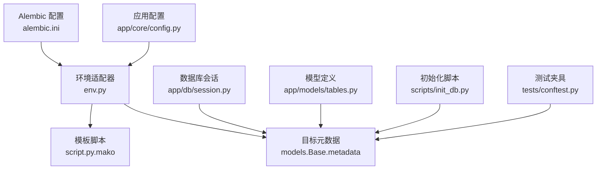
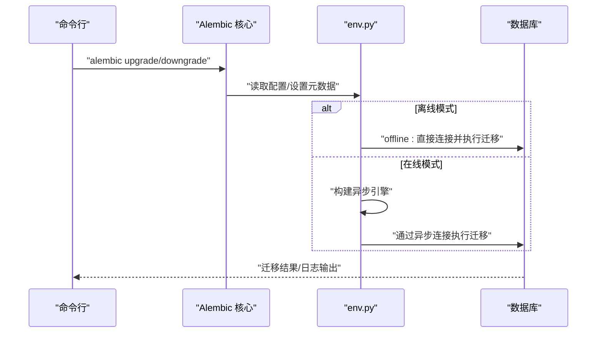
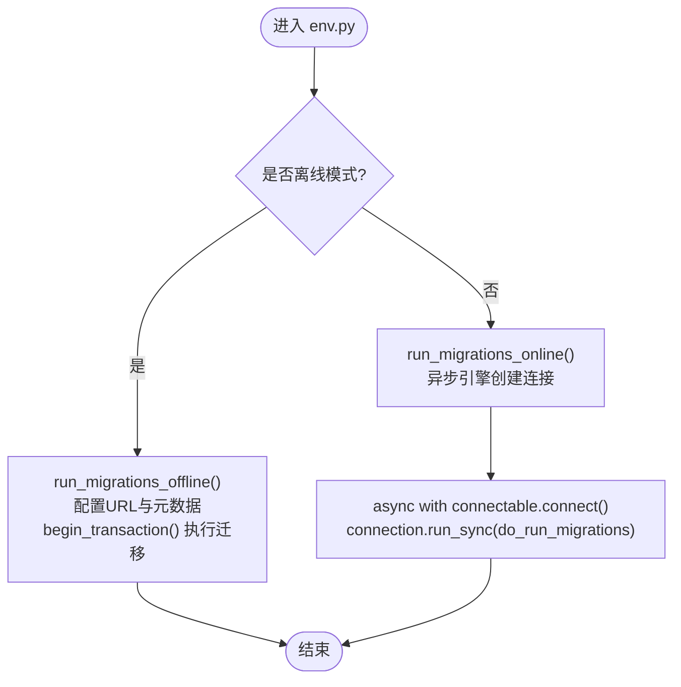
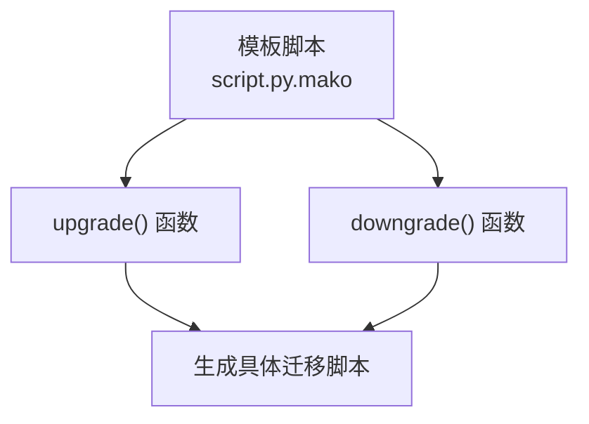
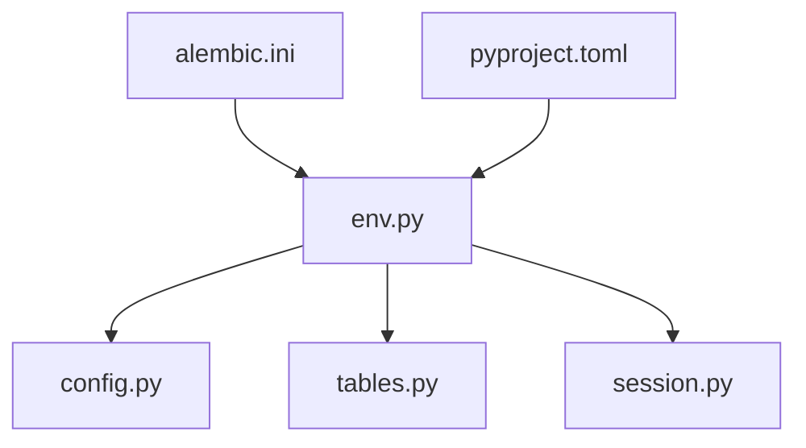

# 数据库迁移

<cite>
**本文引用的文件**
- [env.py](file://backend/alembic/env.py)
- [script.py.mako](file://backend/alembic/script.py.mako)
- [alembic.ini](file://backend/alembic.ini)
- [config.py](file://backend/app/core/config.py)
- [session.py](file://backend/app/db/session.py)
- [tables.py](file://backend/app/models/tables.py)
- [init_db.py](file://scripts/init_db.py)
- [pyproject.toml](file://backend/pyproject.toml)
- [conftest.py](file://backend/tests/conftest.py)
</cite>

## 目录
1. [简介](#简介)
2. [项目结构](#项目结构)
3. [核心组件](#核心组件)
4. [架构总览](#架构总览)
5. [详细组件分析](#详细组件分析)
6. [依赖分析](#依赖分析)
7. [性能考虑](#性能考虑)
8. [故障排查指南](#故障排查指南)
9. [结论](#结论)
10. [附录](#附录)

## 简介
本文件系统性阐述HotClaw项目的数据库迁移管理，围绕Alembic版本控制系统在异步SQLAlchemy环境下的工作原理展开，覆盖迁移脚本的生成、应用与回滚机制；迁移脚本编写规范（结构迁移与数据迁移）；不同场景下的迁移策略（新增表、字段类型变更、索引优化）；迁移过程中的数据一致性保障与回滚方案；迁移失败的应急处理与数据恢复方法；以及生产环境迁移的安全操作指南与注意事项。

## 项目结构
HotClaw后端采用异步SQLAlchemy与Alembic进行数据库迁移管理。关键位置如下：
- 配置与入口：Alembic配置文件、环境适配器、模板脚本
- 模型定义：ORM模型集中于统一基类，供Alembic扫描元数据
- 连接与会话：异步引擎与会话工厂，支持开发/测试/生产多环境
- 初始化脚本：用于一次性创建所有表（非迁移路径）
- 测试夹具：在内存数据库中快速初始化/清理表结构

**图示来源**
- [alembic.ini:1-39](file://backend/alembic.ini#L1-L39)
- [env.py:1-53](file://backend/alembic/env.py#L1-L53)
- [script.py.mako:1-25](file://backend/alembic/script.py.mako#L1-L25)
- [config.py:1-51](file://backend/app/core/config.py#L1-L51)
- [session.py:1-33](file://backend/app/db/session.py#L1-L33)
- [tables.py:1-233](file://backend/app/models/tables.py#L1-L233)
- [init_db.py:1-16](file://scripts/init_db.py#L1-L16)
- [conftest.py:1-48](file://backend/tests/conftest.py#L1-L48)

**章节来源**
- [alembic.ini:1-39](file://backend/alembic.ini#L1-L39)
- [env.py:1-53](file://backend/alembic/env.py#L1-L53)
- [script.py.mako:1-25](file://backend/alembic/script.py.mako#L1-L25)
- [config.py:1-51](file://backend/app/core/config.py#L1-L51)
- [session.py:1-33](file://backend/app/db/session.py#L1-L33)
- [tables.py:1-233](file://backend/app/models/tables.py#L1-L233)
- [init_db.py:1-16](file://scripts/init_db.py#L1-L16)
- [conftest.py:1-48](file://backend/tests/conftest.py#L1-L48)

## 核心组件
- Alembic环境适配器：负责在离线与在线模式下配置连接、事务与迁移执行，确保与异步SQLAlchemy兼容。
- Alembic模板脚本：提供升级/降级函数占位，便于生成标准化迁移脚本。
- 应用配置：提供数据库URL等关键参数，驱动Alembic与应用运行时的连接一致。
- ORM模型与元数据：统一的Base类及各业务表模型，作为迁移的目标元数据。
- 异步会话与引擎：为应用与迁移提供一致的异步连接能力。
- 初始化脚本与测试夹具：用于一次性建表与测试环境隔离。

**章节来源**
- [env.py:1-53](file://backend/alembic/env.py#L1-L53)
- [script.py.mako:1-25](file://backend/alembic/script.py.mako#L1-L25)
- [config.py:1-51](file://backend/app/core/config.py#L1-L51)
- [tables.py:1-233](file://backend/app/models/tables.py#L1-L233)
- [session.py:1-33](file://backend/app/db/session.py#L1-L33)
- [init_db.py:1-16](file://scripts/init_db.py#L1-L16)
- [conftest.py:1-48](file://backend/tests/conftest.py#L1-L48)

## 架构总览
下图展示从命令行到数据库的迁移执行链路，涵盖离线与在线两种模式，并强调异步连接与事务边界。

**图示来源**
- [env.py:21-52](file://backend/alembic/env.py#L21-L52)
- [alembic.ini:3-6](file://backend/alembic.ini#L3-L6)

## 详细组件分析

### Alembic环境适配器（env.py）
- 功能要点
  - 从应用配置加载数据库URL，注入到Alembic配置。
  - 设置目标元数据为ORM Base的metadata，使迁移扫描到所有模型。
  - 支持离线与在线两种模式：
    - 离线：直接使用配置URL执行迁移。
    - 在线：基于异步引擎创建连接，确保与应用一致的异步行为。
  - 使用显式事务块包裹迁移执行，保证原子性。
- 关键行为
  - 离线迁移：在上下文内开启事务并执行迁移。
  - 在线迁移：异步建立连接，同步回调中配置上下文并执行迁移。
- 与应用的一致性
  - 通过相同的数据库URL与元数据，确保迁移与应用对数据库结构的理解一致。

**图示来源**
- [env.py:21-52](file://backend/alembic/env.py#L21-L52)

**章节来源**
- [env.py:1-53](file://backend/alembic/env.py#L1-L53)

### Alembic模板脚本（script.py.mako）
- 功能要点
  - 提供标准的迁移脚本骨架，包含升级与降级函数占位。
  - 自动生成修订ID、修订版本链、分支标签与依赖项。
- 使用建议
  - 升级函数用于结构与数据变更；降级函数用于逆向回滚。
  - 保持幂等性与可逆性，避免破坏性操作。

**图示来源**
- [script.py.mako:19-24](file://backend/alembic/script.py.mako#L19-L24)

**章节来源**
- [script.py.mako:1-25](file://backend/alembic/script.py.mako#L1-L25)

### 应用配置（config.py）
- 功能要点
  - 定义数据库URL（开发默认SQLite，生产默认PostgreSQL），并从环境变量加载。
  - 该URL同时被Alembic与应用运行时使用，确保一致性。
- 迁移影响
  - 切换数据库类型或实例时，需同步更新此配置，以匹配目标数据库。

**章节来源**
- [config.py:7-14](file://backend/app/core/config.py#L7-L14)

### ORM模型与元数据（tables.py）
- 功能要点
  - 统一的Base类与多张业务表模型，构成迁移的目标元数据。
  - 包含任务、节点执行记录、账号画像、主题候选、文章草稿、审核结果、代理与技能、工作流模板、系统日志等。
- 迁移影响
  - 新增/删除/修改模型即触发结构迁移；数据迁移需配合升级/降级逻辑。

**章节来源**
- [tables.py:18-233](file://backend/app/models/tables.py#L18-L233)

### 异步会话与引擎（session.py）
- 功能要点
  - 创建异步引擎与会话工厂，支持池预检（除SQLite外）。
  - FastAPI依赖注入提供会话生命周期管理，自动提交/回滚/关闭。
- 迁移影响
  - 迁移执行与应用运行共享同一套异步连接能力，降低不一致风险。

**章节来源**
- [session.py:8-33](file://backend/app/db/session.py#L8-L33)

### 初始化脚本（init_db.py）
- 功能要点
  - 一次性创建所有表，适用于全新环境或重置场景。
  - 不参与版本化迁移，仅用于快速初始化。
- 使用建议
  - 生产环境优先使用Alembic迁移；初始化脚本适合本地或临时环境。

**章节来源**
- [init_db.py:8-16](file://scripts/init_db.py#L8-L16)

### 测试夹具（conftest.py）
- 功能要点
  - 在内存SQLite中创建/销毁表，隔离测试环境。
  - 通过覆盖依赖注入，确保测试客户端使用测试会话。
- 迁移影响
  - 测试中可验证迁移对内存数据库的影响，辅助回归测试。

**章节来源**
- [conftest.py:20-31](file://backend/tests/conftest.py#L20-L31)

## 依赖分析
- Alembic与应用配置
  - Alembic通过env.py读取应用配置中的数据库URL，确保迁移与应用连接一致。
- Alembic与ORM元数据
  - env.py将ORM Base.metadata设为目标元数据，使迁移扫描到所有模型定义。
- 异步一致性
  - env.py在线模式使用异步引擎，与应用运行时保持一致的异步行为。
- 工具与依赖
  - pyproject.toml声明了Alembic与异步SQLAlchemy等关键依赖。

**图示来源**
- [alembic.ini:3-6](file://backend/alembic.ini#L3-L6)
- [env.py:9-18](file://backend/alembic/env.py#L9-L18)
- [config.py:7-14](file://backend/app/core/config.py#L7-L14)
- [tables.py:18-233](file://backend/app/models/tables.py#L18-L233)
- [session.py:3-19](file://backend/app/db/session.py#L3-L19)
- [pyproject.toml:11](file://backend/pyproject.toml#L11)

**章节来源**
- [alembic.ini:1-39](file://backend/alembic.ini#L1-L39)
- [env.py:1-53](file://backend/alembic/env.py#L1-L53)
- [config.py:1-51](file://backend/app/core/config.py#L1-L51)
- [tables.py:1-233](file://backend/app/models/tables.py#L1-L233)
- [session.py:1-33](file://backend/app/db/session.py#L1-L33)
- [pyproject.toml:1-41](file://backend/pyproject.toml#L1-L41)

## 性能考虑
- 异步迁移执行
  - 在线模式通过异步引擎执行迁移，减少阻塞，提升大表迁移效率。
- 事务边界
  - 每次迁移置于显式事务中，失败可整体回滚，避免部分应用导致的不一致。
- 连接池与预检
  - 引擎配置支持池预检（非SQLite），有助于在迁移前后维持稳定连接。
- 大对象与JSON字段
  - 模型中存在大量JSON字段，迁移时应关注索引与查询性能，必要时引入GIN索引或物化视图。

[本节为通用指导，无需列出章节来源]

## 故障排查指南
- 常见问题与定位
  - 数据库URL不一致：确认Alembic配置与应用配置指向同一数据库实例。
  - 元数据未更新：确保ORM Base.metadata已包含最新模型定义。
  - 异步连接异常：检查异步引擎与驱动版本，确保与数据库兼容。
- 回滚与修复
  - 使用降级函数回滚到上一个版本，验证数据完整性。
  - 若迁移卡在中间状态，先手动终止事务，再重新执行迁移。
- 应急处理流程
  - 失败回滚：执行降级至最近一次稳定版本。
  - 数据恢复：在备份点恢复数据库，再执行增量迁移。
  - 服务降级：暂停写入，优先保证只读功能可用。
- 生产安全
  - 只在维护窗口执行迁移，提前备份数据库。
  - 使用影子副本先行验证迁移脚本。
  - 严格权限控制与审计日志，确保可追溯。

[本节为通用指导，无需列出章节来源]

## 结论
HotClaw项目通过Alembic与异步SQLAlchemy的结合，实现了可控、可逆且可审计的数据库迁移体系。借助统一的配置与元数据、明确的迁移脚本模板与严格的事务边界，项目能够在开发、测试与生产环境中保持一致的数据库演进路径。遵循本文提供的编写规范、策略与应急流程，可显著降低迁移风险并提升运维效率。

[本节为总结性内容，无需列出章节来源]

## 附录

### 迁移脚本编写规范
- 结构迁移
  - 优先使用Alembic提供的DDL操作，确保可逆性。
  - 对主键、唯一约束、外键变更要谨慎，必要时分步执行。
- 数据迁移
  - 将数据转换逻辑放入升级函数，降级函数中提供回退策略。
  - 对大表数据迁移，采用分批处理与索引优化。
- 幂等性与可逆性
  - 升级/降级均需幂等，避免重复执行造成副作用。
- 日志与可观测性
  - 在迁移脚本中记录关键步骤与耗时，便于排障。

[本节为通用指导，无需列出章节来源]

### 场景化迁移策略
- 新增表
  - 通过模型定义与迁移脚本同步创建；为高频查询列添加索引。
- 修改字段类型
  - 先创建新列，迁移数据，再替换旧列；避免长时间锁表。
- 索引优化
  - 评估查询模式，按需添加复合索引或GIN索引；定期审查失效索引。
- 删除列/表
  - 先迁移数据，再删除；保留清理脚本以备回滚。

[本节为通用指导，无需列出章节来源]