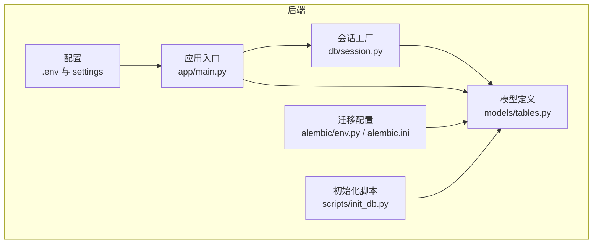
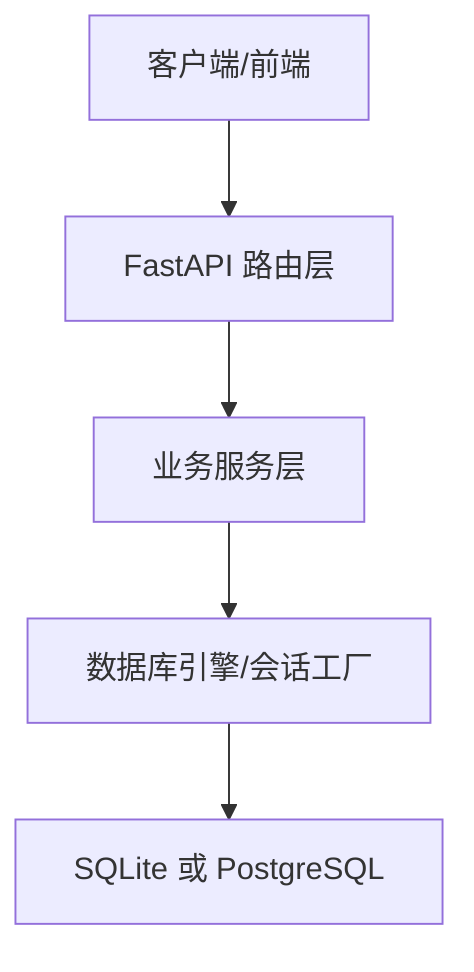
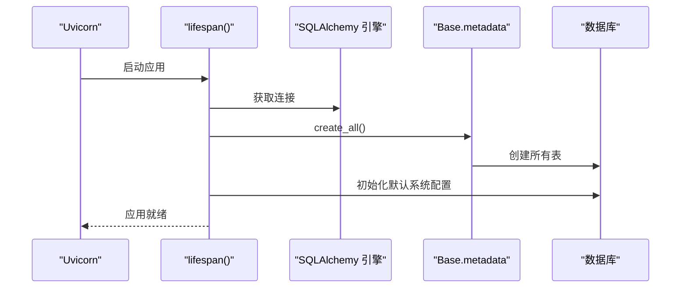
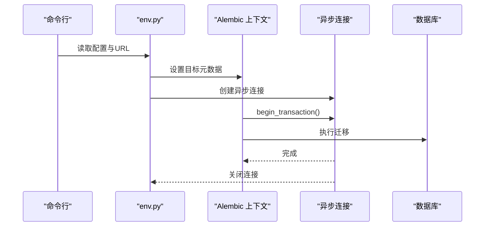
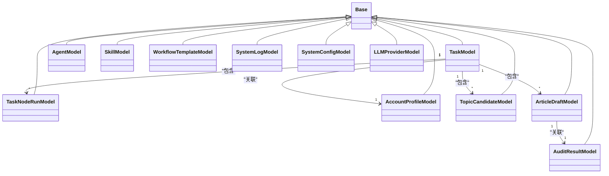
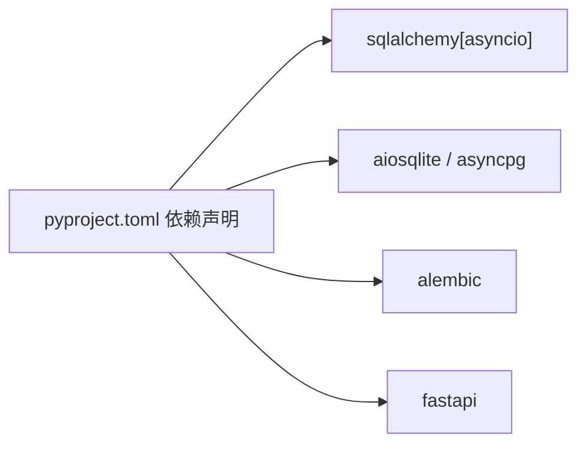

# 数据库部署

<cite>
**本文引用的文件**
- [backend/app/db/session.py](file://backend/app/db/session.py)
- [backend/scripts/init_db.py](file://backend/scripts/init_db.py)
- [backend/alembic/env.py](file://backend/alembic/env.py)
- [backend/alembic.ini](file://backend/alembic.ini)
- [backend/app/models/tables.py](file://backend/app/models/tables.py)
- [backend/app/core/config.py](file://backend/app/core/config.py)
- [backend/pyproject.toml](file://backend/pyproject.toml)
- [backend/app/main.py](file://backend/app/main.py)
- [backend/.env](file://backend/.env)
</cite>

## 目录
1. [简介](#简介)
2. [项目结构](#项目结构)
3. [核心组件](#核心组件)
4. [架构总览](#架构总览)
5. [详细组件分析](#详细组件分析)
6. [依赖分析](#依赖分析)
7. [性能考虑](#性能考虑)
8. [故障排查指南](#故障排查指南)
9. [结论](#结论)
10. [附录](#附录)

## 简介
本指南面向HotClaw项目的数据库部署与运维，覆盖以下主题：
- 初始化脚本与数据迁移策略
- Alembic迁移框架的使用（生成、版本管理、回滚）
- SQLite与PostgreSQL两种数据库的部署配置与性能优化
- 连接池、事务与并发控制策略
- 备份、恢复与灾难恢复计划
- 监控指标、性能调优与容量规划
- 常见问题诊断与解决

## 项目结构
HotClaw后端采用异步SQLAlchemy与FastAPI，数据库层由会话工厂与模型定义组成；迁移工具使用Alembic，支持离线与在线迁移模式。

图表来源
- [backend/app/main.py:44-66](file://backend/app/main.py#L44-L66)
- [backend/app/db/session.py:1-50](file://backend/app/db/session.py#L1-L50)
- [backend/app/models/tables.py:1-319](file://backend/app/models/tables.py#L1-L319)
- [backend/alembic/env.py:1-53](file://backend/alembic/env.py#L1-L53)
- [backend/alembic.ini:1-39](file://backend/alembic.ini#L1-L39)
- [backend/scripts/init_db.py:1-16](file://backend/scripts/init_db.py#L1-L16)

章节来源
- [backend/app/main.py:44-66](file://backend/app/main.py#L44-L66)
- [backend/app/db/session.py:1-50](file://backend/app/db/session.py#L1-L50)
- [backend/app/models/tables.py:1-319](file://backend/app/models/tables.py#L1-L319)
- [backend/alembic/env.py:1-53](file://backend/alembic/env.py#L1-L53)
- [backend/alembic.ini:1-39](file://backend/alembic.ini#L1-L39)
- [backend/scripts/init_db.py:1-16](file://backend/scripts/init_db.py#L1-L16)

## 核心组件
- 配置加载与数据库URL：从环境变量读取数据库连接字符串，默认使用SQLite。
- 异步引擎与会话工厂：基于SQLAlchemy异步引擎与async_sessionmaker，提供FastAPI依赖注入与上下文管理器。
- 模型定义：集中于ORM模型，统一继承自Base元类，用于表结构与关系映射。
- 初始化脚本：在首次运行时创建所有表。
- Alembic迁移：支持离线与在线迁移，通过异步引擎执行。

章节来源
- [backend/app/core/config.py:52-99](file://backend/app/core/config.py#L52-L99)
- [backend/app/db/session.py:1-50](file://backend/app/db/session.py#L1-L50)
- [backend/app/models/tables.py:1-319](file://backend/app/models/tables.py#L1-L319)
- [backend/scripts/init_db.py:1-16](file://backend/scripts/init_db.py#L1-L16)
- [backend/alembic/env.py:1-53](file://backend/alembic/env.py#L1-L53)

## 架构总览
下图展示数据库层在应用中的位置与交互：

图表来源
- [backend/app/db/session.py:23-50](file://backend/app/db/session.py#L23-L50)
- [backend/app/main.py:69-153](file://backend/app/main.py#L69-L153)

## 详细组件分析

### 数据库初始化与启动流程
- 应用启动时自动创建所有表，确保开发环境快速可用。
- 初始化默认系统配置，保证运行所需的基础键值存在。

图表来源
- [backend/app/main.py:44-66](file://backend/app/main.py#L44-L66)

章节来源
- [backend/app/main.py:44-66](file://backend/app/main.py#L44-L66)

### Alembic迁移框架使用
- 离线迁移：直接使用配置文件中的URL进行迁移。
- 在线迁移：通过异步引擎连接数据库，逐个迁移版本。
- 迁移目标：以Base.metadata为目标，按版本顺序执行。

图表来源
- [backend/alembic/env.py:21-53](file://backend/alembic/env.py#L21-L53)
- [backend/alembic.ini:1-39](file://backend/alembic.ini#L1-L39)

章节来源
- [backend/alembic/env.py:1-53](file://backend/alembic/env.py#L1-L53)
- [backend/alembic.ini:1-39](file://backend/alembic.ini#L1-L39)

### 数据模型与关系
- 统一基类：所有ORM模型继承自Base，便于统一管理。
- 主要实体：任务、节点运行、账号画像、话题候选、文章草稿、审核结果、代理、技能、工作流模板、系统日志、系统配置、LLM提供商等。
- 关系与索引：部分字段建立索引以提升查询效率。

图表来源
- [backend/app/models/tables.py:18-319](file://backend/app/models/tables.py#L18-L319)

章节来源
- [backend/app/models/tables.py:18-319](file://backend/app/models/tables.py#L18-L319)

### 初始化脚本与数据迁移策略
- 初始化脚本：在独立进程中创建所有表，适合一次性部署或手动触发。
- 运行时初始化：应用启动时自动创建表，减少运维复杂度。
- 迁移策略：优先使用Alembic进行版本化迁移，避免直接使用create_all破坏生产数据。

章节来源
- [backend/scripts/init_db.py:1-16](file://backend/scripts/init_db.py#L1-L16)
- [backend/app/main.py:50-55](file://backend/app/main.py#L50-L55)

### SQLite与PostgreSQL部署配置
- SQLite（默认）：适用于开发与小规模场景，无需额外数据库实例。
- PostgreSQL：适用于生产，需准备PostgreSQL实例与用户权限。
- 配置方式：通过环境变量DATABASE_URL指定连接字符串；Alembic与应用均读取该URL。

章节来源
- [backend/app/core/config.py:52-57](file://backend/app/core/config.py#L52-L57)
- [backend/.env:5-6](file://backend/.env#L5-L6)
- [backend/alembic.ini:5](file://backend/alembic.ini#L5)

### 连接池、事务与并发控制
- 连接池：异步引擎默认行为；SQLite不支持pool_pre_ping，其他数据库可启用预检测。
- 事务：会话工厂不自动提交，调用方负责commit/rollback；上下文管理器在异常时自动回滚。
- 并发：异步会话避免阻塞；建议结合应用层限流与重试策略。

章节来源
- [backend/app/db/session.py:7-14](file://backend/app/db/session.py#L7-L14)
- [backend/app/db/session.py:23-50](file://backend/app/db/session.py#L23-L50)

### 备份、恢复与灾难恢复
- 备份策略
  - SQLite：直接复制数据库文件；建议定期归档。
  - PostgreSQL：使用pg_dump/pg_restore进行逻辑备份；或使用物理备份工具。
- 恢复流程
  - SQLite：停止服务，替换或恢复数据库文件，启动服务。
  - PostgreSQL：使用备份文件恢复到目标实例，必要时进行时间点恢复。
- 灾难恢复
  - 制定RPO/RTO目标；定期演练恢复流程；异地容灾与多活部署。

[本节为通用实践说明，不直接分析具体文件]

### 监控指标、性能调优与容量规划
- 监控指标
  - 连接数、等待时间、慢查询、错误率、吞吐量。
  - 应用侧：记录请求耗时、异常次数、trace_id关联日志。
- 性能调优
  - PostgreSQL：参数调优、索引优化、查询剖析、连接池大小。
  - SQLite：写入策略（WAL）、批量写入、减少锁竞争。
- 容量规划
  - 评估QPS、峰值连接数、磁盘IO与存储增长趋势，预留冗余。

[本节为通用实践说明，不直接分析具体文件]

## 依赖分析
- 异步SQLAlchemy与驱动：支持SQLite与PostgreSQL。
- Alembic：迁移工具链。
- FastAPI：依赖注入与生命周期管理。

图表来源
- [backend/pyproject.toml:6-22](file://backend/pyproject.toml#L6-L22)

章节来源
- [backend/pyproject.toml:6-22](file://backend/pyproject.toml#L6-L22)

## 性能考虑
- SQLite
  - 使用WAL模式提升并发写入能力。
  - 控制事务粒度，避免长事务占用锁。
  - 定期分析与优化热点查询。
- PostgreSQL
  - 合理设置shared_buffers、work_mem、effective_cache_size等参数。
  - 为高频查询列建立索引，定期维护统计信息。
  - 使用连接池限制最大连接数，避免资源耗尽。
- 通用
  - 异步I/O优先，避免阻塞。
  - 事务显式提交/回滚，减少锁持有时间。
  - 监控慢查询与高延迟接口，定位瓶颈。

[本节为通用实践说明，不直接分析具体文件]

## 故障排查指南
- 连接失败
  - 检查DATABASE_URL格式与可达性；确认PostgreSQL用户与权限。
  - 查看应用日志与Alembic日志级别配置。
- 权限不足
  - 确认数据库用户对目标模式有DDL权限；迁移前先授权。
- 迁移卡住
  - 检查是否存在未完成事务；查看数据库锁状态。
  - 使用Alembic检查当前版本，必要时手动修复迁移记录。
- 性能问题
  - 分析慢查询与高延迟接口；检查索引与统计信息。
  - 调整连接池大小与预热策略。
- 回滚与修复
  - 使用Alembic降级到上一个稳定版本；核对数据一致性。
  - 对关键表执行一致性校验与修复。

章节来源
- [backend/alembic.ini:16-28](file://backend/alembic.ini#L16-L28)

## 结论
HotClaw提供了开箱即用的数据库初始化与Alembic迁移能力，支持SQLite与PostgreSQL。生产部署建议：
- 使用Alembic进行版本化迁移，避免直接建表破坏数据。
- 针对数据库类型选择合适的连接池与参数调优。
- 建立完善的备份、恢复与灾备流程。
- 持续监控与容量规划，保障系统稳定性与性能。

[本节为总结性内容，不直接分析具体文件]

## 附录

### 部署步骤清单
- 准备数据库实例（SQLite或PostgreSQL），确保网络可达。
- 设置环境变量DATABASE_URL指向目标数据库。
- 启动应用，自动创建表并初始化系统配置。
- 如需迁移，使用Alembic生成并执行迁移脚本。
- 配置备份与监控，制定恢复演练计划。

章节来源
- [backend/app/main.py:50-62](file://backend/app/main.py#L50-L62)
- [backend/alembic/env.py:34-46](file://backend/alembic/env.py#L34-L46)

### 常用命令参考
- 初始化数据库（一次性）：[scripts/init_db.py:1-16](file://backend/scripts/init_db.py#L1-L16)
- Alembic迁移（在线）：[alembic/env.py:45-52](file://backend/alembic/env.py#L45-L52)
- Alembic迁移（离线）：[alembic/env.py:21-26](file://backend/alembic/env.py#L21-L26)
- Alembic配置：[alembic.ini:1-39](file://backend/alembic.ini#L1-L39)