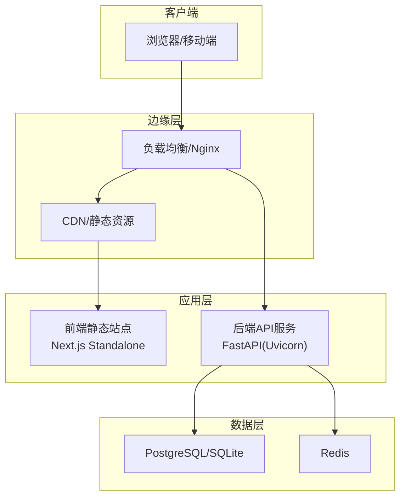
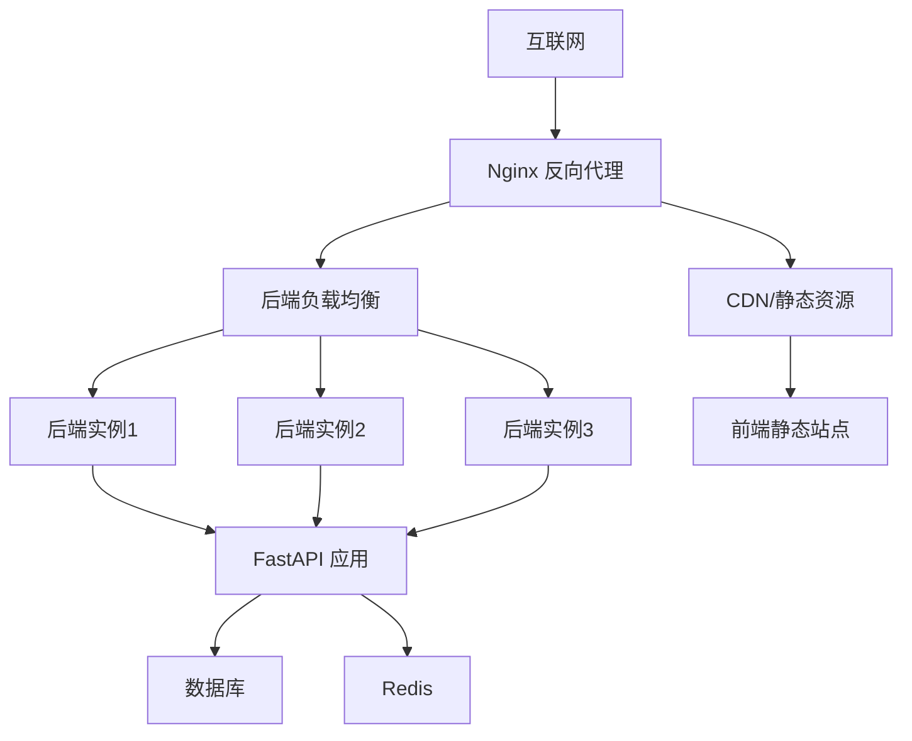
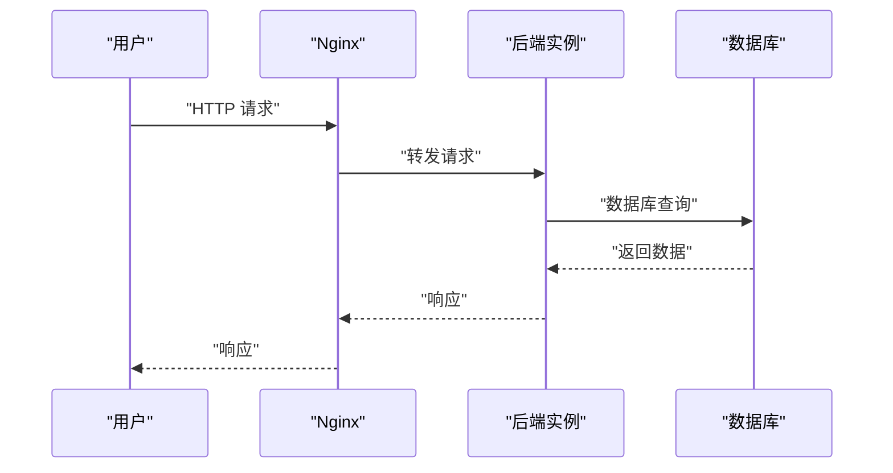
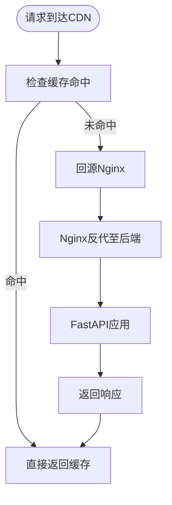
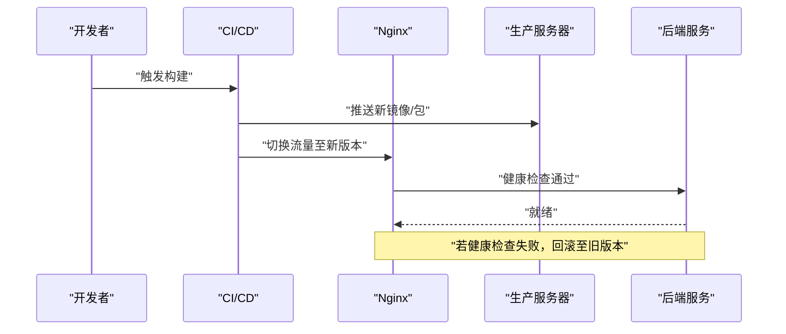
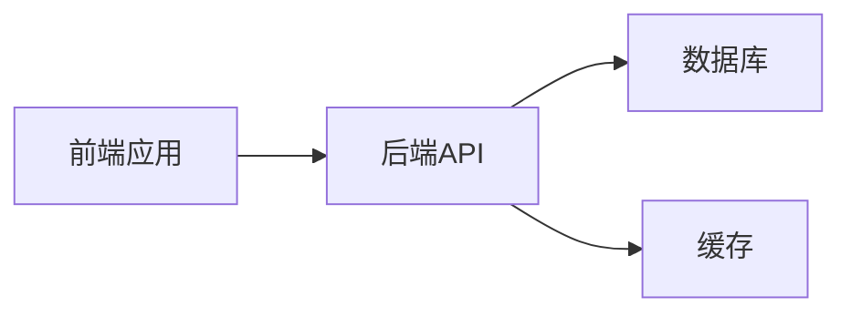

# 生产环境部署

<cite>
**本文引用的文件**
- [ARCHITECTURE.md](file://ARCHITECTURE.md)
- [backend/pyproject.toml](file://backend/pyproject.toml)
- [frontend/package.json](file://frontend/package.json)
- [OpenClaw-bot-review-main/package.json](file://OpenClaw-bot-review-main/package.json)
- [backend/app/main.py](file://backend/app/main.py)
- [backend/app/core/config.py](file://backend/app/core/config.py)
- [frontend/next.config.ts](file://frontend/next.config.ts)
- [OpenClaw-bot-review-main/next.config.mjs](file://OpenClaw-bot-review-main/next.config.mjs)
- [backend/alembic.ini](file://backend/alembic.ini)
- [start.sh](file://start.sh)
- [start.bat](file://start.bat)
- [OpenClaw-bot-review-main/Dockerfile](file://OpenClaw-bot-review-main/Dockerfile)
</cite>

## 目录
1. [简介](#简介)
2. [项目结构](#项目结构)
3. [核心组件](#核心组件)
4. [架构总览](#架构总览)
5. [详细组件分析](#详细组件分析)
6. [依赖分析](#依赖分析)
7. [性能考量](#性能考量)
8. [故障排查指南](#故障排查指南)
9. [结论](#结论)
10. [附录](#附录)

## 简介
本指南面向HotClaw项目的生产环境部署，覆盖硬件与系统要求、操作系统与网络配置、负载均衡与反向代理、SSL/TLS证书申请与续期、CDN与静态资源优化、域名与HTTPS重定向、自动化部署与版本回滚、安全加固与监控应急流程。文档结合仓库中的架构设计、后端配置与前后端构建脚本，给出可落地的生产实践建议。

## 项目结构
HotClaw采用前后端分离架构：前端为Next.js应用，后端为FastAPI服务，数据库与缓存通过配置注入，整体通过API网关统一入口对外提供能力。部署时应将前端打包产物交由Web服务器或CDN分发，后端通过反向代理暴露服务，并配合负载均衡与健康检查。

**图表来源**
- [ARCHITECTURE.md: 40-78:40-78](file://ARCHITECTURE.md#L40-L78)
- [backend/app/main.py: 69-74:69-74](file://backend/app/main.py#L69-L74)
- [backend/app/core/config.py: 52-87:52-87](file://backend/app/core/config.py#L52-L87)

**章节来源**
- [ARCHITECTURE.md: 40-78:40-78](file://ARCHITECTURE.md#L40-L78)
- [frontend/next.config.ts: 1-15:1-15](file://frontend/next.config.ts#L1-L15)
- [backend/app/core/config.py: 52-87:52-87](file://backend/app/core/config.py#L52-L87)

## 核心组件
- 后端服务（FastAPI + Uvicorn）
  - 监听地址与端口由配置决定，生产环境建议绑定内网或通过反向代理暴露。
  - 提供统一路由与SSE事件流，支持健康检查端点。
- 前端应用（Next.js）
  - 开发时通过rewrites将/api转发至后端；生产建议构建为Standalone并由Web服务器或CDN托管。
- 数据与缓存
  - 数据库连接URL可通过环境变量配置；默认提供SQLite与PostgreSQL两种形态。
  - Redis用于缓存与会话相关场景。
- 日志与追踪
  - 全局异常处理与X-Trace-Id头便于问题定位。

**章节来源**
- [backend/app/main.py: 69-153:69-153](file://backend/app/main.py#L69-L153)
- [backend/app/core/config.py: 52-99:52-99](file://backend/app/core/config.py#L52-L99)
- [frontend/next.config.ts: 1-15:1-15](file://frontend/next.config.ts#L1-L15)

## 架构总览
生产部署建议采用“CDN/静态资源 + Nginx反向代理 + 多实例后端”的架构。Nginx负责TLS终止、静态资源缓存、健康检查与会话保持；后端通过Uvicorn承载FastAPI应用，使用异步I/O提升并发；数据库与Redis通过内网访问，必要时启用只读副本与哨兵/集群。

**图表来源**
- [ARCHITECTURE.md: 40-78:40-78](file://ARCHITECTURE.md#L40-L78)
- [backend/app/main.py: 150-153:150-153](file://backend/app/main.py#L150-L153)
- [backend/app/core/config.py: 52-87:52-87](file://backend/app/core/config.py#L52-L87)

## 详细组件分析

### 硬件与系统要求
- CPU与内存
  - 建议至少2核CPU、4GB内存起步，根据并发与LLM调用量动态扩容。
- 存储
  - 数据库与日志目录建议独立挂载，SSD优先；日志轮转与清理策略需纳入运维规范。
- 网络
  - 后端与数据库、缓存同VPC内网互通；CDN与Nginx置于公网出口。
- 操作系统
  - Linux发行版（如Ubuntu/CentOS）；Windows仅用于开发测试。

[本节为通用建议，无需特定文件引用]

### 操作系统与网络配置
- 防火墙
  - 仅开放Nginx对外端口（如TCP 80/443），后端与数据库仅对内网放行。
- 时间同步
  - 启用NTP确保日志与令牌时间戳一致。
- 文件句柄与内核参数
  - 提升文件句柄上限，调整TCP缓冲与TIME_WAIT回收策略以适配高并发。

[本节为通用建议，无需特定文件引用]

### 负载均衡与反向代理（Nginx）
- 反向代理
  - 将静态资源交由Nginx或CDN；后端API通过upstream指向多个FastAPI实例。
- 会话保持
  - 若存在需要粘性会话的场景，可在upstream中启用ip_hash或基于Cookie的会话保持策略。
- 健康检查
  - 配置Nginx健康检查探针，定期访问后端健康端点，异常节点自动摘除。
- 超时与缓冲
  - 设置合理的proxy_read_timeout、proxy_connect_timeout与client_max_body_size，避免慢客户端占用资源。

**图表来源**
- [backend/app/main.py: 150-153:150-153](file://backend/app/main.py#L150-L153)

**章节来源**
- [backend/app/main.py: 150-153:150-153](file://backend/app/main.py#L150-L153)

### SSL/TLS证书与HTTPS
- 证书申请
  - 使用ACME协议（如certbot）申请免费证书，或购买商业证书。
- 配置
  - Nginx监听443端口，加载证书与私钥；开启TLS1.2/1.3与现代密码套件。
- 自动续期
  - 配置定时任务自动续期并重载Nginx；监控续期失败告警。

[本节为通用建议，无需特定文件引用]

### CDN加速与静态资源优化
- 静态资源
  - 前端构建为Standalone，将.next/static与public目录托管至CDN；开启Gzip/Brotli压缩与缓存头。
- 缓存策略
  - 对不常变更的静态资源设置长缓存；对HTML设置短缓存或no-store。
- 回源策略
  - 对/api路径禁用CDN缓存，强制回源Nginx再至后端。

**图表来源**
- [frontend/next.config.ts: 1-15:1-15](file://frontend/next.config.ts#L1-L15)
- [OpenClaw-bot-review-main/next.config.mjs: 1-6:1-6](file://OpenClaw-bot-review-main/next.config.mjs#L1-L6)

**章节来源**
- [frontend/next.config.ts: 1-15:1-15](file://frontend/next.config.ts#L1-L15)
- [OpenClaw-bot-review-main/next.config.mjs: 1-6:1-6](file://OpenClaw-bot-review-main/next.config.mjs#L1-L6)

### 域名与HTTPS重定向
- DNS
  - 将域名A/AAAA记录指向Nginx公网IP；如使用CDN，按CDN指引配置CNAME。
- HTTPS重定向
  - Nginx中将80端口重定向至443；对/api路径保留HTTPS直连后端。
- HSTS
  - 启用Strict-Transport-Security头，提升安全性。

[本节为通用建议，无需特定文件引用]

### 自动化部署与版本回滚
- 构建与打包
  - 前端：使用Next.js构建Standalone；后端：使用Uvicorn运行FastAPI应用。
- 部署脚本
  - 参考仓库提供的启动脚本思路，编写生产部署脚本，包含依赖安装、环境变量注入、服务重启与健康检查。
- 版本回滚
  - 采用蓝绿/金丝雀发布策略；失败时快速切回上一个稳定版本；保留最近N个版本镜像以便回滚。

**图表来源**
- [start.sh: 23-66:23-66](file://start.sh#L23-L66)
- [start.bat: 26-58:26-58](file://start.bat#L26-L58)

**章节来源**
- [start.sh: 23-66:23-66](file://start.sh#L23-L66)
- [start.bat: 26-58:26-58](file://start.bat#L26-L58)

### 安全加固与入侵检测
- 网络安全
  - 仅暴露必要端口；使用WAF拦截常见攻击；限制API速率与来源IP。
- 应用安全
  - 启用CORS白名单、CSRF防护、敏感信息脱敏；对输入参数进行严格校验。
- 入侵检测
  - 部署IDS/IPS与日志审计；对异常行为（大量4xx/5xx、慢查询）告警。

[本节为通用建议，无需特定文件引用]

### 监控、应急与故障处理
- 监控指标
  - 后端：QPS、P95/P99延迟、错误率、数据库连接数、Redis命中率。
  - 基础设施：CPU/内存/磁盘IO、网络带宽、Nginx连接数。
- 告警策略
  - 设定阈值告警与自动恢复预案；对数据库/缓存异常进行分级处理。
- 应急响应
  - 快速定位trace_id，结合日志与SSE事件流回放任务链路；必要时临时降级或熔断。

**章节来源**
- [backend/app/main.py: 86-138:86-138](file://backend/app/main.py#L86-L138)

## 依赖分析
- 后端依赖
  - FastAPI、Uvicorn、SQLAlchemy、Alembic、Redis、litellm等，生产环境建议锁定版本并定期安全扫描。
- 前端依赖
  - Next.js、TailwindCSS、React等，生产构建后静态化部署。
- 数据库与缓存
  - 通过配置文件注入连接字符串；生产建议使用独立实例并开启备份与只读副本。

**图表来源**
- [backend/pyproject.toml: 6-22:6-22](file://backend/pyproject.toml#L6-L22)
- [frontend/package.json: 11-21:11-21](file://frontend/package.json#L11-L21)
- [backend/app/core/config.py: 52-63:52-63](file://backend/app/core/config.py#L52-L63)

**章节来源**
- [backend/pyproject.toml: 6-22:6-22](file://backend/pyproject.toml#L6-L22)
- [frontend/package.json: 11-21:11-21](file://frontend/package.json#L11-L21)
- [backend/app/core/config.py: 52-63:52-63](file://backend/app/core/config.py#L52-L63)

## 性能考量
- 并发与异步
  - 后端使用异步ORM与异步I/O，合理设置worker数量与队列长度。
- 缓存策略
  - 对热点数据与中间结果使用Redis缓存；对LLM调用结果进行结构化缓存。
- 数据库优化
  - 使用连接池、索引优化与只读副本；对慢查询进行分析与优化。
- 前端性能
  - 启用CDN缓存、Gzip/Brotli压缩、懒加载与骨架屏；减少首屏渲染时间。

[本节为通用建议，无需特定文件引用]

## 故障排查指南
- 健康检查
  - 访问后端健康端点确认服务状态；Nginx健康检查失败时检查后端日志。
- 日志与追踪
  - 通过X-Trace-Id关联请求链路；结合SSE事件流定位节点执行状态。
- 数据库与缓存
  - 检查连接字符串与网络连通性；对连接池耗尽与慢查询进行告警。
- 前端无法访问
  - 检查rewrites与CDN缓存；确认静态资源路径与缓存头设置。

**章节来源**
- [backend/app/main.py: 150-153:150-153](file://backend/app/main.py#L150-L153)
- [backend/app/main.py: 86-138:86-138](file://backend/app/main.py#L86-L138)

## 结论
本指南基于仓库现有架构与配置，给出了HotClaw生产环境的部署蓝图与实施要点。建议以Nginx+CDN为边界，后端以FastAPI+Uvicorn承载，结合完善的监控、告警与回滚策略，确保系统在高并发与复杂业务场景下的稳定性与可维护性。

## 附录
- 环境变量与配置
  - 数据库URL、Redis URL、LLM提供商与模型、应用监听地址与端口、日志级别与超时参数。
- 构建与运行
  - 参考启动脚本的依赖安装与服务启动流程，生产环境建议使用容器化与编排工具。

**章节来源**
- [backend/app/core/config.py: 52-99:52-99](file://backend/app/core/config.py#L52-L99)
- [start.sh: 23-66:23-66](file://start.sh#L23-L66)
- [start.bat: 26-58:26-58](file://start.bat#L26-L58)