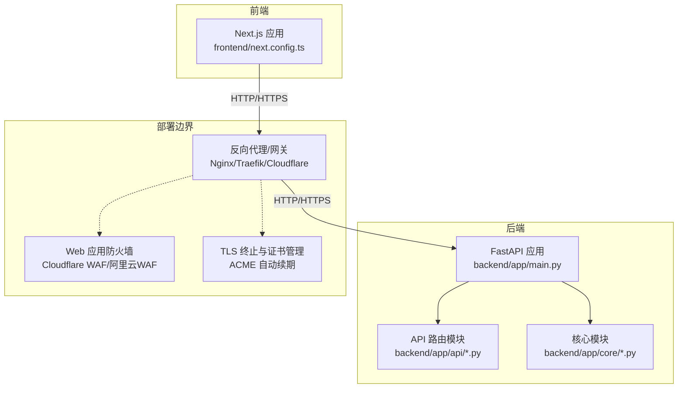
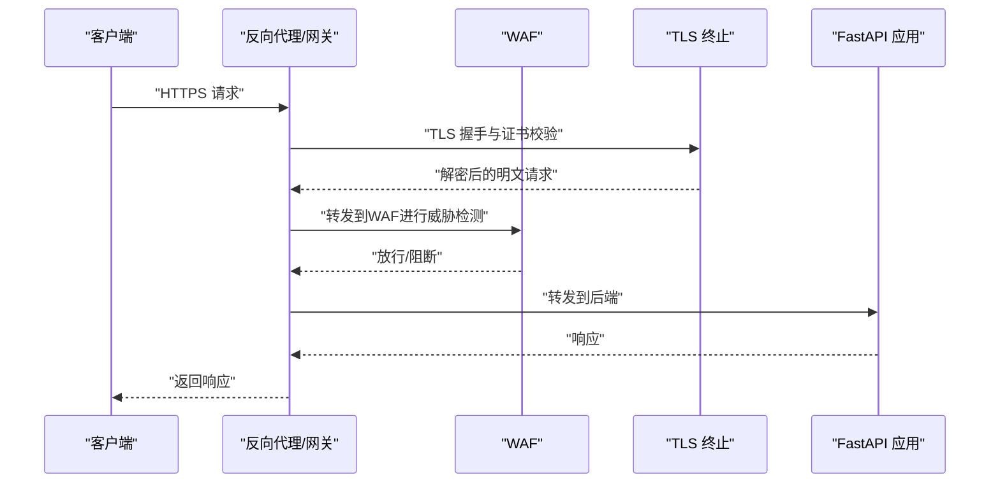
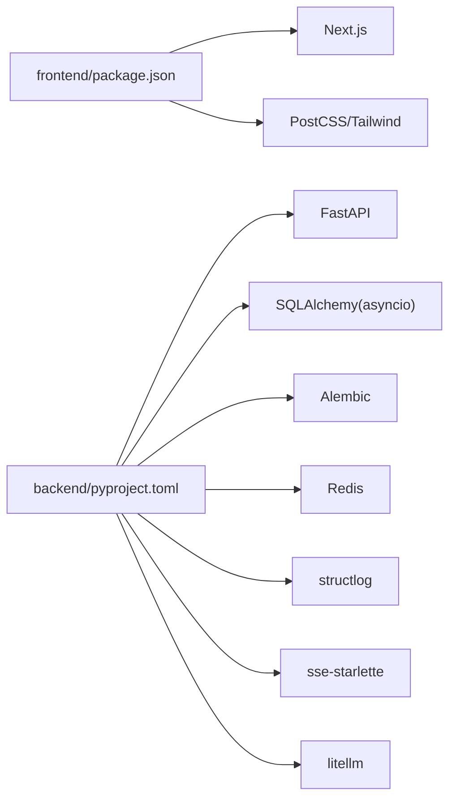

# 安全加固配置

<cite>
**本文引用的文件**
- [backend/app/main.py](file://backend/app/main.py)
- [backend/app/core/config.py](file://backend/app/core/config.py)
- [backend/app/core/logger.py](file://backend/app/core/logger.py)
- [backend/app/core/exceptions.py](file://backend/app/core/exceptions.py)
- [backend/app/core/tracer.py](file://backend/app/core/tracer.py)
- [backend/app/api/task_routes.py](file://backend/app/api/task_routes.py)
- [backend/app/api/stream_routes.py](file://backend/app/api/stream_routes.py)
- [backend/app/api/agent_routes.py](file://backend/app/api/agent_routes.py)
- [backend/app/api/skill_routes.py](file://backend/app/api/skill_routes.py)
- [frontend/next.config.ts](file://frontend/next.config.ts)
- [backend/pyproject.toml](file://backend/pyproject.toml)
- [frontend/package.json](file://frontend/package.json)
</cite>

## 目录
1. [简介](#简介)
2. [项目结构](#项目结构)
3. [核心组件](#核心组件)
4. [架构总览](#架构总览)
5. [详细组件分析](#详细组件分析)
6. [依赖分析](#依赖分析)
7. [性能考虑](#性能考虑)
8. [故障排查指南](#故障排查指南)
9. [结论](#结论)
10. [附录](#附录)

## 简介
本指南面向HotClaw生产环境的安全加固，围绕防火墙与网络访问控制、WAF配置、HTTPS与TLS证书、API安全（认证授权、速率限制、CORS）、以及安全审计与合规（OWASP Top 10防护与定期扫描）等方面，结合代码库中的现有实现与部署边界，提供可操作的配置建议与最佳实践。由于仓库中未包含具体的安全中间件或外部WAF集成代码，本指南在“可落地”的部分基于现有代码与常见生产实践给出明确步骤；在“概念性”部分则提供通用指导。

## 项目结构
HotClaw采用前后端分离架构：前端为Next.js应用，后端为FastAPI服务，二者通过本地反向代理进行联调。生产环境中应通过反向代理统一对外暴露后端接口，并在反向代理层实施统一的安全策略。

图表来源
- [frontend/next.config.ts:1-15](file://frontend/next.config.ts#L1-L15)
- [backend/app/main.py:1-142](file://backend/app/main.py#L1-L142)
- [backend/app/api/task_routes.py:1-163](file://backend/app/api/task_routes.py#L1-L163)
- [backend/app/api/stream_routes.py:1-43](file://backend/app/api/stream_routes.py#L1-L43)
- [backend/app/core/config.py:1-51](file://backend/app/core/config.py#L1-L51)

章节来源
- [frontend/next.config.ts:1-15](file://frontend/next.config.ts#L1-L15)
- [backend/app/main.py:1-142](file://backend/app/main.py#L1-L142)
- [backend/app/core/config.py:1-51](file://backend/app/core/config.py#L1-L51)

## 核心组件
- 配置中心：集中管理数据库、缓存、LLM、应用运行参数与超时等，支持从环境变量加载。
- 日志系统：基于structlog的结构化日志，便于审计与问题定位。
- 异常体系：统一错误码与分类，便于前端与监控系统识别。
- 追踪链路：全局Trace ID注入，便于跨服务追踪。
- API路由：任务、流式事件、技能与代理配置等接口，统一在主应用中注册。

章节来源
- [backend/app/core/config.py:1-51](file://backend/app/core/config.py#L1-L51)
- [backend/app/core/logger.py:1-36](file://backend/app/core/logger.py#L1-L36)
- [backend/app/core/exceptions.py:1-125](file://backend/app/core/exceptions.py#L1-L125)
- [backend/app/core/tracer.py:1-34](file://backend/app/core/tracer.py#L1-L34)
- [backend/app/main.py:1-142](file://backend/app/main.py#L1-L142)

## 架构总览
下图展示生产环境中的典型安全加固路径：前端通过反向代理访问后端，反向代理负责TLS终止、WAF、限流与CORS策略，后端仅处理业务逻辑与数据持久化。

图表来源
- [backend/app/main.py:67-74](file://backend/app/main.py#L67-L74)
- [frontend/next.config.ts:4-11](file://frontend/next.config.ts#L4-L11)

## 详细组件分析

### 防火墙与网络访问控制
- 入站端口开放策略
  - 反向代理：仅开放对外端口（如443），对内后端端口（如8000）仅允许反向代理访问。
  - 后端服务：仅监听内网地址（如127.0.0.1或容器内部网络），避免直接暴露。
- IP白名单
  - 在反向代理层配置可信源IP白名单，拒绝来自未知来源的请求。
  - 对运维入口（如健康检查、调试接口）单独设置更严格的访问控制。
- DDoS防护
  - 使用CDN/云厂商提供的DDoS防护能力，开启自动清洗与弹性带宽扩容。
  - 在反向代理层启用连接数与并发请求数限制，防止资源耗尽。

说明：以上为通用生产实践建议，具体实现需结合部署平台与网络架构。

### Web应用防火墙（WAF）
- 规则定制
  - 基于OWASP CRS规则集，启用SQL注入、XSS、命令注入、文件包含等核心防护。
  - 针对业务特征定制例外规则（如特定API路径、合法上传类型）。
- 威胁检测
  - 开启实时阻断与记录模式，对高风险请求立即阻断并记录上下文。
  - 结合日志与告警系统，对异常流量进行分级处置。

说明：本节为概念性指导，实际WAF规则需在部署平台侧完成。

### HTTPS与TLS证书
- 证书申请与安装
  - 使用ACME协议（Let’s Encrypt）自动化申请与续期，确保证书有效期与到期提醒。
  - 在反向代理层终止TLS，后端保持明文通信或仅内网访问。
- 安全参数优化
  - 仅启用现代TLS版本与加密套件，禁用过时算法与弱密码学参数。
  - 启用OCSP Stapling、HSTS、前向保密（PFS）等安全增强选项。
  - 配置合理的会话复用与超时策略，平衡性能与安全。

说明：本节为通用实践，证书管理需在反向代理层完成。

### API安全配置
- 认证与授权
  - 在反向代理层接入统一认证（如OAuth2/JWT），后端按需校验令牌有效性。
  - 对敏感接口（如配置修改、批量操作）启用更强的鉴权与审计。
- 速率限制
  - 在反向代理层按IP/用户维度设置QPS与配额，超过阈值进行限流或熔断。
  - 对不同接口设置差异化限速策略，保护核心路径。
- CORS策略
  - 生产环境收紧CORS白名单，仅允许受信域名访问。
  - 明确允许的方法、头与凭据策略，避免过度宽松导致跨域风险。

章节来源
- [backend/app/main.py:67-74](file://backend/app/main.py#L67-L74)
- [frontend/next.config.ts:4-11](file://frontend/next.config.ts#L4-L11)

### 安全审计与合规
- OWASP Top 10防护
  - 将OWASP Top 10映射到WAF规则与后端输入校验，覆盖注入类、身份缺陷、配置错误、日志缺失等。
  - 对高危接口增加额外校验与审计埋点。
- 定期安全扫描
  - 使用自动化工具对后端接口与静态资源进行漏洞扫描与配置核查。
  - 对第三方依赖进行定期安全评估与升级。

说明：本节为通用实践，扫描工具与策略需结合组织流程落地。

## 依赖分析
后端依赖以FastAPI为核心，配合数据库、缓存、异步I/O与结构化日志等模块。前端通过Next.js构建，开发时通过本地反向代理访问后端。

图表来源
- [backend/pyproject.toml:6-22](file://backend/pyproject.toml#L6-L22)
- [frontend/package.json:11-21](file://frontend/package.json#L11-L21)

章节来源
- [backend/pyproject.toml:1-41](file://backend/pyproject.toml#L1-L41)
- [frontend/package.json:1-23](file://frontend/package.json#L1-L23)

## 性能考虑
- 反向代理层的TLS卸载与连接池复用可显著降低后端CPU开销。
- 对慢查询与长连接进行限流与超时控制，避免级联故障。
- 合理设置日志级别与输出格式，减少I/O瓶颈。

## 故障排查指南
- 统一日志与追踪
  - 使用结构化日志与Trace ID，快速定位请求链路与异常节点。
  - 关注异常处理器映射关系，确保错误码与HTTP状态一致。
- 健康检查与可观测性
  - 利用健康检查端点确认服务可用性，结合外部探针进行多地域探测。
  - 对关键接口设置SLA与告警阈值，及时发现性能退化。

章节来源
- [backend/app/core/logger.py:8-36](file://backend/app/core/logger.py#L8-L36)
- [backend/app/core/tracer.py:10-34](file://backend/app/core/tracer.py#L10-L34)
- [backend/app/main.py:87-129](file://backend/app/main.py#L87-L129)
- [backend/app/main.py:139-142](file://backend/app/main.py#L139-L142)

## 结论
本指南基于HotClaw现有代码与生产部署边界，提出了可操作的安全加固方案。建议优先在反向代理层完成TLS终止、WAF与CORS策略配置，后端专注于业务逻辑与数据安全。同时建立完善的日志、追踪与告警体系，持续开展安全扫描与合规评估，确保系统在生产环境中的安全性与稳定性。

## 附录
- 部署脚本与启动方式
  - 提供启动脚本用于本地开发与测试，生产环境建议使用容器编排与平台化部署。
- 版本与依赖
  - 后端与前端均采用现代化技术栈，建议定期更新依赖以修复已知漏洞。

章节来源
- [backend/pyproject.toml:1-41](file://backend/pyproject.toml#L1-L41)
- [frontend/package.json:1-23](file://frontend/package.json#L1-L23)