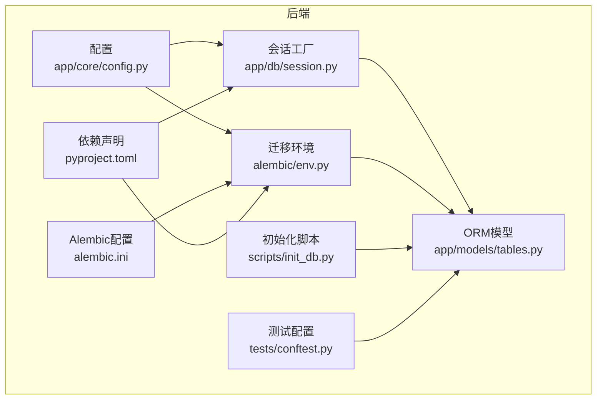
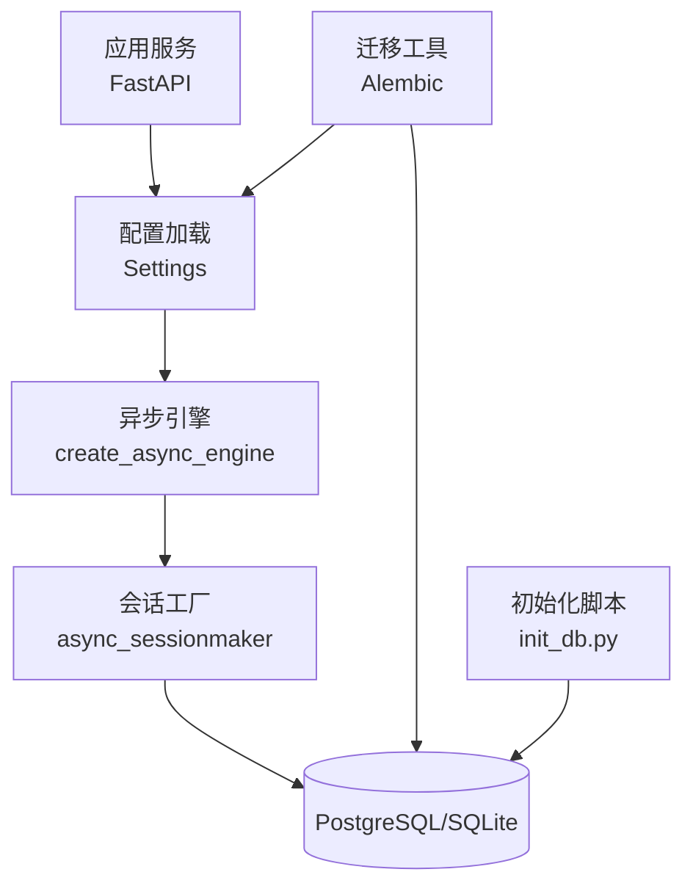
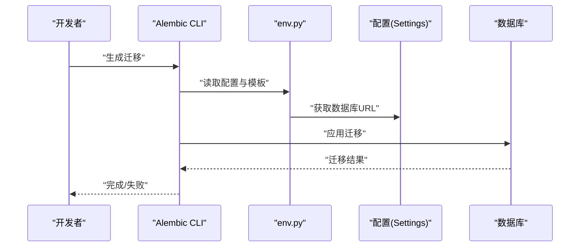
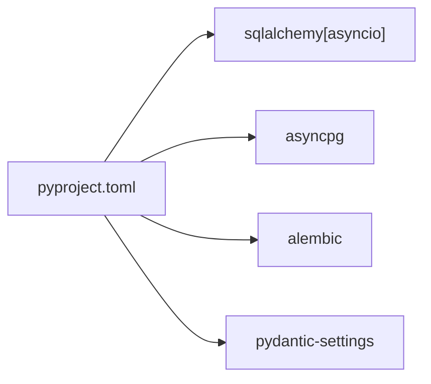

# 数据库配置

<cite>
**本文引用的文件**
- [backend/app/core/config.py](file://backend/app/core/config.py)
- [backend/app/db/session.py](file://backend/app/db/session.py)
- [backend/alembic.ini](file://backend/alembic.ini)
- [backend/alembic/env.py](file://backend/alembic/env.py)
- [backend/alembic/script.py.mako](file://backend/alembic/script.py.mako)
- [backend/scripts/init_db.py](file://backend/scripts/init_db.py)
- [backend/app/models/tables.py](file://backend/app/models/tables.py)
- [backend/pyproject.toml](file://backend/pyproject.toml)
- [backend/tests/conftest.py](file://backend/tests/conftest.py)
</cite>

## 目录
1. [简介](#简介)
2. [项目结构](#项目结构)
3. [核心组件](#核心组件)
4. [架构总览](#架构总览)
5. [详细组件分析](#详细组件分析)
6. [依赖分析](#依赖分析)
7. [性能考虑](#性能考虑)
8. [故障排查指南](#故障排查指南)
9. [结论](#结论)
10. [附录](#附录)

## 简介
本指南面向HotClaw生产环境，聚焦数据库安装与配置、Alembic迁移工具的使用、性能优化、备份与恢复策略以及监控与维护。文档基于后端仓库中的实际实现进行梳理，确保可操作性和一致性。

## 项目结构
后端采用异步SQLAlchemy与Alembic进行数据库访问与迁移管理，配置通过环境变量注入，开发与生产分别使用SQLite与PostgreSQL。迁移脚本模板由Alembic提供，初始化脚本用于一次性创建所有表。

图表来源
- [backend/app/core/config.py:1-51](file://backend/app/core/config.py#L1-L51)
- [backend/app/db/session.py:1-33](file://backend/app/db/session.py#L1-L33)
- [backend/alembic.ini:1-39](file://backend/alembic.ini#L1-L39)
- [backend/alembic/env.py:1-53](file://backend/alembic/env.py#L1-L53)
- [backend/app/models/tables.py:1-233](file://backend/app/models/tables.py#L1-L233)
- [backend/scripts/init_db.py:1-16](file://backend/scripts/init_db.py#L1-L16)
- [backend/pyproject.toml:1-41](file://backend/pyproject.toml#L1-L41)
- [backend/tests/conftest.py:1-48](file://backend/tests/conftest.py#L1-L48)

章节来源
- [backend/app/core/config.py:1-51](file://backend/app/core/config.py#L1-L51)
- [backend/app/db/session.py:1-33](file://backend/app/db/session.py#L1-L33)
- [backend/alembic.ini:1-39](file://backend/alembic.ini#L1-L39)
- [backend/alembic/env.py:1-53](file://backend/alembic/env.py#L1-L53)
- [backend/app/models/tables.py:1-233](file://backend/app/models/tables.py#L1-L233)
- [backend/scripts/init_db.py:1-16](file://backend/scripts/init_db.py#L1-L16)
- [backend/pyproject.toml:1-41](file://backend/pyproject.toml#L1-L41)
- [backend/tests/conftest.py:1-48](file://backend/tests/conftest.py#L1-L48)

## 核心组件
- 应用配置（环境变量驱动）
  - 数据库URL：开发默认SQLite，生产建议PostgreSQL（asyncpg）。
  - Redis、LLM、应用运行参数、日志级别、超时等。
- 异步数据库引擎与会话
  - 基于环境变量动态选择连接方式；非SQLite启用连接预检查。
  - FastAPI依赖注入提供事务级会话，异常自动回滚。
- Alembic迁移
  - 异步迁移环境，从配置读取数据库URL，支持离线与在线迁移。
  - 迁移脚本模板由Alembic提供，版本目录为空（首次需生成）。
- 初始化脚本
  - 一次性创建所有表，便于首次部署或本地验证。
- 测试配置
  - 使用内存SQLite，便于CI与单元测试，不依赖PostgreSQL。

章节来源
- [backend/app/core/config.py:1-51](file://backend/app/core/config.py#L1-L51)
- [backend/app/db/session.py:1-33](file://backend/app/db/session.py#L1-L33)
- [backend/alembic/env.py:1-53](file://backend/alembic/env.py#L1-L53)
- [backend/alembic/script.py.mako:1-24](file://backend/alembic/script.py.mako#L1-L24)
- [backend/scripts/init_db.py:1-16](file://backend/scripts/init_db.py#L1-L16)
- [backend/tests/conftest.py:1-48](file://backend/tests/conftest.py#L1-L48)

## 架构总览
下图展示生产环境数据库层的关键交互：应用通过异步引擎与会话工厂访问数据库；Alembic在部署时执行迁移；初始化脚本用于首次建表；测试使用内存SQLite隔离。

图表来源
- [backend/app/core/config.py:1-51](file://backend/app/core/config.py#L1-L51)
- [backend/app/db/session.py:1-33](file://backend/app/db/session.py#L1-L33)
- [backend/alembic/env.py:1-53](file://backend/alembic/env.py#L1-L53)
- [backend/scripts/init_db.py:1-16](file://backend/scripts/init_db.py#L1-L16)

## 详细组件分析

### 数据库安装与配置（PostgreSQL）
- 版本与驱动
  - 生产使用PostgreSQL + asyncpg驱动，满足异步I/O与高并发。
  - 开发默认SQLite，便于本地快速启动。
- 连接URL与环境变量
  - 通过环境变量注入数据库URL，避免硬编码。
  - 非SQLite连接启用连接预检查以提升稳定性。
- 内存与连接池
  - 当前实现未显式配置连接池大小与生命周期参数。
  - 建议在生产中结合数据库实例规格与QPS估算，设置合适的池大小与超时参数（例如最大连接数、空闲连接数、连接生命周期）。

章节来源
- [backend/app/core/config.py:1-51](file://backend/app/core/config.py#L1-L51)
- [backend/app/db/session.py:1-33](file://backend/app/db/session.py#L1-L33)
- [backend/pyproject.toml:1-41](file://backend/pyproject.toml#L1-L41)

### Alembic迁移工具配置与使用
- 配置文件
  - 指定脚本位置与默认数据库URL（开发环境示例），生产应替换为真实PostgreSQL地址。
- 迁移环境
  - 从配置读取数据库URL，支持离线与在线迁移。
  - 在线迁移使用异步引擎，避免阻塞。
- 迁移脚本模板
  - 使用Alembic提供的脚本模板，定义升级与降级逻辑。
- 使用流程
  - 生成迁移：在本地或CI中执行迁移生成命令，编辑生成的脚本。
  - 应用迁移：在目标环境执行迁移，确保数据库版本一致。
  - 回滚策略：通过降级脚本回退到上一版本，建议在变更窗口内进行。

图表来源
- [backend/alembic.ini:1-39](file://backend/alembic.ini#L1-L39)
- [backend/alembic/env.py:1-53](file://backend/alembic/env.py#L1-L53)
- [backend/app/core/config.py:1-51](file://backend/app/core/config.py#L1-L51)

章节来源
- [backend/alembic.ini:1-39](file://backend/alembic.ini#L1-L39)
- [backend/alembic/env.py:1-53](file://backend/alembic/env.py#L1-L53)
- [backend/alembic/script.py.mako:1-24](file://backend/alembic/script.py.mako#L1-L24)

### 数据库性能优化
- 索引策略
  - 对高频查询字段建立索引，如日志表中的任务ID与追踪ID字段。
  - 谨慎评估写入性能与查询性能的平衡，避免过度索引。
- 查询优化
  - 使用分页查询与条件过滤，避免全表扫描。
  - 对复杂关联查询进行EXPLAIN分析，识别瓶颈。
- 缓存配置
  - 结合Redis缓存热点数据，降低数据库压力。
  - 注意缓存失效策略与一致性问题。

章节来源
- [backend/app/models/tables.py:1-233](file://backend/app/models/tables.py#L1-L233)
- [backend/app/core/config.py:1-51](file://backend/app/core/config.py#L1-L51)

### 备份与恢复策略
- 全量备份
  - 使用数据库自带工具进行全量导出，定期归档。
- 增量备份
  - 启用WAL归档（PostgreSQL），按需恢复到指定时间点。
- 灾难恢复
  - 制定RTO/RPO目标，演练恢复流程，验证备份数据可用性。
  - 将备份存储在异地，防止区域性故障影响。

章节来源
- [backend/alembic/env.py:1-53](file://backend/alembic/env.py#L1-L53)

### 监控与维护
- 慢查询日志
  - 启用慢查询日志，结合查询分析工具定位热点SQL。
- 统计信息
  - 定期更新统计信息，帮助查询优化器生成合理执行计划。
- pg_stat_statements
  - 启用扩展收集SQL执行统计，辅助性能分析与调优。

章节来源
- [backend/alembic.ini:1-39](file://backend/alembic.ini#L1-L39)

## 依赖分析
- 异步SQLAlchemy与asyncpg
  - 提供高性能异步数据库访问能力，适配高并发场景。
- Alembic
  - 提供数据库迁移管理，配合异步环境保证迁移过程稳定。
- Pydantic Settings
  - 从环境变量加载配置，支持类型校验与默认值。

图表来源
- [backend/pyproject.toml:1-41](file://backend/pyproject.toml#L1-L41)

章节来源
- [backend/pyproject.toml:1-41](file://backend/pyproject.toml#L1-L41)

## 性能考虑
- 连接池参数
  - 建议根据峰值并发与数据库实例规格设定最大连接数、空闲连接数与连接超时。
- 事务与锁
  - 控制事务粒度，减少长事务与锁竞争。
- 索引与分区
  - 对历史表进行分区或归档，降低热数据扫描范围。
- 监控与告警
  - 建立关键指标阈值告警，及时发现性能退化。

章节来源
- [backend/app/db/session.py:1-33](file://backend/app/db/session.py#L1-L33)
- [backend/app/models/tables.py:1-233](file://backend/app/models/tables.py#L1-L233)

## 故障排查指南
- 连接失败
  - 检查数据库URL、凭据与网络连通性；确认驱动版本兼容。
- 迁移失败
  - 查看迁移日志，核对数据库权限与目标版本；必要时手动修复脚本。
- 事务异常
  - 确认异常处理与回滚逻辑；避免在会话关闭后继续使用。
- 测试环境差异
  - 测试使用内存SQLite，注意与PostgreSQL行为差异导致的测试不稳定。

章节来源
- [backend/app/db/session.py:1-33](file://backend/app/db/session.py#L1-L33)
- [backend/tests/conftest.py:1-48](file://backend/tests/conftest.py#L1-L48)

## 结论
本指南基于现有代码实现，明确了生产环境数据库的配置要点、迁移流程与运维策略。建议在生产部署时补充连接池参数、索引与查询优化方案，并完善备份恢复与监控体系，以保障系统稳定性与可维护性。

## 附录
- 初始化数据库
  - 使用初始化脚本一次性创建所有表，适用于首次部署或本地验证。
- 测试数据库
  - 测试使用内存SQLite，无需PostgreSQL依赖，适合CI与单测。

章节来源
- [backend/scripts/init_db.py:1-16](file://backend/scripts/init_db.py#L1-L16)
- [backend/tests/conftest.py:1-48](file://backend/tests/conftest.py#L1-L48)