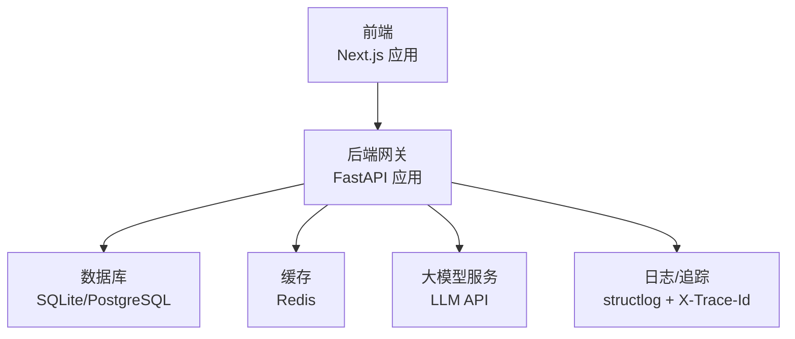
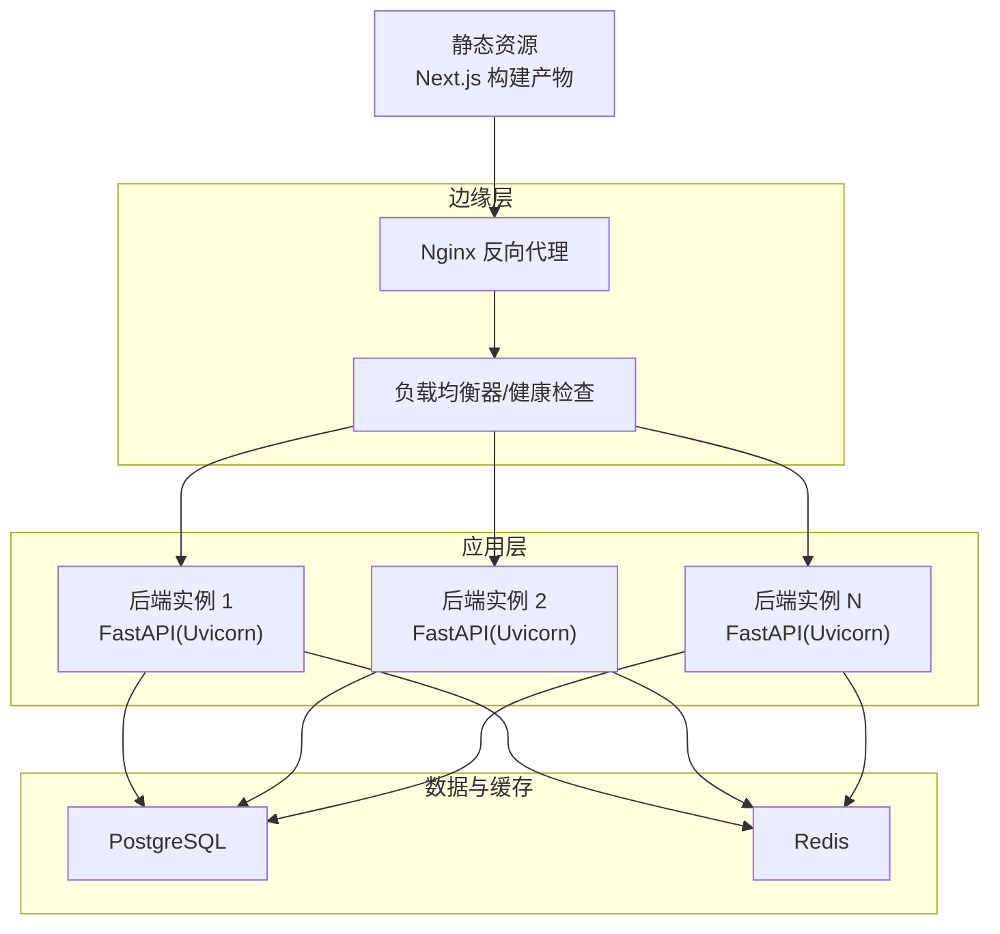
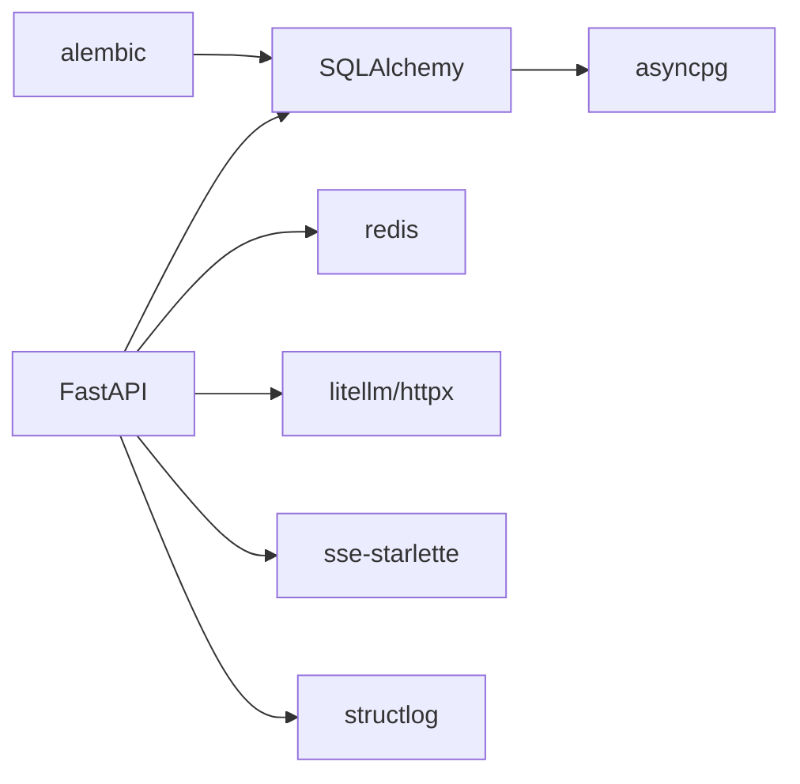

# 生产环境部署

<cite>
**本文引用的文件**
- [ARCHITECTURE.md](file://ARCHITECTURE.md)
- [backend/pyproject.toml](file://backend/pyproject.toml)
- [backend/app/core/config.py](file://backend/app/core/config.py)
- [backend/alembic.ini](file://backend/alembic.ini)
- [scripts/init_db.py](file://scripts/init_db.py)
- [backend/app/main.py](file://backend/app/main.py)
- [frontend/next.config.ts](file://frontend/next.config.ts)
- [OpenClaw-bot-review-main/Dockerfile](file://OpenClaw-bot-review-main/Dockerfile)
- [start.sh](file://start.sh)
- [start.bat](file://start.bat)
</cite>

## 目录
1. [简介](#简介)
2. [项目结构](#项目结构)
3. [核心组件](#核心组件)
4. [架构总览](#架构总览)
5. [详细组件分析](#详细组件分析)
6. [依赖分析](#依赖分析)
7. [性能考虑](#性能考虑)
8. [故障排查指南](#故障排查指南)
9. [结论](#结论)
10. [附录](#附录)

## 简介
本指南面向HotClaw生产环境部署，覆盖系统要求与硬件配置建议、数据库安装与性能调优、环境变量与安全配置、静态资源与反向代理、负载均衡与高可用、监控与日志、以及安全加固措施。文档基于仓库中的架构设计、后端技术栈与配置、前端Next.js重写规则、以及脚本与Dockerfile等实际文件进行整理，确保部署步骤可落地、可验证。

## 项目结构
HotClaw采用前后端分离架构：前端为Next.js应用，后端为FastAPI服务，二者通过HTTP API交互；后端使用异步数据库连接与SSE推送任务状态；配置通过环境变量注入，支持SQLite开发与PostgreSQL生产切换。

图表来源
- [ARCHITECTURE.md: 417-427:417-427](file://ARCHITECTURE.md#L417-L427)
- [backend/app/core/config.py: 7-47:7-47](file://backend/app/core/config.py#L7-L47)
- [backend/app/main.py: 60-84:60-84](file://backend/app/main.py#L60-L84)

章节来源
- [ARCHITECTURE.md: 39-78:39-78](file://ARCHITECTURE.md#L39-L78)
- [frontend/next.config.ts: 3-12:3-12](file://frontend/next.config.ts#L3-L12)
- [backend/app/main.py: 60-84:60-84](file://backend/app/main.py#L60-L84)

## 核心组件
- 后端服务（FastAPI）
  - 路由与SSE端点、CORS中间件、全局异常处理、健康检查端点
  - 通过环境变量注入数据库URL、Redis、LLM配置、超时参数等
- 数据库
  - 开发默认SQLite，生产推荐PostgreSQL；提供Alembic迁移配置与初始化脚本
- 前端（Next.js）
  - 本地开发时通过rewrites将/api/*转发至后端8000端口
- 部署与运行
  - 提供跨平台启动脚本，分别启动后端Uvicorn与前端Next开发服务器
  - 提供Dockerfile用于构建生产镜像（适用于OpenClaw-bot-review前端）

章节来源
- [backend/app/main.py: 14-142:14-142](file://backend/app/main.py#L14-L142)
- [backend/app/core/config.py: 7-47:7-47](file://backend/app/core/config.py#L7-L47)
- [backend/alembic.ini: 3-6:3-6](file://backend/alembic.ini#L3-L6)
- [scripts/init_db.py: 8-16:8-16](file://scripts/init_db.py#L8-L16)
- [frontend/next.config.ts: 3-12:3-12](file://frontend/next.config.ts#L3-L12)
- [OpenClaw-bot-review-main/Dockerfile: 1-27:1-27](file://OpenClaw-bot-review-main/Dockerfile#L1-L27)
- [start.sh: 51-79:51-79](file://start.sh#L51-L79)
- [start.bat: 47-74:47-74](file://start.bat#L47-L74)

## 架构总览
生产部署建议采用“反向代理 + 多实例 + 数据库/缓存”模式：Nginx作为入口，后端以多实例运行并通过健康检查保障可用性；数据库使用PostgreSQL并启用连接池与备份；缓存使用Redis；日志与追踪通过结构化日志与X-Trace-Id贯穿请求链路。

图表来源
- [backend/app/main.py: 139-142:139-142](file://backend/app/main.py#L139-L142)
- [backend/app/core/config.py: 7-47:7-47](file://backend/app/core/config.py#L7-L47)

## 详细组件分析

### 后端服务（FastAPI）生产配置要点
- 环境变量与配置
  - 数据库URL：开发默认SQLite，生产应设置PostgreSQL连接串
  - Redis：用于会话/缓存
  - LLM：API Key、Base URL、默认模型名
  - 应用：环境、主机、端口、调试、日志级别
  - 超时：Agent、Skill、LLM超时秒数
- 中间件与异常处理
  - CORS：生产环境建议限制具体域名
  - 全局异常映射：根据业务错误码映射HTTP状态码
  - 健康检查：/api/v1/health
- SSE与日志
  - SSE端点用于任务状态推送
  - 结构化日志与X-Trace-Id便于追踪

章节来源
- [backend/app/core/config.py: 7-47:7-47](file://backend/app/core/config.py#L7-L47)
- [backend/app/main.py: 67-142:67-142](file://backend/app/main.py#L67-L142)

### 数据库（PostgreSQL）安装与配置
- 连接与迁移
  - 使用asyncpg驱动，Alembic配置默认指向本地PostgreSQL
  - 初始化脚本创建所有表
- 性能调优建议
  - 连接池大小：依据并发请求数与CPU核心数设定
  - 事务隔离级别：默认可读已提交，必要时调整
  - 索引：对高频查询列建立索引（如任务ID、时间戳）
  - 归档与备份：定期逻辑/物理备份，恢复演练
  - 监控：慢查询日志、Top SQL、连接数峰值

章节来源
- [backend/alembic.ini: 3-6:3-6](file://backend/alembic.ini#L3-L6)
- [scripts/init_db.py: 8-16:8-16](file://scripts/init_db.py#L8-L16)
- [backend/pyproject.toml: 9-11:9-11](file://backend/pyproject.toml#L9-L11)

### 环境变量与安全配置
- 安全基线
  - 仅在环境变量中存放敏感信息（数据库密码、LLM密钥、Redis密码）
  - 使用只读权限的数据库账户
  - 限制CORS白名单，避免通配符
  - 启用HTTPS与强密码策略
- 加密与访问控制
  - 使用操作系统级密钥管理（如KMS/Secrets Manager）或Vault
  - 文件权限：仅部署用户可读
  - 网络：数据库与缓存置于内网子网，必要时启用TLS

章节来源
- [backend/app/core/config.py: 23-31:23-31](file://backend/app/core/config.py#L23-L31)
- [backend/app/main.py: 67-74:67-74](file://backend/app/main.py#L67-L74)

### 静态资源与Nginx反向代理
- 前端构建与部署
  - Next.js生产构建产物可由Nginx直接提供
  - 若使用Dockerfile（OpenClaw-bot-review前端），镜像暴露3000端口
- 反向代理配置要点
  - 将/api/*转发至后端FastAPI实例
  - 启用gzip/缓存静态资源
  - 设置超时、缓冲与安全头
  - SSL/TLS：配置证书与私钥，启用现代加密套件

章节来源
- [frontend/next.config.ts: 3-12:3-12](file://frontend/next.config.ts#L3-L12)
- [OpenClaw-bot-review-main/Dockerfile: 21-26:21-26](file://OpenClaw-bot-review-main/Dockerfile#L21-L26)

### 负载均衡与高可用
- 多实例部署
  - 后端以多实例运行，结合健康检查端点实现自动摘挂
  - 使用Nginx/HAProxy/LBaaS作为入口，支持会话亲和或无状态
- 健康检查
  - /api/v1/health用于存活与就绪探针
  - 建议区分存活与就绪，避免在迁移期间接收流量
- 缓存与数据库
  - Redis集群/哨兵提升可用性
  - PostgreSQL主从/备库与自动故障转移

章节来源
- [backend/app/main.py: 139-142:139-142](file://backend/app/main.py#L139-L142)

### 性能监控与日志管理
- 监控指标
  - 应用：请求QPS、P95/P99延迟、错误率、并发连接数
  - 数据库：连接数、锁等待、慢查询、缓冲命中率
  - 缓存：命中率、过期与驱逐、内存使用
- 日志
  - 结构化日志：统一字段（trace_id、level、service、module、msg）
  - X-Trace-Id：贯穿请求链路，便于问题定位
  - 前端：SSE事件类型与频率，结合浏览器开发者工具观察

章节来源
- [backend/app/main.py: 77-84:77-84](file://backend/app/main.py#L77-L84)
- [ARCHITECTURE.md: 325-360:325-360](file://ARCHITECTURE.md#L325-L360)

### 安全加固
- 网络与防火墙
  - 仅开放Nginx/SSH端口，后端与数据库仅内网可达
  - 使用安全组/ACL限制来源IP
- WAF与防护
  - Nginx层限流与CC防护
  - API层速率限制与参数校验
- 审计与合规
  - 审计日志：访问、变更、异常
  - 定期安全扫描与漏洞评估

## 依赖分析
后端依赖关系（关键）：
- FastAPI：Web框架与SSE
- SQLAlchemy + asyncpg：异步ORM与PostgreSQL驱动
- alembic：数据库迁移
- structlog：结构化日志
- litellm/httpx：LLM调用与HTTP客户端
- redis：缓存
- sse-starlette：SSE事件推送

图表来源
- [backend/pyproject.toml: 6-22:6-22](file://backend/pyproject.toml#L6-L22)

章节来源
- [backend/pyproject.toml: 6-22:6-22](file://backend/pyproject.toml#L6-L22)

## 性能考虑
- 数据库
  - 连接池大小与最大连接数匹配CPU核心数
  - 读写分离与只读副本
  - 查询优化：索引、分页、避免N+1
- 缓存
  - 热数据放入Redis，合理TTL与淘汰策略
  - 缓存穿透与击穿防护
- 应用
  - 异步I/O与并发模型
  - 超时与熔断，避免级联故障
- 网络
  - CDN加速静态资源
  - TLS卸载与压缩

## 故障排查指南
- 健康检查
  - 访问 /api/v1/health 确认服务可用
- 日志
  - 查看后端结构化日志与X-Trace-Id
  - 关注全局异常处理器映射的HTTP状态码
- 数据库
  - 检查连接串、凭据与网络连通
  - 迁移是否成功，表结构是否存在
- 前端
  - 确认rewrites将/api/*转发至后端
  - 静态资源是否正确部署

章节来源
- [backend/app/main.py: 139-142:139-142](file://backend/app/main.py#L139-L142)
- [backend/app/main.py: 87-129:87-129](file://backend/app/main.py#L87-L129)
- [frontend/next.config.ts: 3-12:3-12](file://frontend/next.config.ts#L3-L12)

## 结论
本指南提供了HotClaw生产环境的完整部署蓝图：从系统与硬件要求、数据库与缓存配置、环境变量与安全策略，到静态资源与反向代理、负载均衡与高可用、监控与日志、以及安全加固。建议在预生产环境先行验证，再逐步推广至生产，确保变更可回滚、可观测、可审计。

## 附录

### A. 系统要求与硬件配置建议（示例）
- CPU：至少2核，建议4核以上以支撑并发与LLM调用
- 内存：至少4GB，建议8GB以上用于数据库与缓存
- 存储：SSD，数据库与日志分区分离；预留备份空间
- 网络：千兆以太网，低延迟内网用于数据库与缓存通信

### B. 数据库初始化与迁移
- 初始化脚本创建所有表
- Alembic配置默认指向本地PostgreSQL，生产需替换为真实地址

章节来源
- [scripts/init_db.py: 8-16:8-16](file://scripts/init_db.py#L8-L16)
- [backend/alembic.ini: 3-6:3-6](file://backend/alembic.ini#L3-L6)

### C. 启动与运行
- 跨平台启动脚本分别启动后端与前端
- Dockerfile可用于构建前端生产镜像

章节来源
- [start.sh: 51-79:51-79](file://start.sh#L51-L79)
- [start.bat: 47-74:47-74](file://start.bat#L47-L74)
- [OpenClaw-bot-review-main/Dockerfile: 1-27:1-27](file://OpenClaw-bot-review-main/Dockerfile#L1-L27)