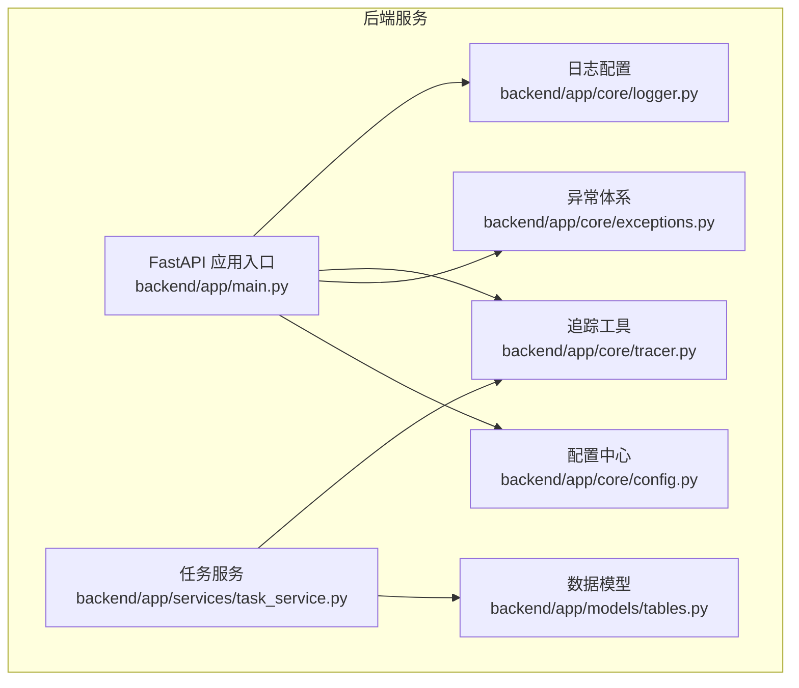
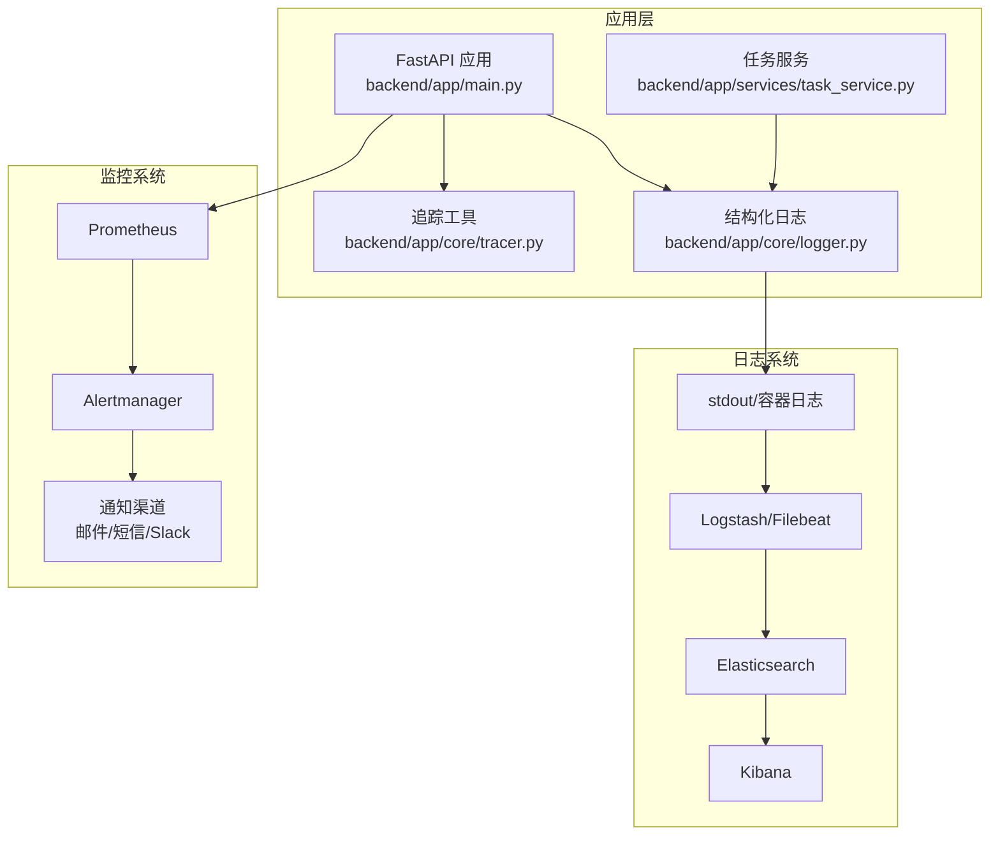
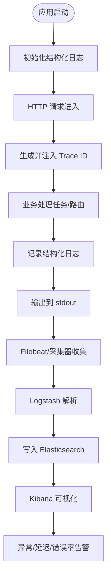
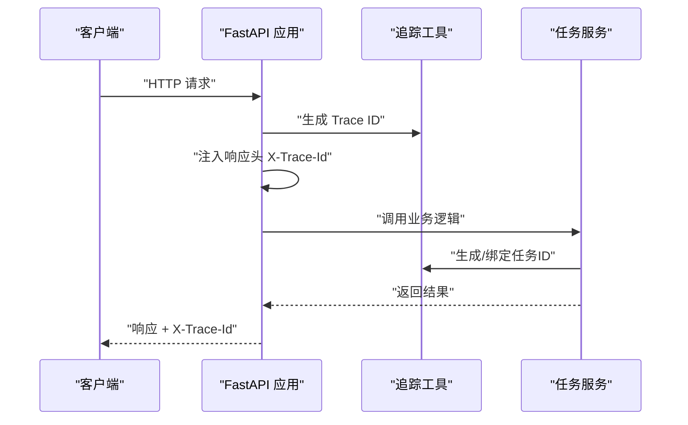
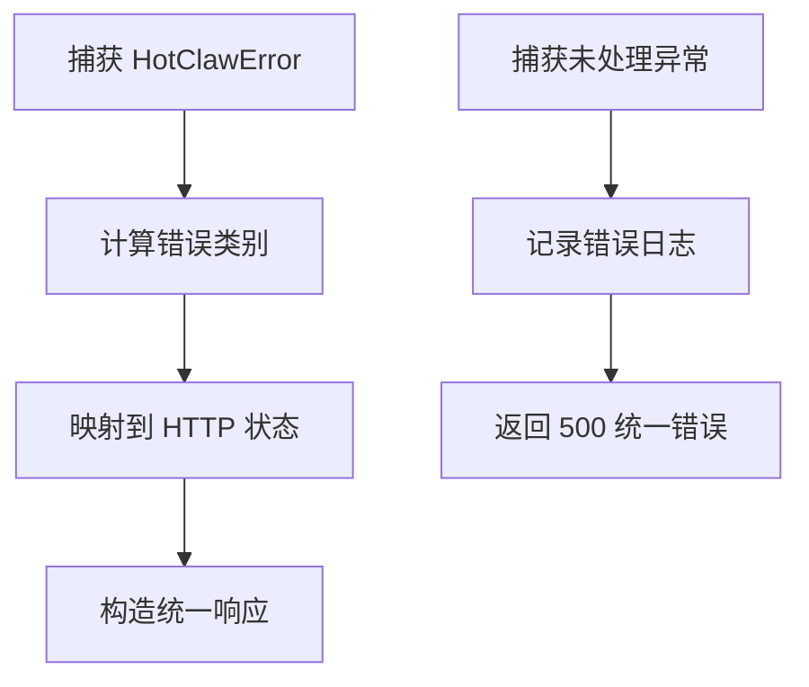
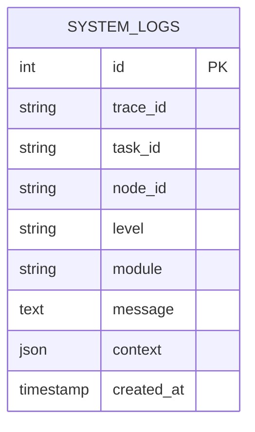
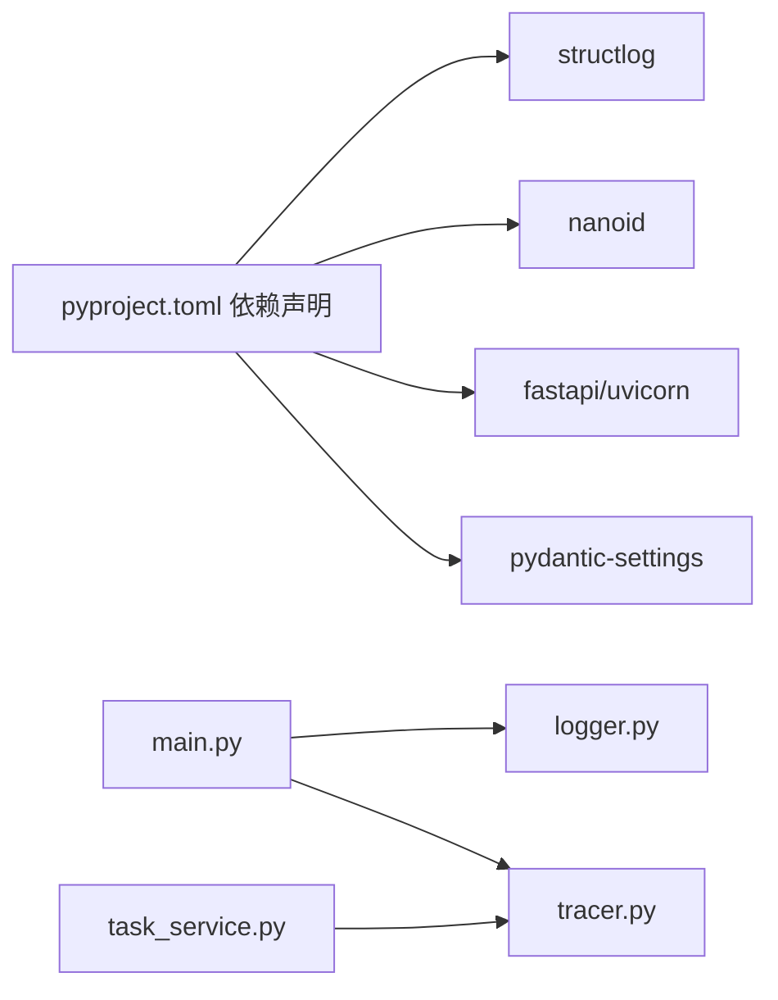

# 监控与日志管理

<cite>
**本文引用的文件**
- [backend/app/main.py](file://backend/app/main.py)
- [backend/app/core/logger.py](file://backend/app/core/logger.py)
- [backend/app/core/tracer.py](file://backend/app/core/tracer.py)
- [backend/app/core/config.py](file://backend/app/core/config.py)
- [backend/app/core/exceptions.py](file://backend/app/core/exceptions.py)
- [backend/app/services/task_service.py](file://backend/app/services/task_service.py)
- [backend/app/models/tables.py](file://backend/app/models/tables.py)
- [backend/pyproject.toml](file://backend/pyproject.toml)
</cite>

## 目录
1. [简介](#简介)
2. [项目结构](#项目结构)
3. [核心组件](#核心组件)
4. [架构总览](#架构总览)
5. [详细组件分析](#详细组件分析)
6. [依赖分析](#依赖分析)
7. [性能考虑](#性能考虑)
8. [故障排查指南](#故障排查指南)
9. [结论](#结论)
10. [附录](#附录)

## 简介
本指南面向HotClaw生产环境，系统性阐述监控与日志管理的配置与实践，覆盖以下方面：
- Prometheus监控：指标采集、告警规则与仪表板建议
- ELK（Elasticsearch、Logstash、Kibana）日志收集与可视化
- 分布式追踪：Trace ID生成、传播与性能分析
- 应用性能监控（APM）：关键业务指标与用户体验监控
- 告警通知与故障响应：邮件、短信与Slack集成策略

本指南在不直接粘贴代码的前提下，基于仓库中现有实现进行说明，并给出可落地的配置步骤与最佳实践。

## 项目结构
HotClaw后端采用FastAPI + SQLAlchemy异步架构，核心监控与日志能力由以下模块提供：
- 日志：结构化日志记录与渲染
- 追踪：全局Trace ID与任务ID生成与传播
- 异常：统一错误码映射HTTP状态，便于可观测性
- 数据模型：系统日志表支持结构化存储与查询
- 配置：集中式环境变量配置

图表来源
- [backend/app/main.py:1-142](file://backend/app/main.py#L1-L142)
- [backend/app/core/logger.py:1-36](file://backend/app/core/logger.py#L1-L36)
- [backend/app/core/tracer.py:1-34](file://backend/app/core/tracer.py#L1-L34)
- [backend/app/core/exceptions.py:1-125](file://backend/app/core/exceptions.py#L1-L125)
- [backend/app/services/task_service.py:1-126](file://backend/app/services/task_service.py#L1-L126)
- [backend/app/models/tables.py:1-233](file://backend/app/models/tables.py#L1-L233)
- [backend/app/core/config.py:1-51](file://backend/app/core/config.py#L1-L51)

章节来源
- [backend/app/main.py:1-142](file://backend/app/main.py#L1-L142)
- [backend/app/core/logger.py:1-36](file://backend/app/core/logger.py#L1-L36)
- [backend/app/core/tracer.py:1-34](file://backend/app/core/tracer.py#L1-L34)
- [backend/app/core/config.py:1-51](file://backend/app/core/config.py#L1-L51)

## 核心组件
- 结构化日志
  - 使用structlog配置JSON渲染，统一时间戳、堆栈信息与异常格式，便于ELK解析与检索。
  - 日志级别通过环境变量控制，支持生产环境精细化分级。
- 分布式追踪
  - 全局HTTP中间件为每个请求生成Trace ID，并通过响应头返回，便于跨服务链路追踪。
  - 提供任务级ID生成与上下文绑定，用于任务执行链路的关联与审计。
- 统一异常处理
  - 将自定义错误码映射到标准HTTP状态，简化监控侧告警与统计口径。
- 结构化系统日志表
  - 支持按trace_id、task_id索引，便于关联查询与聚合分析。
- 配置中心
  - 集中管理数据库、Redis、LLM、超时等参数，便于在不同环境间切换。

章节来源
- [backend/app/core/logger.py:8-36](file://backend/app/core/logger.py#L8-L36)
- [backend/app/core/tracer.py:10-34](file://backend/app/core/tracer.py#L10-L34)
- [backend/app/main.py:77-84](file://backend/app/main.py#L77-L84)
- [backend/app/core/exceptions.py:4-125](file://backend/app/core/exceptions.py#L4-L125)
- [backend/app/models/tables.py:220-233](file://backend/app/models/tables.py#L220-L233)
- [backend/app/core/config.py:7-51](file://backend/app/core/config.py#L7-L51)

## 架构总览
下图展示生产环境监控与日志管理的整体架构：应用层负责生成结构化日志与Trace ID；日志通过stdout输出，由容器平台或Filebeat收集至ELK；Prometheus抓取应用指标；告警通过Alertmanager分发至邮件、短信与Slack。

图表来源
- [backend/app/main.py:1-142](file://backend/app/main.py#L1-L142)
- [backend/app/core/logger.py:1-36](file://backend/app/core/logger.py#L1-L36)
- [backend/app/core/tracer.py:1-34](file://backend/app/core/tracer.py#L1-L34)
- [backend/app/services/task_service.py:1-126](file://backend/app/services/task_service.py#L1-L126)

## 详细组件分析

### 日志系统（ELK）
- 结构化日志输出
  - 使用JSON渲染器输出，字段包含时间戳、级别、模块、消息与上下文，便于自动解析。
  - 建议在容器编排中将stdout作为日志源，结合Filebeat或同机采集器推送至Logstash/Elasticsearch。
- 日志模型与检索
  - 系统日志表支持trace_id与task_id索引，便于跨模块关联查询。
  - 在Kibana中建立仪表板：按trace_id聚合查看请求全链路，按level统计错误趋势。
- 建议配置
  - Logstash Pipeline：解析JSON字段、重写时间戳、过滤敏感信息。
  - Kibana Index Pattern：匹配system_logs表结构，启用“按天”滚动索引。
  - 警戒阈值：ERROR/CRITICAL占比超过基线一定比例触发告警。

图表来源
- [backend/app/core/logger.py:8-36](file://backend/app/core/logger.py#L8-L36)
- [backend/app/models/tables.py:220-233](file://backend/app/models/tables.py#L220-L233)

章节来源
- [backend/app/core/logger.py:8-36](file://backend/app/core/logger.py#L8-L36)
- [backend/app/models/tables.py:220-233](file://backend/app/models/tables.py#L220-L233)

### 分布式追踪（Trace ID 传播）
- Trace ID生成与传播
  - HTTP中间件为每个请求生成唯一Trace ID，并通过响应头返回，便于客户端与下游服务识别。
  - 任务执行过程中生成任务ID并与Trace ID关联，便于端到端追踪。
- 性能分析
  - 在Kibana中按trace_id筛选，观察各节点耗时与错误分布，定位慢调用与失败点。
  - 结合数据库与外部API调用埋点，形成完整调用链。

图表来源
- [backend/app/main.py:77-84](file://backend/app/main.py#L77-L84)
- [backend/app/core/tracer.py:10-34](file://backend/app/core/tracer.py#L10-L34)
- [backend/app/services/task_service.py:39-64](file://backend/app/services/task_service.py#L39-L64)

章节来源
- [backend/app/main.py:77-84](file://backend/app/main.py#L77-L84)
- [backend/app/core/tracer.py:10-34](file://backend/app/core/tracer.py#L10-L34)
- [backend/app/services/task_service.py:39-64](file://backend/app/services/task_service.py#L39-L64)

### 统一异常处理与可观测性
- 错误码到HTTP状态映射
  - 将业务错误分类映射到标准HTTP状态，便于Prometheus抓取错误率指标与告警。
- 日志记录
  - 未捕获异常统一记录，包含路径与错误摘要，便于快速定位问题。
- 建议指标
  - 按错误码/HTTP状态分组的错误计数、P95/P99延迟、成功率。

图表来源
- [backend/app/main.py:87-129](file://backend/app/main.py#L87-L129)
- [backend/app/core/exceptions.py:4-125](file://backend/app/core/exceptions.py#L4-L125)

章节来源
- [backend/app/main.py:87-129](file://backend/app/main.py#L87-L129)
- [backend/app/core/exceptions.py:4-125](file://backend/app/core/exceptions.py#L4-L125)

### 结构化系统日志表（SystemLogModel）
- 字段设计
  - trace_id、task_id、node_id、level、module、message、context、created_at。
  - 对trace_id与task_id建立索引，提升关联查询效率。
- 使用场景
  - 将关键业务事件与异常统一写入该表，结合Kibana进行可视化与告警。
  - 与追踪ID联动，实现端到端审计与回放。

图表来源
- [backend/app/models/tables.py:220-233](file://backend/app/models/tables.py#L220-L233)

章节来源
- [backend/app/models/tables.py:220-233](file://backend/app/models/tables.py#L220-L233)

## 依赖分析
- 外部依赖
  - structlog：结构化日志渲染
  - nanoid：Trace ID与任务ID生成
  - pydantic-settings：环境变量配置加载
  - uvicorn/fastapi：Web框架与生命周期管理
- 内部耦合
  - 应用入口依赖日志与追踪配置，任务服务依赖追踪以保证链路一致性。
  - 异常体系为监控与告警提供统一语义。

图表来源
- [backend/pyproject.toml:1-41](file://backend/pyproject.toml#L1-L41)
- [backend/app/main.py:1-142](file://backend/app/main.py#L1-L142)
- [backend/app/core/logger.py:1-36](file://backend/app/core/logger.py#L1-L36)
- [backend/app/core/tracer.py:1-34](file://backend/app/core/tracer.py#L1-L34)
- [backend/app/services/task_service.py:1-126](file://backend/app/services/task_service.py#L1-L126)

章节来源
- [backend/pyproject.toml:1-41](file://backend/pyproject.toml#L1-L41)
- [backend/app/main.py:1-142](file://backend/app/main.py#L1-L142)

## 性能考虑
- 日志开销
  - JSON渲染与异常堆栈信息会增加序列化成本，建议在高并发场景下限制异常堆栈字段或采样输出。
- 追踪ID生成
  - nanoid生成短ID，开销极低；注意避免在高频短周期内重复生成过多ID。
- 数据库与外部API
  - 任务节点记录包含token用量与耗时，建议在Prometheus中暴露这些指标，结合KPI进行容量规划。
- 缓存与连接池
  - Redis与数据库连接池需根据QPS调整，避免成为瓶颈。

## 故障排查指南
- 快速定位
  - 使用Trace ID在Kibana中检索全链路日志，确认异常发生阶段与上下文。
  - 查看系统日志表中对应trace_id与task_id的记录，核对业务状态变更。
- 常见问题
  - 任务长时间处于运行态：检查任务服务中的异常处理与广播逻辑，确认是否正确上报失败。
  - 错误码映射异常：核对统一异常处理器的状态映射逻辑。
- 建议流程
  - 发现异常 → 获取Trace ID → Kibana检索 → 定位服务与节点 → 回溯系统日志 → 修复与验证 → 补充告警。

章节来源
- [backend/app/main.py:87-129](file://backend/app/main.py#L87-L129)
- [backend/app/services/task_service.py:39-64](file://backend/app/services/task_service.py#L39-L64)
- [backend/app/models/tables.py:220-233](file://backend/app/models/tables.py#L220-L233)

## 结论
通过结构化日志、统一追踪与异常处理，HotClaw已具备完善的可观测性基础。结合ELK实现日志采集与可视化，结合Prometheus与Alertmanager实现指标与告警，即可构建生产级监控体系。建议在现有基础上补充指标导出与告警规则，持续优化日志与追踪的粒度与成本。

## 附录

### Prometheus 监控配置要点
- 指标采集
  - 导出应用内部关键指标：任务总数、成功/失败计数、P95/P99延迟、Token用量、错误率。
  - 采集系统指标：CPU、内存、连接数、队列长度。
- 告警规则
  - 错误率阈值、延迟突增、任务积压、外部API不可用。
- 仪表板
  - 任务执行看板：成功率、平均耗时、节点耗时分布。
  - 追踪看板：Trace ID分布、慢请求TopN、错误链路分析。

### ELK 日志系统部署与配置
- 输出与采集
  - stdout输出配合Filebeat或同机采集器，确保JSON字段完整。
- 解析与索引
  - Logstash Pipeline解析时间戳、错误级别、trace_id与task_id。
  - Elasticsearch索引按天滚动，保留期根据合规要求设定。
- 可视化
  - Kibana仪表板：错误趋势、Trace ID聚合、慢请求分析。

### 分布式追踪与性能分析
- Trace ID传播
  - 响应头返回X-Trace-Id，前端与SDK透传至下游服务。
- 性能分析
  - 以trace_id为单位聚合链路耗时，识别慢节点与异常路径。

### APM 集成建议
- 关键业务指标
  - 任务完成率、平均耗时、节点失败率、Token消耗。
- 用户体验监控
  - 前端首屏时间、交互延迟、错误率与用户反馈。

### 告警通知与故障响应
- 通知渠道
  - 邮件：面向值班与团队
  - 短信：面向紧急故障
  - Slack：面向实时协作与升级
- 响应策略
  - 一级告警：15分钟内响应，2小时内解决
  - 二级告警：30分钟内响应，4小时内解决
  - 三级告警：1小时内响应，24小时内解决