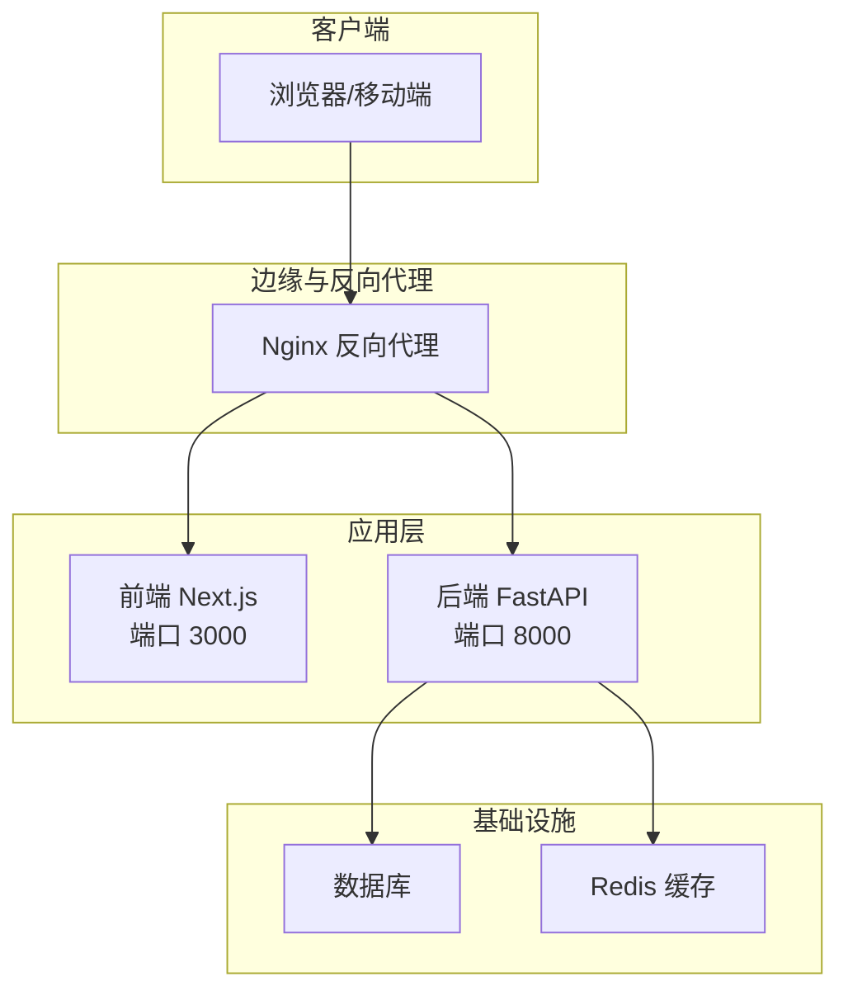
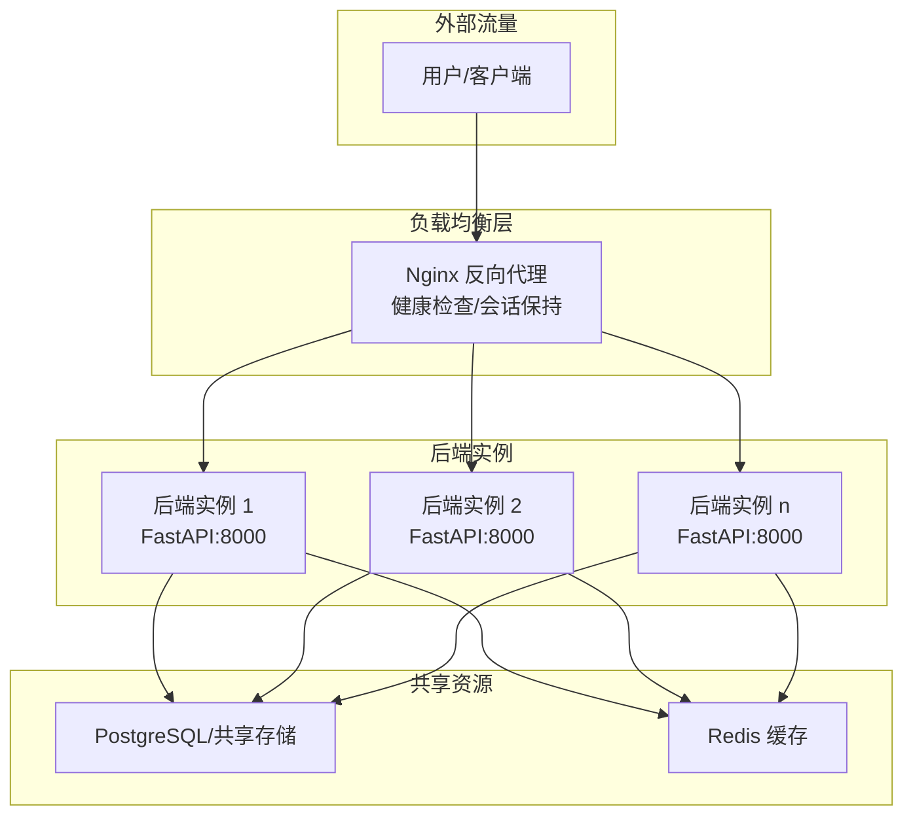
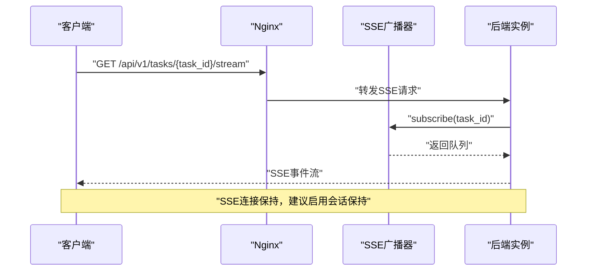
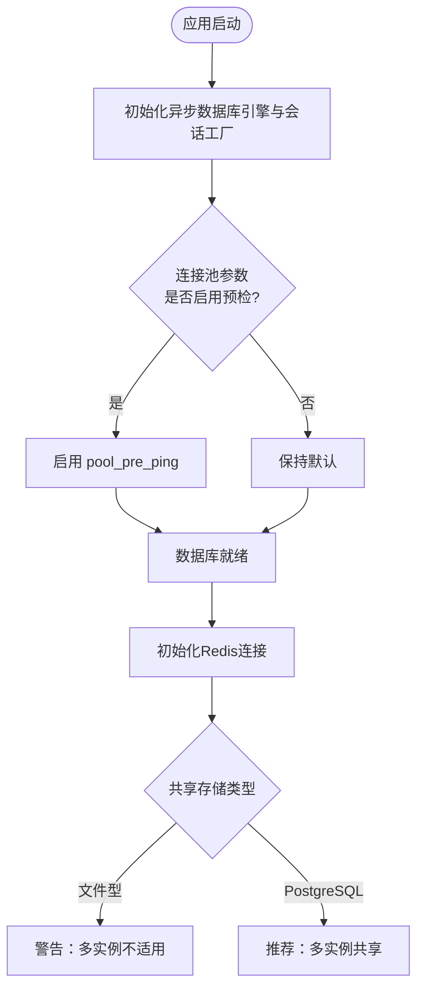
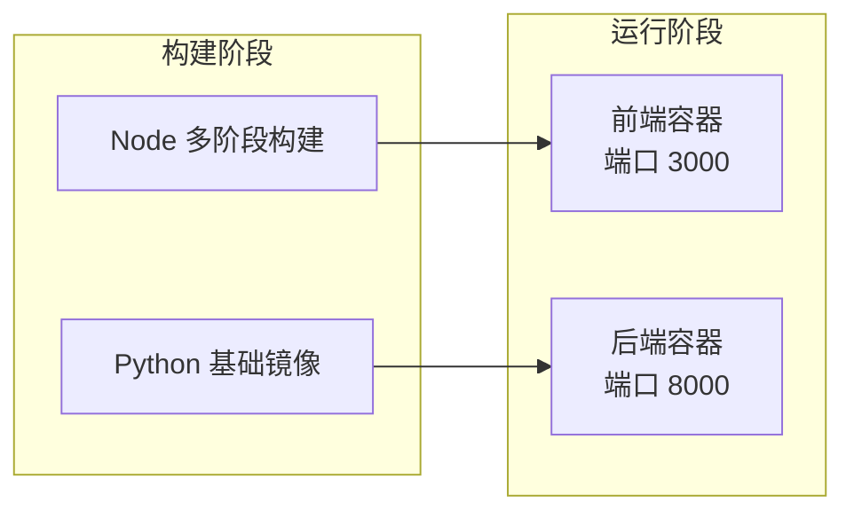
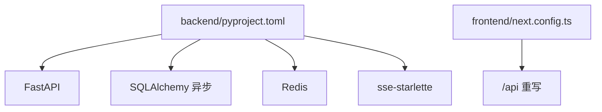

# 负载均衡配置

<cite>
**本文引用的文件**
- [ARCHITECTURE.md](file://ARCHITECTURE.md)
- [backend/app/main.py](file://backend/app/main.py)
- [backend/app/api/stream_routes.py](file://backend/app/api/stream_routes.py)
- [backend/app/orchestrator/broadcaster.py](file://backend/app/orchestrator/broadcaster.py)
- [backend/app/db/session.py](file://backend/app/db/session.py)
- [backend/app/core/config.py](file://backend/app/core/config.py)
- [backend/pyproject.toml](file://backend/pyproject.toml)
- [frontend/next.config.ts](file://frontend/next.config.ts)
- [OpenClaw-bot-review-main/Dockerfile](file://OpenClaw-bot-review-main/Dockerfile)
- [start.sh](file://start.sh)
</cite>

## 目录
1. [简介](#简介)
2. [项目结构](#项目结构)
3. [核心组件](#核心组件)
4. [架构总览](#架构总览)
5. [详细组件分析](#详细组件分析)
6. [依赖分析](#依赖分析)
7. [性能考量](#性能考量)
8. [故障排查指南](#故障排查指南)
9. [结论](#结论)
10. [附录](#附录)

## 简介
本指南面向HotClaw生产环境的负载均衡与高可用部署，围绕以下目标展开：
- Nginx反向代理配置：上游服务器、健康检查、会话保持策略
- Docker容器化与编排：镜像构建、容器网络、自动扩缩容建议
- WebSocket与SSE：连接特性、粘性会话与状态同步
- 多实例部署：共享存储、数据库连接池、缓存一致性
- 性能监控与故障转移：指标采集、健康探针、故障切换

HotClaw采用前后端分离架构：前端Next.js应用通过本地重写将/api转发至后端FastAPI服务；后端通过SSE向前端推送任务执行状态。系统当前MVP阶段为单机单进程，生产环境建议通过反向代理与容器编排实现多实例部署与高可用。

## 项目结构
- 前端（Next.js）：通过本地重写将/api请求转发至后端服务端口
- 后端（FastAPI）：提供REST API与SSE事件流，内部通过广播器管理事件队列
- 数据与缓存：数据库连接池、Redis连接
- 部署：Dockerfile用于前端镜像构建，脚本用于本地联调

图表来源
- [frontend/next.config.ts:1-15](file://frontend/next.config.ts#L1-L15)
- [backend/app/main.py:60-85](file://backend/app/main.py#L60-L85)
- [backend/app/api/stream_routes.py:14-43](file://backend/app/api/stream_routes.py#L14-L43)
- [backend/app/db/session.py:8-19](file://backend/app/db/session.py#L8-L19)
- [backend/app/core/config.py:8-20](file://backend/app/core/config.py#L8-L20)

章节来源
- [frontend/next.config.ts:1-15](file://frontend/next.config.ts#L1-L15)
- [backend/app/main.py:60-85](file://backend/app/main.py#L60-L85)
- [backend/app/api/stream_routes.py:14-43](file://backend/app/api/stream_routes.py#L14-L43)
- [backend/app/db/session.py:8-19](file://backend/app/db/session.py#L8-L19)
- [backend/app/core/config.py:8-20](file://backend/app/core/config.py#L8-L20)

## 核心组件
- 反向代理与入口
  - Nginx作为统一入口，转发/api到后端服务，支持健康检查与会话保持
- 后端服务
  - FastAPI提供REST与SSE，SSE通过广播器管理事件队列
- 数据与缓存
  - 异步数据库连接池、Redis连接
- 前端
  - 本地重写将/api转发至后端，便于开发与生产一致化

章节来源
- [backend/app/main.py:60-85](file://backend/app/main.py#L60-L85)
- [backend/app/api/stream_routes.py:14-43](file://backend/app/api/stream_routes.py#L14-L43)
- [backend/app/orchestrator/broadcaster.py:11-94](file://backend/app/orchestrator/broadcaster.py#L11-L94)
- [backend/app/db/session.py:8-19](file://backend/app/db/session.py#L8-L19)
- [backend/app/core/config.py:8-20](file://backend/app/core/config.py#L8-L20)
- [frontend/next.config.ts:1-15](file://frontend/next.config.ts#L1-L15)

## 架构总览
HotClaw生产环境推荐的负载均衡拓扑如下：
- 多实例后端：通过Nginx上游指向多个后端实例，启用健康检查与会话保持
- 前端静态资源与API：Nginx同时提供静态资源与API反代
- 数据与缓存：数据库与Redis作为共享资源，后端通过连接池访问

图表来源
- [backend/app/core/config.py:8-20](file://backend/app/core/config.py#L8-L20)
- [backend/app/db/session.py:8-19](file://backend/app/db/session.py#L8-L19)
- [backend/app/main.py:60-85](file://backend/app/main.py#L60-L85)

## 详细组件分析

### Nginx反向代理配置要点
- 上游服务器
  - 定义后端集群，包含至少两个实例，便于故障转移
- 健康检查
  - 建议对后端健康端点进行探测，失败时从上游剔除
- 会话保持
  - SSE连接为长连接，建议启用基于IP或Cookie的会话保持，避免连接漂移
- API与静态资源
  - 将/api前缀转发至后端，静态资源由Nginx直出

章节来源
- [backend/app/main.py:139-142](file://backend/app/main.py#L139-L142)
- [frontend/next.config.ts:4-11](file://frontend/next.config.ts#L4-L11)

### SSE事件流与粘性会话
- SSE连接特性
  - 单向事件推送，连接生命周期长，适合粘性会话
- 粘性会话策略
  - 通过Nginx会话保持，确保同一客户端的SSE连接始终落在同一后端实例
- 状态同步
  - 广播器在内存维护订阅队列与历史事件，实例重启可能丢失历史；生产建议引入共享存储或消息队列

图表来源
- [backend/app/api/stream_routes.py:14-43](file://backend/app/api/stream_routes.py#L14-L43)
- [backend/app/orchestrator/broadcaster.py:30-45](file://backend/app/orchestrator/broadcaster.py#L30-L45)

章节来源
- [backend/app/api/stream_routes.py:14-43](file://backend/app/api/stream_routes.py#L14-L43)
- [backend/app/orchestrator/broadcaster.py:11-94](file://backend/app/orchestrator/broadcaster.py#L11-L94)

### 数据库连接池与缓存一致性
- 数据库
  - 使用异步引擎与会话工厂，生产环境建议启用连接池参数与预检
- 缓存
  - Redis用于会话与临时状态，建议使用集群或哨兵提高可用性
- 共享存储
  - 文件型数据库（如SQLite）不适合多实例共享；生产应使用PostgreSQL等共享存储

图表来源
- [backend/app/db/session.py:8-19](file://backend/app/db/session.py#L8-L19)
- [backend/app/core/config.py:8-20](file://backend/app/core/config.py#L8-L20)

章节来源
- [backend/app/db/session.py:8-19](file://backend/app/db/session.py#L8-L19)
- [backend/app/core/config.py:8-20](file://backend/app/core/config.py#L8-L20)

### Docker容器化与编排
- 前端镜像
  - 使用多阶段构建，生产环境暴露固定端口并设置环境变量
- 后端镜像
  - 建议基于Python基础镜像，使用Uvicorn运行FastAPI
- 编排与扩缩容
  - 使用容器编排平台（如Kubernetes）管理后端实例，结合水平扩展与健康检查
  - 前端可按需扩展，静态资源由CDN分发

图表来源
- [OpenClaw-bot-review-main/Dockerfile:1-27](file://OpenClaw-bot-review-main/Dockerfile#L1-L27)
- [backend/pyproject.toml:1-41](file://backend/pyproject.toml#L1-L41)

章节来源
- [OpenClaw-bot-review-main/Dockerfile:1-27](file://OpenClaw-bot-review-main/Dockerfile#L1-L27)
- [backend/pyproject.toml:1-41](file://backend/pyproject.toml#L1-L41)

### 多实例部署配置
- 共享存储
  - 数据库：PostgreSQL（或兼容的云数据库）
  - 文件：对象存储或共享卷（不建议使用本地文件系统）
- 数据库连接池
  - 合理设置最大连接数、空闲连接、超时与预检
- 缓存一致性
  - Redis集群/哨兵，避免单点；SSE历史事件建议持久化或通过消息队列保障
- 会话保持
  - Nginx启用基于IP或Cookie的会话保持，确保SSE连接稳定

章节来源
- [backend/app/core/config.py:8-20](file://backend/app/core/config.py#L8-L20)
- [backend/app/db/session.py:8-19](file://backend/app/db/session.py#L8-L19)
- [backend/app/orchestrator/broadcaster.py:11-94](file://backend/app/orchestrator/broadcaster.py#L11-L94)

### WebSocket与SSE对比
- SSE（推荐）
  - 单向推送，实现简单，适合事件流场景
  - 与Nginx会话保持配合良好
- WebSocket（如需双向）
  - 需要更复杂的粘性会话与状态同步策略
  - 建议使用支持会话亲和的负载均衡器

章节来源
- [ARCHITECTURE.md:325-360](file://ARCHITECTURE.md#L325-L360)
- [backend/app/api/stream_routes.py:14-43](file://backend/app/api/stream_routes.py#L14-L43)

## 依赖分析
- 后端依赖
  - FastAPI、SQLAlchemy异步、Redis、SSE Starlette等
- 前端依赖
  - Next.js、rewrites将/api转发至后端
- 部署依赖
  - Dockerfile定义前端镜像构建流程

图表来源
- [backend/pyproject.toml:6-22](file://backend/pyproject.toml#L6-L22)
- [frontend/next.config.ts:4-11](file://frontend/next.config.ts#L4-L11)

章节来源
- [backend/pyproject.toml:1-41](file://backend/pyproject.toml#L1-L41)
- [frontend/next.config.ts:1-15](file://frontend/next.config.ts#L1-L15)

## 性能考量
- 连接池与超时
  - 数据库连接池参数与超时设置直接影响吞吐与稳定性
- 缓存命中率
  - Redis命中率与延迟影响整体响应时间
- SSE事件缓冲
  - 广播器内存缓冲适合短时事件，长期事件建议持久化或消息队列
- Nginx并发与会话保持
  - 合理配置worker_connections与会话保持策略，避免连接抖动

章节来源
- [backend/app/db/session.py:8-19](file://backend/app/db/session.py#L8-L19)
- [backend/app/orchestrator/broadcaster.py:11-94](file://backend/app/orchestrator/broadcaster.py#L11-L94)
- [backend/app/core/config.py:42-46](file://backend/app/core/config.py#L42-L46)

## 故障排查指南
- 健康检查
  - 后端健康端点用于负载均衡器探测，异常时及时摘除实例
- SSE连接断开
  - 检查Nginx会话保持、超时与keepalive配置
  - 广播器历史事件清理策略，避免实例重启导致事件丢失
- 数据库连接问题
  - 检查连接池大小、超时与预检参数
- 前后端连通性
  - 前端重写规则与后端监听地址、端口一致性

章节来源
- [backend/app/main.py:139-142](file://backend/app/main.py#L139-L142)
- [backend/app/api/stream_routes.py:14-43](file://backend/app/api/stream_routes.py#L14-L43)
- [backend/app/orchestrator/broadcaster.py:70-85](file://backend/app/orchestrator/broadcaster.py#L70-L85)
- [frontend/next.config.ts:4-11](file://frontend/next.config.ts#L4-L11)

## 结论
- 生产环境建议通过Nginx实现反向代理与会话保持，后端采用多实例部署
- SSE事件流适合当前架构，结合Nginx会话保持与合理的连接池配置
- 共享存储与缓存需满足多实例一致性要求，避免单点与数据丢失
- 通过健康检查与自动扩缩容提升可用性与弹性

## 附录
- 本地联调脚本
  - 后端启动后等待前端启动，便于本地联调

章节来源
- [start.sh:58-78](file://start.sh#L58-L78)