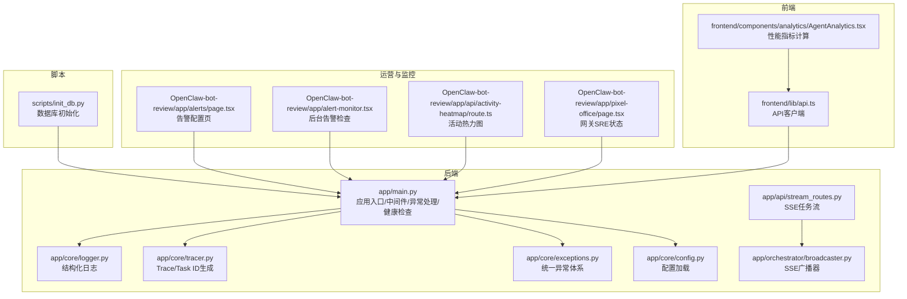
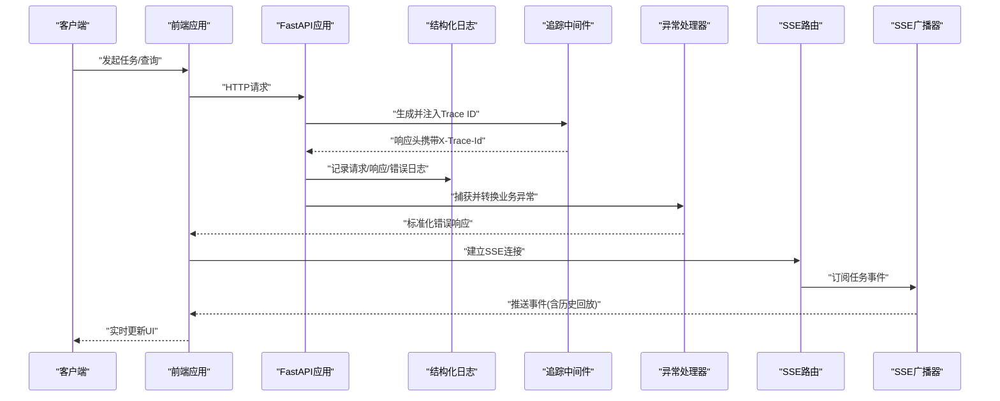
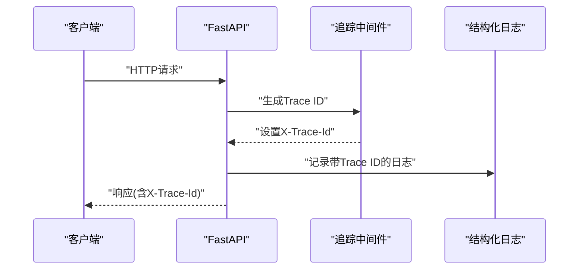
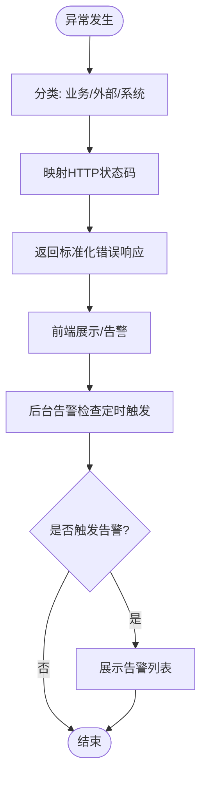
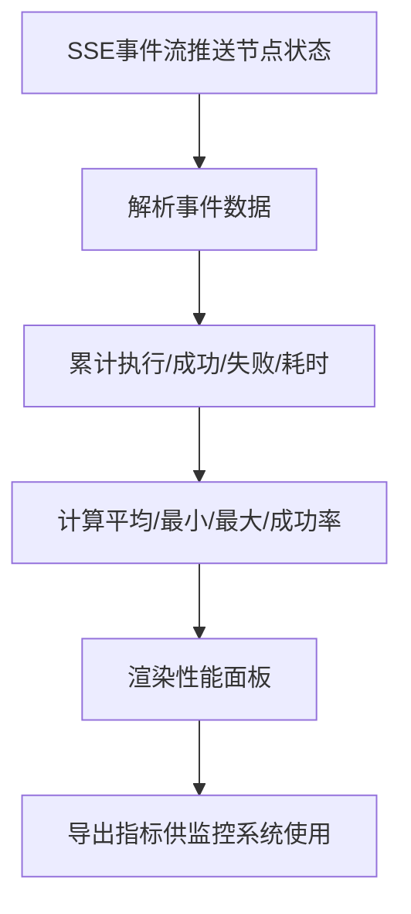
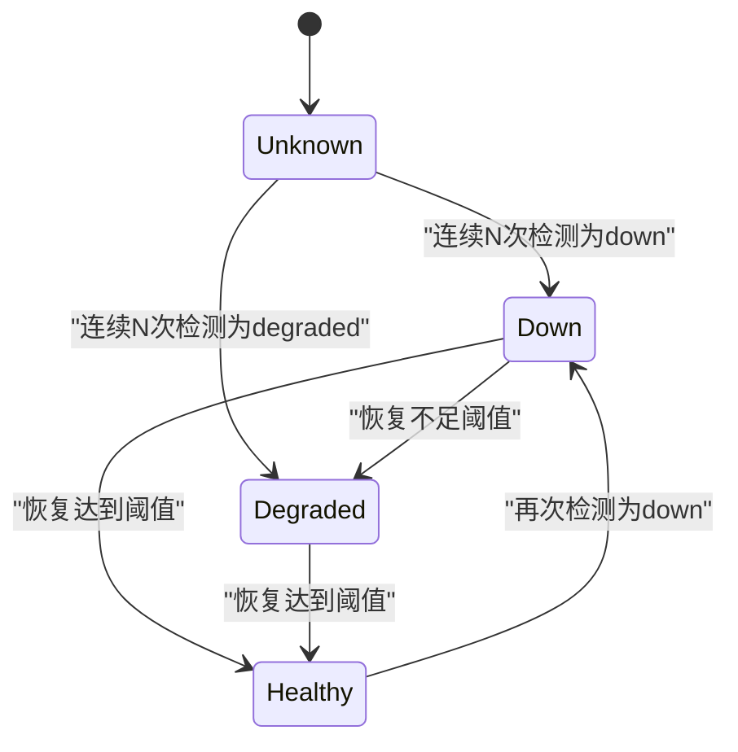
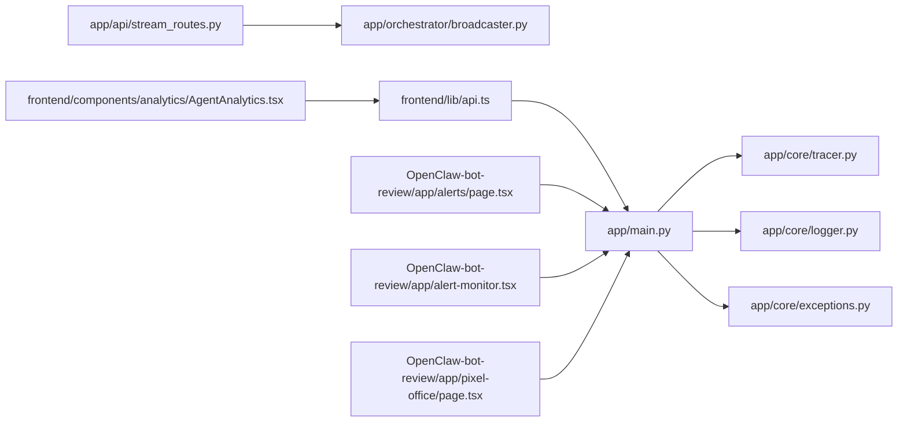

# 监控运维

<cite>
**本文引用的文件**
- [backend/app/core/logger.py](file://backend/app/core/logger.py)
- [backend/app/core/tracer.py](file://backend/app/core/tracer.py)
- [backend/app/core/config.py](file://backend/app/core/config.py)
- [backend/app/main.py](file://backend/app/main.py)
- [backend/app/orchestrator/broadcaster.py](file://backend/app/orchestrator/broadcaster.py)
- [backend/app/api/stream_routes.py](file://backend/app/api/stream_routes.py)
- [backend/app/core/exceptions.py](file://backend/app/core/exceptions.py)
- [scripts/init_db.py](file://scripts/init_db.py)
- [frontend/lib/api.ts](file://frontend/lib/api.ts)
- [frontend/components/analytics/AgentAnalytics.tsx](file://frontend/components/analytics/AgentAnalytics.tsx)
- [OpenClaw-bot-review-main/app/alerts/page.tsx](file://OpenClaw-bot-review-main/app/alerts/page.tsx)
- [OpenClaw-bot-review-main/app/alert-monitor.tsx](file://OpenClaw-bot-review-main/app/alert-monitor.tsx)
- [OpenClaw-bot-review-main/app/api/activity-heatmap/route.ts](file://OpenClaw-bot-review-main/app/api/activity-heatmap/route.ts)
- [OpenClaw-bot-review-main/app/pixel-office/page.tsx](file://OpenClaw-bot-review-main/app/pixel-office/page.tsx)
</cite>

## 目录
1. [简介](#简介)
2. [项目结构](#项目结构)
3. [核心组件](#核心组件)
4. [架构总览](#架构总览)
5. [详细组件分析](#详细组件分析)
6. [依赖分析](#依赖分析)
7. [性能考虑](#性能考虑)
8. [故障排查指南](#故障排查指南)
9. [结论](#结论)
10. [附录](#附录)

## 简介
本指南面向HotClaw项目的监控与运维团队，围绕应用日志系统、分布式追踪、错误监控与告警、性能监控指标、健康检查与可用性监控、故障自愈以及运维工具链与自动化脚本进行系统化说明。文档以仓库中现有实现为基础，结合前端可视化与后端中间件/路由/广播机制，给出可操作的配置建议与最佳实践。

## 项目结构
HotClaw采用前后端分离架构：后端基于FastAPI，提供REST与SSE事件流；前端Next.js应用负责任务状态实时展示与运营分析；OpenClaw-bot-review用于告警与网关健康状态展示；scripts目录提供数据库初始化脚本。

图表来源
- [backend/app/main.py:1-153](file://backend/app/main.py#L1-L153)
- [backend/app/core/logger.py:1-36](file://backend/app/core/logger.py#L1-L36)
- [backend/app/core/tracer.py:1-34](file://backend/app/core/tracer.py#L1-L34)
- [backend/app/api/stream_routes.py:1-43](file://backend/app/api/stream_routes.py#L1-L43)
- [backend/app/orchestrator/broadcaster.py:1-99](file://backend/app/orchestrator/broadcaster.py#L1-L99)
- [backend/app/core/exceptions.py:1-125](file://backend/app/core/exceptions.py#L1-L125)
- [frontend/lib/api.ts:1-289](file://frontend/lib/api.ts#L1-L289)
- [frontend/components/analytics/AgentAnalytics.tsx:48-259](file://frontend/components/analytics/AgentAnalytics.tsx#L48-L259)
- [OpenClaw-bot-review-main/app/alerts/page.tsx:49-321](file://OpenClaw-bot-review-main/app/alerts/page.tsx#L49-L321)
- [OpenClaw-bot-review-main/app/alert-monitor.tsx:1-44](file://OpenClaw-bot-review-main/app/alert-monitor.tsx#L1-L44)
- [OpenClaw-bot-review-main/app/api/activity-heatmap/route.ts:41-72](file://OpenClaw-bot-review-main/app/api/activity-heatmap/route.ts#L41-L72)
- [OpenClaw-bot-review-main/app/pixel-office/page.tsx:326-377](file://OpenClaw-bot-review-main/app/pixel-office/page.tsx#L326-L377)
- [scripts/init_db.py:1-16](file://scripts/init_db.py#L1-L16)

章节来源
- [backend/app/main.py:1-153](file://backend/app/main.py#L1-L153)
- [backend/app/core/config.py:1-99](file://backend/app/core/config.py#L1-L99)

## 核心组件
- 结构化日志系统：通过structlog配置JSON输出、时间戳、堆栈信息等处理器，支持按配置设置日志级别。
- 分布式追踪：HTTP中间件为每个请求生成Trace ID，并注入到响应头；同时提供Task ID生成能力。
- 异常与错误处理：统一异常基类与分类，全局异常处理器将业务错误映射为标准HTTP状态码。
- 实时事件流：SSE广播器维护订阅队列与历史缓冲，前端通过独立SSE地址连接。
- 健康检查：提供基础健康检查接口返回版本与状态。
- 运维与可视化：前端提供性能指标聚合、告警配置与检查、活动热力图、网关SRE状态机。

章节来源
- [backend/app/core/logger.py:1-36](file://backend/app/core/logger.py#L1-L36)
- [backend/app/core/tracer.py:1-34](file://backend/app/core/tracer.py#L1-L34)
- [backend/app/core/exceptions.py:1-125](file://backend/app/core/exceptions.py#L1-L125)
- [backend/app/api/stream_routes.py:1-43](file://backend/app/api/stream_routes.py#L1-L43)
- [backend/app/orchestrator/broadcaster.py:1-99](file://backend/app/orchestrator/broadcaster.py#L1-L99)
- [backend/app/main.py:150-153](file://backend/app/main.py#L150-L153)
- [frontend/components/analytics/AgentAnalytics.tsx:48-259](file://frontend/components/analytics/AgentAnalytics.tsx#L48-L259)
- [OpenClaw-bot-review-main/app/alerts/page.tsx:49-321](file://OpenClaw-bot-review-main/app/alerts/page.tsx#L49-L321)
- [OpenClaw-bot-review-main/app/alert-monitor.tsx:1-44](file://OpenClaw-bot-review-main/app/alert-monitor.tsx#L1-L44)
- [OpenClaw-bot-review-main/app/api/activity-heatmap/route.ts:41-72](file://OpenClaw-bot-review-main/app/api/activity-heatmap/route.ts#L41-L72)
- [OpenClaw-bot-review-main/app/pixel-office/page.tsx:326-377](file://OpenClaw-bot-review-main/app/pixel-office/page.tsx#L326-L377)

## 架构总览
下图展示了从请求进入、日志与追踪、异常处理、SSE事件流到前端可视化的整体流程。

图表来源
- [backend/app/main.py:86-93](file://backend/app/main.py#L86-L93)
- [backend/app/core/logger.py:8-31](file://backend/app/core/logger.py#L8-L31)
- [backend/app/core/exceptions.py:96-138](file://backend/app/core/exceptions.py#L96-L138)
- [backend/app/api/stream_routes.py:14-42](file://backend/app/api/stream_routes.py#L14-L42)
- [backend/app/orchestrator/broadcaster.py:30-89](file://backend/app/orchestrator/broadcaster.py#L30-L89)

## 详细组件分析

### 日志系统（结构化与级别）
- 配置方式：通过环境变量读取配置文件，加载至Settings对象；日志级别由配置项控制。
- 处理器链：包含上下文合并、级别过滤、日志名/级别注入、时间戳、堆栈渲染、异常格式化、Unicode解码、JSON渲染。
- 输出格式：JSON结构，便于集中采集与检索；时间戳采用ISO格式。
- 日志轮转：当前实现未见内置轮转策略，建议结合外部日志平台或容器日志驱动实现滚动与归档。

章节来源
- [backend/app/core/config.py:76-78](file://backend/app/core/config.py#L76-L78)
- [backend/app/core/logger.py:8-31](file://backend/app/core/logger.py#L8-L31)

### 分布式追踪（Span ID生成与传播）
- Trace ID生成：使用短ID生成器，前缀“tr_”；Task ID生成前缀“task_”，便于区分任务级与调用级追踪。
- 中间件传播：HTTP中间件在请求进入时生成Trace ID并写入响应头，便于跨服务链路关联。
- 使用建议：在下游服务/SDK中读取响应头中的Trace ID，确保端到端追踪连贯。

图表来源
- [backend/app/core/tracer.py:10-26](file://backend/app/core/tracer.py#L10-L26)
- [backend/app/main.py:86-93](file://backend/app/main.py#L86-L93)
- [backend/app/core/logger.py:33-35](file://backend/app/core/logger.py#L33-L35)

章节来源
- [backend/app/core/tracer.py:1-34](file://backend/app/core/tracer.py#L1-L34)
- [backend/app/main.py:86-93](file://backend/app/main.py#L86-L93)

### 错误监控与告警
- 统一异常体系：定义了多类别异常（输入校验、冲突、外部/执行、配置、系统），便于前端与监控系统识别。
- 全局异常处理：将业务错误映射为标准HTTP状态码；未捕获异常统一返回内部错误。
- 前端告警页面：提供告警开关、检查周期配置、手动触发检查、展示触发结果。
- 后台告警检查：组件在挂载后自动拉取配置并定时轮询检查接口，触发时记录到界面。

图表来源
- [backend/app/core/exceptions.py:4-125](file://backend/app/core/exceptions.py#L4-L125)
- [backend/app/main.py:96-138](file://backend/app/main.py#L96-L138)
- [OpenClaw-bot-review-main/app/alerts/page.tsx:49-321](file://OpenClaw-bot-review-main/app/alerts/page.tsx#L49-L321)
- [OpenClaw-bot-review-main/app/alert-monitor.tsx:1-44](file://OpenClaw-bot-review-main/app/alert-monitor.tsx#L1-L44)

章节来源
- [backend/app/core/exceptions.py:1-125](file://backend/app/core/exceptions.py#L1-L125)
- [backend/app/main.py:96-138](file://backend/app/main.py#L96-L138)
- [OpenClaw-bot-review-main/app/alerts/page.tsx:49-321](file://OpenClaw-bot-review-main/app/alerts/page.tsx#L49-L321)
- [OpenClaw-bot-review-main/app/alert-monitor.tsx:1-44](file://OpenClaw-bot-review-main/app/alert-monitor.tsx#L1-L44)

### 性能监控指标
- 指标定义：前端对Agent节点执行进行统计，计算执行次数、成功/失败次数、平均/最小/最大响应时间、成功率。
- 数据来源：SSE事件流推送节点运行状态与耗时字段，前端聚合计算。
- 可视化：提供仪表盘卡片与详细面板，支持按Agent筛选与雷达图占位。

图表来源
- [frontend/components/analytics/AgentAnalytics.tsx:48-259](file://frontend/components/analytics/AgentAnalytics.tsx#L48-L259)
- [backend/app/api/stream_routes.py:14-42](file://backend/app/api/stream_routes.py#L14-L42)
- [backend/app/orchestrator/broadcaster.py:57-68](file://backend/app/orchestrator/broadcaster.py#L57-L68)

章节来源
- [frontend/components/analytics/AgentAnalytics.tsx:48-259](file://frontend/components/analytics/AgentAnalytics.tsx#L48-L259)
- [backend/app/api/stream_routes.py:14-42](file://backend/app/api/stream_routes.py#L14-L42)
- [backend/app/orchestrator/broadcaster.py:57-68](file://backend/app/orchestrator/broadcaster.py#L57-L68)

### 系统健康检查与可用性监控
- 健康检查：提供基础健康检查接口，返回状态与版本信息。
- 网关可用性：前端页面实现网关状态机，通过连续计数阈值判断健康/降级/恢复，支持自动切换与恢复提示。
- 活动热力图：按周内小时粒度统计消息活动，支持缓存与时区转换。

图表来源
- [backend/app/main.py:150-153](file://backend/app/main.py#L150-L153)
- [OpenClaw-bot-review-main/app/pixel-office/page.tsx:326-377](file://OpenClaw-bot-review-main/app/pixel-office/page.tsx#L326-L377)
- [OpenClaw-bot-review-main/app/api/activity-heatmap/route.ts:41-72](file://OpenClaw-bot-review-main/app/api/activity-heatmap/route.ts#L41-L72)

章节来源
- [backend/app/main.py:150-153](file://backend/app/main.py#L150-L153)
- [OpenClaw-bot-review-main/app/pixel-office/page.tsx:326-377](file://OpenClaw-bot-review-main/app/pixel-office/page.tsx#L326-L377)
- [OpenClaw-bot-review-main/app/api/activity-heatmap/route.ts:41-72](file://OpenClaw-bot-review-main/app/api/activity-heatmap/route.ts#L41-L72)

### 故障自愈机制
- SSE历史回放：广播器维护事件历史，晚到订阅者可接收过去事件，避免竞态导致的丢失。
- 广播清理：任务结束后清理历史与订阅，防止内存泄漏。
- 健康状态机：网关状态机通过阈值与计数实现降级/恢复的稳定切换。

章节来源
- [backend/app/orchestrator/broadcaster.py:78-89](file://backend/app/orchestrator/broadcaster.py#L78-L89)
- [OpenClaw-bot-review-main/app/pixel-office/page.tsx:326-377](file://OpenClaw-bot-review-main/app/pixel-office/page.tsx#L326-L377)

### 运维工具链与自动化
- 数据库初始化：提供异步建表脚本，可在启动阶段或CI中执行。
- 前端SSE直连：为避免代理缓冲，前端直接连接后端SSE地址，保证实时性。
- 配置加载：后端优先加载根目录.env文件，再注入环境变量，便于本地开发与容器部署。

章节来源
- [scripts/init_db.py:8-11](file://scripts/init_db.py#L8-L11)
- [frontend/lib/api.ts:48-55](file://frontend/lib/api.ts#L48-L55)
- [backend/app/core/config.py:7-15](file://backend/app/core/config.py#L7-L15)

## 依赖分析
- 应用入口依赖：中间件依赖追踪模块；异常处理依赖统一异常类；SSE路由依赖广播器；日志依赖配置。
- 前端依赖：API客户端封装后端REST/SSE；性能面板依赖SSE事件数据；告警页面依赖后端告警接口；网关状态机依赖后端健康与SSE。

图表来源
- [backend/app/main.py:1-153](file://backend/app/main.py#L1-L153)
- [backend/app/core/tracer.py:1-34](file://backend/app/core/tracer.py#L1-L34)
- [backend/app/core/logger.py:1-36](file://backend/app/core/logger.py#L1-L36)
- [backend/app/core/exceptions.py:1-125](file://backend/app/core/exceptions.py#L1-L125)
- [backend/app/api/stream_routes.py:1-43](file://backend/app/api/stream_routes.py#L1-L43)
- [backend/app/orchestrator/broadcaster.py:1-99](file://backend/app/orchestrator/broadcaster.py#L1-L99)
- [frontend/lib/api.ts:1-289](file://frontend/lib/api.ts#L1-L289)
- [frontend/components/analytics/AgentAnalytics.tsx:1-259](file://frontend/components/analytics/AgentAnalytics.tsx#L1-L259)
- [OpenClaw-bot-review-main/app/alerts/page.tsx:1-321](file://OpenClaw-bot-review-main/app/alerts/page.tsx#L1-L321)
- [OpenClaw-bot-review-main/app/alert-monitor.tsx:1-44](file://OpenClaw-bot-review-main/app/alert-monitor.tsx#L1-L44)
- [OpenClaw-bot-review-main/app/pixel-office/page.tsx:1-377](file://OpenClaw-bot-review-main/app/pixel-office/page.tsx#L1-L377)

## 性能考虑
- SSE事件缓冲：广播器对历史事件进行缓冲，有助于晚到订阅者获取全量事件，但需注意内存占用；已通过延时清理避免泄漏。
- 前端性能：性能面板在渲染前完成聚合计算，避免重复计算；建议在大数据量场景下分页或采样。
- 日志开销：结构化JSON日志便于采集，但高频错误可能产生大量日志，建议结合采样与级别过滤。
- 健康检查：网关状态机使用阈值与计数，减少抖动；建议根据SLA调整阈值参数。

章节来源
- [backend/app/orchestrator/broadcaster.py:78-89](file://backend/app/orchestrator/broadcaster.py#L78-L89)
- [frontend/components/analytics/AgentAnalytics.tsx:48-259](file://frontend/components/analytics/AgentAnalytics.tsx#L48-L259)

## 故障排查指南
- 请求无Trace ID：确认中间件已注册且未被覆盖；检查响应头是否包含X-Trace-Id。
- SSE不推送：确认任务已开始并有事件；检查订阅队列是否存在；查看广播器历史是否清理过早。
- 异常未按预期返回：核对异常类型与状态码映射规则；检查全局异常处理器是否生效。
- 健康检查失败：检查后端健康接口返回；核对网关状态机阈值与计数逻辑。
- 日志未输出或格式异常：检查日志级别配置；确认structlog处理器链顺序与JSON渲染是否启用。

章节来源
- [backend/app/main.py:86-93](file://backend/app/main.py#L86-L93)
- [backend/app/orchestrator/broadcaster.py:30-89](file://backend/app/orchestrator/broadcaster.py#L30-L89)
- [backend/app/core/exceptions.py:96-138](file://backend/app/core/exceptions.py#L96-L138)
- [backend/app/main.py:150-153](file://backend/app/main.py#L150-L153)
- [backend/app/core/logger.py:8-31](file://backend/app/core/logger.py#L8-L31)

## 结论
HotClaw在日志、追踪、异常处理、SSE事件流与前端可视化方面具备清晰的实现路径。建议在生产环境中补充日志轮转、指标采集与告警联动、更细粒度的性能埋点与资源监控，以形成完整的可观测性闭环。

## 附录
- 环境变量与配置：参考配置模块加载逻辑，确保.env文件与环境变量正确注入。
- 数据库初始化：使用脚本在首次部署或CI中执行建表。
- 前端SSE直连：注意跨域与端口配置，避免代理层缓冲影响实时性。

章节来源
- [backend/app/core/config.py:7-15](file://backend/app/core/config.py#L7-L15)
- [scripts/init_db.py:8-11](file://scripts/init_db.py#L8-L11)
- [frontend/lib/api.ts:48-55](file://frontend/lib/api.ts#L48-L55)