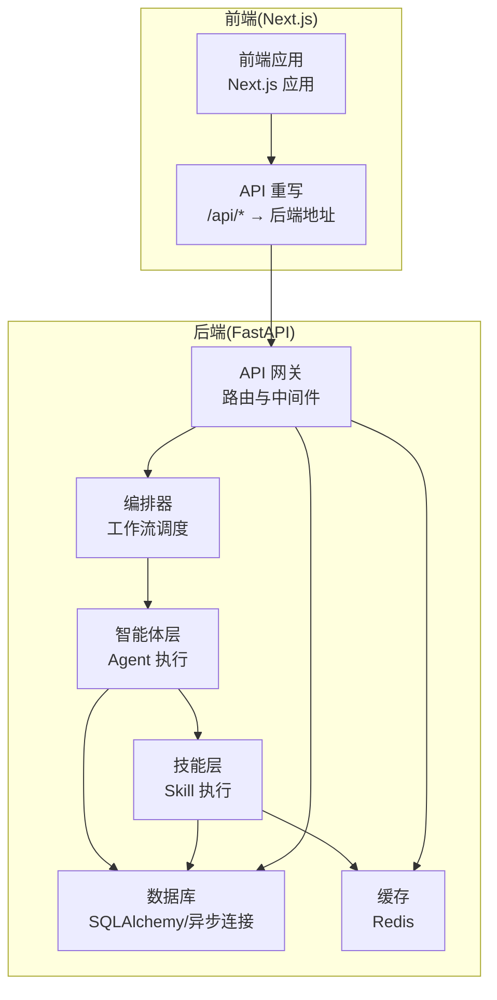
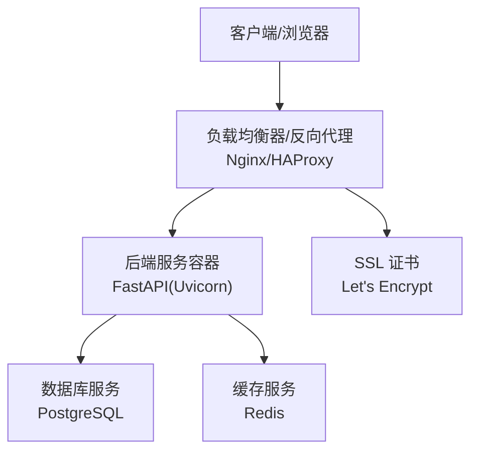
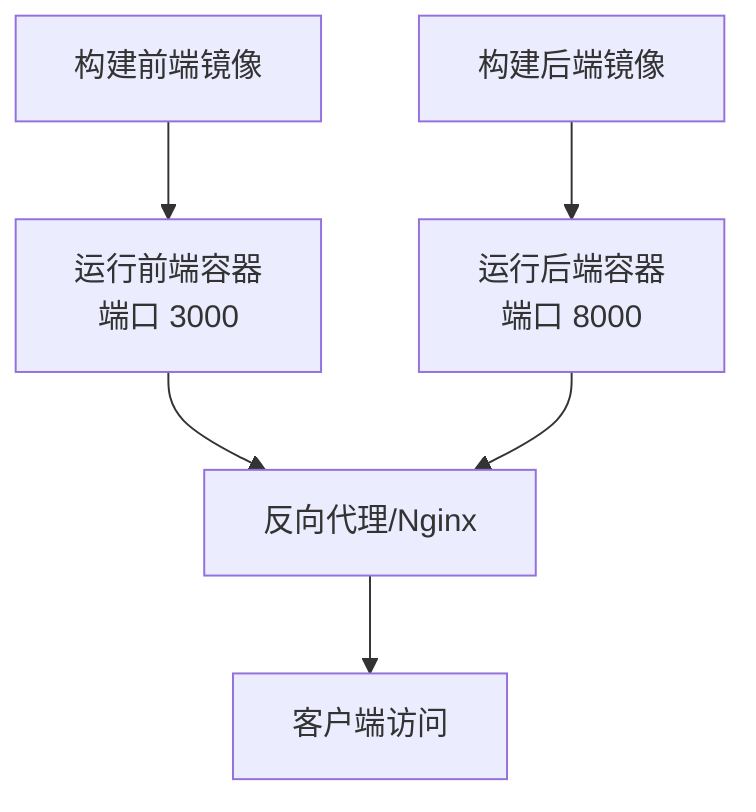
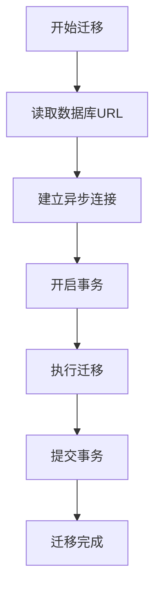
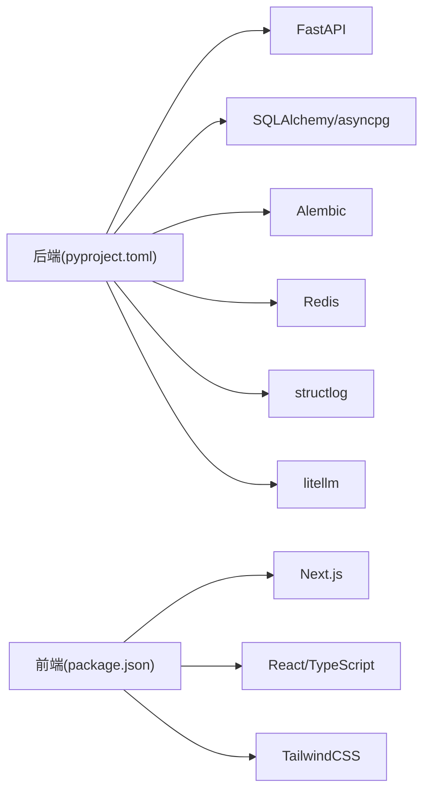

# 部署指南

<cite>
**本文引用的文件**
- [ARCHITECTURE.md](file://ARCHITECTURE.md)
- [backend/pyproject.toml](file://backend/pyproject.toml)
- [frontend/package.json](file://frontend/package.json)
- [OpenClaw-bot-review-main/Dockerfile](file://OpenClaw-bot-review-main/Dockerfile)
- [OpenClaw-bot-review-main/.dockerignore](file://OpenClaw-bot-review-main/.dockerignore)
- [backend/app/core/config.py](file://backend/app/core/config.py)
- [backend/app/main.py](file://backend/app/main.py)
- [backend/app/db/session.py](file://backend/app/db/session.py)
- [backend/app/core/logger.py](file://backend/app/core/logger.py)
- [backend/alembic.ini](file://backend/alembic.ini)
- [backend/alembic/env.py](file://backend/alembic/env.py)
- [scripts/init_db.py](file://scripts/init_db.py)
- [frontend/next.config.ts](file://frontend/next.config.ts)
- [start.sh](file://start.sh)
</cite>

## 目录
1. [简介](#简介)
2. [项目结构](#项目结构)
3. [核心组件](#核心组件)
4. [架构总览](#架构总览)
5. [详细组件分析](#详细组件分析)
6. [依赖分析](#依赖分析)
7. [性能考量](#性能考量)
8. [故障排查指南](#故障排查指南)
9. [结论](#结论)
10. [附录](#附录)

## 简介
本指南面向运维人员，提供 HotClaw 项目的完整部署方案，覆盖开发与生产环境配置差异、依赖安装、环境变量与数据库配置、Docker 容器化部署、生产架构（负载均衡、反向代理、SSL）、数据库迁移与备份恢复、监控与日志、以及常见问题排查与生产维护升级建议。

## 项目结构
HotClaw 采用前后端分离架构：前端为 React/Next.js 应用，后端为 Python/FastAPI 应用，二者通过 HTTP API 通信；工作流编排与任务执行在后端完成，前端通过 SSE 实时接收任务状态。

图表来源
- [ARCHITECTURE.md: 401-494:401-494](file://ARCHITECTURE.md#L401-L494)
- [frontend/next.config.ts: 1-15:1-15](file://frontend/next.config.ts#L1-L15)
- [backend/app/main.py: 14-137:14-137](file://backend/app/main.py#L14-L137)

章节来源
- [ARCHITECTURE.md: 37-78:37-78](file://ARCHITECTURE.md#L37-L78)
- [frontend/next.config.ts: 1-15:1-15](file://frontend/next.config.ts#L1-L15)
- [backend/app/main.py: 14-137:14-137](file://backend/app/main.py#L14-L137)

## 核心组件
- 后端服务（FastAPI）
  - 路由与中间件：CORS、全局异常处理、Trace ID 注入
  - 数据库：SQLAlchemy 异步引擎，支持 SQLite（开发）与 PostgreSQL（生产）
  - 缓存：Redis
  - 日志：structlog 结构化日志
  - 配置：pydantic-settings 从 .env 加载
- 前端应用（Next.js）
  - 本地开发：通过重写将 /api/* 代理到后端
  - 生产：Docker 多阶段构建，运行于 3000 端口
- 数据库迁移：Alembic 异步迁移
- 初始化脚本：创建数据库表

章节来源
- [backend/app/main.py: 42-58:42-58](file://backend/app/main.py#L42-L58)
- [backend/app/db/session.py: 1-33:1-33](file://backend/app/db/session.py#L1-L33)
- [backend/app/core/config.py: 7-47:7-47](file://backend/app/core/config.py#L7-L47)
- [backend/app/core/logger.py: 8-31:8-31](file://backend/app/core/logger.py#L8-L31)
- [backend/alembic/env.py: 12-46:12-46](file://backend/alembic/env.py#L12-L46)
- [scripts/init_db.py: 8-11:8-11](file://scripts/init_db.py#L8-L11)

## 架构总览
生产环境推荐使用反向代理（如 Nginx）统一入口，后端通过容器编排（Docker/Kubernetes）部署，数据库与缓存使用独立服务，启用 SSL/TLS 与健康检查。

图表来源
- [backend/app/core/config.py: 8-20:8-20](file://backend/app/core/config.py#L8-L20)
- [backend/app/db/session.py: 8-13:8-13](file://backend/app/db/session.py#L8-L13)

## 详细组件分析

### 开发环境配置
- 后端
  - Python 版本要求：3.11+
  - 依赖安装：使用虚拟环境安装项目与开发依赖
  - 启动脚本：start.sh 自动安装依赖、启动后端与前端
- 前端
  - Node.js 版本要求：18+
  - 本地开发：npm run dev
  - API 代理：next.config.ts 将 /api/* 重写到后端地址
- 数据库
  - 默认 SQLite（开发）：无需额外服务
  - 初始化：可通过脚本创建表

章节来源
- [start.sh: 11-31:11-31](file://start.sh#L11-L31)
- [start.sh: 51-66:51-66](file://start.sh#L51-L66)
- [frontend/package.json: 5-10:5-10](file://frontend/package.json#L5-L10)
- [frontend/next.config.ts: 4-11:4-11](file://frontend/next.config.ts#L4-L11)
- [backend/app/core/config.py: 9-14:9-14](file://backend/app/core/config.py#L9-L14)
- [scripts/init_db.py: 8-11:8-11](file://scripts/init_db.py#L8-L11)

### 生产环境配置
- 服务器准备
  - 操作系统：Linux（推荐 Ubuntu/CentOS）
  - 容器运行时：Docker
  - 反向代理：Nginx（建议启用 HTTPS）
  - 数据库：PostgreSQL（独立实例或托管服务）
  - 缓存：Redis（独立实例或托管服务）
- 环境变量（.env）
  - 数据库连接：生产使用 PostgreSQL URL
  - Redis 连接：redis://host:port/db
  - LLM 配置：API Key、Base URL、默认模型名
  - 应用配置：app_env=production、app_debug=false、app_host/app_port
  - 日志级别：log_level
  - 超时配置：agent_timeout、skill_timeout、llm_timeout
- 启动方式
  - Docker：使用 OpenClaw-bot-review-main/Dockerfile 构建前端镜像，后端使用官方 Python 镜像运行
  - 容器编排：建议使用 docker-compose 或 Kubernetes

章节来源
- [backend/app/core/config.py: 7-47:7-47](file://backend/app/core/config.py#L7-L47)
- [backend/app/main.py: 67-84:67-84](file://backend/app/main.py#L67-L84)
- [OpenClaw-bot-review-main/Dockerfile: 1-27:1-27](file://OpenClaw-bot-review-main/Dockerfile#L1-L27)

### Docker 容器化部署
- 前端镜像
  - 多阶段构建：Node 基础镜像构建产物，再复制到运行时镜像
  - 运行参数：PORT=3000、HOSTNAME=0.0.0.0
  - 暴露端口：3000
- 后端镜像
  - 建议使用官方 Python 镜像，安装后端依赖并运行 Uvicorn
  - 端口：8000
- Compose 示例要点
  - 前端服务：映射 3000 端口
  - 后端服务：映射 8000 端口，挂载 .env
  - 数据库与缓存：独立服务或外部托管
  - 网络：同一 Docker 网络内互通

图表来源
- [OpenClaw-bot-review-main/Dockerfile: 1-27:1-27](file://OpenClaw-bot-review-main/Dockerfile#L1-L27)
- [backend/pyproject.toml: 6-22:6-22](file://backend/pyproject.toml#L6-L22)

章节来源
- [OpenClaw-bot-review-main/Dockerfile: 1-27:1-27](file://OpenClaw-bot-review-main/Dockerfile#L1-L27)
- [OpenClaw-bot-review-main/.dockerignore: 1-11:1-11](file://OpenClaw-bot-review-main/.dockerignore#L1-L11)
- [backend/pyproject.toml: 6-22:6-22](file://backend/pyproject.toml#L6-L22)

### 生产部署架构（负载均衡、反向代理、SSL）
- 反向代理
  - 将 443 端口转发至前端容器 3000 端口
  - 将 80/443 端口转发至后端容器 8000 端口
  - 建议启用 Gzip/HTTP/2、限制请求大小、开启访问日志
- SSL/TLS
  - 使用 Let's Encrypt 自动签发与续期
  - 强制 HTTPS 重定向
- 健康检查
  - 前端：/api/v1/health
  - 后端：/api/v1/health
- 高可用
  - 多副本部署，结合负载均衡
  - 数据库与缓存使用高可用方案

章节来源
- [backend/app/main.py: 139-142:139-142](file://backend/app/main.py#L139-L142)

### 数据库迁移、备份与恢复
- 迁移
  - Alembic 异步迁移：根据配置文件中的 URL 连接数据库并执行迁移
  - 开发环境：SQLite（无需额外服务）
  - 生产环境：PostgreSQL（需正确配置 URL）
- 备份
  - PostgreSQL：使用 pg_dump 进行逻辑备份
  - SQLite：直接复制数据库文件（需停止服务或使用 WAL 模式）
- 恢复
  - PostgreSQL：使用 psql 或 pg_restore 恢复
  - SQLite：替换数据库文件并重启服务

图表来源
- [backend/alembic/env.py: 34-46:34-46](file://backend/alembic/env.py#L34-L46)
- [backend/alembic.ini: 3-5:3-5](file://backend/alembic.ini#L3-L5)

章节来源
- [backend/alembic.ini: 3-5:3-5](file://backend/alembic.ini#L3-L5)
- [backend/alembic/env.py: 34-46:34-46](file://backend/alembic/env.py#L34-L46)
- [backend/app/db/session.py: 8-13:8-13](file://backend/app/db/session.py#L8-L13)

### 监控与日志配置
- 日志
  - 使用 structlog 输出 JSON 格式日志，包含时间戳、级别、上下文
  - 建议集中收集（如 ELK/Fluentd/Loki）并设置告警
- 指标
  - HTTP 请求总量、错误率、P95/P99 延迟
  - 数据库连接池状态、慢查询
  - Redis 命中率、延迟
- 追踪
  - X-Trace-Id 头部贯穿请求链路，便于问题定位

章节来源
- [backend/app/core/logger.py: 8-31:8-31](file://backend/app/core/logger.py#L8-L31)
- [backend/app/main.py: 77-84:77-84](file://backend/app/main.py#L77-L84)

### 常见部署问题排查
- 前端无法访问后端 API
  - 检查 next.config.ts 的重写规则是否正确指向后端地址
  - 确认后端 CORS 配置（开发允许任意来源）
- 数据库连接失败
  - 确认 .env 中 database_url 是否正确（生产使用 PostgreSQL）
  - 检查数据库服务可达性与凭据
- Docker 启动失败
  - 确认端口未被占用（8000/3000）
  - 检查 .dockerignore 与构建上下文
- 迁移报错
  - 确认 alembic.ini 中的 URL 与实际数据库一致
  - 检查数据库权限与网络连通性

章节来源
- [frontend/next.config.ts: 4-11:4-11](file://frontend/next.config.ts#L4-L11)
- [backend/app/main.py: 67-74:67-74](file://backend/app/main.py#L67-L74)
- [backend/app/core/config.py: 9-14:9-14](file://backend/app/core/config.py#L9-L14)
- [OpenClaw-bot-review-main/.dockerignore: 1-11:1-11](file://OpenClaw-bot-review-main/.dockerignore#L1-11)
- [backend/alembic.ini: 3-5:3-5](file://backend/alembic.ini#L3-L5)

## 依赖分析
- 后端依赖
  - Web：FastAPI、Uvicorn
  - 数据库：SQLAlchemy 2.0 + asyncpg（生产）或 aiosqlite（开发）
  - 迁移：Alembic
  - 配置：pydantic-settings
  - 缓存：Redis
  - 日志：structlog
  - SSE：sse-starlette
  - LLM：litellm
- 前端依赖
  - Next.js、React、TypeScript
  - TailwindCSS、PostCSS

图表来源
- [backend/pyproject.toml: 6-22:6-22](file://backend/pyproject.toml#L6-L22)
- [frontend/package.json: 11-21:11-21](file://frontend/package.json#L11-L21)

章节来源
- [backend/pyproject.toml: 6-22:6-22](file://backend/pyproject.toml#L6-L22)
- [frontend/package.json: 11-21:11-21](file://frontend/package.json#L11-L21)

## 性能考量
- 数据库
  - 生产使用 PostgreSQL，合理设置连接池与索引
  - 使用 pool_pre_ping（非 SQLite）提升连接稳定性
- 缓存
  - Redis 用于会话与临时数据，注意内存与持久化策略
- LLM 调用
  - 设置合理的 LLM 超时与重试策略
  - 使用 litellm 统一多模型调用接口
- 前后端通信
  - SSE 推送实时状态，避免轮询
  - 反向代理启用压缩与长连接

章节来源
- [backend/app/db/session.py: 8-13:8-13](file://backend/app/db/session.py#L8-L13)
- [backend/app/core/config.py: 22-45:22-45](file://backend/app/core/config.py#L22-L45)
- [ARCHITECTURE.md: 401-413:401-413](file://ARCHITECTURE.md#L401-L413)

## 故障排查指南
- 启动顺序
  - 先启动数据库与缓存，再启动后端，最后启动前端
- 端口冲突
  - 修改映射端口或释放占用端口
- CORS 问题
  - 生产环境收紧 allow_origins，仅允许受信域名
- 数据库初始化
  - 使用 init_db.py 或 Alembic 迁移确保表结构一致
- 日志定位
  - 通过 X-Trace-Id 串联请求链路，结合 structlog JSON 日志定位问题

章节来源
- [scripts/init_db.py: 8-11:8-11](file://scripts/init_db.py#L8-L11)
- [backend/app/main.py: 67-84:67-84](file://backend/app/main.py#L67-L84)
- [backend/app/core/logger.py: 8-31:8-31](file://backend/app/core/logger.py#L8-L31)

## 结论
本指南提供了从开发到生产的完整部署路径，涵盖环境配置、容器化、生产架构、数据库迁移与备份恢复、监控日志以及常见问题排查。建议在生产环境中遵循最小权限、安全加固与可观测性的最佳实践，持续迭代与优化。

## 附录
- 快速启动（开发）
  - 安装 Python 3.11+ 与 Node.js 18+
  - 运行 start.sh，自动安装依赖并启动后端与前端
- 生产部署建议
  - 使用 Docker 多阶段构建前端镜像
  - 反向代理统一入口并启用 HTTPS
  - 数据库与缓存使用独立服务，定期备份
  - 配置结构化日志与指标采集，建立告警机制

章节来源
- [start.sh: 11-31:11-31](file://start.sh#L11-L31)
- [start.sh: 51-66:51-66](file://start.sh#L51-L66)
- [OpenClaw-bot-review-main/Dockerfile: 1-27:1-27](file://OpenClaw-bot-review-main/Dockerfile#L1-L27)