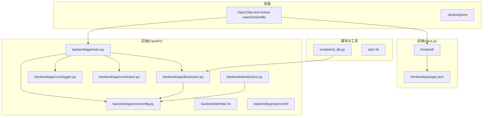
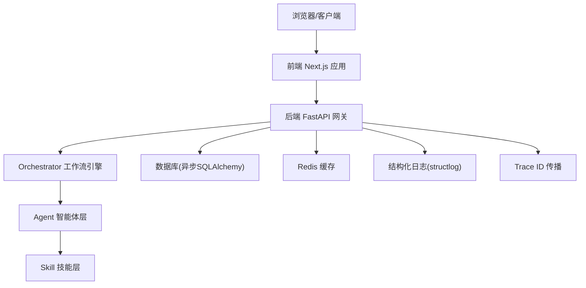
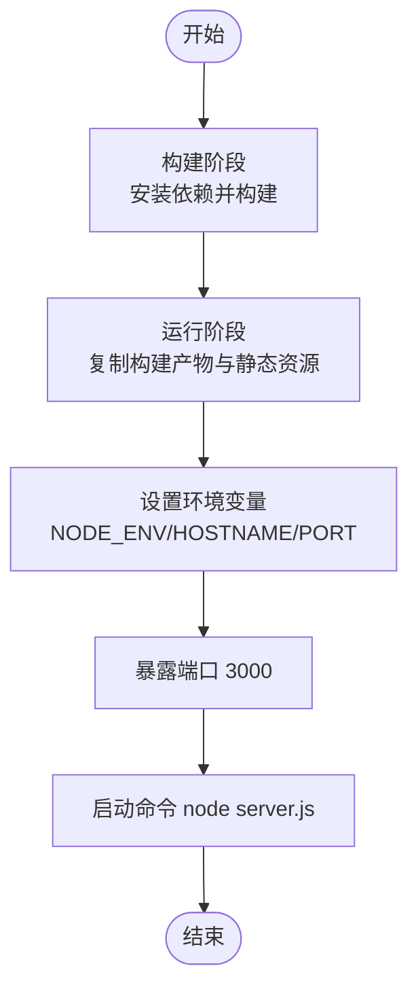
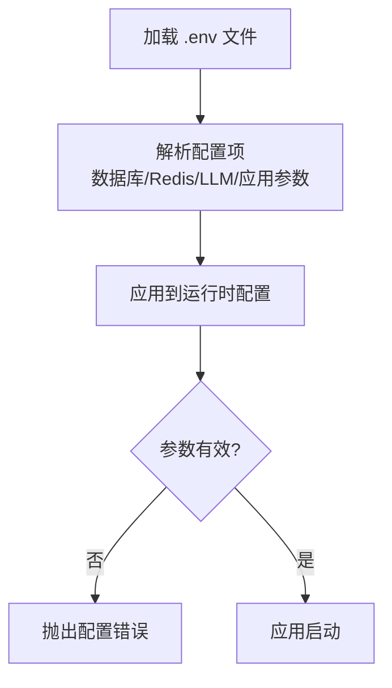
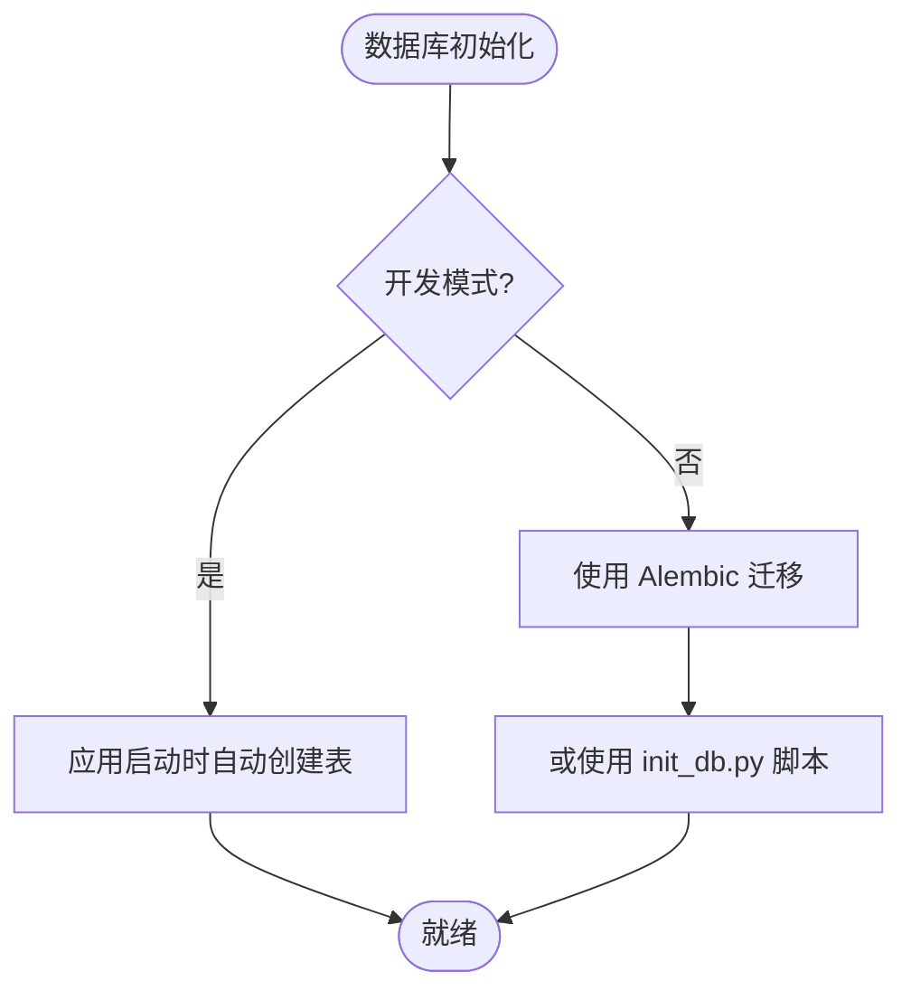
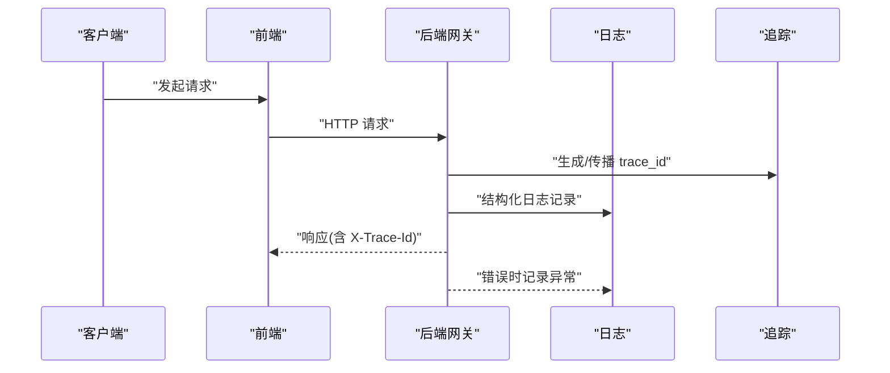
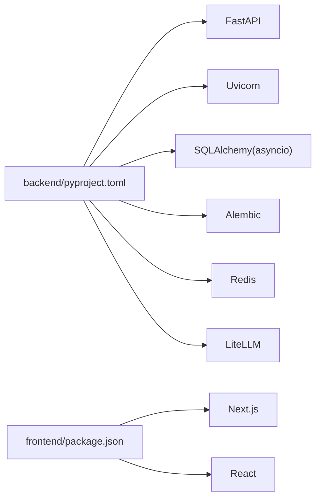

# 部署指南

<cite>
**本文引用的文件**   
- [Dockerfile](file://OpenClaw-bot-review-main/Dockerfile)
- [.dockerignore](file://OpenClaw-bot-review-main/.dockerignore)
- [pyproject.toml](file://backend/pyproject.toml)
- [alembic.ini](file://backend/alembic.ini)
- [init_db.py](file://scripts/init_db.py)
- [config.py](file://backend/app/core/config.py)
- [main.py](file://backend/app/main.py)
- [logger.py](file://backend/app/core/logger.py)
- [tracer.py](file://backend/app/core/tracer.py)
- [session.py](file://backend/app/db/session.py)
- [env.py](file://backend/alembic/env.py)
- [ARCHITECTURE.md](file://ARCHITECTURE.md)
- [start.sh](file://start.sh)
- [package.json](file://frontend/package.json)
</cite>

## 目录
1. [简介](#简介)
2. [项目结构](#项目结构)
3. [核心组件](#核心组件)
4. [架构总览](#架构总览)
5. [详细组件分析](#详细组件分析)
6. [依赖分析](#依赖分析)
7. [性能考量](#性能考量)
8. [故障排查指南](#故障排查指南)
9. [结论](#结论)
10. [附录](#附录)

## 简介
本指南面向运维工程师与DevOps团队，提供HotClaw项目的完整部署实施指导，涵盖Docker容器化部署、环境配置管理、数据库初始化与迁移、生产监控与日志、错误追踪、负载均衡与反向代理、SSL证书配置、CI/CD流程与自动化部署、版本回滚策略，以及常见部署问题排查。

## 项目结构
HotClaw采用前后端分离架构，后端为Python/FastAPI应用，前端为Next.js应用，数据库使用异步SQLAlchemy与PostgreSQL/SQLite，使用Alembic进行数据库迁移，Dockerfile支持多阶段构建与运行。

```mermaid
graph TB
subgraph "前端(Next.js)"
FE_APP["frontend/"]
FE_PKG["frontend/package.json"]
end
subgraph "后端(FastAPI)"
BE_MAIN["backend/app/main.py"]
BE_CFG["backend/app/core/config.py"]
BE_DB["backend/app/db/session.py"]
BE_LOG["backend/app/core/logger.py"]
BE_TRACE["backend/app/core/tracer.py"]
BE_ALEMBIC_INI["backend/alembic.ini"]
BE_ALEMBIC_ENV["backend/alembic/env.py"]
BE_PYPROJ["backend/pyproject.toml"]
end
subgraph "脚本与工具"
INIT_DB["scripts/init_db.py"]
START_SH["start.sh"]
end
subgraph "容器"
DOCKERFILE["OpenClaw-bot-review-main/Dockerfile"]
DOCKERIGNORE[".dockerignore"]
end
FE_APP --> FE_PKG
BE_MAIN --> BE_CFG
BE_MAIN --> BE_DB
BE_MAIN --> BE_LOG
BE_MAIN --> BE_TRACE
BE_DB --> BE_CFG
BE_ALEMBIC_ENV --> BE_CFG
INIT_DB --> BE_DB
DOCKERFILE --> FE_APP
DOCKERFILE --> BE_MAIN
```

**图表来源**
- [Dockerfile:1-27](file://OpenClaw-bot-review-main/Dockerfile#L1-L27)
- [.dockerignore:1-11](file://OpenClaw-bot-review-main/.dockerignore#L1-L11)
- [pyproject.toml:1-41](file://backend/pyproject.toml#L1-L41)
- [alembic.ini:1-39](file://backend/alembic.ini#L1-L39)
- [init_db.py:1-16](file://scripts/init_db.py#L1-L16)
- [config.py:1-51](file://backend/app/core/config.py#L1-L51)
- [main.py:1-142](file://backend/app/main.py#L1-L142)
- [logger.py:1-36](file://backend/app/core/logger.py#L1-L36)
- [tracer.py:1-34](file://backend/app/core/tracer.py#L1-L34)
- [session.py:1-33](file://backend/app/db/session.py#L1-L33)
- [env.py:1-53](file://backend/alembic/env.py#L1-L53)
- [start.sh:1-79](file://start.sh#L1-L79)
- [package.json:1-23](file://frontend/package.json#L1-L23)

**章节来源**
- [ARCHITECTURE.md:37-78](file://ARCHITECTURE.md#L37-L78)
- [Dockerfile:1-27](file://OpenClaw-bot-review-main/Dockerfile#L1-L27)
- [pyproject.toml:1-41](file://backend/pyproject.toml#L1-L41)
- [alembic.ini:1-39](file://backend/alembic.ini#L1-L39)
- [config.py:1-51](file://backend/app/core/config.py#L1-L51)
- [main.py:1-142](file://backend/app/main.py#L1-L142)
- [logger.py:1-36](file://backend/app/core/logger.py#L1-L36)
- [tracer.py:1-34](file://backend/app/core/tracer.py#L1-L34)
- [session.py:1-33](file://backend/app/db/session.py#L1-L33)
- [env.py:1-53](file://backend/alembic/env.py#L1-L53)
- [init_db.py:1-16](file://scripts/init_db.py#L1-L16)
- [start.sh:1-79](file://start.sh#L1-L79)
- [package.json:1-23](file://frontend/package.json#L1-L23)

## 核心组件
- 容器镜像与运行
  - 前端Next.js应用通过多阶段Dockerfile构建，生产阶段使用Node.js Alpine镜像，暴露端口并设置环境变量，CMD启动server.js。
  - .dockerignore排除了不必要的目录与日志文件，减少镜像体积。
- 后端FastAPI服务
  - 使用Uvicorn运行，应用生命周期内自动创建数据库表（开发模式），注册CORS与全局异常处理器，提供健康检查端点。
  - 配置通过pydantic-settings从.env文件加载，支持SQLite开发与PostgreSQL生产。
- 数据库与迁移
  - SQLAlchemy异步引擎，Alembic配置文件指定连接URL，env.py动态读取settings.database_url，支持离线与在线迁移。
  - 提供init_db.py脚本用于一次性创建所有表。
- 日志与追踪
  - structlog结构化日志，统一JSON输出；trace_id中间件注入X-Trace-Id响应头，便于跨服务追踪。
- 开发启动脚本
  - start.sh自动安装依赖、启动后端与前端，便于本地联调。

**章节来源**
- [Dockerfile:1-27](file://OpenClaw-bot-review-main/Dockerfile#L1-L27)
- [.dockerignore:1-11](file://OpenClaw-bot-review-main/.dockerignore#L1-L11)
- [main.py:42-58](file://backend/app/main.py#L42-L58)
- [config.py:7-51](file://backend/app/core/config.py#L7-L51)
- [alembic.ini:3-5](file://backend/alembic.ini#L3-L5)
- [env.py:9-13](file://backend/alembic/env.py#L9-L13)
- [init_db.py:8-11](file://scripts/init_db.py#L8-L11)
- [logger.py:8-31](file://backend/app/core/logger.py#L8-L31)
- [tracer.py:10-25](file://backend/app/core/tracer.py#L10-L25)
- [session.py:8-19](file://backend/app/db/session.py#L8-L19)
- [start.sh:23-66](file://start.sh#L23-L66)

## 架构总览
HotClaw系统采用前后端分离，后端提供REST API与SSE事件流，前端通过SSE订阅任务执行状态；数据库与缓存分别用于持久化与会话状态；日志与追踪贯穿请求链路。

```mermaid
graph TB
Client["浏览器/客户端"] --> FE["前端 Next.js 应用"]
FE --> APIGW["后端 FastAPI 网关"]
APIGW --> ORCH["Orchestrator 工作流引擎"]
ORCH --> AGENTS["Agent 智能体层"]
AGENTS --> SKILLS["Skill 技能层"]
APIGW --> DB["数据库(异步SQLAlchemy)"]
APIGW --> REDIS["Redis 缓存"]
APIGW --> LOG["结构化日志(structlog)"]
APIGW --> TRACE["Trace ID 传播"]
```

**图表来源**
- [ARCHITECTURE.md:416-448](file://ARCHITECTURE.md#L416-L448)
- [main.py:60-84](file://backend/app/main.py#L60-L84)
- [logger.py:8-31](file://backend/app/core/logger.py#L8-L31)
- [tracer.py:10-25](file://backend/app/core/tracer.py#L10-L25)
- [session.py:8-19](file://backend/app/db/session.py#L8-L19)

## 详细组件分析

### Docker容器化部署
- 多阶段构建
  - 构建阶段：基于node:22-alpine，安装依赖并执行构建，输出.next静态与standalone产物。
  - 运行阶段：基于node:22-alpine，复制构建产物与public资源，设置NODE_ENV=production，暴露3000端口，环境变量HOSTNAME与PORT，CMD启动node server.js。
- 镜像构建与运行
  - 建议在CI中缓存依赖层，使用--no-cache选项仅在必要时禁用缓存。
  - 容器应映射端口3000至宿主机，结合反向代理提供域名访问。
- .dockerignore
  - 排除node_modules、.next、.git、文档与调试日志，避免污染镜像。

```mermaid
flowchart TD
Start(["开始"]) --> BuildStage["构建阶段<br/>安装依赖并构建"]
BuildStage --> RunnerStage["运行阶段<br/>复制构建产物与静态资源"]
RunnerStage --> Env["设置环境变量<br/>NODE_ENV/HOSTNAME/PORT"]
Env --> Expose["暴露端口 3000"]
Expose --> CMD["启动命令 node server.js"]
CMD --> End(["结束"])
```

**图表来源**
- [Dockerfile:1-27](file://OpenClaw-bot-review-main/Dockerfile#L1-L27)

**章节来源**
- [Dockerfile:1-27](file://OpenClaw-bot-review-main/Dockerfile#L1-L27)
- [.dockerignore:1-11](file://OpenClaw-bot-review-main/.dockerignore#L1-L11)

### 环境配置管理
- 后端配置
  - 通过pydantic-settings从.env文件加载，支持数据库URL（开发默认SQLite，生产建议PostgreSQL）、Redis、LLM API密钥与基础地址、应用运行参数、日志级别、超时配置等。
  - 配置文件路径与编码通过model_config指定。
- 前端配置
  - Next.js通过package.json中的脚本定义开发、构建与启动命令，生产运行时由Dockerfile内的node server.js承载。
- 密钥与敏感信息
  - 建议使用环境变量注入LLM API密钥与数据库密码，不在仓库中提交.env文件。
  - 在容器编排中使用密文管理（如Kubernetes Secret或Docker Compose secrets）。

```mermaid
flowchart TD
LoadEnv["加载 .env 文件"] --> Parse["解析配置项<br/>数据库/Redis/LLM/应用参数"]
Parse --> Apply["应用到运行时配置"]
Apply --> Validate{"参数有效?"}
Validate --> |否| Fail["抛出配置错误"]
Validate --> |是| Ready["应用启动"]
```

**图表来源**
- [config.py:7-51](file://backend/app/core/config.py#L7-L51)

**章节来源**
- [config.py:7-51](file://backend/app/core/config.py#L7-L51)
- [package.json:5-10](file://frontend/package.json#L5-L10)

### 数据库部署策略
- 初始化与迁移
  - 开发模式：应用启动时自动创建所有表。
  - 生产模式：使用Alembic进行迁移，env.py动态读取settings.database_url，支持离线与在线迁移。
  - 提供init_db.py脚本用于一次性创建所有表，适用于首次部署或快速初始化。
- 连接配置
  - SQLAlchemy异步引擎，SQLite开发模式关闭pool_pre_ping，生产模式启用以提升连接稳定性。
- 备份与恢复
  - 建议使用PostgreSQL原生命令进行逻辑备份与恢复，结合定时任务与对象存储进行归档。

```mermaid
flowchart TD
Start(["数据库初始化"]) --> DevMode{"开发模式?"}
DevMode --> |是| AutoCreate["应用启动时自动创建表"]
DevMode --> |否| Alembic["使用 Alembic 迁移"]
Alembic --> InitScript["或使用 init_db.py 脚本"]
AutoCreate --> Ready(["就绪"])
InitScript --> Ready
```

**图表来源**
- [main.py:48-53](file://backend/app/main.py#L48-L53)
- [env.py:12-13](file://backend/alembic/env.py#L12-L13)
- [alembic.ini:3-5](file://backend/alembic.ini#L3-L5)
- [init_db.py:8-11](file://scripts/init_db.py#L8-L11)
- [session.py:8-19](file://backend/app/db/session.py#L8-L19)

**章节来源**
- [main.py:48-53](file://backend/app/main.py#L48-L53)
- [alembic.ini:3-5](file://backend/alembic.ini#L3-L5)
- [env.py:12-13](file://backend/alembic/env.py#L12-L13)
- [init_db.py:8-11](file://scripts/init_db.py#L8-L11)
- [session.py:8-19](file://backend/app/db/session.py#L8-L19)

### 生产环境监控、日志与错误追踪
- 日志
  - 使用structlog进行结构化JSON日志输出，统一时间戳、级别与上下文，便于集中采集与检索。
- 追踪
  - 中间件生成trace_id并注入响应头X-Trace-Id，便于跨服务关联日志与请求。
- 错误处理
  - 全局捕获HotClawError与未处理异常，按错误码映射HTTP状态，返回结构化错误响应。

```mermaid
sequenceDiagram
participant C as "客户端"
participant F as "前端"
participant G as "后端网关"
participant L as "日志"
participant T as "追踪"
C->>F : "发起请求"
F->>G : "HTTP 请求"
G->>T : "生成/传播 trace_id"
G->>L : "结构化日志记录"
G-->>F : "响应(含 X-Trace-Id)"
G-->>L : "错误时记录异常"
```

**图表来源**
- [main.py:77-84](file://backend/app/main.py#L77-L84)
- [logger.py:8-31](file://backend/app/core/logger.py#L8-L31)
- [tracer.py:10-25](file://backend/app/core/tracer.py#L10-L25)

**章节来源**
- [logger.py:8-31](file://backend/app/core/logger.py#L8-L31)
- [tracer.py:10-25](file://backend/app/core/tracer.py#L10-L25)
- [main.py:87-129](file://backend/app/main.py#L87-L129)

### 负载均衡、反向代理与SSL证书
- 反向代理
  - 建议使用Nginx或Traefik作为反向代理，将域名流量转发至容器3000端口。
  - 配置健康检查路径指向后端健康端点。
- SSL证书
  - 使用Let’s Encrypt自动签发与续期，结合反向代理配置HTTPS。
- 负载均衡
  - 多实例部署时，使用反向代理进行轮询分发；若使用容器编排平台，可利用其内置LB与滚动更新策略。

[本节为通用实践指导，无需特定文件引用]

### CI/CD流程、自动化部署与版本回滚
- 构建与测试
  - 前端：构建Docker镜像，执行静态检查与测试。
  - 后端：安装依赖，运行测试与迁移验证。
- 部署
  - 使用容器编排平台（如Kubernetes或Docker Compose）部署，配置滚动更新与健康探针。
- 回滚
  - 保存镜像版本标签，回滚时切换到上一个稳定版本标签。
  - 数据库迁移采用版本化管理，回滚迁移时使用Alembic downgrade。

[本节为通用实践指导，无需特定文件引用]

## 依赖分析
- 后端依赖
  - FastAPI、Uvicorn、SQLAlchemy(asyncio)、asyncpg、alembic、pydantic、pydantic-settings、redis、httpx、structlog、pyyaml、sse-starlette、nanoid、litellm、aiosqlite。
- 前端依赖
  - Next.js、React、TypeScript、TailwindCSS等。
- 运行时依赖
  - Node.js 22、Python 3.11+、PostgreSQL/Redis（生产）。

```mermaid
graph LR
PY["backend/pyproject.toml"] --> FASTAPI["FastAPI"]
PY --> UVICORN["Uvicorn"]
PY --> SQLA["SQLAlchemy(asyncio)"]
PY --> ALEMBIC["Alembic"]
PY --> REDIS["Redis"]
PY --> LITELLM["LiteLLM"]
FE_PKG["frontend/package.json"] --> NEXT["Next.js"]
FE_PKG --> REACT["React"]
```

**图表来源**
- [pyproject.toml:6-22](file://backend/pyproject.toml#L6-L22)
- [package.json:11-21](file://frontend/package.json#L11-L21)

**章节来源**
- [pyproject.toml:1-41](file://backend/pyproject.toml#L1-L41)
- [package.json:1-23](file://frontend/package.json#L1-L23)

## 性能考量
- 数据库
  - 生产环境启用pool_pre_ping，合理设置连接池大小与超时。
  - 使用索引优化常用查询，定期统计信息更新。
- 缓存
  - 使用Redis缓存热点数据与会话状态，降低数据库压力。
- 日志
  - 结构化日志便于聚合与分析，避免过多DEBUG日志影响性能。
- 前端
  - 使用Next.js的静态导出与SSR优化，结合CDN加速静态资源。

[本节提供一般性指导，无需特定文件引用]

## 故障排查指南
- 健康检查
  - 访问后端健康端点确认服务可用。
- 数据库连接
  - 检查database_url是否正确，网络连通性与凭据。
  - 开发模式下确认表已创建。
- 日志与追踪
  - 检查结构化日志输出，结合X-Trace-Id定位问题。
- 异常处理
  - 关注全局异常处理器返回的错误码与消息，定位上游问题。
- 开发启动
  - 使用start.sh脚本确保依赖安装与前后端同时启动。

**章节来源**
- [main.py:139-142](file://backend/app/main.py#L139-L142)
- [session.py:8-19](file://backend/app/db/session.py#L8-L19)
- [logger.py:8-31](file://backend/app/core/logger.py#L8-L31)
- [tracer.py:10-25](file://backend/app/core/tracer.py#L10-L25)
- [start.sh:52-66](file://start.sh#L52-L66)

## 结论
本指南提供了HotClaw从容器化构建、环境配置、数据库初始化与迁移、生产监控与日志、错误追踪，到负载均衡、反向代理、SSL证书、CI/CD与回滚的完整部署实施路径。建议在生产环境中严格区分开发与生产配置，使用密文管理敏感信息，结合结构化日志与追踪ID实现可观测性，并通过容器编排平台实现弹性与高可用。

## 附录
- 关键端口
  - 前端/容器：3000
  - 后端：8000
- 健康检查路径
  - /api/v1/health
- 常用命令参考
  - Docker构建镜像、运行容器、查看日志
  - Alembic迁移：offline/online
  - init_db.py脚本

[本节为补充信息，无需特定文件引用]