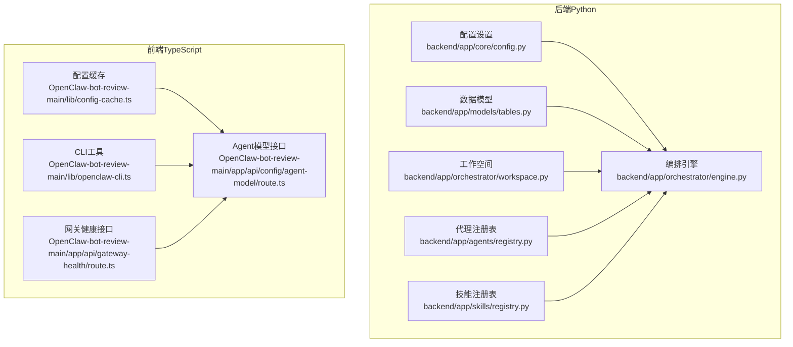
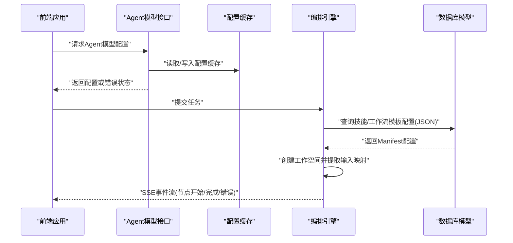
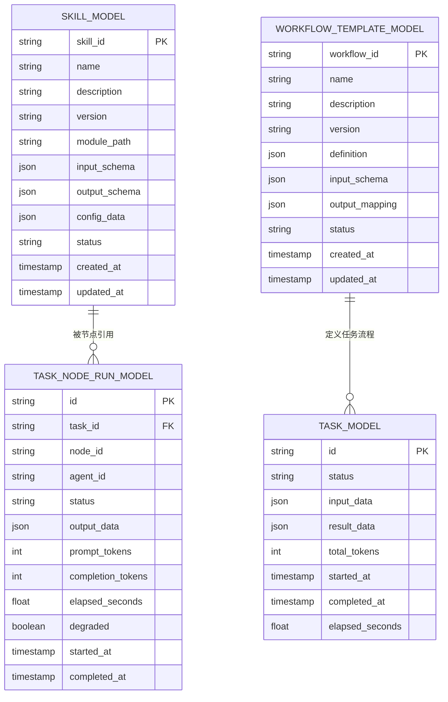
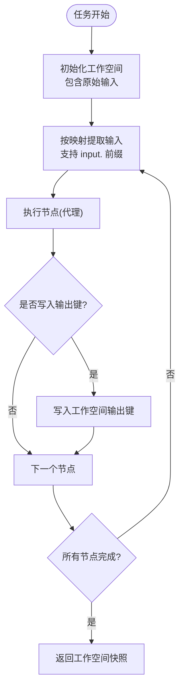
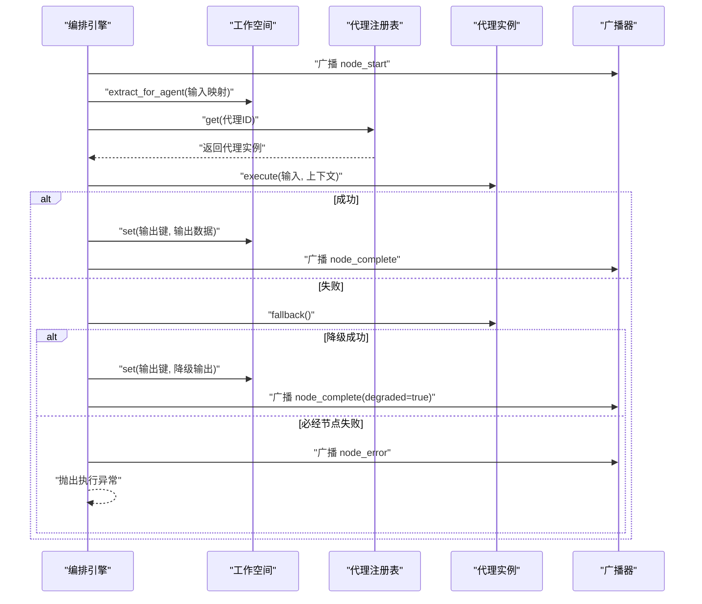
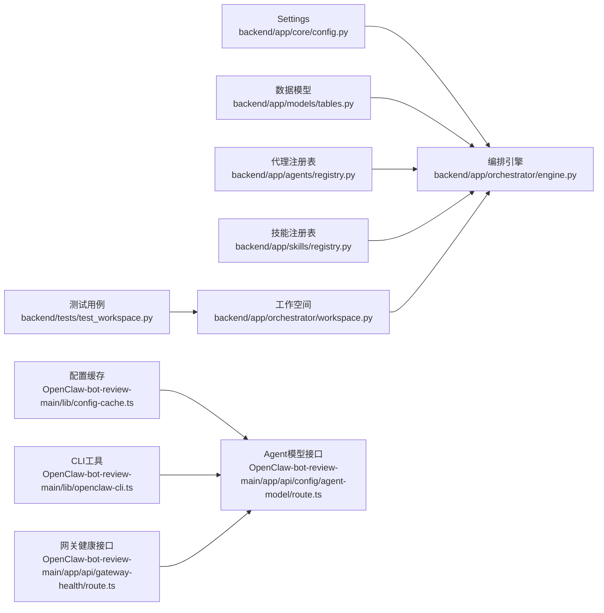

# Manifest配置

<cite>
**本文引用的文件**
- [backend/app/core/config.py](file://backend/app/core/config.py)
- [backend/app/models/tables.py](file://backend/app/models/tables.py)
- [backend/app/orchestrator/workspace.py](file://backend/app/orchestrator/workspace.py)
- [backend/app/orchestrator/engine.py](file://backend/app/orchestrator/engine.py)
- [backend/app/agents/registry.py](file://backend/app/agents/registry.py)
- [backend/app/skills/registry.py](file://backend/app/skills/registry.py)
- [backend/tests/test_workspace.py](file://backend/tests/test_workspace.py)
- [OpenClaw-bot-review-main/lib/config-cache.ts](file://OpenClaw-bot-review-main/lib/config-cache.ts)
- [OpenClaw-bot-review-main/app/api/config/agent-model/route.ts](file://OpenClaw-bot-review-main/app/api/config/agent-model/route.ts)
- [OpenClaw-bot-review-main/app/api/gateway-health/route.ts](file://OpenClaw-bot-review-main/app/api/gateway-health/route.ts)
- [OpenClaw-bot-review-main/lib/openclaw-cli.ts](file://OpenClaw-bot-review-main/lib/openclaw-cli.ts)
</cite>

## 目录
1. [简介](#简介)
2. [项目结构](#项目结构)
3. [核心组件](#核心组件)
4. [架构总览](#架构总览)
5. [组件详解](#组件详解)
6. [依赖关系分析](#依赖关系分析)
7. [性能考量](#性能考量)
8. [故障排查指南](#故障排查指南)
9. [结论](#结论)
10. [附录](#附录)

## 简介
本文件面向HotClaw的Manifest配置系统，聚焦于YAML/JSON格式的Manifest文件在系统中的角色与落地方式。根据仓库现有实现，Manifest并非以独立的“manifests/”目录形式存在，而是通过数据库模型与运行时配置加载机制进行持久化与消费。本文从以下维度展开：Manifest在系统中的职责边界、与数据库模型的映射关系、运行时加载与缓存策略、配置继承与覆盖（基于数据库与默认值的优先级）、Workspace上下文中的配置传递机制，以及最佳实践与常见问题排查。

## 项目结构
围绕Manifest配置的关键代码分布在后端Python服务与前端TypeScript工具中：
- 后端Python
  - 配置与设置：环境变量驱动的全局设置
  - 数据模型：技能、工作流模板等以JSON字段存储配置
  - 运行时编排：工作空间、编排引擎、代理与技能注册表
- 前端TypeScript
  - 配置缓存：内存缓存入口
  - 配置接口：Agent模型查询与错误状态映射
  - CLI工具：配置快照哈希计算与混合输出解析

图表来源
- [backend/app/core/config.py:1-51](file://backend/app/core/config.py#L1-L51)
- [backend/app/models/tables.py:171-220](file://backend/app/models/tables.py#L171-L220)
- [backend/app/orchestrator/workspace.py:1-53](file://backend/app/orchestrator/workspace.py#L1-L53)
- [backend/app/orchestrator/engine.py:1-285](file://backend/app/orchestrator/engine.py#L1-L285)
- [backend/app/agents/registry.py:1-40](file://backend/app/agents/registry.py#L1-L40)
- [backend/app/skills/registry.py:1-37](file://backend/app/skills/registry.py#L1-L37)
- [OpenClaw-bot-review-main/lib/config-cache.ts:1-18](file://OpenClaw-bot-review-main/lib/config-cache.ts#L1-L18)
- [OpenClaw-bot-review-main/app/api/config/agent-model/route.ts:49-80](file://OpenClaw-bot-review-main/app/api/config/agent-model/route.ts#L49-L80)
- [OpenClaw-bot-review-main/app/api/gateway-health/route.ts:37-70](file://OpenClaw-bot-review-main/app/api/gateway-health/route.ts#L37-L70)
- [OpenClaw-bot-review-main/lib/openclaw-cli.ts:31-83](file://OpenClaw-bot-review-main/lib/openclaw-cli.ts#L31-L83)

章节来源
- [backend/app/core/config.py:1-51](file://backend/app/core/config.py#L1-L51)
- [backend/app/models/tables.py:171-220](file://backend/app/models/tables.py#L171-L220)
- [backend/app/orchestrator/workspace.py:1-53](file://backend/app/orchestrator/workspace.py#L1-L53)
- [backend/app/orchestrator/engine.py:1-285](file://backend/app/orchestrator/engine.py#L1-L285)
- [OpenClaw-bot-review-main/lib/config-cache.ts:1-18](file://OpenClaw-bot-review-main/lib/config-cache.ts#L1-L18)
- [OpenClaw-bot-review-main/app/api/config/agent-model/route.ts:49-80](file://OpenClaw-bot-review-main/app/api/config/agent-model/route.ts#L49-L80)
- [OpenClaw-bot-review-main/app/api/gateway-health/route.ts:37-70](file://OpenClaw-bot-review-main/app/api/gateway-health/route.ts#L37-L70)
- [OpenClaw-bot-review-main/lib/openclaw-cli.ts:31-83](file://OpenClaw-bot-review-main/lib/openclaw-cli.ts#L31-L83)

## 核心组件
- 配置设置（Settings）
  - 由Pydantic Settings加载环境变量，提供数据库、Redis、LLM、应用、日志、超时等参数的默认值与校验。
- 数据模型（JSON字段承载Manifest配置）
  - 技能模型：包含模块路径、输入/输出Schema、配置数据等JSON字段。
  - 工作流模板模型：包含模板定义、输入Schema、输出映射等JSON字段。
- 编排引擎与工作空间
  - 引擎负责按节点顺序执行代理，工作空间作为任务级上下文容器，支持提取与写入。
- 注册表
  - 代理与技能注册表用于实例管理与查找。
- 前端配置缓存与接口
  - 内存缓存入口；Agent模型接口对错误消息进行HTTP状态映射；CLI工具提供配置快照哈希与混合输出解析能力。

章节来源
- [backend/app/core/config.py:1-51](file://backend/app/core/config.py#L1-L51)
- [backend/app/models/tables.py:171-220](file://backend/app/models/tables.py#L171-L220)
- [backend/app/orchestrator/workspace.py:1-53](file://backend/app/orchestrator/workspace.py#L1-L53)
- [backend/app/orchestrator/engine.py:1-285](file://backend/app/orchestrator/engine.py#L1-L285)
- [backend/app/agents/registry.py:1-40](file://backend/app/agents/registry.py#L1-L40)
- [backend/app/skills/registry.py:1-37](file://backend/app/skills/registry.py#L1-L37)
- [OpenClaw-bot-review-main/lib/config-cache.ts:1-18](file://OpenClaw-bot-review-main/lib/config-cache.ts#L1-L18)
- [OpenClaw-bot-review-main/app/api/config/agent-model/route.ts:49-80](file://OpenClaw-bot-review-main/app/api/config/agent-model/route.ts#L49-L80)
- [OpenClaw-bot-review-main/lib/openclaw-cli.ts:31-83](file://OpenClaw-bot-review-main/lib/openclaw-cli.ts#L31-L83)

## 架构总览
下图展示Manifest相关配置在系统中的流转：前端通过接口获取配置并可缓存；后端通过编排引擎在任务执行期间读取数据库中的Manifest配置（技能、工作流模板），并在工作空间中传递上下文。

图表来源
- [OpenClaw-bot-review-main/app/api/config/agent-model/route.ts:49-80](file://OpenClaw-bot-review-main/app/api/config/agent-model/route.ts#L49-L80)
- [OpenClaw-bot-review-main/lib/config-cache.ts:1-18](file://OpenClaw-bot-review-main/lib/config-cache.ts#L1-L18)
- [backend/app/orchestrator/engine.py:1-285](file://backend/app/orchestrator/engine.py#L1-L285)
- [backend/app/models/tables.py:171-220](file://backend/app/models/tables.py#L171-L220)

## 组件详解

### 配置设置与超时控制
- 全局设置来源于环境变量，包含数据库、Redis、LLM、应用、日志级别、各类超时等。
- 超时参数用于编排引擎对单个代理执行的限制，避免长时间阻塞。

章节来源
- [backend/app/core/config.py:1-51](file://backend/app/core/config.py#L1-L51)
- [backend/app/orchestrator/engine.py:236-243](file://backend/app/orchestrator/engine.py#L236-L243)

### 数据模型与Manifest映射
- 技能模型（SkillModel）：包含技能标识、名称、描述、版本、模块路径、输入/输出Schema、配置数据等字段，其中配置数据以JSON字段存储，适合作为Manifest的持久化载体。
- 工作流模板模型（WorkflowTemplateModel）：包含模板标识、名称、描述、版本、定义（JSON）、输入Schema、输出映射等字段，直接对应工作流Manifest的持久化需求。
- 任务与节点运行模型：记录节点执行状态、耗时、令牌用量、错误信息等，支撑运行期可观测性。

图表来源
- [backend/app/models/tables.py:171-220](file://backend/app/models/tables.py#L171-L220)

章节来源
- [backend/app/models/tables.py:171-220](file://backend/app/models/tables.py#L171-L220)

### 工作空间与配置传递
- 工作空间为单任务上下文容器，初始包含原始输入；代理可在执行过程中向其中写入键值，供后续节点读取。
- 输入映射采用简单键到键的扁平映射，支持以“input.”前缀引用原始输入字段。
- 测试用例验证了基本的get/set、snapshot与extract_for_agent行为。

图表来源
- [backend/app/orchestrator/workspace.py:12-53](file://backend/app/orchestrator/workspace.py#L12-L53)
- [backend/tests/test_workspace.py:1-40](file://backend/tests/test_workspace.py#L1-L40)

章节来源
- [backend/app/orchestrator/workspace.py:12-53](file://backend/app/orchestrator/workspace.py#L12-L53)
- [backend/tests/test_workspace.py:1-40](file://backend/tests/test_workspace.py#L1-L40)

### 编排引擎与节点执行
- 默认线性工作流节点定义展示了典型Manifest节点结构：节点ID、代理ID、名称、输入映射、输出键、是否必经。
- 执行流程：广播节点开始、从工作空间提取输入、调用代理、写入输出或降级执行、记录节点运行结果、广播完成/错误事件。
- 超时控制：对单节点执行设置超时，必要时抛出异常并终止任务。

图表来源
- [backend/app/orchestrator/engine.py:89-285](file://backend/app/orchestrator/engine.py#L89-L285)
- [backend/app/agents/registry.py:10-36](file://backend/app/agents/registry.py#L10-L36)

章节来源
- [backend/app/orchestrator/engine.py:89-285](file://backend/app/orchestrator/engine.py#L89-L285)
- [backend/app/agents/registry.py:10-36](file://backend/app/agents/registry.py#L10-L36)

### 前端配置缓存与接口
- 配置缓存：提供内存缓存的读取、写入与清理入口，便于减少重复请求与提升响应速度。
- Agent模型接口：对错误消息进行状态码映射，区分客户端错误、网关异常与通用错误。
- CLI工具：提供从混合输出中解析JSON的能力与配置快照哈希计算，辅助诊断与一致性校验。

章节来源
- [OpenClaw-bot-review-main/lib/config-cache.ts:1-18](file://OpenClaw-bot-review-main/lib/config-cache.ts#L1-L18)
- [OpenClaw-bot-review-main/app/api/config/agent-model/route.ts:49-80](file://OpenClaw-bot-review-main/app/api/config/agent-model/route.ts#L49-L80)
- [OpenClaw-bot-review-main/lib/openclaw-cli.ts:31-83](file://OpenClaw-bot-review-main/lib/openclaw-cli.ts#L31-L83)

## 依赖关系分析
- 后端依赖链
  - 设置（Settings）影响编排超时与日志级别
  - 数据模型承载Manifest配置（技能、工作流模板）
  - 编排引擎依赖注册表、工作空间与数据模型
  - 测试覆盖工作空间的输入映射与快照行为
- 前端依赖链
  - 配置缓存与Agent模型接口协同，提升用户体验与稳定性
  - CLI工具与网关健康接口共同支撑运维与诊断

图表来源
- [backend/app/core/config.py:1-51](file://backend/app/core/config.py#L1-L51)
- [backend/app/models/tables.py:171-220](file://backend/app/models/tables.py#L171-L220)
- [backend/app/orchestrator/engine.py:1-285](file://backend/app/orchestrator/engine.py#L1-L285)
- [backend/app/agents/registry.py:1-40](file://backend/app/agents/registry.py#L1-L40)
- [backend/app/skills/registry.py:1-37](file://backend/app/skills/registry.py#L1-L37)
- [backend/app/orchestrator/workspace.py:1-53](file://backend/app/orchestrator/workspace.py#L1-L53)
- [backend/tests/test_workspace.py:1-40](file://backend/tests/test_workspace.py#L1-L40)
- [OpenClaw-bot-review-main/lib/config-cache.ts:1-18](file://OpenClaw-bot-review-main/lib/config-cache.ts#L1-L18)
- [OpenClaw-bot-review-main/app/api/config/agent-model/route.ts:49-80](file://OpenClaw-bot-review-main/app/api/config/agent-model/route.ts#L49-L80)
- [OpenClaw-bot-review-main/lib/openclaw-cli.ts:31-83](file://OpenClaw-bot-review-main/lib/openclaw-cli.ts#L31-L83)
- [OpenClaw-bot-review-main/app/api/gateway-health/route.ts:37-70](file://OpenClaw-bot-review-main/app/api/gateway-health/route.ts#L37-L70)

章节来源
- [backend/app/core/config.py:1-51](file://backend/app/core/config.py#L1-L51)
- [backend/app/models/tables.py:171-220](file://backend/app/models/tables.py#L171-L220)
- [backend/app/orchestrator/engine.py:1-285](file://backend/app/orchestrator/engine.py#L1-L285)
- [backend/app/agents/registry.py:1-40](file://backend/app/agents/registry.py#L1-L40)
- [backend/app/skills/registry.py:1-37](file://backend/app/skills/registry.py#L1-L37)
- [backend/app/orchestrator/workspace.py:1-53](file://backend/app/orchestrator/workspace.py#L1-L53)
- [backend/tests/test_workspace.py:1-40](file://backend/tests/test_workspace.py#L1-L40)
- [OpenClaw-bot-review-main/lib/config-cache.ts:1-18](file://OpenClaw-bot-review-main/lib/config-cache.ts#L1-L18)
- [OpenClaw-bot-review-main/app/api/config/agent-model/route.ts:49-80](file://OpenClaw-bot-review-main/app/api/config/agent-model/route.ts#L49-L80)
- [OpenClaw-bot-review-main/lib/openclaw-cli.ts:31-83](file://OpenClaw-bot-review-main/lib/openclaw-cli.ts#L31-L83)
- [OpenClaw-bot-review-main/app/api/gateway-health/route.ts:37-70](file://OpenClaw-bot-review-main/app/api/gateway-health/route.ts#L37-L70)

## 性能考量
- 超时控制：通过设置中的超时参数限制单节点执行时间，避免阻塞与资源浪费。
- 缓存策略：前端配置缓存可显著降低重复请求开销；建议在配置变更时主动清理缓存。
- 数据库访问：技能与工作流模板以JSON字段存储，查询时注意索引与字段选择，避免全表扫描。
- 广播与事件：节点开始/完成/错误事件通过广播器推送，注意事件频率与订阅方处理能力。

## 故障排查指南
- 接口错误状态映射
  - 配置已变更：返回特定冲突状态
  - 缺失/无效/未找到/必须：返回客户端错误状态
  - 网关关闭/超时/连接异常/不运行/异常关闭：返回服务不可用状态
- 混合输出解析
  - CLI工具提供从混合标准输出/错误输出中解析JSON的能力，若解析失败，需检查输出格式与编码。
- 配置快照哈希
  - 当无显式哈希时，可通过快照原始内容计算SHA-256，用于一致性校验与变更追踪。
- 网关健康
  - 通过网关健康接口解析输出，若解析失败，检查网关进程状态与输出稳定性。

章节来源
- [OpenClaw-bot-review-main/app/api/config/agent-model/route.ts:49-80](file://OpenClaw-bot-review-main/app/api/config/agent-model/route.ts#L49-L80)
- [OpenClaw-bot-review-main/lib/openclaw-cli.ts:31-83](file://OpenClaw-bot-review-main/lib/openclaw-cli.ts#L31-L83)
- [OpenClaw-bot-review-main/app/api/gateway-health/route.ts:37-70](file://OpenClaw-bot-review-main/app/api/gateway-health/route.ts#L37-L70)

## 结论
本仓库中的Manifest配置以数据库模型的形式落地：技能与工作流模板通过JSON字段承载配置，编排引擎在任务执行期间读取并消费这些配置，工作空间负责在节点间传递上下文。前端提供配置缓存与接口，辅助诊断与运维。建议在实际部署中结合超时控制、缓存策略与可观测性事件，确保系统的稳定性与可维护性。

## 附录
- 配置继承与覆盖
  - 系统提示词优先级：数据库自定义 > 代理默认提示词
  - 节点必经性：必经节点失败将导致任务失败，非必经节点失败可触发降级
- Workspace上下文传递
  - 支持以“input.”前缀引用原始输入，支持多键映射提取
- 最佳实践
  - 明确节点输入/输出键，保持映射简洁
  - 对关键节点启用降级策略
  - 使用配置缓存减少重复请求
  - 在变更配置后清理缓存并验证解析逻辑

章节来源
- [backend/app/orchestrator/engine.py:245-263](file://backend/app/orchestrator/engine.py#L245-L263)
- [backend/app/orchestrator/workspace.py:36-53](file://backend/app/orchestrator/workspace.py#L36-L53)
- [OpenClaw-bot-review-main/lib/config-cache.ts:1-18](file://OpenClaw-bot-review-main/lib/config-cache.ts#L1-L18)