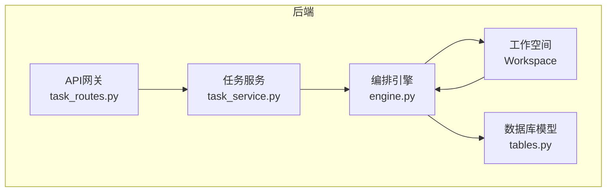
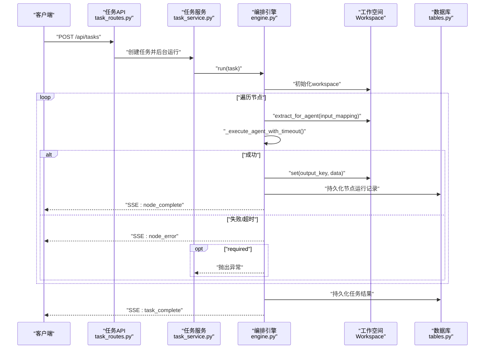
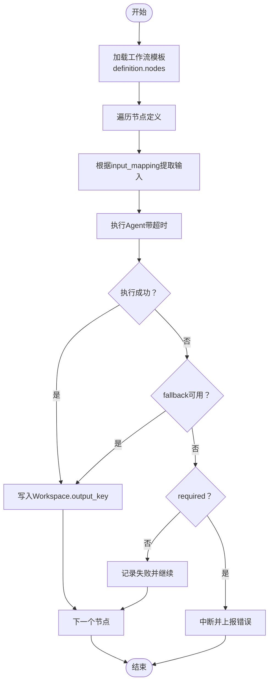
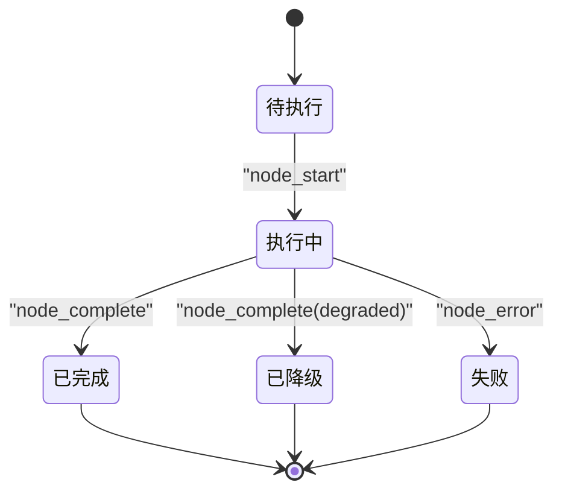
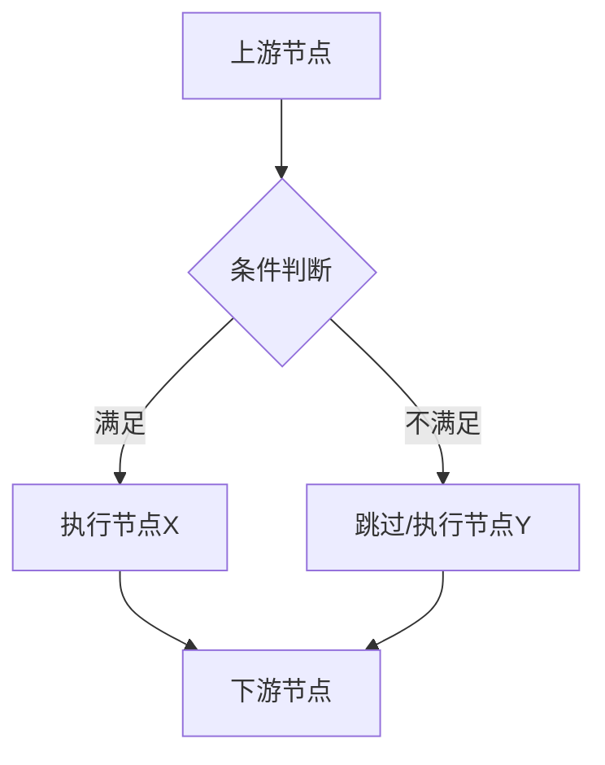
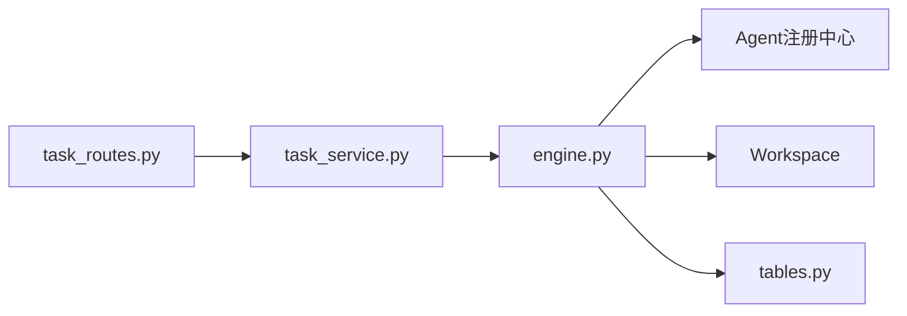

# 工作流Manifest

<cite>
**本文引用的文件**
- [ARCHITECTURE.md](file://ARCHITECTURE.md)
- [engine.py](file://backend/app/orchestrator/engine.py)
- [tables.py](file://backend/app/models/tables.py)
- [task_routes.py](file://backend/app/api/task_routes.py)
- [task_service.py](file://backend/app/services/task_service.py)
</cite>

## 目录
1. [简介](#简介)
2. [项目结构](#项目结构)
3. [核心组件](#核心组件)
4. [架构总览](#架构总览)
5. [组件详解](#组件详解)
6. [依赖关系分析](#依赖关系分析)
7. [性能考量](#性能考量)
8. [故障排查指南](#故障排查指南)
9. [结论](#结论)
10. [附录](#附录)

## 简介
本文件面向HotClaw工作流Manifest配置，系统化阐述工作流的声明式建模方式、节点定义规范、执行图构建与状态管理机制，并给出组合模式（嵌套、条件、循环）的实现思路与最佳实践。文档同时覆盖版本管理与向后兼容策略、设计模式与性能优化建议，并提供复杂场景的配置示例与排障指引。

## 项目结构
HotClaw后端采用“声明式Manifest + 编排引擎”的架构：工作流定义通过YAML/JSON Manifest声明，Orchestrator引擎按定义加载并驱动Agent执行，全程通过Workspace共享上下文，通过SSE广播状态，最终落库持久化。

图表来源
- [task_routes.py:41-112](file://backend/app/api/task_routes.py#L41-L112)
- [task_service.py:1-73](file://backend/app/services/task_service.py#L1-L73)
- [engine.py:89-234](file://backend/app/orchestrator/engine.py#L89-L234)
- [tables.py:23-233](file://backend/app/models/tables.py#L23-L233)

章节来源
- [ARCHITECTURE.md:496-537](file://ARCHITECTURE.md#L496-L537)
- [engine.py:89-234](file://backend/app/orchestrator/engine.py#L89-L234)
- [task_routes.py:41-112](file://backend/app/api/task_routes.py#L41-L112)
- [task_service.py:1-73](file://backend/app/services/task_service.py#L1-L73)
- [tables.py:23-233](file://backend/app/models/tables.py#L23-L233)

## 核心组件
- 工作流模板与节点定义
  - 工作流模板保存在数据库中，包含definition、input_schema、output_mapping等字段，definition中定义nodes序列。
  - 节点定义包含node_id、agent_id、name、input_mapping、output_key、required等关键字段。
- 编排引擎
  - 负责加载任务、创建工作空间、按节点顺序执行Agent、广播状态、持久化节点运行记录、汇总统计。
- 数据模型
  - 任务TaskModel、节点运行记录TaskNodeRunModel、工作流模板WorkflowTemplateModel等。
- API与服务
  - 任务创建与状态查询API、任务服务封装编排调用与异常处理。

章节来源
- [tables.py:202-217](file://backend/app/models/tables.py#L202-L217)
- [engine.py:31-86](file://backend/app/orchestrator/engine.py#L31-L86)
- [engine.py:92-234](file://backend/app/orchestrator/engine.py#L92-L234)
- [task_routes.py:41-112](file://backend/app/api/task_routes.py#L41-L112)
- [task_service.py:19-64](file://backend/app/services/task_service.py#L19-L64)

## 架构总览
工作流执行的关键流程：API接收任务请求 → 任务服务创建任务并触发编排 → 编排引擎加载工作流定义 → 逐节点提取输入、执行Agent、写入输出到Workspace → 广播节点状态 → 汇总结果并持久化。

图表来源
- [task_routes.py:41-51](file://backend/app/api/task_routes.py#L41-L51)
- [task_service.py:39-64](file://backend/app/services/task_service.py#L39-L64)
- [engine.py:92-234](file://backend/app/orchestrator/engine.py#L92-L234)
- [tables.py:23-74](file://backend/app/models/tables.py#L23-L74)

## 组件详解

### 工作流Manifest结构与节点定义规范
- 工作流模板
  - workflow_id、name、description、version、definition、input_schema、output_mapping、status。
  - definition.nodes为有序节点数组，MVP阶段为线性链，但数据结构预留DAG扩展。
- 节点定义
  - node_id：节点标识，全局唯一。
  - agent_id：绑定的Agent实现。
  - name：节点名称，用于UI展示与日志。
  - input_mapping：输入映射，从input/workspace抽取字段，支持简单表达式语法。
  - output_key：输出写入Workspace的键名。
  - required：是否为必经节点，失败时决定是否中断。
  - timeout_seconds：可选超时控制。
- 执行顺序
  - 依据nodes数组顺序依次执行，当前节点完成后才进入下一个节点。

图表来源
- [engine.py:92-234](file://backend/app/orchestrator/engine.py#L92-L234)
- [engine.py:31-86](file://backend/app/orchestrator/engine.py#L31-L86)
- [tables.py:202-217](file://backend/app/models/tables.py#L202-L217)

章节来源
- [ARCHITECTURE.md:761-800](file://ARCHITECTURE.md#L761-L800)
- [engine.py:31-86](file://backend/app/orchestrator/engine.py#L31-L86)
- [engine.py:92-234](file://backend/app/orchestrator/engine.py#L92-L234)
- [tables.py:202-217](file://backend/app/models/tables.py#L202-L217)

### 声明式建模、执行图与状态管理
- 声明式建模
  - 通过Manifest声明节点依赖与执行顺序，Orchestrator仅负责调度，不内嵌业务逻辑。
- 执行图构建
  - nodes数组构成线性执行图；DAG扩展点预留，可通过definition.graph字段扩展。
- 状态管理
  - 任务状态：pending → running → completed/failed。
  - 节点状态：pending → running → completed/degraded/failed。
  - 通过SSE广播节点开始/完成/错误事件，前端实时渲染。

图表来源
- [engine.py:124-210](file://backend/app/orchestrator/engine.py#L124-L210)
- [task_routes.py:54-87](file://backend/app/api/task_routes.py#L54-L87)

章节来源
- [engine.py:124-210](file://backend/app/orchestrator/engine.py#L124-L210)
- [task_routes.py:54-87](file://backend/app/api/task_routes.py#L54-L87)

### 组合模式：嵌套、条件、循环
- 嵌套工作流
  - 通过在Agent内部再调用另一个工作流模板实现，Agent负责编排与参数注入。
- 条件工作流
  - 在Agent内根据上一步输出动态选择后续节点；或通过可选节点（required=false）实现分支。
- 循环工作流
  - 通过在Agent内对候选集合迭代执行相同节点序列，或在Agent外层循环调用工作流模板。

图表来源
- [engine.py:149-175](file://backend/app/orchestrator/engine.py#L149-L175)

章节来源
- [engine.py:149-175](file://backend/app/orchestrator/engine.py#L149-L175)

### 复杂场景配置示例
- 多阶段内容生产流程
  - 账号定位解析 → 热点分析 → 选题策划 → 标题生成 → 正文生成 → 审核评估。
  - 通过input_mapping串联各阶段输出，output_key写入Workspace供下游使用。
- 异常处理工作流
  - 审核节点设置required=false，失败时降级并继续输出草稿；热点抓取失败时回退到缓存数据。

章节来源
- [engine.py:31-86](file://backend/app/orchestrator/engine.py#L31-L86)
- [engine.py:149-175](file://backend/app/orchestrator/engine.py#L149-L175)

### 版本管理与向后兼容
- 版本字段
  - workflow_id、version用于区分不同版本的工作流模板。
- 兼容策略
  - 保持输入/输出Schema的向后兼容；新增字段设为可选；必要时提供迁移脚本。
  - 通过input_schema与output_mapping约束变更范围，避免破坏既有节点。

章节来源
- [tables.py:206-212](file://backend/app/models/tables.py#L206-L212)
- [ARCHITECTURE.md:761-800](file://ARCHITECTURE.md#L761-L800)

### 设计模式与性能优化建议
- 设计模式
  - 工作流模板与执行解耦（Manifest-First）、控制平面与执行平面分离。
  - Workspace作为上下文容器，统一数据访问与可见性。
- 性能优化
  - 合理设置节点超时与重试策略，避免长尾阻塞。
  - 通过并行化（DAG）与缓存（如热点抓取）提升吞吐。
  - 降低Schema校验与日志开销，使用结构化日志与轻量摘要。

章节来源
- [ARCHITECTURE.md:92-123](file://ARCHITECTURE.md#L92-L123)
- [engine.py:236-243](file://backend/app/orchestrator/engine.py#L236-L243)

## 依赖关系分析
- 组件耦合
  - API → 任务服务 → 编排引擎 → Agent注册中心/Workspace → 数据库。
- 关键依赖链
  - 任务服务负责异常捕获与SSE广播；编排引擎负责节点调度与状态推进；数据库负责持久化。

图表来源
- [task_routes.py:41-51](file://backend/app/api/task_routes.py#L41-L51)
- [task_service.py:39-64](file://backend/app/services/task_service.py#L39-L64)
- [engine.py:92-234](file://backend/app/orchestrator/engine.py#L92-L234)
- [tables.py:23-74](file://backend/app/models/tables.py#L23-L74)

章节来源
- [task_routes.py:41-112](file://backend/app/api/task_routes.py#L41-L112)
- [task_service.py:19-64](file://backend/app/services/task_service.py#L19-L64)
- [engine.py:92-234](file://backend/app/orchestrator/engine.py#L92-L234)
- [tables.py:23-74](file://backend/app/models/tables.py#L23-L74)

## 性能考量
- 节点超时与重试
  - 通过超时控制避免阻塞；必要时在Agent层实现降级返回。
- 并发与并行
  - 在DAG层面实现并行执行，减少整体时延。
- 日志与追踪
  - 使用trace_id贯穿任务生命周期，避免冗余日志影响性能。

章节来源
- [engine.py:236-243](file://backend/app/orchestrator/engine.py#L236-L243)
- [engine.py:265-271](file://backend/app/orchestrator/engine.py#L265-L271)

## 故障排查指南
- 常见问题
  - 节点超时：检查Agent执行耗时与网络依赖，适当提高超时阈值。
  - 节点失败：查看节点运行记录中的error_message，确认是否required导致中断。
  - 任务中断：确认上游节点是否成功写入Workspace，input_mapping是否正确。
- 排查步骤
  - 通过任务状态接口获取当前节点与进度。
  - 查询节点运行记录，定位失败节点与错误原因。
  - 检查Agent/fallback实现与系统提示词解析结果。

章节来源
- [task_routes.py:54-107](file://backend/app/api/task_routes.py#L54-L107)
- [engine.py:164-196](file://backend/app/orchestrator/engine.py#L164-L196)
- [tables.py:48-74](file://backend/app/models/tables.py#L48-L74)

## 结论
HotClaw通过Manifest声明式工作流与编排引擎，实现了可演进、可观测、可维护的内容生产流水线。遵循本文的节点定义规范、组合模式与版本策略，可在保证稳定性的同时快速扩展复杂场景。

## 附录
- 关键字段速览
  - 工作流模板：workflow_id、name、description、version、definition、input_schema、output_mapping、status。
  - 节点定义：node_id、agent_id、name、input_mapping、output_key、required、timeout_seconds。
  - 任务模型：id、workflow_id、status、input_data、result_data、error_message、started_at、completed_at、elapsed_seconds、total_tokens。
  - 节点运行记录：task_id、node_id、agent_id、status、input_data、output_data、error_message、degraded、started_at、completed_at、elapsed_seconds、prompt_tokens、completion_tokens、model_used、retry_count。

章节来源
- [tables.py:202-217](file://backend/app/models/tables.py#L202-L217)
- [engine.py:31-86](file://backend/app/orchestrator/engine.py#L31-L86)
- [tables.py:23-74](file://backend/app/models/tables.py#L23-L74)