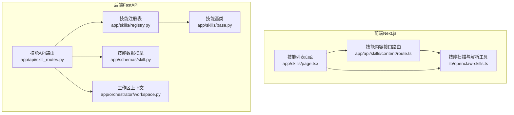
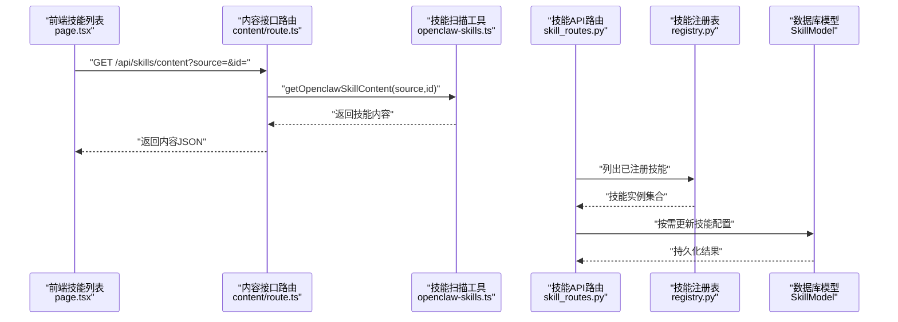
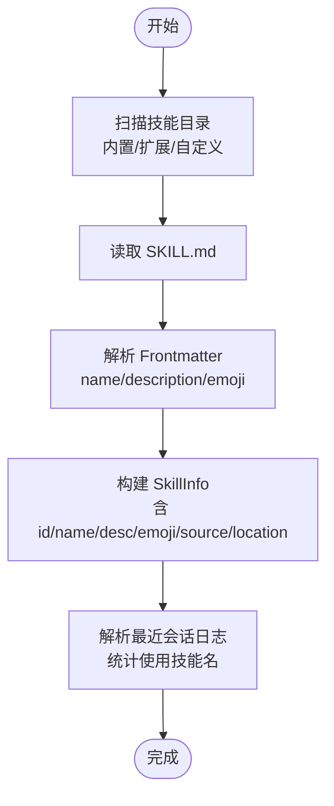
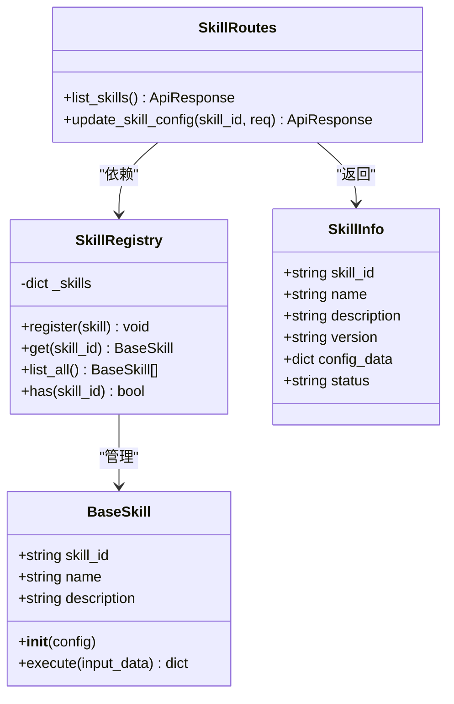
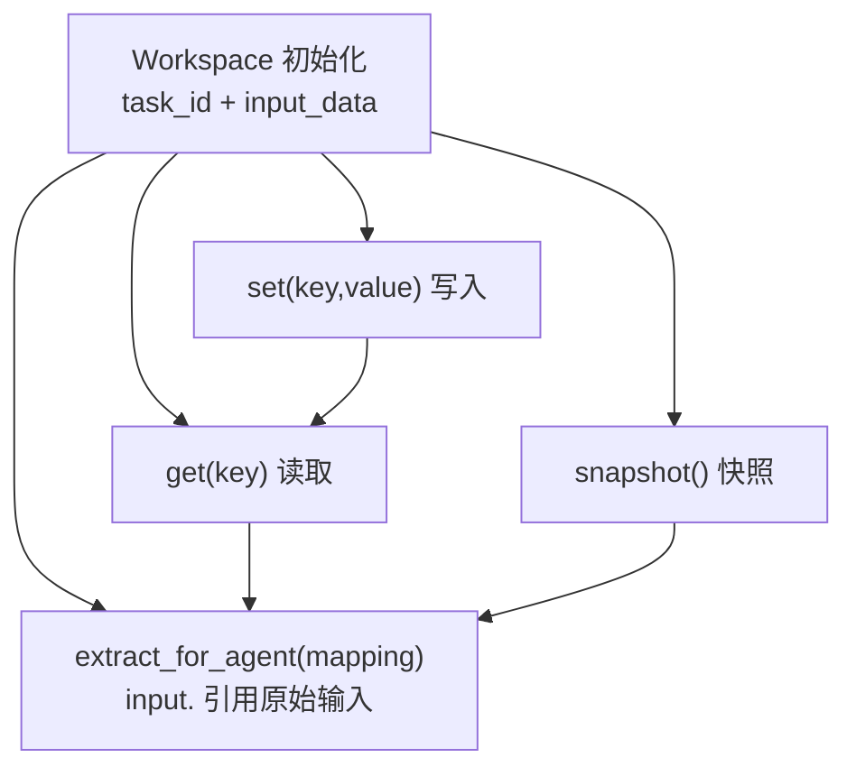
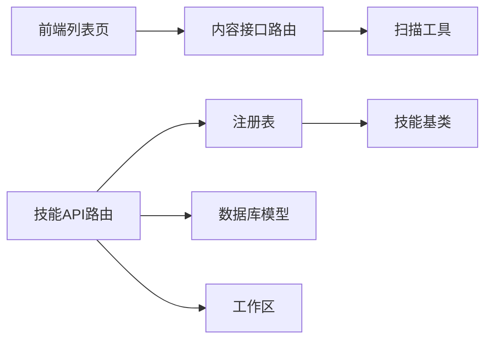

# 技能Manifest

<cite>
**本文引用的文件**
- [OpenClaw-bot-review-main/lib/openclaw-skills.ts](file://OpenClaw-bot-review-main/lib/openclaw-skills.ts)
- [OpenClaw-bot-review-main/app/api/skills/content/route.ts](file://OpenClaw-bot-review-main/app/api/skills/content/route.ts)
- [OpenClaw-bot-review-main/app/skills/page.tsx](file://OpenClaw-bot-review-main/app/skills/page.tsx)
- [backend/app/schemas/skill.py](file://backend/app/schemas/skill.py)
- [backend/app/skills/base.py](file://backend/app/skills/base.py)
- [backend/app/skills/registry.py](file://backend/app/skills/registry.py)
- [backend/app/api/skill_routes.py](file://backend/app/api/skill_routes.py)
- [backend/app/orchestrator/workspace.py](file://backend/app/orchestrator/workspace.py)
</cite>

## 目录
1. [简介](#简介)
2. [项目结构](#项目结构)
3. [核心组件](#核心组件)
4. [架构总览](#架构总览)
5. [详细组件分析](#详细组件分析)
6. [依赖分析](#依赖分析)
7. [性能考虑](#性能考虑)
8. [故障排查指南](#故障排查指南)
9. [结论](#结论)
10. [附录](#附录)

## 简介
本文件系统性阐述 HotClaw 技能 Manifest 的技术规范与实现细节，涵盖以下方面：
- 技能 Manifest 的结构定义：技能名称、描述、表情符号、来源、位置、被哪些智能体使用等。
- 声明式配置方式：前端如何扫描、解析并展示技能清单；后端如何注册与管理技能实例。
- 技能注册流程：文件发现、解析过程、运行时加载与持久化。
- 配置示例类别：文本处理、数据转换、API 调用等类型的概念性说明与配置要点。
- 继承与覆盖机制：在不同 Workspace 中的配置传递规则与优先级建议。
- 调试方法与常见问题解决。

## 项目结构
围绕“技能Manifest”的相关模块分布在前后端两个子项目中：
- 前端（Next.js）负责技能清单的展示、内容读取与交互。
- 后端（FastAPI + Pydantic）负责技能注册、配置更新与持久化。

图表来源
- [OpenClaw-bot-review-main/app/skills/page.tsx:1-370](file://OpenClaw-bot-review-main/app/skills/page.tsx#L1-L370)
- [OpenClaw-bot-review-main/app/api/skills/content/route.ts:1-28](file://OpenClaw-bot-review-main/app/api/skills/content/route.ts#L1-L28)
- [OpenClaw-bot-review-main/lib/openclaw-skills.ts:1-162](file://OpenClaw-bot-review-main/lib/openclaw-skills.ts#L1-L162)
- [backend/app/api/skill_routes.py:1-61](file://backend/app/api/skill_routes.py#L1-L61)
- [backend/app/schemas/skill.py:1-22](file://backend/app/schemas/skill.py#L1-L22)
- [backend/app/skills/base.py:1-37](file://backend/app/skills/base.py#L1-L37)
- [backend/app/skills/registry.py:1-37](file://backend/app/skills/registry.py#L1-L37)
- [backend/app/orchestrator/workspace.py:1-53](file://backend/app/orchestrator/workspace.py#L1-L53)

章节来源
- [OpenClaw-bot-review-main/app/skills/page.tsx:1-370](file://OpenClaw-bot-review-main/app/skills/page.tsx#L1-L370)
- [OpenClaw-bot-review-main/app/api/skills/content/route.ts:1-28](file://OpenClaw-bot-review-main/app/api/skills/content/route.ts#L1-L28)
- [OpenClaw-bot-review-main/lib/openclaw-skills.ts:1-162](file://OpenClaw-bot-review-main/lib/openclaw-skills.ts#L1-L162)
- [backend/app/api/skill_routes.py:1-61](file://backend/app/api/skill_routes.py#L1-L61)
- [backend/app/schemas/skill.py:1-22](file://backend/app/schemas/skill.py#L1-L22)
- [backend/app/skills/base.py:1-37](file://backend/app/skills/base.py#L1-L37)
- [backend/app/skills/registry.py:1-37](file://backend/app/skills/registry.py#L1-L37)
- [backend/app/orchestrator/workspace.py:1-53](file://backend/app/orchestrator/workspace.py#L1-L53)

## 核心组件
- 前端技能清单与内容展示
  - 列表页负责拉取技能清单、按来源分类统计、展示技能元信息与使用情况。
  - 内容接口路由根据 source 与 id 读取对应技能的 SKILL.md 内容。
  - 技能扫描工具负责扫描内置、扩展与自定义技能目录，解析 Frontmatter 提取 name/description/emoji 并生成 SkillInfo。
- 后端技能注册与配置
  - 技能基类定义统一的执行接口与配置注入。
  - 注册表集中管理技能实例，提供注册、查询、列举与存在性检查。
  - 技能 API 路由支持列出已注册技能与更新技能配置（持久化到数据库）。
  - 数据模型使用 Pydantic 定义技能信息与请求体结构。

章节来源
- [OpenClaw-bot-review-main/app/skills/page.tsx:1-370](file://OpenClaw-bot-review-main/app/skills/page.tsx#L1-L370)
- [OpenClaw-bot-review-main/app/api/skills/content/route.ts:1-28](file://OpenClaw-bot-review-main/app/api/skills/content/route.ts#L1-L28)
- [OpenClaw-bot-review-main/lib/openclaw-skills.ts:1-162](file://OpenClaw-bot-review-main/lib/openclaw-skills.ts#L1-L162)
- [backend/app/skills/base.py:1-37](file://backend/app/skills/base.py#L1-L37)
- [backend/app/skills/registry.py:1-37](file://backend/app/skills/registry.py#L1-L37)
- [backend/app/api/skill_routes.py:1-61](file://backend/app/api/skill_routes.py#L1-L61)
- [backend/app/schemas/skill.py:1-22](file://backend/app/schemas/skill.py#L1-L22)

## 架构总览
下图展示了从前端到后端的技能清单与内容读取链路，以及后端技能注册与配置更新的内部流程。

图表来源
- [OpenClaw-bot-review-main/app/skills/page.tsx:1-370](file://OpenClaw-bot-review-main/app/skills/page.tsx#L1-L370)
- [OpenClaw-bot-review-main/app/api/skills/content/route.ts:1-28](file://OpenClaw-bot-review-main/app/api/skills/content/route.ts#L1-L28)
- [OpenClaw-bot-review-main/lib/openclaw-skills.ts:153-162](file://OpenClaw-bot-review-main/lib/openclaw-skills.ts#L153-L162)
- [backend/app/api/skill_routes.py:17-61](file://backend/app/api/skill_routes.py#L17-L61)
- [backend/app/skills/registry.py:22-32](file://backend/app/skills/registry.py#L22-L32)

## 详细组件分析

### 前端：技能清单与内容读取
- 技能清单页面
  - 负责拉取技能列表、渲染分类统计、展示技能元信息与使用情况（被哪些智能体使用）。
  - 对输入进行基本归一化校验，确保字段类型与非空约束。
- 技能内容接口路由
  - 从查询参数解析 source 与 id，调用工具函数读取对应 SKILL.md 内容。
  - 返回技能元信息与内容正文。
- 技能扫描与解析工具
  - 扫描内置、扩展与自定义技能目录，读取每个技能目录下的 SKILL.md。
  - 解析 Frontmatter 提取 name/description/emoji，回退策略：name 默认为目录名，emoji 默认为固定字符。
  - 计算技能被哪些智能体使用：通过最近若干会话日志提取技能快照中的技能名。

图表来源
- [OpenClaw-bot-review-main/lib/openclaw-skills.ts:64-129](file://OpenClaw-bot-review-main/lib/openclaw-skills.ts#L64-L129)
- [OpenClaw-bot-review-main/lib/openclaw-skills.ts:30-47](file://OpenClaw-bot-review-main/lib/openclaw-skills.ts#L30-L47)
- [OpenClaw-bot-review-main/lib/openclaw-skills.ts:74-109](file://OpenClaw-bot-review-main/lib/openclaw-skills.ts#L74-L109)

章节来源
- [OpenClaw-bot-review-main/app/skills/page.tsx:21-40](file://OpenClaw-bot-review-main/app/skills/page.tsx#L21-L40)
- [OpenClaw-bot-review-main/app/api/skills/content/route.ts:4-27](file://OpenClaw-bot-review-main/app/api/skills/content/route.ts#L4-L27)
- [OpenClaw-bot-review-main/lib/openclaw-skills.ts:49-62](file://OpenClaw-bot-review-main/lib/openclaw-skills.ts#L49-L62)
- [OpenClaw-bot-review-main/lib/openclaw-skills.ts:111-151](file://OpenClaw-bot-review-main/lib/openclaw-skills.ts#L111-L151)

### 后端：技能注册与配置更新
- 技能基类
  - 定义统一的异步执行接口 execute(input_data) -> dict。
  - 支持通过构造函数注入配置字典 config。
- 技能注册表
  - 单例注册表集中管理技能实例，提供注册、查询、列举与存在性检查。
  - 若重复注册同一 skill_id，记录告警日志。
- 技能API路由
  - 列出已注册技能，返回标准化的技能信息（含版本、状态、配置）。
  - 更新技能配置：若数据库中不存在该技能记录则创建，否则更新配置字段。
- 数据模型
  - 使用 Pydantic 定义技能信息与请求体结构，保证入参与响应的数据形态一致。

图表来源
- [backend/app/skills/base.py:16-37](file://backend/app/skills/base.py#L16-L37)
- [backend/app/skills/registry.py:10-36](file://backend/app/skills/registry.py#L10-L36)
- [backend/app/api/skill_routes.py:17-61](file://backend/app/api/skill_routes.py#L17-L61)
- [backend/app/schemas/skill.py:6-22](file://backend/app/schemas/skill.py#L6-L22)

章节来源
- [backend/app/skills/base.py:16-37](file://backend/app/skills/base.py#L16-L37)
- [backend/app/skills/registry.py:10-36](file://backend/app/skills/registry.py#L10-L36)
- [backend/app/api/skill_routes.py:17-61](file://backend/app/api/skill_routes.py#L17-L61)
- [backend/app/schemas/skill.py:6-22](file://backend/app/schemas/skill.py#L6-L22)

### 工作区与配置传递（Workspace）
- 工作区是单次任务的隔离上下文容器，提供键值存取、快照与按映射抽取能力。
- 输入映射支持两种形式：
  - 以 input. 开头的键：引用原始输入的子字段。
  - 普通键：直接从工作区数据中取值。
- 这为“继承与覆盖”提供了基础：上层可将 Workspace 的字段映射到具体技能的输入，实现配置的传递与局部覆盖。

图表来源
- [backend/app/orchestrator/workspace.py:15-53](file://backend/app/orchestrator/workspace.py#L15-L53)

章节来源
- [backend/app/orchestrator/workspace.py:12-53](file://backend/app/orchestrator/workspace.py#L12-L53)

## 依赖分析
- 前端依赖
  - 技能列表页依赖内容接口路由与扫描工具。
  - 内容接口路由依赖扫描工具提供的内容读取能力。
- 后端依赖
  - 技能API路由依赖注册表与数据库模型。
  - 注册表依赖技能基类。
  - 工作区与技能API路由解耦，但工作区为配置传递提供上下文。

图表来源
- [OpenClaw-bot-review-main/app/skills/page.tsx:1-370](file://OpenClaw-bot-review-main/app/skills/page.tsx#L1-L370)
- [OpenClaw-bot-review-main/app/api/skills/content/route.ts:1-28](file://OpenClaw-bot-review-main/app/api/skills/content/route.ts#L1-L28)
- [OpenClaw-bot-review-main/lib/openclaw-skills.ts:1-162](file://OpenClaw-bot-review-main/lib/openclaw-skills.ts#L1-L162)
- [backend/app/api/skill_routes.py:1-61](file://backend/app/api/skill_routes.py#L1-L61)
- [backend/app/skills/registry.py:1-37](file://backend/app/skills/registry.py#L1-L37)
- [backend/app/skills/base.py:1-37](file://backend/app/skills/base.py#L1-L37)
- [backend/app/orchestrator/workspace.py:1-53](file://backend/app/orchestrator/workspace.py#L1-L53)

章节来源
- [OpenClaw-bot-review-main/app/skills/page.tsx:1-370](file://OpenClaw-bot-review-main/app/skills/page.tsx#L1-L370)
- [OpenClaw-bot-review-main/app/api/skills/content/route.ts:1-28](file://OpenClaw-bot-review-main/app/api/skills/content/route.ts#L1-L28)
- [OpenClaw-bot-review-main/lib/openclaw-skills.ts:1-162](file://OpenClaw-bot-review-main/lib/openclaw-skills.ts#L1-L162)
- [backend/app/api/skill_routes.py:1-61](file://backend/app/api/skill_routes.py#L1-L61)
- [backend/app/skills/registry.py:1-37](file://backend/app/skills/registry.py#L1-L37)
- [backend/app/skills/base.py:1-37](file://backend/app/skills/base.py#L1-L37)
- [backend/app/orchestrator/workspace.py:1-53](file://backend/app/orchestrator/workspace.py#L1-L53)

## 性能考虑
- 文件系统扫描
  - 前端扫描内置/扩展/自定义技能目录时，对目录进行排序与逐项读取，注意在大型仓库中可能带来 I/O 压力。
  - 建议：缓存扫描结果或仅在变更时刷新；限制扫描深度与范围。
- 正则匹配与日志解析
  - 最近会话日志解析使用正则匹配技能名，且只检查最后若干文件片段，避免全量扫描。
  - 建议：对日志文件大小与匹配范围做上限控制，防止内存与 CPU 波动。
- 注册表与配置更新
  - 注册表为内存字典存储，适合小到中型规模；大规模技能数量时应评估内存占用。
  - 配置更新涉及数据库写入，建议批量提交与幂等更新，减少锁竞争。
- 工作区映射
  - 映射抽取为 O(n) 遍历，n 为映射字段数；建议保持映射简洁，避免深层嵌套引用。

## 故障排查指南
- 前端技能内容读取失败
  - 现象：点击技能卡片无法显示内容或提示错误。
  - 排查步骤：
    - 确认查询参数 source 与 id 是否正确传入。
    - 检查对应 SKILL.md 是否存在且可读。
    - 查看工具函数是否成功解析 Frontmatter。
- 技能未出现在列表中
  - 现象：技能已存在但未显示。
  - 排查步骤：
    - 确认技能目录结构符合预期（每个技能目录包含 SKILL.md）。
    - 检查 Frontmatter 是否包含 name/description/emoji 字段。
    - 确认扫描路径指向正确的内置/扩展/自定义目录。
- 后端技能配置更新失败
  - 现象：更新接口返回错误或未生效。
  - 排查步骤：
    - 确认 skill_id 存在于注册表中。
    - 检查数据库中是否存在对应记录，若不存在将自动创建。
    - 核对请求体结构与字段类型（Pydantic 自动校验）。
- 工作区映射取值为空
  - 现象：按映射抽取的字段为 None。
  - 排查步骤：
    - 检查映射键是否正确（input. 前缀用于引用原始输入）。
    - 确认工作区中确实存在目标键值。
    - 避免深层路径导致的键缺失。

章节来源
- [OpenClaw-bot-review-main/app/api/skills/content/route.ts:10-27](file://OpenClaw-bot-review-main/app/api/skills/content/route.ts#L10-L27)
- [OpenClaw-bot-review-main/lib/openclaw-skills.ts:64-72](file://OpenClaw-bot-review-main/lib/openclaw-skills.ts#L64-L72)
- [OpenClaw-bot-review-main/lib/openclaw-skills.ts:30-47](file://OpenClaw-bot-review-main/lib/openclaw-skills.ts#L30-L47)
- [backend/app/api/skill_routes.py:40-60](file://backend/app/api/skill_routes.py#L40-L60)
- [backend/app/orchestrator/workspace.py:36-52](file://backend/app/orchestrator/workspace.py#L36-L52)

## 结论
- 技能 Manifest 在前端通过目录扫描与 Frontmatter 解析形成标准化的技能清单；在后端通过注册表与 API 路由实现统一的生命周期管理与配置持久化。
- 工作区为配置传递与继承提供了上下文基础，结合输入映射可实现灵活的“继承+覆盖”策略。
- 建议在生产环境中引入缓存、限流与幂等更新机制，以提升性能与稳定性。

## 附录

### 技能Manifest结构定义（字段说明）
- id：技能唯一标识符（通常来自技能目录名）。
- name：技能名称（来源于 Frontmatter name，缺省为 id）。
- description：技能描述（来源于 Frontmatter description，缺省为空）。
- emoji：技能表情符号（来源于 Frontmatter emoji，缺省为固定字符）。
- source：技能来源（builtin/extension:<name>/custom）。
- location：技能文件绝对路径（SKILL.md）。
- usedBy：使用该技能的智能体 ID 列表（基于会话日志统计）。

章节来源
- [OpenClaw-bot-review-main/lib/openclaw-skills.ts:5-13](file://OpenClaw-bot-review-main/lib/openclaw-skills.ts#L5-L13)
- [OpenClaw-bot-review-main/lib/openclaw-skills.ts:111-151](file://OpenClaw-bot-review-main/lib/openclaw-skills.ts#L111-L151)

### 声明式配置与类型转换
- 前端扫描工具对 Frontmatter 的解析采用字符串匹配与替换，确保 name/description/emoji 的基本清洗与回退。
- 列表页对返回数据进行归一化校验，确保字段类型与非空约束。
- 后端使用 Pydantic 模型进行请求与响应的结构化校验与类型约束。

章节来源
- [OpenClaw-bot-review-main/lib/openclaw-skills.ts:30-47](file://OpenClaw-bot-review-main/lib/openclaw-skills.ts#L30-L47)
- [OpenClaw-bot-review-main/app/skills/page.tsx:21-40](file://OpenClaw-bot-review-main/app/skills/page.tsx#L21-L40)
- [backend/app/schemas/skill.py:6-22](file://backend/app/schemas/skill.py#L6-L22)

### 技能注册流程（文件发现 → 解析 → 运行时加载）
- 文件发现：扫描内置、扩展与自定义技能目录，定位每个技能目录下的 SKILL.md。
- 解析：读取并解析 Frontmatter，生成标准化的 SkillInfo。
- 运行时加载：后端通过注册表集中管理技能实例，API 路由提供查询与更新能力。

章节来源
- [OpenClaw-bot-review-main/lib/openclaw-skills.ts:64-129](file://OpenClaw-bot-review-main/lib/openclaw-skills.ts#L64-L129)
- [backend/app/skills/registry.py:16-26](file://backend/app/skills/registry.py#L16-L26)
- [backend/app/api/skill_routes.py:17-31](file://backend/app/api/skill_routes.py#L17-L31)

### 配置示例类别（概念性说明）
- 文本处理技能
  - 输入：原始文本或结构化字段。
  - 处理：清洗、分词、摘要、情感分析等。
  - 输出：结构化结果（如 JSON）。
- 数据转换技能
  - 输入：表格、JSON、CSV 等。
  - 处理：字段映射、类型转换、格式化。
  - 输出：目标格式（如 JSON/CSV）。
- API 调用技能
  - 输入：URL、参数、认证信息。
  - 处理：HTTP 请求、响应解析、错误重试。
  - 输出：结构化数据或状态码。

说明：以上为概念性示例，实际配置需遵循 Frontmatter 字段与后端执行接口约定。

### 继承与覆盖机制及 Workspace 传递规则
- 继承：工作区作为任务级上下文，可将全局输入与中间态数据暴露给技能。
- 覆盖：通过输入映射，技能可选择性覆盖或补充工作区中的字段。
- 规则建议：
  - 使用 input.<key> 引用原始输入，避免意外覆盖。
  - 对于多层嵌套字段，建议在工作区阶段扁平化或明确键路径。
  - 在技能内部对输入进行严格校验与默认值设置，确保健壮性。

章节来源
- [backend/app/orchestrator/workspace.py:36-52](file://backend/app/orchestrator/workspace.py#L36-L52)