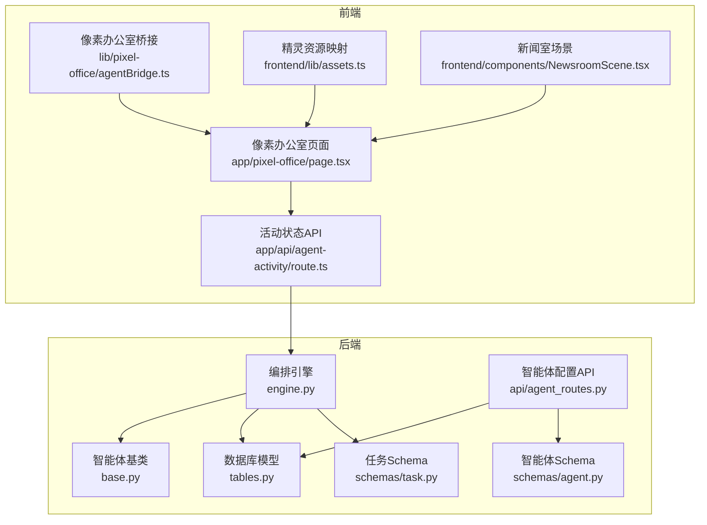
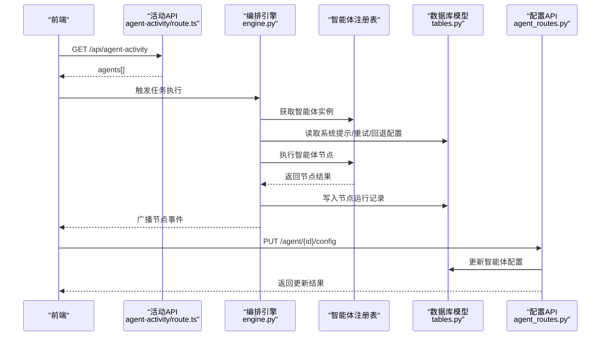
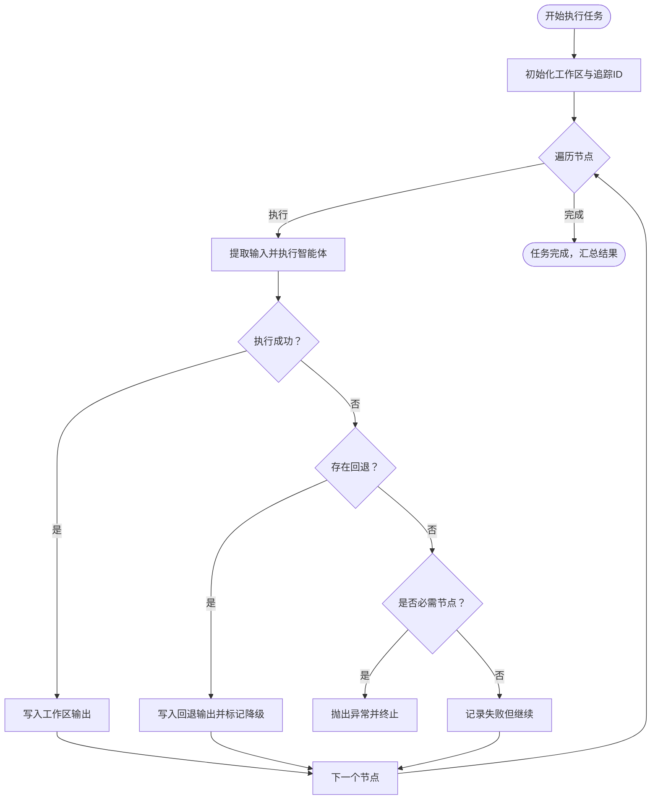
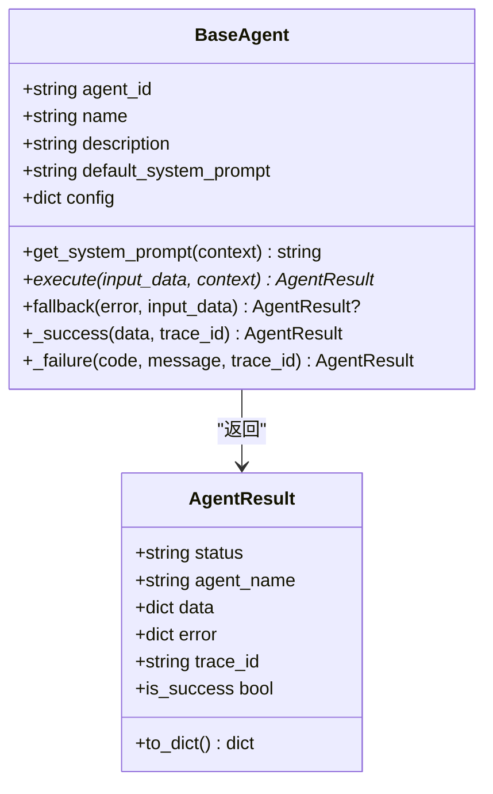
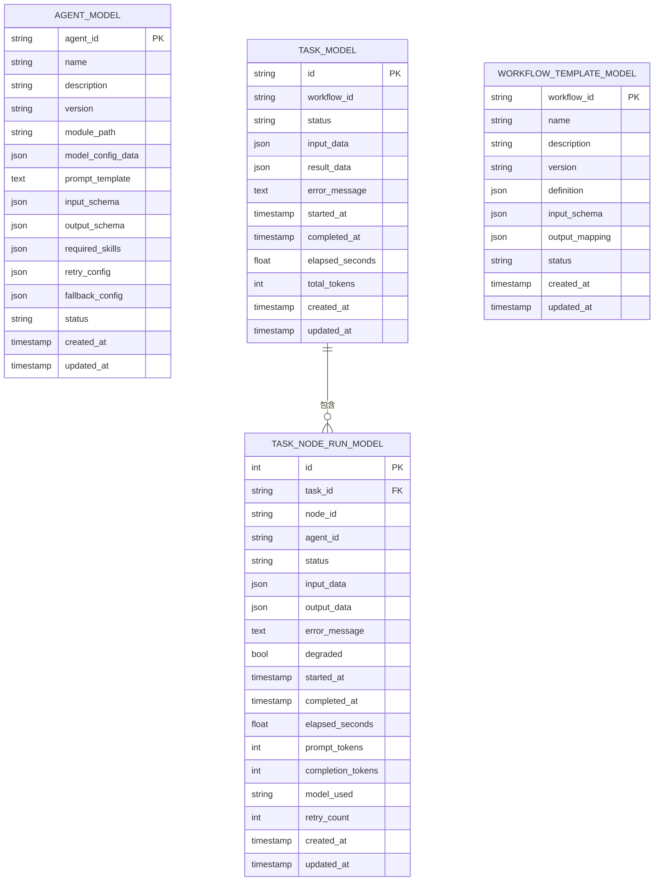
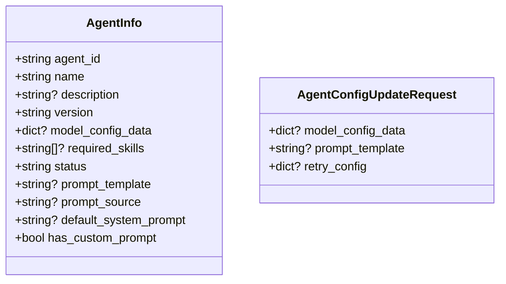
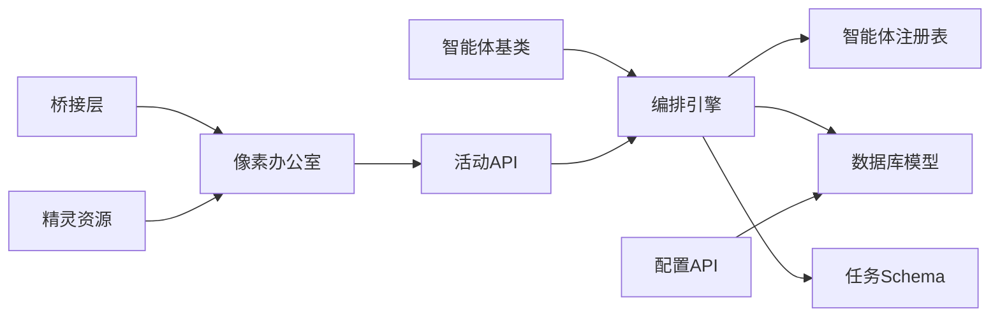

# 智能体Manifest

<cite>
**本文引用的文件**
- [backend/app/orchestrator/engine.py](file://backend/app/orchestrator/engine.py)
- [backend/app/agents/base.py](file://backend/app/agents/base.py)
- [backend/app/models/tables.py](file://backend/app/models/tables.py)
- [backend/app/schemas/agent.py](file://backend/app/schemas/agent.py)
- [backend/app/schemas/task.py](file://backend/app/schemas/task.py)
- [backend/app/api/agent_routes.py](file://backend/app/api/agent_routes.py)
- [OpenClaw-bot-review-main/app/api/config/agent-model/route.ts](file://OpenClaw-bot-review-main/app/api/config/agent-model/route.ts)
- [OpenClaw-bot-review-main/lib/config-cache.ts](file://OpenClaw-bot-review-main/lib/config-cache.ts)
- [OpenClaw-bot-review-main/app/api/agent-activity/route.ts](file://OpenClaw-bot-review-main/app/api/agent-activity/route.ts)
- [OpenClaw-bot-review-main/app/pixel-office/page.tsx](file://OpenClaw-bot-review-main/app/pixel-office/page.tsx)
- [OpenClaw-bot-review-main/lib/pixel-office/agentBridge.ts](file://OpenClaw-bot-review-main/lib/pixel-office/agentBridge.ts)
- [frontend/lib/assets.ts](file://frontend/lib/assets.ts)
- [frontend/components/NewsroomScene.tsx](file://frontend/components/NewsroomScene.tsx)
</cite>

## 目录
1. [简介](#简介)
2. [项目结构](#项目结构)
3. [核心组件](#核心组件)
4. [架构总览](#架构总览)
5. [详细组件分析](#详细组件分析)
6. [依赖关系分析](#依赖关系分析)
7. [性能考量](#性能考量)
8. [故障排查指南](#故障排查指南)
9. [结论](#结论)
10. [附录](#附录)

## 简介
本技术文档围绕HotClaw智能体Manifest配置进行系统性说明，聚焦以下目标：
- 解释智能体Manifest的YAML/JSON格式规范，涵盖智能体名称、类型、执行器、参数配置等核心字段
- 说明智能体生命周期管理、状态持久化与错误处理机制
- 阐述智能体间依赖关系与执行顺序控制
- 提供简单智能体与复杂工作流智能体的配置模板路径
- 解释配置的动态加载与热更新支持
- 给出配置验证规则、字段约束与最佳实践

## 项目结构
HotClaw采用前后端分离架构，智能体配置与运行由后端编排引擎驱动，前端通过API与SSE实时展示智能体状态。



图表来源
- [backend/app/orchestrator/engine.py:89-285](file://backend/app/orchestrator/engine.py#L89-L285)
- [backend/app/agents/base.py:49-99](file://backend/app/agents/base.py#L49-L99)
- [backend/app/models/tables.py:160-180](file://backend/app/models/tables.py#L160-L180)
- [backend/app/schemas/agent.py:6-29](file://backend/app/schemas/agent.py#L6-L29)
- [backend/app/schemas/task.py:10-83](file://backend/app/schemas/task.py#L10-L83)
- [backend/app/api/agent_routes.py:74-114](file://backend/app/api/agent_routes.py#L74-L114)
- [OpenClaw-bot-review-main/app/api/agent-activity/route.ts:782-852](file://OpenClaw-bot-review-main/app/api/agent-activity/route.ts#L782-L852)
- [OpenClaw-bot-review-main/app/pixel-office/page.tsx:748-768](file://OpenClaw-bot-review-main/app/pixel-office/page.tsx#L748-L768)
- [OpenClaw-bot-review-main/lib/pixel-office/agentBridge.ts:46-131](file://OpenClaw-bot-review-main/lib/pixel-office/agentBridge.ts#L46-L131)
- [frontend/lib/assets.ts:70-107](file://frontend/lib/assets.ts#L70-L107)
- [frontend/components/NewsroomScene.tsx:317-353](file://frontend/components/NewsroomScene.tsx#L317-L353)

章节来源
- [backend/app/orchestrator/engine.py:1-285](file://backend/app/orchestrator/engine.py#L1-L285)
- [backend/app/agents/base.py:1-99](file://backend/app/agents/base.py#L1-L99)
- [backend/app/models/tables.py:1-233](file://backend/app/models/tables.py#L1-L233)
- [backend/app/schemas/agent.py:1-29](file://backend/app/schemas/agent.py#L1-L29)
- [backend/app/schemas/task.py:1-83](file://backend/app/schemas/task.py#L1-L83)
- [backend/app/api/agent_routes.py:74-114](file://backend/app/api/agent_routes.py#L74-L114)
- [OpenClaw-bot-review-main/app/api/agent-activity/route.ts:782-852](file://OpenClaw-bot-review-main/app/api/agent-activity/route.ts#L782-L852)
- [OpenClaw-bot-review-main/app/pixel-office/page.tsx:748-768](file://OpenClaw-bot-review-main/app/pixel-office/page.tsx#L748-L768)
- [OpenClaw-bot-review-main/lib/pixel-office/agentBridge.ts:46-131](file://OpenClaw-bot-review-main/lib/pixel-office/agentBridge.ts#L46-L131)
- [frontend/lib/assets.ts:70-107](file://frontend/lib/assets.ts#L70-L107)
- [frontend/components/NewsroomScene.tsx:317-353](file://frontend/components/NewsroomScene.tsx#L317-L353)

## 核心组件
- 编排引擎：负责按节点顺序调度智能体执行、记录节点运行日志、广播事件、处理超时与降级
- 智能体基类：定义统一的执行接口、结果封装与降级策略
- 数据库模型：持久化智能体配置、技能、工作流模板与任务节点运行记录
- Schema：定义智能体与任务的请求/响应数据结构
- 配置API：提供智能体配置的动态更新能力
- 前端活动API与像素办公室：实时拉取智能体状态并驱动UI渲染

章节来源
- [backend/app/orchestrator/engine.py:89-285](file://backend/app/orchestrator/engine.py#L89-L285)
- [backend/app/agents/base.py:49-99](file://backend/app/agents/base.py#L49-L99)
- [backend/app/models/tables.py:160-180](file://backend/app/models/tables.py#L160-L180)
- [backend/app/schemas/agent.py:6-29](file://backend/app/schemas/agent.py#L6-L29)
- [backend/app/schemas/task.py:10-83](file://backend/app/schemas/task.py#L10-L83)
- [backend/app/api/agent_routes.py:74-114](file://backend/app/api/agent_routes.py#L74-L114)

## 架构总览
下图展示了从任务创建到节点执行、状态持久化与前端展示的全链路流程。



图表来源
- [OpenClaw-bot-review-main/app/api/agent-activity/route.ts:782-852](file://OpenClaw-bot-review-main/app/api/agent-activity/route.ts#L782-L852)
- [backend/app/orchestrator/engine.py:92-234](file://backend/app/orchestrator/engine.py#L92-L234)
- [backend/app/models/tables.py:160-180](file://backend/app/models/tables.py#L160-L180)
- [backend/app/api/agent_routes.py:74-114](file://backend/app/api/agent_routes.py#L74-L114)

## 详细组件分析

### 编排引擎与工作流节点
- 默认线性工作流节点定义了固定顺序的智能体执行序列，每个节点包含节点ID、智能体ID、名称、输入映射、输出键与是否必需
- 节点执行过程：
  - 从工作区提取输入
  - 以超时方式执行智能体
  - 成功则写入工作区输出，失败则尝试回退；若必需节点失败则抛出异常并广播错误
  - 记录节点耗时、令牌用量并广播完成事件
- 任务完成后汇总结果、计算耗时与总令牌数



图表来源
- [backend/app/orchestrator/engine.py:92-234](file://backend/app/orchestrator/engine.py#L92-L234)

章节来源
- [backend/app/orchestrator/engine.py:31-86](file://backend/app/orchestrator/engine.py#L31-L86)
- [backend/app/orchestrator/engine.py:107-197](file://backend/app/orchestrator/engine.py#L107-L197)
- [backend/app/orchestrator/engine.py:236-281](file://backend/app/orchestrator/engine.py#L236-L281)

### 智能体基类与结果封装
- 统一的AgentResult封装了成功/失败状态、数据、错误信息与追踪ID
- BaseAgent定义了抽象execute方法与可选fallback降级策略
- 提供便捷的成功/失败构造器，确保结果一致性



图表来源
- [backend/app/agents/base.py:18-99](file://backend/app/agents/base.py#L18-L99)

章节来源
- [backend/app/agents/base.py:49-99](file://backend/app/agents/base.py#L49-L99)

### 数据模型与配置持久化
- AgentModel：持久化智能体配置，字段包括agent_id、name、module_path、model_config_data、prompt_template、input_schema、output_schema、required_skills、retry_config、fallback_config、status等
- TaskModel与TaskNodeRunModel：记录任务生命周期与节点运行详情，含时间戳、令牌用量、错误信息与降级标记
- 工作流模板存储在workflow_templates表中，定义工作流ID、名称、版本、定义、输入输出映射等



图表来源
- [backend/app/models/tables.py:160-180](file://backend/app/models/tables.py#L160-L180)
- [backend/app/models/tables.py:23-74](file://backend/app/models/tables.py#L23-L74)
- [backend/app/models/tables.py:202-218](file://backend/app/models/tables.py#L202-L218)

章节来源
- [backend/app/models/tables.py:160-180](file://backend/app/models/tables.py#L160-L180)
- [backend/app/models/tables.py:23-74](file://backend/app/models/tables.py#L23-L74)
- [backend/app/models/tables.py:202-218](file://backend/app/models/tables.py#L202-L218)

### 配置Schema与动态更新
- AgentInfo：智能体信息结构，包含agent_id、name、version、model_config_data、required_skills、status、prompt_template、prompt_source、default_system_prompt、has_custom_prompt等
- AgentConfigUpdateRequest：支持更新model_config_data、prompt_template、retry_config
- API路由提供PUT /agent/{agent_id}/config用于更新智能体配置，更新字段会写入数据库并返回已更新字段列表



图表来源
- [backend/app/schemas/agent.py:6-29](file://backend/app/schemas/agent.py#L6-L29)
- [backend/app/api/agent_routes.py:74-114](file://backend/app/api/agent_routes.py#L74-L114)

章节来源
- [backend/app/schemas/agent.py:6-29](file://backend/app/schemas/agent.py#L6-L29)
- [backend/app/api/agent_routes.py:74-114](file://backend/app/api/agent_routes.py#L74-L114)

### 前端活动状态与像素办公室
- 活动API根据会话目录中的修改时间判断智能体状态（离线/工作中/空闲/等待），并解析子代理与定时任务
- 像素办公室页面通过轮询获取活动状态，桥接层将状态同步至Canvas角色与子代理，支持音效与广播通知
- 前端资产模块提供智能体角色到精灵图的映射，用于UI渲染

```mermaid
sequenceDiagram
participant UI as "像素办公室页面"
participant ACT as "活动API"
participant BR as "桥接层"
participant OFF as "Canvas角色"
UI->>ACT : GET /api/agent-activity
ACT-->>UI : agents[]
UI->>BR : 同步agents[]
BR->>OFF : 添加/更新角色与子代理
BR-->>UI : 状态变更事件
UI-->>UI : 播放音效/广播消息
```

图表来源
- [OpenClaw-bot-review-main/app/api/agent-activity/route.ts:782-852](file://OpenClaw-bot-review-main/app/api/agent-activity/route.ts#L782-L852)
- [OpenClaw-bot-review-main/app/pixel-office/page.tsx:748-768](file://OpenClaw-bot-review-main/app/pixel-office/page.tsx#L748-L768)
- [OpenClaw-bot-review-main/lib/pixel-office/agentBridge.ts:46-131](file://OpenClaw-bot-review-main/lib/pixel-office/agentBridge.ts#L46-L131)
- [frontend/lib/assets.ts:70-107](file://frontend/lib/assets.ts#L70-L107)

章节来源
- [OpenClaw-bot-review-main/app/api/agent-activity/route.ts:782-852](file://OpenClaw-bot-review-main/app/api/agent-activity/route.ts#L782-L852)
- [OpenClaw-bot-review-main/app/pixel-office/page.tsx:748-768](file://OpenClaw-bot-review-main/app/pixel-office/page.tsx#L748-L768)
- [OpenClaw-bot-review-main/lib/pixel-office/agentBridge.ts:46-131](file://OpenClaw-bot-review-main/lib/pixel-office/agentBridge.ts#L46-L131)
- [frontend/lib/assets.ts:70-107](file://frontend/lib/assets.ts#L70-L107)

## 依赖关系分析
- 编排引擎依赖智能体注册表获取实例，按节点顺序执行并写入节点运行记录
- 智能体基类提供统一执行接口，支持回退策略
- 数据库模型承载配置与运行数据，Schema约束请求/响应结构
- 前端通过活动API与像素办公室桥接层实现状态可视化



图表来源
- [backend/app/orchestrator/engine.py:138-147](file://backend/app/orchestrator/engine.py#L138-L147)
- [backend/app/agents/base.py:64-75](file://backend/app/agents/base.py#L64-L75)
- [backend/app/models/tables.py:160-180](file://backend/app/models/tables.py#L160-L180)
- [backend/app/schemas/task.py:10-83](file://backend/app/schemas/task.py#L10-L83)
- [backend/app/api/agent_routes.py:74-114](file://backend/app/api/agent_routes.py#L74-L114)
- [OpenClaw-bot-review-main/app/api/agent-activity/route.ts:782-852](file://OpenClaw-bot-review-main/app/api/agent-activity/route.ts#L782-L852)
- [OpenClaw-bot-review-main/app/pixel-office/page.tsx:748-768](file://OpenClaw-bot-review-main/app/pixel-office/page.tsx#L748-L768)
- [OpenClaw-bot-review-main/lib/pixel-office/agentBridge.ts:46-131](file://OpenClaw-bot-review-main/lib/pixel-office/agentBridge.ts#L46-L131)
- [frontend/lib/assets.ts:70-107](file://frontend/lib/assets.ts#L70-L107)

章节来源
- [backend/app/orchestrator/engine.py:89-285](file://backend/app/orchestrator/engine.py#L89-L285)
- [backend/app/agents/base.py:49-99](file://backend/app/agents/base.py#L49-L99)
- [backend/app/models/tables.py:160-180](file://backend/app/models/tables.py#L160-L180)
- [backend/app/schemas/task.py:10-83](file://backend/app/schemas/task.py#L10-L83)
- [backend/app/api/agent_routes.py:74-114](file://backend/app/api/agent_routes.py#L74-L114)
- [OpenClaw-bot-review-main/app/api/agent-activity/route.ts:782-852](file://OpenClaw-bot-review-main/app/api/agent-activity/route.ts#L782-L852)
- [OpenClaw-bot-review-main/app/pixel-office/page.tsx:748-768](file://OpenClaw-bot-review-main/app/pixel-office/page.tsx#L748-L768)
- [OpenClaw-bot-review-main/lib/pixel-office/agentBridge.ts:46-131](file://OpenClaw-bot-review-main/lib/pixel-office/agentBridge.ts#L46-L131)
- [frontend/lib/assets.ts:70-107](file://frontend/lib/assets.ts#L70-L107)

## 性能考量
- 节点超时控制：编排引擎对每个节点执行设置超时，避免阻塞后续节点
- 令牌统计：节点运行记录中累计prompt_tokens与completion_tokens，便于成本与性能分析
- SSE事件：节点开始/完成与错误事件通过广播通道推送，降低轮询开销
- 前端渲染：像素办公室基于Canvas渲染，结合精灵图映射减少重复资源加载

章节来源
- [backend/app/orchestrator/engine.py:236-243](file://backend/app/orchestrator/engine.py#L236-L243)
- [backend/app/orchestrator/engine.py:211-216](file://backend/app/orchestrator/engine.py#L211-L216)
- [backend/app/orchestrator/engine.py:124-132](file://backend/app/orchestrator/engine.py#L124-L132)
- [OpenClaw-bot-review-main/app/pixel-office/page.tsx:748-768](file://OpenClaw-bot-review-main/app/pixel-office/page.tsx#L748-L768)
- [frontend/lib/assets.ts:70-107](file://frontend/lib/assets.ts#L70-L107)

## 故障排查指南
- 错误状态码映射：当配置变更导致冲突时返回特定状态码，便于前端区分错误类型
- 节点失败处理：必需节点失败时抛出异常并广播错误；非必需节点失败仅记录并继续
- 超时处理：节点超时触发失败并终止任务（如为必需节点）
- 配置更新：通过配置API更新智能体配置后，需确认数据库记录已更新并生效

章节来源
- [OpenClaw-bot-review-main/app/api/config/agent-model/route.ts:49-80](file://OpenClaw-bot-review-main/app/api/config/agent-model/route.ts#L49-L80)
- [backend/app/orchestrator/engine.py:176-196](file://backend/app/orchestrator/engine.py#L176-L196)
- [backend/app/orchestrator/engine.py:178-186](file://backend/app/orchestrator/engine.py#L178-L186)
- [backend/app/api/agent_routes.py:74-114](file://backend/app/api/agent_routes.py#L74-L114)

## 结论
HotClaw的智能体Manifest配置通过Schema约束与数据库持久化保障一致性，编排引擎以线性节点顺序驱动执行并提供完备的日志与事件广播。前端通过活动API与像素办公室实现状态可视化，配合配置API支持动态更新。建议在实际部署中遵循字段约束与最佳实践，确保配置可维护与可观测。

## 附录

### 智能体Manifest字段规范与约束
- 核心字段
  - agent_id：字符串，唯一标识
  - name：字符串，显示名称
  - version：字符串，默认版本号
  - module_path：字符串，模块路径
  - model_config_data：对象，模型参数配置
  - prompt_template：文本，自定义系统提示
  - input_schema/output_schema：对象，输入/输出模式约束
  - required_skills：数组，所需技能ID列表
  - retry_config/fallback_config：对象，重试与回退策略
  - status：字符串，状态（如active）
- 字段约束
  - agent_id为主键，不可重复
  - version应符合语义化版本
  - prompt_template与default_system_prompt二选一或优先级定制
  - required_skills与input_schema/output_schema用于能力声明与校验

章节来源
- [backend/app/models/tables.py:160-180](file://backend/app/models/tables.py#L160-L180)
- [backend/app/schemas/agent.py:6-29](file://backend/app/schemas/agent.py#L6-L29)

### 工作流节点定义规范
- 节点字段
  - node_id：节点唯一标识
  - agent_id：关联智能体ID
  - name：节点显示名称
  - input_mapping：输入键映射
  - output_key：输出写入工作区的键
  - required：布尔，是否必需
- 执行顺序
  - 默认线性顺序，可通过扩展工作流模板调整

章节来源
- [backend/app/orchestrator/engine.py:31-86](file://backend/app/orchestrator/engine.py#L31-L86)
- [backend/app/orchestrator/engine.py:107-111](file://backend/app/orchestrator/engine.py#L107-L111)

### 动态加载与热更新
- 配置缓存：前端提供配置缓存工具，支持读取、设置与清理
- 配置更新API：PUT /agent/{agent_id}/config支持增量更新
- 状态同步：活动API周期性拉取并刷新前端像素办公室状态

章节来源
- [OpenClaw-bot-review-main/lib/config-cache.ts:1-18](file://OpenClaw-bot-review-main/lib/config-cache.ts#L1-L18)
- [backend/app/api/agent_routes.py:74-114](file://backend/app/api/agent_routes.py#L74-L114)
- [OpenClaw-bot-review-main/app/api/agent-activity/route.ts:782-852](file://OpenClaw-bot-review-main/app/api/agent-activity/route.ts#L782-L852)
- [OpenClaw-bot-review-main/app/pixel-office/page.tsx:748-768](file://OpenClaw-bot-review-main/app/pixel-office/page.tsx#L748-L768)

### 配置验证规则与最佳实践
- 验证规则
  - 必填字段校验：agent_id、name、module_path
  - 结构校验：JSON Schema用于input_schema与output_schema
  - 状态一致性：更新后需核对数据库记录与运行日志
- 最佳实践
  - 明确required_skills与input/output约束，提升可维护性
  - 使用回退策略保证非必需节点失败不影响整体流程
  - 合理设置retry_config，避免频繁重试造成资源浪费
  - 通过SSE事件与像素办公室可视化监控执行进度

章节来源
- [backend/app/schemas/agent.py:24-29](file://backend/app/schemas/agent.py#L24-L29)
- [backend/app/models/tables.py:160-180](file://backend/app/models/tables.py#L160-L180)
- [backend/app/orchestrator/engine.py:154-175](file://backend/app/orchestrator/engine.py#L154-L175)