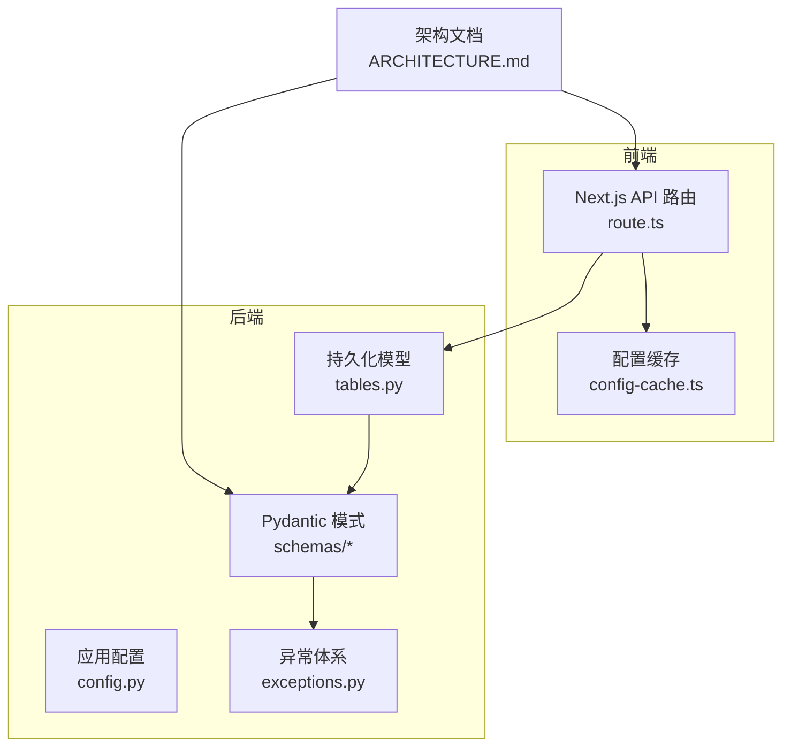
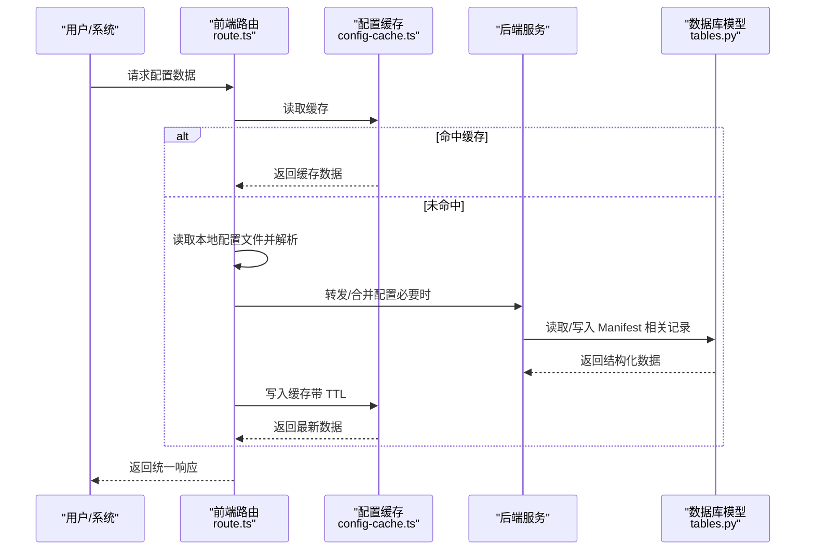
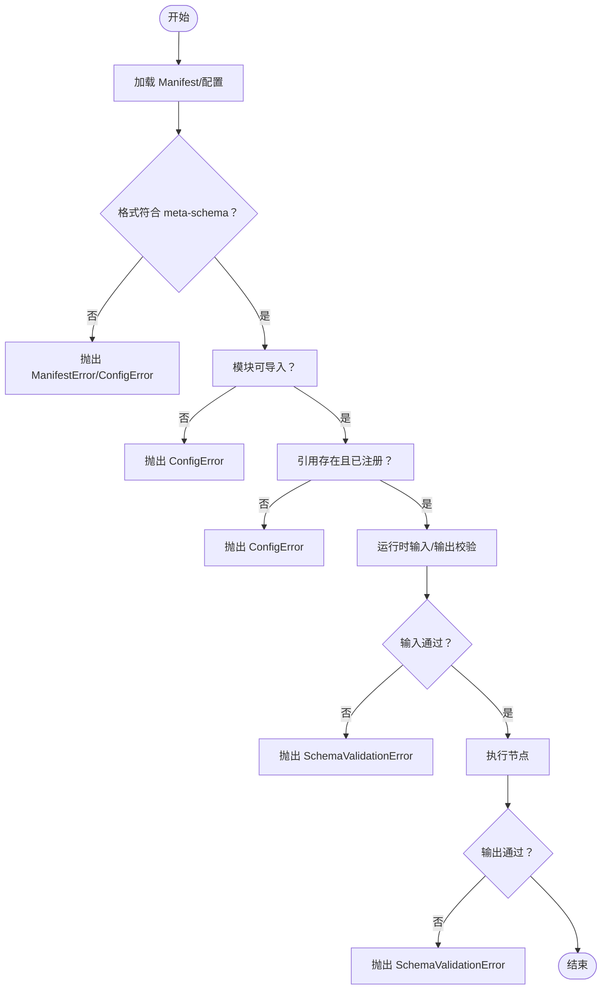
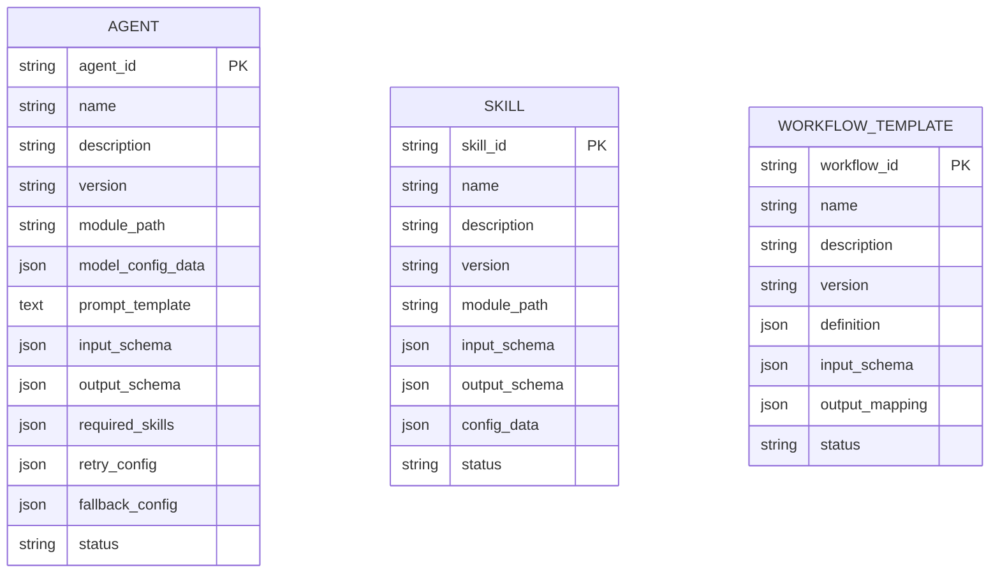
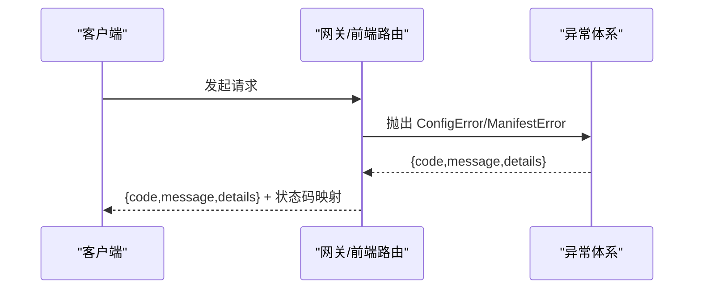
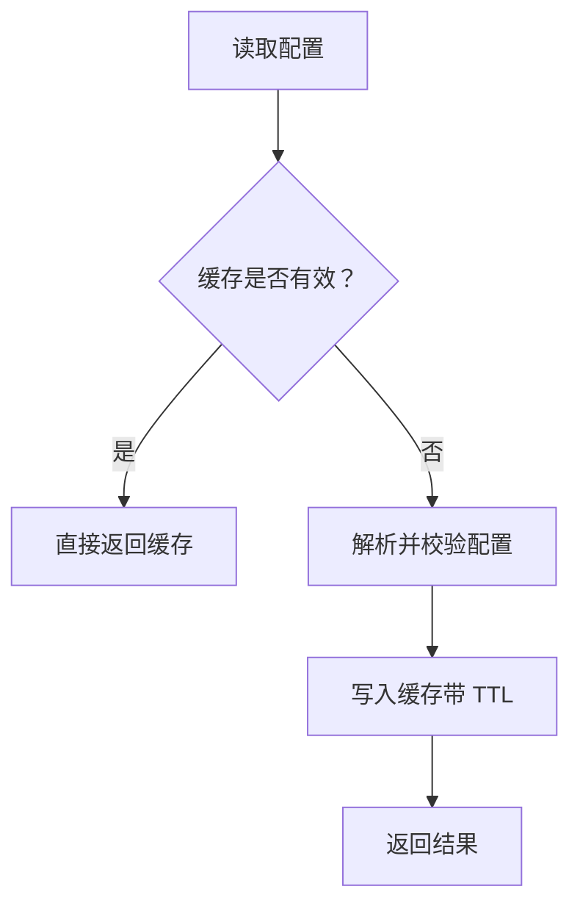
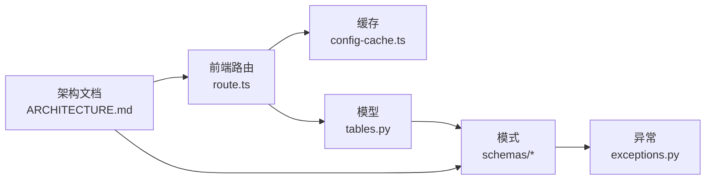

# 配置验证与模式

<cite>
**本文引用的文件**
- [config.py](file://backend/app/core/config.py)
- [exceptions.py](file://backend/app/core/exceptions.py)
- [tables.py](file://backend/app/models/tables.py)
- [route.ts](file://OpenClaw-bot-review-main/app/api/config/route.ts)
- [config-cache.ts](file://OpenClaw-bot-review-main/lib/config-cache.ts)
- [ARCHITECTURE.md](file://ARCHITECTURE.md)
- [agent.py](file://backend/app/schemas/agent.py)
- [skill.py](file://backend/app/schemas/skill.py)
- [task.py](file://backend/app/schemas/task.py)
- [common.py](file://backend/app/schemas/common.py)
- [route.ts](file://OpenClaw-bot-review-main/app/api/config/agent-model/route.ts)
</cite>

## 目录
1. [引言](#引言)
2. [项目结构](#项目结构)
3. [核心组件](#核心组件)
4. [架构总览](#架构总览)
5. [组件详解](#组件详解)
6. [依赖关系分析](#依赖关系分析)
7. [性能考量](#性能考量)
8. [故障排查指南](#故障排查指南)
9. [结论](#结论)
10. [附录](#附录)

## 引言
本文件聚焦于 HotClaw 的“配置验证与模式”体系，围绕 Manifest 配置的 JSON Schema 定义与验证机制展开，覆盖字段类型检查、必填项验证、范围约束、层级结构（根级/子级/嵌套）、错误报告与修复建议、自定义规则扩展、配置缓存与性能优化、单元测试与调试方法，以及版本演进与向后兼容保障。

## 项目结构
HotClaw 的配置验证涉及前后端多处协作：
- 后端 Python（FastAPI + Pydantic）负责系统级配置与运行时 Schema 校验
- 前端 Next.js 负责读取本地配置文件并进行轻量级结构化处理与缓存
- 文档 ARCHITECTURE.md 明确了 JSON Schema（draft-07）与校验时机

图表来源
- [route.ts:257-556](file://OpenClaw-bot-review-main/app/api/config/route.ts#L257-L556)
- [config-cache.ts:1-19](file://OpenClaw-bot-review-main/lib/config-cache.ts#L1-L19)
- [config.py:7-51](file://backend/app/core/config.py#L7-L51)
- [tables.py:160-217](file://backend/app/models/tables.py#L160-L217)
- [exceptions.py:103-115](file://backend/app/core/exceptions.py#L103-L115)
- [agent.py:6-28](file://backend/app/schemas/agent.py#L6-L28)
- [skill.py:6-21](file://backend/app/schemas/skill.py#L6-L21)
- [task.py:10-55](file://backend/app/schemas/task.py#L10-L55)
- [common.py:7-26](file://backend/app/schemas/common.py#L7-L26)
- [ARCHITECTURE.md:985-1005](file://ARCHITECTURE.md#L985-L1005)

章节来源
- [route.ts:257-556](file://OpenClaw-bot-review-main/app/api/config/route.ts#L257-L556)
- [config-cache.ts:1-19](file://OpenClaw-bot-review-main/lib/config-cache.ts#L1-L19)
- [config.py:7-51](file://backend/app/core/config.py#L7-L51)
- [tables.py:160-217](file://backend/app/models/tables.py#L160-L217)
- [exceptions.py:103-115](file://backend/app/core/exceptions.py#L103-L115)
- [agent.py:6-28](file://backend/app/schemas/agent.py#L6-L28)
- [skill.py:6-21](file://backend/app/schemas/skill.py#L6-L21)
- [task.py:10-55](file://backend/app/schemas/task.py#L10-L55)
- [common.py:7-26](file://backend/app/schemas/common.py#L7-L26)
- [ARCHITECTURE.md:985-1005](file://ARCHITECTURE.md#L985-L1005)

## 核心组件
- 应用配置（Python）：通过 Pydantic Settings 定义环境变量驱动的全局配置，确保数据库、Redis、LLM、应用参数等字段的类型与默认值一致性。
- 运行时 Schema（Python）：使用 Pydantic BaseModel 定义请求/响应与业务对象的结构，结合字段约束（如长度、非空）实现输入输出校验。
- 前端配置读取与缓存（TypeScript）：读取本地 JSON 配置，进行结构化处理与 TTL 缓存，减少 IO 并提升响应速度。
- 异常体系（Python）：统一的错误分类与编码，便于在配置与运行时校验失败时快速定位与反馈。
- 模型持久化（Python）：将 Agent/Skill/Workflow 的 Manifest 字段以 JSON 形式存储，便于后续校验与回放。

章节来源
- [config.py:7-51](file://backend/app/core/config.py#L7-L51)
- [agent.py:6-28](file://backend/app/schemas/agent.py#L6-L28)
- [skill.py:6-21](file://backend/app/schemas/skill.py#L6-L21)
- [task.py:10-55](file://backend/app/schemas/task.py#L10-L55)
- [common.py:7-26](file://backend/app/schemas/common.py#L7-L26)
- [route.ts:257-556](file://OpenClaw-bot-review-main/app/api/config/route.ts#L257-L556)
- [config-cache.ts:1-19](file://OpenClaw-bot-review-main/lib/config-cache.ts#L1-L19)
- [exceptions.py:103-115](file://backend/app/core/exceptions.py#L103-L115)
- [tables.py:160-217](file://backend/app/models/tables.py#L160-L217)

## 架构总览
配置验证贯穿“系统启动时”和“运行时”两个阶段：
- 系统启动时：校验 Manifest 格式、模块可导入性、全局唯一性、引用完整性等
- 运行时：每次执行前对输入进行 Schema 校验，执行后对输出进行 Schema 校验

图表来源
- [route.ts:257-556](file://OpenClaw-bot-review-main/app/api/config/route.ts#L257-L556)
- [config-cache.ts:1-19](file://OpenClaw-bot-review-main/lib/config-cache.ts#L1-L19)
- [tables.py:160-217](file://backend/app/models/tables.py#L160-L217)

章节来源
- [ARCHITECTURE.md:985-1005](file://ARCHITECTURE.md#L985-L1005)
- [route.ts:257-556](file://OpenClaw-bot-review-main/app/api/config/route.ts#L257-L556)
- [config-cache.ts:1-19](file://OpenClaw-bot-review-main/lib/config-cache.ts#L1-L19)
- [tables.py:160-217](file://backend/app/models/tables.py#L160-L217)

## 组件详解

### JSON Schema 定义与验证机制
- 定义位置：架构文档明确 Agent/Skill 的输入/输出使用 JSON Schema（draft-07）定义
- 验证时机：
  - 启动时：校验 Manifest 格式、模块可导入、全局唯一性、引用存在性
  - 运行时：执行前校验输入，执行后校验输出
- 错误处理：Schema 校验失败抛出 SchemaValidationError，交由 Orchestrator 降级处理

图表来源
- [ARCHITECTURE.md:985-1005](file://ARCHITECTURE.md#L985-L1005)
- [exceptions.py:103-115](file://backend/app/core/exceptions.py#L103-L115)

章节来源
- [ARCHITECTURE.md:985-1005](file://ARCHITECTURE.md#L985-L1005)
- [exceptions.py:103-115](file://backend/app/core/exceptions.py#L103-L115)

### 字段类型检查、必填项与范围约束
- 类型检查：通过 Pydantic 字段类型声明与 JSON Schema type 对齐，确保字符串、整数、数组、对象等类型一致
- 必填项：使用 Pydantic Field(..., ...) 或 JSON Schema required 指定必填属性
- 范围约束：使用 Pydantic Field 的 min_length/max_length、ge/le 等约束；或在 JSON Schema 中使用相应关键字
- 示例参考：任务创建请求中的 positioning 长度约束、默认 workflow_id 等

章节来源
- [task.py:10-22](file://backend/app/schemas/task.py#L10-L22)
- [agent.py:6-28](file://backend/app/schemas/agent.py#L6-L28)
- [skill.py:6-21](file://backend/app/schemas/skill.py#L6-L21)
- [common.py:7-26](file://backend/app/schemas/common.py#L7-L26)

### 配置模式的层次结构
- 根级模式：顶层配置对象（如 agents.defaults、channels、models.providers 等），定义全局默认与平台能力
- 子级模式：agents.list 中的单个 Agent、skills 中的单个 Skill、workflows 中的模板定义
- 嵌套模式：Agent 的 required_skills、Skill 的 input_schema/output_schema、Workflow 的 definition/input_schema/output_mapping 等
- 持久化映射：后端模型将上述结构以 JSON 字段保存，便于查询与审计

图表来源
- [tables.py:160-217](file://backend/app/models/tables.py#L160-L217)

章节来源
- [tables.py:160-217](file://backend/app/models/tables.py#L160-L217)

### 错误报告机制（定位、格式、修复建议）
- 错误分类：ConfigError（配置错误）、ManifestError（Manifest 格式错误）、SchemaValidationError（Schema 校验失败）等
- 错误码与消息：统一在异常类中定义，便于前端/网关映射到 HTTP 状态码
- 前端错误映射：根据错误消息关键词映射到 4xx/5xx 状态码，辅助快速定位（如“配置变更”、“缺失/无效/未找到/必须”等）

图表来源
- [exceptions.py:103-115](file://backend/app/core/exceptions.py#L103-L115)
- [route.ts:49-63](file://OpenClaw-bot-review-main/app/api/config/agent-model/route.ts#L49-L63)

章节来源
- [exceptions.py:103-115](file://backend/app/core/exceptions.py#L103-L115)
- [route.ts:49-63](file://OpenClaw-bot-review-main/app/api/config/agent-model/route.ts#L49-L63)

### 自定义验证规则与扩展机制
- 启动期扩展：在加载 Manifest 时增加自定义校验逻辑（如模块导入检查、全局唯一性检查、引用完整性检查）
- 运行期扩展：在执行前/后插入自定义 Pydantic 模式或 JSON Schema 校验器，捕获 SchemaValidationError 并按降级策略处理
- 建议实践：将自定义规则封装为独立函数，集中管理，便于测试与维护

章节来源
- [ARCHITECTURE.md:993-1004](file://ARCHITECTURE.md#L993-L1004)
- [exceptions.py:103-115](file://backend/app/core/exceptions.py#L103-L115)

### 配置缓存策略与性能优化
- 前端缓存：读取本地配置后设置 TTL（毫秒级），短期内命中缓存，降低磁盘 IO 与解析开销
- 后端配合：在需要时将经校验的结构化数据写回缓存（视具体场景），避免重复解析
- 性能建议：对大型配置文件采用增量更新策略；对频繁访问的字段建立索引；限制并发读取

图表来源
- [route.ts:257-262](file://OpenClaw-bot-review-main/app/api/config/route.ts#L257-L262)
- [config-cache.ts:1-19](file://OpenClaw-bot-review-main/lib/config-cache.ts#L1-L19)

章节来源
- [route.ts:257-262](file://OpenClaw-bot-review-main/app/api/config/route.ts#L257-L262)
- [config-cache.ts:1-19](file://OpenClaw-bot-review-main/lib/config-cache.ts#L1-L19)

### 单元测试方法与调试工具
- 单元测试：
  - 启动期校验：构造非法/缺失字段的 Manifest，断言抛出 ConfigError/ManifestError
  - 运行期校验：构造不符合 input_schema/output_schema 的输入/输出，断言抛出 SchemaValidationError
  - 缓存行为：断言 TTL 过期后重新解析，未过期时命中缓存
- 调试工具：
  - 前端：打印配置对象与缓存状态，检查错误映射
  - 后端：开启详细日志，捕获异常并输出 details 字段，便于定位

章节来源
- [exceptions.py:103-115](file://backend/app/core/exceptions.py#L103-L115)
- [route.ts:257-556](file://OpenClaw-bot-review-main/app/api/config/route.ts#L257-L556)
- [config-cache.ts:1-19](file://OpenClaw-bot-review-main/lib/config-cache.ts#L1-L19)

### 版本演进与向后兼容
- 版本字段：Agent/Skill/Workflow 均具备 version 字段，便于追踪与回滚
- 向后兼容：在新增字段时保持默认值与可选性，避免破坏既有配置；对废弃字段提供迁移指引
- 演进策略：遵循语义化版本，重大变更提供迁移脚本与兼容开关

章节来源
- [tables.py:167-170](file://backend/app/models/tables.py#L167-L170)
- [tables.py:190-194](file://backend/app/models/tables.py#L190-L194)
- [tables.py:209-212](file://backend/app/models/tables.py#L209-L212)

## 依赖关系分析
- 前端配置 API 依赖本地配置文件与缓存模块
- 后端模型依赖 Pydantic 模式与异常体系
- 架构文档为前后端提供统一的 Schema 与校验规范

图表来源
- [route.ts:257-556](file://OpenClaw-bot-review-main/app/api/config/route.ts#L257-L556)
- [config-cache.ts:1-19](file://OpenClaw-bot-review-main/lib/config-cache.ts#L1-L19)
- [tables.py:160-217](file://backend/app/models/tables.py#L160-L217)
- [agent.py:6-28](file://backend/app/schemas/agent.py#L6-L28)
- [skill.py:6-21](file://backend/app/schemas/skill.py#L6-L21)
- [task.py:10-55](file://backend/app/schemas/task.py#L10-L55)
- [common.py:7-26](file://backend/app/schemas/common.py#L7-L26)
- [exceptions.py:103-115](file://backend/app/core/exceptions.py#L103-L115)
- [ARCHITECTURE.md:985-1005](file://ARCHITECTURE.md#L985-L1005)

章节来源
- [route.ts:257-556](file://OpenClaw-bot-review-main/app/api/config/route.ts#L257-L556)
- [config-cache.ts:1-19](file://OpenClaw-bot-review-main/lib/config-cache.ts#L1-L19)
- [tables.py:160-217](file://backend/app/models/tables.py#L160-L217)
- [agent.py:6-28](file://backend/app/schemas/agent.py#L6-L28)
- [skill.py:6-21](file://backend/app/schemas/skill.py#L6-L21)
- [task.py:10-55](file://backend/app/schemas/task.py#L10-L55)
- [common.py:7-26](file://backend/app/schemas/common.py#L7-L26)
- [exceptions.py:103-115](file://backend/app/core/exceptions.py#L103-L115)
- [ARCHITECTURE.md:985-1005](file://ARCHITECTURE.md#L985-L1005)

## 性能考量
- 减少 IO：前端配置读取采用缓存与 TTL，避免频繁磁盘访问
- 结构化处理：对配置进行一次解析与归一化，后续仅做内存访问
- 并发控制：对高并发场景限制解析频率，必要时引入队列或锁
- 数据库访问：将 JSON 字段拆分为必要字段，减少全量 JSON 解析成本

## 故障排查指南
- 启动期错误：检查 Manifest 格式与模块路径，确认全局唯一性与引用完整性
- 运行期错误：核对 input_schema/output_schema，修正输入/输出结构
- 前端错误映射：依据错误消息关键词判断 4xx/5xx 状态码，定位问题来源
- 日志与异常：开启详细日志，收集 details 字段，辅助复现与修复

章节来源
- [exceptions.py:103-115](file://backend/app/core/exceptions.py#L103-L115)
- [route.ts:49-63](file://OpenClaw-bot-review-main/app/api/config/agent-model/route.ts#L49-L63)

## 结论
HotClaw 的配置验证体系以“架构文档约定 + 启动期校验 + 运行期校验 + 统一异常处理 + 前端缓存”为核心，既保证了配置的正确性与一致性，又兼顾了性能与可维护性。通过版本化与向后兼容策略，系统可在演进过程中平滑过渡。

## 附录
- 关键实现参考路径：
  - 启动期校验与异常定义：[exceptions.py:103-115](file://backend/app/core/exceptions.py#L103-L115)
  - 运行期 Schema 校验规范：[ARCHITECTURE.md:985-1005](file://ARCHITECTURE.md#L985-L1005)
  - 前端配置读取与缓存：[route.ts:257-556](file://OpenClaw-bot-review-main/app/api/config/route.ts#L257-L556)、[config-cache.ts:1-19](file://OpenClaw-bot-review-main/lib/config-cache.ts#L1-L19)
  - 模型持久化与字段定义：[tables.py:160-217](file://backend/app/models/tables.py#L160-L217)
  - Pydantic 模式示例：[agent.py:6-28](file://backend/app/schemas/agent.py#L6-L28)、[skill.py:6-21](file://backend/app/schemas/skill.py#L6-L21)、[task.py:10-55](file://backend/app/schemas/task.py#L10-L55)、[common.py:7-26](file://backend/app/schemas/common.py#L7-L26)