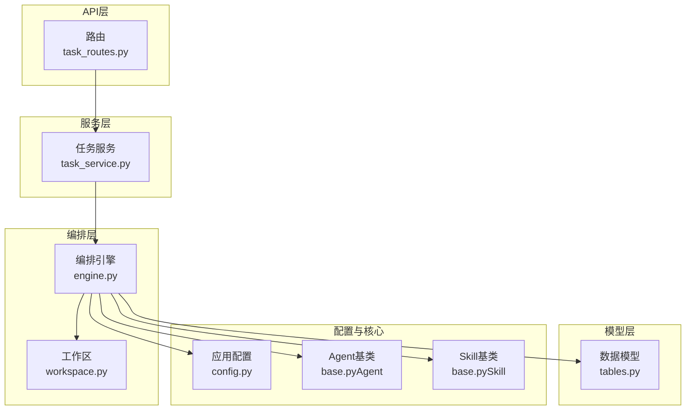
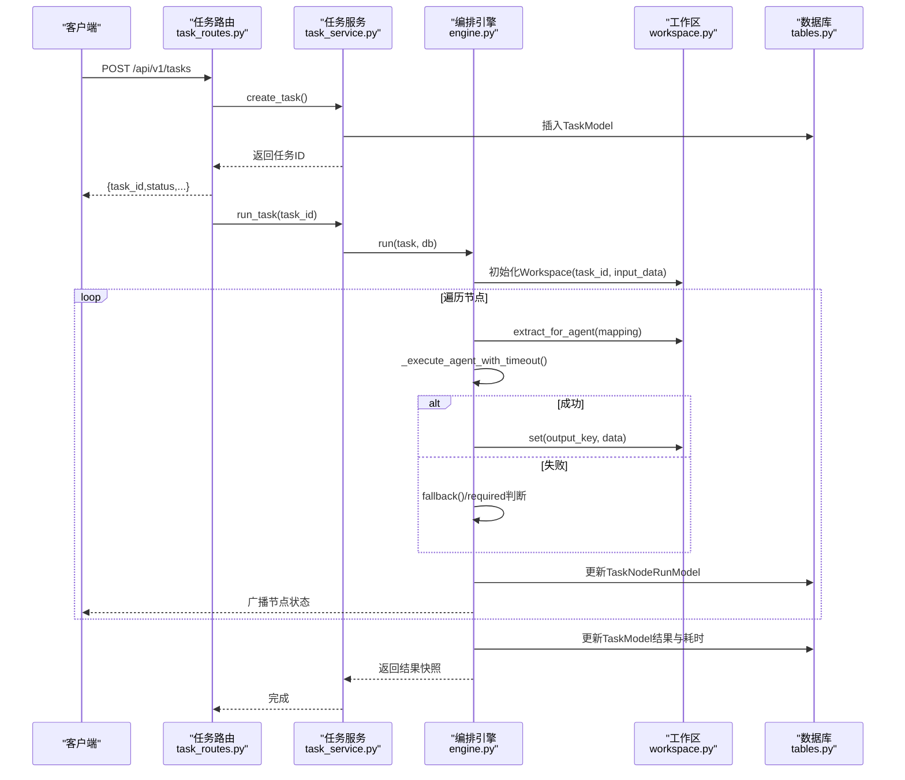
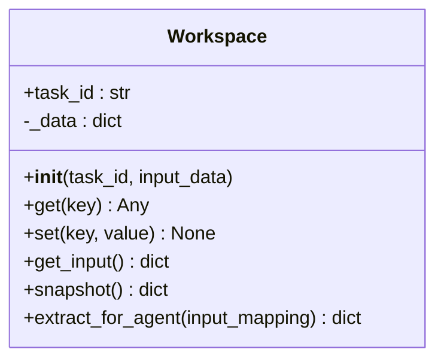
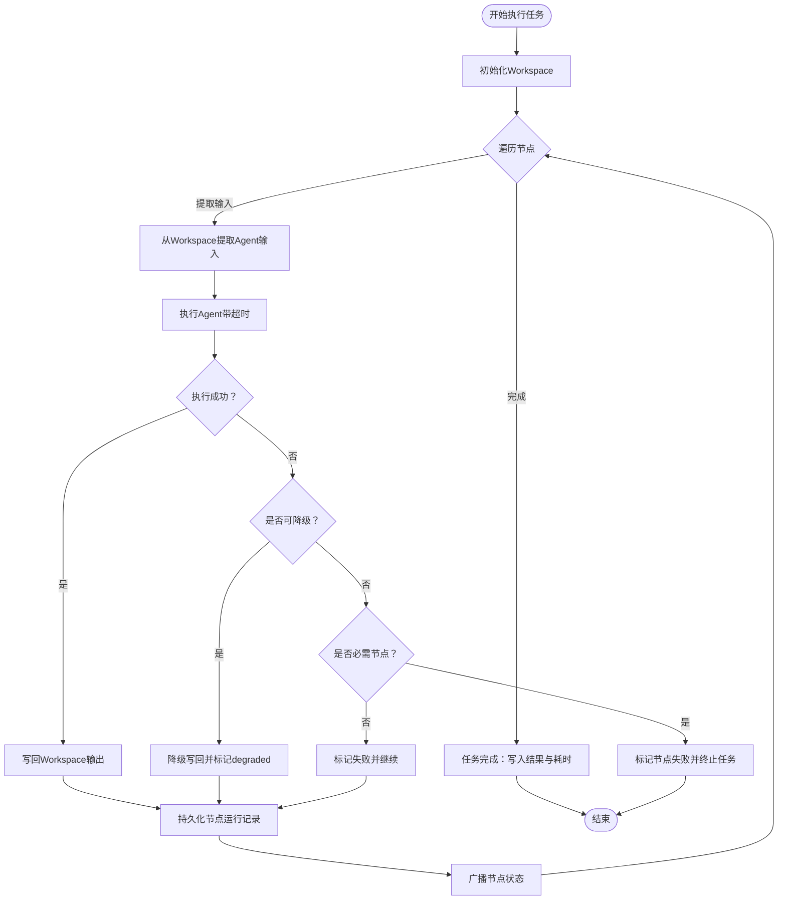
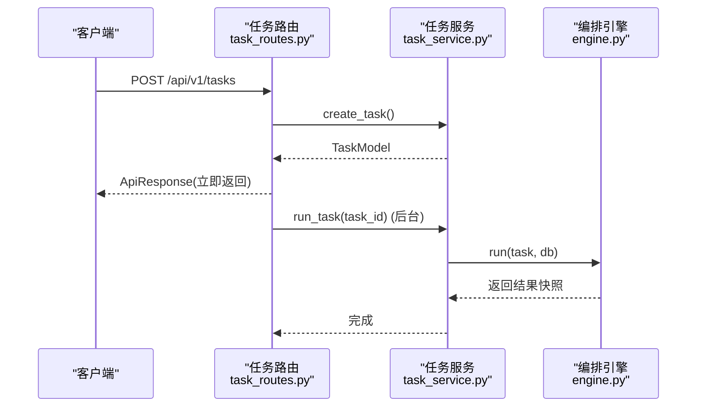
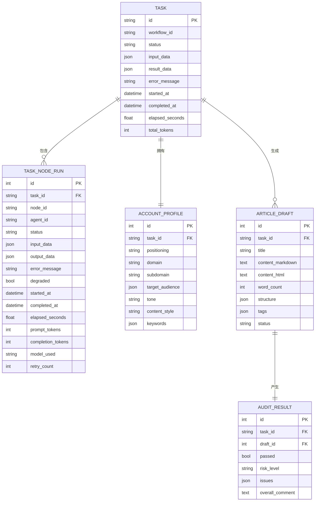
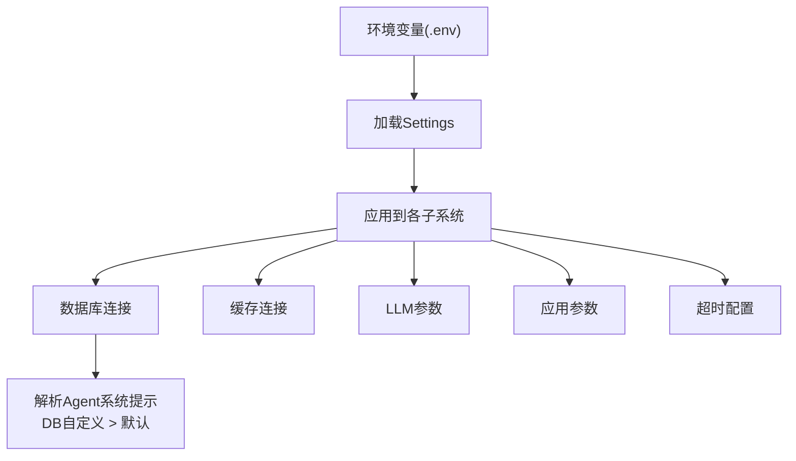
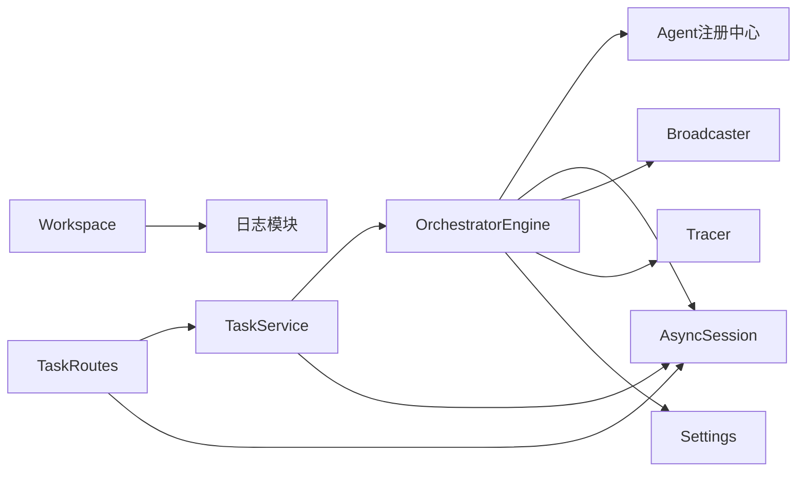

# Workspace配置

<cite>
**本文引用的文件**
- [workspace.py](file://backend/app/orchestrator/workspace.py)
- [engine.py](file://backend/app/orchestrator/engine.py)
- [config.py](file://backend/app/core/config.py)
- [task_routes.py](file://backend/app/api/task_routes.py)
- [task_service.py](file://backend/app/services/task_service.py)
- [tables.py](file://backend/app/models/tables.py)
- [task.py](file://backend/app/schemas/task.py)
- [base.py（Agent基类）](file://backend/app/agents/base.py)
- [base.py（Skill基类）](file://backend/app/skills/base.py)
- [test_workspace.py](file://backend/tests/test_workspace.py)
- [ARCHITECTURE.md](file://ARCHITECTURE.md)
</cite>

## 目录
1. [简介](#简介)
2. [项目结构](#项目结构)
3. [核心组件](#核心组件)
4. [架构总览](#架构总览)
5. [详细组件分析](#详细组件分析)
6. [依赖分析](#依赖分析)
7. [性能考量](#性能考量)
8. [故障排查指南](#故障排查指南)
9. [结论](#结论)
10. [附录](#附录)

## 简介
本技术文档围绕HotClaw的Workspace配置系统展开，系统性阐述Workspace的概念、作用与生命周期，以及其在任务执行中的上下文隔离、配置继承与作用域管理。文档还深入说明了配置层级（全局配置、工作区配置、任务特定配置）的优先级关系，覆盖Workspace的创建、更新与销毁流程，解释其与智能体（Agent）、技能（Skill）及工作流（Workflow）的配置关联机制，并提供最佳实践与调试排障方法。

## 项目结构
HotClaw后端采用分层架构：API网关（FastAPI）负责路由与参数校验；服务层（TaskService）管理任务生命周期；编排器（OrchestratorEngine）加载工作流、调度Agent、管理Workspace；模型层（SQLAlchemy）持久化任务与节点运行记录；核心模块提供日志、异常与追踪工具；配置通过环境变量加载。

图表来源
- [task_routes.py:1-163](file://backend/app/api/task_routes.py#L1-L163)
- [task_service.py:1-126](file://backend/app/services/task_service.py#L1-L126)
- [engine.py:1-285](file://backend/app/orchestrator/engine.py#L1-L285)
- [workspace.py:1-53](file://backend/app/orchestrator/workspace.py#L1-L53)
- [tables.py:1-233](file://backend/app/models/tables.py#L1-L233)
- [config.py:1-51](file://backend/app/core/config.py#L1-L51)
- [base.py（Agent基类）:1-99](file://backend/app/agents/base.py#L1-L99)
- [base.py（Skill基类）:1-37](file://backend/app/skills/base.py#L1-L37)

章节来源
- [ARCHITECTURE.md:414-448](file://ARCHITECTURE.md#L414-L448)

## 核心组件
- Workspace：任务级上下文容器，保存输入、中间状态与各Agent输出，支持提取映射、快照与日志记录。
- OrchestratorEngine：加载工作流、按序调度Agent、管理Workspace、广播节点状态、处理异常与降级。
- TaskService：任务生命周期管理（创建、运行、查询、分页），协调编排器与数据库。
- 数据模型：TaskModel、TaskNodeRunModel等，持久化任务与节点运行记录。
- 配置系统：Settings从环境变量加载数据库、Redis、LLM、应用与超时等配置。
- Agent/Skill基类：定义统一的输入输出、执行协议与降级策略。

章节来源
- [workspace.py:12-53](file://backend/app/orchestrator/workspace.py#L12-L53)
- [engine.py:89-285](file://backend/app/orchestrator/engine.py#L89-L285)
- [task_service.py:20-126](file://backend/app/services/task_service.py#L20-L126)
- [tables.py:23-233](file://backend/app/models/tables.py#L23-L233)
- [config.py:7-51](file://backend/app/core/config.py#L7-L51)
- [base.py（Agent基类）:49-99](file://backend/app/agents/base.py#L49-L99)
- [base.py（Skill基类）:16-37](file://backend/app/skills/base.py#L16-L37)

## 架构总览
Workspace贯穿任务执行的全生命周期：创建时注入初始输入；执行过程中按节点映射提取所需数据；最终以快照形式汇总为任务结果。编排器在每个节点执行前后维护节点运行记录、计算耗时与Token消耗，并通过广播通道向前端推送状态。

图表来源
- [task_routes.py:19-51](file://backend/app/api/task_routes.py#L19-L51)
- [task_service.py:39-64](file://backend/app/services/task_service.py#L39-L64)
- [engine.py:92-234](file://backend/app/orchestrator/engine.py#L92-L234)
- [workspace.py:15-53](file://backend/app/orchestrator/workspace.py#L15-L53)
- [tables.py:23-73](file://backend/app/models/tables.py#L23-L73)

## 详细组件分析

### Workspace组件分析
Workspace是任务级上下文容器，提供键值存取、输入读取、快照导出与按映射提取的能力。其设计强调“任务作用域内的数据共享”，避免跨任务污染，同时通过日志记录set操作便于审计。

图表来源
- [workspace.py:12-53](file://backend/app/orchestrator/workspace.py#L12-L53)

章节来源
- [workspace.py:15-53](file://backend/app/orchestrator/workspace.py#L15-L53)
- [test_workspace.py:7-41](file://backend/tests/test_workspace.py#L7-L41)

### 编排引擎与工作流执行
编排引擎负责加载默认线性工作流节点，逐节点提取Agent输入、执行Agent、写回Workspace、持久化节点运行记录并广播状态。它还负责解析Agent系统提示（数据库自定义优先于默认），并在超时或异常时进行降级处理。

图表来源
- [engine.py:92-234](file://backend/app/orchestrator/engine.py#L92-L234)
- [engine.py:236-281](file://backend/app/orchestrator/engine.py#L236-L281)

章节来源
- [engine.py:31-86](file://backend/app/orchestrator/engine.py#L31-L86)
- [engine.py:92-234](file://backend/app/orchestrator/engine.py#L92-L234)

### 任务服务与API路由
任务服务负责创建任务、启动后台执行、查询任务与节点记录；API路由负责接收请求、返回即时响应并触发后台执行。二者配合确保HTTP接口快速返回，实际执行在后台异步进行。

图表来源
- [task_routes.py:19-51](file://backend/app/api/task_routes.py#L19-L51)
- [task_service.py:22-64](file://backend/app/services/task_service.py#L22-L64)
- [engine.py:92-234](file://backend/app/orchestrator/engine.py#L92-L234)

章节来源
- [task_routes.py:19-163](file://backend/app/api/task_routes.py#L19-L163)
- [task_service.py:20-126](file://backend/app/services/task_service.py#L20-L126)

### 数据模型与持久化
数据模型定义了任务、节点运行、账号画像、话题候选、文章草稿与审计结果等实体，支持任务全生命周期的结构化记录与回放。节点运行记录包含输入输出、耗时、Token消耗、错误信息等，便于审计与问题定位。

图表来源
- [tables.py:23-233](file://backend/app/models/tables.py#L23-L233)

章节来源
- [tables.py:23-233](file://backend/app/models/tables.py#L23-L233)

### 配置系统与优先级
配置系统通过Settings从环境变量加载，涵盖数据库连接、Redis、LLM参数、应用运行参数与各类超时设置。在Agent层面，系统支持“数据库自定义提示模板优先于默认提示”的解析逻辑，体现配置优先于代码的设计理念。

图表来源
- [config.py:7-51](file://backend/app/core/config.py#L7-L51)
- [engine.py:245-263](file://backend/app/orchestrator/engine.py#L245-L263)

章节来源
- [config.py:7-51](file://backend/app/core/config.py#L7-L51)
- [engine.py:245-263](file://backend/app/orchestrator/engine.py#L245-L263)

### 与智能体、技能和工作流的配置关联
- Workspace与Agent：Agent通过extract_for_agent按映射从Workspace读取输入，执行后将结构化输出写回Workspace；系统在执行上下文中注入“有效系统提示”（来自数据库或默认）。
- Workspace与Skill：Skill为无状态原子能力，不直接参与编排；Agent在执行过程中调用Skill，Skill的配置通常在Skill基类中以config字段承载，与Workspace解耦。
- Workspace与工作流：工作流定义节点顺序与映射关系，编排器按节点顺序推进，每个节点的输入/输出均通过Workspace传递。

章节来源
- [engine.py:134-150](file://backend/app/orchestrator/engine.py#L134-L150)
- [base.py（Agent基类）:60-62](file://backend/app/agents/base.py#L60-L62)
- [base.py（Skill基类）:23-24](file://backend/app/skills/base.py#L23-L24)

## 依赖分析
- Workspace依赖日志模块进行set操作记录，不依赖其他模块。
- 编排引擎依赖Agent注册中心、数据库会话、广播器、Tracer与配置系统；通过Workspace管理任务上下文。
- 任务服务依赖编排引擎与数据库，负责任务生命周期与异常处理。
- API路由依赖任务服务与数据库会话，负责请求处理与后台任务调度。

图表来源
- [workspace.py:6-9](file://backend/app/orchestrator/workspace.py#L6-L9)
- [engine.py:18-26](file://backend/app/orchestrator/engine.py#L18-L26)
- [task_service.py:10-15](file://backend/app/services/task_service.py#L10-L15)
- [task_routes.py:7-14](file://backend/app/api/task_routes.py#L7-L14)

章节来源
- [workspace.py:6-9](file://backend/app/orchestrator/workspace.py#L6-L9)
- [engine.py:18-26](file://backend/app/orchestrator/engine.py#L18-L26)
- [task_service.py:10-15](file://backend/app/services/task_service.py#L10-L15)
- [task_routes.py:7-14](file://backend/app/api/task_routes.py#L7-L14)

## 性能考量
- 异步执行与超时控制：编排引擎对Agent执行设置超时，避免阻塞；节点完成后计算耗时与Token消耗，便于性能分析。
- 数据持久化：节点运行记录包含输入输出、耗时、Token与错误信息，支持回放与优化迭代。
- 广播与事件：通过SSE广播节点状态，前端可实时渲染，减少轮询开销。
- 配置优先级：数据库自定义提示模板优先于默认，可在不修改代码的情况下优化Agent行为。

章节来源
- [engine.py:236-243](file://backend/app/orchestrator/engine.py#L236-L243)
- [engine.py:265-271](file://backend/app/orchestrator/engine.py#L265-L271)
- [engine.py:245-263](file://backend/app/orchestrator/engine.py#L245-L263)

## 故障排查指南
- 任务状态查询：通过API查询任务状态与节点进度，结合节点运行记录定位失败节点。
- 日志与追踪：编排引擎与Workspace均使用结构化日志，记录set操作与提示解析来源；可通过trace_id关联事件。
- 节点失败处理：编排引擎在节点失败时尝试降级，若不可降级且节点必需，则终止任务并广播错误；可检查Agent的fallback实现与配置。
- 配置校验：Agent系统提示模板解析优先级与LLM超时配置影响执行稳定性，建议通过数据库自定义模板进行快速修复。

章节来源
- [task_routes.py:54-107](file://backend/app/api/task_routes.py#L54-L107)
- [engine.py:164-196](file://backend/app/orchestrator/engine.py#L164-L196)
- [engine.py:252-263](file://backend/app/orchestrator/engine.py#L252-L263)
- [workspace.py:26](file://backend/app/orchestrator/workspace.py#L26)

## 结论
Workspace作为任务级上下文容器，实现了严格的上下文隔离与高效的数据共享；编排引擎通过明确的节点映射与降级策略保障执行稳定性；配置系统以环境变量与数据库自定义提示模板为核心，体现了“配置优先于代码”的设计原则。结合结构化的数据模型与SSE广播，系统具备良好的可观测性与可维护性。

## 附录
- 最佳实践
  - 使用输入映射精确声明Agent输入，避免跨节点耦合。
  - 在数据库中维护Agent系统提示模板，优先于默认模板，便于快速调整。
  - 为关键节点提供降级策略，保证非必需节点失败不影响整体流程。
  - 通过节点运行记录与Token统计持续优化Agent与Skill性能。
- 调试工具
  - 任务状态与节点记录查询接口，辅助定位执行瓶颈与错误节点。
  - 结构化日志与trace_id，串联请求到节点执行的完整链路。
  - Workspace快照导出，支持离线分析与回放。