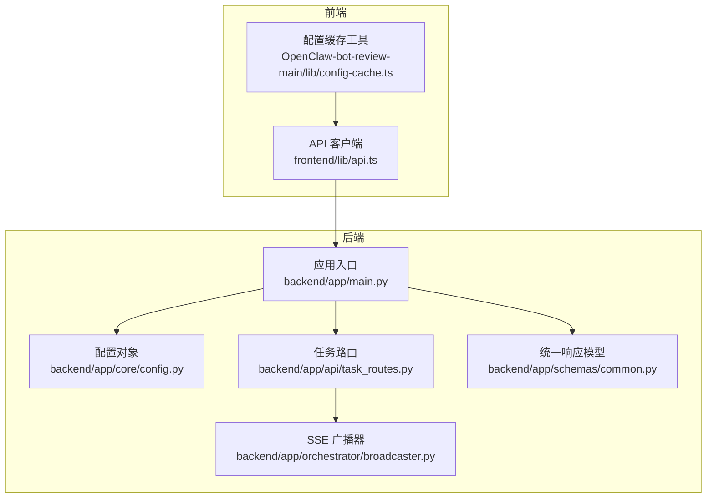
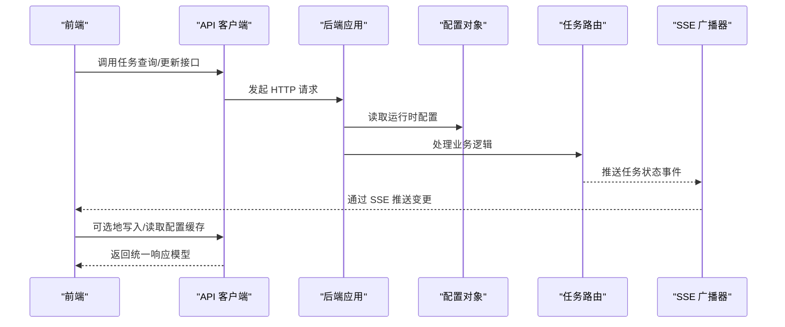
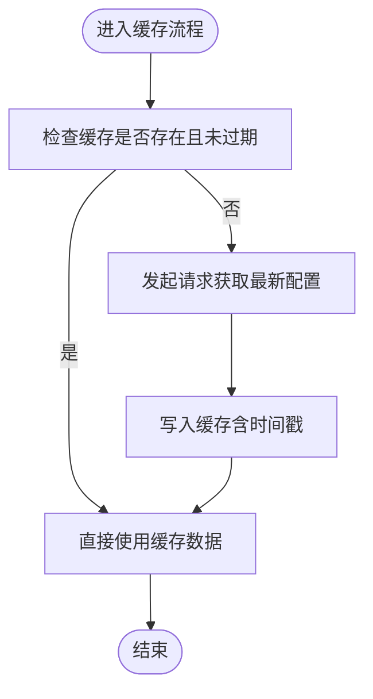
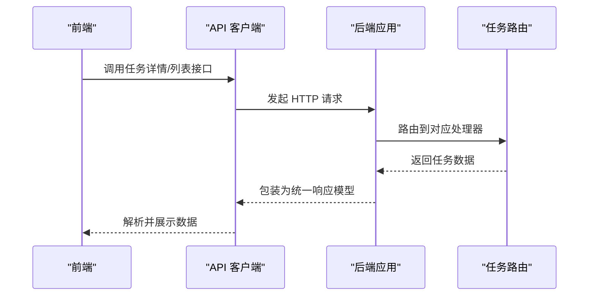
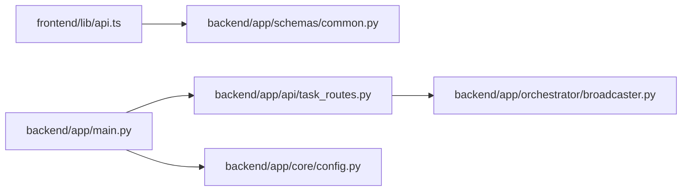

# 动态配置

<cite>
**本文引用的文件**
- [config.py](file://backend/app/core/config.py)
- [config-cache.ts](file://OpenClaw-bot-review-main/lib/config-cache.ts)
- [api.ts](file://frontend/lib/api.ts)
- [main.py](file://backend/app/main.py)
- [task_routes.py](file://backend/app/api/task_routes.py)
- [common.py](file://backend/app/schemas/common.py)
- [broadcaster.py](file://backend/app/orchestrator/broadcaster.py)
</cite>

## 目录
1. [简介](#简介)
2. [项目结构](#项目结构)
3. [核心组件](#核心组件)
4. [架构总览](#架构总览)
5. [详细组件分析](#详细组件分析)
6. [依赖分析](#依赖分析)
7. [性能考虑](#性能考虑)
8. [故障排查指南](#故障排查指南)
9. [结论](#结论)
10. [附录](#附录)

## 简介
本技术文档围绕 HotClaw 动态配置系统进行深入解析，重点覆盖以下方面：
- 配置缓存机制：缓存策略、失效时间与更新触发条件
- 动态配置加载与热更新：变更检测、增量更新与全量刷新
- 配置验证与回滚策略：安全与可靠性的保障
- 配置同步机制：多实例间的一致性保证
- 动态配置 API 使用指南：查询、更新与监控接口
- 变更影响分析与回滚操作指南

在当前代码库中，后端通过环境变量驱动的配置对象提供全局设置；前端提供基础的配置缓存工具；任务执行与状态流通过 SSE 广播器实现近实时的变更通知；API 层统一响应模型与错误处理。

## 项目结构
HotClaw 的动态配置相关能力主要分布在以下模块：
- 后端配置：基于 Pydantic Settings 的环境变量配置对象
- 前端缓存：轻量级内存缓存工具（用于前端页面或组件的配置缓存）
- API 层：统一响应模型与错误处理，以及任务相关接口
- 事件广播：SSE 广播器用于任务状态变更的推送
- 应用入口：FastAPI 应用注册中间件、异常处理器与路由

**图表来源**
- [config.py:1-51](file://backend/app/core/config.py#L1-L51)
- [main.py:1-142](file://backend/app/main.py#L1-L142)
- [task_routes.py:1-163](file://backend/app/api/task_routes.py#L1-L163)
- [common.py:1-27](file://backend/app/schemas/common.py#L1-L27)
- [broadcaster.py:1-94](file://backend/app/orchestrator/broadcaster.py#L1-L94)
- [config-cache.ts:1-19](file://OpenClaw-bot-review-main/lib/config-cache.ts#L1-L19)
- [api.ts:1-110](file://frontend/lib/api.ts#L1-L110)

**章节来源**
- [config.py:1-51](file://backend/app/core/config.py#L1-L51)
- [main.py:1-142](file://backend/app/main.py#L1-L142)
- [task_routes.py:1-163](file://backend/app/api/task_routes.py#L1-L163)
- [common.py:1-27](file://backend/app/schemas/common.py#L1-L27)
- [broadcaster.py:1-94](file://backend/app/orchestrator/broadcaster.py#L1-L94)
- [config-cache.ts:1-19](file://OpenClaw-bot-review-main/lib/config-cache.ts#L1-L19)
- [api.ts:1-110](file://frontend/lib/api.ts#L1-L110)

## 核心组件
- 配置对象（后端）：从环境变量加载的 Settings 对象，包含数据库、Redis、LLM、应用与日志等配置项，并指定 .env 文件路径与编码。
- 配置缓存工具（前端）：提供内存中的单例缓存条目，包含数据与时间戳字段，支持读取、写入与清空。
- 统一响应模型：所有 API 返回统一包装格式，便于前端解析与错误处理。
- SSE 广播器：维护每个任务的订阅队列与历史消息缓冲，支持事件重放与流结束信号。
- API 客户端：封装后端接口调用，统一错误抛出逻辑，便于前端集成。

**章节来源**
- [config.py:7-51](file://backend/app/core/config.py#L7-L51)
- [config-cache.ts:1-19](file://OpenClaw-bot-review-main/lib/config-cache.ts#L1-L19)
- [common.py:7-27](file://backend/app/schemas/common.py#L7-L27)
- [broadcaster.py:11-94](file://backend/app/orchestrator/broadcaster.py#L11-L94)
- [api.ts:14-24](file://frontend/lib/api.ts#L14-L24)

## 架构总览
动态配置系统在当前代码库中的交互流程如下：
- 后端启动时加载环境变量配置，供业务模块使用
- 前端通过 API 客户端访问后端接口，获取任务状态与配置信息
- 任务执行过程中，SSE 广播器将状态变更推送给前端订阅者
- 前端可选择使用配置缓存工具对配置进行本地缓存，以减少重复请求

**图表来源**
- [main.py:42-58](file://backend/app/main.py#L42-L58)
- [config.py:7-51](file://backend/app/core/config.py#L7-L51)
- [task_routes.py:19-51](file://backend/app/api/task_routes.py#L19-L51)
- [broadcaster.py:57-68](file://backend/app/orchestrator/broadcaster.py#L57-L68)
- [api.ts:14-24](file://frontend/lib/api.ts#L14-L24)

## 详细组件分析

### 配置缓存机制
- 缓存策略
  - 前端缓存采用内存单例模式，保存最近一次配置与时间戳，便于快速读取与避免频繁网络请求。
  - 缓存条目包含数据与时间戳字段，前端可据此判断是否需要刷新。
- 失效时间
  - 当前实现未内置 TTL 或过期检查逻辑，需由上层业务在调用侧决定刷新时机。
- 更新触发条件
  - 建议在配置变更后主动调用清空或写入函数，或在定时轮询中比较时间戳以触发刷新。

**图表来源**
- [config-cache.ts:8-18](file://OpenClaw-bot-review-main/lib/config-cache.ts#L8-L18)

**章节来源**
- [config-cache.ts:1-19](file://OpenClaw-bot-review-main/lib/config-cache.ts#L1-L19)

### 动态配置加载与热更新
- 加载方式
  - 后端通过 Settings 对象从 .env 文件加载配置，适用于启动时一次性加载。
- 变更检测
  - 当前未见自动检测配置文件变化的机制，建议在生产环境中结合外部配置中心或文件监控方案。
- 增量更新与全量刷新
  - 建议在变更发生时，优先进行增量更新（仅更新受影响的子系统），并在必要时触发全量刷新以确保一致性。
- 触发策略
  - 可通过管理端接口下发配置变更指令，后端按需重新加载或广播变更。

**章节来源**
- [config.py:47-51](file://backend/app/core/config.py#L47-L51)

### 配置验证与回滚策略
- 验证
  - 建议在接收配置更新请求时进行参数校验与默认值填充，确保类型与范围合法。
- 回滚
  - 建议保留上一个有效配置版本，在新配置生效失败时自动回退至上一版本。
- 安全性
  - 对敏感配置（如密钥）进行加密存储与最小权限访问控制。

[本节为通用实践指导，不直接分析具体文件]

### 配置同步机制
- 多实例一致性
  - 建议将配置集中存储于共享存储（如数据库或配置中心），各实例定期拉取或订阅变更。
- 事件驱动
  - 可参考 SSE 广播器的设计思想，对配置变更事件进行广播，确保各实例及时感知。

**章节来源**
- [broadcaster.py:11-94](file://backend/app/orchestrator/broadcaster.py#L11-L94)

### 动态配置 API 使用指南
- 查询接口
  - 通过 API 客户端封装的请求方法访问后端接口，统一处理响应与错误。
- 更新接口
  - 提供代理与技能配置更新方法，支持传入目标配置对象。
- 监控接口
  - 通过任务状态查询接口与 SSE 流，监控任务执行过程中的配置相关事件。

**图表来源**
- [api.ts:14-24](file://frontend/lib/api.ts#L14-L24)
- [task_routes.py:90-107](file://backend/app/api/task_routes.py#L90-L107)
- [common.py:7-12](file://backend/app/schemas/common.py#L7-L12)

**章节来源**
- [api.ts:26-109](file://frontend/lib/api.ts#L26-L109)
- [task_routes.py:19-163](file://backend/app/api/task_routes.py#L19-L163)
- [common.py:7-27](file://backend/app/schemas/common.py#L7-L27)

## 依赖分析
- 组件耦合
  - API 客户端依赖统一响应模型与后端路由
  - 应用入口负责注册中间件、异常处理器与路由
  - SSE 广播器独立于业务路由，仅在任务状态变更时被调用
- 外部依赖
  - 后端配置依赖 .env 文件与环境变量
  - 任务路由依赖数据库会话与服务层

**图表来源**
- [api.ts:1-110](file://frontend/lib/api.ts#L1-L110)
- [common.py:1-27](file://backend/app/schemas/common.py#L1-L27)
- [main.py:132-137](file://backend/app/main.py#L132-L137)
- [task_routes.py:1-16](file://backend/app/api/task_routes.py#L1-L16)
- [broadcaster.py:1-94](file://backend/app/orchestrator/broadcaster.py#L1-L94)
- [config.py:1-51](file://backend/app/core/config.py#L1-L51)

**章节来源**
- [main.py:132-137](file://backend/app/main.py#L132-L137)
- [task_routes.py:1-16](file://backend/app/api/task_routes.py#L1-L16)
- [broadcaster.py:1-94](file://backend/app/orchestrator/broadcaster.py#L1-L94)
- [common.py:1-27](file://backend/app/schemas/common.py#L1-L27)
- [api.ts:1-110](file://frontend/lib/api.ts#L1-L110)
- [config.py:1-51](file://backend/app/core/config.py#L1-L51)

## 性能考虑
- 缓存命中率
  - 在高频查询场景下，合理设置前端缓存的过期策略与刷新阈值，避免频繁网络请求。
- 广播效率
  - SSE 广播器已内置历史事件缓冲与清理机制，注意控制历史长度与清理周期，防止内存占用过高。
- 数据库与配置中心
  - 将配置集中化存储，减少对 .env 文件的依赖，提升部署灵活性与性能。

[本节提供一般性建议，不直接分析具体文件]

## 故障排查指南
- 统一响应模型
  - 所有接口返回统一的响应结构，前端可通过 code 字段判断成功与否。
- 异常处理
  - 后端定义了针对特定错误码的映射规则，便于定位问题类别。
- 日志与追踪
  - 应用入口设置了追踪中间件与日志初始化，有助于问题定位与审计。

**章节来源**
- [common.py:7-27](file://backend/app/schemas/common.py#L7-L27)
- [main.py:88-129](file://backend/app/main.py#L88-L129)
- [main.py:42-58](file://backend/app/main.py#L42-L58)

## 结论
当前代码库提供了动态配置的基础能力：后端通过环境变量加载配置，前端具备基础缓存工具，API 层统一响应模型，SSE 广播器支持事件推送。为进一步完善动态配置系统，建议补充配置变更检测、增量更新、全量刷新、验证与回滚机制，并引入集中式配置存储与多实例同步策略，以满足生产环境对安全性、可靠性与一致性的更高要求。

## 附录
- 关键实现位置
  - 配置对象：[config.py:7-51](file://backend/app/core/config.py#L7-L51)
  - 前端缓存工具：[config-cache.ts:1-19](file://OpenClaw-bot-review-main/lib/config-cache.ts#L1-L19)
  - API 客户端：[api.ts:14-24](file://frontend/lib/api.ts#L14-L24)
  - 应用入口与异常处理：[main.py:88-129](file://backend/app/main.py#L88-L129)
  - 任务路由与 SSE 广播：[task_routes.py:19-51](file://backend/app/api/task_routes.py#L19-L51), [broadcaster.py:57-68](file://backend/app/orchestrator/broadcaster.py#L57-L68)
  - 统一响应模型：[common.py:7-12](file://backend/app/schemas/common.py#L7-L12)