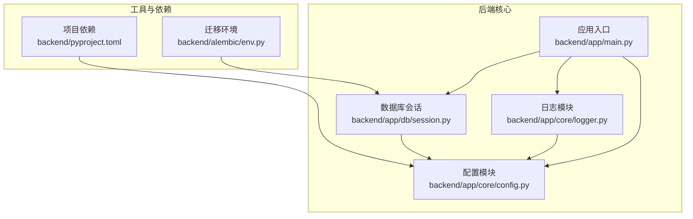
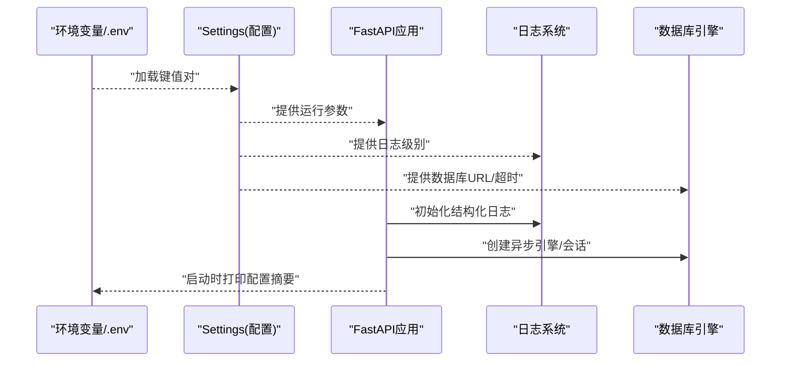
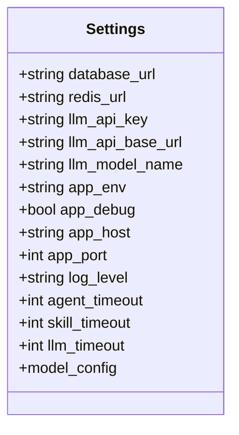
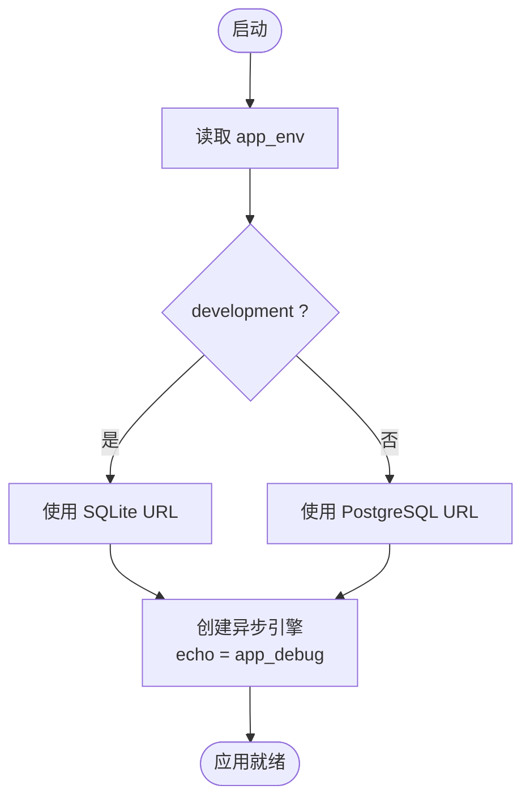
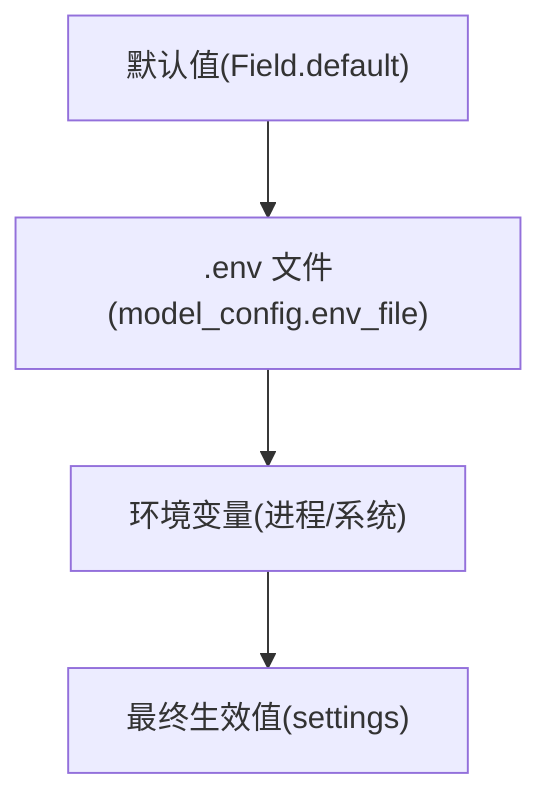
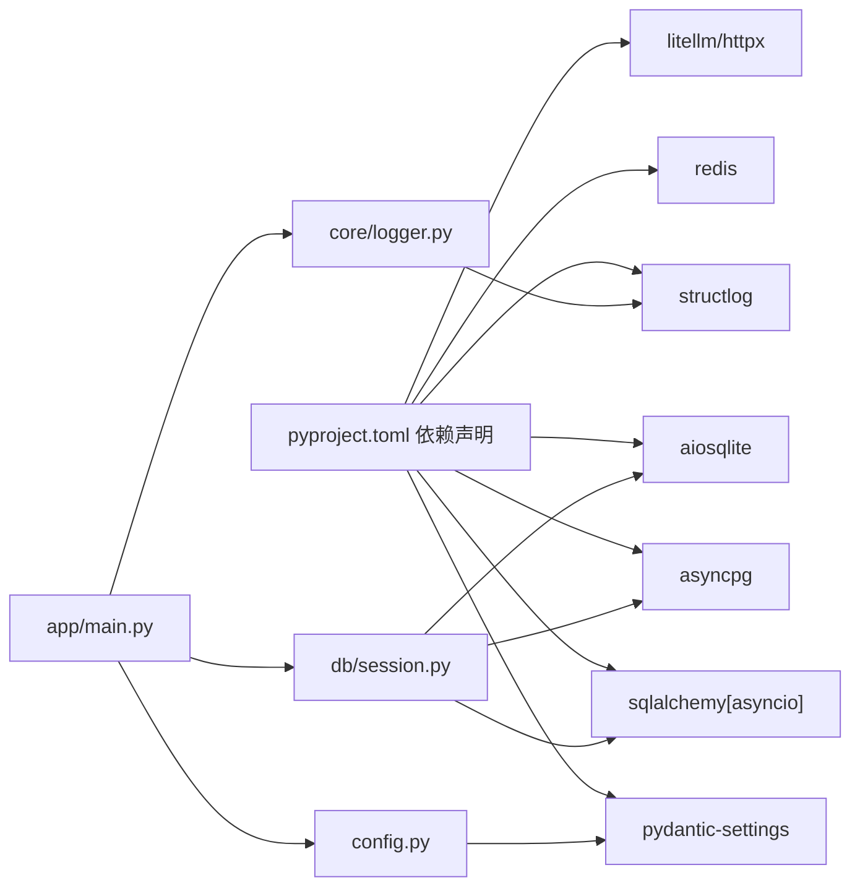

# 环境配置

<cite>
**本文引用的文件**
- [backend/app/core/config.py](file://backend/app/core/config.py)
- [backend/app/main.py](file://backend/app/main.py)
- [backend/app/db/session.py](file://backend/app/db/session.py)
- [backend/app/core/logger.py](file://backend/app/core/logger.py)
- [backend/pyproject.toml](file://backend/pyproject.toml)
- [backend/alembic/env.py](file://backend/alembic/env.py)
</cite>

## 目录
1. [简介](#简介)
2. [项目结构](#项目结构)
3. [核心组件](#核心组件)
4. [架构总览](#架构总览)
5. [详细组件分析](#详细组件分析)
6. [依赖分析](#依赖分析)
7. [性能考量](#性能考量)
8. [故障排查指南](#故障排查指南)
9. [结论](#结论)
10. [附录](#附录)

## 简介
本文件面向HotClaw后端的环境配置系统，围绕Settings类的设计与实现进行深入解析，涵盖以下主题：
- 配置项定义：数据库连接、Redis、LLM API、应用运行参数、日志级别、超时配置
- 环境变量加载机制、默认值与配置验证规则
- 开发与生产环境差异（数据库类型切换、调试模式、主机与端口）
- 配置文件示例与最佳实践（敏感信息保护、安全考虑）
- 配置项优先级与覆盖机制

## 项目结构
HotClaw后端采用FastAPI + SQLAlchemy异步架构，配置集中于核心模块，通过Pydantic Settings从环境变量加载，并在应用启动时初始化数据库引擎与日志系统。

**图示来源**
- [backend/app/core/config.py:1-51](file://backend/app/core/config.py#L1-L51)
- [backend/app/main.py:1-142](file://backend/app/main.py#L1-L142)
- [backend/app/db/session.py:1-33](file://backend/app/db/session.py#L1-L33)
- [backend/app/core/logger.py:1-36](file://backend/app/core/logger.py#L1-L36)
- [backend/pyproject.toml:1-41](file://backend/pyproject.toml#L1-L41)
- [backend/alembic/env.py:1-10](file://backend/alembic/env.py#L1-L10)

**章节来源**
- [backend/app/core/config.py:1-51](file://backend/app/core/config.py#L1-L51)
- [backend/app/main.py:1-142](file://backend/app/main.py#L1-L142)
- [backend/app/db/session.py:1-33](file://backend/app/db/session.py#L1-L33)
- [backend/app/core/logger.py:1-36](file://backend/app/core/logger.py#L1-L36)
- [backend/pyproject.toml:1-41](file://backend/pyproject.toml#L1-L41)
- [backend/alembic/env.py:1-10](file://backend/alembic/env.py#L1-L10)

## 核心组件
- Settings类：集中定义所有配置项，包含数据库URL、Redis连接、LLM API密钥与基础地址、模型名、应用运行环境与调试开关、主机与端口、日志级别、各类超时阈值；通过model_config声明.env文件路径与编码。
- 应用入口：在生命周期中读取settings并初始化日志、注册代理、自动建表（开发模式）、记录启动日志。
- 数据库会话：根据settings.database_url判断是否为SQLite，动态调整连接参数（如pool_pre_ping）。
- 日志模块：依据settings.log_level设置结构化日志处理器与级别。

**章节来源**
- [backend/app/core/config.py:7-51](file://backend/app/core/config.py#L7-L51)
- [backend/app/main.py:42-58](file://backend/app/main.py#L42-L58)
- [backend/app/db/session.py:6-13](file://backend/app/db/session.py#L6-L13)
- [backend/app/core/logger.py:8-31](file://backend/app/core/logger.py#L8-L31)

## 架构总览
下图展示配置在系统中的流向与依赖关系：

**图示来源**
- [backend/app/core/config.py:47-51](file://backend/app/core/config.py#L47-L51)
- [backend/app/main.py:42-58](file://backend/app/main.py#L42-L58)
- [backend/app/core/logger.py:8-31](file://backend/app/core/logger.py#L8-L31)
- [backend/app/db/session.py:8-19](file://backend/app/db/session.py#L8-L19)

## 详细组件分析

### Settings类设计与配置项
- 设计原则
  - 使用Pydantic V2的BaseSettings与Field，支持从环境变量与.env文件加载，具备类型校验与默认值能力。
  - 将配置按功能域分组（数据库、Redis、LLM、应用、日志、超时），便于维护与扩展。
  - 通过model_config指定.env文件位置与编码，确保加载一致性。
- 关键配置项
  - 数据库连接：database_url，默认开发使用SQLite，生产建议PostgreSQL。
  - Redis连接：redis_url，默认本地Redis。
  - LLM API：llm_api_key、llm_api_base_url、llm_model_name。
  - 应用运行：app_env（development/production）、app_debug（影响SQL echo）、app_host、app_port。
  - 日志：log_level（映射到标准logging级别）。
  - 超时：agent_timeout、skill_timeout、llm_timeout（秒）。
- 加载机制与默认值
  - 未设置时使用默认值；若存在同名环境变量或.env条目，则覆盖默认值。
  - .env文件位于项目根目录，编码为UTF-8。
- 验证规则
  - 字段类型由Field声明，运行时进行类型校验；字符串字段未内置正则校验，需在业务层补充。
  - 建议在启动阶段增加显式校验（例如检查敏感字段非空、URL格式、端口范围等）。

**图示来源**
- [backend/app/core/config.py:7-47](file://backend/app/core/config.py#L7-L47)

**章节来源**
- [backend/app/core/config.py:7-51](file://backend/app/core/config.py#L7-L51)

### 环境变量加载与覆盖机制
- 加载顺序（从低优先级到高优先级）
  1) 默认值（Field.default）
  2) .env文件（model_config.env_file）
  3) 运行时环境变量（操作系统/容器/进程）
- 覆盖行为
  - 同名键以更高优先级为准；.env与环境变量冲突时，环境变量优先。
  - 配置对象在首次访问时完成解析，后续读取直接使用已解析值。
- 实践建议
  - 在CI/CD中通过环境变量注入生产配置，避免提交敏感信息至仓库。
  - 开发机使用.local或自定义.env文件，区分不同工作区。

**章节来源**
- [backend/app/core/config.py:47-51](file://backend/app/core/config.py#L47-L51)

### 开发与生产环境差异
- 数据库类型切换
  - 开发：默认SQLite（无需外部服务，便于快速启动）。
  - 生产：推荐PostgreSQL（高性能、事务与并发能力更强）。
  - 切换依据：settings.database_url前缀判断，驱动差异导致连接参数不同（如pool_pre_ping仅适用于非SQLite）。
- 调试模式
  - app_debug为True时，SQLAlchemy echo开启，便于开发调试；生产应关闭。
- 主机与端口
  - app_host与app_port决定FastAPI监听地址与端口，生产环境建议绑定内网IP并配合反向代理。
- 其他差异
  - CORS策略在生产中应收紧allow_origins。
  - 日志级别在生产中建议提升为INFO或更高。

**图示来源**
- [backend/app/core/config.py:11-14](file://backend/app/core/config.py#L11-L14)
- [backend/app/db/session.py:6-13](file://backend/app/db/session.py#L6-L13)
- [backend/app/main.py:54-55](file://backend/app/main.py#L54-L55)

**章节来源**
- [backend/app/db/session.py:6-13](file://backend/app/db/session.py#L6-L13)
- [backend/app/main.py:54-55](file://backend/app/main.py#L54-L55)

### 配置项优先级与覆盖流程

**图示来源**
- [backend/app/core/config.py:47-51](file://backend/app/core/config.py#L47-L51)

**章节来源**
- [backend/app/core/config.py:47-51](file://backend/app/core/config.py#L47-L51)

### 配置文件示例与最佳实践
- 示例（键名与用途对应）
  - database_url：开发用SQLite，生产用PostgreSQL
  - redis_url：指向Redis实例
  - llm_api_key：LLM平台API密钥
  - llm_api_base_url：LLM平台基础地址
  - llm_model_name：默认模型名称
  - app_env：development 或 production
  - app_debug：开发时启用，生产禁用
  - app_host/app_port：监听地址与端口
  - log_level：日志级别
  - agent_timeout/skill_timeout/llm_timeout：超时阈值（秒）
- 最佳实践
  - 敏感信息保护：禁止将.env与密钥提交到版本库；使用只读权限与加密存储。
  - 环境隔离：开发、测试、生产分别使用独立的.env与环境变量。
  - 配置校验：在应用启动阶段对关键字段进行显式校验（如URL合法性、端口范围、非空校验）。
  - 安全加固：生产环境收紧CORS、限制日志详情输出、启用更严格的日志级别。

**章节来源**
- [backend/app/core/config.py:11-46](file://backend/app/core/config.py#L11-L46)
- [backend/app/main.py:67-74](file://backend/app/main.py#L67-L74)
- [backend/app/core/logger.py:10-30](file://backend/app/core/logger.py#L10-L30)

## 依赖分析
- 外部依赖
  - pydantic-settings：提供Settings与.env加载能力
  - sqlalchemy[asyncio]/asyncpg/aiosqlite：异步数据库支持
  - redis：缓存与消息队列
  - structlog：结构化日志
  - litellm/httpx：LLM调用与HTTP客户端
- 内部耦合
  - app.main依赖settings进行日志初始化、CORS与异常处理
  - app.db.session依赖settings.database_url与app_debug
  - app.core.logger依赖settings.log_level

**图示来源**
- [backend/pyproject.toml:6-22](file://backend/pyproject.toml#L6-L22)
- [backend/app/core/config.py:3-4](file://backend/app/core/config.py#L3-L4)
- [backend/app/db/session.py:3-4](file://backend/app/db/session.py#L3-L4)
- [backend/app/core/logger.py:3-5](file://backend/app/core/logger.py#L3-L5)
- [backend/app/main.py:8-9](file://backend/app/main.py#L8-L9)

**章节来源**
- [backend/pyproject.toml:1-41](file://backend/pyproject.toml#L1-L41)
- [backend/app/core/config.py:3-4](file://backend/app/core/config.py#L3-L4)
- [backend/app/db/session.py:3-4](file://backend/app/db/session.py#L3-L4)
- [backend/app/core/logger.py:3-5](file://backend/app/core/logger.py#L3-L5)
- [backend/app/main.py:8-9](file://backend/app/main.py#L8-L9)

## 性能考量
- 数据库连接池与预检
  - 非SQLite场景启用pool_pre_ping可提升连接稳定性，但会带来额外开销；生产建议结合连接池大小与超时策略综合评估。
- 调试模式
  - app_debug开启会输出SQL语句，开发期有助于诊断，但会产生可观的日志与I/O开销，生产必须关闭。
- 超时配置
  - agent_timeout、skill_timeout、llm_timeout直接影响任务执行体验与资源占用，建议结合实际负载与SLA设定。

**章节来源**
- [backend/app/db/session.py:10-12](file://backend/app/db/session.py#L10-L12)
- [backend/app/main.py:55](file://backend/app/main.py#L55)

## 故障排查指南
- 常见问题与定位
  - 数据库无法连接：检查database_url格式与可达性；确认驱动安装（asyncpg/aiosqlite）；核对app_debug与日志级别。
  - Redis不可用：核对redis_url与网络连通性；确认密码与数据库索引。
  - LLM调用失败：核对llm_api_key与llm_api_base_url；检查llm_timeout与网络状况。
  - CORS跨域错误：生产环境需收紧allow_origins白名单。
  - 日志级别异常：确认log_level映射正确（大写/小写）。
- 异常分类与处理
  - 用户输入错误（1xxx）、冲突（2xxx）、外部/执行错误（3xxx）、配置错误（4xxx）、系统错误（5xxx）。
  - 未捕获异常统一返回内部错误，开发模式下可附加细节，生产环境不暴露堆栈。

**章节来源**
- [backend/app/core/exceptions.py:4-125](file://backend/app/core/exceptions.py#L4-L125)
- [backend/app/main.py:87-129](file://backend/app/main.py#L87-L129)

## 结论
Settings类以简洁而强大的方式统一管理HotClaw后端的运行配置，结合Pydantic Settings的类型校验与.env加载能力，实现了开发与生产的灵活切换。建议在现有基础上补充启动阶段的显式校验与安全加固措施，以进一步提升系统的可靠性与安全性。

## 附录
- 启动与生命周期
  - 应用启动时初始化日志、注册代理、自动建表（开发模式），随后进入运行态；关闭时记录shutdown日志。
- Alembic迁移
  - 迁移环境与异步SQLAlchemy兼容，确保数据库Schema演进与配置解耦。

**章节来源**
- [backend/app/main.py:42-58](file://backend/app/main.py#L42-L58)
- [backend/alembic/env.py:1-10](file://backend/alembic/env.py#L1-L10)