# 配置管理

<cite>
**本文引用的文件**
- [backend/app/core/config.py](file://backend/app/core/config.py)
- [backend/app/orchestrator/workspace.py](file://backend/app/orchestrator/workspace.py)
- [backend/app/models/tables.py](file://backend/app/models/tables.py)
- [backend/app/api/llm_provider_routes.py](file://backend/app/api/llm_provider_routes.py)
- [backend/app/llm/gateway.py](file://backend/app/llm/gateway.py)
- [backend/app/llm/config.py](file://backend/app/llm/config.py)
- [backend/app/llm/base.py](file://backend/app/llm/base.py)
- [backend/app/llm/exceptions.py](file://backend/app/llm/exceptions.py)
- [backend/app/llm/providers/dashscope.py](file://backend/app/llm/providers/dashscope.py)
- [backend/app/llm/providers/openai.py](file://backend/app/llm/providers/openai.py)
- [backend/app/llm/providers/deepseek.py](file://backend/app/llm/providers/deepseek.py)
- [frontend/app/settings/llm-providers/page.tsx](file://frontend/app/settings/llm-providers/page.tsx)
- [frontend/lib/api.ts](file://frontend/lib/api.ts)
- [OpenClaw-bot-review-main/lib/config-cache.ts](file://OpenClaw-bot-review-main/lib/config-cache.ts)
- [OpenClaw-bot-review-main/app/api/config/agent-model/route.ts](file://OpenClaw-bot-review-main/app/api/config/agent-model/route.ts)
- [.env.example](file://.env.example)
- [ARCHITECTURE.md](file://ARCHITECTURE.md)
</cite>

## 目录
1. [简介](#简介)
2. [项目结构](#项目结构)
3. [核心组件](#核心组件)
4. [架构总览](#架构总览)
5. [组件详解](#组件详解)
6. [依赖关系分析](#依赖关系分析)
7. [性能考量](#性能考量)
8. [故障排查指南](#故障排查指南)
9. [结论](#结论)
10. [附录](#附录)

## 简介
本文件为 HotClaw 配置管理系统的全面技术文档，聚焦以下主题：
- 配置文件结构：YAML/JSON Manifest 文件、环境变量配置与动态加载机制
- 智能体配置管理、技能配置管理、工作流配置管理的实现原理
- 配置验证机制、配置缓存策略与配置热更新能力
- Workspace 上下文中的配置继承与覆盖规则
- **新增** LLM Provider 配置系统：数据库驱动的多 Provider 管理，支持用户自定义 API 密钥和设置
- 配置扩展开发指南（新增自定义配置项与验证规则）
- 最佳实践、安全注意事项与运维排障方法

## 项目结构
HotClaw 的配置体系横跨后端 Python 服务与前端 Next.js 应用，主要涉及：
- 后端应用配置：通过 pydantic-settings 加载环境变量，集中于 Settings 类
- **新增** LLM Provider 配置：数据库驱动的 Provider 管理系统，支持多 Provider 配置与动态切换
- 前端配置缓存：基于内存的简单缓存工具，用于减少重复加载
- 配置 API：提供智能体模型配置读取与错误状态映射，**新增** LLM Provider 管理 API
- 数据模型：将 YAML/JSON Manifest 解析后的配置持久化到数据库表，**新增** LLM Provider 模型
- 架构文档：明确输入输出 Schema 使用 JSON Schema（draft-07）并在运行时用 Pydantic 校验

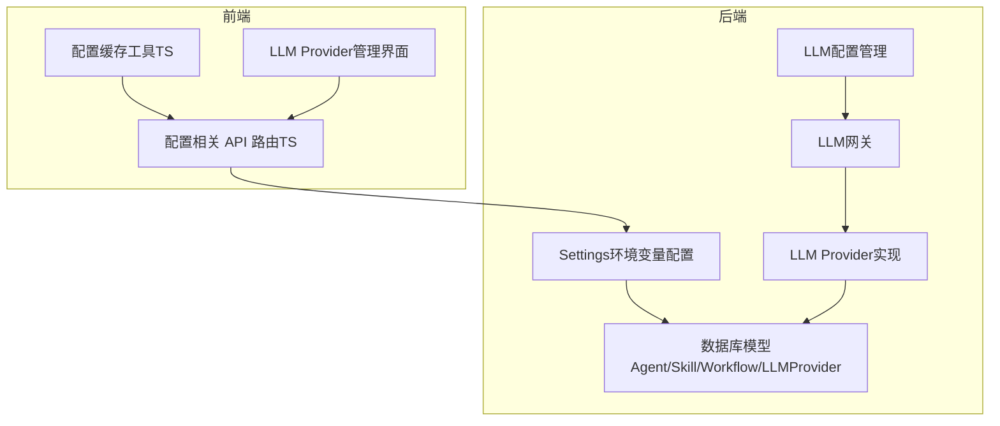

**图表来源**
- [backend/app/core/config.py:1-51](file://backend/app/core/config.py#L1-L51)
- [backend/app/llm/config.py:1-95](file://backend/app/llm/config.py#L1-L95)
- [backend/app/llm/gateway.py:1-440](file://backend/app/llm/gateway.py#L1-L440)
- [backend/app/models/tables.py:235-285](file://backend/app/models/tables.py#L235-L285)
- [backend/app/llm/providers/dashscope.py:1-194](file://backend/app/llm/providers/dashscope.py#L1-L194)
- [OpenClaw-bot-review-main/lib/config-cache.ts:1-19](file://OpenClaw-bot-review-main/lib/config-cache.ts#L1-L19)
- [OpenClaw-bot-review-main/app/api/config/agent-model/route.ts:49-80](file://OpenClaw-bot-review-main/app/api/config/agent-model/route.ts#L49-L80)
- [frontend/app/settings/llm-providers/page.tsx:1-529](file://frontend/app/settings/llm-providers/page.tsx#L1-L529)

**章节来源**
- [backend/app/core/config.py:1-51](file://backend/app/core/config.py#L1-L51)
- [backend/app/llm/config.py:1-95](file://backend/app/llm/config.py#L1-L95)
- [backend/app/llm/gateway.py:1-440](file://backend/app/llm/gateway.py#L1-L440)
- [backend/app/models/tables.py:235-285](file://backend/app/models/tables.py#L235-L285)
- [OpenClaw-bot-review-main/lib/config-cache.ts:1-19](file://OpenClaw-bot-review-main/lib/config-cache.ts#L1-L19)
- [OpenClaw-bot-review-main/app/api/config/agent-model/route.ts:49-80](file://OpenClaw-bot-review-main/app/api/config/agent-model/route.ts#L49-L80)
- [frontend/app/settings/llm-providers/page.tsx:1-529](file://frontend/app/settings/llm-providers/page.tsx#L1-L529)

## 核心组件
- 环境变量配置（Settings）
  - 通过 pydantic-settings 从 .env 文件加载键值对，统一管理数据库、Redis、LLM、应用运行参数、日志级别与超时等
  - 支持开发（SQLite）与生产（PostgreSQL）差异化默认值
- **新增** LLM Provider 配置系统
  - 数据库驱动的 Provider 管理：支持多 Provider 配置、默认 Provider 设置、启用/禁用控制
  - 动态配置加载：运行时从数据库加载用户配置，优先于传统环境变量
  - Provider 实现：支持 DashScope、OpenAI、DeepSeek、兼容模式等多种 Provider
- Workspace 任务上下文
  - 为单次任务提供隔离的数据容器，支持按字段映射提取给智能体使用
- 数据库模型（Agent/Skill/Workflow/LLMProvider）
  - 将 YAML/JSON Manifest 解析后的配置持久化存储，**新增** LLMProviderModel 支持用户自定义 API Key 和设置
  - 字段涵盖模块路径、输入输出 Schema、配置数据、重试/回退策略、状态等
- 前端配置缓存工具
  - 提供内存级缓存入口，记录数据与时间戳，便于快速读取与清理
- **新增** LLM Provider 管理 API
  - 提供 Provider 的 CRUD 操作、测试连接、设置默认 Provider 等功能
  - 支持用户自定义 API Key、Base URL、默认模型等配置

**章节来源**
- [backend/app/core/config.py:7-51](file://backend/app/core/config.py#L7-L51)
- [backend/app/llm/config.py:11-95](file://backend/app/llm/config.py#L11-L95)
- [backend/app/llm/gateway.py:24-440](file://backend/app/llm/gateway.py#L24-L440)
- [backend/app/orchestrator/workspace.py:12-53](file://backend/app/orchestrator/workspace.py#L12-L53)
- [backend/app/models/tables.py:160-285](file://backend/app/models/tables.py#L160-L285)
- [OpenClaw-bot-review-main/lib/config-cache.ts:1-19](file://OpenClaw-bot-review-main/lib/config-cache.ts#L1-L19)
- [backend/app/api/llm_provider_routes.py:1-325](file://backend/app/api/llm_provider_routes.py#L1-L325)

## 架构总览
配置生命周期概览：
- 开发/生产环境通过 .env 注入 Settings；前端通过配置缓存工具减少重复加载
- **新增** LLM Provider 配置通过数据库管理，支持用户自定义 API Key 和设置
- YAML/JSON Manifest 经解析后写入数据库模型（Agent/Skill/Workflow）
- 运行时，Workspace 作为任务上下文承载数据，按字段映射向智能体提供输入
- **新增** LLM Gateway 统一管理多个 Provider，支持数据库配置优先级
- 执行前后使用 JSON Schema（draft-07）+ Pydantic 校验输入输出，失败则按降级策略处理

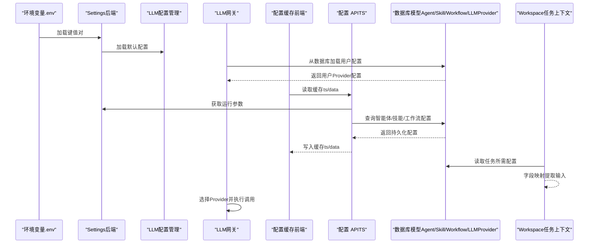

**图表来源**
- [backend/app/core/config.py:7-51](file://backend/app/core/config.py#L7-L51)
- [backend/app/llm/config.py:11-95](file://backend/app/llm/config.py#L11-L95)
- [backend/app/llm/gateway.py:42-440](file://backend/app/llm/gateway.py#L42-L440)
- [OpenClaw-bot-review-main/lib/config-cache.ts:1-19](file://OpenClaw-bot-review-main/lib/config-cache.ts#L1-L19)
- [OpenClaw-bot-review-main/app/api/config/agent-model/route.ts:49-80](file://OpenClaw-bot-review-main/app/api/config/agent-model/route.ts#L49-L80)
- [backend/app/models/tables.py:160-285](file://backend/app/models/tables.py#L160-L285)
- [backend/app/orchestrator/workspace.py:12-53](file://backend/app/orchestrator/workspace.py#L12-L53)

## 组件详解

### 环境变量配置（Settings）
- 配置类别
  - 数据库连接：支持 SQLite（开发）与 PostgreSQL（生产）默认值
  - 缓存中间件：Redis 连接地址
  - 大模型服务：API Key、Base URL、默认模型名
  - 应用运行：环境、调试开关、主机与端口
  - 日志与超时：日志级别、智能体/技能/LLM 超时
- 加载方式
  - 通过 pydantic-settings 从 .env 文件读取，UTF-8 编码
- 变更与热更新
  - 当前实现为启动时一次性加载；如需热更新，建议结合外部配置中心或重启进程

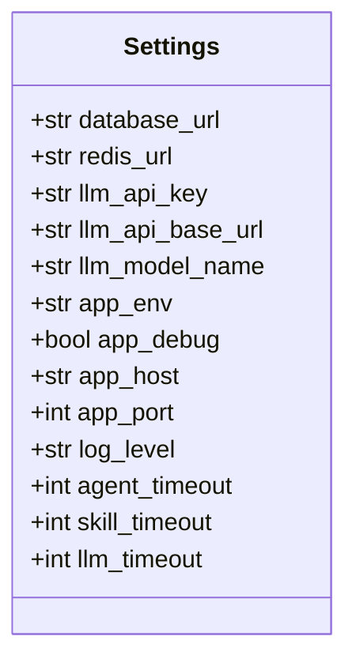

**图表来源**
- [backend/app/core/config.py:7-51](file://backend/app/core/config.py#L7-L51)

**章节来源**
- [backend/app/core/config.py:7-51](file://backend/app/core/config.py#L7-L51)

### **新增** LLM Provider 配置系统

#### LLM 配置管理
- 配置类别
  - 默认 Provider：支持 dashscope、openai、compatible、deepseek 等
  - Provider 特定配置：各 Provider 的 API Key、Base URL、默认模型
  - 通用配置：超时时间、最大重试次数
- 加载方式
  - 通过 pydantic-settings 从 .env 文件读取，支持字段验证
- 配置优先级
  - 数据库配置优先于 .env 配置，运行时动态加载

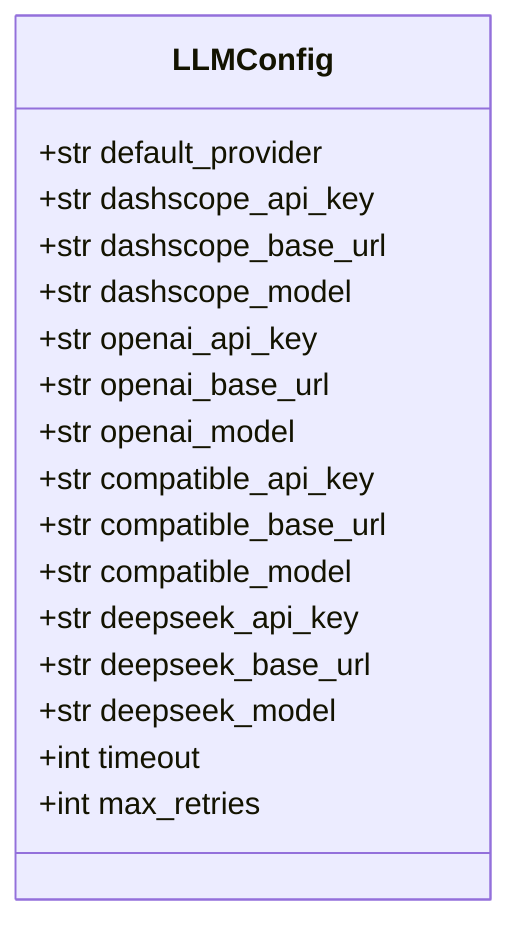

**图表来源**
- [backend/app/llm/config.py:11-95](file://backend/app/llm/config.py#L11-L95)

#### LLM 网关
- 职责
  - 统一 LLM 调用入口，支持多种 Provider
  - 自动处理 Provider 路由和选择
  - 管理 Provider 初始化和生命周期
- 配置加载
  - 优先从数据库加载用户配置
  - 回退到 .env 环境变量配置
  - 支持动态重新加载配置
- Provider 管理
  - 支持 DashScope、OpenAI、DeepSeek、兼容模式等
  - 动态初始化可用的 Provider
  - 提供默认 Provider 选择机制

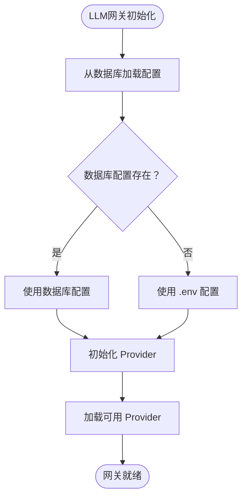

**图表来源**
- [backend/app/llm/gateway.py:42-440](file://backend/app/llm/gateway.py#L42-L440)

#### LLM Provider 数据模型
- 模型职责
  - LLMProviderModel：持久化用户自定义的 LLM Provider 配置
  - 支持 API Key、Base URL、默认模型、支持的模型列表等配置
  - 支持启用/禁用状态、默认 Provider 标记、测试状态等
- 存储结构
  - 使用 JSON/JSONB 字段保存复杂配置对象
  - 支持额外配置（如 temperature 默认值等）
- 与运行时的关系
  - 运行时从数据库读取配置，结合 LLM Gateway 提供给智能体/技能执行

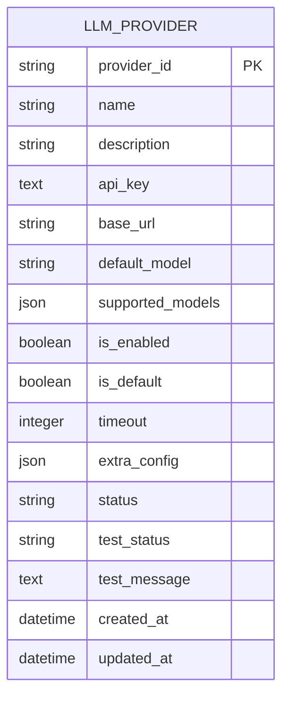

**图表来源**
- [backend/app/models/tables.py:235-285](file://backend/app/models/tables.py#L235-L285)

**章节来源**
- [backend/app/llm/config.py:11-95](file://backend/app/llm/config.py#L11-L95)
- [backend/app/llm/gateway.py:24-440](file://backend/app/llm/gateway.py#L24-L440)
- [backend/app/models/tables.py:235-285](file://backend/app/models/tables.py#L235-L285)

### Workspace 任务上下文
- 职责
  - 为单次任务提供隔离的数据容器，支持读取、写入、快照与按字段映射提取
- 字段映射规则
  - 支持直接引用顶层键或以"input."前缀引用原始输入子树
- 与配置的关系
  - 作为智能体执行期的输入来源，可将数据库中持久化的配置数据注入到 Workspace，再由智能体按需提取

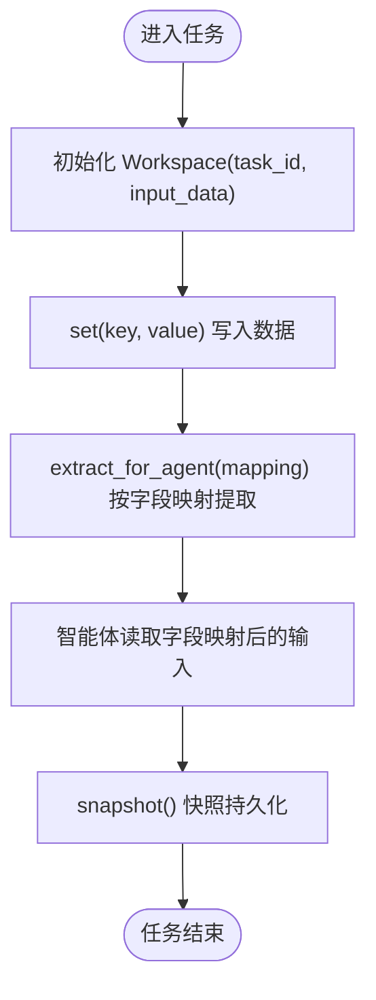

**图表来源**
- [backend/app/orchestrator/workspace.py:12-53](file://backend/app/orchestrator/workspace.py#L12-L53)

**章节来源**
- [backend/app/orchestrator/workspace.py:12-53](file://backend/app/orchestrator/workspace.py#L12-L53)

### 数据库模型与配置持久化
- 模型职责
  - AgentModel：持久化智能体配置（模块路径、Prompt 模板、输入/输出 Schema、所需技能、重试/回退策略、状态等）
  - SkillModel：持久化技能配置（模块路径、输入/输出 Schema、配置数据、状态等）
  - WorkflowTemplateModel：持久化工作流模板（定义、输入 Schema、输出映射、状态等）
  - **新增** LLMProviderModel：持久化用户自定义的 LLM Provider 配置
- 存储结构
  - 使用 JSON/JSONB 字段保存复杂配置对象，便于灵活扩展
- 与运行时的关系
  - 运行时从数据库读取配置，结合 Workspace 字段映射提供给智能体/技能执行

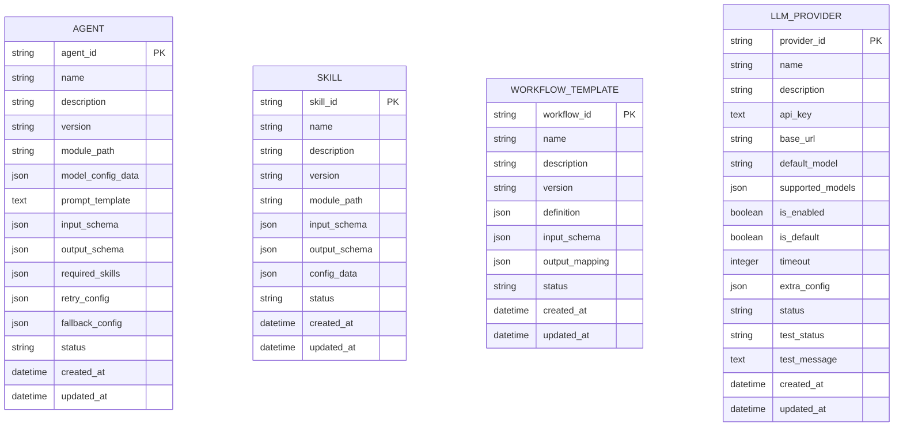

**图表来源**
- [backend/app/models/tables.py:160-285](file://backend/app/models/tables.py#L160-L285)

**章节来源**
- [backend/app/models/tables.py:160-285](file://backend/app/models/tables.py#L160-L285)

### 前端配置缓存与配置 API
- 配置缓存工具
  - 提供内存级缓存条目（data/ts），支持读取、设置与清理
- 配置 API 路由
  - 提供智能体模型配置读取接口，包含错误码映射：
    - "配置已变更"映射为 409
    - "缺失/无效/未找到/必填"映射为 400
    - "网关关闭/超时/连接异常"映射为 503
    - 其他映射为 500
  - 提供辅助函数：查找指定智能体配置项、收集已知模型引用集合
- **新增** LLM Provider 管理 API
  - 提供 Provider 的 CRUD 操作、测试连接、设置默认 Provider
  - 支持用户自定义 API Key、Base URL、默认模型等配置

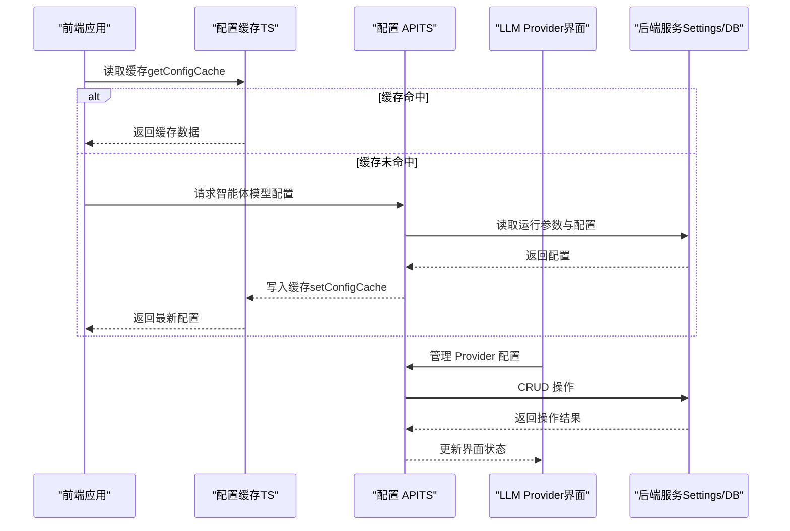

**图表来源**
- [OpenClaw-bot-review-main/lib/config-cache.ts:1-19](file://OpenClaw-bot-review-main/lib/config-cache.ts#L1-L19)
- [OpenClaw-bot-review-main/app/api/config/agent-model/route.ts:49-80](file://OpenClaw-bot-review-main/app/api/config/agent-model/route.ts#L49-L80)
- [backend/app/core/config.py:7-51](file://backend/app/core/config.py#L7-L51)
- [frontend/app/settings/llm-providers/page.tsx:1-529](file://frontend/app/settings/llm-providers/page.tsx#L1-L529)

**章节来源**
- [OpenClaw-bot-review-main/lib/config-cache.ts:1-19](file://OpenClaw-bot-review-main/lib/config-cache.ts#L1-L19)
- [OpenClaw-bot-review-main/app/api/config/agent-model/route.ts:49-80](file://OpenClaw-bot-review-main/app/api/config/agent-model/route.ts#L49-L80)
- [backend/app/core/config.py:7-51](file://backend/app/core/config.py#L7-L51)
- [frontend/app/settings/llm-providers/page.tsx:1-529](file://frontend/app/settings/llm-providers/page.tsx#L1-L529)

### 配置验证机制与热更新
- 验证机制
  - 输入/输出使用 JSON Schema（draft-07）定义，运行时由 Pydantic 校验
  - 校验失败抛出 SchemaValidationError，由 Orchestrator 按降级策略处理
- 热更新
  - 当前未见内置热更新实现；可通过以下方式实现：
    - 前端缓存 + 轮询刷新
    - 后端监听配置文件变化并触发进程重启
    - 引入外部配置中心（如 etcd/Consul/Nacos），后端订阅变更事件
  - **新增** LLM Provider 支持动态重新加载配置

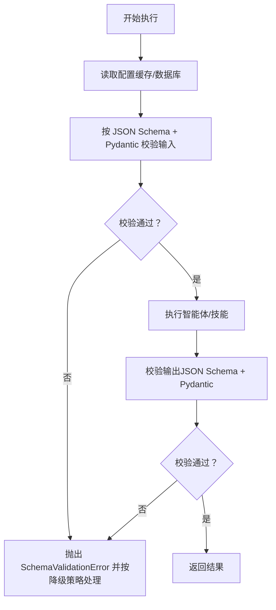

**图表来源**
- [ARCHITECTURE.md:985-991](file://ARCHITECTURE.md#L985-L991)

**章节来源**
- [ARCHITECTURE.md:985-991](file://ARCHITECTURE.md#L985-L991)

### Workspace 中的配置继承与覆盖规则
- 字段映射提取
  - 支持直接键访问与"input."前缀访问原始输入子树
  - 适用于将数据库持久化的配置数据注入到 Workspace，并按字段映射提供给智能体
- 继承与覆盖
  - 未发现显式"继承链"实现；通常通过 Workspace 层面的键合并与字段映射实现覆盖
  - 建议在业务层定义统一的合并策略（如：优先使用 Workspace 显式键，否则回退到 input.*）

**章节来源**
- [backend/app/orchestrator/workspace.py:36-53](file://backend/app/orchestrator/workspace.py#L36-L53)

### 配置扩展开发指南
- 新增自定义配置项
  - 在对应 Manifest（YAML/JSON）中添加字段，并在数据库模型中扩展 JSON 字段以容纳新配置
  - 在运行时将新配置写入 Workspace，智能体通过字段映射读取
- 定义配置验证规则
  - 在 Manifest 中完善 input_schema/output_schema，确保执行前后均被校验
  - 如需更强约束，可在业务层增加自定义校验器
- **新增** LLM Provider 扩展
  - 在 LLMProviderModel 中添加新的 Provider 配置字段
  - 实现对应的 Provider 类，继承 LLMProvider 基类
  - 在 LLMGateway 中注册新的 Provider

**章节来源**
- [backend/app/models/tables.py:160-285](file://backend/app/models/tables.py#L160-L285)
- [backend/app/llm/gateway.py:125-232](file://backend/app/llm/gateway.py#L125-L232)
- [ARCHITECTURE.md:985-991](file://ARCHITECTURE.md#L985-L991)

## 依赖关系分析
- 后端 Settings 依赖 pydantic-settings 与 .env 文件
- **新增** LLM 配置系统依赖数据库连接和 Provider 实现
- 前端配置缓存工具独立于后端，仅提供内存缓存能力
- 配置 API 路由依赖后端运行参数与数据库模型查询
- **新增** LLM Provider 管理 API 提供完整的 Provider 生命周期管理
- Workspace 与数据库模型解耦，通过任务输入与字段映射衔接

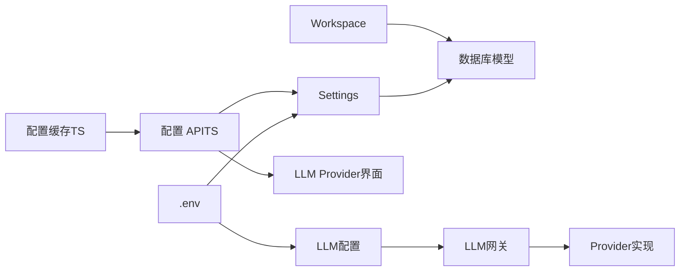

**图表来源**
- [backend/app/core/config.py:7-51](file://backend/app/core/config.py#L7-L51)
- [backend/app/llm/config.py:11-95](file://backend/app/llm/config.py#L11-L95)
- [backend/app/llm/gateway.py:42-440](file://backend/app/llm/gateway.py#L42-L440)
- [OpenClaw-bot-review-main/lib/config-cache.ts:1-19](file://OpenClaw-bot-review-main/lib/config-cache.ts#L1-L19)
- [OpenClaw-bot-review-main/app/api/config/agent-model/route.ts:49-80](file://OpenClaw-bot-review-main/app/api/config/agent-model/route.ts#L49-L80)
- [frontend/app/settings/llm-providers/page.tsx:1-529](file://frontend/app/settings/llm-providers/page.tsx#L1-L529)
- [backend/app/orchestrator/workspace.py:12-53](file://backend/app/orchestrator/workspace.py#L12-L53)
- [backend/app/models/tables.py:160-285](file://backend/app/models/tables.py#L160-L285)

**章节来源**
- [backend/app/core/config.py:7-51](file://backend/app/core/config.py#L7-L51)
- [backend/app/llm/config.py:11-95](file://backend/app/llm/config.py#L11-L95)
- [backend/app/llm/gateway.py:42-440](file://backend/app/llm/gateway.py#L42-L440)
- [OpenClaw-bot-review-main/lib/config-cache.ts:1-19](file://OpenClaw-bot-review-main/lib/config-cache.ts#L1-L19)
- [OpenClaw-bot-review-main/app/api/config/agent-model/route.ts:49-80](file://OpenClaw-bot-review-main/app/api/config/agent-model/route.ts#L49-L80)
- [frontend/app/settings/llm-providers/page.tsx:1-529](file://frontend/app/settings/llm-providers/page.tsx#L1-L529)
- [backend/app/orchestrator/workspace.py:12-53](file://backend/app/orchestrator/workspace.py#L12-L53)
- [backend/app/models/tables.py:160-285](file://backend/app/models/tables.py#L160-L285)

## 性能考量
- 配置缓存
  - 前端内存缓存可显著降低重复请求开销；建议设置合理的过期策略或版本号机制
- 数据库查询
  - 对高频读取的配置进行索引优化（如按 agent_id/skill_id/workflow_id/provider_id）
  - **新增** LLM Provider 配置建议添加 is_enabled 和 is_default 的索引
- 执行校验
  - JSON Schema + Pydantic 校验为 O(n) 复杂度，建议在边界处做缓存与批量校验
- 超时与并发
  - 合理设置 agent/skill/LLM 超时，避免阻塞；对高并发场景引入限流与熔断
- **新增** LLM Provider 性能优化
  - Provider 实例缓存，避免重复初始化
  - 异步加载数据库配置，不影响主流程启动
  - 支持动态重新加载配置而不重启服务

## 故障排查指南
- 常见错误与状态映射
  - 配置已变更：409（建议触发重新加载流程）
  - 缺失/无效/未找到/必填：400（检查 Manifest 与 Schema 定义）
  - 网关关闭/超时/连接异常：503（检查后端服务与网络连通性）
  - 其他：500（查看后端日志定位具体异常）
- **新增** LLM Provider 故障排查
  - Provider 未初始化：检查数据库中是否启用相应的 Provider
  - API Key 无效：通过测试连接功能验证 API Key 正确性
  - 默认 Provider 未设置：确认数据库中至少有一个启用的 Provider
  - 配置优先级问题：确认数据库配置是否正确覆盖 .env 配置
- 排查步骤
  - 核对 .env 与运行参数是否正确
  - 检查数据库中对应配置是否完整（Agent/Skill/Workflow/LLMProvider）
  - 查看 Workspace 字段映射是否正确
  - 关注 Schema 校验失败堆栈，定位输入/输出不匹配点
  - **新增** 检查 LLM Provider 的测试状态和错误信息

**章节来源**
- [OpenClaw-bot-review-main/app/api/config/agent-model/route.ts:49-80](file://OpenClaw-bot-review-main/app/api/config/agent-model/route.ts#L49-L80)
- [backend/app/llm/gateway.py:117-124](file://backend/app/llm/gateway.py#L117-L124)
- [backend/app/api/llm_provider_routes.py:183-325](file://backend/app/api/llm_provider_routes.py#L183-L325)

## 结论
HotClaw 的配置管理体系以环境变量、Manifest 与数据库模型为核心，配合前端缓存与 Workspace 字段映射，形成从加载、持久化到执行期使用的闭环。**新增的 LLM Provider 配置系统通过数据库驱动的方式，提供了强大的多 Provider 管理能力，支持用户自定义 API Key 和设置，替代了传统的纯环境变量配置方式。** 当前验证机制基于 JSON Schema + Pydantic，建议在生产环境中补充热更新与更强的配置治理能力（如配置中心、版本控制与灰度发布）。

## 附录
- 最佳实践
  - 将敏感信息（如 LLM API Key）置于 .env 并限制权限
  - 为每个配置项提供清晰的 input_schema/output_schema
  - 对高频配置启用前端缓存与后端索引
  - 为配置变更建立版本号与回滚策略
  - **新增** LLM Provider 配置建议使用数据库加密存储 API Key
- 安全考虑
  - 严格控制 .env 与数据库访问权限
  - 对外暴露的 API 增加鉴权与速率限制
  - 定期审计配置变更历史
  - **新增** 对 API Key 进行最小权限原则配置
- 运维指南
  - 开发环境使用 SQLite，生产环境使用 PostgreSQL
  - 监控配置加载成功率与 Schema 校验失败率
  - 建立配置热更新演练与应急预案
  - **新增** 监控 LLM Provider 的可用性和性能指标