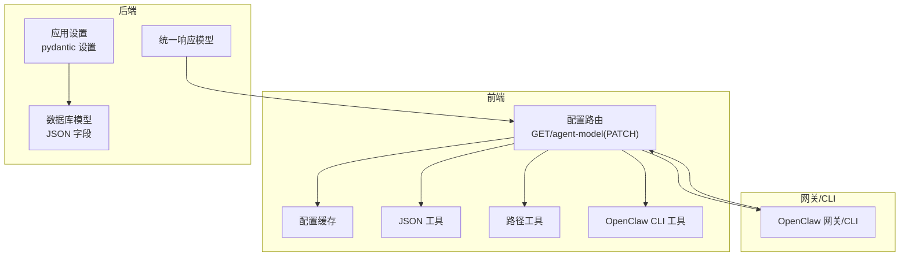
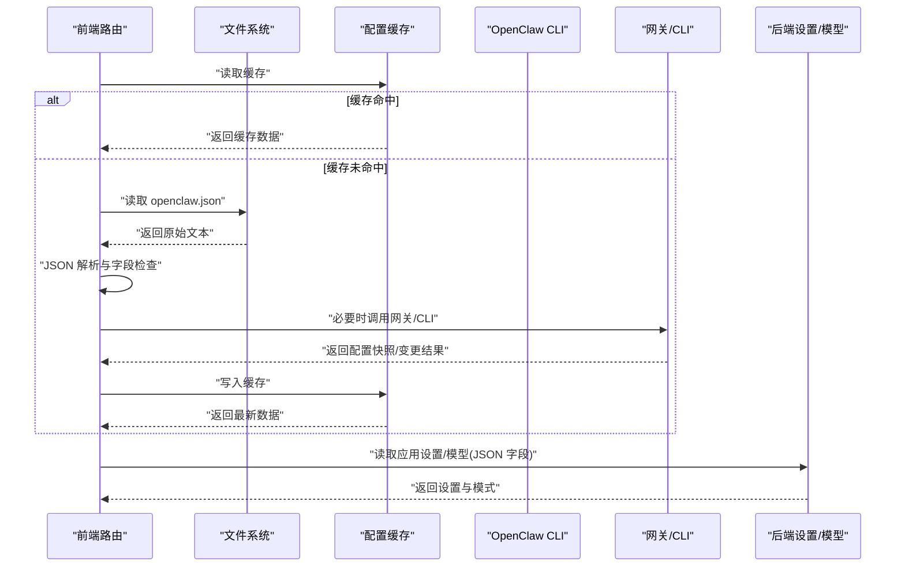
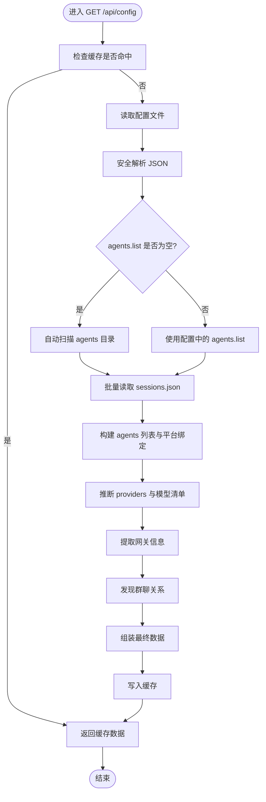
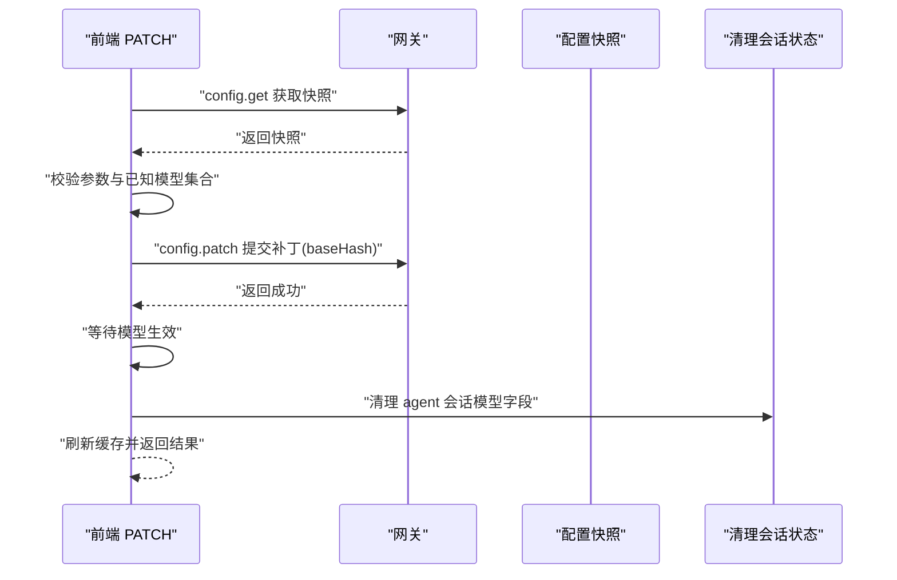
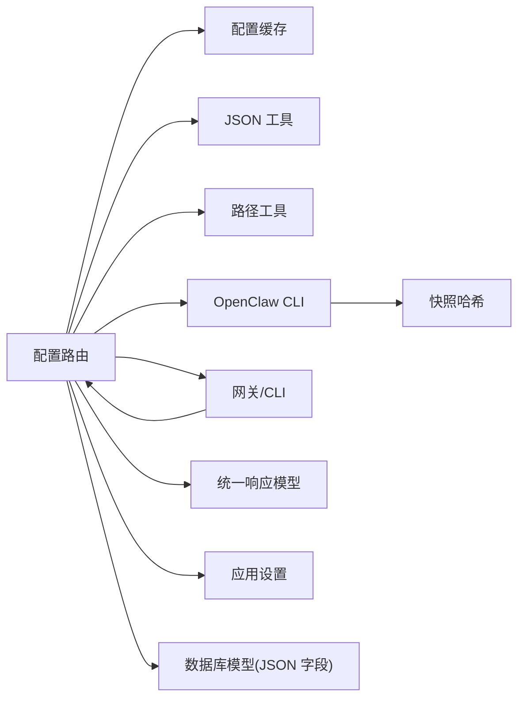

# 配置验证

<cite>
**本文引用的文件**
- [OpenClaw-bot-review-main/app/api/config/route.ts](file://OpenClaw-bot-review-main/app/api/config/route.ts)
- [OpenClaw-bot-review-main/app/api/config/agent-model/route.ts](file://OpenClaw-bot-review-main/app/api/config/agent-model/route.ts)
- [OpenClaw-bot-review-main/lib/config-cache.ts](file://OpenClaw-bot-review-main/lib/config-cache.ts)
- [OpenClaw-bot-review-main/lib/json.ts](file://OpenClaw-bot-review-main/lib/json.ts)
- [OpenClaw-bot-review-main/lib/openclaw-paths.ts](file://OpenClaw-bot-review-main/lib/openclaw-paths.ts)
- [OpenClaw-bot-review-main/lib/openclaw-cli.ts](file://OpenClaw-bot-review-main/lib/openclaw-cli.ts)
- [OpenClaw-bot-review-main/lib/session-test-fallback.ts](file://OpenClaw-bot-review-main/lib/session-test-fallback.ts)
- [OpenClaw-bot-review-main/app/api/gateway-health/route.ts](file://OpenClaw-bot-review-main/app/api/gateway-health/route.ts)
- [backend/app/core/config.py](file://backend/app/core/config.py)
- [backend/app/models/tables.py](file://backend/app/models/tables.py)
- [backend/app/schemas/common.py](file://backend/app/schemas/common.py)
</cite>

## 目录
1. [引言](#引言)
2. [项目结构](#项目结构)
3. [核心组件](#核心组件)
4. [架构总览](#架构总览)
5. [详细组件分析](#详细组件分析)
6. [依赖分析](#依赖分析)
7. [性能考虑](#性能考虑)
8. [故障排查指南](#故障排查指南)
9. [结论](#结论)
10. [附录](#附录)

## 引言
本技术文档围绕 HotClaw 配置验证系统进行深入剖析，聚焦于配置验证的层次结构与实现方式，涵盖语法验证、语义验证与业务规则验证；详细说明配置格式验证机制（YAML/JSON 解析、字段类型检查、必填项校验）、配置逻辑验证规则（依赖关系检查、约束条件验证、冲突检测），以及错误分类与处理策略（错误报告、修复建议、自动修复）。同时给出可扩展的自定义验证器开发与注册方法，并总结性能优化与批量验证策略。

## 项目结构
HotClaw 的配置验证涉及前端 Next.js API 路由、配置缓存与解析工具、OpenClaw CLI 交互、后端应用设置与数据库模型等模块。整体以“前端路由读取本地配置并调用网关/CLI”为核心，结合缓存与错误映射，形成完整的配置验证闭环。

图表来源
- [OpenClaw-bot-review-main/app/api/config/route.ts:257-556](file://OpenClaw-bot-review-main/app/api/config/route.ts#L257-L556)
- [OpenClaw-bot-review-main/app/api/config/agent-model/route.ts:174-242](file://OpenClaw-bot-review-main/app/api/config/agent-model/route.ts#L174-L242)
- [OpenClaw-bot-review-main/lib/config-cache.ts:1-19](file://OpenClaw-bot-review-main/lib/config-cache.ts#L1-L19)
- [OpenClaw-bot-review-main/lib/json.ts:1-18](file://OpenClaw-bot-review-main/lib/json.ts#L1-L18)
- [OpenClaw-bot-review-main/lib/openclaw-paths.ts:1-35](file://OpenClaw-bot-review-main/lib/openclaw-paths.ts#L1-L35)
- [OpenClaw-bot-review-main/lib/openclaw-cli.ts:1-83](file://OpenClaw-bot-review-main/lib/openclaw-cli.ts#L1-L83)
- [backend/app/core/config.py:1-51](file://backend/app/core/config.py#L1-L51)
- [backend/app/models/tables.py:171-220](file://backend/app/models/tables.py#L171-L220)
- [backend/app/schemas/common.py:1-26](file://backend/app/schemas/common.py#L1-L26)

章节来源
- [OpenClaw-bot-review-main/app/api/config/route.ts:1-557](file://OpenClaw-bot-review-main/app/api/config/route.ts#L1-L557)
- [OpenClaw-bot-review-main/app/api/config/agent-model/route.ts:1-243](file://OpenClaw-bot-review-main/app/api/config/agent-model/route.ts#L1-L243)
- [OpenClaw-bot-review-main/lib/config-cache.ts:1-19](file://OpenClaw-bot-review-main/lib/config-cache.ts#L1-L19)
- [OpenClaw-bot-review-main/lib/json.ts:1-18](file://OpenClaw-bot-review-main/lib/json.ts#L1-L18)
- [OpenClaw-bot-review-main/lib/openclaw-paths.ts:1-35](file://OpenClaw-bot-review-main/lib/openclaw-paths.ts#L1-L35)
- [OpenClaw-bot-review-main/lib/openclaw-cli.ts:1-83](file://OpenClaw-bot-review-main/lib/openclaw-cli.ts#L1-L83)
- [backend/app/core/config.py:1-51](file://backend/app/core/config.py#L1-L51)
- [backend/app/models/tables.py:171-220](file://backend/app/models/tables.py#L171-L220)
- [backend/app/schemas/common.py:1-26](file://backend/app/schemas/common.py#L1-L26)

## 核心组件
- 配置读取与聚合路由：负责从本地配置文件读取、解析、聚合 agents、channels、bindings、models 等信息，并进行基础的字段类型与存在性检查。
- 单代理模型变更路由：通过网关接口对单个代理的模型进行变更，执行已知模型集合校验与变更后等待生效。
- 配置缓存：在一定 TTL 内复用上次解析结果，降低 IO 与解析开销。
- JSON 工具：提供 UTF-8 BOM 去除与安全解析，确保解析健壮性。
- 路径工具：定位 HOME、配置文件与 agents 目录，保证跨平台一致性。
- OpenClaw CLI 工具：封装 openclaw 命令执行与输出解析，支持回退解析策略。
- 应用设置与数据库模型：后端使用 pydantic 设置管理环境变量，数据库模型中大量使用 JSON 字段存储配置片段，便于持久化与查询。

章节来源
- [OpenClaw-bot-review-main/app/api/config/route.ts:257-556](file://OpenClaw-bot-review-main/app/api/config/route.ts#L257-L556)
- [OpenClaw-bot-review-main/app/api/config/agent-model/route.ts:174-242](file://OpenClaw-bot-review-main/app/api/config/agent-model/route.ts#L174-L242)
- [OpenClaw-bot-review-main/lib/config-cache.ts:1-19](file://OpenClaw-bot-review-main/lib/config-cache.ts#L1-L19)
- [OpenClaw-bot-review-main/lib/json.ts:1-18](file://OpenClaw-bot-review-main/lib/json.ts#L1-L18)
- [OpenClaw-bot-review-main/lib/openclaw-paths.ts:1-35](file://OpenClaw-bot-review-main/lib/openclaw-paths.ts#L1-L35)
- [OpenClaw-bot-review-main/lib/openclaw-cli.ts:1-83](file://OpenClaw-bot-review-main/lib/openclaw-cli.ts#L1-L83)
- [backend/app/core/config.py:1-51](file://backend/app/core/config.py#L1-L51)
- [backend/app/models/tables.py:171-220](file://backend/app/models/tables.py#L171-L220)
- [backend/app/schemas/common.py:1-26](file://backend/app/schemas/common.py#L1-L26)

## 架构总览
配置验证在系统中的位置与交互如下：

图表来源
- [OpenClaw-bot-review-main/app/api/config/route.ts:257-556](file://OpenClaw-bot-review-main/app/api/config/route.ts#L257-L556)
- [OpenClaw-bot-review-main/lib/config-cache.ts:1-19](file://OpenClaw-bot-review-main/lib/config-cache.ts#L1-L19)
- [OpenClaw-bot-review-main/lib/json.ts:1-18](file://OpenClaw-bot-review-main/lib/json.ts#L1-L18)
- [OpenClaw-bot-review-main/lib/openclaw-cli.ts:1-83](file://OpenClaw-bot-review-main/lib/openclaw-cli.ts#L1-L83)
- [backend/app/core/config.py:1-51](file://backend/app/core/config.py#L1-L51)
- [backend/app/models/tables.py:171-220](file://backend/app/models/tables.py#L171-L220)

## 详细组件分析

### 配置读取与聚合（GET /api/config）
职责与流程要点：
- 缓存命中：在 TTL 内直接返回缓存数据，避免重复解析。
- 读取与解析：从固定路径读取配置文件，使用安全 JSON 解析工具去除 BOM 并解析。
- 自动发现：当 agents.list 为空时，自动扫描 agents 目录并兜底包含 main。
- 会话状态聚合：一次性读取各 agent 的 sessions.json，提取 token、消息计数、响应时间等指标。
- 平台绑定与群聊发现：基于 bindings 与 sessions 数据推导各 agent 的平台绑定与群聊关系。
- 模型提供者与模型清单：从 auth.profiles 与 agents.defaults/models 推断可用 provider 与模型，合并到 providers。
- 网关信息：从配置提取 gateway 端口、鉴权与主机信息。
- 错误处理：捕获异常并返回统一错误响应。

图表来源
- [OpenClaw-bot-review-main/app/api/config/route.ts:257-556](file://OpenClaw-bot-review-main/app/api/config/route.ts#L257-L556)
- [OpenClaw-bot-review-main/lib/json.ts:1-18](file://OpenClaw-bot-review-main/lib/json.ts#L1-L18)
- [OpenClaw-bot-review-main/lib/config-cache.ts:1-19](file://OpenClaw-bot-review-main/lib/config-cache.ts#L1-L19)

章节来源
- [OpenClaw-bot-review-main/app/api/config/route.ts:257-556](file://OpenClaw-bot-review-main/app/api/config/route.ts#L257-L556)
- [OpenClaw-bot-review-main/lib/json.ts:1-18](file://OpenClaw-bot-review-main/lib/json.ts#L1-L18)
- [OpenClaw-bot-review-main/lib/config-cache.ts:1-19](file://OpenClaw-bot-review-main/lib/config-cache.ts#L1-L19)

### 单代理模型变更（PATCH /api/config/agent-model）
职责与流程要点：
- 参数校验：要求 agentId 与 model 均存在。
- 快照获取：调用网关获取当前配置快照，校验有效性与哈希。
- 已知模型集合：从配置中收集所有已知模型，确保目标 model 在集合内。
- 变更提交：构造补丁并调用网关进行配置更新，携带 baseHash 与备注。
- 生效等待：轮询等待网关应用新模型，超时则报错。
- 清理会话状态：清理 agent 的 sessions 中与模型相关的临时字段，避免旧状态干扰。
- 错误映射：根据错误消息关键字映射到合适的 HTTP 状态码（如 400/409/503/500）。

图表来源
- [OpenClaw-bot-review-main/app/api/config/agent-model/route.ts:174-242](file://OpenClaw-bot-review-main/app/api/config/agent-model/route.ts#L174-L242)
- [OpenClaw-bot-review-main/lib/openclaw-cli.ts:78-83](file://OpenClaw-bot-review-main/lib/openclaw-cli.ts#L78-L83)

章节来源
- [OpenClaw-bot-review-main/app/api/config/agent-model/route.ts:174-242](file://OpenClaw-bot-review-main/app/api/config/agent-model/route.ts#L174-L242)
- [OpenClaw-bot-review-main/lib/openclaw-cli.ts:78-83](file://OpenClaw-bot-review-main/lib/openclaw-cli.ts#L78-L83)

### 配置缓存（ConfigCache）
- 结构：保存 data 与 ts 时间戳。
- 行为：提供读取、写入与清空接口；TTL 控制缓存有效期。
- 作用：减少重复解析与 IO，提升响应速度。

章节来源
- [OpenClaw-bot-review-main/lib/config-cache.ts:1-19](file://OpenClaw-bot-review-main/lib/config-cache.ts#L1-L19)

### JSON 解析工具（JSON Utils）
- 功能：去除 UTF-8 BOM、同步/异步解析 JSON 文本。
- 作用：保证解析健壮性，避免 BOM 导致的解析失败。

章节来源
- [OpenClaw-bot-review-main/lib/json.ts:1-18](file://OpenClaw-bot-review-main/lib/json.ts#L1-L18)

### 路径工具（OpenClaw Paths）
- 功能：确定 HOME、配置文件路径、agents 目录等。
- 作用：保证跨平台一致的配置定位。

章节来源
- [OpenClaw-bot-review-main/lib/openclaw-paths.ts:1-35](file://OpenClaw-bot-review-main/lib/openclaw-paths.ts#L1-L35)

### OpenClaw CLI 工具
- 功能：封装 openclaw 命令执行、混合输出解析、配置快照哈希计算。
- 作用：作为网关/CLI 的统一入口，支持回退解析策略。

章节来源
- [OpenClaw-bot-review-main/lib/openclaw-cli.ts:1-83](file://OpenClaw-bot-review-main/lib/openclaw-cli.ts#L1-L83)

### 后端设置与数据库模型
- 应用设置：使用 pydantic 设置管理数据库连接、Redis、LLM、应用运行参数、日志级别与超时等。
- 数据库模型：大量 JSON 字段用于存储输入/输出模式、技能配置、重试与回退配置等，便于灵活扩展。

章节来源
- [backend/app/core/config.py:1-51](file://backend/app/core/config.py#L1-L51)
- [backend/app/models/tables.py:171-220](file://backend/app/models/tables.py#L171-L220)

## 依赖分析
- 前端路由依赖：
  - 配置缓存：控制 TTL 与命中率。
  - JSON 工具：解析配置文件。
  - 路径工具：定位配置文件与 agents 目录。
  - CLI 工具：调用网关/CLI 获取/更新配置。
- 网关/CLI 依赖：
  - 配置快照哈希：用于补丁提交的 baseHash。
  - 输出解析：从 CLI 输出中提取 JSON。
- 后端设置与模型：
  - 为前端提供统一响应模型与应用设置，支撑配置验证的上下文。

图表来源
- [OpenClaw-bot-review-main/app/api/config/route.ts:257-556](file://OpenClaw-bot-review-main/app/api/config/route.ts#L257-L556)
- [OpenClaw-bot-review-main/lib/config-cache.ts:1-19](file://OpenClaw-bot-review-main/lib/config-cache.ts#L1-L19)
- [OpenClaw-bot-review-main/lib/json.ts:1-18](file://OpenClaw-bot-review-main/lib/json.ts#L1-L18)
- [OpenClaw-bot-review-main/lib/openclaw-cli.ts:78-83](file://OpenClaw-bot-review-main/lib/openclaw-cli.ts#L78-L83)
- [backend/app/schemas/common.py:1-26](file://backend/app/schemas/common.py#L1-L26)
- [backend/app/core/config.py:1-51](file://backend/app/core/config.py#L1-L51)
- [backend/app/models/tables.py:171-220](file://backend/app/models/tables.py#L171-L220)

章节来源
- [OpenClaw-bot-review-main/app/api/config/route.ts:257-556](file://OpenClaw-bot-review-main/app/api/config/route.ts#L257-L556)
- [OpenClaw-bot-review-main/lib/config-cache.ts:1-19](file://OpenClaw-bot-review-main/lib/config-cache.ts#L1-L19)
- [OpenClaw-bot-review-main/lib/json.ts:1-18](file://OpenClaw-bot-review-main/lib/json.ts#L1-L18)
- [OpenClaw-bot-review-main/lib/openclaw-cli.ts:78-83](file://OpenClaw-bot-review-main/lib/openclaw-cli.ts#L78-L83)
- [backend/app/schemas/common.py:1-26](file://backend/app/schemas/common.py#L1-L26)
- [backend/app/core/config.py:1-51](file://backend/app/core/config.py#L1-L51)
- [backend/app/models/tables.py:171-220](file://backend/app/models/tables.py#L171-L220)

## 性能考虑
- 缓存策略：配置路由内置 30 秒 TTL 的内存缓存，显著降低重复解析与 IO 成本。
- 批量读取：在构建 agents 时一次性读取所有 agent 的 sessions.json，避免多次 IO。
- 解析健壮性：使用 UTF-8 BOM 去除与安全解析，减少异常导致的重试成本。
- 超时控制：网关调用与恢复轮询设置明确超时阈值，防止长时间阻塞。
- 数据库 JSON 字段：将复杂配置以 JSON 存储，减少表结构变更带来的维护成本。

章节来源
- [OpenClaw-bot-review-main/app/api/config/route.ts:12-12](file://OpenClaw-bot-review-main/app/api/config/route.ts#L12-L12)
- [OpenClaw-bot-review-main/app/api/config/route.ts:319-328](file://OpenClaw-bot-review-main/app/api/config/route.ts#L319-L328)
- [OpenClaw-bot-review-main/lib/json.ts:1-18](file://OpenClaw-bot-review-main/lib/json.ts#L1-L18)
- [OpenClaw-bot-review-main/app/api/config/agent-model/route.ts:8-10](file://OpenClaw-bot-review-main/app/api/config/agent-model/route.ts#L8-L10)

## 故障排查指南
- 错误状态映射：
  - “配置自上次加载以来已更改” → 409 冲突
  - “缺失/无效/未找到/必须” → 400 客户端错误
  - “网关关闭/超时/ECONN/未运行/异常关闭” → 503 服务不可用
  - 其他 → 500 服务器错误
- 常见问题定位：
  - 配置文件解析失败：检查 UTF-8 BOM 与 JSON 语法。
  - agents.list 为空：确认 agents 目录是否存在且非隐藏。
  - 模型未知：确认目标模型在 providers、defaults.models 或 agents.list 中声明。
  - 网关不可达：检查网关进程状态与端口配置。
- 修复建议：
  - 修复 JSON 语法与字段类型，确保必填项齐全。
  - 在 providers 与 defaults 中补充缺失的模型或别名。
  - 重启网关并重试；若仍失败，查看网关日志。
- 自动修复机制：
  - PATCH 后自动清理会话中与模型相关的临时字段，避免状态污染。
  - 通过快照哈希与轮询等待，确保变更生效后再返回。

章节来源
- [OpenClaw-bot-review-main/app/api/config/agent-model/route.ts:49-63](file://OpenClaw-bot-review-main/app/api/config/agent-model/route.ts#L49-L63)
- [OpenClaw-bot-review-main/app/api/config/agent-model/route.ts:148-172](file://OpenClaw-bot-review-main/app/api/config/agent-model/route.ts#L148-L172)
- [OpenClaw-bot-review-main/lib/openclaw-cli.ts:78-83](file://OpenClaw-bot-review-main/lib/openclaw-cli.ts#L78-L83)

## 结论
HotClaw 的配置验证体系以“前端路由 + 网关/CLI + 缓存 + 健壮解析”为核心，实现了从语法、语义到业务规则的多层验证与快速反馈。通过缓存、批量读取与超时控制，系统在保证正确性的同时兼顾性能。错误映射与自动修复机制进一步提升了用户体验与稳定性。

## 附录

### 配置验证层次结构与规则
- 语法验证
  - YAML/JSON 解析：使用 UTF-8 BOM 去除与安全解析，确保格式正确。
  - 字段存在性：对 agents.list、channels、bindings、models.providers、auth.profiles 等关键字段进行存在性检查。
- 语义验证
  - 类型检查：对字符串、数组、对象等字段进行类型判断，避免错误类型导致后续处理失败。
  - 默认值推断：在 agents.defaults 中推断模型主备与别名，确保未显式配置时有合理默认。
- 业务规则验证
  - 已知模型集合：从 providers、defaults.models、agents.list 收集模型，确保 PATCH 的目标模型在集合内。
  - 依赖关系：平台绑定与群聊发现依赖 sessions.json 与 bindings，需保证两者一致。
  - 冲突检测：同一 agent 的模型变更需与网关快照哈希一致，避免并发覆盖。

章节来源
- [OpenClaw-bot-review-main/lib/json.ts:1-18](file://OpenClaw-bot-review-main/lib/json.ts#L1-L18)
- [OpenClaw-bot-review-main/app/api/config/route.ts:269-317](file://OpenClaw-bot-review-main/app/api/config/route.ts#L269-L317)
- [OpenClaw-bot-review-main/app/api/config/agent-model/route.ts:79-115](file://OpenClaw-bot-review-main/app/api/config/agent-model/route.ts#L79-L115)

### 扩展方法：自定义验证器
- 开发步骤
  - 定义验证函数：在路由中新增验证函数，遵循“输入配置 → 返回错误列表”的模式。
  - 注册验证器：在路由入口处调用自定义验证器，并将错误合并到统一响应模型。
  - 错误映射：为新错误类型定义状态码映射，保持与现有映射一致。
- 示例路径
  - 新增验证器函数：参考“已知模型集合收集”与“错误状态映射”的实现风格。
  - 注册点：在 GET/agent-model 的处理逻辑中插入验证器调用。

章节来源
- [OpenClaw-bot-review-main/app/api/config/route.ts:257-556](file://OpenClaw-bot-review-main/app/api/config/route.ts#L257-L556)
- [OpenClaw-bot-review-main/app/api/config/agent-model/route.ts:49-63](file://OpenClaw-bot-review-main/app/api/config/agent-model/route.ts#L49-L63)

### 批量验证策略
- 批量读取：在构建 agents 时一次性读取所有 sessions.json，减少 IO 次数。
- 并发控制：对网关调用设置超时与轮询间隔，避免阻塞主线程。
- 缓存复用：利用内存缓存减少重复解析与网络请求。

章节来源
- [OpenClaw-bot-review-main/app/api/config/route.ts:319-328](file://OpenClaw-bot-review-main/app/api/config/route.ts#L319-L328)
- [OpenClaw-bot-review-main/app/api/config/agent-model/route.ts:8-10](file://OpenClaw-bot-review-main/app/api/config/agent-model/route.ts#L8-L10)
- [OpenClaw-bot-review-main/lib/config-cache.ts:1-19](file://OpenClaw-bot-review-main/lib/config-cache.ts#L1-L19)