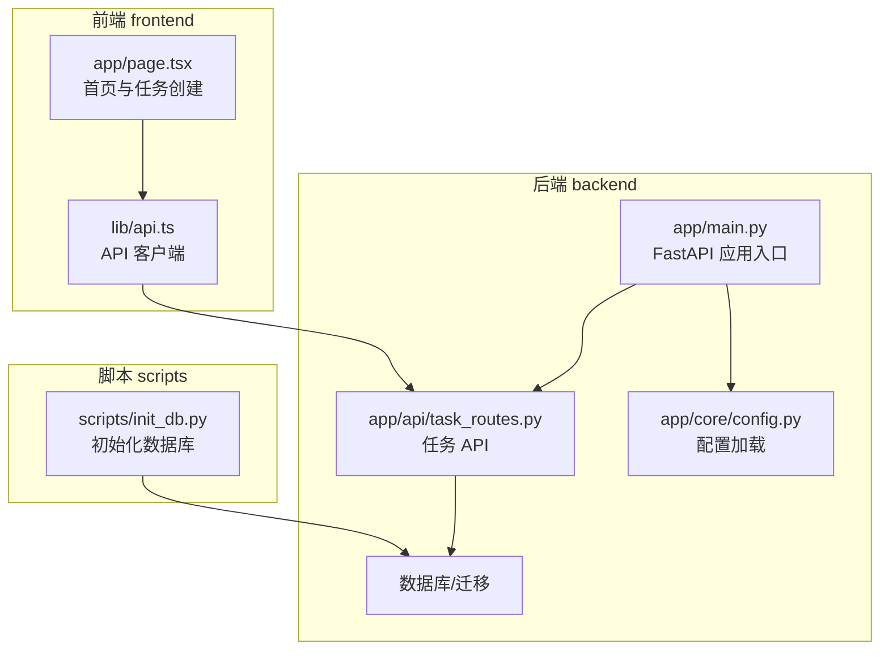
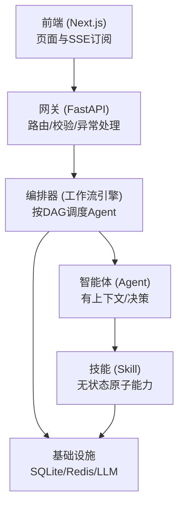
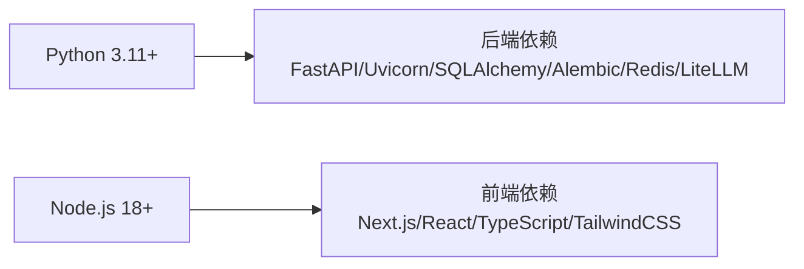
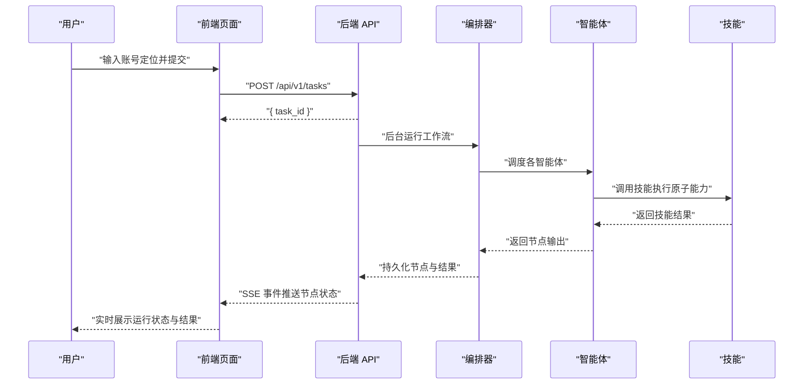

# 快速开始指南

<cite>
**本文引用的文件**
- [ARCHITECTURE.md](file://ARCHITECTURE.md)
- [start.sh](file://start.sh)
- [start.bat](file://start.bat)
- [backend/pyproject.toml](file://backend/pyproject.toml)
- [frontend/package.json](file://frontend/package.json)
- [backend/app/core/config.py](file://backend/app/core/config.py)
- [backend/app/main.py](file://backend/app/main.py)
- [scripts/init_db.py](file://scripts/init_db.py)
- [backend/alembic.ini](file://backend/alembic.ini)
- [backend/app/api/task_routes.py](file://backend/app/api/task_routes.py)
- [frontend/lib/api.ts](file://frontend/lib/api.ts)
- [frontend/app/page.tsx](file://frontend/app/page.tsx)
</cite>

## 目录
1. [简介](#简介)
2. [项目结构](#项目结构)
3. [核心组件](#核心组件)
4. [架构总览](#架构总览)
5. [详细组件分析](#详细组件分析)
6. [依赖分析](#依赖分析)
7. [性能考虑](#性能考虑)
8. [故障排查指南](#故障排查指南)
9. [结论](#结论)
10. [附录](#附录)

## 简介
本指南面向首次接触 HotClaw 的开发者，帮助你在 30 分钟内完成环境准备、依赖安装、数据库初始化与前后端启动，并通过一个“第一个任务”的完整示例，从输入账号定位到查看结果输出，快速理解系统基本功能与运行流程。

HotClaw 是一个“基于多智能体协作的公众号内容生产平台”。你只需输入一段账号定位描述，系统将自动完成从热点抓取、选题策划、标题生成、正文撰写到审核风控的全链路内容生产，并输出可编辑的文章草稿。系统采用前后端分离架构：前端使用 React/Next.js，后端使用 Python/FastAPI，通过 SSE 实时推送任务节点状态，支持可视化工作流与历史任务回放。

## 项目结构
HotClaw 仓库包含多个子项目与模块，本次快速开始聚焦于后端服务与前端界面的本地联调运行。核心目录与职责概览如下：
- backend：后端服务，基于 FastAPI，提供任务创建、工作流编排、SSE 事件推送等能力
- frontend：前端界面，基于 Next.js，负责任务创建、实时状态订阅、结果预览与导出
- scripts：辅助脚本，如数据库初始化
- 其他目录（如 OpenClaw-bot-review、manifests 等）为相关配套或参考模块，当前快速开始不涉及

图表来源
- [backend/app/main.py:1-142](file://backend/app/main.py#L1-L142)
- [backend/app/core/config.py:1-51](file://backend/app/core/config.py#L1-L51)
- [backend/app/api/task_routes.py:1-163](file://backend/app/api/task_routes.py#L1-L163)
- [frontend/lib/api.ts:1-110](file://frontend/lib/api.ts#L1-L110)
- [frontend/app/page.tsx:1-95](file://frontend/app/page.tsx#L1-L95)
- [scripts/init_db.py:1-16](file://scripts/init_db.py#L1-L16)

章节来源
- [ARCHITECTURE.md:1-200](file://ARCHITECTURE.md#L1-L200)

## 核心组件
- 后端应用入口与生命周期：后端通过 FastAPI 应用入口集中注册路由、中间件与异常处理，并在启动时自动创建数据库表，便于本地开发。
- 配置系统：通过环境变量加载数据库连接、Redis、LLM API、应用运行参数等，支持 SQLite 开发与 PostgreSQL 生产环境。
- 任务 API：提供创建任务、查询任务状态、获取节点明细、分页查询历史任务等接口，配合 SSE 推送节点事件。
- 前端 API 客户端：封装统一的请求与错误处理，简化前端对后端 API 的调用。
- 启动脚本：提供跨平台启动脚本，自动安装依赖、启动后端与前端服务，并在开发模式下启用热更新。

章节来源
- [backend/app/main.py:1-142](file://backend/app/main.py#L1-L142)
- [backend/app/core/config.py:1-51](file://backend/app/core/config.py#L1-L51)
- [backend/app/api/task_routes.py:1-163](file://backend/app/api/task_routes.py#L1-L163)
- [frontend/lib/api.ts:1-110](file://frontend/lib/api.ts#L1-L110)
- [start.sh:1-79](file://start.sh#L1-L79)
- [start.bat:1-74](file://start.bat#L1-L74)

## 架构总览
HotClaw 采用“前端 + 网关 + 编排器 + 智能体/技能 + 基础设施”的分层架构。前端通过 HTTP + SSE 与后端交互，后端通过统一网关接收请求，编排器按工作流调度智能体，智能体调用技能完成原子能力执行，最终生成草稿并持久化。

图表来源
- [ARCHITECTURE.md:37-78](file://ARCHITECTURE.md#L37-L78)
- [ARCHITECTURE.md:449-494](file://ARCHITECTURE.md#L449-L494)

## 详细组件分析

### 后端应用入口与生命周期
- 应用入口集中注册路由、CORS 中间件、全局异常处理与 SSE 事件头注入
- 在 lifespan 中自动创建数据库表，确保开发环境无需手动迁移
- 提供健康检查端点，便于启动后验证服务可用性

章节来源
- [backend/app/main.py:1-142](file://backend/app/main.py#L1-L142)

### 配置系统
- 通过 pydantic-settings 从 .env 文件加载配置，支持数据库 URL、Redis URL、LLM API、应用运行参数、超时设置等
- 开发环境默认使用 SQLite，生产环境可切换为 PostgreSQL

章节来源
- [backend/app/core/config.py:1-51](file://backend/app/core/config.py#L1-L51)

### 任务 API 与 SSE
- 任务创建接口立即返回任务 ID，后台异步运行工作流
- 任务状态查询与节点明细查询接口支持前端实时展示
- SSE 事件类型包括节点开始、进度、完成、错误等，前端通过 EventSource 订阅

章节来源
- [backend/app/api/task_routes.py:1-163](file://backend/app/api/task_routes.py#L1-L163)
- [ARCHITECTURE.md:325-360](file://ARCHITECTURE.md#L325-L360)

### 前端 API 客户端与首页
- API 客户端封装统一的请求与错误处理，便于前端调用后端接口
- 首页提供任务创建入口，创建成功后自动订阅任务事件流并在完成后拉取结果

章节来源
- [frontend/lib/api.ts:1-110](file://frontend/lib/api.ts#L1-L110)
- [frontend/app/page.tsx:1-95](file://frontend/app/page.tsx#L1-L95)

### 数据库初始化
- 提供脚本自动创建所有表，便于首次运行或重置开发环境
- 也可通过 Alembic 配置进行迁移管理（生产环境）

章节来源
- [scripts/init_db.py:1-16](file://scripts/init_db.py#L1-L16)
- [backend/alembic.ini:1-39](file://backend/alembic.ini#L1-L39)

## 依赖分析
- 后端依赖（Python 3.11+）：FastAPI、Uvicorn、SQLAlchemy/Async、Alembic、Redis、HTTPX、Structlog、Pydantic、YAML、SSE-Starlette、LiteLLM、Aiosqlite 等
- 前端依赖（Node.js 18+）：Next.js、React、TypeScript、TailwindCSS 等
- 跨平台启动脚本：自动检测环境、创建虚拟环境、安装依赖、启动后端与前端服务

图表来源
- [backend/pyproject.toml:1-41](file://backend/pyproject.toml#L1-L41)
- [frontend/package.json:1-23](file://frontend/package.json#L1-L23)

章节来源
- [backend/pyproject.toml:1-41](file://backend/pyproject.toml#L1-L41)
- [frontend/package.json:1-23](file://frontend/package.json#L1-L23)

## 性能考虑
- SSE 推送：前端通过 EventSource 订阅节点事件，避免轮询开销，提升实时性
- 异步执行：后端使用 asyncio 与异步数据库驱动，减少阻塞
- 降级策略：单节点失败时提供降级返回，保证整体链路不中断
- 缓存与超时：Redis 用于缓存，配置合理的 LLM/技能/代理超时，避免长时间等待

章节来源
- [ARCHITECTURE.md:325-360](file://ARCHITECTURE.md#L325-L360)
- [ARCHITECTURE.md:496-538](file://ARCHITECTURE.md#L496-L538)
- [backend/app/core/config.py:42-46](file://backend/app/core/config.py#L42-L46)

## 故障排查指南
- 端口占用
  - 后端默认监听 8000，前端默认监听 3000。若端口被占用，请调整配置或释放端口
- Python/Node.js 版本不满足
  - 后端要求 Python 3.11+，前端要求 Node.js 18+。请根据系统安装对应版本
- 数据库连接失败
  - 开发环境默认使用 SQLite；若切换至 PostgreSQL，请正确配置数据库 URL
- LLM API 无法访问
  - 检查 LLM API Key、Base URL 与网络连通性
- 启动脚本无法执行
  - Windows：确保以管理员权限运行批处理脚本；Linux/macOS：赋予脚本执行权限并使用 Bash
- 前端无法连接后端
  - 确认后端已启动且 CORS 配置允许前端域名；检查防火墙与代理设置

章节来源
- [backend/app/core/config.py:8-31](file://backend/app/core/config.py#L8-L31)
- [start.sh:11-24](file://start.sh#L11-L24)
- [start.bat:10-24](file://start.bat#L10-L24)

## 结论
通过本指南，你可以在 30 分钟内完成 HotClaw 的环境准备、依赖安装、数据库初始化与前后端启动，并成功运行第一个任务，从输入账号定位到查看结果输出。建议在完成基础验证后，进一步探索智能体与技能的配置页面，了解如何定制化你的内容生产流程。

## 附录

### 环境准备与版本要求
- Python：3.11+（后端）
- Node.js：18+（前端）
- 数据库：SQLite（开发）或 PostgreSQL（生产）
- Redis：用于缓存（可选）
- LLM：OpenAI 或兼容 API（可配置）

章节来源
- [backend/pyproject.toml:5](file://backend/pyproject.toml#L5)
- [frontend/package.json:15](file://frontend/package.json#L15)
- [backend/app/core/config.py:8-31](file://backend/app/core/config.py#L8-L31)

### 跨平台启动命令
- Linux/macOS
  - 使用脚本自动安装依赖并启动后端与前端
  - 后端访问地址：http://localhost:8000
  - 前端访问地址：http://localhost:3000
  - API 文档：http://localhost:8000/docs
- Windows
  - 使用批处理脚本自动安装依赖并启动后端与前端
  - 后端访问地址：http://localhost:8000
  - 前端访问地址：http://localhost:3000
  - API 文档：http://localhost:8000/docs

章节来源
- [start.sh:1-79](file://start.sh#L1-L79)
- [start.bat:1-74](file://start.bat#L1-L74)

### 数据库初始化
- 方式一：使用脚本自动创建所有表
- 方式二：使用 Alembic 进行迁移管理（生产环境推荐）

章节来源
- [scripts/init_db.py:1-16](file://scripts/init_db.py#L1-L16)
- [backend/alembic.ini:1-39](file://backend/alembic.ini#L1-L39)

### 第一个任务完整运行示例
- 步骤 1：启动后端与前端（参考“跨平台启动命令”）
- 步骤 2：打开前端页面，输入账号定位描述并提交
- 步骤 3：在任务运行页实时查看各节点状态（SSE 推送）
- 步骤 4：任务完成后，在结果页查看候选选题、标题、正文与审核结果
- 步骤 5：可下载或复制草稿，或在历史任务页回放

图表来源
- [frontend/app/page.tsx:38-49](file://frontend/app/page.tsx#L38-L49)
- [frontend/lib/api.ts:26-31](file://frontend/lib/api.ts#L26-L31)
- [backend/app/api/task_routes.py:19-51](file://backend/app/api/task_routes.py#L19-L51)
- [ARCHITECTURE.md:325-360](file://ARCHITECTURE.md#L325-L360)