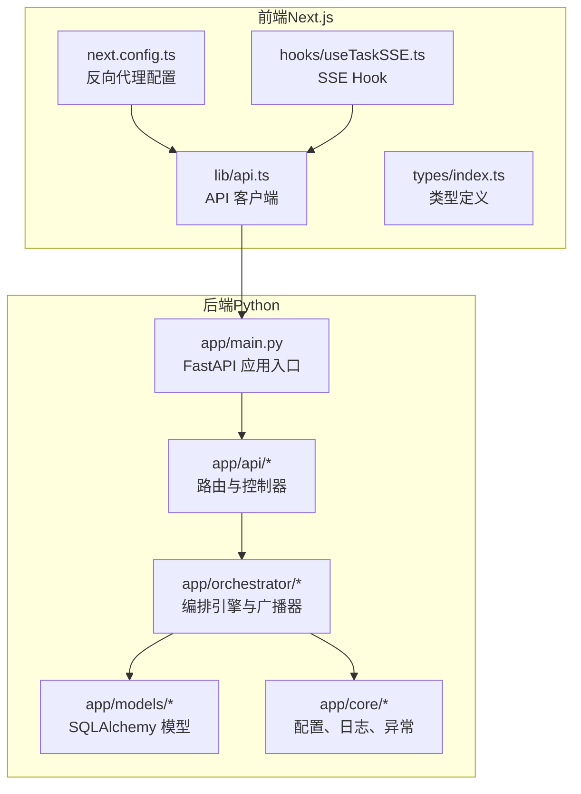
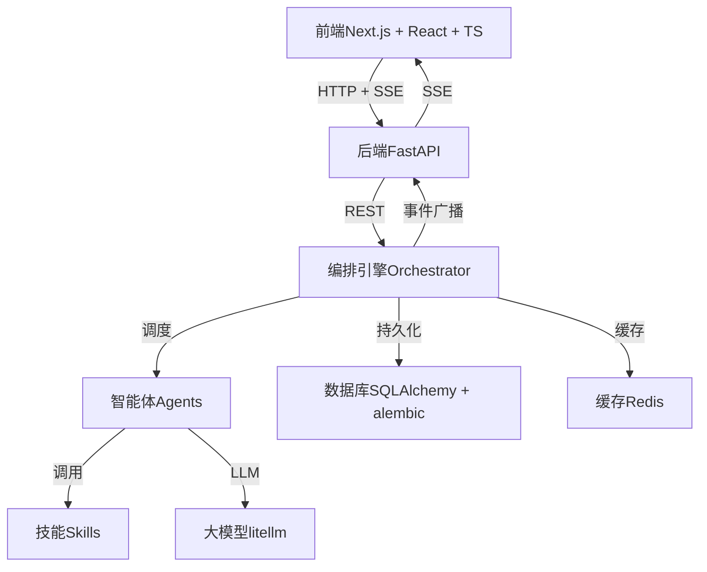
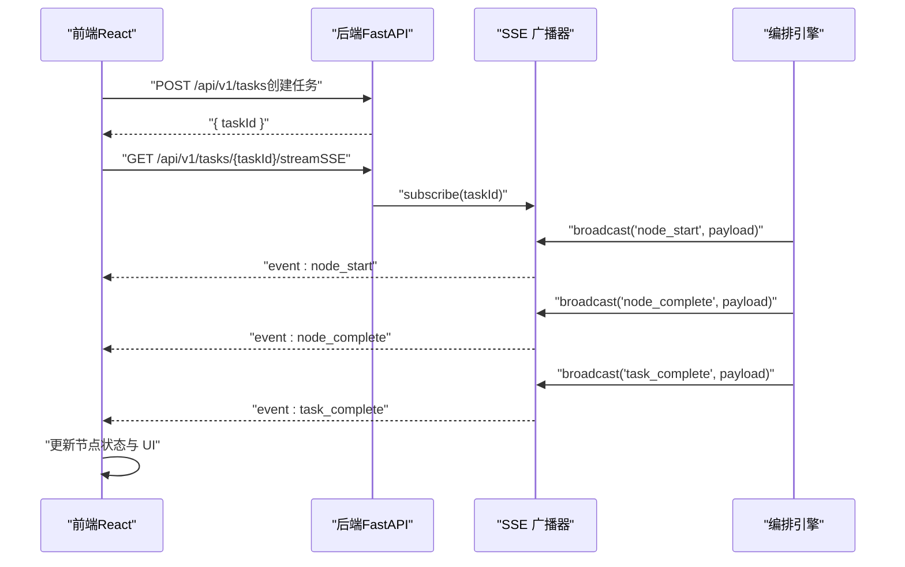
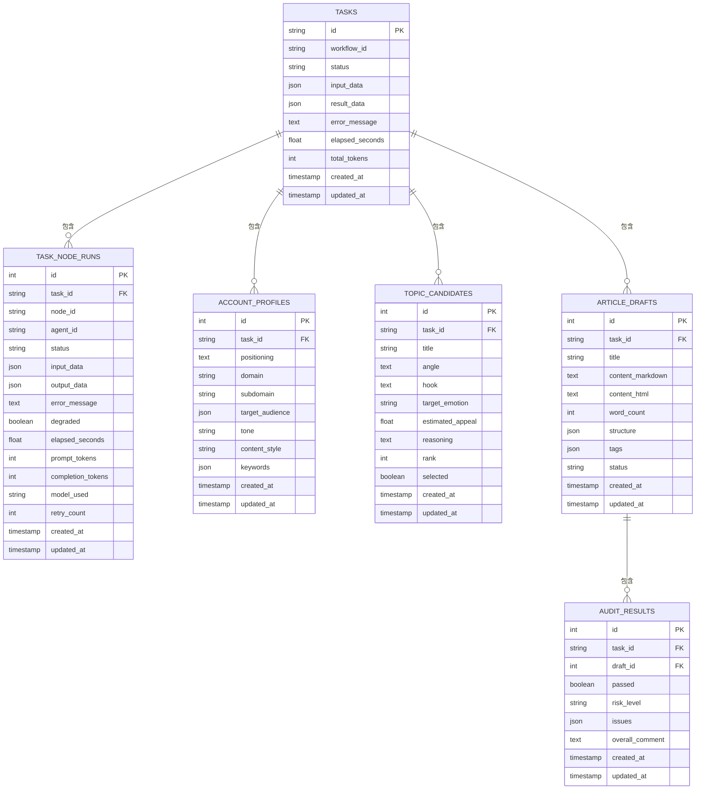
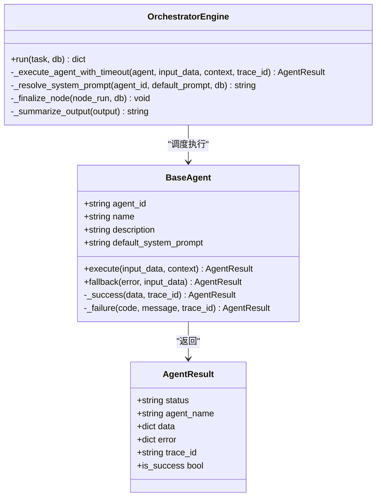
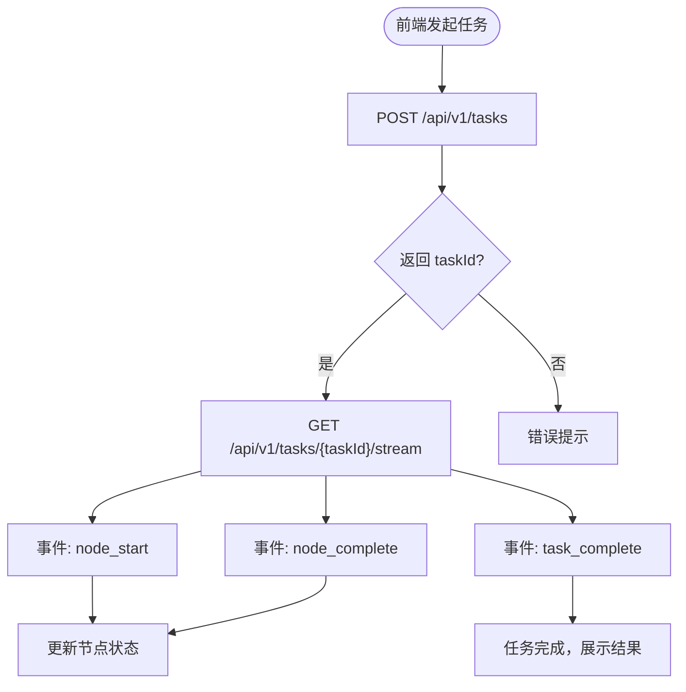
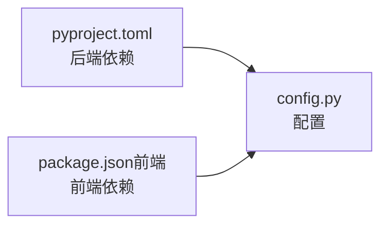

# 技术栈介绍

<cite>
**本文引用的文件**
- [pyproject.toml](file://backend/pyproject.toml)
- [package.json（前端）](file://frontend/package.json)
- [package.json（OpenClaw Bot Review）](file://OpenClaw-bot-review-main/package.json)
- [main.py（后端入口）](file://backend/app/main.py)
- [api.ts（前端 API 客户端）](file://frontend/lib/api.ts)
- [useTaskSSE.ts（前端 SSE Hook）](file://frontend/hooks/useTaskSSE.ts)
- [stream_routes.py（SSE 路由）](file://backend/app/api/stream_routes.py)
- [engine.py（编排引擎）](file://backend/app/orchestrator/engine.py)
- [tables.py（数据库模型）](file://backend/app/models/tables.py)
- [config.py（应用配置）](file://backend/app/core/config.py)
- [broadcaster.py（SSE 广播器）](file://backend/app/orchestrator/broadcaster.py)
- [base.py（Agent 基类）](file://backend/app/agents/base.py)
- [ARCHITECTURE.md（架构文档）](file://ARCHITECTURE.md)
- [next.config.ts（前端 Next 配置）](file://frontend/next.config.ts)
- [index.ts（前端类型定义）](file://frontend/types/index.ts)
- [start.sh（开发环境启动脚本）](file://start.sh)
- [start.bat（Windows 开发环境启动脚本）](file://start.bat)
</cite>

## 目录
1. [引言](#引言)
2. [项目结构](#项目结构)
3. [核心组件](#核心组件)
4. [架构总览](#架构总览)
5. [详细组件分析](#详细组件分析)
6. [依赖分析](#依赖分析)
7. [性能考虑](#性能考虑)
8. [故障排查指南](#故障排查指南)
9. [结论](#结论)
10. [附录](#附录)

## 引言
本文件面向 HotClaw 项目的开发者与技术管理者，系统性介绍后端与前端技术栈选型、实时通信（SSE）实现、开发环境配置以及学习路径与最佳实践。HotClaw 是一个“多智能体内容生产平台”，后端采用 Python 3.11+、FastAPI、SQLAlchemy、litellm、sse-starlette 等技术，前端采用 Next.js、React、TypeScript、TailwindCSS、Zustand 等技术，结合 SSE 实现实时状态推送。

## 项目结构
项目采用前后端分离架构，后端位于 backend 目录，前端位于 frontend 目录，另有 OpenClaw Bot Review 的前端子项目。整体目录组织如下：
- 后端：FastAPI 应用、数据库模型、编排引擎、SSE 广播器、配置与日志等模块
- 前端：Next.js 应用、API 客户端、SSE Hook、类型定义、UI 组件与状态管理

图表来源
- [main.py（后端入口）:1-142](file://backend/app/main.py#L1-L142)
- [stream_routes.py（SSE 路由）:1-43](file://backend/app/api/stream_routes.py#L1-L43)
- [engine.py（编排引擎）:1-285](file://backend/app/orchestrator/engine.py#L1-L285)
- [tables.py（数据库模型）:1-233](file://backend/app/models/tables.py#L1-L233)
- [next.config.ts（前端 Next 配置）:1-15](file://frontend/next.config.ts#L1-L15)
- [api.ts（前端 API 客户端）:1-110](file://frontend/lib/api.ts#L1-L110)
- [useTaskSSE.ts（前端 SSE Hook）:1-124](file://frontend/hooks/useTaskSSE.ts#L1-L124)

章节来源
- [main.py（后端入口）:1-142](file://backend/app/main.py#L1-L142)
- [ARCHITECTURE.md（架构文档）:1-200](file://ARCHITECTURE.md#L1-L200)

## 核心组件
- 后端框架与库
  - Python 3.11+：AI 生态与 LLM SDK 最佳支持
  - FastAPI：异步支持、自动 OpenAPI 文档、SSE 支持
  - SQLAlchemy 2.0 + alembic：异步 ORM 与迁移
  - litellm：统一多模型调用接口
  - sse-starlette：SSE 实现
  - structlog、pydantic-settings：结构化日志与配置校验
  - redis、aiosqlite：缓存与轻量数据库
- 前端框架与库
  - Next.js 16、React 19、TypeScript 5：现代前端开发
  - TailwindCSS 4：实用优先的样式框架
  - Zustand：轻量状态管理
  - 前端通过反向代理将 /api 转发至后端 8000 端口

章节来源
- [pyproject.toml（后端依赖）:1-41](file://backend/pyproject.toml#L1-L41)
- [package.json（前端）:1-23](file://frontend/package.json#L1-L23)
- [package.json（OpenClaw Bot Review）:1-23](file://OpenClaw-bot-review-main/package.json#L1-L23)
- [config.py（应用配置）:1-51](file://backend/app/core/config.py#L1-L51)
- [next.config.ts（前端 Next 配置）:1-15](file://frontend/next.config.ts#L1-L15)

## 架构总览
HotClaw 采用“前后端分离 + SSE 实时推送”的架构。后端通过 FastAPI 提供 REST 与 SSE 接口，编排引擎驱动多智能体工作流，数据库持久化任务与节点运行状态；前端通过 Next.js 与 React 实时消费 SSE 事件，展示任务执行状态与结果。

图表来源
- [ARCHITECTURE.md（架构文档）:37-78](file://ARCHITECTURE.md#L37-L78)
- [main.py（后端入口）:1-142](file://backend/app/main.py#L1-L142)
- [engine.py（编排引擎）:1-285](file://backend/app/orchestrator/engine.py#L1-L285)
- [broadcaster.py（SSE 广播器）:1-94](file://backend/app/orchestrator/broadcaster.py#L1-L94)
- [tables.py（数据库模型）:1-233](file://backend/app/models/tables.py#L1-L233)

## 详细组件分析

### 后端技术栈与选型理由
- Python 3.11+
  - 优势：AI 生态成熟、LLM SDK 最佳支持、类型注解与异步生态完善
- FastAPI
  - 优势：高性能异步、自动 OpenAPI 文档、SSE 内置支持、强类型 Pydantic 集成
- SQLAlchemy 2.0 + alembic
  - 优势：异步 ORM、类型安全、迁移工具完善
- litellm
  - 优势：统一多模型调用接口，简化 LLM 集成与切换
- sse-starlette
  - 优势：与 Starlette/ASGI 生态无缝集成，支持 EventSourceResponse
- structlog + pydantic-settings
  - 优势：结构化日志与配置校验，便于可观测与运维
- redis + aiosqlite
  - 优势：缓存与轻量数据库满足 MVP 需求

章节来源
- [pyproject.toml（后端依赖）:1-41](file://backend/pyproject.toml#L1-L41)
- [config.py（应用配置）:1-51](file://backend/app/core/config.py#L1-L51)
- [ARCHITECTURE.md（架构文档）:401-413](file://ARCHITECTURE.md#L401-L413)

### 前端技术栈与选型理由
- Next.js 16、React 19、TypeScript 5
  - 优势：现代 SSR/SSG、类型安全、生态成熟
- TailwindCSS 4
  - 优势：实用优先、快速样式迭代
- Zustand
  - 优势：轻量、无样板代码、适合中小型项目
- 前端通过 next.config.ts 将 /api 转发至后端 8000 端口，简化跨域与开发体验

章节来源
- [package.json（前端）:1-23](file://frontend/package.json#L1-L23)
- [next.config.ts（前端 Next 配置）:1-15](file://frontend/next.config.ts#L1-L15)
- [ARCHITECTURE.md（架构文档）:191-205](file://ARCHITECTURE.md#L191-L205)

### 实时通信（SSE）实现方案
- 后端
  - SSE 路由：/api/v1/tasks/{task_id}/stream 返回 EventSourceResponse
  - 广播器：SSEBroadcaster 维护订阅队列、事件缓冲与历史回放
  - 编排引擎：在节点开始/完成/失败时广播事件，最终发送 task_complete
- 前端
  - API 客户端：提供 getTaskStreamUrl(taskId)
  - SSE Hook：useTaskSSE 订阅事件，维护节点状态、任务完成与错误

图表来源
- [stream_routes.py（SSE 路由）:1-43](file://backend/app/api/stream_routes.py#L1-L43)
- [broadcaster.py（SSE 广播器）:1-94](file://backend/app/orchestrator/broadcaster.py#L1-L94)
- [engine.py（编排引擎）:1-285](file://backend/app/orchestrator/engine.py#L1-L285)
- [api.ts（前端 API 客户端）:1-110](file://frontend/lib/api.ts#L1-L110)
- [useTaskSSE.ts（前端 SSE Hook）:1-124](file://frontend/hooks/useTaskSSE.ts#L1-L124)

章节来源
- [stream_routes.py（SSE 路由）:1-43](file://backend/app/api/stream_routes.py#L1-L43)
- [broadcaster.py（SSE 广播器）:1-94](file://backend/app/orchestrator/broadcaster.py#L1-L94)
- [engine.py（编排引擎）:1-285](file://backend/app/orchestrator/engine.py#L1-L285)
- [api.ts（前端 API 客户端）:1-110](file://frontend/lib/api.ts#L1-L110)
- [useTaskSSE.ts（前端 SSE Hook）:1-124](file://frontend/hooks/useTaskSSE.ts#L1-L124)

### 数据模型与持久化
- 核心表：tasks、task_node_runs、account_profiles、topic_candidates、article_drafts、audit_results、agents、skills、workflow_templates、system_logs
- 字段覆盖任务生命周期、节点运行状态、输出摘要、耗时与 Token 统计、系统日志与追踪

图表来源
- [tables.py（数据库模型）:1-233](file://backend/app/models/tables.py#L1-L233)

章节来源
- [tables.py（数据库模型）:1-233](file://backend/app/models/tables.py#L1-L233)

### Agent 与工作流
- Agent 基类：统一输入输出、系统 Prompt 解析、成功/失败结果封装、降级策略
- 编排引擎：线性工作流（MVP），逐节点执行，广播事件，记录节点运行与 Token 消耗，支持降级与失败处理

图表来源
- [base.py（Agent 基类）:1-99](file://backend/app/agents/base.py#L1-L99)
- [engine.py（编排引擎）:1-285](file://backend/app/orchestrator/engine.py#L1-L285)

章节来源
- [base.py（Agent 基类）:1-99](file://backend/app/agents/base.py#L1-L99)
- [engine.py（编排引擎）:1-285](file://backend/app/orchestrator/engine.py#L1-L285)

### API 与前端交互
- 后端提供 /api/v1/* REST 接口，前端通过 lib/api.ts 统一请求
- 前端通过 useTaskSSE.ts 订阅 /api/v1/tasks/{taskId}/stream，接收节点状态变化
- 类型定义集中在 types/index.ts，确保前后端一致的数据契约

图表来源
- [api.ts（前端 API 客户端）:1-110](file://frontend/lib/api.ts#L1-L110)
- [useTaskSSE.ts（前端 SSE Hook）:1-124](file://frontend/hooks/useTaskSSE.ts#L1-L124)
- [stream_routes.py（SSE 路由）:1-43](file://backend/app/api/stream_routes.py#L1-L43)
- [index.ts（前端类型定义）:1-119](file://frontend/types/index.ts#L1-L119)

章节来源
- [api.ts（前端 API 客户端）:1-110](file://frontend/lib/api.ts#L1-L110)
- [useTaskSSE.ts（前端 SSE Hook）:1-124](file://frontend/hooks/useTaskSSE.ts#L1-L124)
- [index.ts（前端类型定义）:1-119](file://frontend/types/index.ts#L1-L119)

## 依赖分析
- 后端依赖
  - FastAPI、uvicorn：Web 服务与 ASGI
  - SQLAlchemy[asyncio]、asyncpg、aiosqlite、alembic：异步 ORM 与迁移
  - litellm、httpx：LLM 调用与 HTTP 客户端
  - sse-starlette：SSE 实现
  - structlog、pyyaml、pydantic、pydantic-settings：日志、配置与校验
  - redis：缓存
- 前端依赖
  - next、react、react-dom、typescript、tailwindcss
  - 通过 next.config.ts 将 /api 转发至后端

图表来源
- [pyproject.toml（后端依赖）:1-41](file://backend/pyproject.toml#L1-L41)
- [package.json（前端）:1-23](file://frontend/package.json#L1-L23)
- [config.py（应用配置）:1-51](file://backend/app/core/config.py#L1-L51)

章节来源
- [pyproject.toml（后端依赖）:1-41](file://backend/pyproject.toml#L1-L41)
- [package.json（前端）:1-23](file://frontend/package.json#L1-L23)
- [config.py（应用配置）:1-51](file://backend/app/core/config.py#L1-L51)

## 性能考虑
- 异步优先：后端使用 asyncio 与异步 ORM，减少阻塞
- SSE 保活：后端定时发送注释消息维持连接，避免中间件断开
- 事件缓冲：SSE 广播器对历史事件进行缓冲，解决前端晚到问题
- 超时控制：编排引擎对 Agent 执行设置超时，防止阻塞
- 日志与追踪：结构化日志与 trace_id 便于定位性能瓶颈
- 前端渲染：Next.js SSR/SSG 与 TailwindCSS 减少首屏等待

章节来源
- [engine.py（编排引擎）:1-285](file://backend/app/orchestrator/engine.py#L1-L285)
- [broadcaster.py（SSE 广播器）:1-94](file://backend/app/orchestrator/broadcaster.py#L1-L94)
- [config.py（应用配置）:1-51](file://backend/app/core/config.py#L1-L51)
- [ARCHITECTURE.md（架构文档）:401-413](file://ARCHITECTURE.md#L401-L413)

## 故障排查指南
- 健康检查
  - 后端提供 /api/v1/health，确认服务可用
- 异常处理
  - 全局 HotClawError 映射不同 HTTP 状态码
  - 未捕获异常统一返回 500，并在调试模式下返回错误详情
- SSE 连接
  - 检查 /api/v1/tasks/{taskId}/stream 是否可达
  - 确认编排引擎已广播事件且未提前关闭任务流
- 前端代理
  - 确认 next.config.ts 的 /api 重写指向后端地址
- 数据库
  - 开发环境自动创建表；生产环境使用 alembic 迁移

章节来源
- [main.py（后端入口）:139-142](file://backend/app/main.py#L139-L142)
- [main.py（异常处理）:87-129](file://backend/app/main.py#L87-L129)
- [stream_routes.py（SSE 路由）:1-43](file://backend/app/api/stream_routes.py#L1-L43)
- [broadcaster.py（SSE 广播器）:70-84](file://backend/app/orchestrator/broadcaster.py#L70-L84)
- [next.config.ts（前端 Next 配置）:1-15](file://frontend/next.config.ts#L1-L15)

## 结论
HotClaw 的技术栈围绕“高性能异步 + 实时推送 + 结构化配置”展开：后端以 FastAPI + SQLAlchemy + litellm + sse-starlette 构建，前端以 Next.js + React + TypeScript + Zustand 构建，二者通过 SSE 实现低延迟状态同步。该组合在 MVP 阶段具备开发效率高、可维护性强、扩展性良好等优势。

## 附录

### 开发环境配置指南
- 环境要求
  - Python 3.11+、Node.js 18+
- 后端
  - 进入 backend 目录，创建并激活虚拟环境，安装依赖
  - 使用 uvicorn 启动 FastAPI 应用（默认 0.0.0.0:8000）
- 前端
  - 进入 frontend 目录，安装依赖
  - 通过 npm run dev 启动 Next.js 开发服务器（默认 3000 端口）
- 启动脚本
  - Linux/macOS：使用 start.sh 一键安装依赖并启动前后端
  - Windows：使用 start.bat 一键启动前后端并打开浏览器

章节来源
- [start.sh（开发环境启动脚本）:1-79](file://start.sh#L1-L79)
- [start.bat（Windows 开发环境启动脚本）:1-74](file://start.bat#L1-L74)
- [config.py（应用配置）:1-51](file://backend/app/core/config.py#L1-L51)

### 学习路径建议
- 初学者
  - 后端：Python 语法 → FastAPI 基础 → SQLAlchemy ORM → SSE 与异步编程
  - 前端：React/Next.js 基础 → TypeScript → TailwindCSS → Zustand
- 经验开发者
  - 后端：深入理解编排引擎与 Agent/ Skill 机制，关注 SSE 广播器与事件缓冲策略
  - 前端：结合 useTaskSSE.ts 优化事件消费与状态管理，提升用户体验

章节来源
- [ARCHITECTURE.md（架构文档）:191-205](file://ARCHITECTURE.md#L191-L205)
- [engine.py（编排引擎）:1-285](file://backend/app/orchestrator/engine.py#L1-L285)
- [useTaskSSE.ts（前端 SSE Hook）:1-124](file://frontend/hooks/useTaskSSE.ts#L1-L124)